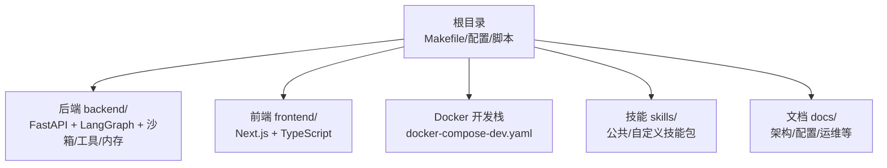
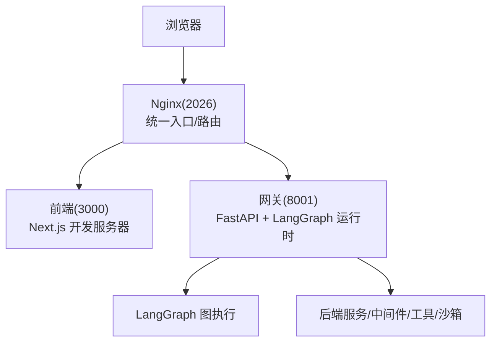
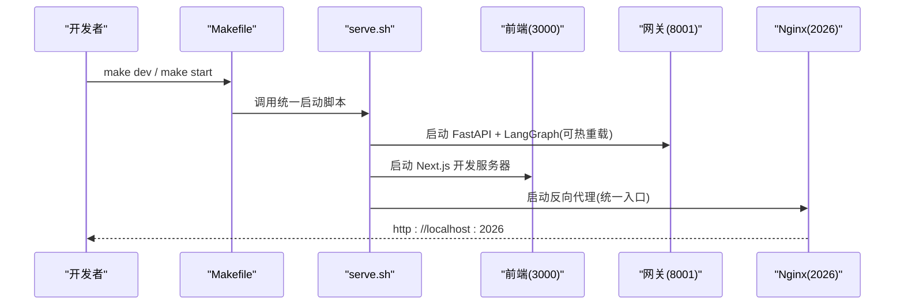
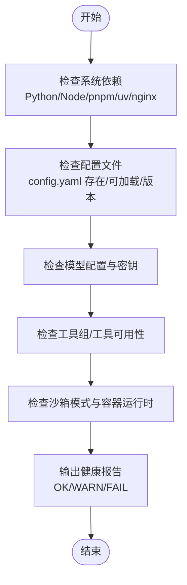
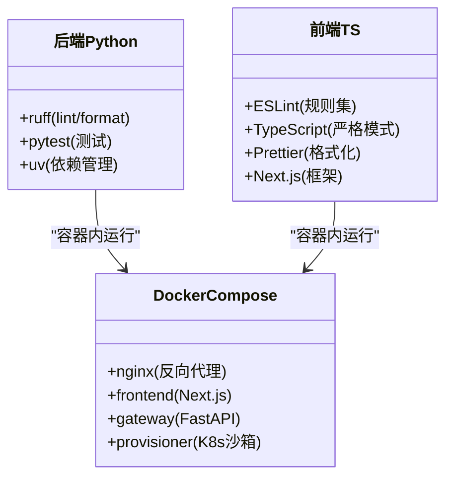
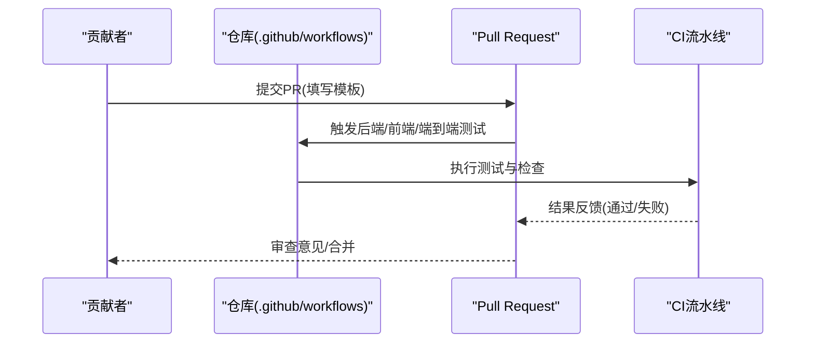
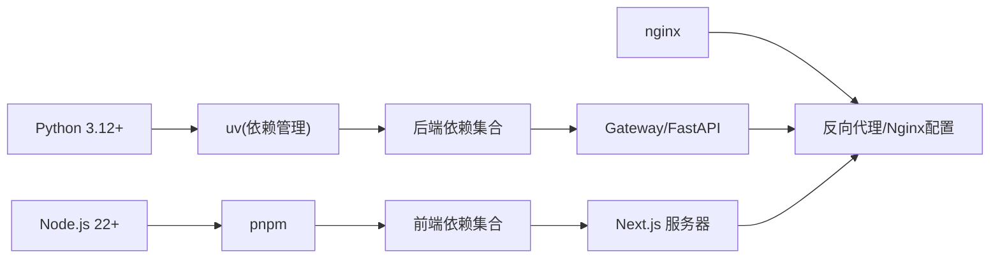

# 开发指南

<cite>
**本文引用的文件**
- [CONTRIBUTING.md](file://CONTRIBUTING.md)
- [CODE_OF_CONDUCT.md](file://CODE_OF_CONDUCT.md)
- [.github/pull_request_template.md](file://.github/pull_request_template.md)
- [.github/copilot-instructions.md](file://.github/copilot-instructions.md)
- [backend/pyproject.toml](file://backend/pyproject.toml)
- [frontend/package.json](file://frontend/package.json)
- [backend/ruff.toml](file://backend/ruff.toml)
- [frontend/eslint.config.js](file://frontend/eslint.config.js)
- [frontend/prettier.config.js](file://frontend/prettier.config.js)
- [Makefile](file://Makefile)
- [scripts/check.sh](file://scripts/check.sh)
- [backend/Makefile](file://backend/Makefile)
- [scripts/serve.sh](file://scripts/serve.sh)
- [scripts/setup_wizard.py](file://scripts/setup_wizard.py)
- [scripts/doctor.py](file://scripts/doctor.py)
- [docker/docker-compose-dev.yaml](file://docker/docker-compose-dev.yaml)
- [frontend/tsconfig.json](file://frontend/tsconfig.json)
- [backend/docs/CONFIGURATION.md](file://backend/docs/CONFIGURATION.md)
</cite>

## 目录
1. [简介](#简介)
2. [项目结构](#项目结构)
3. [核心组件](#核心组件)
4. [架构总览](#架构总览)
5. [详细组件分析](#详细组件分析)
6. [依赖关系分析](#依赖关系分析)
7. [性能考虑](#性能考虑)
8. [故障排查指南](#故障排查指南)
9. [结论](#结论)
10. [附录](#附录)

## 简介
本开发指南面向 DeerFlow 贡献者与维护者，系统性阐述开发规范（代码风格、提交规范、代码审查、版本发布）、贡献流程（问题报告、功能请求、社区参与、协作工具）、开发环境配置（IDE、调试、性能分析、代码质量工具）、最佳实践与重构建议，以及团队协作模式。内容基于仓库现有配置与脚本，确保可操作、可落地。

## 项目结构
DeerFlow 采用前后端分离与多语言混合的工程组织方式：后端基于 Python 与 FastAPI，前端基于 Next.js 16 + TypeScript；通过统一入口脚本与 Makefile 协调本地开发与 Docker 开发环境；配置与技能目录位于根路径，便于运行时发现与加载。

图示来源
- [Makefile:1-163](file://Makefile#L1-L163)
- [docker/docker-compose-dev.yaml:1-197](file://docker/docker-compose-dev.yaml#L1-L197)

章节来源
- [Makefile:1-163](file://Makefile#L1-L163)
- [CONTRIBUTING.md:217-245](file://CONTRIBUTING.md#L217-L245)

## 核心组件
- 统一开发命令与编排：根级 Makefile 提供安装、检查、启动、停止、清理、Docker 命令等；后端/前端各自提供子 Makefile 与脚本。
- 后端服务：Gateway API（FastAPI）+ LangGraph 兼容运行时，支持热重载与生产模式。
- 前端应用：Next.js 开发服务器与反向代理（Nginx），统一入口端口 2026。
- 配置与校验：交互式设置向导、健康检查脚本、配置升级工具。
- 容器化开发：Docker Compose 定义网关、前端、Nginx、可选 provisioner（K8s 沙箱管理）。

章节来源
- [Makefile:1-163](file://Makefile#L1-L163)
- [scripts/serve.sh:1-404](file://scripts/serve.sh#L1-L404)
- [scripts/doctor.py:1-722](file://scripts/doctor.py#L1-L722)
- [docker/docker-compose-dev.yaml:1-197](file://docker/docker-compose-dev.yaml#L1-L197)

## 架构总览
本地开发采用“前端 + 网关 + 反向代理”的三层路由：浏览器 → Nginx（统一入口与路由）→ 前端或网关；网关提供 REST API 与 LangGraph 兼容接口，支持热重载与守护进程模式。

图示来源
- [CONTRIBUTING.md:247-255](file://CONTRIBUTING.md#L247-L255)
- [scripts/serve.sh:360-394](file://scripts/serve.sh#L360-L394)

章节来源
- [CONTRIBUTING.md:247-255](file://CONTRIBUTING.md#L247-L255)
- [scripts/serve.sh:360-394](file://scripts/serve.sh#L360-L394)

## 详细组件分析

### 开发环境与启动流程
- 本地开发（推荐）：使用根级 Makefile 的 dev/start 模式，自动拉起前端、网关、Nginx，并支持热重载与守护进程。
- Docker 开发：通过 docker-compose-dev.yaml 启动容器，按需启用 provisioner（K8s 沙箱管理）。
- 健康检查与诊断：doctor 脚本对系统、配置、模型、网络能力、沙箱等进行综合检查。
- 一键配置：setup_wizard 提供交互式配置生成，覆盖 LLM、搜索、执行模式等。

图示来源
- [Makefile:94-112](file://Makefile#L94-L112)
- [scripts/serve.sh:360-394](file://scripts/serve.sh#L360-L394)

章节来源
- [Makefile:94-112](file://Makefile#L94-L112)
- [scripts/serve.sh:1-404](file://scripts/serve.sh#L1-L404)
- [scripts/doctor.py:632-722](file://scripts/doctor.py#L632-L722)
- [scripts/setup_wizard.py:1-166](file://scripts/setup_wizard.py#L1-L166)

### 配置与校验
- 配置文件：config.yaml 放置于项目根目录，支持环境变量注入与版本升级；提供配置示例与最佳实践。
- 交互式配置：setup_wizard 自动写入 config.yaml 与 .env，并提示下一步命令。
- 健康检查：doctor 对 Python/Node/pnpm/uv/nginx、配置存在性/可加载性、模型与工具可用性、沙箱模式、前端环境等进行检查，输出修复建议。

图示来源
- [scripts/doctor.py:632-722](file://scripts/doctor.py#L632-L722)
- [scripts/setup_wizard.py:80-127](file://scripts/setup_wizard.py#L80-L127)
- [backend/docs/CONFIGURATION.md:1-410](file://backend/docs/CONFIGURATION.md#L1-L410)

章节来源
- [scripts/doctor.py:632-722](file://scripts/doctor.py#L632-L722)
- [scripts/setup_wizard.py:80-127](file://scripts/setup_wizard.py#L80-L127)
- [backend/docs/CONFIGURATION.md:1-410](file://backend/docs/CONFIGURATION.md#L1-L410)

### 代码风格与质量工具
- 后端（Python）
  - 使用 ruff 进行 lint 与格式化，支持行长度、导入顺序与双引号等规则。
  - Makefile 提供 lint/format 命令，CI 等效流程由 pyproject.toml 与 ruff.toml 定义。
- 前端（TypeScript/Next.js）
  - 使用 ESLint + TypeScript ESLint + Prettier；TS 配置严格，路径别名与模块解析明确。
  - 前端 package.json 提供格式化、类型检查、单元测试与 E2E 测试脚本。
- Docker 与脚本
  - Docker Compose 定义开发容器拓扑；dev-entrypoint.sh 与 serve.sh 负责容器内启动逻辑与卷挂载。

图示来源
- [backend/ruff.toml:1-14](file://backend/ruff.toml#L1-L14)
- [backend/pyproject.toml:1-58](file://backend/pyproject.toml#L1-L58)
- [frontend/eslint.config.js:1-96](file://frontend/eslint.config.js#L1-L96)
- [frontend/prettier.config.js:1-5](file://frontend/prettier.config.js#L1-L5)
- [frontend/tsconfig.json:1-46](file://frontend/tsconfig.json#L1-L46)
- [docker/docker-compose-dev.yaml:1-197](file://docker/docker-compose-dev.yaml#L1-L197)

章节来源
- [backend/ruff.toml:1-14](file://backend/ruff.toml#L1-L14)
- [backend/pyproject.toml:1-58](file://backend/pyproject.toml#L1-L58)
- [frontend/eslint.config.js:1-96](file://frontend/eslint.config.js#L1-L96)
- [frontend/prettier.config.js:1-5](file://frontend/prettier.config.js#L1-L5)
- [frontend/tsconfig.json:1-46](file://frontend/tsconfig.json#L1-L46)
- [docker/docker-compose-dev.yaml:1-197](file://docker/docker-compose-dev.yaml#L1-L197)

### 提交流程与代码审查
- 分支与变更：从主干创建特性分支，保持小步提交，配合热重载与本地验证。
- 格式化与测试：后端使用 ruff，前端使用 Prettier + ESLint + 类型检查；PR 触发 CI 流水线。
- PR 模板：提供变更动机、影响范围、截图/录制、回归验证等字段，帮助审阅者聚焦重点。

图示来源
- [.github/pull_request_template.md:1-62](file://.github/pull_request_template.md#L1-L62)
- [CONTRIBUTING.md:306-313](file://CONTRIBUTING.md#L306-L313)

章节来源
- [.github/pull_request_template.md:1-62](file://.github/pull_request_template.md#L1-L62)
- [CONTRIBUTING.md:257-289](file://CONTRIBUTING.md#L257-L289)
- [CONTRIBUTING.md:306-313](file://CONTRIBUTING.md#L306-L313)

### 贡献流程与社区规范
- 问题报告：参考 Issues 模板与讨论区，先检索再提问。
- 功能请求：在 Discussions 或 Issues 中描述背景、痛点与预期收益。
- 社区参与：遵循行为准则，尊重多样性与包容性，维护健康社区生态。
- 协作工具：GitHub Issues/PR/Discussions，Copilot 指南作为默认操作手册。

章节来源
- [CONTRIBUTING.md:326-335](file://CONTRIBUTING.md#L326-L335)
- [CODE_OF_CONDUCT.md:1-129](file://CODE_OF_CONDUCT.md#L1-L129)
- [.github/copilot-instructions.md:1-214](file://.github/copilot-instructions.md#L1-L214)

### 版本发布策略
- 发布前：确保后端 lint 与测试通过，前端构建与关键测试通过；必要时进行端到端验证。
- 发布介质：Docker 生产镜像与部署脚本；根级 Makefile 提供 up/down 命令。
- 回归检查：PR 触发的 CI 流水线覆盖后端单元测试、前端单元测试与端到端测试。

章节来源
- [Makefile:156-163](file://Makefile#L156-L163)
- [CONTRIBUTING.md:306-313](file://CONTRIBUTING.md#L306-L313)

## 依赖关系分析
- 工具链依赖：Node.js 22+、pnpm、uv、nginx；脚本 check.sh 与 Makefile 的 check 目标用于检测。
- 后端依赖：FastAPI、LangGraph、SSE、通道 SDK、bcrypt、PyJWT 等；dev 分组包含 pytest、ruff。
- 前端依赖：Next.js、Radix UI、Tailwind、React、LangChain、Zod 等；开发依赖包括 ESLint、Prettier、Playwright、Vitest。
- Docker 依赖：Nginx、Node/Python 运行时镜像、可选 K8s provisioner。

图示来源
- [scripts/check.sh:1-86](file://scripts/check.sh#L1-L86)
- [backend/pyproject.toml:1-58](file://backend/pyproject.toml#L1-L58)
- [frontend/package.json:1-118](file://frontend/package.json#L1-L118)
- [docker/docker-compose-dev.yaml:64-84](file://docker/docker-compose-dev.yaml#L64-L84)

章节来源
- [scripts/check.sh:1-86](file://scripts/check.sh#L1-L86)
- [backend/pyproject.toml:1-58](file://backend/pyproject.toml#L1-L58)
- [frontend/package.json:1-118](file://frontend/package.json#L1-L118)
- [docker/docker-compose-dev.yaml:64-84](file://docker/docker-compose-dev.yaml#L64-L84)

## 性能考虑
- 热重载与守护：开发模式下前端与网关热重载提升迭代效率；守护模式适合长期运行与日志收集。
- 容器隔离：Docker 沙箱提供更强隔离，适合复杂工具链与多用户场景；本地沙箱更轻量但安全性较低。
- 资源建议：根据工作负载选择主机资源，避免过低配置导致启动失败或无响应。
- I/O 检测：提供静态阻塞 I/O 检测脚本与边界点检测，帮助识别潜在性能瓶颈。

章节来源
- [CONTRIBUTING.md:80-91](file://CONTRIBUTING.md#L80-L91)
- [backend/Makefile:23-25](file://backend/Makefile#L23-L25)
- [scripts/serve.sh:233-237](file://scripts/serve.sh#L233-L237)

## 故障排查指南
- 依赖缺失：使用 make check 或 scripts/check.sh 核对 Node/pnpm/uv/nginx。
- 权限问题（Linux Docker）：将当前用户加入 docker 组，重新登录生效。
- 配置错误：使用 make doctor 逐项检查配置版本、模型密钥、工具可用性与沙箱模式。
- 端口占用：serve.sh 内置端口监听检查与强制清理逻辑，必要时手动释放端口。
- Docker 启动失败：确认镜像拉取、卷挂载、网络与 K8s 权限（如使用 provisioner）。

章节来源
- [scripts/check.sh:1-86](file://scripts/check.sh#L1-L86)
- [CONTRIBUTING.md:92-125](file://CONTRIBUTING.md#L92-L125)
- [scripts/doctor.py:632-722](file://scripts/doctor.py#L632-L722)
- [scripts/serve.sh:176-190](file://scripts/serve.sh#L176-L190)
- [docker/docker-compose-dev.yaml:16-61](file://docker/docker-compose-dev.yaml#L16-L61)

## 结论
本指南基于仓库现有配置与脚本，提供了从环境搭建、代码风格、提交与审查、到发布与运维的完整开发流程。建议贡献者在提交前完成本地 lint/测试/构建验证，并遵循 PR 模板与行为准则，共同维护高质量、可持续演进的 DeerFlow 项目。

## 附录

### 开发环境配置清单
- 必备工具：Node.js 22+、pnpm、uv、nginx
- 依赖安装：make install 或分别进入 backend/frontend 执行安装
- 启动服务：make dev（开发）或 make start（生产）
- Docker 开发：make docker-start（按 config.yaml 模式启动）

章节来源
- [scripts/check.sh:1-86](file://scripts/check.sh#L1-L86)
- [Makefile:73-81](file://Makefile#L73-L81)
- [Makefile:94-112](file://Makefile#L94-L112)
- [CONTRIBUTING.md:9-71](file://CONTRIBUTING.md#L9-L71)

### 代码风格与测试命令速查
- 后端
  - 格式化与检查：make format / make lint
  - 测试：make test（含阻塞 I/O 检测）
- 前端
  - 格式化：pnpm format:write
  - Lint/类型检查：pnpm lint / pnpm typecheck
  - 单元测试：pnpm test
  - 端到端测试：pnpm test:e2e

章节来源
- [backend/Makefile:16-25](file://backend/Makefile#L16-L25)
- [frontend/package.json:6-20](file://frontend/package.json#L6-L20)

### 配置与升级
- 初次配置：make setup（交互式）或 make config（复制示例）
- 配置升级：make config-upgrade（合并新字段，保留旧值）
- 健康检查：make doctor（综合诊断）

章节来源
- [Makefile:62-67](file://Makefile#L62-L67)
- [Makefile:65-67](file://Makefile#L65-L67)
- [scripts/doctor.py:632-722](file://scripts/doctor.py#L632-L722)