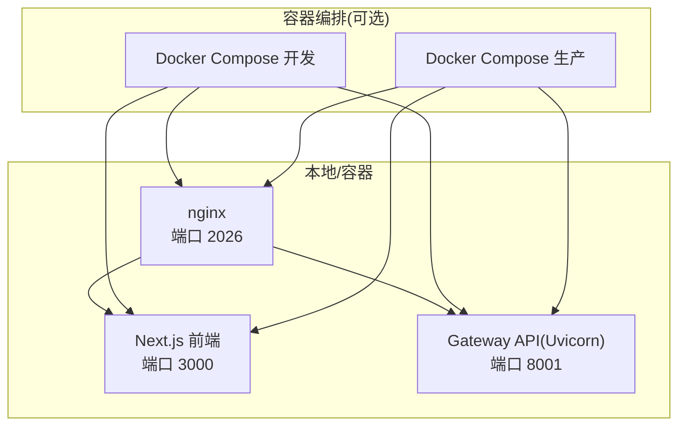
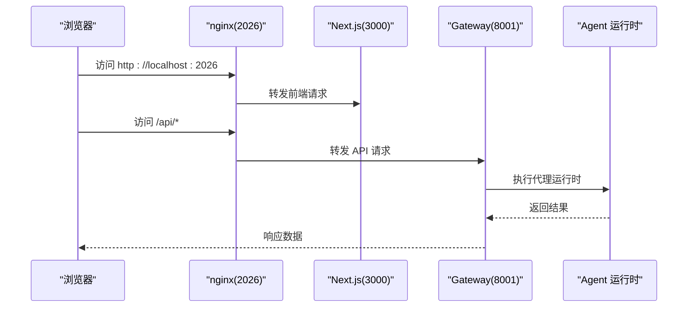
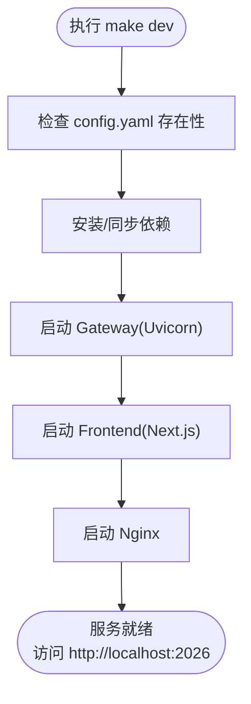
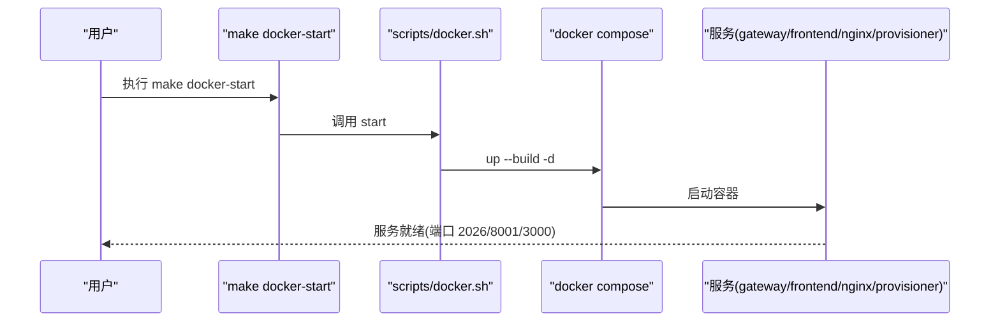
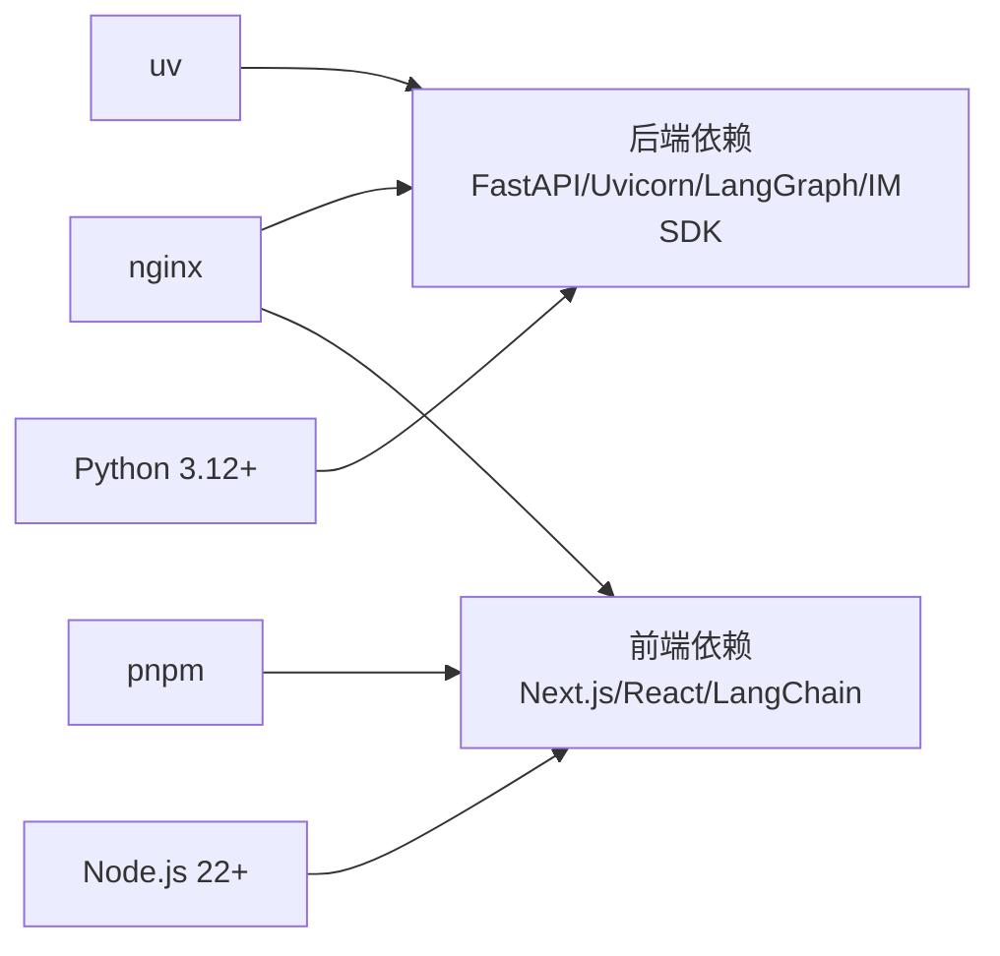

# 快速开始

<cite>
**本文引用的文件**
- [Install.md](file://Install.md)
- [README.md](file://README.md)
- [Makefile](file://Makefile)
- [scripts/serve.sh](file://scripts/serve.sh)
- [scripts/docker.sh](file://scripts/docker.sh)
- [scripts/deploy.sh](file://scripts/deploy.sh)
- [scripts/check.py](file://scripts/check.py)
- [scripts/doctor.py](file://scripts/doctor.py)
- [scripts/configure.py](file://scripts/configure.py)
- [config.example.yaml](file://config.example.yaml)
- [docker/docker-compose-dev.yaml](file://docker/docker-compose-dev.yaml)
- [backend/pyproject.toml](file://backend/pyproject.toml)
- [frontend/package.json](file://frontend/package.json)
</cite>

## 目录
1. [简介](#简介)
2. [项目结构](#项目结构)
3. [核心组件](#核心组件)
4. [架构总览](#架构总览)
5. [详细组件分析](#详细组件分析)
6. [依赖关系分析](#依赖关系分析)
7. [性能考虑](#性能考虑)
8. [故障排除指南](#故障排除指南)
9. [结论](#结论)
10. [附录](#附录)

## 简介
本指南面向首次接触 DeerFlow 2.0 的用户，帮助你在最短时间内完成环境准备、配置生成、服务启动与验证。文档覆盖以下目标：
- 明确环境要求（Python 3.12+、Node.js 22+、uv、nginx）与可选工具（Docker）
- 交互式配置向导的使用方法（LLM 提供商、Web 搜索、执行与安全偏好）
- 两种启动方式：Docker 开发模式与本地开发模式
- 常见问题排查与故障排除建议

## 项目结构
DeerFlow 采用前后端分离与统一入口反向代理的组织方式：
- 后端（FastAPI + Uvicorn）：提供网关 API 与代理运行时
- 前端（Next.js）：开发态热重载，生产态静态构建
- 反向代理（nginx）：统一入口，路由到前端与后端
- Docker Compose：开发与生产环境编排

图表来源
- [scripts/serve.sh:365-378](file://scripts/serve.sh#L365-L378)
- [scripts/docker.sh:224-315](file://scripts/docker.sh#L224-L315)
- [scripts/deploy.sh:293-304](file://scripts/deploy.sh#L293-L304)

章节来源
- [README.md:205-304](file://README.md#L205-L304)
- [Makefile:19-48](file://Makefile#L19-L48)

## 核心组件
- 环境检测与安装
  - make check：检查 Node.js 22+、pnpm、uv、nginx 是否就绪
  - make install：同步后端依赖（uv sync）、前端依赖（pnpm install）、安装 pre-commit
- 配置生成
  - make setup：交互式配置向导，生成 config.yaml 与 .env
  - make config：复制完整模板（config.example.yaml）为 config.yaml
- 服务启动
  - make dev：本地开发（热重载），自动拉起 Gateway、Frontend、Nginx
  - make docker-start：Docker 开发模式，按 config.yaml 自动识别沙箱模式
- 健康检查
  - make doctor：综合检查系统、配置、LLM、Web 能力、沙箱等

章节来源
- [Makefile:68-124](file://Makefile#L68-L124)
- [scripts/check.py:60-166](file://scripts/check.py#L60-L166)
- [scripts/doctor.py:632-721](file://scripts/doctor.py#L632-L721)
- [scripts/configure.py:20-54](file://scripts/configure.py#L20-L54)

## 架构总览
下图展示从浏览器到后端运行时的关键路径，以及两种启动模式的差异。

图表来源
- [scripts/serve.sh:380-394](file://scripts/serve.sh#L380-L394)
- [README.md:298-304](file://README.md#L298-L304)

章节来源
- [README.md:205-304](file://README.md#L205-L304)

## 详细组件分析

### 环境要求与前置条件
- Python 3.12+
- Node.js 22+
- uv（包管理器）
- nginx（反向代理）
- Docker（可选，用于容器化沙箱或生产部署）

章节来源
- [backend/pyproject.toml:6-6](file://backend/pyproject.toml#L6-L6)
- [frontend/package.json:1-118](file://frontend/package.json#L1-L118)
- [scripts/check.py:132-144](file://scripts/check.py#L132-L144)
- [README.md:5-6](file://README.md#L5-L6)

### 安装与初始化
- 克隆仓库并进入根目录
- 运行 make check 校验环境
- 运行 make install 安装依赖
- 运行 make setup 生成最小化配置（推荐）或 make config 复制完整模板

章节来源
- [Install.md:36-56](file://Install.md#L36-L56)
- [Makefile:68-81](file://Makefile#L68-L81)
- [scripts/check.py:147-166](file://scripts/check.py#L147-L166)
- [scripts/configure.py:20-54](file://scripts/configure.py#L20-L54)

### 配置向导（make setup）
交互式向导会引导你完成以下配置：
- 选择 LLM 提供商（支持多种 OpenAI 兼容/专用提供商）
- 可选：配置 Web 搜索与 Web 抓取（如 DuckDuckGo、Serper、Tavily、InfoQuest、Exa、Firecrawl 等）
- 执行与安全偏好（沙箱模式：本地/容器/AIO；是否允许主机 bash；是否启用文件写入工具）

生成文件：
- config.yaml：应用配置（模型、工具、沙箱、子代理等）
- .env：API 密钥与环境变量占位
- frontend/.env：前端环境变量（如需）

章节来源
- [scripts/setup_wizard.py:21-158](file://scripts/setup_wizard.py#L21-L158)
- [config.example.yaml:40-723](file://config.example.yaml#L40-L723)

### 本地开发模式（make dev）
- 自动检测并安装依赖（uv sync、pnpm install）
- 启动顺序：Gateway（8001）、Frontend（3000）、Nginx（2026）
- 支持热重载与后台守护模式（make dev-daemon）
- 通过 make stop 统一停止所有服务

图表来源
- [scripts/serve.sh:248-378](file://scripts/serve.sh#L248-L378)

章节来源
- [scripts/serve.sh:94-117](file://scripts/serve.sh#L94-L117)
- [scripts/serve.sh:365-394](file://scripts/serve.sh#L365-L394)

### Docker 开发模式（make docker-start）
- 自动识别沙箱模式（本地/容器/AIO/Provisioner）
- 按需预拉取沙箱镜像（make docker-init）
- 编排服务：frontend、gateway、nginx（可选 provisioner）
- 通过 make docker-logs 查看日志，make docker-stop 停止

图表来源
- [scripts/docker.sh:224-315](file://scripts/docker.sh#L224-L315)
- [docker/docker-compose-dev.yaml:15-197](file://docker/docker-compose-dev.yaml#L15-L197)

章节来源
- [scripts/docker.sh:18-61](file://scripts/docker.sh#L18-L61)
- [scripts/docker.sh:224-315](file://scripts/docker.sh#L224-L315)
- [docker/docker-compose-dev.yaml:15-197](file://docker/docker-compose-dev.yaml#L15-L197)

### 生产部署（make up）
- 自动检测沙箱模式并编排相应服务
- 生成并持久化认证密钥（BETTER_AUTH_SECRET、DEER_FLOW_INTERNAL_AUTH_TOKEN）
- 通过 docker compose 构建镜像并启动

章节来源
- [scripts/deploy.sh:175-208](file://scripts/deploy.sh#L175-L208)
- [scripts/deploy.sh:293-320](file://scripts/deploy.sh#L293-L320)

### 配置文件与关键字段
- config.yaml：模型、工具、沙箱、子代理、ACP、IM 渠道、追踪等
- .env：LLM API Key、搜索 Key、OAuth 凭据等
- frontend/.env：前端运行所需环境变量

章节来源
- [config.example.yaml:1-1193](file://config.example.yaml#L1-L1193)
- [scripts/configure.py:20-54](file://scripts/configure.py#L20-L54)

## 依赖关系分析
- 后端依赖（Python 3.12+）：FastAPI、Uvicorn、LangGraph SDK、IM SDK、加密与校验库等
- 前端依赖（Node.js 22+）：Next.js、React、LangChain 相关 SDK、UI 组件库等
- 包管理：后端 uv，前端 pnpm
- 反向代理：nginx

图表来源
- [backend/pyproject.toml:6-26](file://backend/pyproject.toml#L6-L26)
- [frontend/package.json:21-92](file://frontend/package.json#L21-L92)
- [scripts/check.py:113-144](file://scripts/check.py#L113-L144)

章节来源
- [backend/pyproject.toml:6-26](file://backend/pyproject.toml#L6-L26)
- [frontend/package.json:21-92](file://frontend/package.json#L21-L92)
- [scripts/check.py:113-144](file://scripts/check.py#L113-L144)

## 性能考虑
- 部署尺寸建议（CPU/内存/磁盘）：
  - 本地评估/开发：4 vCPU、8 GB 内存、20 GB SSD
  - Docker 开发：4 vCPU、8 GB 内存、25 GB SSD
  - 长期运行/多并发：8 vCPU、16 GB 内存、40 GB SSD
- 建议：
  - 避免高并发阻塞 IO，必要时降低并发或升级规格
  - 使用容器沙箱时预留镜像拉取与挂载开销
  - 生产环境启用 nginx 并限制并发与超时

章节来源
- [README.md:207-219](file://README.md#L207-L219)

## 故障排除指南
- 环境检查失败
  - 使用 make check 排查 Node.js、pnpm、uv、nginx
  - 若缺失工具，根据提示安装并重新检查
- 配置相关
  - 使用 make doctor 查看配置版本、模型配置、LLM API Key、沙箱模式等
  - 如缺少 API Key，按提示在 .env 中补充
- Docker 权限与连接
  - Linux 下若出现权限错误，请将当前用户加入 docker 组并重新登录
  - Docker 守护进程不可达时，先启动 Docker 再尝试 make docker-start
- 端口占用
  - 本地/容器模式均会在启动前检查端口占用，释放冲突端口或停止已有进程
- 健康检查
  - 使用 make doctor 获取可执行修复建议
  - 使用 make docker-logs 或 make docker-logs-frontend 查看容器日志定位问题

章节来源
- [scripts/check.py:147-166](file://scripts/check.py#L147-L166)
- [scripts/doctor.py:632-721](file://scripts/doctor.py#L632-L721)
- [scripts/docker.sh:73-85](file://scripts/docker.sh#L73-L85)
- [scripts/serve.sh:108-130](file://scripts/serve.sh#L108-L130)
- [README.md:236-238](file://README.md#L236-L238)

## 结论
按照本指南，你可以：
- 在本地或 Docker 环境中快速完成 DeerFlow 的安装与配置
- 通过交互式向导生成最小可用配置
- 以开发模式或生产模式启动服务，并进行健康检查与故障排查

## 附录

### 快速命令清单
- 环境检查与安装
  - make check
  - make install
- 配置生成
  - make setup（推荐）
  - make config（手动模板）
- 本地开发
  - make dev
  - make dev-daemon
  - make stop
- Docker 开发
  - make docker-init
  - make docker-start
  - make docker-stop
  - make docker-logs
- 生产部署
  - make up
  - make down

章节来源
- [Makefile:19-163](file://Makefile#L19-L163)