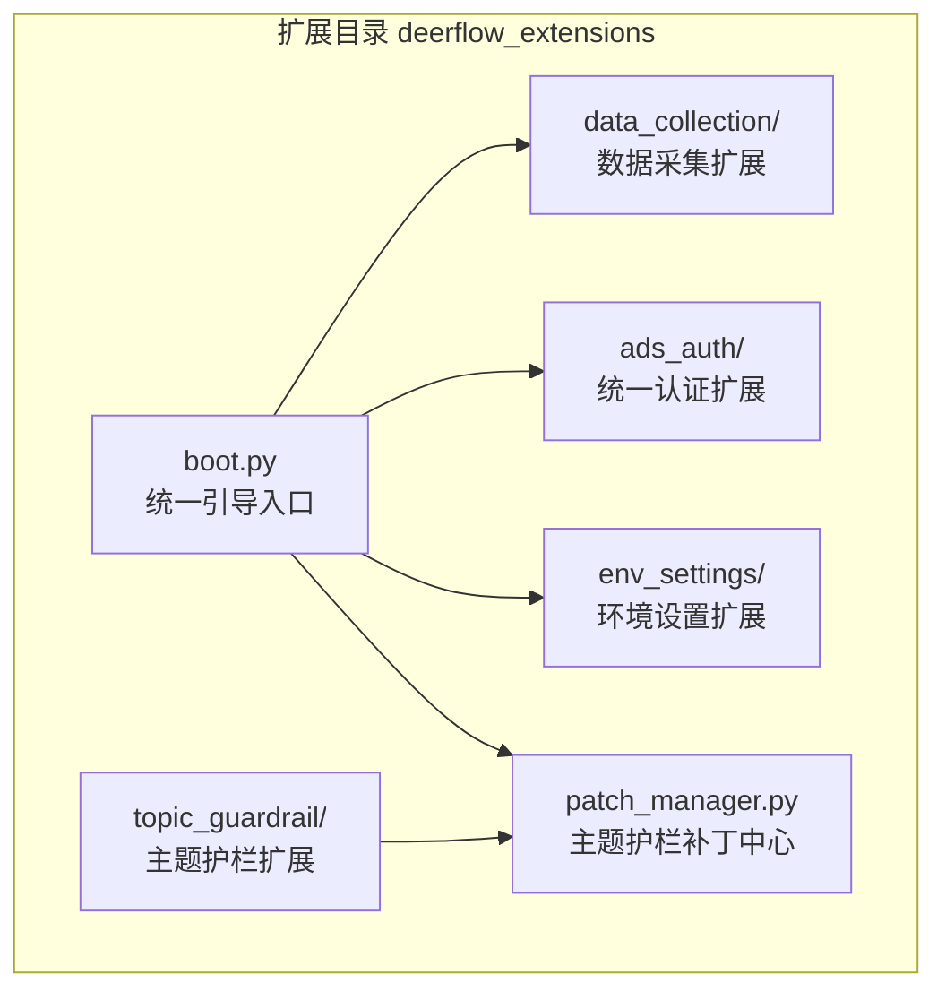
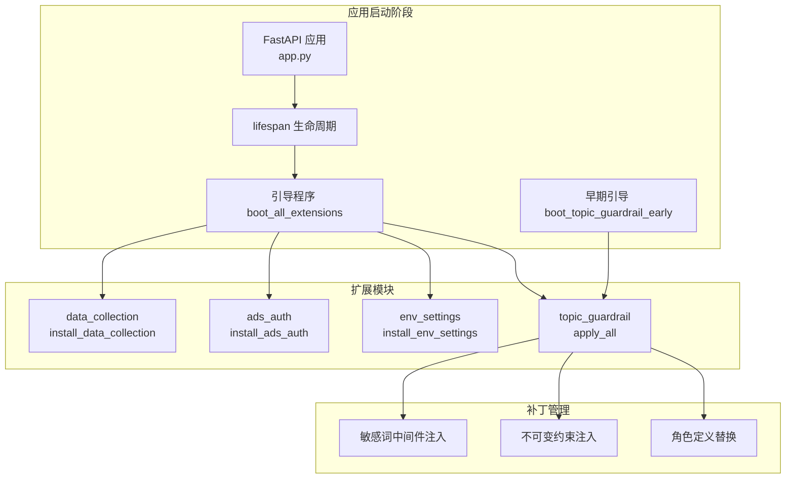
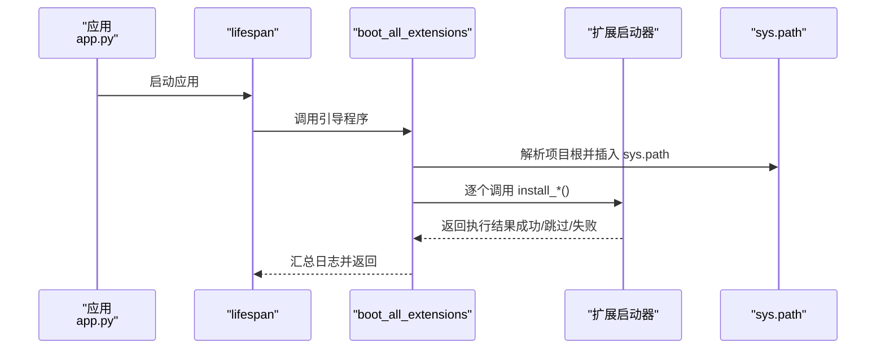
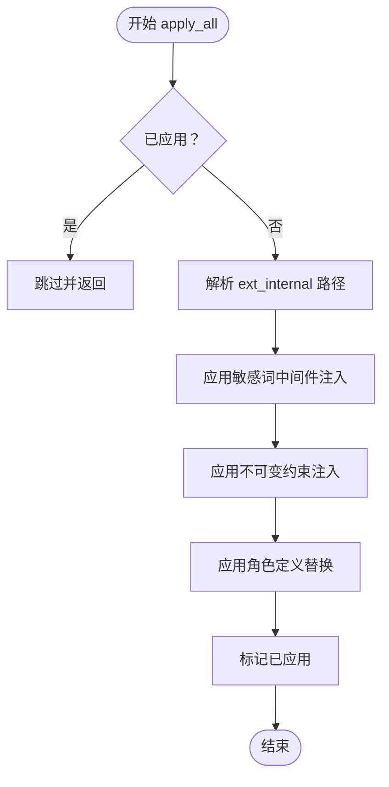
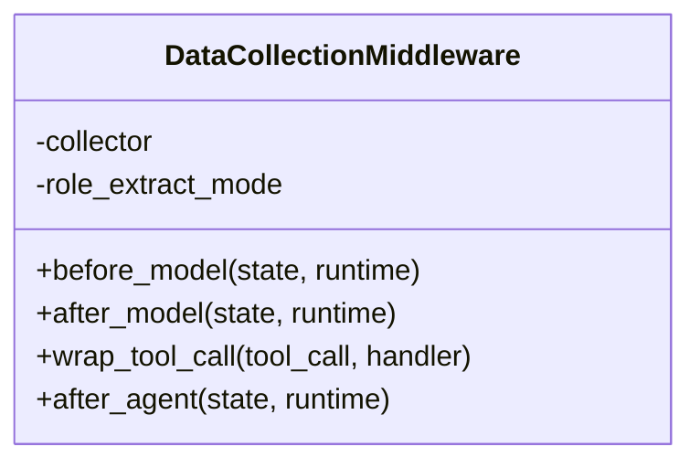
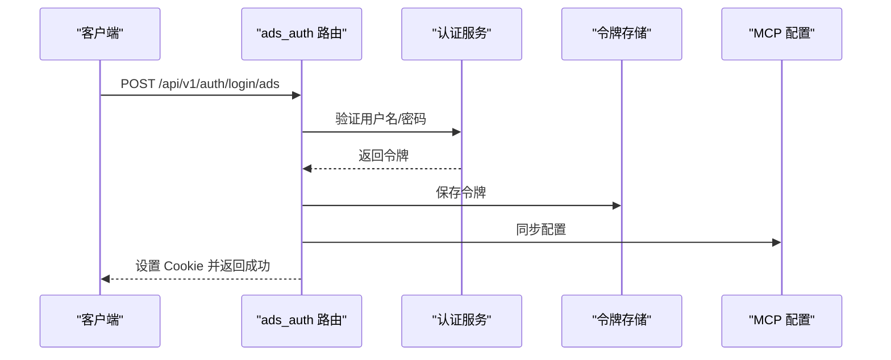
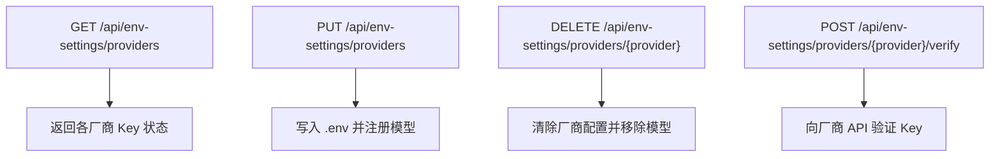
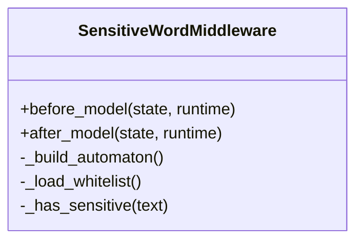
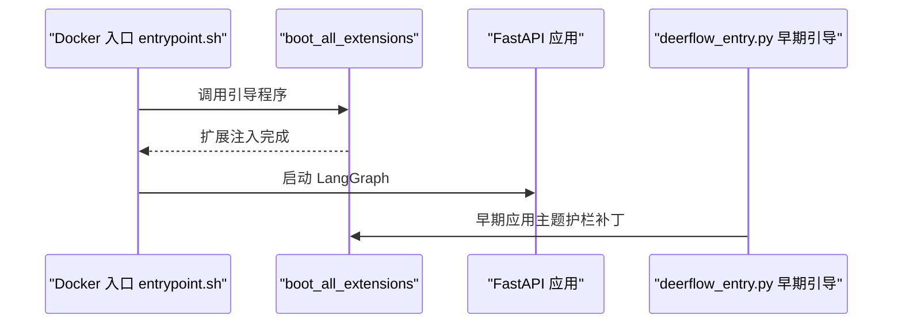
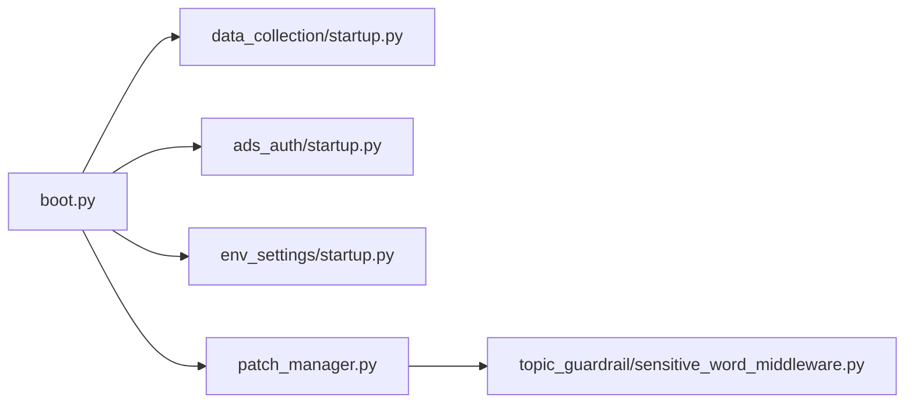

# 扩展架构设计

<cite>
**本文档引用的文件**
- [boot.py](file://deerflow_extensions/boot.py)
- [patch_manager.py](file://deerflow_extensions/patch_manager.py)
- [entrypoint.sh](file://deerflow_extensions/entrypoint.sh)
- [README.md](file://deerflow_extensions/README.md)
- [startup.py](file://deerflow_extensions/data_collection/startup.py)
- [startup.py](file://deerflow_extensions/ads_auth/startup.py)
- [startup.py](file://deerflow_extensions/env_settings/startup.py)
- [router.py](file://deerflow_extensions/ads_auth/router.py)
- [router.py](file://deerflow_extensions/env_settings/router.py)
- [middleware.py](file://deerflow_extensions/data_collection/middleware.py)
- [sensitive_word_middleware.py](file://deerflow_extensions/topic_guardrail/sensitive_word_middleware.py)
- [topics.yaml](file://deerflow_extensions/topic_guardrail/topics.yaml)
- [role_definition.txt](file://deerflow_extensions/topic_guardrail/role_definition.txt)
- [app.py](file://backend/app/gateway/app.py)
- [deerflow_entry.py](file://backend/deerflow_entry.py)
</cite>

## 目录
1. [引言](#引言)
2. [项目结构](#项目结构)
3. [核心组件](#核心组件)
4. [架构总览](#架构总览)
5. [详细组件分析](#详细组件分析)
6. [依赖关系分析](#依赖关系分析)
7. [性能考虑](#性能考虑)
8. [故障排查指南](#故障排查指南)
9. [结论](#结论)
10. [附录](#附录)

## 引言
本文件面向 DeerFlow 扩展架构设计，系统性阐述可插拔扩展系统的整体设计与实现，包括扩展加载机制、启动流程、生命周期管理与兼容性保障。重点解析扩展引导程序（boot.py）的扩展发现、初始化顺序与依赖解析；补丁管理器（patch_manager.py）的动态补丁应用、版本兼容性检查与回滚机制；以及扩展开发框架的设计理念、接口规范与最佳实践。同时提供扩展注册流程、配置系统设计与性能优化策略，帮助开发者快速构建稳定、可维护的扩展。

## 项目结构
deerflow_extensions 目录作为与 backend 平级的零侵入扩展插件目录，存放独立于主干代码的扩展模块。每个扩展通过统一的引导入口进行注入，支持按需启用与降级容错，确保扩展不可用时系统仍可正常运行。

图表来源
- [boot.py:22-27](file://deerflow_extensions/boot.py#L22-L27)
- [README.md:1-22](file://deerflow_extensions/README.md#L1-L22)

章节来源
- [README.md:1-22](file://deerflow_extensions/README.md#L1-L22)

## 核心组件
- 扩展引导程序（boot.py）：负责扩展发现、按序初始化与异常容错，支持多环境（开发/冻结）路径解析与幂等执行。
- 补丁管理器（patch_manager.py）：集中管理主题护栏三类补丁（敏感词中间件注入、不可变约束、角色定义替换），提供幂等应用与日志审计。
- 扩展启动器：各扩展各自提供 startup.py，封装自身初始化逻辑（如路由注册、中间件注入、配置加载）。
- 应用集成点：FastAPI 应用在生命周期内调用引导程序完成扩展注入；PyInstaller 冻结模式下通过 deerflow_entry.py 提前应用主题护栏补丁。

章节来源
- [boot.py:56-77](file://deerflow_extensions/boot.py#L56-L77)
- [patch_manager.py:206-241](file://deerflow_extensions/patch_manager.py#L206-L241)
- [app.py:322-338](file://backend/app/gateway/app.py#L322-L338)
- [deerflow_entry.py:168-172](file://backend/deerflow_entry.py#L168-L172)

## 架构总览
扩展系统采用“引导程序 + 扩展启动器 + 补丁管理器”的分层设计，结合应用生命周期与进程启动时机，实现零侵入、可插拔与高可靠性的扩展注入。

图表来源
- [app.py:322-338](file://backend/app/gateway/app.py#L322-L338)
- [boot.py:56-111](file://deerflow_extensions/boot.py#L56-L111)
- [patch_manager.py:206-241](file://deerflow_extensions/patch_manager.py#L206-L241)
- [deerflow_entry.py:168-172](file://backend/deerflow_entry.py#L168-L172)

## 详细组件分析

### 扩展引导程序（boot.py）
- 扩展发现与注册：通过内部扩展清单定义各扩展名称与是否需要应用实例（是否需要 include_router）。
- 路径解析：支持 PyInstaller 冻结模式与开发模式两种场景，自动定位 deerflow_extensions 目录并注入 sys.path。
- 初始化顺序：按清单顺序依次调用各扩展的安装函数，对每个扩展进行 Import/异常捕获，避免单点失败导致整体中断。
- 幂等性：每个扩展内部维护 _installed/_APPLIED 标记，防止重复安装；引导程序也记录每个扩展的执行结果并汇总日志。

图表来源
- [boot.py:56-77](file://deerflow_extensions/boot.py#L56-L77)
- [boot.py:97-111](file://deerflow_extensions/boot.py#L97-L111)
- [app.py:322-338](file://backend/app/gateway/app.py#L322-L338)

章节来源
- [boot.py:22-27](file://deerflow_extensions/boot.py#L22-L27)
- [boot.py:30-53](file://deerflow_extensions/boot.py#L30-L53)
- [boot.py:56-77](file://deerflow_extensions/boot.py#L56-L77)
- [boot.py:97-111](file://deerflow_extensions/boot.py#L97-L111)

### 补丁管理器（patch_manager.py）
- 三类补丁：
  1) 敏感词中间件注入：在代理中间件链中插入 SensitiveWordMiddleware，具备去重防护与日志审计。
  2) 不可变约束：在技能系统提示段落中注入“不可被技能覆盖的角色身份”约束，确保角色优先级。
  3) 角色定义替换：以模板字符串方式替换系统提示中的 <role>... </role> 区域，支持缓存与外部文件变更检测。
- 幂等应用：全局标记 _APPLIED 防止重复应用；对缺失模块进行跳过处理，避免冻结/开发环境差异导致的导入失败。
- 路径解析：在冻结与开发模式下解析 deerflow_extensions 目录，确保补丁文件可见。

图表来源
- [patch_manager.py:206-241](file://deerflow_extensions/patch_manager.py#L206-L241)
- [patch_manager.py:61-87](file://deerflow_extensions/patch_manager.py#L61-L87)
- [patch_manager.py:102-121](file://deerflow_extensions/patch_manager.py#L102-L121)
- [patch_manager.py:153-197](file://deerflow_extensions/patch_manager.py#L153-L197)

章节来源
- [patch_manager.py:1-27](file://deerflow_extensions/patch_manager.py#L1-L27)
- [patch_manager.py:206-241](file://deerflow_extensions/patch_manager.py#L206-L241)

### 数据采集扩展（data_collection）
- 功能：在代理中间件链中注入 DataCollectionMiddleware，采集用户查询、系统提示、历史上下文、LLM 输出、工具调用与最终响应等信息。
- 实现要点：通过 monkey-patch 改写代理中间件构建函数，在不侵入主干的前提下追加采集逻辑；支持配置开关与角色提取模式；统计会话步数、耗时与 token 使用情况。

图表来源
- [middleware.py:41-339](file://deerflow_extensions/data_collection/middleware.py#L41-L339)

章节来源
- [startup.py:19-57](file://deerflow_extensions/data_collection/startup.py#L19-L57)
- [middleware.py:41-339](file://deerflow_extensions/data_collection/middleware.py#L41-L339)

### 统一认证扩展（ads_auth）
- 功能：提供基于 OAuth2 的登录接口，生成访问令牌并写入 Cookie，同时持久化令牌与同步至 MCP 配置。
- 实现要点：在应用启动时注册路由，解析 JWT 的过期时间以设置 Cookie 的 max_age；通过 try/except 保证扩展不可用时不影响主应用。

图表来源
- [router.py:11-49](file://deerflow_extensions/ads_auth/router.py#L11-L49)
- [startup.py:4-22](file://deerflow_extensions/ads_auth/startup.py#L4-L22)

章节来源
- [router.py:1-50](file://deerflow_extensions/ads_auth/router.py#L1-L50)
- [startup.py:4-22](file://deerflow_extensions/ads_auth/startup.py#L4-L22)

### 环境设置扩展（env_settings）
- 功能：统一管理多厂商 API Key、Base URL、默认模型等，写入 .env 并在 config.yaml 中注册模型；支持渠道凭据的验证、切换与安全重启。
- 实现要点：提供读取/更新/删除 API Key 的接口；通过文件锁保证并发安全；在渠道配置变更时进行 Test-Before-Switch 并尝试自动重启；支持对 config.yaml 的增删改查操作。

图表来源
- [router.py:572-641](file://deerflow_extensions/env_settings/router.py#L572-L641)
- [router.py:643-679](file://deerflow_extensions/env_settings/router.py#L643-L679)
- [router.py:681-776](file://deerflow_extensions/env_settings/router.py#L681-L776)

章节来源
- [router.py:1-859](file://deerflow_extensions/env_settings/router.py#L1-L859)
- [startup.py:4-24](file://deerflow_extensions/env_settings/startup.py#L4-L24)

### 主题护栏扩展（topic_guardrail）
- 敏感词中间件：基于 AC 自动机进行敏感词匹配，支持预处理与白名单过滤，Fail-closed 策略拒绝可疑输入/输出。
- 不可变约束：在技能系统提示中注入“角色身份不可被技能覆盖”的约束，确保角色优先级。
- 角色定义替换：以模板字符串方式替换系统提示中的 <role> 区域，支持外部文件变更与缓存失效。

图表来源
- [sensitive_word_middleware.py:21-183](file://deerflow_extensions/topic_guardrail/sensitive_word_middleware.py#L21-L183)

章节来源
- [sensitive_word_middleware.py:1-183](file://deerflow_extensions/topic_guardrail/sensitive_word_middleware.py#L1-L183)
- [topics.yaml:1-10](file://deerflow_extensions/topic_guardrail/topics.yaml#L1-L10)
- [role_definition.txt:1-30](file://deerflow_extensions/topic_guardrail/role_definition.txt#L1-L30)

### 启动流程与生命周期管理
- 应用启动：app.py 在 lifespan 中调用引导程序，注入数据采集、统一认证、环境设置与主题护栏扩展。
- PyInstaller 冻结：deerflow_entry.py 在导入应用前调用早期引导，确保主题护栏补丁在静态导入之前生效。
- Docker 入口：entrypoint.sh 通过 PYTHONPATH 将 deerflow_extensions 加入 sys.path，再调用引导程序启动 LangGraph。

图表来源
- [entrypoint.sh:14-23](file://deerflow_extensions/entrypoint.sh#L14-L23)
- [app.py:322-338](file://backend/app/gateway/app.py#L322-L338)
- [deerflow_entry.py:168-172](file://backend/deerflow_entry.py#L168-L172)

章节来源
- [entrypoint.sh:1-24](file://deerflow_extensions/entrypoint.sh#L1-L24)
- [app.py:322-338](file://backend/app/gateway/app.py#L322-L338)
- [deerflow_entry.py:168-172](file://backend/deerflow_entry.py#L168-L172)

## 依赖关系分析
- 扩展引导程序依赖各扩展的 startup.py；主题护栏补丁依赖 deerflow 主干代理模块与提示模板。
- 扩展之间无直接耦合，通过统一接口与异常隔离实现松耦合。
- 应用层仅依赖引导程序，扩展变更不影响应用核心逻辑。

图表来源
- [boot.py:97-111](file://deerflow_extensions/boot.py#L97-L111)
- [patch_manager.py:206-241](file://deerflow_extensions/patch_manager.py#L206-L241)

章节来源
- [boot.py:97-111](file://deerflow_extensions/boot.py#L97-L111)
- [patch_manager.py:206-241](file://deerflow_extensions/patch_manager.py#L206-L241)

## 性能考虑
- 幂等与缓存：主题护栏的角色定义采用 mtime 缓存，避免重复读取；敏感词中间件构建 AC 自动机一次后复用。
- 异常隔离：引导程序与扩展启动器均采用 try/except，避免单个扩展失败拖累整体启动。
- 路径解析：在冻结与开发模式下分别解析 deerflow_extensions 路径，减少不必要的 IO。
- 中间件开销：数据采集中间件仅在启用时注入，且对消息与工具调用进行选择性记录，降低运行时负担。

## 故障排查指南
- 扩展未加载：检查引导程序日志，确认 deerflow_extensions 是否在 sys.path 中；查看各扩展 startup.py 的 ImportError 与异常信息。
- 主题护栏补丁未生效：确认 deerflow_entry.py 的早期引导是否执行；检查 ext_internal 路径解析与补丁应用日志。
- 敏感词中间件未注入：核对代理中间件链构建函数是否被 monkey-patch；检查去重逻辑是否提前返回。
- 环境设置写入失败：检查 .env 文件是否存在与可写；确认文件锁是否被占用；查看 config.yaml 写入权限。

章节来源
- [boot.py:68-76](file://deerflow_extensions/boot.py#L68-L76)
- [patch_manager.py:213-235](file://deerflow_extensions/patch_manager.py#L213-L235)
- [middleware.py:41-62](file://deerflow_extensions/data_collection/middleware.py#L41-L62)
- [router.py:293-334](file://deerflow_extensions/env_settings/router.py#L293-L334)

## 结论
DeerFlow 扩展架构通过引导程序、补丁管理器与扩展启动器形成清晰的分层设计，实现了零侵入、可插拔与高可靠性的扩展注入。统一的初始化流程、幂等应用与异常隔离机制，确保扩展在不同部署环境（开发/冻结/Docker）下均可稳定运行。建议在扩展开发中遵循接口规范与最佳实践，充分利用配置系统与性能优化策略，持续提升扩展的可用性与可维护性。

## 附录
- 扩展开发框架设计理念：零侵入、可插拔、幂等、降级容错。
- 接口规范：各扩展提供 install_* 函数，遵循 _installed 标记与异常捕获；主题护栏提供 apply_all 与 _APPLIED 标记。
- 最佳实践：在 startup.py 中显式处理 ImportError；对关键模块进行去重检查；在补丁应用中记录详细日志；合理使用缓存与文件锁。