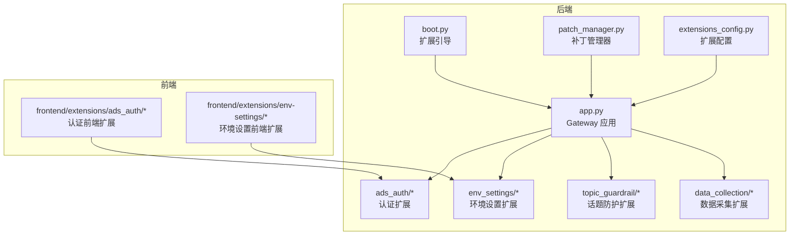
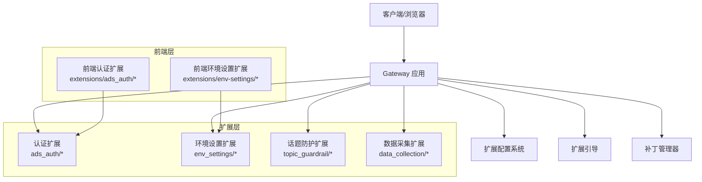
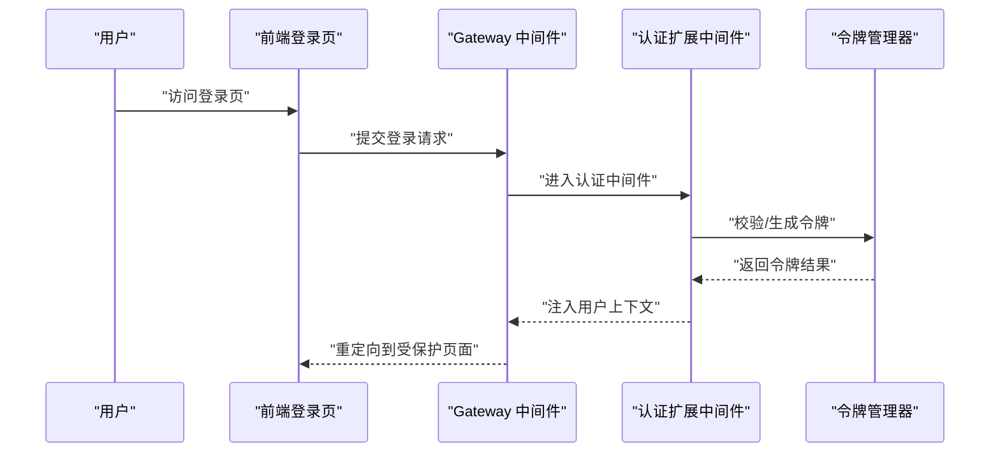
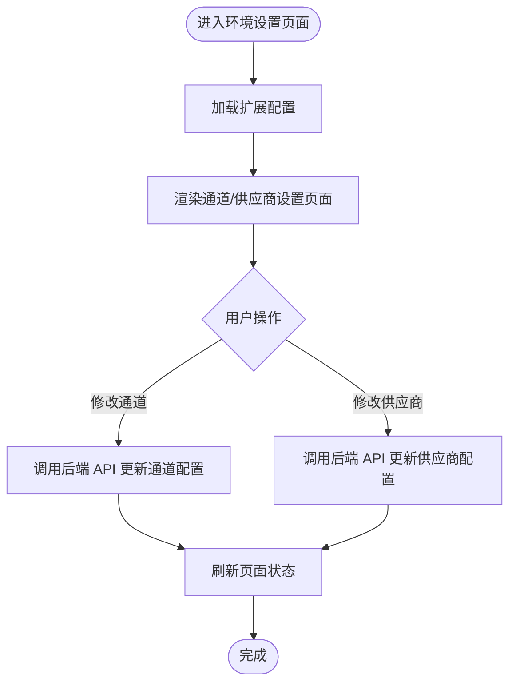
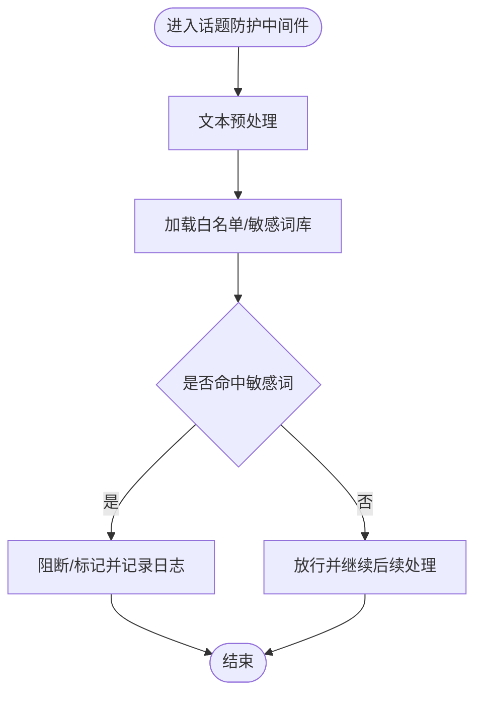
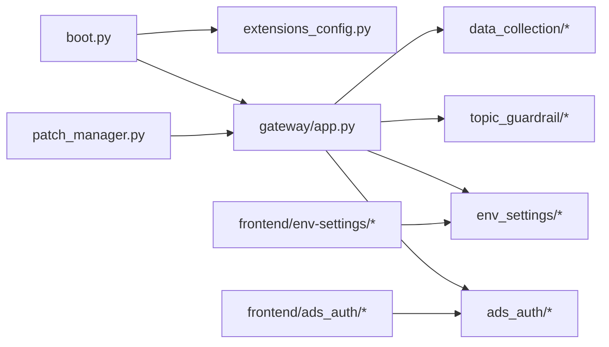

# 扩展系统

<cite>
**本文引用的文件**
- [deerflow_extensions/boot.py](file://deerflow_extensions/boot.py)
- [deerflow_extensions/entrypoint.sh](file://deerflow_extensions/entrypoint.sh)
- [deerflow_extensions/patch_manager.py](file://deerflow_extensions/patch_manager.py)
- [deerflow_extensions/README.md](file://deerflow_extensions/README.md)
- [deerflow_extensions/ads_auth/README.md](file://deerflow_extensions/ads_auth/README.md)
- [deerflow_extensions/ads_auth/ads_auth.py](file://deerflow_extensions/ads_auth/ads_auth.py)
- [deerflow_extensions/ads_auth/config.py](file://deerflow_extensions/ads_auth/config.py)
- [deerflow_extensions/ads_auth/middleware.py](file://deerflow_extensions/ads_auth/middleware.py)
- [deerflow_extensions/ads_auth/router.py](file://deerflow_extensions/ads_auth/router.py)
- [deerflow_extensions/ads_auth/startup.py](file://deerflow_extensions/ads_auth/startup.py)
- [deerflow_extensions/ads_auth/token_manager.py](file://deerflow_extensions/ads_auth/token_manager.py)
- [deerflow_extensions/env_settings/README.md](file://deerflow_extensions/env_settings/README.md)
- [deerflow_extensions/env_settings/router.py](file://deerflow_extensions/env_settings/router.py)
- [deerflow_extensions/env_settings/startup.py](file://deerflow_extensions/env_settings/startup.py)
- [deerflow_extensions/data_collection/README.md](file://deerflow_extensions/data_collection/README.md)
- [deerflow_extensions/data_collection/collector.py](file://deerflow_extensions/data_collection/collector.py)
- [deerflow_extensions/data_collection/config.py](file://deerflow_extensions/data_collection/config.py)
- [deerflow_extensions/data_collection/middleware.py](file://deerflow_extensions/data_collection/middleware.py)
- [deerflow_extensions/data_collection/role_parser.py](file://deerflow_extensions/data_collection/role_parser.py)
- [deerflow_extensions/data_collection/startup.py](file://deerflow_extensions/data_collection/startup.py)
- [deerflow_extensions/topic_guardrail/README.md](file://deerflow_extensions/topic_guardrail/README.md)
- [deerflow_extensions/topic_guardrail/sensitive_word_middleware.py](file://deerflow_extensions/topic_guardrail/sensitive_word_middleware.py)
- [deerflow_extensions/topic_guardrail/text_preprocessor.py](file://deerflow_extensions/topic_guardrail/text_preprocessor.py)
- [deerflow_extensions/topic_guardrail/topic_guardrail_provider.py](file://deerflow_extensions/topic_guardrail/topic_guardrail_provider.py)
- [backend/packages/harness/deerflow/config/extensions_config.py](file://backend/packages/harness/deerflow/config/extensions_config.py)
- [backend/app/gateway/app.py](file://backend/app/gateway/app.py)
- [backend/app/gateway/__init__.py](file://backend/app/gateway/__init__.py)
- [backend/app/gateway/config.py](file://backend/app/gateway/config.py)
- [backend/docs/CONFIGURATION.md](file://backend/docs/CONFIGURATION.md)
- [backend/docs/AUTH_DESIGN.md](file://backend/docs/AUTH_DESIGN.md)
- [backend/docs/GUARDRAILS.md](file://backend/docs/GUARDRAILS.md)
- [frontend/extensions/ads_auth/LoginPage.tsx](file://frontend/extensions/ads_auth/LoginPage.tsx)
- [frontend/extensions/ads_auth/LoginLayout.tsx](file://frontend/extensions/ads_auth/LoginLayout.tsx)
- [frontend/extensions/ads_auth/middleware-handler.ts](file://frontend/extensions/ads_auth/middleware-handler.ts)
- [frontend/extensions/env-settings/extension.ts](file://frontend/extensions/env-settings/extension.ts)
- [frontend/extensions/env-settings/api.ts](file://frontend/extensions/env-settings/api.ts)
- [frontend/extensions/env-settings/channels.ts](file://frontend/extensions/env-settings/channels.ts)
- [frontend/extensions/env-settings/providers.ts](file://frontend/extensions/env-settings/providers.ts)
- [frontend/extensions/env-settings/types.ts](file://frontend/extensions/env-settings/types.ts)
- [frontend/extensions/env-settings/channel-settings-page.tsx](file://frontend/extensions/env-settings/channel-settings-page.tsx)
- [frontend/extensions/env-settings/provider-settings-page.tsx](file://frontend/extensions/env-settings/provider-settings-page.tsx)
- [scripts/deploy.sh](file://scripts/deploy.sh)
- [scripts/build-release.sh](file://scripts/build-release.sh)
- [backend/pyproject.toml](file://backend/pyproject.toml)
- [frontend/package.json](file://frontend/package.json)
- [backend/Makefile](file://backend/Makefile)
- [frontend/Makefile](file://frontend/Makefile)
- [backend/Dockerfile](file://backend/Dockerfile)
- [frontend/Dockerfile](file://frontend/Dockerfile)
- [backend/langgraph.json](file://backend/langgraph.json)
- [extensions_config.example.json](file://extensions_config.example.json)
</cite>

## 目录
1. [简介](#简介)
2. [项目结构](#项目结构)
3. [核心组件](#核心组件)
4. [架构总览](#架构总览)
5. [详细组件分析](#详细组件分析)
6. [依赖关系分析](#依赖关系分析)
7. [性能考量](#性能考量)
8. [故障排查指南](#故障排查指南)
9. [结论](#结论)
10. [附录](#附录)

## 简介
本技术文档面向 DeerFlow 扩展系统的开发者与维护者，系统性阐述可插拔扩展架构的设计与实现，覆盖扩展加载机制、生命周期管理、配置系统设计与兼容性保证；并深入解析三大核心扩展模块：认证扩展（ADS Auth）、环境设置扩展、话题防护扩展的功能特性与使用方法。同时提供扩展开发框架、接口规范、工具链、测试策略与部署流程，并给出最佳实践、性能优化建议与安全注意事项，辅以具体开发示例、配置指南与集成模式，帮助开发者快速构建高质量的 DeerFlow 扩展模块。

## 项目结构
DeerFlow 扩展系统由后端扩展框架与前端扩展适配层共同组成，核心位于 deerflow_extensions 目录，包含扩展引导、入口脚本、补丁管理器以及若干内置扩展模块。后端通过 Gateway 应用程序加载扩展配置并注入中间件与路由；前端通过扩展注册机制接入登录页、环境设置页面等 UI 组件。

图表来源
- [deerflow_extensions/boot.py](file://deerflow_extensions/boot.py)
- [deerflow_extensions/patch_manager.py](file://deerflow_extensions/patch_manager.py)
- [backend/packages/harness/deerflow/config/extensions_config.py](file://backend/packages/harness/deerflow/config/extensions_config.py)
- [backend/app/gateway/app.py](file://backend/app/gateway/app.py)
- [deerflow_extensions/ads_auth/README.md](file://deerflow_extensions/ads_auth/README.md)
- [deerflow_extensions/env_settings/README.md](file://deerflow_extensions/env_settings/README.md)
- [deerflow_extensions/topic_guardrail/README.md](file://deerflow_extensions/topic_guardrail/README.md)
- [deerflow_extensions/data_collection/README.md](file://deerflow_extensions/data_collection/README.md)
- [frontend/extensions/ads_auth/LoginPage.tsx](file://frontend/extensions/ads_auth/LoginPage.tsx)
- [frontend/extensions/env-settings/extension.ts](file://frontend/extensions/env-settings/extension.ts)

章节来源
- [deerflow_extensions/boot.py](file://deerflow_extensions/boot.py)
- [deerflow_extensions/entrypoint.sh](file://deerflow_extensions/entrypoint.sh)
- [deerflow_extensions/patch_manager.py](file://deerflow_extensions/patch_manager.py)
- [backend/packages/harness/deerflow/config/extensions_config.py](file://backend/packages/harness/deerflow/config/extensions_config.py)
- [backend/app/gateway/app.py](file://backend/app/gateway/app.py)

## 核心组件
- 扩展引导与入口
  - boot.py 负责扫描扩展目录、加载扩展元信息与启动函数，建立扩展与 Gateway 的桥接。
  - entrypoint.sh 提供容器或本地运行时的扩展入口脚本，确保扩展在服务启动前完成初始化。
  - patch_manager.py 提供对核心模块的动态补丁能力，用于在不破坏兼容性的前提下进行功能增强与修复。
- 扩展配置系统
  - extensions_config.py 定义扩展配置的数据结构与默认值，支持按扩展粒度启用/禁用与参数传递。
  - extensions_config.example.json 提供示例配置，便于开发者快速上手。
- 扩展生命周期
  - 每个扩展提供 startup.py，在应用启动阶段执行初始化逻辑（如注册中间件、挂载路由、预热缓存等）。
  - 扩展可通过 middleware.py 注册中间件，参与请求处理流水线；通过 router.py 注册 API 路由。
- 前端扩展适配
  - 前端通过 extension.ts、api.ts、types.ts 等模块注册扩展点，接入登录页、环境设置页等 UI 组件。

章节来源
- [deerflow_extensions/boot.py](file://deerflow_extensions/boot.py)
- [deerflow_extensions/entrypoint.sh](file://deerflow_extensions/entrypoint.sh)
- [deerflow_extensions/patch_manager.py](file://deerflow_extensions/patch_manager.py)
- [backend/packages/harness/deerflow/config/extensions_config.py](file://backend/packages/harness/deerflow/config/extensions_config.py)
- [extensions_config.example.json](file://extensions_config.example.json)

## 架构总览
扩展系统采用“后端 Gateway + 多扩展 + 前端适配”的分层架构。后端通过统一的扩展配置与引导机制，动态加载各扩展的中间件与路由；前端通过扩展注册表接入对应的 UI 组件与交互逻辑。整体架构强调可插拔、可配置、可演进与可隔离。

图表来源
- [backend/app/gateway/app.py](file://backend/app/gateway/app.py)
- [backend/packages/harness/deerflow/config/extensions_config.py](file://backend/packages/harness/deerflow/config/extensions_config.py)
- [deerflow_extensions/boot.py](file://deerflow_extensions/boot.py)
- [deerflow_extensions/patch_manager.py](file://deerflow_extensions/patch_manager.py)
- [deerflow_extensions/ads_auth/router.py](file://deerflow_extensions/ads_auth/router.py)
- [deerflow_extensions/env_settings/router.py](file://deerflow_extensions/env_settings/router.py)
- [frontend/extensions/ads_auth/LoginPage.tsx](file://frontend/extensions/ads_auth/LoginPage.tsx)
- [frontend/extensions/env-settings/extension.ts](file://frontend/extensions/env-settings/extension.ts)

## 详细组件分析

### 认证扩展（ADS Auth）
- 功能概述
  - 提供基于 ADS 的认证能力，包含登录页、登录布局、中间件拦截与令牌管理。
  - 支持在请求进入业务逻辑前进行身份校验与权限判定。
- 关键实现
  - 后端
    - ads_auth.py：定义认证相关的核心逻辑与工具函数。
    - config.py：扩展的配置项定义与默认值。
    - middleware.py：认证中间件，负责拦截请求、校验凭据、注入用户上下文。
    - router.py：对外暴露认证相关的 API 路由（如登录、登出、刷新令牌等）。
    - startup.py：启动阶段注册中间件与路由，初始化令牌管理器。
    - token_manager.py：令牌生成、验证与刷新的管理器。
  - 前端
    - LoginPage.tsx、LoginLayout.tsx：登录界面与布局组件。
    - middleware-handler.ts：前端侧的认证中间件处理器，协调登录态与路由守卫。
- 使用方法
  - 在扩展配置中启用 ads_auth，并配置相关参数（如回调地址、密钥等）。
  - 前端通过 extension.ts 注册登录页与中间件处理器，实现登录态感知与路由保护。
- 集成模式
  - 作为独立扩展模块接入后端 Gateway，无需修改核心业务代码。
  - 前后端协同工作，确保登录态一致与用户体验连贯。

图表来源
- [deerflow_extensions/ads_auth/middleware.py](file://deerflow_extensions/ads_auth/middleware.py)
- [deerflow_extensions/ads_auth/token_manager.py](file://deerflow_extensions/ads_auth/token_manager.py)
- [frontend/extensions/ads_auth/middleware-handler.ts](file://frontend/extensions/ads_auth/middleware-handler.ts)

章节来源
- [deerflow_extensions/ads_auth/README.md](file://deerflow_extensions/ads_auth/README.md)
- [deerflow_extensions/ads_auth/ads_auth.py](file://deerflow_extensions/ads_auth/ads_auth.py)
- [deerflow_extensions/ads_auth/config.py](file://deerflow_extensions/ads_auth/config.py)
- [deerflow_extensions/ads_auth/middleware.py](file://deerflow_extensions/ads_auth/middleware.py)
- [deerflow_extensions/ads_auth/router.py](file://deerflow_extensions/ads_auth/router.py)
- [deerflow_extensions/ads_auth/startup.py](file://deerflow_extensions/ads_auth/startup.py)
- [deerflow_extensions/ads_auth/token_manager.py](file://deerflow_extensions/ads_auth/token_manager.py)
- [frontend/extensions/ads_auth/LoginPage.tsx](file://frontend/extensions/ads_auth/LoginPage.tsx)
- [frontend/extensions/ads_auth/LoginLayout.tsx](file://frontend/extensions/ads_auth/LoginLayout.tsx)
- [frontend/extensions/ads_auth/middleware-handler.ts](file://frontend/extensions/ads_auth/middleware-handler.ts)

### 环境设置扩展
- 功能概述
  - 提供通道（Channel）与供应商（Provider）的配置管理页面，支持渠道重启、文件锁检测、路由拆分等功能。
- 关键实现
  - 后端
    - router.py：注册环境设置相关的 API 路由。
    - startup.py：启动阶段初始化设置项与校验逻辑。
  - 前端
    - extension.ts：扩展注册入口。
    - api.ts：封装与后端的 API 交互。
    - channels.ts、providers.ts：通道与供应商的类型与配置枚举。
    - types.ts：通用类型定义。
    - channel-settings-page.tsx、provider-settings-page.tsx：对应设置页面组件。
- 使用方法
  - 在扩展配置中启用 env_settings，并在前端页面中通过 extension.ts 注册。
  - 通过 api.ts 调用后端接口，实现通道与供应商的动态配置与状态查询。

图表来源
- [deerflow_extensions/env_settings/router.py](file://deerflow_extensions/env_settings/router.py)
- [deerflow_extensions/env_settings/startup.py](file://deerflow_extensions/env_settings/startup.py)
- [frontend/extensions/env-settings/extension.ts](file://frontend/extensions/env-settings/extension.ts)
- [frontend/extensions/env-settings/api.ts](file://frontend/extensions/env-settings/api.ts)
- [frontend/extensions/env-settings/channels.ts](file://frontend/extensions/env-settings/channels.ts)
- [frontend/extensions/env-settings/providers.ts](file://frontend/extensions/env-settings/providers.ts)
- [frontend/extensions/env-settings/types.ts](file://frontend/extensions/env-settings/types.ts)
- [frontend/extensions/env-settings/channel-settings-page.tsx](file://frontend/extensions/env-settings/channel-settings-page.tsx)
- [frontend/extensions/env-settings/provider-settings-page.tsx](file://frontend/extensions/env-settings/provider-settings-page.tsx)

章节来源
- [deerflow_extensions/env_settings/README.md](file://deerflow_extensions/env_settings/README.md)
- [deerflow_extensions/env_settings/router.py](file://deerflow_extensions/env_settings/router.py)
- [deerflow_extensions/env_settings/startup.py](file://deerflow_extensions/env_settings/startup.py)
- [frontend/extensions/env-settings/extension.ts](file://frontend/extensions/env-settings/extension.ts)
- [frontend/extensions/env-settings/api.ts](file://frontend/extensions/env-settings/api.ts)
- [frontend/extensions/env-settings/channels.ts](file://frontend/extensions/env-settings/channels.ts)
- [frontend/extensions/env-settings/providers.ts](file://frontend/extensions/env-settings/providers.ts)
- [frontend/extensions/env-settings/types.ts](file://frontend/extensions/env-settings/types.ts)
- [frontend/extensions/env-settings/channel-settings-page.tsx](file://frontend/extensions/env-settings/channel-settings-page.tsx)
- [frontend/extensions/env-settings/provider-settings-page.tsx](file://frontend/extensions/env-settings/provider-settings-page.tsx)

### 话题防护扩展
- 功能概述
  - 基于敏感词库与文本预处理的防护中间件，支持白名单与自定义敏感词，保障对话内容符合合规要求。
- 关键实现
  - sensitive_word_middleware.py：敏感词匹配与拦截中间件。
  - text_preprocessor.py：文本清洗、标准化与预处理逻辑。
  - topic_guardrail_provider.py：话题防护提供者，负责加载词库、规则与策略。
  - wordlist/：包含基础敏感词、自定义敏感词与白名单文件。
  - topics.yaml：话题分类与规则配置。
- 使用方法
  - 在扩展配置中启用 topic_guardrail，并配置词库路径与规则。
  - 中间件在请求进入业务逻辑前对输入/输出文本进行预处理与敏感词检测，必要时阻断或标记。

图表来源
- [deerflow_extensions/topic_guardrail/sensitive_word_middleware.py](file://deerflow_extensions/topic_guardrail/sensitive_word_middleware.py)
- [deerflow_extensions/topic_guardrail/text_preprocessor.py](file://deerflow_extensions/topic_guardrail/text_preprocessor.py)
- [deerflow_extensions/topic_guardrail/topic_guardrail_provider.py](file://deerflow_extensions/topic_guardrail/topic_guardrail_provider.py)

章节来源
- [deerflow_extensions/topic_guardrail/README.md](file://deerflow_extensions/topic_guardrail/README.md)
- [deerflow_extensions/topic_guardrail/sensitive_word_middleware.py](file://deerflow_extensions/topic_guardrail/sensitive_word_middleware.py)
- [deerflow_extensions/topic_guardrail/text_preprocessor.py](file://deerflow_extensions/topic_guardrail/text_preprocessor.py)
- [deerflow_extensions/topic_guardrail/topic_guardrail_provider.py](file://deerflow_extensions/topic_guardrail/topic_guardrail_provider.py)

### 数据采集扩展
- 功能概述
  - 提供数据采集、清洗、聚合与导出能力，支持多种格式与质量仪表盘。
- 关键实现
  - collector.py：采集器，负责从不同来源收集数据。
  - config.py：扩展配置项。
  - middleware.py：采集中间件，拦截并记录相关事件。
  - role_parser.py：角色解析器，用于识别与分类数据角色。
  - startup.py：启动阶段初始化采集器与中间件。
- 使用方法
  - 在扩展配置中启用 data_collection，并配置采集源与导出格式。
  - 通过中间件与采集器自动收集与处理数据，支持定时任务与手动触发。

章节来源
- [deerflow_extensions/data_collection/README.md](file://deerflow_extensions/data_collection/README.md)
- [deerflow_extensions/data_collection/collector.py](file://deerflow_extensions/data_collection/collector.py)
- [deerflow_extensions/data_collection/config.py](file://deerflow_extensions/data_collection/config.py)
- [deerflow_extensions/data_collection/middleware.py](file://deerflow_extensions/data_collection/middleware.py)
- [deerflow_extensions/data_collection/role_parser.py](file://deerflow_extensions/data_collection/role_parser.py)
- [deerflow_extensions/data_collection/startup.py](file://deerflow_extensions/data_collection/startup.py)

## 依赖关系分析
- 扩展引导与配置
  - boot.py 依赖 extensions_config.py 进行配置解析与扩展发现。
  - patch_manager.py 与 boot.py 协同，确保扩展在启动前完成必要的补丁注入。
- 扩展与 Gateway
  - 各扩展通过 startup.py 注册中间件与路由，Gateway 在应用初始化阶段加载这些组件。
- 前后端耦合
  - 前端扩展通过 extension.ts 与后端扩展形成松耦合绑定，避免直接修改后端核心代码。
- 外部依赖
  - 后端依赖 pyproject.toml 中的 Python 包；前端依赖 package.json 中的 npm 包。
  - Dockerfile 与 Makefile 提供容器化与构建流程支持。

图表来源
- [deerflow_extensions/boot.py](file://deerflow_extensions/boot.py)
- [deerflow_extensions/patch_manager.py](file://deerflow_extensions/patch_manager.py)
- [backend/packages/harness/deerflow/config/extensions_config.py](file://backend/packages/harness/deerflow/config/extensions_config.py)
- [backend/app/gateway/app.py](file://backend/app/gateway/app.py)
- [frontend/extensions/ads_auth/LoginPage.tsx](file://frontend/extensions/ads_auth/LoginPage.tsx)
- [frontend/extensions/env-settings/extension.ts](file://frontend/extensions/env-settings/extension.ts)

章节来源
- [backend/pyproject.toml](file://backend/pyproject.toml)
- [frontend/package.json](file://frontend/package.json)
- [backend/Dockerfile](file://backend/Dockerfile)
- [frontend/Dockerfile](file://frontend/Dockerfile)
- [backend/Makefile](file://backend/Makefile)
- [frontend/Makefile](file://frontend/Makefile)

## 性能考量
- 中间件开销控制
  - 将敏感词匹配与文本预处理逻辑尽量前置，减少重复计算；对高频请求采用缓存策略（如白名单/词库缓存）。
- 异步与并发
  - 数据采集与导出应异步化，避免阻塞主请求线程；合理设置并发上限与队列长度。
- 资源隔离
  - 通过沙箱或子进程执行高风险操作，降低对核心服务的影响。
- 配置热更新
  - 对敏感词库与规则支持热加载，减少停机时间；对配置变更进行幂等处理。

## 故障排查指南
- 认证扩展
  - 登录失败：检查前端登录页与中间件处理器是否正确注册；核对回调地址与密钥配置。
  - 令牌异常：查看令牌管理器的日志与过期策略，确认刷新流程是否正常。
- 环境设置扩展
  - 页面无法加载：确认扩展已启用且前端 extension.ts 已正确注册；检查后端路由是否挂载成功。
  - 设置未生效：核对 channels.ts 与 providers.ts 的类型定义与后端 API 返回一致性。
- 话题防护扩展
  - 误报/漏报：调整敏感词库与白名单；检查 text_preprocessor 的清洗规则是否过于严格。
  - 性能问题：对词库进行索引优化；限制单次匹配范围与超时时间。
- 数据采集扩展
  - 采集失败：检查采集器配置与来源可用性；查看中间件日志定位异常。
  - 导出异常：核对导出格式与目标存储配置，确保权限与网络可达。

章节来源
- [deerflow_extensions/ads_auth/middleware.py](file://deerflow_extensions/ads_auth/middleware.py)
- [deerflow_extensions/ads_auth/token_manager.py](file://deerflow_extensions/ads_auth/token_manager.py)
- [deerflow_extensions/env_settings/router.py](file://deerflow_extensions/env_settings/router.py)
- [deerflow_extensions/env_settings/startup.py](file://deerflow_extensions/env_settings/startup.py)
- [deerflow_extensions/topic_guardrail/sensitive_word_middleware.py](file://deerflow_extensions/topic_guardrail/sensitive_word_middleware.py)
- [deerflow_extensions/topic_guardrail/text_preprocessor.py](file://deerflow_extensions/topic_guardrail/text_preprocessor.py)
- [deerflow_extensions/data_collection/middleware.py](file://deerflow_extensions/data_collection/middleware.py)
- [deerflow_extensions/data_collection/startup.py](file://deerflow_extensions/data_collection/startup.py)

## 结论
DeerFlow 扩展系统通过清晰的引导机制、灵活的配置体系与前后端解耦的扩展适配，实现了高度可插拔与可演进的扩展生态。认证、环境设置、话题防护与数据采集四大扩展模块覆盖了典型的企业级需求场景。遵循本文档提供的接口规范、开发工具链、测试策略与部署流程，开发者可以高效地创建高质量扩展模块，并在保证性能与安全的前提下持续迭代。

## 附录
- 开发工具链
  - 后端：Python 包管理与构建参考 pyproject.toml；Docker 与 Makefile 支持容器化与自动化构建。
  - 前端：npm 包管理与构建参考 package.json；Docker 与 Makefile 支持容器化与自动化构建。
- 测试策略
  - 单元测试：针对扩展模块的关键函数与中间件编写测试用例，覆盖正常与异常分支。
  - 集成测试：模拟 Gateway 加载扩展的完整流程，验证中间件与路由挂载的正确性。
  - E2E 测试：结合前端扩展页面，验证登录态、设置页与防护规则的实际效果。
- 部署流程
  - 使用 scripts/deploy.sh 与 scripts/build-release.sh 进行一键部署与发布。
  - Dockerfile 与 docker-compose 配置确保本地与生产环境的一致性。
- 配置示例
  - extensions_config.example.json 提供扩展配置模板，建议在实际环境中复制并按需修改。

章节来源
- [backend/pyproject.toml](file://backend/pyproject.toml)
- [frontend/package.json](file://frontend/package.json)
- [scripts/deploy.sh](file://scripts/deploy.sh)
- [scripts/build-release.sh](file://scripts/build-release.sh)
- [backend/Dockerfile](file://backend/Dockerfile)
- [frontend/Dockerfile](file://frontend/Dockerfile)
- [backend/Makefile](file://backend/Makefile)
- [frontend/Makefile](file://frontend/Makefile)
- [extensions_config.example.json](file://extensions_config.example.json)