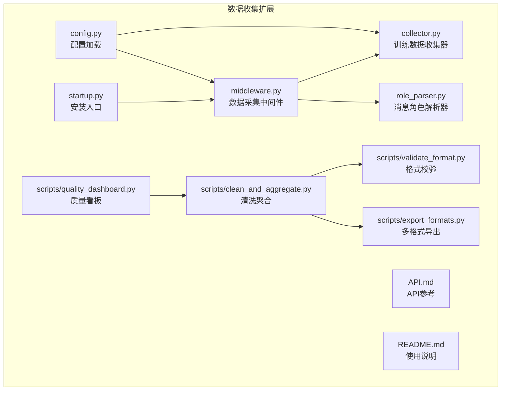
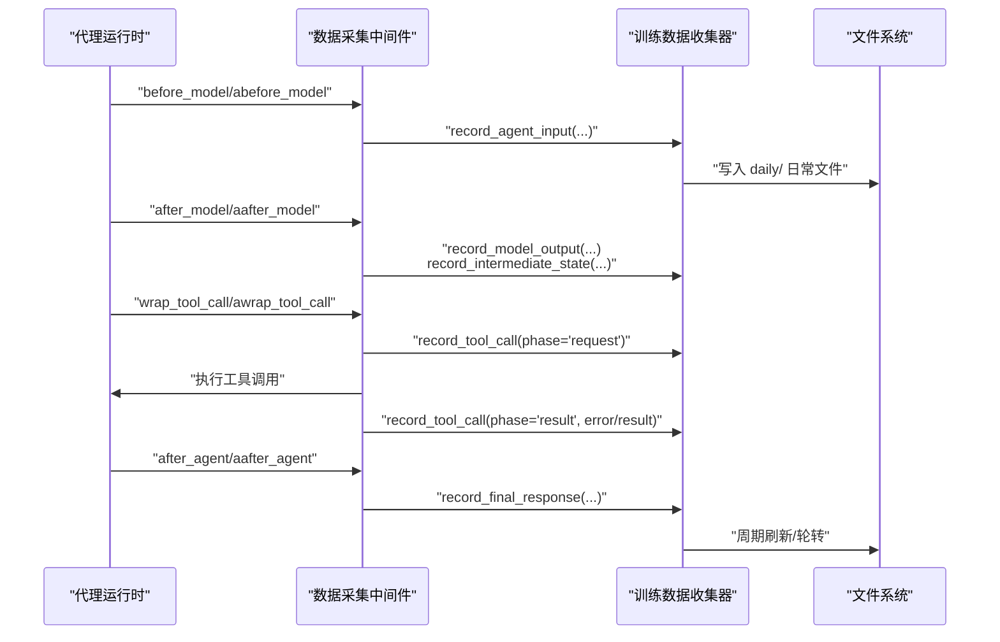
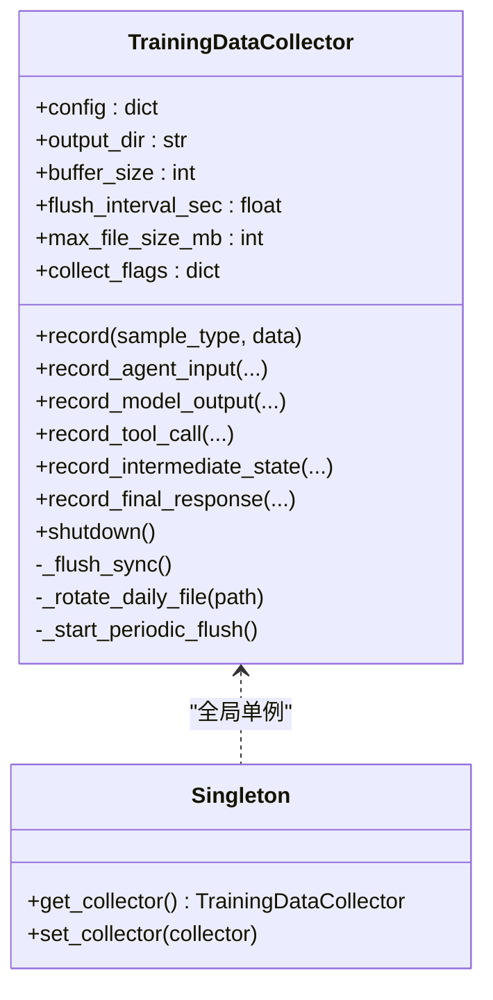
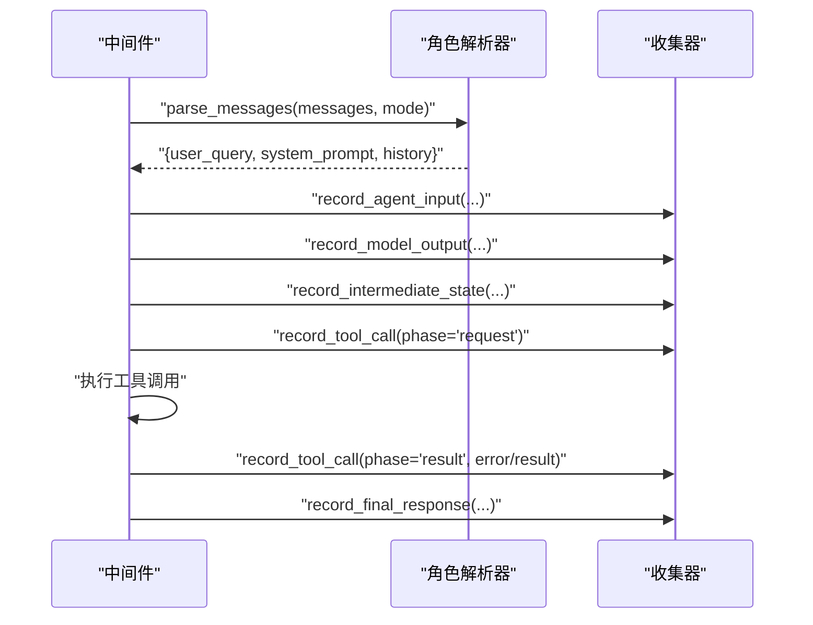
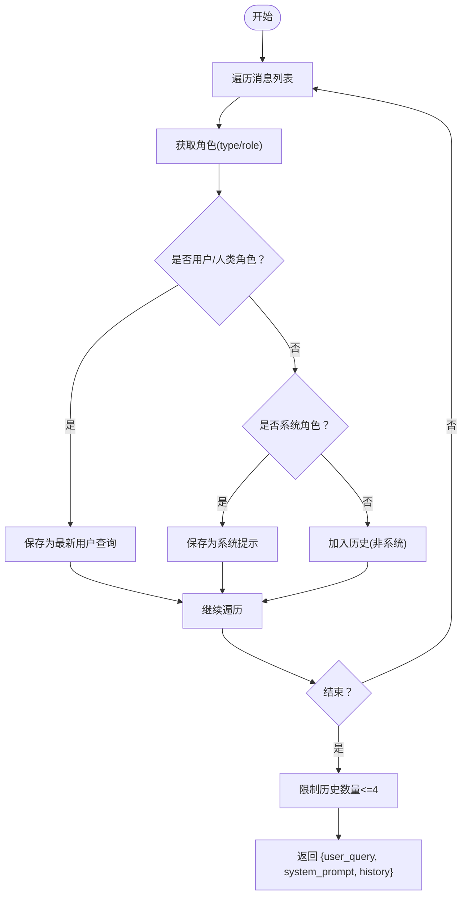
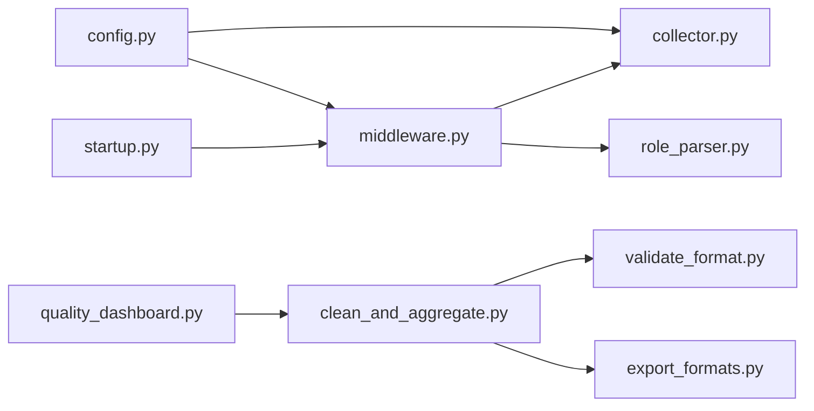

# 数据收集扩展

<cite>
**本文引用的文件**
- [collector.py](file://deerflow_extensions/data_collection/collector.py)
- [middleware.py](file://deerflow_extensions/data_collection/middleware.py)
- [role_parser.py](file://deerflow_extensions/data_collection/role_parser.py)
- [config.py](file://deerflow_extensions/data_collection/config.py)
- [startup.py](file://deerflow_extensions/data_collection/startup.py)
- [clean_and_aggregate.py](file://deerflow_extensions/data_collection/scripts/clean_and_aggregate.py)
- [validate_format.py](file://deerflow_extensions/data_collection/scripts/validate_format.py)
- [export_formats.py](file://deerflow_extensions/data_collection/scripts/export_formats.py)
- [quality_dashboard.py](file://deerflow_extensions/data_collection/scripts/quality_dashboard.py)
- [API.md](file://deerflow_extensions/data_collection/API.md)
- [README.md](file://deerflow_extensions/data_collection/README.md)
- [test_collector.py](file://deerflow_extensions/data_collection/tests/test_collector.py)
- [test_middleware.py](file://deerflow_extensions/data_collection/tests/test_middleware.py)
- [test_role_parser.py](file://deerflow_extensions/data_collection/tests/test_role_parser.py)
</cite>

## 目录
1. [简介](#简介)
2. [项目结构](#项目结构)
3. [核心组件](#核心组件)
4. [架构总览](#架构总览)
5. [详细组件分析](#详细组件分析)
6. [依赖分析](#依赖分析)
7. [性能考虑](#性能考虑)
8. [故障排查指南](#故障排查指南)
9. [结论](#结论)
10. [附录](#附录)

## 简介
本技术文档面向“数据收集扩展”，系统性阐述其在 DeerFlow 中的架构设计与实现细节，覆盖数据采集、清洗聚合、格式验证与质量仪表盘等能力；深入解析收集器（TrainingDataCollector）的缓冲写入、批量处理与错误恢复机制；详解中间件（DataCollectionMiddleware）在代理生命周期中的请求拦截、数据转换与响应修改；剖析角色解析器（role_parser）的角色识别、标签分配与语义分析；并提供配置文件结构、数据格式规范与导出选项、数据质量评估与异常处理、性能监控指南以及扩展开发接口与集成模式。

## 项目结构
数据收集扩展位于 deerflow_extensions/data_collection 目录，包含核心收集器、中间件、角色解析器、启动安装脚本与一组离线处理脚本（清洗聚合、格式校验、导出、质量看板）。测试用例覆盖收集器、中间件与角色解析器的关键行为。

图表来源
- [collector.py:1-342](file://deerflow_extensions/data_collection/collector.py#L1-L342)
- [middleware.py:1-339](file://deerflow_extensions/data_collection/middleware.py#L1-L339)
- [role_parser.py:1-158](file://deerflow_extensions/data_collection/role_parser.py#L1-L158)
- [config.py:1-95](file://deerflow_extensions/data_collection/config.py#L1-L95)
- [startup.py:1-57](file://deerflow_extensions/data_collection/startup.py#L1-L57)
- [clean_and_aggregate.py:1-291](file://deerflow_extensions/data_collection/scripts/clean_and_aggregate.py#L1-L291)
- [validate_format.py:1-227](file://deerflow_extensions/data_collection/scripts/validate_format.py#L1-L227)
- [export_formats.py:1-195](file://deerflow_extensions/data_collection/scripts/export_formats.py#L1-L195)
- [quality_dashboard.py:1-106](file://deerflow_extensions/data_collection/scripts/quality_dashboard.py#L1-L106)
- [API.md:1-308](file://deerflow_extensions/data_collection/API.md#L1-L308)
- [README.md:1-184](file://deerflow_extensions/data_collection/README.md#L1-L184)

章节来源
- [README.md:1-184](file://deerflow_extensions/data_collection/README.md#L1-L184)
- [API.md:1-308](file://deerflow_extensions/data_collection/API.md#L1-L308)

## 核心组件
- 训练数据收集器（TrainingDataCollector）
  - 异步缓冲写入：内存队列 + 后台线程周期刷新，支持并发写入与异常降级。
  - 六个采集点：agent_input、model_output、tool_call_request、tool_call_result、agent_intermediate_state、final_response。
  - 文件轮转：按日切分，超过阈值自动归档。
- 数据采集中间件（DataCollectionMiddleware）
  - 在代理生命周期钩子中记录输入、模型输出、工具调用前后、中间状态与最终响应。
  - 支持同步与异步路径，兼容 LangGraph 运行时上下文。
- 角色解析器（role_parser）
  - 解析 LangGraph 消息列表，提取用户查询、系统提示与历史对话，支持 role 与 type 双格式。
  - 提供三种抽取模式：auto（默认）、human、user。
- 配置模块（config）
  - 多源合并：独立 YAML → DeerFlow config.yaml → 环境变量 → 默认值。
  - 关键参数：输出目录、缓冲大小、刷新间隔、最大文件大小、采集开关、角色抽取模式。
- 安装入口（startup）
  - 通过猴子补丁注入中间件到代理中间件链，幂等且对缺失依赖安全降级。
- 离线处理脚本
  - 清洗聚合：去重、过滤、短回复与错误标记、会话聚合。
  - 格式校验：LlamaFactory 兼容规则检查。
  - 导出：支持 llamafactory_messages、sharegpt、alpaca_simple。
  - 质量看板：统计报表与磁盘估算。

章节来源
- [collector.py:23-342](file://deerflow_extensions/data_collection/collector.py#L23-L342)
- [middleware.py:41-339](file://deerflow_extensions/data_collection/middleware.py#L41-L339)
- [role_parser.py:13-158](file://deerflow_extensions/data_collection/role_parser.py#L13-L158)
- [config.py:14-95](file://deerflow_extensions/data_collection/config.py#L14-L95)
- [startup.py:19-57](file://deerflow_extensions/data_collection/startup.py#L19-L57)
- [clean_and_aggregate.py:14-291](file://deerflow_extensions/data_collection/scripts/clean_and_aggregate.py#L14-L291)
- [validate_format.py:5-227](file://deerflow_extensions/data_collection/scripts/validate_format.py#L5-L227)
- [export_formats.py:19-195](file://deerflow_extensions/data_collection/scripts/export_formats.py#L19-L195)
- [quality_dashboard.py:12-106](file://deerflow_extensions/data_collection/scripts/quality_dashboard.py#L12-L106)

## 架构总览
数据收集扩展以零侵入方式接入 DeerFlow 代理生命周期，在六个关键节点采集全链路数据，并通过缓冲与后台线程实现非阻塞持久化。离线脚本负责清洗、聚合、格式校验与导出，形成从原始日志到可训练数据的完整流水线。

图表来源
- [middleware.py:63-339](file://deerflow_extensions/data_collection/middleware.py#L63-L339)
- [collector.py:86-313](file://deerflow_extensions/data_collection/collector.py#L86-L313)

章节来源
- [README.md:7-18](file://deerflow_extensions/data_collection/README.md#L7-L18)
- [API.md:120-190](file://deerflow_extensions/data_collection/API.md#L120-L190)

## 详细组件分析

### 训练数据收集器（TrainingDataCollector）
- 设计原则
  - 线程安全：使用锁保护缓冲区，支持并发写入。
  - 零异常传播：内部捕获并记录异常，避免影响代理运行。
  - 单例模式：进程内全局唯一实例，便于跨模块共享。
- 缓冲与刷新
  - 达到 buffer_size 或周期触发 flush_interval_sec 执行刷新。
  - 刷新失败时回退到缓冲头部，保证顺序与不丢数据。
- 文件管理
  - 按 UTC 日期生成 daily 文件，超过 max_file_size_mb 自动归档至 archive。
- 采集点方法
  - record_agent_input、record_model_output、record_tool_call、record_intermediate_state、record_final_response。
  - record 通用方法统一打时间戳、拼接数据并入队。

图表来源
- [collector.py:23-342](file://deerflow_extensions/data_collection/collector.py#L23-L342)

章节来源
- [collector.py:23-342](file://deerflow_extensions/data_collection/collector.py#L23-L342)
- [API.md:5-118](file://deerflow_extensions/data_collection/API.md#L5-L118)
- [test_collector.py:40-357](file://deerflow_extensions/data_collection/tests/test_collector.py#L40-L357)

### 数据采集中间件（DataCollectionMiddleware）
- 生命周期钩子
  - before_model/abefore_model：解析消息、提取用户查询、系统提示与历史，记录 agent_input 并初始化会话状态。
  - after_model/aafter_model：记录 model_output、中间状态与工具调用信息。
  - wrap_tool_call/awrap_tool_call：记录工具调用请求与结果，包含耗时与错误。
  - after_agent/aafter_agent：记录最终响应与会话统计，清理会话状态。
- 线程安全与并发
  - 使用字典维护每个 session 的步数、LLM/工具调用次数、累计 token 数等。
  - 支持异步中间件方法，委托给同步实现，确保一致性。
- 会话标识
  - 优先从 runtime.context 获取 thread_id，其次从 state.config.configurable.thread_id 获取。

图表来源
- [middleware.py:63-339](file://deerflow_extensions/data_collection/middleware.py#L63-L339)
- [role_parser.py:133-158](file://deerflow_extensions/data_collection/role_parser.py#L133-L158)

章节来源
- [middleware.py:41-339](file://deerflow_extensions/data_collection/middleware.py#L41-L339)
- [API.md:120-134](file://deerflow_extensions/data_collection/API.md#L120-L134)
- [test_middleware.py:36-291](file://deerflow_extensions/data_collection/tests/test_middleware.py#L36-L291)

### 角色解析器（role_parser）
- 内容与角色提取
  - extract_content：兼容 dict 与消息对象的 content 字段。
  - get_role：兼容 type 与 role 字段，优先 type。
- 用户查询与系统提示
  - extract_user_query：按模式选择 user/human 角色，返回最近一次用户消息内容。
  - extract_system_prompt：返回首个 system 角色消息内容。
- 历史对话提取
  - extract_history：排除当前用户查询，保留最多 4 条 AI 历史消息。
- 解析入口
  - parse_messages：组合上述函数，输出标准化结构。

图表来源
- [role_parser.py:61-158](file://deerflow_extensions/data_collection/role_parser.py#L61-L158)

章节来源
- [role_parser.py:13-158](file://deerflow_extensions/data_collection/role_parser.py#L13-L158)
- [test_role_parser.py:19-221](file://deerflow_extensions/data_collection/tests/test_role_parser.py#L19-L221)

### 配置模块（config）
- 配置来源优先级
  - 独立 YAML（data_collection 节点）→ DeerFlow config.yaml data_collection → 环境变量 → 默认值。
- 关键键值
  - enabled、output_dir、buffer_size、flush_interval_sec、max_file_size_mb、collect_* 开关、role_extract_mode。
- 环境变量映射
  - DATA_COLLECTION_* → 对应配置键，类型转换由映射函数完成。

章节来源
- [config.py:14-95](file://deerflow_extensions/data_collection/config.py#L14-L95)
- [README.md:35-84](file://deerflow_extensions/data_collection/README.md#L35-L84)

### 安装入口（startup）
- 功能
  - 猴子补丁 deerflow.agents.lead_agent.agent._build_middlewares，向新构建的中间件链追加 DataCollectionMiddleware。
  - 支持传入外部 YAML 路径以检查 enabled 标志。
  - 幂等安装，导入失败时安全降级。
- 注意
  - 必须在代理中间件链构建前执行，建议在应用入口处模块级导入。

章节来源
- [startup.py:19-57](file://deerflow_extensions/data_collection/startup.py#L19-L57)
- [README.md:20-34](file://deerflow_extensions/data_collection/README.md#L20-L34)

### 离线处理脚本

#### 清洗与聚合（clean_and_aggregate）
- 流程
  - 过滤不完整样本（缺失 session_id/user_query/raw_response）。
  - 基于 (user_query + raw_response) 哈希去重。
  - 标记短回复（<5 字符）与错误样本用于 Bad Case 分析。
  - 按 session_id 聚合，按 create_time 排序，生成 OpenAI messages 格式样本。
- 输出
  - aggregated/YYYYMMDD/train_data.jsonl（训练数据）
  - aggregated/YYYYMMDD/stats.json（统计与标记分布）
  - flagged/YYYYMMDD/flagged_data.jsonl（标记样本）

章节来源
- [clean_and_aggregate.py:14-291](file://deerflow_extensions/data_collection/scripts/clean_and_aggregate.py#L14-L291)
- [README.md:109-125](file://deerflow_extensions/data_collection/README.md#L109-L125)

#### 格式校验（validate_format）
- 规则
  - Rule1：messages 必须是非空列表
  - Rule2：每条消息角色必须为 system/user/assistant/tool
  - Rule3：至少包含一个 user 与一个 assistant
  - Rule4：tool_calls 仅允许出现在 assistant 消息
  - Rule5：tool_calls.function.arguments 必须为 JSON 字符串
  - Rule6：tool 消息中的 tool_call_id 必须在某 assistant 的 tool_calls 中出现
  - Rule7：每行必须为有效 JSON
- 报告
  - 总样本、有效样本、无效样本、有效率、逐样本错误明细。

章节来源
- [validate_format.py:5-227](file://deerflow_extensions/data_collection/scripts/validate_format.py#L5-L227)
- [README.md:126-143](file://deerflow_extensions/data_collection/README.md#L126-L143)

#### 多格式导出（export_formats）
- 支持格式
  - llamafactory_messages（透传）
  - sharegpt：role 映射 user→human、assistant→gpt、tool→tool，保留 tool_calls 与 tool_call_id
  - alpaca_simple：仅纯文本问答，含 tool_calls 的样本跳过
- 行为
  - 读取 messages-format JSONL，逐条转换并写出目标格式文件。

章节来源
- [export_formats.py:19-195](file://deerflow_extensions/data_collection/scripts/export_formats.py#L19-L195)
- [README.md:144-158](file://deerflow_extensions/data_collection/README.md#L144-L158)

#### 质量看板（quality_dashboard）
- 输入
  - aggregated/YYYYMMDD/stats.json
- 输出
  - 日报：总原始样本、训练样本、类别分布、估算磁盘占用（MB）
- 统计
  - 类别分布百分比可视化（字符条）

章节来源
- [quality_dashboard.py:12-106](file://deerflow_extensions/data_collection/scripts/quality_dashboard.py#L12-L106)
- [README.md:109-125](file://deerflow_extensions/data_collection/README.md#L109-L125)

## 依赖分析
- 组件耦合
  - middleware 依赖 collector（单例）与 role_parser；config 为两者提供配置。
  - startup 依赖 deerflow.agents.lead_agent.agent 并注入中间件。
  - 离线脚本相互协作：clean_and_aggregate 产出 validate_format 与 export_formats 的输入。
- 外部依赖
  - deerflow.agents.middlewares.base.AgentMiddleware（中间件基类）
  - langgraph.runtime.Runtime（运行时上下文）
  - langchain 消息类型（HumanMessage、AIMessage、SystemMessage、ToolMessage）
  - YAML 解析库（用于独立配置文件）

图表来源
- [middleware.py:1-11](file://deerflow_extensions/data_collection/middleware.py#L1-L11)
- [startup.py:28-43](file://deerflow_extensions/data_collection/startup.py#L28-L43)
- [clean_and_aggregate.py:1-14](file://deerflow_extensions/data_collection/scripts/clean_and_aggregate.py#L1-L14)
- [validate_format.py:1-3](file://deerflow_extensions/data_collection/scripts/validate_format.py#L1-L3)
- [export_formats.py:1-15](file://deerflow_extensions/data_collection/scripts/export_formats.py#L1-L15)
- [quality_dashboard.py:1-8](file://deerflow_extensions/data_collection/scripts/quality_dashboard.py#L1-L8)

章节来源
- [middleware.py:1-11](file://deerflow_extensions/data_collection/middleware.py#L1-L11)
- [startup.py:28-43](file://deerflow_extensions/data_collection/startup.py#L28-L43)

## 性能考虑
- 缓冲与刷新
  - buffer_size 与 flush_interval_sec 影响吞吐与延迟权衡；增大缓冲可降低磁盘写入频率，但会增加内存占用。
  - 后台线程刷新避免阻塞代理主线程。
- 文件轮转
  - max_file_size_mb 控制单日文件大小，防止单文件过大影响 IO 与备份。
- 并发与锁
  - 使用 threading.Lock 保护缓冲区，测试覆盖了高并发写入与刷新的正确性。
- 工具调用耗时
  - 中间件在工具调用前后分别记录耗时，便于定位慢工具。
- 导出与校验
  - 导出脚本按需转换，避免重复序列化；格式校验逐行扫描，建议在小批量样本上先行验证。

[本节为通用指导，无需特定文件引用]

## 故障排查指南
- 中间件未生效
  - 确认已调用 install_data_collection 且未被 ImportError 包裹导致跳过。
  - 检查是否在代理中间件链构建前执行。
- 收集器未写入
  - 检查 enabled、output_dir、buffer_size、flush_interval_sec 是否合理。
  - 查看 daily/ 目录是否存在当日文件，确认权限与磁盘空间。
- 工具调用未记录
  - 确认 wrap_tool_call/awrap_tool_call 被调用，检查工具元数据中是否包含 session_id 与 call_id。
- 清洗聚合失败
  - 检查 daily/ 当日 JSONL 是否存在；关注去重与短回复标记逻辑。
- 格式校验不通过
  - 依据 validate_format 报告定位具体规则违规（如 tool_calls 位置、arguments JSON、tool_call_id 缺失等）。
- 质量看板无数据
  - 确认 stats.json 是否生成，检查 aggregated/YYYYMMDD/ 目录结构。

章节来源
- [startup.py:47-56](file://deerflow_extensions/data_collection/startup.py#L47-L56)
- [README.md:174-182](file://deerflow_extensions/data_collection/README.md#L174-L182)
- [test_collector.py:231-357](file://deerflow_extensions/data_collection/tests/test_collector.py#L231-L357)
- [test_middleware.py:99-130](file://deerflow_extensions/data_collection/tests/test_middleware.py#L99-L130)

## 结论
数据收集扩展通过零侵入的中间件钩子与高性能的缓冲写入机制，实现了对代理全链路数据的稳定采集；结合离线清洗聚合、格式校验与多格式导出，形成了从原始日志到可训练数据的闭环。配置模块提供灵活的多源合并策略，满足不同部署环境的需求。建议在生产环境中配合定期轮转、备份与监控，确保数据完整性与可追溯性。

[本节为总结性内容，无需特定文件引用]

## 附录

### 配置文件结构与优先级
- 独立 YAML（data_collection 节点）
- DeerFlow config.yaml data_collection 节点
- 环境变量（DATA_COLLECTION_*）
- 默认值（DEFAULT_CONFIG）

章节来源
- [config.py:37-95](file://deerflow_extensions/data_collection/config.py#L37-L95)
- [README.md:35-84](file://deerflow_extensions/data_collection/README.md#L35-L84)

### 数据格式规范与导出选项
- messages-format（OpenAI）
  - roles：system、user、assistant、tool
  - assistant 可包含 tool_calls（含 id、type、function.name、function.arguments JSON 字符串）
  - tool 消息包含 tool_call_id
- 导出格式
  - llamafactory_messages（透传）
  - sharegpt：role 映射与 tool_calls 保留
  - alpaca_simple：纯文本问答，跳过含 tool_calls 的样本

章节来源
- [validate_format.py:5-107](file://deerflow_extensions/data_collection/scripts/validate_format.py#L5-L107)
- [export_formats.py:22-110](file://deerflow_extensions/data_collection/scripts/export_formats.py#L22-L110)
- [README.md:144-158](file://deerflow_extensions/data_collection/README.md#L144-L158)

### 数据质量评估与异常处理
- 质量指标
  - 原始样本数、清洗后样本数、标记样本数、训练样本数、类别分布、有效率
- 异常处理
  - 中间件与收集器均捕获异常并记录日志，不中断代理执行
  - 刷新失败时回退到缓冲头部，保证顺序与不丢数据

章节来源
- [quality_dashboard.py:12-52](file://deerflow_extensions/data_collection/scripts/quality_dashboard.py#L12-L52)
- [clean_and_aggregate.py:66-88](file://deerflow_extensions/data_collection/scripts/clean_and_aggregate.py#L66-L88)
- [collector.py:265-269](file://deerflow_extensions/data_collection/collector.py#L265-L269)

### 扩展开发接口与集成模式
- 自定义处理器
  - 可基于 DataCollectionMiddleware 的钩子扩展更多采集点或增强现有采集逻辑。
- 集成模式
  - 在应用入口通过 install_data_collection 注入中间件，确保在代理构建前执行。
  - 通过配置模块的多源合并策略，实现环境差异化部署。

章节来源
- [startup.py:19-57](file://deerflow_extensions/data_collection/startup.py#L19-L57)
- [config.py:37-95](file://deerflow_extensions/data_collection/config.py#L37-L95)
- [API.md:175-190](file://deerflow_extensions/data_collection/API.md#L175-L190)