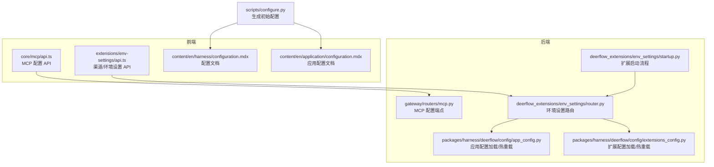
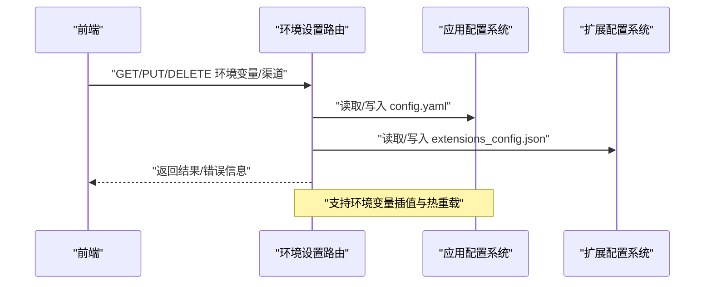
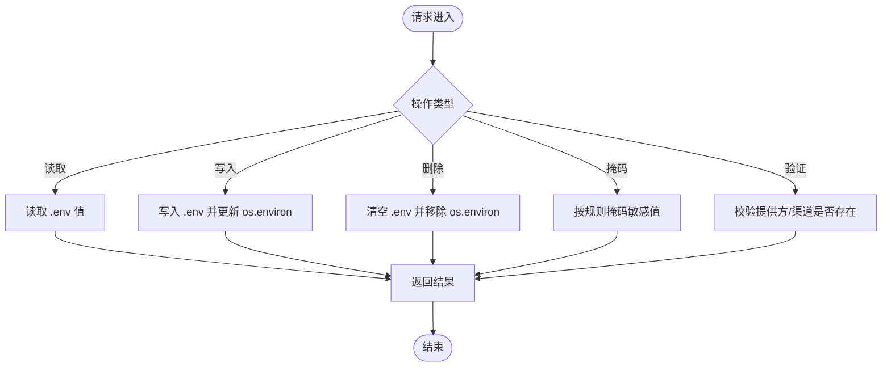
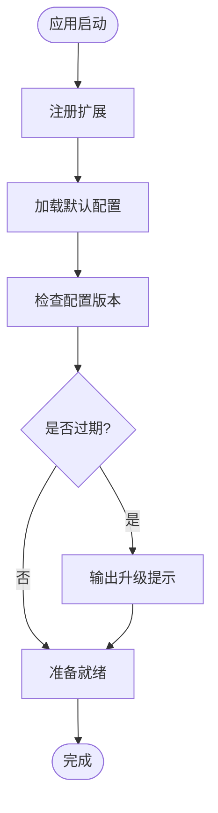
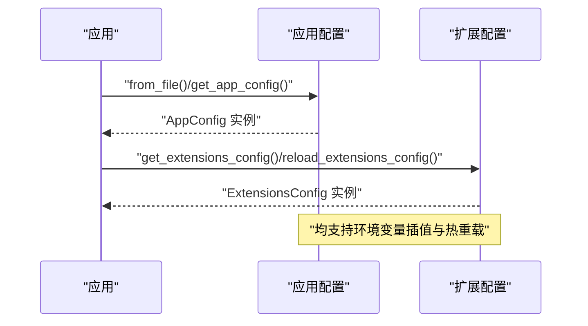
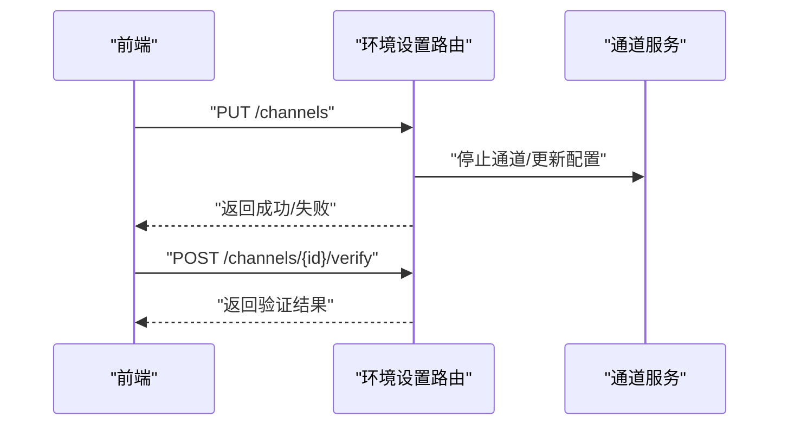
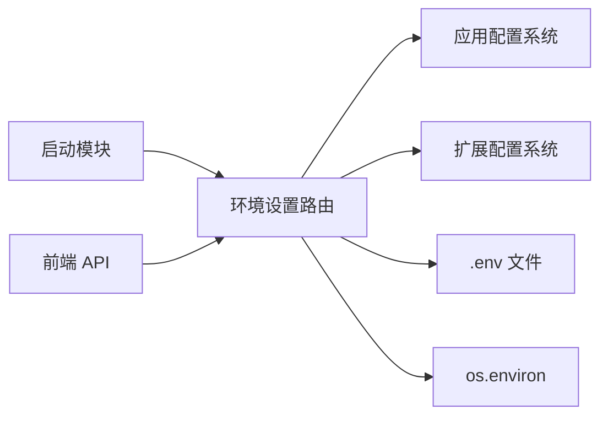

# 环境设置扩展

<cite>
**本文引用的文件**
- [deerflow_extensions/env_settings/router.py](file://deerflow_extensions/env_settings/router.py)
- [deerflow_extensions/env_settings/startup.py](file://deerflow_extensions/env_settings/startup.py)
- [backend/packages/harness/deerflow/config/app_config.py](file://backend/packages/harness/deerflow/config/app_config.py)
- [backend/packages/harness/deerflow/config/extensions_config.py](file://backend/packages/harness/deerflow/config/extensions_config.py)
- [backend/app/gateway/routers/mcp.py](file://backend/app/gateway/routers/mcp.py)
- [frontend/extensions/env-settings/api.ts](file://frontend/extensions/env-settings/api.ts)
- [frontend/src/core/mcp/api.ts](file://frontend/src/core/mcp/api.ts)
- [scripts/configure.py](file://scripts/configure.py)
- [frontend/src/content/en/harness/configuration.mdx](file://frontend/src/content/en/harness/configuration.mdx)
- [frontend/src/content/en/application/configuration.mdx](file://frontend/src/content/en/application/configuration.mdx)
- [deerflow_extensions/env_settings/tests/test_file_lock.py](file://deerflow_extensions/env_settings/tests/test_file_lock.py)
</cite>

## 目录
1. [简介](#简介)
2. [项目结构](#项目结构)
3. [核心组件](#核心组件)
4. [架构总览](#架构总览)
5. [详细组件分析](#详细组件分析)
6. [依赖关系分析](#依赖关系分析)
7. [性能考量](#性能考量)
8. [故障排查指南](#故障排查指南)
9. [结论](#结论)
10. [附录](#附录)

## 简介
本技术文档围绕“环境设置扩展”展开，系统性阐述后端环境变量管理、渠道配置系统与权限控制机制；详解路由器模块的端点设计（环境变量 CRUD、配置验证、批量更新）；梳理启动模块初始化流程（配置加载、默认值设置、兼容性检查）；并给出命名规范、作用域与继承机制、配置模板示例、部署与运维指南，以及前端集成方式、实时配置更新与配置审计能力。

## 项目结构
环境设置扩展位于 deerflow_extensions/env_settings，包含路由与启动逻辑；后端 Harness 提供应用级配置加载与热重载；前端提供环境设置页面与 API 调用封装；脚本负责生成初始配置模板。

**图表来源**
- [deerflow_extensions/env_settings/router.py](file://deerflow_extensions/env_settings/router.py)
- [deerflow_extensions/env_settings/startup.py](file://deerflow_extensions/env_settings/startup.py)
- [backend/app/gateway/routers/mcp.py](file://backend/app/gateway/routers/mcp.py)
- [backend/packages/harness/deerflow/config/app_config.py](file://backend/packages/harness/deerflow/config/app_config.py)
- [backend/packages/harness/deerflow/config/extensions_config.py](file://backend/packages/harness/deerflow/config/extensions_config.py)
- [frontend/extensions/env-settings/api.ts](file://frontend/extensions/env-settings/api.ts)
- [frontend/src/core/mcp/api.ts](file://frontend/src/core/mcp/api.ts)
- [scripts/configure.py](file://scripts/configure.py)
- [frontend/src/content/en/harness/configuration.mdx](file://frontend/src/content/en/harness/configuration.mdx)
- [frontend/src/content/en/application/configuration.mdx](file://frontend/src/content/en/application/configuration.mdx)

**章节来源**
- [deerflow_extensions/env_settings/router.py](file://deerflow_extensions/env_settings/router.py)
- [deerflow_extensions/env_settings/startup.py](file://deerflow_extensions/env_settings/startup.py)
- [backend/packages/harness/deerflow/config/app_config.py](file://backend/packages/harness/deerflow/config/app_config.py)
- [backend/packages/harness/deerflow/config/extensions_config.py](file://backend/packages/harness/deerflow/config/extensions_config.py)
- [frontend/extensions/env-settings/api.ts](file://frontend/extensions/env-settings/api.ts)
- [frontend/src/core/mcp/api.ts](file://frontend/src/core/mcp/api.ts)
- [scripts/configure.py](file://scripts/configure.py)
- [frontend/src/content/en/harness/configuration.mdx](file://frontend/src/content/en/harness/configuration.mdx)
- [frontend/src/content/en/application/configuration.mdx](file://frontend/src/content/en/application/configuration.mdx)

## 核心组件
- 环境设置路由模块：提供环境变量的读取、写入、删除、掩码显示、渠道配置的增删改查与连通性验证。
- 启动模块：在应用启动时注册扩展、加载默认配置、执行兼容性检查与版本提示。
- 应用配置系统：支持 config.yaml 的多源解析、环境变量插值、热重载与版本升级提示。
- 扩展配置系统：支持 extensions_config.json 的热重载与环境变量插值。
- 前端集成：提供渠道与环境设置的 API 封装，支持批量更新与验证。

**章节来源**
- [deerflow_extensions/env_settings/router.py](file://deerflow_extensions/env_settings/router.py)
- [deerflow_extensions/env_settings/startup.py](file://deerflow_extensions/env_settings/startup.py)
- [backend/packages/harness/deerflow/config/app_config.py](file://backend/packages/harness/deerflow/config/app_config.py)
- [backend/packages/harness/deerflow/config/extensions_config.py](file://backend/packages/harness/deerflow/config/extensions_config.py)

## 架构总览
环境设置扩展通过路由模块与后端配置系统交互，前端通过 API 与后端通信，实现对环境变量与渠道配置的集中管理与实时生效。

**图表来源**
- [deerflow_extensions/env_settings/router.py](file://deerflow_extensions/env_settings/router.py)
- [backend/packages/harness/deerflow/config/app_config.py](file://backend/packages/harness/deerflow/config/app_config.py)
- [backend/packages/harness/deerflow/config/extensions_config.py](file://backend/packages/harness/deerflow/config/extensions_config.py)

## 详细组件分析

### 路由器模块（环境设置）
- 端点职责
  - 环境变量 CRUD：读取、写入、删除 .env 文件中的键值，并同步 os.environ。
  - 掩码显示：敏感值在响应中以掩码形式呈现，避免泄露真实内容。
  - 渠道配置：支持渠道启用/禁用、字段校验、连通性验证、批量更新。
  - 权限控制：对不存在的提供方或渠道进行 404 错误处理。
- 关键流程
  - 写入流程：先写入 .env，再更新进程内环境变量，记录日志。
  - 删除流程：清空 .env 对应键，同时从 os.environ 中移除。
  - 掩码策略：根据长度对敏感值进行截断与掩码。
  - 批量更新：支持一次性提交多个渠道配置项，逐项校验与持久化。
  - 审计日志：对关键操作（如删除渠道配置）记录审计事件。

**图表来源**
- [deerflow_extensions/env_settings/router.py](file://deerflow_extensions/env_settings/router.py)

**章节来源**
- [deerflow_extensions/env_settings/router.py](file://deerflow_extensions/env_settings/router.py)

### 启动模块（初始化流程）
- 初始化步骤
  - 注册扩展：在应用启动时注册环境设置扩展。
  - 默认值设置：加载默认配置，确保关键键存在且具备合理缺省值。
  - 兼容性检查：检测配置版本与示例文件版本，提示用户进行升级合并。
  - 热重载准备：为后续配置变更提供缓存与重载机制。
- 版本提示逻辑
  - 通过对比用户配置版本与示例文件版本，输出警告提示，引导用户执行升级命令。

**图表来源**
- [deerflow_extensions/env_settings/startup.py](file://deerflow_extensions/env_settings/startup.py)
- [backend/packages/harness/deerflow/config/app_config.py](file://backend/packages/harness/deerflow/config/app_config.py)

**章节来源**
- [deerflow_extensions/env_settings/startup.py](file://deerflow_extensions/env_settings/startup.py)
- [backend/packages/harness/deerflow/config/app_config.py](file://backend/packages/harness/deerflow/config/app_config.py)

### 配置系统（应用与扩展）
- 应用配置（config.yaml）
  - 多源解析：支持显式路径、环境变量、相对路径等优先级。
  - 环境变量插值：使用 $VAR_NAME 语法在配置中引用环境变量。
  - 热重载：基于文件修改时间判断是否需要重新加载。
  - 版本提示：当用户配置版本落后于示例文件时发出警告。
- 扩展配置（extensions_config.json）
  - 热重载：支持在不重启服务的情况下重新加载扩展配置。
  - 环境变量插值：递归解析配置中的占位符，未解析的占位符保留为空字符串。

**图表来源**
- [backend/packages/harness/deerflow/config/app_config.py](file://backend/packages/harness/deerflow/config/app_config.py)
- [backend/packages/harness/deerflow/config/extensions_config.py](file://backend/packages/harness/deerflow/config/extensions_config.py)

**章节来源**
- [backend/packages/harness/deerflow/config/app_config.py](file://backend/packages/harness/deerflow/config/app_config.py)
- [backend/packages/harness/deerflow/config/extensions_config.py](file://backend/packages/harness/deerflow/config/extensions_config.py)

### 前端集成与实时更新
- 前端 API 封装
  - 环境设置：提供更新渠道配置、删除渠道配置、验证渠道连通性的接口。
  - MCP 配置：提供加载与更新 MCP 配置的接口。
- 实时更新
  - 后端支持热重载，前端在调用更新接口后可结合后端日志确认生效。
  - 对于需要重启的服务（如渠道），后端会尝试停止对应通道后再更新配置。

**图表来源**
- [frontend/extensions/env-settings/api.ts](file://frontend/extensions/env-settings/api.ts)
- [deerflow_extensions/env_settings/router.py](file://deerflow_extensions/env_settings/router.py)

**章节来源**
- [frontend/extensions/env-settings/api.ts](file://frontend/extensions/env-settings/api.ts)
- [frontend/src/core/mcp/api.ts](file://frontend/src/core/mcp/api.ts)
- [deerflow_extensions/env_settings/router.py](file://deerflow_extensions/env_settings/router.py)

## 依赖关系分析
- 组件耦合
  - 路由器模块依赖应用配置与扩展配置系统，用于读取与写入配置。
  - 启动模块负责在应用生命周期早期注册扩展并准备默认配置。
  - 前端通过 API 与后端交互，实现配置的可视化与实时更新。
- 外部依赖
  - dotenv：用于 .env 文件的读写与键值管理。
  - os.environ：用于进程内环境变量的即时生效。
  - HTTP 异常：统一的错误响应格式，便于前端展示。

**图表来源**
- [deerflow_extensions/env_settings/router.py](file://deerflow_extensions/env_settings/router.py)
- [deerflow_extensions/env_settings/startup.py](file://deerflow_extensions/env_settings/startup.py)
- [backend/packages/harness/deerflow/config/app_config.py](file://backend/packages/harness/deerflow/config/app_config.py)
- [backend/packages/harness/deerflow/config/extensions_config.py](file://backend/packages/harness/deerflow/config/extensions_config.py)

**章节来源**
- [deerflow_extensions/env_settings/router.py](file://deerflow_extensions/env_settings/router.py)
- [deerflow_extensions/env_settings/startup.py](file://deerflow_extensions/env_settings/startup.py)
- [backend/packages/harness/deerflow/config/app_config.py](file://backend/packages/harness/deerflow/config/app_config.py)
- [backend/packages/harness/deerflow/config/extensions_config.py](file://backend/packages/harness/deerflow/config/extensions_config.py)

## 性能考量
- 热重载策略
  - 应用配置与扩展配置均基于文件修改时间判断是否需要重载，避免不必要的 IO。
- 写入一致性
  - .env 写入采用原子更新策略，减少并发冲突风险（见测试用例对文件锁的验证）。
- 掩码与安全
  - 敏感值在响应中被掩码，降低泄露风险；仅在必要时才回写真实值。

**章节来源**
- [deerflow_extensions/env_settings/tests/test_file_lock.py](file://deerflow_extensions/env_settings/tests/test_file_lock.py)
- [deerflow_extensions/env_settings/router.py](file://deerflow_extensions/env_settings/router.py)

## 故障排查指南
- 配置文件找不到
  - 检查 config.yaml 解析优先级与 DEER_FLOW_CONFIG_PATH 环境变量。
- 环境变量插值异常
  - 确认 $VAR_NAME 占位符是否正确，未解析的占位符会被替换为空字符串。
- 渠道配置更新失败
  - 检查提供方 ID 是否存在，字段是否符合要求；必要时使用验证端点先行测试。
- 渠道无法启动
  - 后端会在更新配置时尝试停止对应通道，若仍无法启动，请检查凭据与网络连通性。
- 前端无响应
  - 确认后端 API 可达，查看浏览器网络面板与后端日志。

**章节来源**
- [backend/packages/harness/deerflow/config/app_config.py](file://backend/packages/harness/deerflow/config/app_config.py)
- [backend/packages/harness/deerflow/config/extensions_config.py](file://backend/packages/harness/deerflow/config/extensions_config.py)
- [deerflow_extensions/env_settings/router.py](file://deerflow_extensions/env_settings/router.py)

## 结论
环境设置扩展通过清晰的路由设计、完善的配置系统与启动流程，实现了对环境变量与渠道配置的集中管理与实时生效。配合前端 API 与热重载机制，能够满足生产环境下的快速迭代与安全运维需求。

## 附录

### 环境变量命名规范
- 建议使用全大写字母与下划线分隔的命名风格。
- 敏感信息建议通过 .env 文件管理，并在响应中进行掩码处理。
- 使用 $VAR_NAME 在配置中引用环境变量，确保跨环境一致性。

**章节来源**
- [deerflow_extensions/env_settings/router.py](file://deerflow_extensions/env_settings/router.py)
- [backend/packages/harness/deerflow/config/app_config.py](file://backend/packages/harness/deerflow/config/app_config.py)
- [backend/packages/harness/deerflow/config/extensions_config.py](file://backend/packages/harness/deerflow/config/extensions_config.py)

### 作用域与继承机制
- 作用域
  - 进程内：os.environ 仅影响当前进程。
  - 文件层：.env 文件持久化存储，重启后仍有效。
- 继承与覆盖
  - 应用配置与扩展配置支持环境变量插值，后者可覆盖前者同名字段。
  - 热重载时，新配置会替换旧实例，避免并发访问冲突。

**章节来源**
- [backend/packages/harness/deerflow/config/app_config.py](file://backend/packages/harness/deerflow/config/app_config.py)
- [backend/packages/harness/deerflow/config/extensions_config.py](file://backend/packages/harness/deerflow/config/extensions_config.py)

### 配置模板示例与部署
- 生成初始配置
  - 使用脚本一键复制示例文件与 .env 示例，减少手工配置错误。
- 部署建议
  - 将敏感配置放入 .env 并加入 .gitignore。
  - 使用环境变量插值实现多环境差异化配置。
  - 定期执行配置升级脚本，保持与示例文件一致。

**章节来源**
- [scripts/configure.py](file://scripts/configure.py)
- [frontend/src/content/en/harness/configuration.mdx](file://frontend/src/content/en/harness/configuration.mdx)
- [frontend/src/content/en/application/configuration.mdx](file://frontend/src/content/en/application/configuration.mdx)

### 运维指南
- 配置审计
  - 对关键操作（如删除渠道配置）记录审计事件，便于追踪与合规。
- 实时更新
  - 更新后观察后端日志与前端反馈，确认配置已生效。
- 兼容性检查
  - 当出现版本提示时，及时执行升级命令，合并新增字段。

**章节来源**
- [deerflow_extensions/env_settings/router.py](file://deerflow_extensions/env_settings/router.py)
- [backend/packages/harness/deerflow/config/app_config.py](file://backend/packages/harness/deerflow/config/app_config.py)