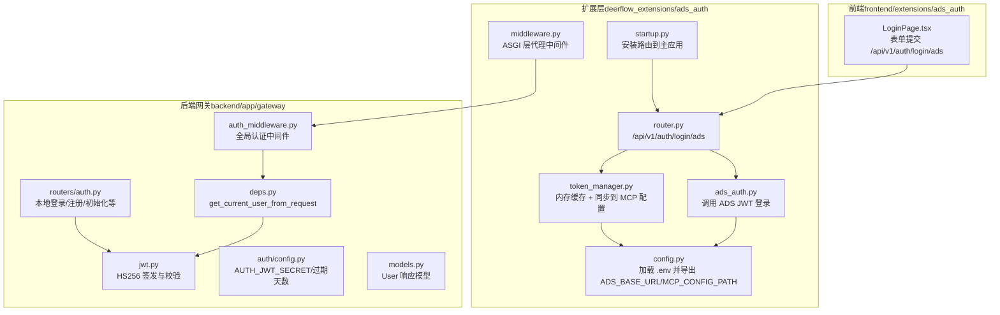
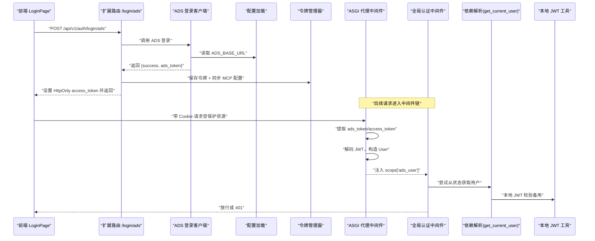
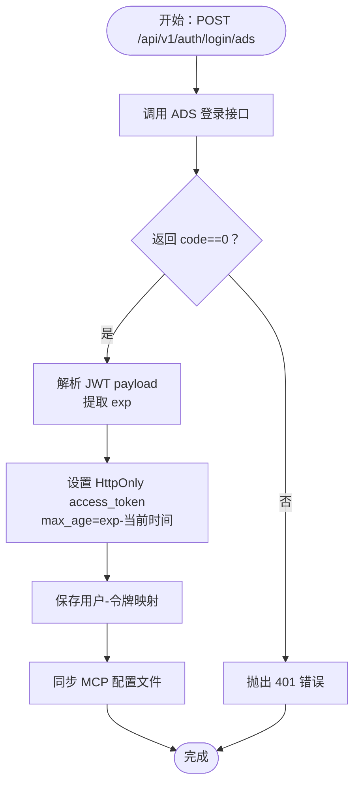
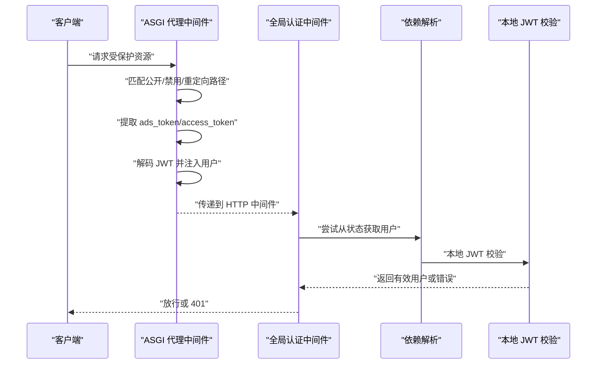
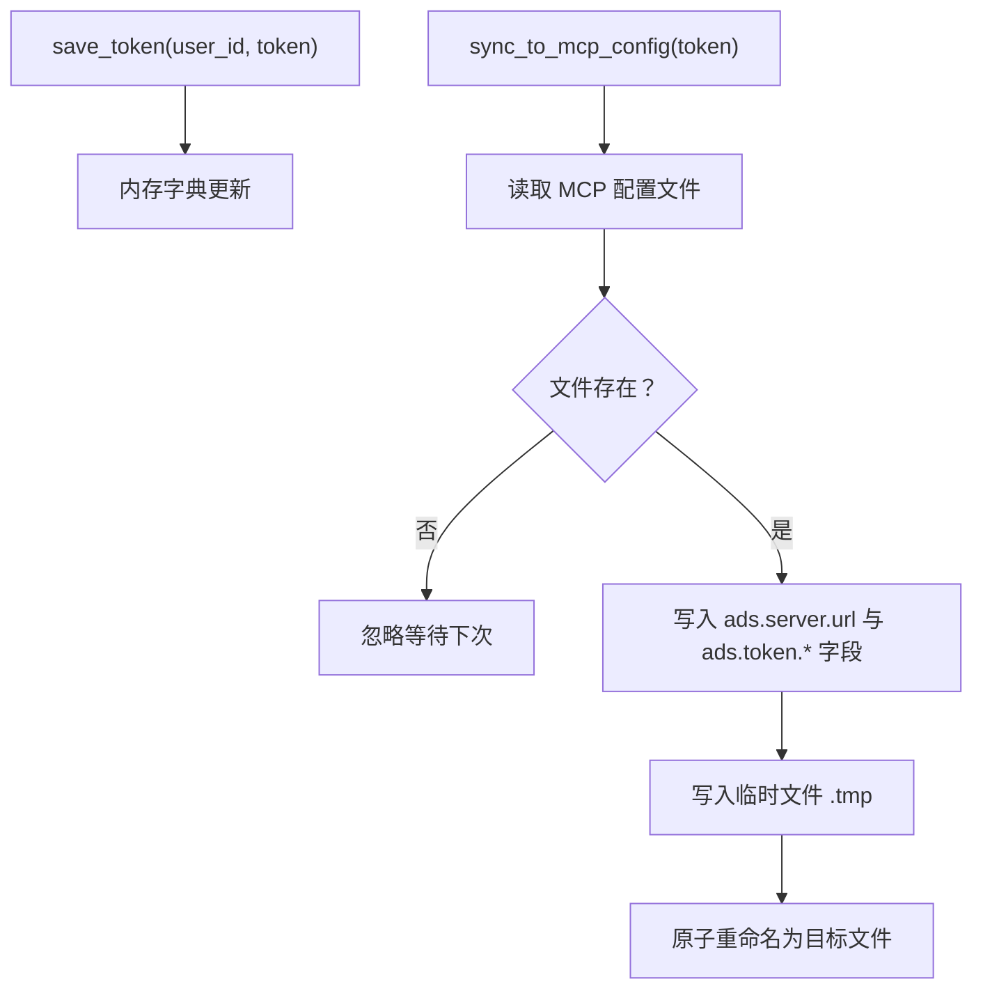
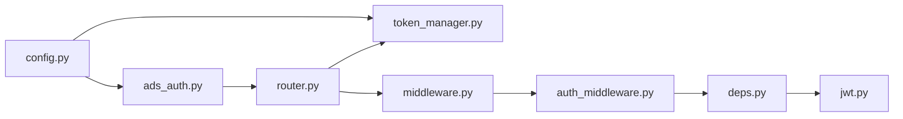

# 认证扩展（ADS Auth）

<cite>
**本文引用的文件**
- [deerflow_extensions/ads_auth/ads_auth.py](file://deerflow_extensions/ads_auth/ads_auth.py)
- [deerflow_extensions/ads_auth/config.py](file://deerflow_extensions/ads_auth/config.py)
- [deerflow_extensions/ads_auth/middleware.py](file://deerflow_extensions/ads_auth/middleware.py)
- [deerflow_extensions/ads_auth/router.py](file://deerflow_extensions/ads_auth/router.py)
- [deerflow_extensions/ads_auth/token_manager.py](file://deerflow_extensions/ads_auth/token_manager.py)
- [deerflow_extensions/ads_auth/startup.py](file://deerflow_extensions/ads_auth/startup.py)
- [backend/app/gateway/auth/jwt.py](file://backend/app/gateway/auth/jwt.py)
- [backend/app/gateway/auth/models.py](file://backend/app/gateway/auth/models.py)
- [backend/app/gateway/auth_middleware.py](file://backend/app/gateway/auth_middleware.py)
- [backend/app/gateway/routers/auth.py](file://backend/app/gateway/routers/auth.py)
- [backend/app/gateway/auth/config.py](file://backend/app/gateway/auth/config.py)
- [backend/app/gateway/deps.py](file://backend/app/gateway/deps.py)
- [frontend/extensions/ads_auth/LoginPage.tsx](file://frontend/extensions/ads_auth/LoginPage.tsx)
- [deerflow_extensions/boot.py](file://deerflow_extensions/boot.py)
</cite>

## 目录
1. [简介](#简介)
2. [项目结构](#项目结构)
3. [核心组件](#核心组件)
4. [架构总览](#架构总览)
5. [组件详解](#组件详解)
6. [依赖关系分析](#依赖关系分析)
7. [性能考量](#性能考量)
8. [故障排除指南](#故障排除指南)
9. [结论](#结论)
10. [附录](#附录)

## 简介
本文件为 ADS 认证扩展（ADS Auth）的全面技术文档，面向后端工程师与运维人员，系统阐述以下内容：
- ADS Auth 的实现架构与设计理念
- JWT 认证机制、登录流程与令牌管理策略
- 认证中间件的工作原理：请求拦截、令牌验证与权限检查
- 路由器模块的路由设计：认证端点、用户管理接口与权限控制
- 令牌管理器的实现：令牌生成、刷新、过期处理与安全存储
- 配置文件结构、环境变量设置与部署指南
- 具体集成示例、故障排除与安全最佳实践

## 项目结构
该扩展采用“零侵入扩展”模式，通过统一入口在应用生命周期内注入路由与中间件，并与后端现有认证子系统协同工作。

图表来源
- [deerflow_extensions/ads_auth/startup.py:1-23](file://deerflow_extensions/ads_auth/startup.py#L1-L23)
- [deerflow_extensions/ads_auth/router.py:1-50](file://deerflow_extensions/ads_auth/router.py#L1-L50)
- [deerflow_extensions/ads_auth/ads_auth.py:1-32](file://deerflow_extensions/ads_auth/ads_auth.py#L1-L32)
- [deerflow_extensions/ads_auth/token_manager.py:1-53](file://deerflow_extensions/ads_auth/token_manager.py#L1-L53)
- [backend/app/gateway/auth_middleware.py:1-160](file://backend/app/gateway/auth_middleware.py#L1-L160)
- [backend/app/gateway/deps.py:273-316](file://backend/app/gateway/deps.py#L273-L316)
- [backend/app/gateway/auth/jwt.py:1-56](file://backend/app/gateway/auth/jwt.py#L1-L56)
- [backend/app/gateway/routers/auth.py:1-529](file://backend/app/gateway/routers/auth.py#L1-L529)
- [frontend/extensions/ads_auth/LoginPage.tsx:1-119](file://frontend/extensions/ads_auth/LoginPage.tsx#L1-L119)

章节来源
- [deerflow_extensions/boot.py:1-111](file://deerflow_extensions/boot.py#L1-L111)
- [deerflow_extensions/ads_auth/startup.py:1-23](file://deerflow_extensions/ads_auth/startup.py#L1-L23)

## 核心组件
- 配置加载与环境变量
  - 从项目根目录加载 .env，支持 ADS_BASE_URL 与 ADS_MCP_CONFIG_PATH，默认值与路径展开。
- 登录客户端
  - 异步调用 ADS JWT 登录接口，解析返回并封装结果。
- 路由器
  - 暴露 /api/v1/auth/login/ads，接收表单参数，签发 HttpOnly cookie，并同步令牌至 MCP 配置。
- 令牌管理器
  - 内存级用户-令牌映射；将 ADS 令牌写入 MCP 配置文件（含过期时间戳）。
- 中间件
  - ASGI 层代理中间件：拦截非公开路径，提取 ads_token/access_token，解码 JWT，注入用户上下文。
  - 全局认证中间件：对非公开路径进行严格校验，支持 ADS 与本地 JWT 双通道。
- 前端登录页
  - 表单提交到 /api/v1/auth/login/ads，携带凭据并启用 withCredentials。

章节来源
- [deerflow_extensions/ads_auth/config.py:1-28](file://deerflow_extensions/ads_auth/config.py#L1-L28)
- [deerflow_extensions/ads_auth/ads_auth.py:5-32](file://deerflow_extensions/ads_auth/ads_auth.py#L5-L32)
- [deerflow_extensions/ads_auth/router.py:11-50](file://deerflow_extensions/ads_auth/router.py#L11-L50)
- [deerflow_extensions/ads_auth/token_manager.py:10-53](file://deerflow_extensions/ads_auth/token_manager.py#L10-L53)
- [deerflow_extensions/ads_auth/middleware.py:27-125](file://deerflow_extensions/ads_auth/middleware.py#L27-L125)
- [backend/app/gateway/auth_middleware.py:53-160](file://backend/app/gateway/auth_middleware.py#L53-L160)
- [frontend/extensions/ads_auth/LoginPage.tsx:42-64](file://frontend/extensions/ads_auth/LoginPage.tsx#L42-L64)

## 架构总览
下图展示 ADS 认证扩展与后端认证系统的交互关系与数据流。

图表来源
- [frontend/extensions/ads_auth/LoginPage.tsx:42-64](file://frontend/extensions/ads_auth/LoginPage.tsx#L42-L64)
- [deerflow_extensions/ads_auth/router.py:11-50](file://deerflow_extensions/ads_auth/router.py#L11-L50)
- [deerflow_extensions/ads_auth/ads_auth.py:5-32](file://deerflow_extensions/ads_auth/ads_auth.py#L5-L32)
- [deerflow_extensions/ads_auth/token_manager.py:22-53](file://deerflow_extensions/ads_auth/token_manager.py#L22-L53)
- [deerflow_extensions/ads_auth/middleware.py:37-101](file://deerflow_extensions/ads_auth/middleware.py#L37-L101)
- [backend/app/gateway/auth_middleware.py:76-160](file://backend/app/gateway/auth_middleware.py#L76-L160)
- [backend/app/gateway/deps.py:273-316](file://backend/app/gateway/deps.py#L273-L316)
- [backend/app/gateway/auth/jwt.py:40-56](file://backend/app/gateway/auth/jwt.py#L40-L56)

## 组件详解

### 配置与环境变量
- .env 加载逻辑
  - 在扩展配置模块所在目录向上查找项目根，读取 .env 文件，仅在环境变量未设置时填充。
- 关键变量
  - ADS_BASE_URL：指向 ADS 服务地址（默认 http://ads:8080）
  - ADS_MCP_CONFIG_PATH：MCP 配置文件路径（默认 ~/.config/deer-flow/ads-mcp.json）
- 安全建议
  - 生产环境务必显式设置，避免硬编码默认值。

章节来源
- [deerflow_extensions/ads_auth/config.py:6-28](file://deerflow_extensions/ads_auth/config.py#L6-L28)

### 登录流程与 JWT 机制
- 登录端点
  - 路由：/api/v1/auth/login/ads
  - 方法：POST，使用 OAuth2PasswordRequestForm 依赖注入用户名/密码
- 流程要点
  - 调用 ADS 登录接口获取 token
  - 解析 JWT payload 获取 exp，计算 max_age
  - 设置 HttpOnly cookie access_token（secure=false，同站策略 lax）
  - 保存令牌到内存映射并同步到 MCP 配置文件
- ADS 令牌验证
  - ASGI 代理中间件与全局认证中间件均支持从 cookies 中提取 ads_token 或 access_token
  - 自行解码 JWT（base64 urlsafe 解码 payload），校验 exp 与 username
  - 注入内部 User 对象到 ASGI scope 或 request.state

图表来源
- [deerflow_extensions/ads_auth/router.py:11-50](file://deerflow_extensions/ads_auth/router.py#L11-L50)
- [deerflow_extensions/ads_auth/ads_auth.py:5-32](file://deerflow_extensions/ads_auth/ads_auth.py#L5-L32)
- [deerflow_extensions/ads_auth/token_manager.py:22-53](file://deerflow_extensions/ads_auth/token_manager.py#L22-L53)

章节来源
- [deerflow_extensions/ads_auth/router.py:11-50](file://deerflow_extensions/ads_auth/router.py#L11-L50)
- [deerflow_extensions/ads_auth/ads_auth.py:5-32](file://deerflow_extensions/ads_auth/ads_auth.py#L5-L32)
- [deerflow_extensions/ads_auth/middleware.py:116-125](file://deerflow_extensions/ads_auth/middleware.py#L116-L125)

### 认证中间件工作原理
- ASGI 代理中间件（优先执行）
  - 忽略健康检查与公开路径
  - 替换被禁用的本地认证端点
  - 从 cookies 提取 ads_token/access_token，解码 JWT，构造 User 并注入 scope
- 全局认证中间件（HTTP 层）
  - 若已存在 ADS 用户则直接放行
  - 否则要求 access_token，严格校验本地 JWT（签名、过期、用户存在、版本一致）
  - 成功后设置 request.state.user 与运行时上下文

图表来源
- [deerflow_extensions/ads_auth/middleware.py:37-101](file://deerflow_extensions/ads_auth/middleware.py#L37-L101)
- [backend/app/gateway/auth_middleware.py:76-160](file://backend/app/gateway/auth_middleware.py#L76-L160)
- [backend/app/gateway/deps.py:273-316](file://backend/app/gateway/deps.py#L273-L316)
- [backend/app/gateway/auth/jwt.py:40-56](file://backend/app/gateway/auth/jwt.py#L40-L56)

章节来源
- [deerflow_extensions/ads_auth/middleware.py:27-125](file://deerflow_extensions/ads_auth/middleware.py#L27-L125)
- [backend/app/gateway/auth_middleware.py:53-160](file://backend/app/gateway/auth_middleware.py#L53-L160)
- [backend/app/gateway/deps.py:273-316](file://backend/app/gateway/deps.py#L273-L316)

### 路由器模块与权限控制
- 路由器
  - 安装于 /api/v1/auth 前缀，暴露 /login/ads
  - 与全局认证中间件配合，确保非公开路径需要有效会话
- 权限控制
  - 全局认证中间件负责认证，细粒度权限在授权装饰器中实现
  - ADS 用户通过注入的 User 对象参与下游权限判定

章节来源
- [deerflow_extensions/ads_auth/startup.py:4-23](file://deerflow_extensions/ads_auth/startup.py#L4-L23)
- [backend/app/gateway/routers/auth.py:24-529](file://backend/app/gateway/routers/auth.py#L24-L529)
- [backend/app/gateway/auth_middleware.py:24-71](file://backend/app/gateway/auth_middleware.py#L24-L71)

### 令牌管理器实现
- 内存映射
  - 保存用户 ID 到 ADS 令牌的映射，便于扩展后续功能（如批量失效）
- MCP 配置同步
  - 将 ADS 令牌写入指定 JSON 配置文件，包含服务器地址、令牌值、过期时间与登录时间
  - 使用临时文件写入后原子重命名，降低并发风险

图表来源
- [deerflow_extensions/ads_auth/token_manager.py:10-53](file://deerflow_extensions/ads_auth/token_manager.py#L10-L53)

章节来源
- [deerflow_extensions/ads_auth/token_manager.py:10-53](file://deerflow_extensions/ads_auth/token_manager.py#L10-L53)

### 前端登录页面
- 功能
  - 校验 next 参数的安全性，避免开放重定向
  - 首次访问尝试 /api/v1/auth/me 判断是否已登录
  - 提交表单到 /api/v1/auth/login/ads，携带 withCredentials
- 安全
  - 使用表单编码提交，避免明文泄露
  - 与后端设置的 HttpOnly cookie 协作

章节来源
- [frontend/extensions/ads_auth/LoginPage.tsx:12-64](file://frontend/extensions/ads_auth/LoginPage.tsx#L12-L64)

## 依赖关系分析
- 扩展与后端的耦合点
  - 通过 ASGI scope 注入用户对象，避免直接修改请求对象
  - 与全局认证中间件共享“公开路径”“禁用端点”等常量集合
- 外部依赖
  - ADS 服务：用于 JWT 登录
  - MCP 配置文件：用于工具链集成
- 内聚性与解耦
  - 登录流程集中在扩展路由与登录客户端
  - 中间件层负责横切关注点（认证、权限）

图表来源
- [deerflow_extensions/ads_auth/config.py:1-28](file://deerflow_extensions/ads_auth/config.py#L1-L28)
- [deerflow_extensions/ads_auth/ads_auth.py:1-32](file://deerflow_extensions/ads_auth/ads_auth.py#L1-L32)
- [deerflow_extensions/ads_auth/token_manager.py:1-53](file://deerflow_extensions/ads_auth/token_manager.py#L1-L53)
- [deerflow_extensions/ads_auth/router.py:1-50](file://deerflow_extensions/ads_auth/router.py#L1-L50)
- [deerflow_extensions/ads_auth/middleware.py:1-125](file://deerflow_extensions/ads_auth/middleware.py#L1-L125)
- [backend/app/gateway/auth_middleware.py:1-160](file://backend/app/gateway/auth_middleware.py#L1-L160)
- [backend/app/gateway/deps.py:273-316](file://backend/app/gateway/deps.py#L273-L316)
- [backend/app/gateway/auth/jwt.py:1-56](file://backend/app/gateway/auth/jwt.py#L1-L56)

章节来源
- [deerflow_extensions/boot.py:22-27](file://deerflow_extensions/boot.py#L22-L27)
- [deerflow_extensions/ads_auth/startup.py:4-23](file://deerflow_extensions/ads_auth/startup.py#L4-L23)

## 性能考量
- 登录路径
  - 异步 HTTP 客户端调用 ADS 服务，超时短路，避免阻塞
  - 令牌过期时间基于 JWT exp 计算，减少无效请求
- 中间件链
  - ASGI 层快速判断与解码，减少不必要的后续处理
  - 全局认证中间件仅在必要时进行本地 JWT 校验
- 存储与同步
  - 内存映射读写开销低；MCP 配置写入采用临时文件+重命名，降低竞态风险

## 故障排除指南
- 常见问题与定位
  - 无法连接 ADS 服务
    - 检查 ADS_BASE_URL 是否正确；确认网络连通性与证书设置
  - 登录失败
    - 查看返回的错误消息；确认用户名/密码正确
  - 401 未认证
    - 确认浏览器已接受 HttpOnly cookie；检查 SameSite/Secure 设置
    - 若使用代理，确认 Cookie 正确透传
  - 令牌过期
    - 前端需重新登录；后端不会自动刷新 ADS 令牌
  - MCP 配置未更新
    - 检查 ADS_MCP_CONFIG_PATH 权限与可写性；确认 JSON 结构正确
- 排错步骤
  - 后端日志：查看中间件与依赖解析的异常堆栈
  - 前端网络：确认 /api/v1/auth/login/ads 返回 200 且设置了 access_token
  - 配置文件：核对 MCP 配置文件中的 ads.token 字段

章节来源
- [deerflow_extensions/ads_auth/ads_auth.py:19-22](file://deerflow_extensions/ads_auth/ads_auth.py#L19-L22)
- [deerflow_extensions/ads_auth/router.py:17-18](file://deerflow_extensions/ads_auth/router.py#L17-L18)
- [backend/app/gateway/auth_middleware.py:117-126](file://backend/app/gateway/auth_middleware.py#L117-L126)
- [deerflow_extensions/ads_auth/token_manager.py:29-32](file://deerflow_extensions/ads_auth/token_manager.py#L29-L32)

## 结论
ADS 认证扩展通过“零侵入”方式无缝接入现有后端认证体系，利用 ASGI 与 HTTP 双层中间件实现严格的认证与权限控制，结合前端登录页与 MCP 配置同步，形成闭环的认证与工具链集成方案。生产部署建议明确配置项、强化传输安全与文件权限，并建立完善的监控与排障流程。

## 附录

### 配置文件结构与环境变量
- .env 示例字段
  - ADS_BASE_URL：ADS 服务地址
  - ADS_MCP_CONFIG_PATH：MCP 配置文件路径
- 后端 JWT 配置
  - AUTH_JWT_SECRET：本地 JWT 密钥（若未设置，系统自动生成并持久化）
  - token_expiry_days：本地 JWT 过期天数

章节来源
- [deerflow_extensions/ads_auth/config.py:25-28](file://deerflow_extensions/ads_auth/config.py#L25-L28)
- [backend/app/gateway/auth/config.py:23-27](file://backend/app/gateway/auth/config.py#L23-L27)

### 部署指南
- 扩展注入
  - 应用启动时通过统一入口加载扩展，自动安装路由与中间件
- 环境准备
  - 设置 ADS_BASE_URL 与 ADS_MCP_CONFIG_PATH
  - 确保 MCP 配置文件目录可写
- 安全加固
  - 前端与后端通信建议走 HTTPS
  - Cookie 设置 secure=true（HTTPS 环境）
  - 限制代理信任范围，避免 X-Forwarded-* 滥用

章节来源
- [deerflow_extensions/boot.py:56-77](file://deerflow_extensions/boot.py#L56-L77)
- [backend/app/gateway/auth_middleware.py:138-146](file://backend/app/gateway/auth_middleware.py#L138-L146)

### 集成示例
- 前端登录
  - 表单提交到 /api/v1/auth/login/ads，携带 withCredentials
- 后端路由
  - 扩展自动挂载 /api/v1/auth/login/ads
- MCP 集成
  - 登录成功后同步 ADS 令牌到 MCP 配置文件

章节来源
- [frontend/extensions/ads_auth/LoginPage.tsx:42-64](file://frontend/extensions/ads_auth/LoginPage.tsx#L42-L64)
- [deerflow_extensions/ads_auth/startup.py:15-17](file://deerflow_extensions/ads_auth/startup.py#L15-L17)
- [deerflow_extensions/ads_auth/token_manager.py:22-53](file://deerflow_extensions/ads_auth/token_manager.py#L22-L53)