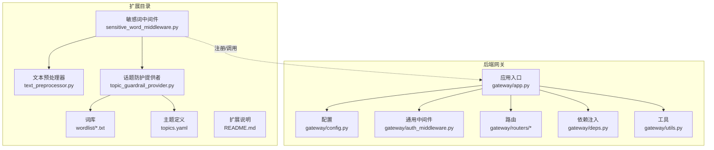
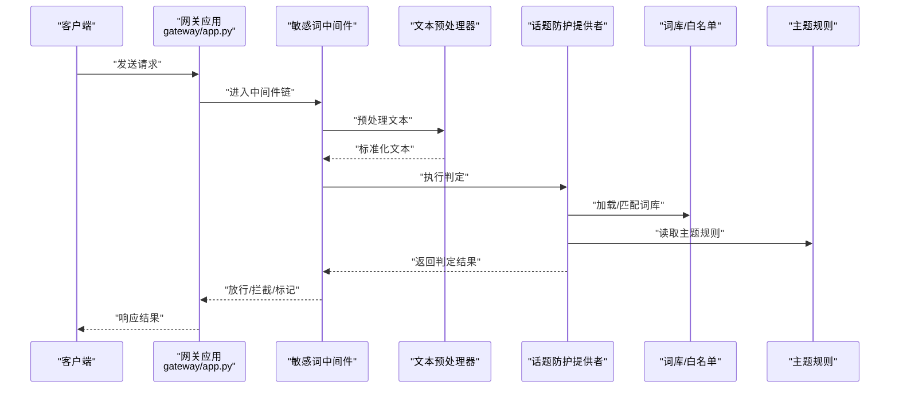
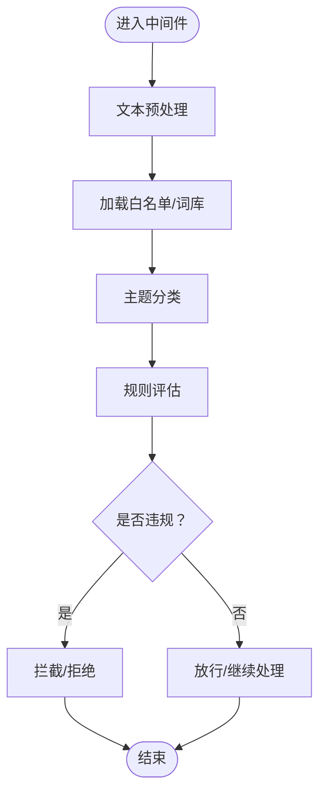
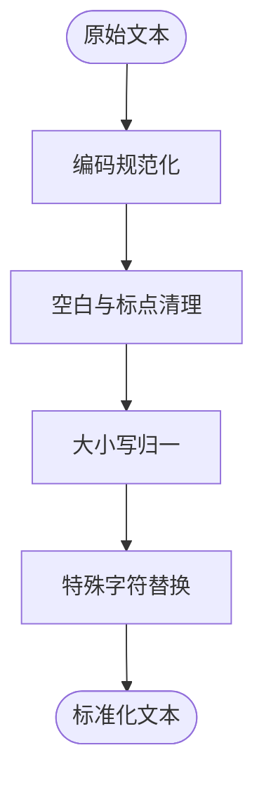
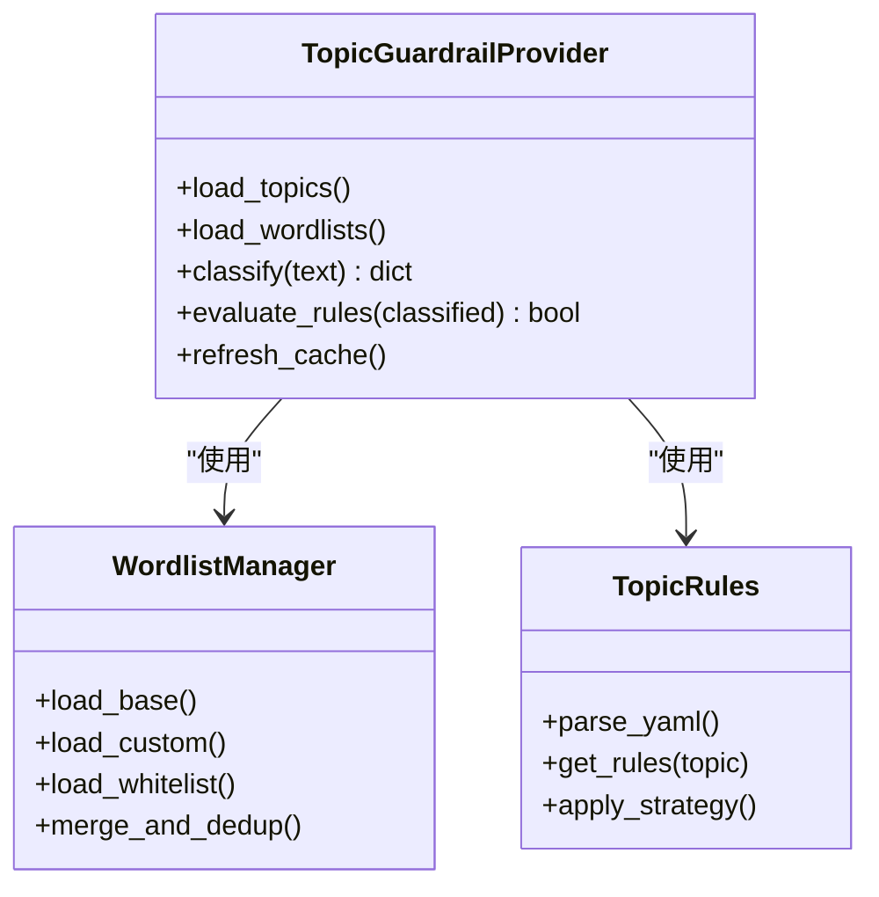
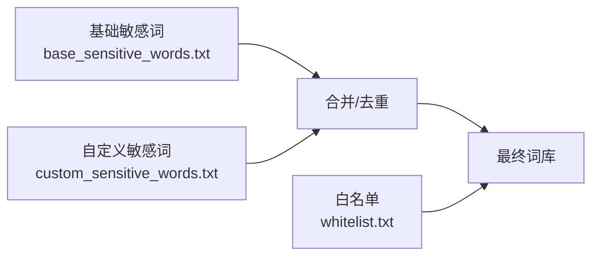
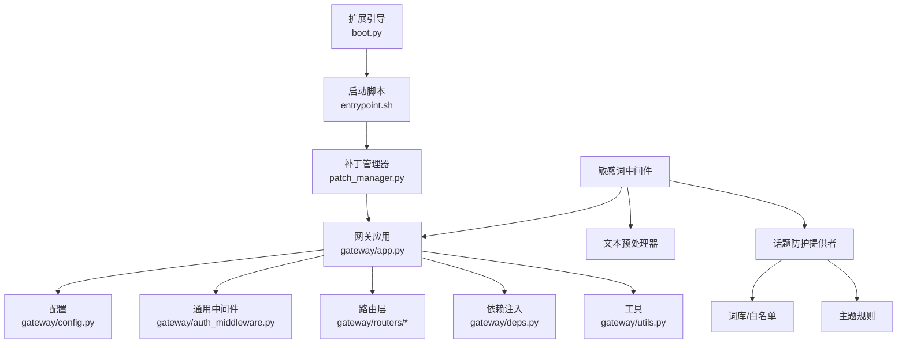

# 话题防护扩展

<cite>
**本文引用的文件**
- [sensitive_word_middleware.py](file://deerflow_extensions/topic_guardrail/sensitive_word_middleware.py)
- [text_preprocessor.py](file://deerflow_extensions/topic_guardrail/text_preprocessor.py)
- [topic_guardrail_provider.py](file://deerflow_extensions/topic_guardrail/topic_guardrail_provider.py)
- [topics.yaml](file://deerflow_extensions/topic_guardrail/topics.yaml)
- [base_sensitive_words.txt](file://deerflow_extensions/topic_guardrail/wordlist/base_sensitive_words.txt)
- [custom_sensitive_words.txt](file://deerflow_extensions/topic_guardrail/wordlist/custom_sensitive_words.txt)
- [whitelist.txt](file://deerflow_extensions/topic_guardrail/wordlist/whitelist.txt)
- [README.md](file://deerflow_extensions/topic_guardrail/README.md)
- [boot.py](file://deerflow_extensions/boot.py)
- [entrypoint.sh](file://deerflow_extensions/entrypoint.sh)
- [patch_manager.py](file://deerflow_extensions/patch_manager.py)
- [middleware.py](file://backend/app/gateway/auth_middleware.py)
- [routers.py](file://backend/app/gateway/routers/auth.py)
- [app.py](file://backend/app/gateway/app.py)
- [config.py](file://backend/app/gateway/config.py)
- [deps.py](file://backend/app/gateway/deps.py)
- [utils.py](file://backend/app/gateway/utils.py)
- [providers.py](file://backend/app/gateway/auth/providers.py)
- [models.py](file://backend/app/gateway/auth/models.py)
- [credential_file.py](file://backend/app/gateway/auth/credential_file.py)
- [jwt.py](file://backend/app/gateway/auth/jwt.py)
- [password.py](file://backend/app/gateway/auth/password.py)
- [local_provider.py](file://backend/app/gateway/auth/local_provider.py)
- [errors.py](file://backend/app/gateway/auth/errors.py)
- [reset_admin.py](file://backend/app/gateway/auth/reset_admin.py)
- [store.py](file://backend/app/channels/store.py)
- [manager.py](file://backend/app/channels/manager.py)
- [service.py](file://backend/app/channels/service.py)
- [message_bus.py](file://backend/app/channels/message_bus.py)
- [commands.py](file://backend/app/channels/commands.py)
- [base.py](file://backend/app/channels/base.py)
- [dingtalk.py](file://backend/app/channels/dingtalk.py)
- [discord.py](file://backend/app/channels/discord.py)
- [feishu.py](file://backend/app/channels/feishu.py)
- [slack.py](file://backend/app/channels/slack.py)
- [telegram.py](file://backend/app/channels/telegram.py)
- [wechat.py](file://backend/app/channels/wechat.py)
- [wecom.py](file://backend/app/channels/wecom.py)
- [guards_builtin.py](file://backend/packages/harness/deerflow/guardrails/builtin.py)
- [guards_middleware.py](file://backend/packages/harness/deerflow/guardrails/middleware.py)
- [guards_provider.py](file://backend/packages/harness/deerflow/guardrails/provider.py)
</cite>

## 目录
1. [简介](#简介)
2. [项目结构](#项目结构)
3. [核心组件](#核心组件)
4. [架构总览](#架构总览)
5. [详细组件分析](#详细组件分析)
6. [依赖关系分析](#依赖关系分析)
7. [性能考虑](#性能考虑)
8. [故障排查指南](#故障排查指南)
9. [结论](#结论)
10. [附录](#附录)

## 简介
本技术文档围绕“话题防护扩展”展开，系统性介绍敏感词过滤体系的设计与实现，涵盖内容审核机制、白名单管理、自定义规则配置、敏感词中间件工作原理（文本预处理、匹配算法、过滤策略）、文本预处理器功能（编码转换、格式标准化、特殊字符处理）、话题防护提供者（主题分类、规则引擎、动态更新机制），并提供词库管理、自定义词典配置与规则定制指南，以及性能优化、准确率提升与合规性要求。

## 项目结构
话题防护扩展位于 deerflow_extensions/topic_guardrail 目录下，包含以下关键模块：
- 中间件：敏感词过滤中间件
- 文本预处理器：统一输入文本格式，提升匹配准确率
- 话题防护提供者：基于主题分类与规则引擎进行判定
- 词库：基础敏感词、自定义敏感词、白名单
- 主题定义：YAML 文件定义话题类别与规则映射
- 扩展引导：boot.py、entrypoint.sh、patch_manager.py 负责加载与注入

图示来源
- [sensitive_word_middleware.py](file://deerflow_extensions/topic_guardrail/sensitive_word_middleware.py)
- [text_preprocessor.py](file://deerflow_extensions/topic_guardrail/text_preprocessor.py)
- [topic_guardrail_provider.py](file://deerflow_extensions/topic_guardrail/topic_guardrail_provider.py)
- [topics.yaml](file://deerflow_extensions/topic_guardrail/topics.yaml)
- [base_sensitive_words.txt](file://deerflow_extensions/topic_guardrail/wordlist/base_sensitive_words.txt)
- [custom_sensitive_words.txt](file://deerflow_extensions/topic_guardrail/wordlist/custom_sensitive_words.txt)
- [whitelist.txt](file://deerflow_extensions/topic_guardrail/wordlist/whitelist.txt)
- [app.py](file://backend/app/gateway/app.py)
- [config.py](file://backend/app/gateway/config.py)
- [auth_middleware.py](file://backend/app/gateway/auth_middleware.py)
- [routers.py](file://backend/app/gateway/routers/auth.py)
- [deps.py](file://backend/app/gateway/deps.py)
- [utils.py](file://backend/app/gateway/utils.py)

章节来源
- [sensitive_word_middleware.py](file://deerflow_extensions/topic_guardrail/sensitive_word_middleware.py)
- [text_preprocessor.py](file://deerflow_extensions/topic_guardrail/text_preprocessor.py)
- [topic_guardrail_provider.py](file://deerflow_extensions/topic_guardrail/topic_guardrail_provider.py)
- [topics.yaml](file://deerflow_extensions/topic_guardrail/topics.yaml)
- [base_sensitive_words.txt](file://deerflow_extensions/topic_guardrail/wordlist/base_sensitive_words.txt)
- [custom_sensitive_words.txt](file://deerflow_extensions/topic_guardrail/wordlist/custom_sensitive_words.txt)
- [whitelist.txt](file://deerflow_extensions/topic_guardrail/wordlist/whitelist.txt)
- [README.md](file://deerflow_extensions/topic_guardrail/README.md)
- [boot.py](file://deerflow_extensions/boot.py)
- [entrypoint.sh](file://deerflow_extensions/entrypoint.sh)
- [patch_manager.py](file://deerflow_extensions/patch_manager.py)
- [app.py](file://backend/app/gateway/app.py)
- [config.py](file://backend/app/gateway/config.py)
- [auth_middleware.py](file://backend/app/gateway/auth_middleware.py)
- [routers.py](file://backend/app/gateway/routers/auth.py)
- [deps.py](file://backend/app/gateway/deps.py)
- [utils.py](file://backend/app/gateway/utils.py)

## 核心组件
- 敏感词过滤中间件：在请求进入业务逻辑前对消息内容进行预处理与敏感词匹配，支持白名单放行与多主题规则控制。
- 文本预处理器：执行编码规范化、大小写归一、空白与标点标准化、特殊字符替换等，降低误判与漏判。
- 话题防护提供者：根据主题分类与规则引擎判断是否触发拦截或标记，并支持动态加载词库与主题规则。
- 词库与白名单：基础敏感词、自定义敏感词与白名单三类词源，支持热更新与优先级控制。
- 主题规则：通过 YAML 定义主题类别、规则映射与匹配策略，便于扩展与维护。

章节来源
- [sensitive_word_middleware.py](file://deerflow_extensions/topic_guardrail/sensitive_word_middleware.py)
- [text_preprocessor.py](file://deerflow_extensions/topic_guardrail/text_preprocessor.py)
- [topic_guardrail_provider.py](file://deerflow_extensions/topic_guardrail/topic_guardrail_provider.py)
- [topics.yaml](file://deerflow_extensions/topic_guardrail/topics.yaml)
- [base_sensitive_words.txt](file://deerflow_extensions/topic_guardrail/wordlist/base_sensitive_words.txt)
- [custom_sensitive_words.txt](file://deerflow_extensions/topic_guardrail/wordlist/custom_sensitive_words.txt)
- [whitelist.txt](file://deerflow_extensions/topic_guardrail/wordlist/whitelist.txt)

## 架构总览
话题防护扩展通过中间件拦截请求，调用文本预处理器清洗输入，再由话题防护提供者结合词库与主题规则进行判定，最终决定放行、标记或拦截。

图示来源
- [sensitive_word_middleware.py](file://deerflow_extensions/topic_guardrail/sensitive_word_middleware.py)
- [text_preprocessor.py](file://deerflow_extensions/topic_guardrail/text_preprocessor.py)
- [topic_guardrail_provider.py](file://deerflow_extensions/topic_guardrail/topic_guardrail_provider.py)
- [topics.yaml](file://deerflow_extensions/topic_guardrail/topics.yaml)
- [base_sensitive_words.txt](file://deerflow_extensions/topic_guardrail/wordlist/base_sensitive_words.txt)
- [custom_sensitive_words.txt](file://deerflow_extensions/topic_guardrail/wordlist/custom_sensitive_words.txt)
- [whitelist.txt](file://deerflow_extensions/topic_guardrail/wordlist/whitelist.txt)
- [app.py](file://backend/app/gateway/app.py)

## 详细组件分析

### 敏感词过滤中间件
职责与流程
- 在请求进入业务处理前执行，确保所有文本内容均经过审核。
- 调用文本预处理器进行格式标准化，降低噪声干扰。
- 委托话题防护提供者进行主题分类与规则匹配。
- 支持白名单放行与多主题规则组合策略。

关键行为
- 输入预处理：大小写归一、空白与标点标准化、特殊字符替换。
- 匹配策略：精确匹配、模糊匹配、正则扩展（依据主题规则）。
- 过滤策略：直接拦截、标记后放行、记录日志并上报。

图示来源
- [sensitive_word_middleware.py](file://deerflow_extensions/topic_guardrail/sensitive_word_middleware.py)
- [text_preprocessor.py](file://deerflow_extensions/topic_guardrail/text_preprocessor.py)
- [topic_guardrail_provider.py](file://deerflow_extensions/topic_guardrail/topic_guardrail_provider.py)
- [whitelist.txt](file://deerflow_extensions/topic_guardrail/wordlist/whitelist.txt)
- [base_sensitive_words.txt](file://deerflow_extensions/topic_guardrail/wordlist/base_sensitive_words.txt)
- [custom_sensitive_words.txt](file://deerflow_extensions/topic_guardrail/wordlist/custom_sensitive_words.txt)

章节来源
- [sensitive_word_middleware.py](file://deerflow_extensions/topic_guardrail/sensitive_word_middleware.py)

### 文本预处理器
功能概述
- 编码转换：统一到标准 Unicode 形态，避免编码差异导致的匹配失败。
- 格式标准化：去除多余空白、统一标点、大小写归一。
- 特殊字符处理：替换易混淆字符（如全角/半角、零宽字符、修饰符号）以减少绕过尝试。

复杂度与性能
- 时间复杂度近似 O(n)，空间复杂度 O(n)，适合流式处理与批量文本。
- 可通过缓存常用替换规则与分块处理进一步优化。

图示来源
- [text_preprocessor.py](file://deerflow_extensions/topic_guardrail/text_preprocessor.py)

章节来源
- [text_preprocessor.py](file://deerflow_extensions/topic_guardrail/text_preprocessor.py)

### 话题防护提供者
职责与能力
- 主题分类：根据主题规则将文本归类至相应话题域。
- 规则引擎：按主题定义的规则集执行匹配与权重计算。
- 动态更新：支持热加载词库与主题规则，无需重启服务。

图示来源
- [topic_guardrail_provider.py](file://deerflow_extensions/topic_guardrail/topic_guardrail_provider.py)
- [topics.yaml](file://deerflow_extensions/topic_guardrail/topics.yaml)
- [base_sensitive_words.txt](file://deerflow_extensions/topic_guardrail/wordlist/base_sensitive_words.txt)
- [custom_sensitive_words.txt](file://deerflow_extensions/topic_guardrail/wordlist/custom_sensitive_words.txt)
- [whitelist.txt](file://deerflow_extensions/topic_guardrail/wordlist/whitelist.txt)

章节来源
- [topic_guardrail_provider.py](file://deerflow_extensions/topic_guardrail/topic_guardrail_provider.py)
- [topics.yaml](file://deerflow_extensions/topic_guardrail/topics.yaml)

### 词库与白名单管理
- 基础敏感词：内置通用敏感词集合，作为默认规则的一部分。
- 自定义敏感词：允许用户上传或编辑，覆盖或补充基础词库。
- 白名单：对特定关键词或来源进行放行，优先级高于拦截策略。
- 更新机制：支持增量更新与全量刷新，保证实时生效。

图示来源
- [base_sensitive_words.txt](file://deerflow_extensions/topic_guardrail/wordlist/base_sensitive_words.txt)
- [custom_sensitive_words.txt](file://deerflow_extensions/topic_guardrail/wordlist/custom_sensitive_words.txt)
- [whitelist.txt](file://deerflow_extensions/topic_guardrail/wordlist/whitelist.txt)
- [topic_guardrail_provider.py](file://deerflow_extensions/topic_guardrail/topic_guardrail_provider.py)

章节来源
- [base_sensitive_words.txt](file://deerflow_extensions/topic_guardrail/wordlist/base_sensitive_words.txt)
- [custom_sensitive_words.txt](file://deerflow_extensions/topic_guardrail/wordlist/custom_sensitive_words.txt)
- [whitelist.txt](file://deerflow_extensions/topic_guardrail/wordlist/whitelist.txt)
- [topic_guardrail_provider.py](file://deerflow_extensions/topic_guardrail/topic_guardrail_provider.py)

### 主题规则与动态更新
- 主题定义：通过 YAML 明确定义主题、规则映射与匹配策略。
- 动态更新：提供刷新接口或自动检测机制，保障规则变更即时生效。
- 权重与阈值：可配置不同主题的权重与触发阈值，平衡准确率与召回率。

章节来源
- [topics.yaml](file://deerflow_extensions/topic_guardrail/topics.yaml)
- [topic_guardrail_provider.py](file://deerflow_extensions/topic_guardrail/topic_guardrail_provider.py)

## 依赖关系分析
扩展通过 boot.py、entrypoint.sh、patch_manager.py 注入到后端运行时，与网关应用、中间件、路由与依赖注入系统协同工作。

图示来源
- [boot.py](file://deerflow_extensions/boot.py)
- [entrypoint.sh](file://deerflow_extensions/entrypoint.sh)
- [patch_manager.py](file://deerflow_extensions/patch_manager.py)
- [app.py](file://backend/app/gateway/app.py)
- [config.py](file://backend/app/gateway/config.py)
- [auth_middleware.py](file://backend/app/gateway/auth_middleware.py)
- [routers.py](file://backend/app/gateway/routers/auth.py)
- [deps.py](file://backend/app/gateway/deps.py)
- [utils.py](file://backend/app/gateway/utils.py)
- [sensitive_word_middleware.py](file://deerflow_extensions/topic_guardrail/sensitive_word_middleware.py)
- [text_preprocessor.py](file://deerflow_extensions/topic_guardrail/text_preprocessor.py)
- [topic_guardrail_provider.py](file://deerflow_extensions/topic_guardrail/topic_guardrail_provider.py)

章节来源
- [boot.py](file://deerflow_extensions/boot.py)
- [entrypoint.sh](file://deerflow_extensions/entrypoint.sh)
- [patch_manager.py](file://deerflow_extensions/patch_manager.py)
- [app.py](file://backend/app/gateway/app.py)
- [config.py](file://backend/app/gateway/config.py)
- [auth_middleware.py](file://backend/app/gateway/auth_middleware.py)
- [routers.py](file://backend/app/gateway/routers/auth.py)
- [deps.py](file://backend/app/gateway/deps.py)
- [utils.py](file://backend/app/gateway/utils.py)

## 性能考虑
- 预处理阶段：采用高效字符串处理与正则编译缓存，减少重复开销。
- 匹配阶段：优先使用白名单快速放行；对长文本采用分段匹配与早期短路策略。
- 规则引擎：按主题分组匹配，减少全局扫描；阈值与权重配置影响整体吞吐。
- 缓存与热更新：词库与主题规则缓存，支持增量更新与原子切换，避免阻塞。
- 并发与限流：在高并发场景下限制中间件执行时间，必要时引入队列与异步处理。

## 故障排查指南
常见问题与定位思路
- 中间件未生效：检查扩展引导与注入顺序，确认网关中间件链中已注册。
- 准确率异常：核查预处理规则是否过度清洗；调整主题阈值与规则权重。
- 词库不生效：确认词库路径与权限；检查合并与去重逻辑；验证热更新是否成功。
- 白名单误伤：核对白名单条目与匹配策略，避免通配符滥用。
- 规则冲突：梳理主题规则间的优先级与互斥关系，必要时拆分或合并主题。

章节来源
- [sensitive_word_middleware.py](file://deerflow_extensions/topic_guardrail/sensitive_word_middleware.py)
- [text_preprocessor.py](file://deerflow_extensions/topic_guardrail/text_preprocessor.py)
- [topic_guardrail_provider.py](file://deerflow_extensions/topic_guardrail/topic_guardrail_provider.py)
- [topics.yaml](file://deerflow_extensions/topic_guardrail/topics.yaml)
- [base_sensitive_words.txt](file://deerflow_extensions/topic_guardrail/wordlist/base_sensitive_words.txt)
- [custom_sensitive_words.txt](file://deerflow_extensions/topic_guardrail/wordlist/custom_sensitive_words.txt)
- [whitelist.txt](file://deerflow_extensions/topic_guardrail/wordlist/whitelist.txt)

## 结论
话题防护扩展通过“中间件-预处理-提供者-词库-主题规则”的完整链路，实现了可配置、可扩展、可动态更新的敏感词过滤体系。结合白名单与多主题规则，既能满足高准确率需求，又能灵活适配不同业务场景。建议在生产环境中配合缓存、限流与监控，持续优化性能与准确率，并严格遵循合规要求。

## 附录

### 自定义词典配置与规则定制指南
- 新增自定义敏感词：在自定义词典中添加新条目，支持批量导入与单条编辑。
- 维护白名单：仅保留明确可信来源与关键词，定期审计与清理。
- 定制主题规则：在主题 YAML 中新增或修改规则，设置匹配策略与阈值。
- 动态更新：通过刷新接口或文件监听机制，确保规则与词库即时生效。

章节来源
- [custom_sensitive_words.txt](file://deerflow_extensions/topic_guardrail/wordlist/custom_sensitive_words.txt)
- [whitelist.txt](file://deerflow_extensions/topic_guardrail/wordlist/whitelist.txt)
- [topics.yaml](file://deerflow_extensions/topic_guardrail/topics.yaml)
- [topic_guardrail_provider.py](file://deerflow_extensions/topic_guardrail/topic_guardrail_provider.py)

### 合规性要求
- 数据最小化：仅处理必要的文本内容，避免无关信息留存。
- 可追溯性：记录拦截与标记事件，保留审计日志。
- 用户权利：提供申诉与复核渠道，保障用户知情权与纠正权。
- 法律适配：根据地域法规调整规则与阈值，确保符合当地法律要求。