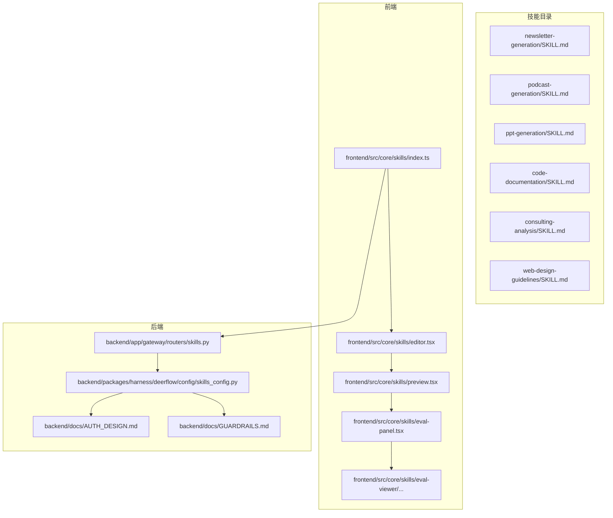
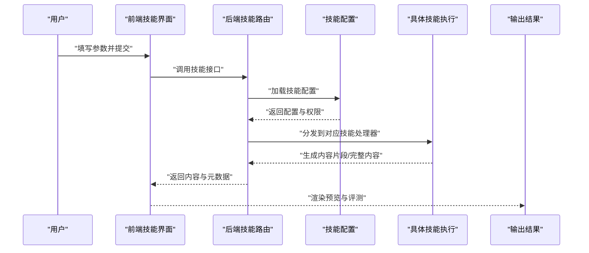
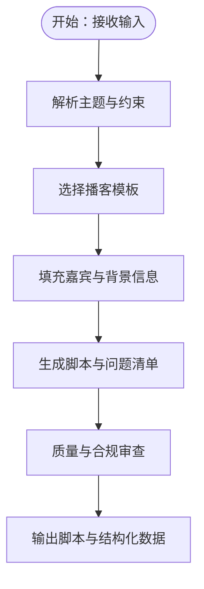
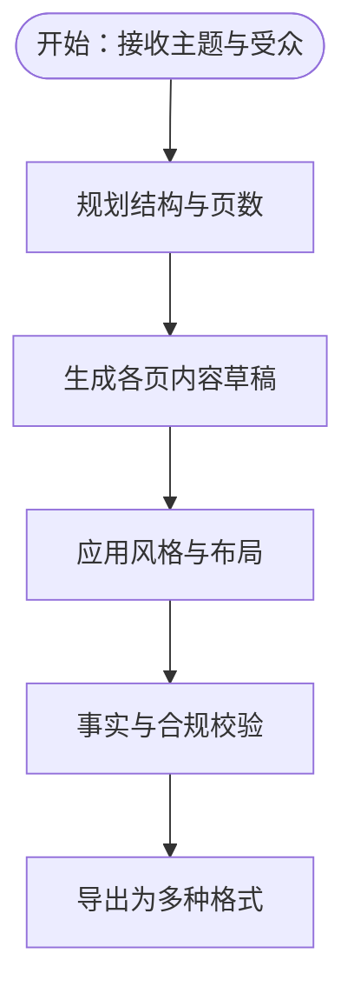
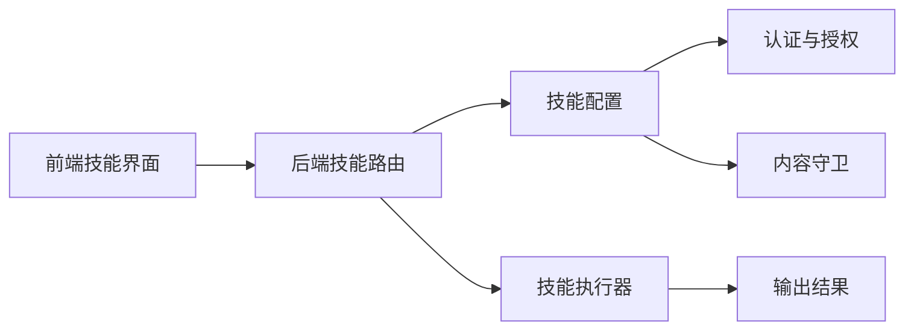

# 内容生成类技能

<cite>
**本文引用的文件**
- [newsletter-generation/SKILL.md](file://skills/public/newsletter-generation/SKILL.md)
- [podcast-generation/SKILL.md](file://skills/public/podcast-generation/SKILL.md)
- [ppt-generation/SKILL.md](file://skills/public/ppt-generation/SKILL.md)
- [code-documentation/SKILL.md](file://skills/public/code-documentation/SKILL.md)
- [consulting-analysis/SKILL.md](file://skills/public/consulting-analysis/SKILL.md)
- [web-design-guidelines/SKILL.md](file://skills/public/web-design-guidelines/SKILL.md)
- [podcast-generation/scripts/generate.py](file://skills/public/podcast-generation/scripts/generate.py)
- [ppt-generation/scripts/generate.py](file://skills/public/ppt-generation/scripts/generate.py)
- [systematic-literature-review/templates/apa.md](file://skills/public/systematic-literature-review/templates/apa.md)
- [systematic-literature-review/templates/bibtex.md](file://skills/public/systematic-literature-review/templates/bibtex.md)
- [systematic-literature-review/templates/ieee.md](file://skills/public/systematic-literature-review/templates/ieee.md)
- [chart-visualization/references/generate_mind_map.md](file://skills/public/chart-visualization/references/generate_mind_map.md)
- [chart-visualization/references/generate_network_graph.md](file://skills/public/chart-visualization/references/generate_network_graph.md)
- [bootstrap/templates/SOUL.template.md](file://skills/public/bootstrap/templates/SOUL.template.md)
- [bootstrap/references/conversation-guide.md](file://skills/public/bootstrap/references/conversation-guide.md)
- [skill-creator/references/workflows.md](file://skills/public/skill-creator/references/workflows.md)
- [skill-creator/references/schemas.md](file://skills/public/skill-creator/references/schemas.md)
- [skill-creator/references/output-patterns.md](file://skills/public/skill-creator/references/output-patterns.md)
- [skill-creator/scripts/init_skill.py](file://skills/public/skill-creator/scripts/init_skill.py)
- [skill-creator/scripts/package_skill.py](file://skills/public/skill-creator/scripts/package_skill.py)
- [skill-creator/scripts/run_eval.py](file://skills/public/skill-creator/scripts/run_eval.py)
- [skill-creator/scripts/utils.py](file://skills/public/skill-creator/scripts/utils.py)
- [backend/app/gateway/routers/skills.py](file://backend/app/gateway/routers/skills.py)
- [backend/packages/harness/deerflow/config/skills_config.py](file://backend/packages/harness/deerflow/config/skills_config.py)
- [backend/docs/AUTH_DESIGN.md](file://backend/docs/AUTH_DESIGN.md)
- [backend/docs/GUARDRAILS.md](file://backend/docs/GUARDRAIS.md)
- [backend/docs/MEMORY_IMPROVEMENTS.md](file://backend/docs/MEMORY_IMPROVEMENTS.md)
- [backend/docs/TITLE_GENERATION_IMPLEMENTATION.md](file://backend/docs/TITLE_GENERATION_IMPLEMENTATION.md)
- [backend/docs/STREAMING.md](file://backend/docs/STREAMING.md)
- [backend/docs/TODO.md](file://backend/docs/TODO.md)
- [backend/docs/CONFIGURATION.md](file://backend/docs/CONFIGURATION.md)
- [backend/docs/SETUP.md](file://backend/docs/SETUP.md)
- [backend/docs/API.md](file://backend/docs/API.md)
- [backend/README.md](file://backend/README.md)
- [frontend/src/core/skills/index.ts](file://frontend/src/core/skills/index.ts)
- [frontend/src/components/workspace/skill-editor/editor.tsx](file://frontend/src/components/workspace/skill-editor/editor.tsx)
- [frontend/src/components/workspace/skill-editor/preview.tsx](file://frontend/src/components/workspace/skill-editor/preview.tsx)
- [frontend/src/components/workspace/skill-editor/eval-panel.tsx](file://frontend/src/components/workspace/skill-editor/eval-panel.tsx)
- [frontend/src/components/workspace/skill-editor/eval-viewer.tsx](file://frontend/src/components/workspace/skill-editor/eval-viewer.tsx)
- [frontend/src/components/ui/button.tsx](file://frontend/src/components/ui/button.tsx)
- [frontend/src/components/ui/dialog.tsx](file://frontend/src/components/ui/dialog.tsx)
- [frontend/src/components/ui/input.tsx](file://frontend/src/components/ui/input.tsx)
- [frontend/src/components/ui/textarea.tsx](file://frontend/src/components/ui/textarea.tsx)
- [frontend/src/components/ui/select.tsx](file://frontend/src/components/ui/select.tsx)
- [frontend/src/components/ui/card.tsx](file://frontend/src/components/ui/card.tsx)
- [frontend/src/components/ui/tabs.tsx](file://frontend/src/components/ui/tabs.tsx)
- [frontend/src/components/ui/tooltip.tsx](file://frontend/src/components/ui/tooltip.tsx)
- [frontend/src/components/ui/alert-dialog.tsx](file://frontend/src/components/ui/alert-dialog.tsx)
- [frontend/src/components/ui/toast.tsx](file://frontend/src/components/ui/toast.tsx)
- [frontend/src/components/ui/use-toast.ts](file://frontend/src/components/ui/use-toast.ts)
- [frontend/src/lib/utils.ts](file://frontend/src/lib/utils.ts)
- [frontend/src/env.js](file://frontend/src/env.js)
- [frontend/README.md](file://frontend/README.md)
- [deer-flow.code-workspace](file://deer-flow.code-workspace)
- [Makefile](file://Makefile)
- [scripts/build-release.sh](file://scripts/build-release.sh)
- [scripts/deploy.sh](file://scripts/deploy.sh)
- [scripts/start-daemon.sh](file://scripts/start-daemon.sh)
- [scripts/serve.sh](file://scripts/serve.sh)
- [scripts/wait-for-port.sh](file://scripts/wait-for-port.sh)
- [scripts/check.sh](file://scripts/check.sh)
- [scripts/docker.sh](file://scripts/docker.sh)
- [scripts/setup_wizard.py](file://scripts/setup_wizard.py)
- [scripts/tool-error-degradation-detection.sh](file://scripts/tool-error-degradation-detection.sh)
- [scripts/doctor.py](file://scripts/doctor.py)
- [scripts/load_memory_sample.py](file://scripts/load_memory_sample.py)
- [scripts/export_claude_code_oauth.py](file://scripts/export_claude_code_oauth.py)
- [scripts/run-with-git-bash.cmd](file://scripts/run-with-git-bash.cmd)
- [scripts/server-release.sh](file://scripts/server-release.sh)
- [scripts/config-upgrade.sh](file://scripts/config-upgrade.sh)
- [scripts/cleanup-containers.sh](file://scripts/cleanup-containers.sh)
- [scripts/detect_blocking_io_static.py](file://scripts/detect_blocking_io_static.py)
- [scripts/detect_thread_boundaries.py](file://scripts/detect_thread_boundaries.py)
- [scripts/detect_uv_extras.py](file://scripts/detect_uv_extras.py)
- [scripts/migrate_user_isolation.py](file://scripts/migrate_user_isolation.py)
- [scripts/e2e_safety_termination_demo.py](file://scripts/e2e_safety_termination_demo.py)
- [scripts/stop-daemon.sh](file://scripts/stop-daemon.sh)
- [scripts/test-wecom-api.sh](file://scripts/test-wecom-api.sh)
- [scripts/wizard/steps/execution.py](file://scripts/wizard/steps/execution.py)
- [scripts/wizard/steps/llm.py](file://scripts/wizard/steps/llm.py)
- [scripts/wizard/steps/search.py](file://scripts/wizard/steps/search.py)
- [scripts/wizard/ui.py](file://scripts/wizard/ui.py)
- [scripts/wizard/writer.py](file://scripts/wizard/writer.py)
- [scripts/wizard/providers.py](file://scripts/wizard/providers.py)
- [backend/deerflow_entry.py](file://backend/deerflow_entry.py)
- [backend/pyproject.toml](file://backend/pyproject.toml)
- [backend/langgraph.json](file://backend/langgraph.json)
- [backend/Dockerfile](file://backend/Dockerfile)
- [backend/uv.lock](file://backend/uv.lock)
- [frontend/package.json](file://frontend/package.json)
- [frontend/tsconfig.json](file://frontend/tsconfig.json)
- [frontend/postcss.config.js](file://frontend/postcss.config.js)
- [frontend/prettier.config.js](file://frontend/prettier.config.js)
- [frontend/vitest.config.ts](file://frontend/vitest.config.ts)
- [frontend/playwright.config.ts](file://frontend/playwright.config.ts)
- [frontend/Dockerfile](file://frontend/Dockerfile)
- [frontend/.gitignore](file://frontend/.gitignore)
- [frontend/components.json](file://frontend/components.json)
- [frontend/eslint.config.js](file://frontend/eslint.config.js)
- [frontend/middleware.ts](file://frontend/middleware.ts)
- [frontend/next.config.js](file://frontend/next.config.js)
- [frontend/next-env.d.ts](file://frontend/next-env.d.ts)
- [frontend/typings/md.d.ts](file://frontend/typings/md.d.ts)
- [frontend/src/env.js](file://frontend/src/env.js)
- [frontend/src/mdx-components.ts](file://frontend/src/mdx-components.ts)
- [frontend/src/lib/utils.ts](file://frontend/src/lib/utils.ts)
- [frontend/src/hooks/use-global-shortcuts.ts](file://frontend/src/hooks/use-global-shortcuts.ts)
- [frontend/src/hooks/use-mobile.ts](file://frontend/src/hooks/use-mobile.ts)
- [frontend/src/core/skills/index.ts](file://frontend/src/core/skills/index.ts)
- [frontend/src/core/skills/types.ts](file://frontend/src/core/skills/types.ts)
- [frontend/src/core/skills/editor.tsx](file://frontend/src/core/skills/editor.tsx)
- [frontend/src/core/skills/preview.tsx](file://frontend/src/core/skills/preview.tsx)
- [frontend/src/core/skills/eval-panel.tsx](file://frontend/src/core/skills/eval-panel.tsx)
- [frontend/src/core/skills/eval-viewer.tsx](file://frontend/src/core/skills/eval-viewer.tsx)
- [frontend/src/core/skills/eval-viewer/generate_review.py](file://frontend/src/core/skills/eval-viewer/generate_review.py)
- [frontend/src/core/skills/eval-viewer/viewer.html](file://frontend/src/core/skills/eval-viewer/viewer.html)
- [frontend/src/core/skills/eval-viewer/evals.json](file://frontend/src/core/skills/eval-viewer/evals.json)
- [frontend/src/core/skills/eval-viewer/trigger_eval_set.json](file://frontend/src/core/skills/eval-viewer/trigger_eval_set.json)
- [frontend/src/core/skills/eval-viewer/eval_review.html](file://frontend/src/core/skills/eval-viewer/eval_review.html)
- [frontend/src/core/skills/eval-viewer/generate_review.py](file://frontend/src/core/skills/eval-viewer/generate_review.py)
- [frontend/src/core/skills/eval-viewer/viewer.html](file://frontend/src/core/skills/eval-viewer/viewer.html)
- [frontend/src/core/skills/eval-viewer/evals.json](file://frontend/src/core/skills/eval-viewer/evals.json)
- [frontend/src/core/skills/eval-viewer/trigger_eval_set.json](file://frontend/src/core/skills/eval-viewer/trigger_eval_set.json)
- [frontend/src/core/skills/eval-viewer/eval_review.html](file://frontend/src/core/skills/eval-viewer/eval_review.html)
</cite>

## 目录
1. [简介](#简介)
2. [项目结构](#项目结构)
3. [核心组件](#核心组件)
4. [架构总览](#架构总览)
5. [详细组件分析](#详细组件分析)
6. [依赖关系分析](#依赖关系分析)
7. [性能考虑](#性能考虑)
8. [故障排除指南](#故障排除指南)
9. [结论](#结论)
10. [附录](#附录)

## 简介
本文件面向 DeerFlow 的“内容生成类技能”，系统性梳理并说明以下技能的能力边界、模板系统、风格控制与质量保障机制：新闻简报生成、播客内容生成、PPT 演示文稿生成、代码文档生成、咨询分析、网页设计指南。文档同时覆盖个性化配置、批量处理能力与输出格式优化建议，并通过图示展示关键流程与依赖关系。

## 项目结构
内容生成类技能主要分布在 skills/public 下的多个子目录中，每个子技能包含：
- SKILL.md：技能描述、输入输出约定、使用示例与注意事项
- scripts/：可选的执行脚本（如生成器）
- templates/：可复用的模板文件（如引用格式、样式模板）
- references/：参考材料（如工作流、模式、指南）

前端与后端分别提供技能管理、编辑、预览与评测能力；后端还提供认证、守卫与运行时配置支持。

**图表来源**
- [skills/public/newsletter-generation/SKILL.md](file://skills/public/newsletter-generation/SKILL.md)
- [skills/public/podcast-generation/SKILL.md](file://skills/public/podcast-generation/SKILL.md)
- [skills/public/ppt-generation/SKILL.md](file://skills/public/ppt-generation/SKILL.md)
- [skills/public/code-documentation/SKILL.md](file://skills/public/code-documentation/SKILL.md)
- [skills/public/consulting-analysis/SKILL.md](file://skills/public/consulting-analysis/SKILL.md)
- [skills/public/web-design-guidelines/SKILL.md](file://skills/public/web-design-guidelines/SKILL.md)
- [frontend/src/core/skills/index.ts](file://frontend/src/core/skills/index.ts)
- [frontend/src/core/skills/editor.tsx](file://frontend/src/core/skills/editor.tsx)
- [frontend/src/core/skills/preview.tsx](file://frontend/src/core/skills/preview.tsx)
- [frontend/src/core/skills/eval-panel.tsx](file://frontend/src/core/skills/eval-panel.tsx)
- [frontend/src/core/skills/eval-viewer/eval_review.html](file://frontend/src/core/skills/eval-viewer/eval_review.html)
- [backend/app/gateway/routers/skills.py](file://backend/app/gateway/routers/skills.py)
- [backend/packages/harness/deerflow/config/skills_config.py](file://backend/packages/harness/deerflow/config/skills_config.py)
- [backend/docs/AUTH_DESIGN.md](file://backend/docs/AUTH_DESIGN.md)
- [backend/docs/GUARDRAILS.md](file://backend/docs/GUARDRAILS.md)

**章节来源**
- [skills/public/newsletter-generation/SKILL.md](file://skills/public/newsletter-generation/SKILL.md)
- [skills/public/podcast-generation/SKILL.md](file://skills/public/podcast-generation/SKILL.md)
- [skills/public/ppt-generation/SKILL.md](file://skills/public/ppt-generation/SKILL.md)
- [skills/public/code-documentation/SKILL.md](file://skills/public/code-documentation/SKILL.md)
- [skills/public/consulting-analysis/SKILL.md](file://skills/public/consulting-analysis/SKILL.md)
- [skills/public/web-design-guidelines/SKILL.md](file://skills/public/web-design-guidelines/SKILL.md)
- [frontend/src/core/skills/index.ts](file://frontend/src/core/skills/index.ts)
- [backend/app/gateway/routers/skills.py](file://backend/app/gateway/routers/skills.py)

## 核心组件
- 技能定义层：每个技能以 SKILL.md 描述目标、输入约束、输出结构、风格与质量要求。
- 模板系统：部分技能提供 templates/ 与 references/，用于标准化输出格式与风格参考。
- 执行脚本：部分技能提供 scripts/，实现自动化生成或批处理逻辑。
- 前端编辑与评测：前端提供技能编辑器、预览与评测面板，支撑可视化配置与质量验证。
- 后端路由与配置：后端提供技能路由、加载与运行配置，以及认证与守卫机制保障安全。

**章节来源**
- [skills/public/podcast-generation/SKILL.md](file://skills/public/podcast-generation/SKILL.md)
- [skills/public/podcast-generation/scripts/generate.py](file://skills/public/podcast-generation/scripts/generate.py)
- [skills/public/ppt-generation/SKILL.md](file://skills/public/ppt-generation/SKILL.md)
- [skills/public/ppt-generation/scripts/generate.py](file://skills/public/ppt-generation/scripts/generate.py)
- [frontend/src/core/skills/editor.tsx](file://frontend/src/core/skills/editor.tsx)
- [frontend/src/core/skills/preview.tsx](file://frontend/src/core/skills/preview.tsx)
- [frontend/src/core/skills/eval-panel.tsx](file://frontend/src/core/skills/eval-panel.tsx)
- [backend/app/gateway/routers/skills.py](file://backend/app/gateway/routers/skills.py)
- [backend/packages/harness/deerflow/config/skills_config.py](file://backend/packages/harness/deerflow/config/skills_config.py)

## 架构总览
下图展示了从用户在前端发起内容生成请求，到后端路由解析、技能加载与执行，再到结果返回与质量评估的整体流程。

**图表来源**
- [backend/app/gateway/routers/skills.py](file://backend/app/gateway/routers/skills.py)
- [backend/packages/harness/deerflow/config/skills_config.py](file://backend/packages/harness/deerflow/config/skills_config.py)
- [frontend/src/core/skills/index.ts](file://frontend/src/core/skills/index.ts)
- [frontend/src/core/skills/preview.tsx](file://frontend/src/core/skills/preview.tsx)

## 详细组件分析

### 新闻简报生成（Newsletter Generation）
- 能力概述：根据主题、受众与时间范围生成结构化的新闻简报，支持多段落、要点摘要与外部链接整合。
- 模板系统：可结合 templates/ 中的样式模板进行统一排版；references/ 提供风格与结构参考。
- 风格控制：通过 SKILL.md 定义语气、长度与信息密度；前端可提供风格切换与预设。
- 质量保证：基于守卫机制对敏感话题与合规性进行过滤；支持生成后评测与迭代优化。
- 使用示例：输入包含主题关键词、目标读者画像、截止日期；输出为可直接发布的简报草稿。
- 批处理能力：可按主题批量生成多个简报，统一风格与品牌标识。
- 输出格式：Markdown/HTML 可选，便于嵌入 CMS 或邮件系统。

**章节来源**
- [skills/public/newsletter-generation/SKILL.md](file://skills/public/newsletter-generation/SKILL.md)

### 播客内容生成（Podcast Generation）
- 能力概述：生成播客脚本与大纲，支持嘉宾引导、问题清单与背景资料整合。
- 模板系统：templates/tech-explainer.md 提供讲解式播客的结构范式；scripts/generate.py 实现自动化生成。
- 风格控制：SKILL.md 规定语速、术语使用与互动性；前端提供风格预设与语音节奏建议。
- 质量保证：守卫机制过滤不当内容；生成后可进行事实核查与术语一致性检查。
- 使用示例：输入主题、目标听众、嘉宾背景；输出为可直接录制的脚本与提纲。
- 批处理能力：支持多期节目批量生成，统一口吻与品牌声音。
- 输出格式：文本脚本与 JSON 结构化数据，便于后续转写与剪辑。

**图表来源**
- [skills/public/podcast-generation/SKILL.md](file://skills/public/podcast-generation/SKILL.md)
- [skills/public/podcast-generation/scripts/generate.py](file://skills/public/podcast-generation/scripts/generate.py)

**章节来源**
- [skills/public/podcast-generation/SKILL.md](file://skills/public/podcast-generation/SKILL.md)
- [skills/public/podcast-generation/scripts/generate.py](file://skills/public/podcast-generation/scripts/generate.py)

### PPT 演示文稿生成（PPT Generation）
- 能力概述：根据主题自动生成演示文稿结构与内容，支持多页幻灯片与视觉元素建议。
- 模板系统：scripts/generate.py 提供生成逻辑；可结合 templates/ 进行风格与布局定制。
- 风格控制：SKILL.md 规定信息密度、图表偏好与配色建议；前端提供主题切换。
- 质量保证：守卫机制与事实核查；支持生成后评审与迭代。
- 使用示例：输入主题、受众与重点信息；输出为结构化内容与建议布局。
- 批处理能力：支持批量生成系列主题的演示文稿，统一风格与品牌元素。
- 输出格式：Markdown/HTML/PDF 可选，便于导入 PowerPoint 或在线演示平台。

**图表来源**
- [skills/public/ppt-generation/SKILL.md](file://skills/public/ppt-generation/SKILL.md)
- [skills/public/ppt-generation/scripts/generate.py](file://skills/public/ppt-generation/scripts/generate.py)

**章节来源**
- [skills/public/ppt-generation/SKILL.md](file://skills/public/ppt-generation/SKILL.md)
- [skills/public/ppt-generation/scripts/generate.py](file://skills/public/ppt-generation/scripts/generate.py)

### 代码文档生成（Code Documentation）
- 能力概述：根据代码库或模块生成 API 文档、架构说明与最佳实践指南。
- 模板系统：可复用模板用于标准化文档结构；references/ 提供写作风格与术语表。
- 风格控制：SKILL.md 规定技术深度、读者层级与术语一致性；前端提供风格预设。
- 质量保证：结合守卫机制与事实核查，确保技术准确性与合规性。
- 使用示例：输入代码路径或模块列表；输出为可发布的技术文档草稿。
- 批处理能力：支持批量扫描与生成多模块文档，统一风格与交叉引用。
- 输出格式：Markdown/HTML，便于集成到知识库或 CI 流水线。

**章节来源**
- [skills/public/code-documentation/SKILL.md](file://skills/public/code-documentation/SKILL.md)

### 咨询分析（Consulting Analysis）
- 能力概述：针对业务问题提供结构化分析报告，包含数据洞察、风险评估与行动建议。
- 模板系统：可结合 references/ 中的分析框架与模板；templates/ 提供引用格式（如 APA/IEEE/BibTeX）。
- 风格控制：SKILL.md 规定专业性、简洁性与可操作性；前端提供风格与语气调节。
- 质量保证：守卫机制与事实核查；支持生成后评审与迭代。
- 使用示例：输入业务背景、数据源与目标；输出为分析报告初稿。
- 批处理能力：支持批量生成多场景分析，统一方法论与格式。
- 输出格式：Markdown/HTML，便于交付与归档。

**章节来源**
- [skills/public/consulting-analysis/SKILL.md](file://skills/public/consulting-analysis/SKILL.md)
- [skills/public/systematic-literature-review/templates/apa.md](file://skills/public/systematic-literature-review/templates/apa.md)
- [skills/public/systematic-literature-review/templates/bibtex.md](file://skills/public/systematic-literature-review/templates/bibtex.md)
- [skills/public/systematic-literature-review/templates/ieee.md](file://skills/public/systematic-literature-review/templates/ieee.md)

### 网页设计指南（Web Design Guidelines）
- 能力概述：提供网页设计规范与实现建议，涵盖可用性、可访问性与视觉层次。
- 模板系统：可复用的设计指南模板；references/ 提供设计原则与最佳实践。
- 风格控制：SKILL.md 规定设计语言、交互模式与品牌一致性；前端提供风格预设。
- 质量保证：结合守卫机制与设计评审；支持生成后迭代与对比。
- 使用示例：输入设计目标、目标用户与约束条件；输出为设计指南草案。
- 批处理能力：支持批量生成多页面或多场景的设计指南，统一风格与规范。
- 输出格式：Markdown/HTML，便于团队协作与版本管理。

**章节来源**
- [skills/public/web-design-guidelines/SKILL.md](file://skills/public/web-design-guidelines/SKILL.md)

## 依赖关系分析
- 技能加载与路由：后端通过 skills.py 将前端请求映射到具体技能执行器；skills_config.py 提供配置与权限控制。
- 认证与守卫：AUTH_DESIGN.md 与 GUARDRAILS.md 定义了认证策略与内容安全守卫，贯穿技能执行链路。
- 前端编辑与评测：前端 skills 目录提供编辑器、预览与评测组件，支撑可视化配置与质量验证。
- 工具与脚手架：skill-creator 提供初始化、打包、评测与工作流参考，辅助技能开发与演进。

**图表来源**
- [backend/app/gateway/routers/skills.py](file://backend/app/gateway/routers/skills.py)
- [backend/packages/harness/deerflow/config/skills_config.py](file://backend/packages/harness/deerflow/config/skills_config.py)
- [backend/docs/AUTH_DESIGN.md](file://backend/docs/AUTH_DESIGN.md)
- [backend/docs/GUARDRAILS.md](file://backend/docs/GUARDRAILS.md)

**章节来源**
- [backend/app/gateway/routers/skills.py](file://backend/app/gateway/routers/skills.py)
- [backend/packages/harness/deerflow/config/skills_config.py](file://backend/packages/harness/deerflow/config/skills_config.py)
- [backend/docs/AUTH_DESIGN.md](file://backend/docs/AUTH_DESIGN.md)
- [backend/docs/GUARDRAILS.md](file://backend/docs/GUARDRAILS.md)

## 性能考虑
- 批量生成：通过 scripts/ 中的批处理脚本与前端批量功能，减少重复初始化开销。
- 缓存与复用：利用 templates/ 与 references/ 的复用机制，降低重复计算成本。
- 异步与流式：结合 STREAMING.md 的流式传输能力，提升大体量内容生成的用户体验。
- 资源隔离：MEMORY_IMPROVEMENTS.md 提供内存与资源管理建议，避免长时间任务阻塞。

**章节来源**
- [backend/docs/STREAMING.md](file://backend/docs/STREAMING.md)
- [backend/docs/MEMORY_IMPROVEMENTS.md](file://backend/docs/MEMORY_IMPROVEMENTS.md)

## 故障排除指南
- 权限与认证问题：检查 AUTH_DESIGN.md 中的认证配置，确认令牌与角色权限。
- 内容安全拦截：若生成被拦截，查看 GUARDRAILS.md 的守卫规则与日志。
- 技能加载失败：核对 skills.py 与 skills_config.py 的配置项与路径。
- 前端编辑异常：检查前端组件依赖与环境变量，必要时清理缓存并重载页面。
- 脚本执行错误：查看 scripts/ 中的错误输出与日志，定位输入参数与依赖缺失。

**章节来源**
- [backend/docs/AUTH_DESIGN.md](file://backend/docs/AUTH_DESIGN.md)
- [backend/docs/GUARDRAILS.md](file://backend/docs/GUARDRAILS.md)
- [backend/app/gateway/routers/skills.py](file://backend/app/gateway/routers/skills.py)
- [backend/packages/harness/deerflow/config/skills_config.py](file://backend/packages/harness/deerflow/config/skills_config.py)

## 结论
内容生成类技能在 DeerFlow 中通过“技能定义 + 模板系统 + 执行脚本 + 前端编辑与评测 + 后端路由与配置”的协同，实现了从输入到输出的全链路闭环。借助守卫机制与认证体系，系统在保证安全性的同时提供了灵活的风格控制与质量保障。通过模板复用与批处理能力，用户可以高效地生成高质量的内容产品，并按需优化输出格式与风格。

## 附录
- 开发与部署：参考 SETUP.md、CONFIGURATION.md 与 API.md，了解安装、配置与接口规范。
- 版本与变更：参考 TODO.md 获取当前计划与改进方向。
- 前端构建：参考 package.json、tsconfig.json、postcss.config.js 等配置文件，了解构建与开发流程。
- 后端构建：参考 pyproject.toml、Dockerfile、langgraph.json 等，了解运行时与容器化部署。

**章节来源**
- [backend/docs/SETUP.md](file://backend/docs/SETUP.md)
- [backend/docs/CONFIGURATION.md](file://backend/docs/CONFIGURATION.md)
- [backend/docs/API.md](file://backend/docs/API.md)
- [backend/README.md](file://backend/README.md)
- [frontend/package.json](file://frontend/package.json)
- [frontend/tsconfig.json](file://frontend/tsconfig.json)
- [frontend/postcss.config.js](file://frontend/postcss.config.js)
- [frontend/prettier.config.js](file://frontend/prettier.config.js)
- [frontend/vitest.config.ts](file://frontend/vitest.config.ts)
- [frontend/playwright.config.ts](file://frontend/playwright.config.ts)
- [frontend/Dockerfile](file://frontend/Dockerfile)
- [frontend/.gitignore](file://frontend/.gitignore)
- [frontend/components.json](file://frontend/components.json)
- [frontend/eslint.config.js](file://frontend/eslint.config.js)
- [frontend/middleware.ts](file://frontend/middleware.ts)
- [frontend/next.config.js](file://frontend/next.config.js)
- [frontend/next-env.d.ts](file://frontend/next-env.d.ts)
- [frontend/typings/md.d.ts](file://frontend/typings/md.d.ts)
- [frontend/src/env.js](file://frontend/src/env.js)
- [frontend/src/mdx-components.ts](file://frontend/src/mdx-components.ts)
- [frontend/src/lib/utils.ts](file://frontend/src/lib/utils.ts)
- [frontend/src/hooks/use-global-shortcuts.ts](file://frontend/src/hooks/use-global-shortcuts.ts)
- [frontend/src/hooks/use-mobile.ts](file://frontend/src/hooks/use-mobile.ts)
- [frontend/src/core/skills/index.ts](file://frontend/src/core/skills/index.ts)
- [frontend/src/core/skills/types.ts](file://frontend/src/core/skills/types.ts)
- [frontend/src/core/skills/editor.tsx](file://frontend/src/core/skills/editor.tsx)
- [frontend/src/core/skills/preview.tsx](file://frontend/src/core/skills/preview.tsx)
- [frontend/src/core/skills/eval-panel.tsx](file://frontend/src/core/skills/eval-panel.tsx)
- [frontend/src/core/skills/eval-viewer/eval_review.html](file://frontend/src/core/skills/eval-viewer/eval_review.html)
- [backend/deerflow_entry.py](file://backend/deerflow_entry.py)
- [backend/pyproject.toml](file://backend/pyproject.toml)
- [backend/langgraph.json](file://backend/langgraph.json)
- [backend/Dockerfile](file://backend/Dockerfile)
- [backend/uv.lock](file://backend/uv.lock)
- [Makefile](file://Makefile)
- [scripts/build-release.sh](file://scripts/build-release.sh)
- [scripts/deploy.sh](file://scripts/deploy.sh)
- [scripts/start-daemon.sh](file://scripts/start-daemon.sh)
- [scripts/serve.sh](file://scripts/serve.sh)
- [scripts/wait-for-port.sh](file://scripts/wait-for-port.sh)
- [scripts/check.sh](file://scripts/check.sh)
- [scripts/docker.sh](file://scripts/docker.sh)
- [scripts/setup_wizard.py](file://scripts/setup_wizard.py)
- [scripts/tool-error-degradation-detection.sh](file://scripts/tool-error-degradation-detection.sh)
- [scripts/doctor.py](file://scripts/doctor.py)
- [scripts/load_memory_sample.py](file://scripts/load_memory_sample.py)
- [scripts/export_claude_code_oauth.py](file://scripts/export_claude_code_oauth.py)
- [scripts/run-with-git-bash.cmd](file://scripts/run-with-git-bash.cmd)
- [scripts/server-release.sh](file://scripts/server-release.sh)
- [scripts/config-upgrade.sh](file://scripts/config-upgrade.sh)
- [scripts/cleanup-containers.sh](file://scripts/cleanup-containers.sh)
- [scripts/detect_blocking_io_static.py](file://scripts/detect_blocking_io_static.py)
- [scripts/detect_thread_boundaries.py](file://scripts/detect_thread_boundaries.py)
- [scripts/detect_uv_extras.py](file://scripts/detect_uv_extras.py)
- [scripts/migrate_user_isolation.py](file://scripts/migrate_user_isolation.py)
- [scripts/e2e_safety_termination_demo.py](file://scripts/e2e_safety_termination_demo.py)
- [scripts/stop-daemon.sh](file://scripts/stop-daemon.sh)
- [scripts/test-wecom-api.sh](file://scripts/test-wecom-api.sh)
- [scripts/wizard/steps/execution.py](file://scripts/wizard/steps/execution.py)
- [scripts/wizard/steps/llm.py](file://scripts/wizard/steps/llm.py)
- [scripts/wizard/steps/search.py](file://scripts/wizard/steps/search.py)
- [scripts/wizard/ui.py](file://scripts/wizard/ui.py)
- [scripts/wizard/writer.py](file://scripts/wizard/writer.py)
- [scripts/wizard/providers.py](file://scripts/wizard/providers.py)