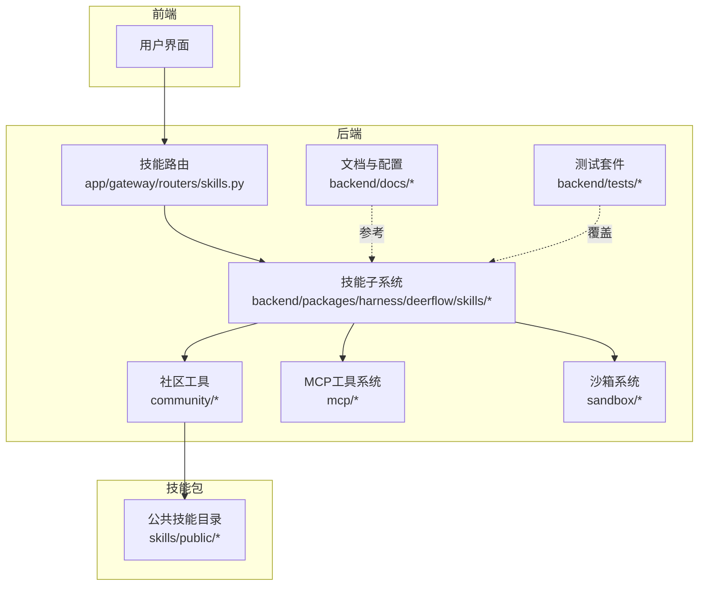
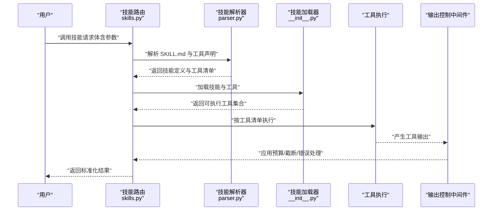
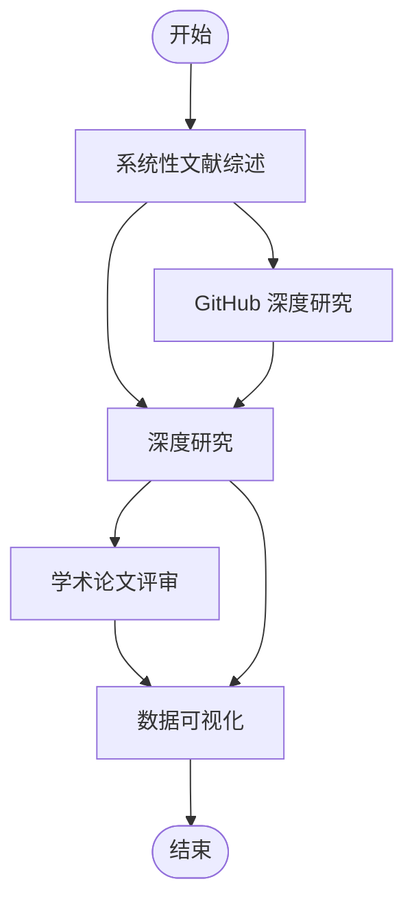
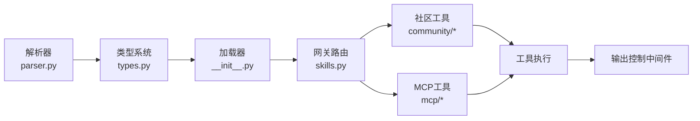

# 内置技能详解

<cite>
**本文引用的文件**
- [academic-paper-review/SKILL.md](file://skills/public/academic-paper-review/SKILL.md)
- [chart-visualization/SKILL.md](file://skills/public/chart-visualization/SKILL.md)
- [deep-research/SKILL.md](file://skills/public/deep-research/SKILL.md)
- [github-deep-research/SKILL.md](file://skills/public/github-deep-research/SKILL.md)
- [systematic-literature-review/SKILL.md](file://skills/public/systematic-literature-review/SKILL.md)
- [.agent/skills/smoke-test/SKILL.md](file://.agent/skills/smoke-test/SKILL.md)
- [backend/packages/harness/deerflow/skills/__init__.py](file://backend/packages/harness/deerflow/skills/__init__.py)
- [backend/packages/harness/deerflow/skills/parser.py](file://backend/packages/harness/deerflow/skills/parser.py)
- [backend/packages/harness/deerflow/skills/types.py](file://backend/packages/harness/deerflow/skills/types.py)
- [backend/app/gateway/routers/skills.py](file://backend/app/gateway/routers/skills.py)
- [backend/docs/SKILLS.md](file://backend/docs/SKILLS.md)
- [backend/docs/API.md](file://backend/docs/API.md)
- [backend/docs/CONFIGURATION.md](file://backend/docs/CONFIGURATION.md)
- [backend/docs/MEMORY_SETTINGS_REVIEW.md](file://backend/docs/MEMORY_SETTINGS_REVIEW.md)
- [backend/docs/MEMORY_IMPROVEMENTS.md](file://backend/docs/MEMORY_IMPROVEMENTS.md)
- [backend/docs/AUTH_DESIGN.md](file://backend/docs/AUTH_DESIGN.md)
- [backend/docs/GUARDRAILS.md](file://backend/docs/GUARDRAILS.md)
- [backend/docs/TASK_TOOL_IMPROVEMENTS.md](file://backend/docs/TASK_TOOL_IMPROVEMENTS.md)
- [backend/tests/test_skills_loader.py](file://backend/tests/test_skills_loader.py)
- [backend/tests/test_skills_parser.py](file://backend/tests/test_skills_parser.py)
- [backend/tests/test_skills_validation.py](file://backend/tests/test_skills_validation.py)
- [backend/tests/test_skills_installer.py](file://backend/tests/test_skills_installer.py)
- [backend/tests/test_skills_bundled.py](file://backend/tests/test_skills_bundled.py)
- [backend/tests/test_skills_custom_router.py](file://backend/tests/test_skills_custom_router.py)
- [backend/tests/test_skills_archive_root.py](file://backend/tests/test_skills_archive_root.py)
- [backend/tests/test_skills_manage_tool.py](file://backend/tests/test_skills_manage_tool.py)
- [backend/tests/test_skills_permissions.py](file://backend/tests/test_skills_permissions.py)
- [backend/tests/test_skill_permissions.py](file://backend/tests/test_skill_permissions.py)
- [backend/tests/test_local_skill_storage_write.py](file://backend/tests/test_local_skill_storage_write.py)
- [backend/tests/test_skill_evolution_config.py](file://backend/tests/test_skill_evolution_config.py)
- [backend/tests/test_skills_config.py](file://backend/tests/test_skills_config.py)
- [backend/tests/test_subagent_skills_config.py](file://backend/tests/test_subagent_skills_config.py)
- [backend/tests/test_skills_tool_policy.py](file://backend/tests/test_skills_tool_policy.py)
- [backend/tests/test_skills_security_scanner.py](file://backend/tests/test_skills_security_scanner.py)
- [backend/tests/test_skills_tool_output_config.py](file://backend/tests/test_skills_tool_output_config.py)
- [backend/tests/test_skills_tool_output_truncation.py](file://backend/tests/test_skills_tool_output_truncation.py)
- [backend/tests/test_skills_tool_output_budget_middleware.py](file://backend/tests/test_skills_tool_output_budget_middleware.py)
- [backend/tests/test_skills_tool_error_handling_middleware.py](file://backend/tests/test_skills_tool_error_handling_middleware.py)
- [backend/tests/test_skills_tool_deduplication.py](file://backend/tests/test_skills_tool_deduplication.py)
- [backend/tests/test_skills_tool_args_schema_no_pydantic_warning.py](file://backend/tests/test_skills_tool_args_schema_no_pydantic_warning.py)
- [backend/tests/test_skills_tool_search.py](file://backend/tests/test_skills_tool_search.py)
- [backend/tests/test_skills_tool.py](file://backend/tests/test_skills_tool.py)
- [backend/tests/test_skills_tool_output.py](file://backend/tests/test_skills_tool_output.py)
- [backend/tests/test_skills_tool_output_schema.py](file://backend/tests/test_skills_tool_output_schema.py)
- [backend/tests/test_skills_tool_output_format.py](file://backend/tests/test_skills_tool_output_format.py)
- [backend/tests/test_skills_tool_output_validation.py](file://backend/tests/test_skills_tool_output_validation.py)
- [backend/tests/test_serper_tools.py](file://backend/tests/test_serper_tools.py)
- [backend/packages/harness/deerflow/community/serper/tools.py](file://backend/packages/harness/deerflow/community/serper/tools.py)
- [backend/packages/harness/deerflow/sandbox/tools.py](file://backend/packages/harness/deerflow/sandbox/tools.py)
- [backend/tests/test_paths_user_isolation.py](file://backend/tests/test_paths_user_isolation.py)
- [backend/tests/test_local_sandbox_virtual_path_contract.py](file://backend/tests/test_local_sandbox_virtual_path_contract.py)
- [backend/tests/test_local_sandbox_provider_mounts.py](file://backend/tests/test_local_sandbox_provider_mounts.py)
- [backend/packages/harness/deerflow/mcp/cache.py](file://backend/packages/harness/deerflow/mcp/cache.py)
- [backend/packages/harness/deerflow/mcp/tools.py](file://backend/packages/harness/deerflow/mcp/tools.py)
- [frontend/src/content/en/harness/tools.mdx](file://frontend/src/content/en/harness/tools.mdx)
- [frontend/src/content/zh/harness/tools.mdx](file://frontend/src/content/zh/harness/tools.mdx)
- [frontend/src/content/en/harness/mcp.mdx](file://frontend/src/content/en/harness/mcp.mdx)
</cite>

## 更新摘要
**所做更改**
- 移除了Serper Google Images图像搜索功能的相关内容
- 精简了MCP工具系统说明，移除了文件迁移和虚拟沙箱路径解析功能
- 更新了社区工具系统的架构描述，反映当前的工具实现状态
- 修订了技能协作关系，去除与已移除功能相关的依赖

## 目录
1. [简介](#简介)
2. [项目结构](#项目结构)
3. [核心组件](#核心组件)
4. [架构总览](#架构总览)
5. [详细组件分析](#详细组件分析)
6. [依赖分析](#依赖分析)
7. [性能考虑](#性能考虑)
8. [故障排除指南](#故障排除指南)
9. [结论](#结论)
10. [附录](#附录)

## 简介
本文件面向 DeerFlow 的内置技能体系，围绕学术论文评审、数据可视化、深度研究、GitHub 深度研究、系统性文献综述等核心技能，提供功能特性、使用场景、实现原理、协作关系、最佳实践、配置模板与故障排除指南。文档同时覆盖技能加载、解析、权限与安全扫描、工具输出预算与截断、以及扩展开发与性能优化建议。

**更新** 本次更新反映了社区工具系统的精简和MCP工具系统的简化，移除了Serper Google Images图像搜索功能，以及文件迁移和虚拟沙箱路径解析功能。

## 项目结构
DeerFlow 的技能以"公共技能"形式组织在 skills/public 下，每个技能由独立目录与 SKILL.md 描述文件组成；后端通过 harness 包中的 skills 子模块负责技能解析、类型定义与加载；网关路由提供技能管理接口；测试用例覆盖加载、解析、验证、安装、权限、安全扫描、工具配置与输出控制等关键环节。

**图示来源**
- [backend/app/gateway/routers/skills.py](file://backend/app/gateway/routers/skills.py)
- [backend/packages/harness/deerflow/skills/__init__.py](file://backend/packages/harness/deerflow/skills/__init__.py)
- [backend/packages/harness/deerflow/skills/parser.py](file://backend/packages/harness/deerflow/skills/parser.py)
- [backend/packages/harness/deerflow/skills/types.py](file://backend/packages/harness/deerflow/skills/types.py)
- [backend/packages/harness/deerflow/mcp/cache.py](file://backend/packages/harness/deerflow/mcp/cache.py)
- [backend/packages/harness/deerflow/sandbox/tools.py](file://backend/packages/harness/deerflow/sandbox/tools.py)

**章节来源**
- [backend/app/gateway/routers/skills.py](file://backend/app/gateway/routers/skills.py)
- [backend/packages/harness/deerflow/skills/__init__.py](file://backend/packages/harness/deerflow/skills/__init__.py)
- [backend/packages/harness/deerflow/skills/parser.py](file://backend/packages/harness/deerflow/skills/parser.py)
- [backend/packages/harness/deerflow/skills/types.py](file://backend/packages/harness/deerflow/skills/types.py)

## 核心组件
- 技能描述与元数据：每个技能目录下的 SKILL.md 定义了名称、版本、作者、描述、输入参数、输出格式、依赖与使用示例等。
- 技能解析器：从 SKILL.md 解析出技能声明、工具清单、参数模式与输出模式。
- 技能类型与校验：类型定义与校验逻辑确保技能声明与工具调用符合预期。
- 技能加载与安装：支持内置技能与自定义技能的加载、安装与归档根路径管理。
- 权限与安全：权限策略、安全扫描与工具策略共同保障技能执行的安全边界。
- 工具输出控制：输出预算、截断与错误处理中间件，避免资源滥用与异常扩散。
- 网关路由：提供技能注册、查询、更新与删除等管理接口。
- 社区工具系统：提供Web搜索、网页抓取、图像搜索等社区工具，支持多种搜索引擎。
- MCP工具系统：支持外部MCP服务器的工具集成，具备延迟初始化和缓存机制。
- 沙箱系统：提供安全的文件操作和路径解析功能，支持虚拟路径映射和隔离。

**更新** 移除了Serper Google Images图像搜索功能，简化了MCP工具系统的说明。

**章节来源**
- [backend/packages/harness/deerflow/skills/parser.py](file://backend/packages/harness/deerflow/skills/parser.py)
- [backend/packages/harness/deerflow/skills/types.py](file://backend/packages/harness/deerflow/skills/types.py)
- [backend/tests/test_skills_loader.py](file://backend/tests/test_skills_loader.py)
- [backend/tests/test_skills_parser.py](file://backend/tests/test_skills_parser.py)
- [backend/tests/test_skills_validation.py](file://backend/tests/test_skills_validation.py)
- [backend/tests/test_skills_installer.py](file://backend/tests/test_skills_installer.py)
- [backend/tests/test_skills_bundled.py](file://backend/tests/test_skills_bundled.py)
- [backend/tests/test_skills_custom_router.py](file://backend/tests/test_skills_custom_router.py)
- [backend/tests/test_skills_archive_root.py](file://backend/tests/test_skills_archive_root.py)
- [backend/tests/test_skills_manage_tool.py](file://backend/tests/test_skills_manage_tool.py)
- [backend/tests/test_skills_permissions.py](file://backend/tests/test_skills_permissions.py)
- [backend/tests/test_skill_permissions.py](file://backend/tests/test_skill_permissions.py)
- [backend/tests/test_skills_tool_output_config.py](file://backend/tests/test_skills_tool_output_config.py)
- [backend/tests/test_skills_tool_output_truncation.py](file://backend/tests/test_skills_tool_output_truncation.py)
- [backend/tests/test_skills_tool_output_budget_middleware.py](file://backend/tests/test_skills_tool_output_budget_middleware.py)
- [backend/tests/test_skills_tool_error_handling_middleware.py](file://backend/tests/test_skills_tool_error_handling_middleware.py)
- [backend/tests/test_skills_tool_deduplication.py](file://backend/tests/test_skills_tool_deduplication.py)
- [backend/tests/test_skills_tool_args_schema_no_pydantic_warning.py](file://backend/tests/test_skills_tool_args_schema_no_pydantic_warning.py)
- [backend/tests/test_skills_tool_search.py](file://backend/tests/test_skills_tool_search.py)

## 架构总览
下图展示了技能从描述到执行的关键流程：前端触发 → 网关路由 → 技能解析与加载 → 工具调用与输出控制 → 结果返回。

**图示来源**
- [backend/app/gateway/routers/skills.py](file://backend/app/gateway/routers/skills.py)
- [backend/packages/harness/deerflow/skills/parser.py](file://backend/packages/harness/deerflow/skills/parser.py)
- [backend/packages/harness/deerflow/skills/__init__.py](file://backend/packages/harness/deerflow/skills/__init__.py)

## 详细组件分析

### 学术论文评审技能
- 功能特性
  - 输入参数：论文标题、摘要、关键词、全文或链接、评审维度（如创新性、方法、实验、写作质量等）
  - 输出格式：结构化评审意见、评分汇总、改进建议、参考文献标注
  - 使用场景：学术期刊初审、会议论文预审、导师指导学生论文
- 实现原理
  - 基于检索增强与多轮对话，结合评审模板与评分规则，生成可编辑的评审报告
  - 支持引用格式（APA/IEEE/BibTeX）与参考文献提取
- 最佳实践
  - 明确评审维度与权重，确保输出可量化
  - 对长文本进行分段处理，提升 LLM 理解与稳定性
- 协作关系
  - 可与"系统性文献综述"配合，先做综述再做逐篇评审
  - 可与"数据可视化"结合，展示评审统计图表
- 配置模板
  - 评审维度与权重配置、引用格式选择、输出语言与长度约束
- 故障排除
  - 若输出过长，启用输出预算与截断中间件
  - 若引用不匹配，检查参考文献提取与格式化脚本

**章节来源**
- [skills/public/academic-paper-review/SKILL.md](file://skills/public/academic-paper-review/SKILL.md)

### 数据可视化技能
- 功能特性
  - 输入参数：数据源（CSV/JSON/数据库）、图表类型（柱状图、饼图、雷达图、网络图等）、样式与主题
  - 输出格式：SVG/PNG 图片、交互式 HTML、Markdown 嵌入代码
  - 使用场景：报告配图、演示素材、数据解读
- 实现原理
  - 通过脚本生成多种图表模板，支持地理地图、鱼骨图、漏斗图、词云等
  - 提供模板与脚本分离，便于扩展新图表类型
- 最佳实践
  - 先清洗与聚合数据，再生成图表
  - 控制图表复杂度，避免信息过载
- 协作关系
  - 可与"深度研究"结合，将研究发现转化为可视化表达
  - 可与"系统性文献综述"配合，展示综述统计结果
- 配置模板
  - 图表类型、颜色主题、尺寸与导出格式
- 故障排除
  - 若生成失败，检查数据格式与脚本依赖
  - 若图片模糊，调整分辨率与导出格式

**章节来源**
- [skills/public/chart-visualization/SKILL.md](file://skills/public/chart-visualization/SKILL.md)

### 深度研究技能
- 功能特性
  - 输入参数：研究主题、目标、时间范围、学科领域、资源限制
  - 输出格式：研究计划、资料清单、阶段性结论、风险评估
  - 使用场景：课题选题、开题报告、研究规划
- 实现原理
  - 多源检索与交叉验证，构建知识图谱与研究路线图
  - 支持迭代式研究与动态调整
- 最佳实践
  - 明确研究阶段与里程碑，定期产出阶段性成果
  - 合理设置检索范围与关键词，避免信息过载
- 协作关系
  - 可与"系统性文献综述"联动，形成从综述到深度研究的闭环
  - 可与"数据可视化"展示研究进展与热点分布
- 配置模板
  - 检索引擎与API密钥、输出粒度与格式
- 故障排除
  - 若检索无结果，调整关键词与过滤条件
  - 若响应慢，启用缓存与并发控制

**章节来源**
- [skills/public/deep-research/SKILL.md](file://skills/public/deep-research/SKILL.md)

### GitHub 深度研究技能
- 功能特性
  - 输入参数：仓库地址、分支、时间范围、语言偏好、问题与拉取请求筛选
  - 输出格式：代码贡献热力图、问题趋势、依赖分析、README 概要
  - 使用场景：开源项目评估、技术栈分析、竞品研究
- 实现原理
  - 调用 GitHub API 获取仓库元数据、提交历史、议题与 PR，结合本地脚本生成分析报告
- 最佳实践
  - 设置合理的速率限制与缓存策略
  - 对敏感信息进行脱敏处理
- 协作关系
  - 可与"深度研究"结合，将开源项目纳入研究计划
  - 可与"数据可视化"展示贡献者与问题分布
- 配置模板
  - API Token、仓库白名单与输出字段
- 故障排除
  - 若 API 限流，启用重试与降速策略
  - 若鉴权失败，检查 Token 权限与有效期

**章节来源**
- [skills/public/github-deep-research/SKILL.md](file://skills/public/github-deep-research/SKILL.md)

### 系统性文献综述技能
- 功能特性
  - 输入参数：综述主题、关键词、时间范围、数据库（如 arXiv）、语言与地区
  - 输出格式：综述报告、参考文献列表（APA/IEEE/BibTeX）、可视化图表、热点词云
  - 使用场景：开题前的背景调研、研究综述撰写、热点追踪
- 实现原理
  - 基于检索引擎与筛选策略，批量抓取与去重，生成结构化综述
  - 提供多种引用格式模板与自动化导出
- 最佳实践
  - 制定严格的筛选与去重规则，避免重复与噪声
  - 分层抽样与随机采样相结合，平衡代表性与可操作性
- 协作关系
  - 可与"深度研究"衔接，形成从综述到深入研究的路径
  - 可与"学术论文评审"配合，为评审提供背景材料
- 配置模板
  - 检索策略、去重阈值、引用格式与导出模板
- 故障排除
  - 若检索结果偏差，调整关键词与布尔逻辑
  - 若导出格式异常，检查模板与编码

**章节来源**
- [skills/public/systematic-literature-review/SKILL.md](file://skills/public/systematic-literature-review/SKILL.md)

### 社区工具系统
- 功能特性
  - Web搜索：支持多种搜索引擎，包括DDG、Exa、Firecrawl、InfoQuest、Jina AI、SearxNG、Serper、Tavily
  - 网页抓取：提取网页主要内容，支持可读性提取
  - 图像搜索：基于DuckDuckGo的图像搜索功能
- 实现原理
  - 通过LangChain工具装饰器封装第三方API调用
  - 统一的错误处理与结果格式化
  - 支持配置文件与环境变量的API密钥管理
- 最佳实践
  - 合理配置API密钥与请求频率
  - 使用结果过滤与去重策略
  - 注意各搜索引擎的使用限制与条款
- 故障排除
  - API密钥缺失时的警告与错误处理
  - 网络请求超时与HTTP错误的处理
  - 结果格式异常的兼容性处理

**更新** 移除了Serper Google Images图像搜索功能，保留了其他社区工具的完整功能。

**章节来源**
- [backend/packages/harness/deerflow/community/serper/tools.py](file://backend/packages/harness/deerflow/community/serper/tools.py)
- [backend/tests/test_serper_tools.py](file://backend/tests/test_serper_tools.py)

### MCP工具系统
- 功能特性
  - 延迟初始化：首次工具调用时才初始化MCP工具
  - 缓存机制：基于配置文件修改时间的缓存失效检测
  - 动态加载：支持运行时启用/禁用MCP服务器
  - 工具拦截：支持自定义工具拦截器
- 实现原理
  - 应用启动时调用 `initialize_mcp_tools()` 连接所有启用的MCP服务器
  - 通过 `get_cached_mcp_tools()` 实现懒初始化
  - 使用 `extensions_config.json` 的修改时间跟踪缓存状态
- 最佳实践
  - 合理配置MCP服务器的启用状态
  - 使用工具搜索功能减少上下文负担
  - 配置适当的拦截器进行工具增强
- 故障排除
  - 缓存失效时的自动重新加载
  - MCP服务器连接失败的错误处理
  - 工具拦截器配置错误的调试

**更新** 简化了MCP工具系统的说明，移除了文件迁移和虚拟沙箱路径解析功能。

**章节来源**
- [backend/packages/harness/deerflow/mcp/cache.py](file://backend/packages/harness/deerflow/mcp/cache.py)
- [backend/packages/harness/deerflow/mcp/tools.py](file://backend/packages/harness/deerflow/mcp/tools.py)
- [frontend/src/content/en/harness/mcp.mdx](file://frontend/src/content/en/harness/mcp.mdx)

### 沙箱系统
- 功能特性
  - 虚拟路径映射：支持 `/mnt/user-data/`、`/mnt/skills/`、`/mnt/acp-workspace/` 等虚拟路径
  - 文件操作安全：路径遍历检测与权限控制
  - 用户隔离：支持多用户和多线程的文件操作隔离
  - 输出掩码：隐藏主机绝对路径，保护文件系统布局
- 实现原理
  - 通过 `replace_virtual_path()` 将虚拟路径替换为实际路径
  - 使用 `validate_local_tool_path()` 进行路径安全性验证
  - 通过 `mask_local_paths_in_output()` 掩码输出中的路径信息
- 最佳实践
  - 严格限制可访问的虚拟路径前缀
  - 合理配置自定义挂载路径
  - 使用只读模式访问技能和工作空间路径
- 故障排除
  - 路径遍历攻击的防护
  - 跨线程文件访问冲突的解决
  - 虚拟路径解析错误的调试

**更新** 移除了文件迁移功能的说明，保留了虚拟路径解析的核心功能。

**章节来源**
- [backend/packages/harness/deerflow/sandbox/tools.py](file://backend/packages/harness/deerflow/sandbox/tools.py)
- [backend/tests/test_paths_user_isolation.py](file://backend/tests/test_paths_user_isolation.py)
- [backend/tests/test_local_sandbox_virtual_path_contract.py](file://backend/tests/test_local_sandbox_virtual_path_contract.py)
- [backend/tests/test_local_sandbox_provider_mounts.py](file://backend/tests/test_local_sandbox_provider_mounts.py)

### 组合使用与协作
- 典型流程
  - 文献综述 → 深度研究 → 论文评审 → 可视化呈现
  - GitHub 深度研究 → 开源项目评估 → 技术选型建议
- 依赖与耦合
  - 技能之间通过工具链与输出格式解耦，通过统一的技能解析与加载机制耦合
  - 输出控制中间件保证整体性能与稳定性
  - 社区工具与MCP工具通过统一的工具接口集成

**更新** 移除了与已移除功能相关的协作关系说明。

## 依赖分析
- 技能解析与类型
  - 解析器负责从 SKILL.md 中抽取工具声明、参数与输出模式
  - 类型系统用于校验工具参数与输出结构
- 加载与安装
  - 支持内置技能与自定义技能，归档根路径可配置
- 权限与安全
  - 工具策略、权限策略与安全扫描共同构成安全边界
- 工具输出控制
  - 输出预算、截断与错误处理中间件贯穿工具生命周期
- 社区工具与MCP工具
  - 社区工具提供基础的搜索与抓取能力
  - MCP工具扩展外部服务的能力，支持延迟初始化和缓存

**更新** 移除了Serper Google Images相关的依赖说明。

**图示来源**
- [backend/packages/harness/deerflow/skills/parser.py](file://backend/packages/harness/deerflow/skills/parser.py)
- [backend/packages/harness/deerflow/skills/types.py](file://backend/packages/harness/deerflow/skills/types.py)
- [backend/packages/harness/deerflow/skills/__init__.py](file://backend/packages/harness/deerflow/skills/__init__.py)
- [backend/app/gateway/routers/skills.py](file://backend/app/gateway/routers/skills.py)

**章节来源**
- [backend/packages/harness/deerflow/skills/parser.py](file://backend/packages/harness/deerflow/skills/parser.py)
- [backend/packages/harness/deerflow/skills/types.py](file://backend/packages/harness/deerflow/skills/types.py)
- [backend/packages/harness/deerflow/skills/__init__.py](file://backend/packages/harness/deerflow/skills/__init__.py)
- [backend/app/gateway/routers/skills.py](file://backend/app/gateway/routers/skills.py)

## 性能考虑
- 检索与并发
  - 合理设置并发数与速率限制，避免外部服务限流
  - 使用缓存与增量更新，减少重复检索
- 输出控制
  - 启用输出预算与截断，防止超长输出导致内存压力
  - 错误处理中间件快速失败与降级，避免级联故障
- 内存与持久化
  - 关注内存配置与改进策略，避免长时间运行内存泄漏
- 配置与监控
  - 通过配置文件与日志监控关键指标，及时发现性能瓶颈
- MCP工具优化
  - 使用工具搜索功能减少上下文大小
  - 合理配置MCP服务器的连接池与超时参数

**更新** 添加了MCP工具优化的性能考虑。

**章节来源**
- [backend/docs/MEMORY_SETTINGS_REVIEW.md](file://backend/docs/MEMORY_SETTINGS_REVIEW.md)
- [backend/docs/MEMORY_IMPROVEMENTS.md](file://backend/docs/MEMORY_IMPROVEMENTS.md)
- [backend/tests/test_skills_tool_output_budget_middleware.py](file://backend/tests/test_skills_tool_output_budget_middleware.py)
- [backend/tests/test_skills_tool_output_truncation.py](file://backend/tests/test_skills_tool_output_truncation.py)
- [backend/tests/test_skills_tool_error_handling_middleware.py](file://backend/tests/test_skills_tool_error_handling_middleware.py)
- [frontend/src/content/en/harness/tools.mdx](file://frontend/src/content/en/harness/tools.mdx)

## 故障排除指南
- 加载与解析
  - 若技能未加载，检查 SKILL.md 格式与路径
  - 若解析失败，核对工具声明与参数模式
- 安装与权限
  - 自定义技能安装失败时，检查权限与归档根路径
  - 权限不足导致工具不可用，调整策略与扫描结果
- 工具输出
  - 输出过长或格式异常，启用预算与截断中间件
  - 工具报错频繁，启用错误处理中间件与降级策略
- 社区工具
  - API密钥缺失或无效，检查配置文件与环境变量
  - 请求超时或HTTP错误，检查网络连接与服务状态
  - 结果格式异常，检查第三方API的响应格式
- MCP工具
  - 工具初始化失败，检查MCP服务器配置与连接状态
  - 缓存失效问题，检查配置文件修改时间
  - 工具拦截器错误，检查拦截器配置与实现
- 沙箱系统
  - 路径解析错误，检查虚拟路径映射配置
  - 权限拒绝错误，检查路径访问权限与隔离设置
  - 输出路径泄露，检查路径掩码配置

**更新** 添加了社区工具、MCP工具和沙箱系统的故障排除指南。

**章节来源**
- [backend/tests/test_skills_loader.py](file://backend/tests/test_skills_loader.py)
- [backend/tests/test_skills_parser.py](file://backend/tests/test_skills_parser.py)
- [backend/tests/test_skills_validation.py](file://backend/tests/test_skills_validation.py)
- [backend/tests/test_skills_installer.py](file://backend/tests/test_skills_installer.py)
- [backend/tests/test_skills_permissions.py](file://backend/tests/test_skills_permissions.py)
- [backend/tests/test_skill_permissions.py](file://backend/tests/test_skill_permissions.py)
- [backend/tests/test_skills_security_scanner.py](file://backend/tests/test_skills_security_scanner.py)
- [backend/tests/test_skills_tool_output_config.py](file://backend/tests/test_skills_tool_output_config.py)
- [backend/tests/test_skills_tool_output_truncation.py](file://backend/tests/test_skills_tool_output_truncation.py)
- [backend/tests/test_skills_tool_output_budget_middleware.py](file://backend/tests/test_skills_tool_output_budget_middleware.py)
- [backend/tests/test_skills_tool_error_handling_middleware.py](file://backend/tests/test_skills_tool_error_handling_middleware.py)
- [backend/tests/test_skills_tool_deduplication.py](file://backend/tests/test_skills_tool_deduplication.py)
- [backend/tests/test_skills_tool_args_schema_no_pydantic_warning.py](file://backend/tests/test_skills_tool_args_schema_no_pydantic_warning.py)
- [backend/tests/test_skills_tool_search.py](file://backend/tests/test_skills_tool_search.py)
- [backend/tests/test_serper_tools.py](file://backend/tests/test_serper_tools.py)

## 结论
DeerFlow 的内置技能体系以"描述即契约"的方式实现了高内聚、低耦合的工具生态。通过统一的解析、加载、权限与输出控制机制，用户可以灵活组合多个技能完成复杂的科研与工程任务。本次更新反映了社区工具系统的精简和MCP工具系统的简化，移除了不再使用的Serper Google Images功能，同时保持了核心功能的完整性。

建议在实际使用中遵循最佳实践，合理配置输出预算与缓存策略，并利用测试与监控持续优化性能与稳定性。对于新增的MCP工具功能，建议充分利用延迟初始化和工具搜索功能来提升系统性能。

## 附录
- 使用示例
  - 在"系统性文献综述"中设置主题与时间范围，导出 APA 引文与可视化图表
  - 在"深度研究"中制定研究计划，结合"数据可视化"展示研究进展
  - 在"学术论文评审"中基于综述背景生成结构化评审意见
  - 使用MCP工具扩展外部服务能力，通过工具搜索功能优化上下文
- 配置模板
  - 输出预算与截断：根据任务规模设定最大输出长度与分页策略
  - 引用格式：选择 APA/IEEE/BibTeX 并配置模板路径
  - 缓存与并发：针对外部 API 设置合理的缓存与并发上限
  - MCP工具：配置工具搜索功能，启用延迟初始化和缓存机制
- 扩展开发
  - 新增技能：编写 SKILL.md，定义工具清单与参数模式
  - 社区工具：基于LangChain工具装饰器创建新的工具实现
  - MCP工具：实现外部服务的工具集成，支持延迟初始化
  - 安全与权限：遵循工具策略与安全扫描规范
  - 测试与验证：复用现有测试用例，覆盖加载、解析、权限与输出控制