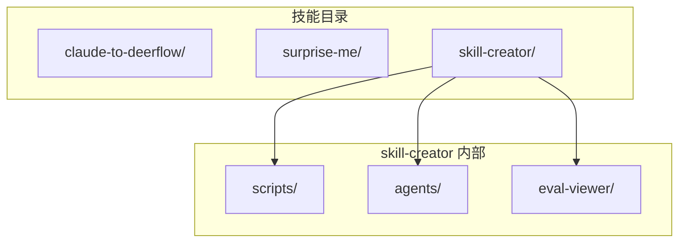
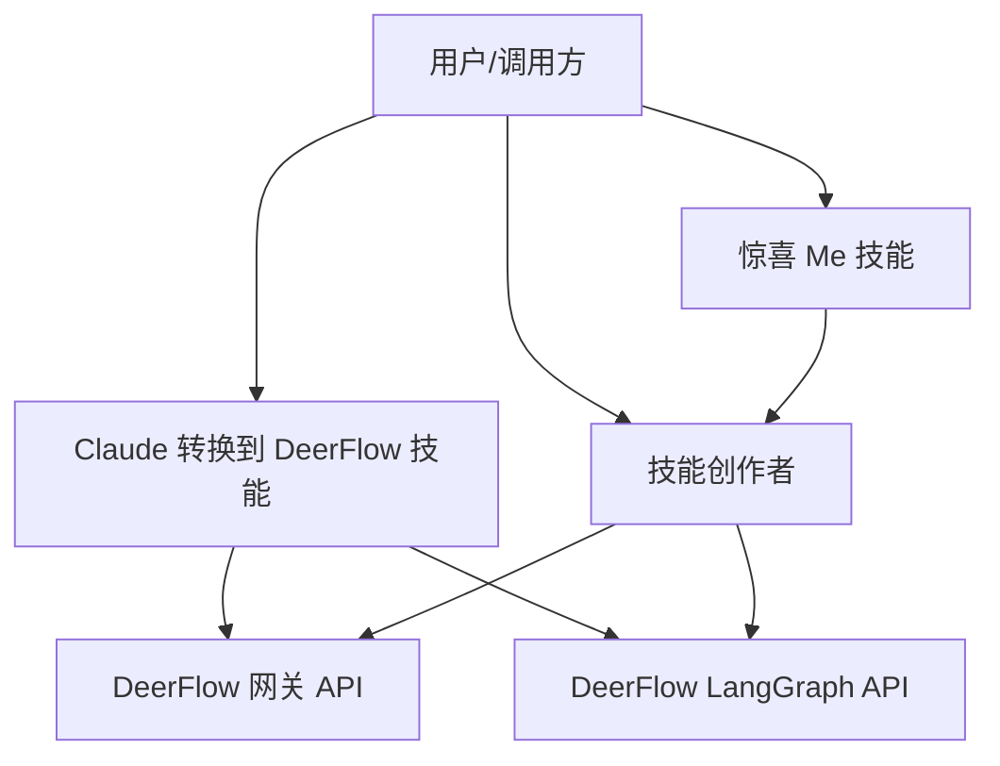
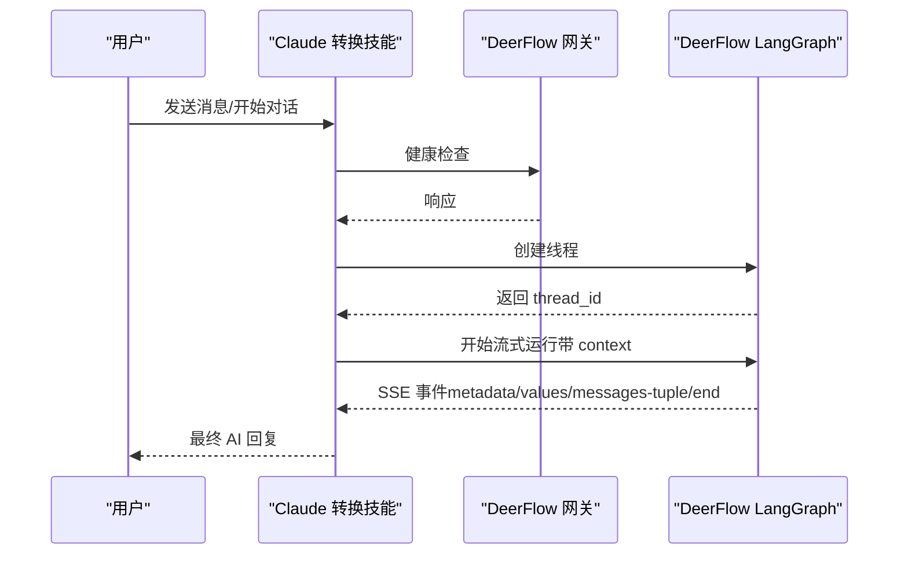
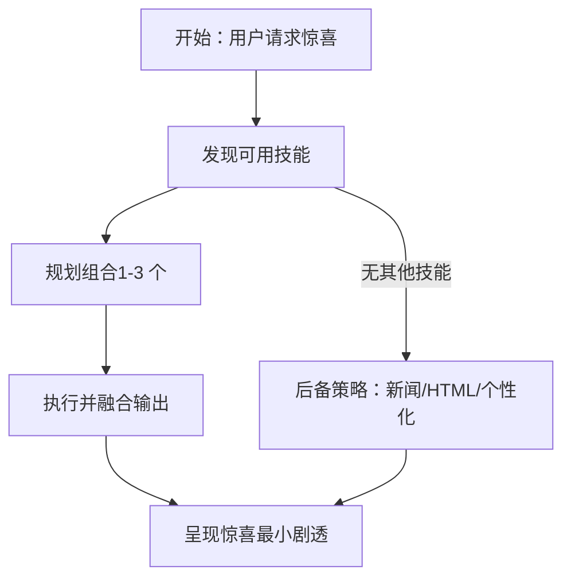
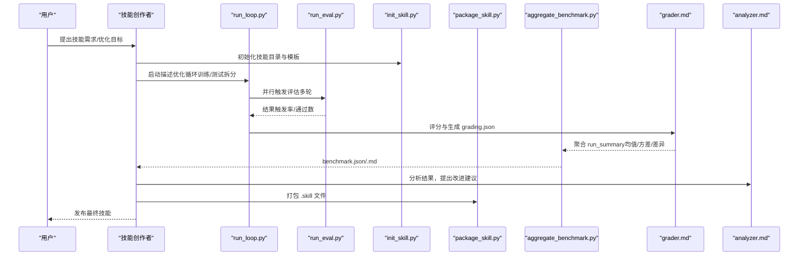
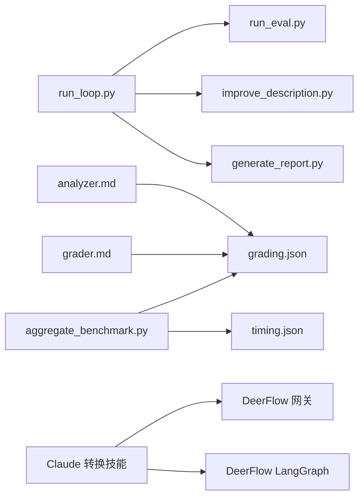

# 实用工具类技能

<cite>
**本文引用的文件**
- [SKILL.md（Claude 转换到 DeerFlow）](file://skills/public/claude-to-deerflow/SKILL.md)
- [SKILL.md（惊喜 Me）](file://skills/public/surprise-me/SKILL.md)
- [SKILL.md（技能创作者）](file://skills/public/skill-creator/SKILL.md)
- [初始化脚本（技能创作者）](file://skills/public/skill-creator/scripts/init_skill.py)
- [打包脚本（技能创作者）](file://skills/public/skill-creator/scripts/package_skill.py)
- [描述优化循环（技能创作者）](file://skills/public/skill-creator/scripts/run_loop.py)
- [聚合基准（技能创作者）](file://skills/public/skill-creator/scripts/aggregate_benchmark.py)
- [评分器（技能创作者）](file://skills/public/skill-creator/agents/grader.md)
- [分析器（技能创作者）](file://skills/public/skill-creator/agents/analyzer.md)
</cite>

## 目录
1. [简介](#简介)
2. [项目结构](#项目结构)
3. [核心组件](#核心组件)
4. [架构总览](#架构总览)
5. [详细组件分析](#详细组件分析)
6. [依赖关系分析](#依赖关系分析)
7. [性能考量](#性能考量)
8. [故障排除指南](#故障排除指南)
9. [结论](#结论)
10. [附录](#附录)

## 简介
本文件面向 DeerFlow 技能生态中的“实用工具类技能”，系统性介绍三类关键能力：
- 将外部平台内容迁移到 DeerFlow 的桥梁：Claude 转换到 DeerFlow 技能
- 激发创意与惊喜的“惊喜 Me”技能
- 帮助创建、评测与持续优化技能的“技能创作者”及其配套工具链

文档覆盖使用方法、实现原理、典型场景、配置选项、注意事项与故障排除，并通过可视化图示帮助理解整体工作流。

## 项目结构
实用工具类技能位于 skills/public 下，每个技能以独立目录组织，包含：
- SKILL.md：技能说明与操作指南
- scripts/：可执行脚本（如初始化、打包、评测）
- references/：参考文档（按需加载到上下文）
- assets/：输出模板或资源文件

**图表来源**
- [SKILL.md（技能创作者）](file://skills/public/skill-creator/SKILL.md)
- [SKILL.md（Claude 转换到 DeerFlow）](file://skills/public/claude-to-deerflow/SKILL.md)
- [SKILL.md（惊喜 Me）](file://skills/public/surprise-me/SKILL.md)

**章节来源**
- [SKILL.md（技能创作者）](file://skills/public/skill-creator/SKILL.md)
- [SKILL.md（Claude 转换到 DeerFlow）](file://skills/public/claude-to-deerflow/SKILL.md)
- [SKILL.md（惊喜 Me）](file://skills/public/surprise-me/SKILL.md)

## 核心组件
- Claude 转换到 DeerFlow 技能：通过 HTTP API 与 DeerFlow 交互，支持健康检查、消息发送（含流式响应）、线程管理、模型/技能/代理查询、内存读取、文件上传与历史查看等。
- 惊喜 Me 技能：动态发现可用技能，创造性组合 1–3 个技能，生成令人耳目一新的交付物；若无其他技能可用，则提供新闻类惊喜、交互式 HTML 或个性化产物作为后备。
- 技能创作者：围绕“创建—测试—评审—改进—重复”的闭环，提供初始化模板、打包分发、触发描述优化、基准聚合与可视化评审等工具。

**章节来源**
- [SKILL.md（Claude 转换到 DeerFlow）](file://skills/public/claude-to-deerflow/SKILL.md)
- [SKILL.md（惊喜 Me）](file://skills/public/surprise-me/SKILL.md)
- [SKILL.md（技能创作者）](file://skills/public/skill-creator/SKILL.md)

## 架构总览
下图展示三类工具在 DeerFlow 生态中的定位与协作方式：

**图表来源**
- [SKILL.md（Claude 转换到 DeerFlow）](file://skills/public/claude-to-deerflow/SKILL.md)
- [SKILL.md（技能创作者）](file://skills/public/skill-creator/SKILL.md)
- [SKILL.md（惊喜 Me）](file://skills/public/surprise-me/SKILL.md)

## 详细组件分析

### 组件 A：Claude 转换到 DeerFlow 技能
- 用途：将外部平台内容迁移至 DeerFlow，或在 DeerFlow 中发起研究任务、管理记忆与文件。
- 关键能力：
  - 健康检查、消息发送（流式）、继续对话、列出模型/技能/代理
  - 获取/上传线程文件、查看历史、搜索线程
  - 支持多种运行模式（闪速/标准/专业/超能），通过 context 控制思考、规划与子代理启用
- 使用场景：
  - 快问快答：闪速模式
  - 复杂研究：专业/超能模式
  - 文件驱动：先上传再引用
  - 会话延续：复用 thread_id
- 配置与环境变量：
  - DEERFLOW_URL、DEERFLOW_GATEWAY_URL、DEERFLOW_LANGGRAPH_URL
  - 建议在请求前解析并校验端点可达性
- 错误处理：
  - 健康检查失败：提示启动服务
  - 流式错误事件：提取并呈现错误信息
  - 常见问题：端口未开放、服务启动中、配置错误

**图表来源**
- [SKILL.md（Claude 转换到 DeerFlow）](file://skills/public/claude-to-deerflow/SKILL.md)

**章节来源**
- [SKILL.md（Claude 转换到 DeerFlow）](file://skills/public/claude-to-deerflow/SKILL.md)

### 组件 B：惊喜 Me 技能
- 用途：在用户表达“惊喜/无聊/灵感”时，动态组合现有技能，产出令人耳目一新的成果。
- 工作流程：
  - 发现可用技能（基于 available_skills）
  - 规划组合（1–3 个技能，强调视觉冲击与情感愉悦）
  - 执行与融合：遵循各技能说明，合并为单一交付物
  - 若无可组合技能，提供新闻类惊喜、交互式 HTML 或个性化产物作为后备
- 创意原则：
  - 反差组合、结合用户兴趣、主题化（日期/热点/玩味假设/数据美学）
  - 输出应像“礼物”般精心打磨，避免剧透式说明

**图表来源**
- [SKILL.md（惊喜 Me）](file://skills/public/surprise-me/SKILL.md)

**章节来源**
- [SKILL.md（惊喜 Me）](file://skills/public/surprise-me/SKILL.md)

### 组件 C：技能创作者（含工具链）
- 用途：从零创建新技能、优化既有技能、评测与基准对比、提升触发准确度。
- 核心流程：
  - 捕捉意图 → 研究与访谈 → 编写 SKILL.md → 设计测试集 → 并行运行 with/without 基线 → 评分与聚合 → 分析与迭代 → 包装发布
- 关键脚本与工具：
  - 初始化：init_skill.py，生成模板与示例资源
  - 打包：package_skill.py，将技能目录压缩为 .skill 文件
  - 描述优化循环：run_loop.py，自动评估与改进 SKILL.md frontmatter 的触发描述
  - 基准聚合：aggregate_benchmark.py，统计 pass 率、耗时、token 等指标
  - 评分器/分析器：agents/grader.md、agents/analyzer.md，用于评审与洞察
- 使用建议：
  - 在 Cowork/无浏览器环境：使用静态评审（--static）导出 HTML
  - 在 Claude.ai：以人工评审为主，跳过部分自动化步骤
  - 保持“先评审后自评”的节奏，确保人类反馈及时进入迭代

**图表来源**
- [SKILL.md（技能创作者）](file://skills/public/skill-creator/SKILL.md)
- [描述优化循环（技能创作者）](file://skills/public/skill-creator/scripts/run_loop.py)
- [聚合基准（技能创作者）](file://skills/public/skill-creator/scripts/aggregate_benchmark.py)
- [评分器（技能创作者）](file://skills/public/skill-creator/agents/grader.md)
- [分析器（技能创作者）](file://skills/public/skill-creator/agents/analyzer.md)
- [初始化脚本（技能创作者）](file://skills/public/skill-creator/scripts/init_skill.py)
- [打包脚本（技能创作者）](file://skills/public/skill-creator/scripts/package_skill.py)

**章节来源**
- [SKILL.md（技能创作者）](file://skills/public/skill-creator/SKILL.md)
- [描述优化循环（技能创作者）](file://skills/public/skill-creator/scripts/run_loop.py)
- [聚合基准（技能创作者）](file://skills/public/skill-creator/scripts/aggregate_benchmark.py)
- [评分器（技能创作者）](file://skills/public/skill-creator/agents/grader.md)
- [分析器（技能创作者）](file://skills/public/skill-creator/agents/analyzer.md)
- [初始化脚本（技能创作者）](file://skills/public/skill-creator/scripts/init_skill.py)
- [打包脚本（技能创作者）](file://skills/public/skill-creator/scripts/package_skill.py)

## 依赖关系分析
- 技能创作者对工具链的依赖：
  - run_loop.py 依赖 run_eval.py（评估）、improve_description.py（改进）、generate_report.py（报告）
  - aggregate_benchmark.py 依赖 run 目录下的 grading.json/timing.json
  - 评分器/分析器为评审阶段提供结构化输出
- 与 DeerFlow 的集成：
  - Claude 转换技能直接依赖 DeerFlow 的网关与 LangGraph API
  - 技能创作者在评测阶段可能通过子代理并行调用 DeerFlow 运行接口（视部署环境而定）

**图表来源**
- [描述优化循环（技能创作者）](file://skills/public/skill-creator/scripts/run_loop.py)
- [聚合基准（技能创作者）](file://skills/public/skill-creator/scripts/aggregate_benchmark.py)
- [评分器（技能创作者）](file://skills/public/skill-creator/agents/grader.md)
- [分析器（技能创作者）](file://skills/public/skill-creator/agents/analyzer.md)
- [SKILL.md（Claude 转换到 DeerFlow）](file://skills/public/claude-to-deerflow/SKILL.md)

**章节来源**
- [描述优化循环（技能创作者）](file://skills/public/skill-creator/scripts/run_loop.py)
- [聚合基准（技能创作者）](file://skills/public/skill-creator/scripts/aggregate_benchmark.py)
- [评分器（技能创作者）](file://skills/public/skill-creator/agents/grader.md)
- [分析器（技能创作者）](file://skills/public/skill-creator/agents/analyzer.md)
- [SKILL.md（Claude 转换到 DeerFlow）](file://skills/public/claude-to-deerflow/SKILL.md)

## 性能考量
- 流式传输与并发：
  - Claude 转换技能的流式运行适合长文本与多子图更新，注意合理设置 recursion_limit 与 context 模式
- 评测开销：
  - 技能创作者的并行评测会带来 token 与时间消耗，建议在 Cowork 等无显示环境采用静态评审，减少等待
- 资源使用：
  - 聚合基准统计 pass 率、耗时与 token 的均值与方差，便于识别异常波动与回归

[本节为通用指导，不直接分析具体文件]

## 故障排除指南
- Claude 转换技能
  - 健康检查失败：确认 DEERFLOW_URL、DEERFLOW_GATEWAY_URL、DEERFLOW_LANGGRAPH_URL 是否正确解析且服务已启动
  - 流式错误：从 SSE 事件中提取错误信息并重试或调整 context
  - 端口/网络：检查防火墙与代理配置
- 惊喜 Me
  - 无其他技能可用：启用后备策略（新闻/HTML/个性化），确保输出仍具惊喜感
- 技能创作者
  - run_loop 无法打开浏览器：在 Cowork 环境使用 --static 导出评审页面
  - 评测结果为空：检查 evals.json 与 run 目录结构，确认 grading.json/timing.json 是否存在
  - 打包失败：确认 SKILL.md 存在且路径正确，排除 __pycache__/node_modules 等构建产物

**章节来源**
- [SKILL.md（Claude 转换到 DeerFlow）](file://skills/public/claude-to-deerflow/SKILL.md)
- [SKILL.md（惊喜 Me）](file://skills/public/surprise-me/SKILL.md)
- [聚合基准（技能创作者）](file://skills/public/skill-creator/scripts/aggregate_benchmark.py)
- [描述优化循环（技能创作者）](file://skills/public/skill-creator/scripts/run_loop.py)

## 结论
- Claude 转换到 DeerFlow 技能是连接外部平台与 DeerFlow 的关键入口，适用于快速问答、复杂研究与文件驱动任务。
- 惊喜 Me 技能通过创造性组合现有能力，为用户提供“礼物式”的体验，提升探索乐趣。
- 技能创作者提供了从创建到发布的完整工具链，配合评分器与分析器，形成可量化、可迭代的质量闭环。

[本节为总结性内容，不直接分析具体文件]

## 附录
- 使用示例与最佳实践
  - Claude 转换技能：优先使用闪速模式进行快速问答；研究任务使用专业/超能模式；先上传文件再引用以提高上下文质量
  - 惊喜 Me：根据用户兴趣与当前热点选择主题，避免剧透式说明
  - 技能创作者：先初始化模板，再设计测试集，评审后再迭代；在 Cowork 环境使用静态评审导出 HTML
- 配置清单
  - 环境变量：DEERFLOW_URL、DEERFLOW_GATEWAY_URL、DEERFLOW_LANGGRAPH_URL
  - 运行模式：thinking_enabled/is_plan_mode/subagent_enabled 组合决定闪速/标准/专业/超能
- 参考文件
  - [SKILL.md（Claude 转换到 DeerFlow）](file://skills/public/claude-to-deerflow/SKILL.md)
  - [SKILL.md（惊喜 Me）](file://skills/public/surprise-me/SKILL.md)
  - [SKILL.md（技能创作者）](file://skills/public/skill-creator/SKILL.md)
  - [评分器（技能创作者）](file://skills/public/skill-creator/agents/grader.md)
  - [分析器（技能创作者）](file://skills/public/skill-creator/agents/analyzer.md)