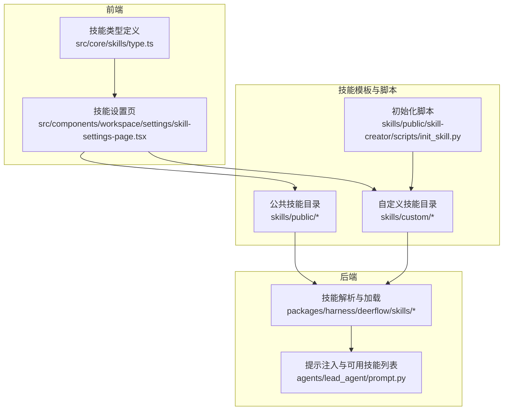
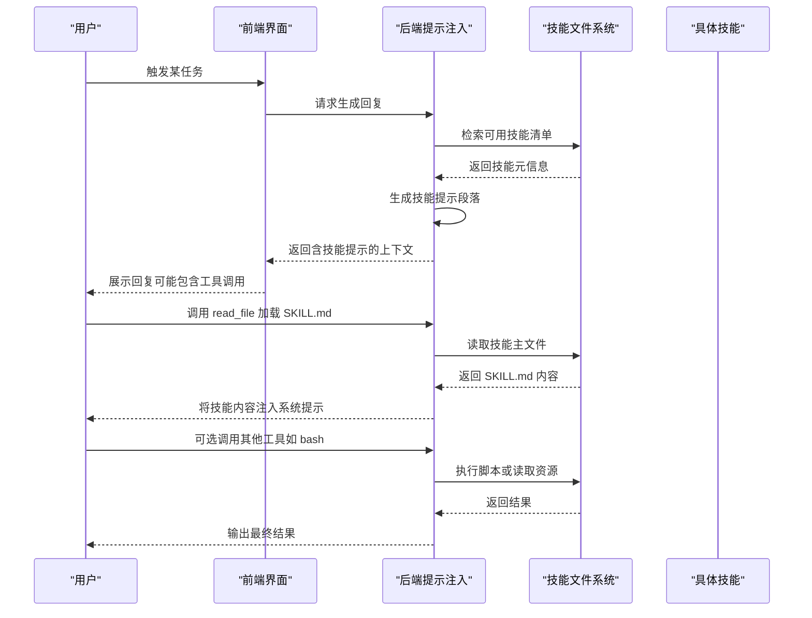

# 开发工具类技能

<cite>
**本文引用的文件**
- [ARCHITECTURE.md](file://backend/docs/ARCHITECTURE.md)
- [prompt.py](file://backend/packages/harness/deerflow/agents/lead_agent/prompt.py)
- [type.ts](file://frontend/src/core/skills/type.ts)
- [skill-settings-page.tsx](file://frontend/src/components/workspace/settings/skill-settings-page.tsx)
- [SKILL.md（引导启动）](file://skills/public/bootstrap/SKILL.md)
- [SKILL.md（技能查找）](file://skills/public/find-skills/SKILL.md)
- [install-skill.sh](file://skills/public/find-skills/scripts/install-skill.sh)
- [SKILL.md（技能创建器）](file://skills/public/skill-creator/SKILL.md)
- [init_skill.py](file://skills/public/skill-creator/scripts/init_skill.py)
- [SKILL.md（Vercel 部署）](file://skills/public/vercel-deploy-claimable/SKILL.md)
- [deploy.sh](file://skills/public/vercel-deploy-claimable/scripts/deploy.sh)
- [SKILL.md（前端设计）](file://skills/public/frontend-design/SKILL.md)
- [thread.json](file://frontend/public/demo/threads/7cfa5f8f-a2f8-47ad-acbd-da7137baf990/thread.json)
</cite>

## 目录
1. [简介](#简介)
2. [项目结构](#项目结构)
3. [核心组件](#核心组件)
4. [架构总览](#架构总览)
5. [详细组件分析](#详细组件分析)
6. [依赖关系分析](#依赖关系分析)
7. [性能考虑](#性能考虑)
8. [故障排查指南](#故障排查指南)
9. [结论](#结论)
10. [附录](#附录)

## 简介
本文件面向开发者，系统性介绍 DeerFlow 的“开发工具类技能”能力，覆盖以下主题：
- 引导启动技能：帮助用户完成 AI 合伙人身份与个性化设置的对话式引导
- 技能查找安装技能：在公共技能仓库中检索并安装第三方技能
- 技能创建器：从零到一构建、迭代与评测技能的完整工作流
- Vercel 部署技能：一键打包并部署应用到 Vercel，支持预览与认领链接
- 前端设计技能：生成高质量、可直接部署的前端界面与页面

文档将深入解释技能开发框架、模板系统与自动化工具的工作原理，并提供从初始化、编码、测试验证到发布的全流程开发指南；同时给出模板使用说明、配置管理与部署策略的最佳实践。

## 项目结构
DeerFlow 的技能系统由“后端解析与加载 + 前端展示与控制 + 技能模板与脚本”三部分组成：
- 后端负责解析 SKILL.md、注入可用技能提示、按需加载资源
- 前端负责技能列表展示、启用/禁用切换、创建新技能入口
- 技能目录包含公共与自定义两类，每项技能以 SKILL.md 为核心定义

图表来源
- [ARCHITECTURE.md:305-342](file://backend/docs/ARCHITECTURE.md#L305-L342)
- [prompt.py:594-649](file://backend/packages/harness/deerflow/agents/lead_agent/prompt.py#L594-L649)
- [type.ts:1-7](file://frontend/src/core/skills/type.ts#L1-L7)
- [skill-settings-page.tsx:89-135](file://frontend/src/components/workspace/settings/skill-settings-page.tsx#L89-L135)

章节来源
- [ARCHITECTURE.md:305-342](file://backend/docs/ARCHITECTURE.md#L305-L342)

## 核心组件
- 技能元数据与指令来源：每个技能以 SKILL.md 作为权威定义，包含 YAML 头部（名称、描述等）与正文指令
- 提示注入机制：后端根据当前可用技能集合动态生成技能提示段落，指导模型按需读取技能文件与资源
- 前端技能管理：提供技能列表、启用/禁用开关与创建新技能入口
- 自动化脚本：包含技能初始化模板、安装脚本与部署脚本

章节来源
- [prompt.py:594-649](file://backend/packages/harness/deerflow/agents/lead_agent/prompt.py#L594-L649)
- [type.ts:1-7](file://frontend/src/core/skills/type.ts#L1-L7)
- [skill-settings-page.tsx:89-135](file://frontend/src/components/workspace/settings/skill-settings-page.tsx#L89-L135)

## 架构总览
下图展示了从用户触发到技能执行的关键交互路径，以及技能资源的按需加载模式：

图表来源
- [prompt.py:594-649](file://backend/packages/harness/deerflow/agents/lead_agent/prompt.py#L594-L649)
- [thread.json:535-549](file://frontend/public/demo/threads/7cfa5f8f-a2f8-47ad-acbd-da7137baf990/thread.json#L535-L549)

## 详细组件分析

### 引导启动技能（Bootstrap）
- 作用：通过对话式引导生成个性化的 SOUL.md，用于定义 AI 合伙人的身份与行为
- 关键点：
  - 采用渐进式对话策略，分阶段收集用户需求
  - 强制先阅读参考材料与输出模板，再进行生成
  - 严格遵循“一次一个阶段”的节奏，避免一次性暴露模板

使用建议
- 在首次使用前，务必先阅读参考指南与模板，确保生成内容符合预期
- 保持对话自然与共情，逐步加深对用户意图的理解

章节来源
- [SKILL.md（引导启动）:1-35](file://skills/public/bootstrap/SKILL.md#L1-L35)

### 技能查找安装技能（Find-Skills）
- 作用：在公共技能仓库中检索相关技能，提供安装命令与更多信息链接
- 工作流程：
  - 搜索匹配的技能条目
  - 向用户呈现技能名称、功能与安装命令
  - 使用安装脚本将技能全局安装至自定义目录并自动链接

安装脚本要点
- 支持从指定仓库与标签安装特定技能
- 安装完成后会输出可直接使用的安装命令供用户复制执行

章节来源
- [SKILL.md（技能查找）:57-100](file://skills/public/find-skills/SKILL.md#L57-L100)
- [install-skill.sh](file://skills/public/find-skills/scripts/install-skill.sh)

### 技能创建器（Skill-Creator）
- 作用：从零开始创建、改进与评测技能，形成闭环迭代
- 关键流程：
  - 明确目标与大致实现方式
  - 编写草稿并准备测试用例
  - 运行评估，结合定性与定量指标迭代
  - 扩大测试集并重复优化
  - 最终完善描述以提升触发准确率

模板与初始化
- 提供标准化的 SKILL.md 模板，包含结构化写作指南与资源组织建议
- 初始化脚本可快速生成技能目录与基础文件，便于后续填充内容

章节来源
- [SKILL.md（技能创建器）:1-84](file://skills/public/skill-creator/SKILL.md#L1-L84)
- [init_skill.py:1-303](file://skills/public/skill-creator/scripts/init_skill.py#L1-L303)

### Vercel 部署技能（Vercel-Deploy）
- 作用：将任意项目打包并一键部署到 Vercel，返回预览链接与可认领链接
- 核心特性：
  - 自动检测框架类型（基于 package.json 中的依赖）
  - 排除 node_modules 与 .git，生成压缩包
  - 输出 JSON 结果，便于程序化集成

部署脚本要点
- 支持传入项目路径或已存在的 .tgz 包
- 框架识别顺序覆盖主流前端框架，确保兼容性

章节来源
- [SKILL.md（Vercel 部署）:1-64](file://skills/public/vercel-deploy-claimable/SKILL.md#L1-L64)
- [deploy.sh:1-57](file://skills/public/vercel-deploy-claimable/scripts/deploy.sh#L1-L57)

### 前端设计技能（Frontend-Design）
- 作用：生成高质量、可直接部署的前端界面与页面，避免通用 AI 风格
- 输出要求：
  - 入口 HTML 文件必须命名为 index.html，以保证标准 Web 主机与部署流程的兼容性
- 设计原则：
  - 注重美学细节与创意选择，产出真实可用的代码

章节来源
- [SKILL.md（前端设计）:1-13](file://skills/public/frontend-design/SKILL.md#L1-L13)

## 依赖关系分析
- 技能元数据与提示注入
  - 后端通过解析 SKILL.md 并结合可用技能集合，生成技能提示段落
  - 提示段落包含技能清单与加载指引，指导模型按需读取资源
- 前端与后端协作
  - 前端负责技能列表与启用状态管理
  - 后端负责将技能内容注入系统提示，供模型决策与执行
- 资源加载模式
  - 技能文件按需加载：先读取 SKILL.md，再按需加载 scripts/references/assets 下的资源

图表来源
- [prompt.py:594-649](file://backend/packages/harness/deerflow/agents/lead_agent/prompt.py#L594-L649)
- [type.ts:1-7](file://frontend/src/core/skills/type.ts#L1-L7)
- [skill-settings-page.tsx:89-135](file://frontend/src/components/workspace/settings/skill-settings-page.tsx#L89-L135)

章节来源
- [prompt.py:594-649](file://backend/packages/harness/deerflow/agents/lead_agent/prompt.py#L594-L649)
- [type.ts:1-7](file://frontend/src/core/skills/type.ts#L1-L7)
- [skill-settings-page.tsx:89-135](file://frontend/src/components/workspace/settings/skill-settings-page.tsx#L89-L135)

## 性能考虑
- 按需加载策略
  - 仅在需要时读取 SKILL.md 与资源，减少上下文长度与 IO 压力
- 提示注入缓存
  - 对技能提示段落进行缓存，降低重复计算开销
- 资源组织
  - 将可复用脚本放入 scripts/，将参考文档放入 references/，避免重复传输
- 部署脚本优化
  - 自动排除无关文件，减小包体积，缩短上传时间

## 故障排查指南
常见问题与处理
- 技能未显示或不可用
  - 检查技能目录是否位于公共或自定义根目录
  - 确认 SKILL.md 格式正确且包含必要头部字段
- 工具调用失败（如 read_file）
  - 确认路径指向正确的 SKILL.md 或资源文件
  - 检查容器内文件权限与挂载路径
- 部署失败
  - 确认 package.json 中存在被识别的框架依赖
  - 检查网络连通性与部署端点可达性
- 前端产物不符合预期
  - 确保入口文件命名为 index.html
  - 检查生成内容是否满足输出要求

章节来源
- [prompt.py:594-649](file://backend/packages/harness/deerflow/agents/lead_agent/prompt.py#L594-L649)
- [thread.json:535-549](file://frontend/public/demo/threads/7cfa5f8f-a2f8-47ad-acbd-da7137baf990/thread.json#L535-L549)

## 结论
DeerFlow 的技能系统通过“结构化定义 + 动态注入 + 按需加载”的方式，实现了高可扩展、易维护的工具类技能生态。开发者可以借助技能创建器与模板系统快速构建高质量技能，并通过查找安装技能与部署脚本实现从开发到上线的全链路自动化。建议在实际开发中遵循模板规范、注重资源组织与测试验证，持续优化触发准确性与执行稳定性。

## 附录

### 开发指南（全流程）
- 初始化
  - 使用技能创建器的初始化脚本生成技能目录与基础文件
  - 填写 SKILL.md 的 YAML 头部与正文内容
- 编写
  - 明确技能目标与触发条件，组织结构化内容
  - 将可复用逻辑放入 scripts/，将参考文档放入 references/
- 测试验证
  - 准备多场景测试用例，运行评估并记录结果
  - 基于反馈迭代优化描述与实现
- 发布
  - 将技能提交至公共仓库或保存至自定义目录
  - 如需安装，使用查找安装技能提供的安装脚本

章节来源
- [init_skill.py:1-303](file://skills/public/skill-creator/scripts/init_skill.py#L1-L303)
- [SKILL.md（技能创建器）:1-84](file://skills/public/skill-creator/SKILL.md#L1-L84)

### 配置文件管理
- SKILL.md
  - 必填字段：name、description
  - 可选字段：license、metadata、allowed-tools 等
- 前端技能类型
  - 字段：name、description、category、license、enabled
- 建议
  - 保持描述清晰、触发条件明确
  - 合理组织资源目录，避免冗余文件

章节来源
- [type.ts:1-7](file://frontend/src/core/skills/type.ts#L1-L7)

### 部署策略
- Vercel 部署
  - 自动识别框架，排除 node_modules 与 .git
  - 返回预览链接与可认领链接，支持程序化消费 JSON 输出
- 前端设计
  - 统一入口文件命名，确保可直接部署

章节来源
- [SKILL.md（Vercel 部署）:1-64](file://skills/public/vercel-deploy-claimable/SKILL.md#L1-L64)
- [deploy.sh:1-57](file://skills/public/vercel-deploy-claimable/scripts/deploy.sh#L1-L57)
- [SKILL.md（前端设计）:1-13](file://skills/public/frontend-design/SKILL.md#L1-L13)