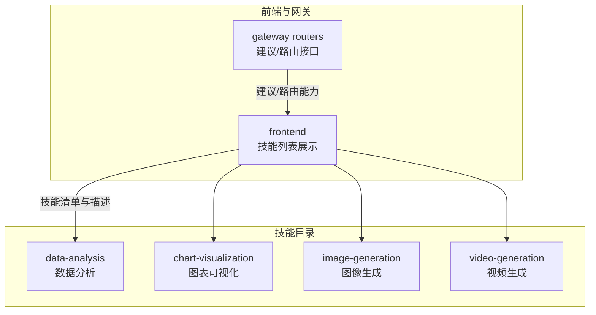
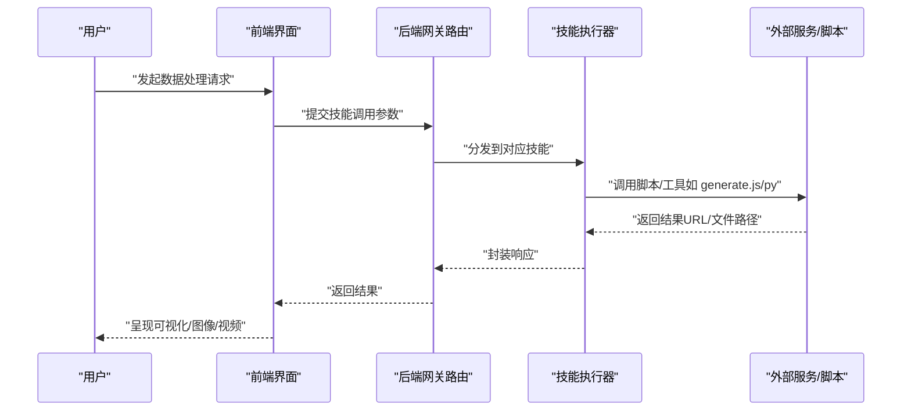
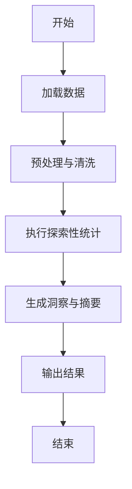
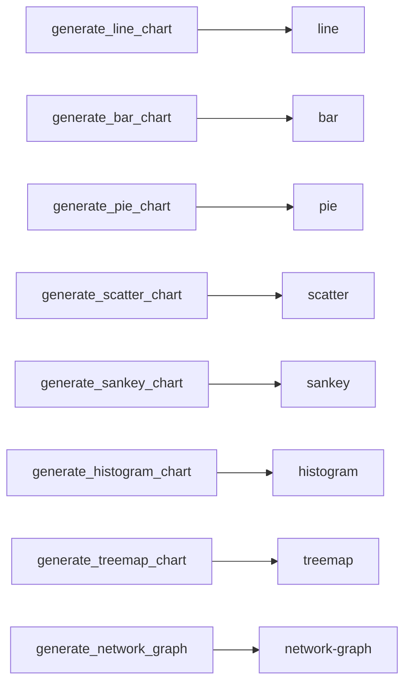
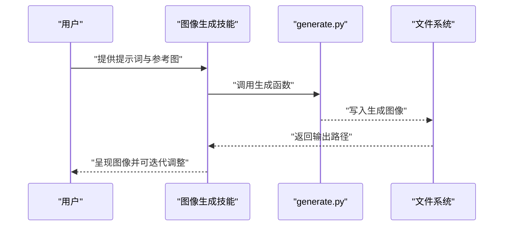
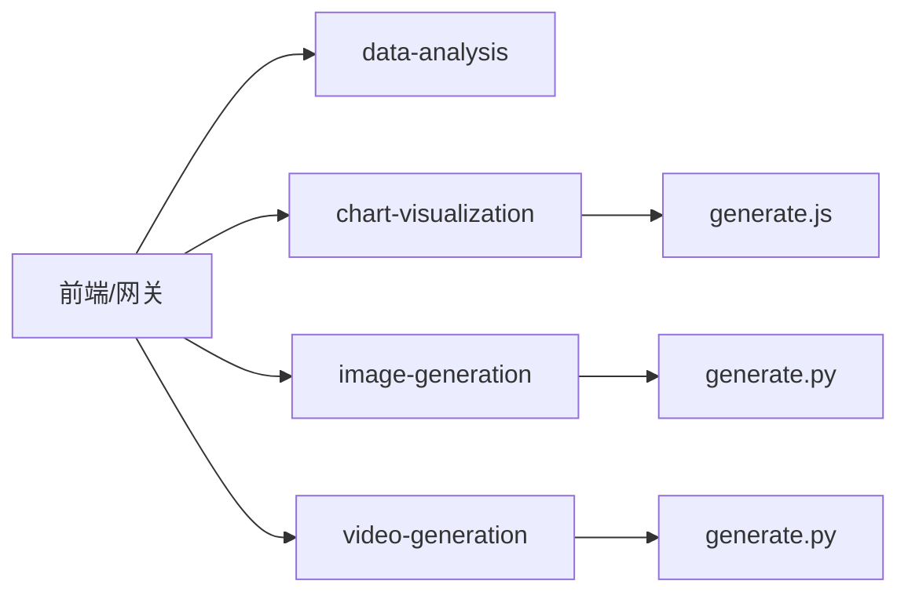

# 数据处理类技能

<cite>
**本文引用的文件**
- [skills/public/data-analysis/SKILL.md](file://skills/public/data-analysis/SKILL.md)
- [skills/public/data-analysis/scripts/analyze.py](file://skills/public/data-analysis/scripts/analyze.py)
- [skills/public/chart-visualization/SKILL.md](file://skills/public/chart-visualization/SKILL.md)
- [release/skills/public/chart-visualization/scripts/generate.js](file://release/skills/public/chart-visualization/scripts/generate.js)
- [skills/public/image-generation/SKILL.md](file://skills/public/image-generation/SKILL.md)
- [skills/public/image-generation/scripts/generate.py](file://skills/public/image-generation/scripts/generate.py)
- [skills/public/video-generation/SKILL.md](file://skills/public/video-generation/SKILL.md)
- [skills/public/video-generation/scripts/generate.py](file://skills/public/video-generation/scripts/generate.py)
- [backend/app/gateway/routers/suggestions.py](file://backend/app/gateway/routers/suggestions.py)
- [frontend/src/content/en/harness/skills.mdx](file://frontend/src/content/en/harness/skills.mdx)
</cite>

## 目录
1. [简介](#简介)
2. [项目结构](#项目结构)
3. [核心组件](#核心组件)
4. [架构总览](#架构总览)
5. [详细组件分析](#详细组件分析)
6. [依赖关系分析](#依赖关系分析)
7. [性能考虑](#性能考虑)
8. [故障排除指南](#故障排除指南)
9. [结论](#结论)
10. [附录](#附录)

## 简介
本文件面向 DeerFlow 的“数据处理类技能”，系统性梳理并说明以下四类技能的能力边界、工作流、配置参数、性能与排障要点：
- 数据分析技能：对结构化数据进行探索性统计与洞察提取
- 图表可视化技能：从数据智能选择图表类型并生成高质量可视化图片
- 图像生成技能：基于提示词与参考图生成图像
- 视频生成技能：基于提示词与参考图生成视频

文档以“可操作”为目标，既提供高层架构理解，也给出具体参数说明、使用示例与优化建议。

## 项目结构
数据处理类技能主要分布在 skills/public 下的四个子目录中，并辅以前端与后端路由层的集成入口。下图给出概览：

**图表来源**
- [frontend/src/content/en/harness/skills.mdx:47-75](file://frontend/src/content/en/harness/skills.mdx#L47-L75)
- [backend/app/gateway/routers/suggestions.py:104](file://backend/app/gateway/routers/suggestions.py#L104)

**章节来源**
- [frontend/src/content/en/harness/skills.mdx:47-75](file://frontend/src/content/en/harness/skills.mdx#L47-L75)
- [backend/app/gateway/routers/suggestions.py:104](file://backend/app/gateway/routers/suggestions.py#L104)

## 核心组件
- 数据分析技能（data-analysis）
  - 职责：对输入数据执行探索性分析、统计汇总与洞察生成
  - 入口：通过 SKILL.md 中的使用说明与脚本 analyze.py 协同完成
- 图表可视化技能（chart-visualization）
  - 职责：根据数据特征自动选择合适图表类型，解析参数并生成图片
  - 入口：SKILL.md 描述工作流；generate.js 承载图表生成逻辑映射
- 图像生成技能（image-generation）
  - 职责：依据提示词与参考图像生成目标图像
  - 入口：SKILL.md 与 generate.py
- 视频生成技能（video-generation）
  - 职责：基于提示词与参考图像生成视频
  - 入口：SKILL.md 与 generate.py

**章节来源**
- [skills/public/data-analysis/SKILL.md](file://skills/public/data-analysis/SKILL.md)
- [skills/public/chart-visualization/SKILL.md:12-68](file://skills/public/chart-visualization/SKILL.md#L12-L68)
- [release/skills/public/chart-visualization/scripts/generate.js:6-30](file://release/skills/public/chart-visualization/scripts/generate.js#L6-L30)
- [skills/public/image-generation/SKILL.md](file://skills/public/image-generation/SKILL.md)
- [skills/public/image-generation/scripts/generate.py:29](file://skills/public/image-generation/scripts/generate.py#L29)
- [skills/public/video-generation/SKILL.md:113-140](file://skills/public/video-generation/SKILL.md#L113-L140)
- [skills/public/video-generation/scripts/generate.py:7](file://skills/public/video-generation/scripts/generate.py#L7)

## 架构总览
下图展示用户请求经由前端/网关进入后，如何调用各数据处理类技能的典型路径与交互：

[此图为概念性流程示意，不直接映射具体源码文件，故无“图表来源”标注]

## 详细组件分析

### 数据分析技能（data-analysis）
- 功能特性
  - 探索性数据分析：支持描述性统计、分布分析、异常检测等
  - 洞察生成：从统计结果中提炼关键趋势与结论
  - 输出形式：文本报告、统计摘要或可进一步可视化的中间数据
- 使用方法
  - 在 SKILL.md 中查阅使用说明与参数约束
  - 通过 analyze.py 执行分析流程，按需输出中间结果
- 参数与数据格式
  - 输入数据格式：结构化表格/数组，字段名与类型需满足分析脚本预期
  - 关键参数：数据范围、分组维度、统计指标集合等（以实际脚本为准）
- 处理逻辑（概念流程）

**章节来源**
- [skills/public/data-analysis/SKILL.md](file://skills/public/data-analysis/SKILL.md)
- [skills/public/data-analysis/scripts/analyze.py](file://skills/public/data-analysis/scripts/analyze.py)

### 图表可视化技能（chart-visualization）
- 功能特性
  - 智能图表选择：基于数据类型与业务语义自动匹配最优图表类型
  - 参数抽取：从用户输入中提取必要字段并映射到生成脚本 args
  - 图片生成：统一通过 generate.js 将 JSON 载荷传递给渲染脚本
- 工作流
  1) 智能图表选择：依据时间序列、比较、部分-整体、关系/流向、地图、层级、专业图表等类别选择工具函数
  2) 参数提取：对照 references/ 下的具体图表规格文件，提取必填与可选字段
  3) 图表生成：调用 scripts/generate.js 并传入 JSON 载荷
  4) 结果返回：返回图片 URL 与完整 args 规格
- 关键参数与数据格式
  - 必填字段：tool（图表类型）、args.data（原始数据）
  - 常用字段：title（标题）、theme（主题）、style（样式对象）
  - 数据格式：数组/对象，遵循各图表类型的 schema（详见 references/）
- 图表类型映射（节选）

**图表来源**
- [release/skills/public/chart-visualization/scripts/generate.js:6-30](file://release/skills/public/chart-visualization/scripts/generate.js#L6-L30)

**章节来源**
- [skills/public/chart-visualization/SKILL.md:12-68](file://skills/public/chart-visualization/SKILL.md#L12-L68)
- [release/skills/public/chart-visualization/scripts/generate.js:6-30](file://release/skills/public/chart-visualization/scripts/generate.js#L6-L30)

### 图像生成技能（image-generation）
- 功能特性
  - 基于提示词与参考图像生成目标图像
  - 支持多轮迭代与质量优化
- 使用方法
  - 参考 SKILL.md 的步骤与参数说明
  - 调用 generate.py 执行图像生成
- 关键参数与数据格式
  - 提示词：英文 JSON 格式，确保结构化与可解析
  - 参考图像：单张或多张，显著提升生成质量
  - 输出路径：通常位于 /mnt/user-data/outputs/
- 流程时序

**章节来源**
- [skills/public/image-generation/SKILL.md](file://skills/public/image-generation/SKILL.md)
- [skills/public/image-generation/scripts/generate.py:29](file://skills/public/image-generation/scripts/generate.py#L29)

### 视频生成技能（video-generation）
- 功能特性
  - 基于提示词与参考图像生成视频
  - 支持纵横比、帧率等参数控制
- 使用方法
  - 参考 SKILL.md 的步骤与参数说明
  - 调用 generate.py 执行视频生成
- 关键参数与数据格式
  - prompt-file：JSON 格式的提示词文件
  - reference-images：参考图像路径
  - output-file：输出视频路径
  - aspect-ratio：纵横比（如 16:9）
- 流程时序

**章节来源**
- [skills/public/video-generation/SKILL.md:113-140](file://skills/public/video-generation/SKILL.md#L113-L140)
- [skills/public/video-generation/scripts/generate.py:7](file://skills/public/video-generation/scripts/generate.py#L7)

## 依赖关系分析
- 组件内聚与耦合
  - 各技能内部自包含（脚本+说明），对外通过统一的调用约定（JSON 载荷/命令行参数）解耦
  - 前端与网关负责编排与路由，不直接参与复杂逻辑
- 外部依赖
  - 图表可视化依赖 Node.js 运行时与 generate.js 映射
  - 图像/视频生成依赖 Python 脚本与文件系统输出路径
- 潜在循环依赖
  - 当前结构为单向调用链，未见循环依赖迹象

**图表来源**
- [frontend/src/content/en/harness/skills.mdx:47-75](file://frontend/src/content/en/harness/skills.mdx#L47-L75)
- [release/skills/public/chart-visualization/scripts/generate.js:6-30](file://release/skills/public/chart-visualization/scripts/generate.js#L6-L30)
- [skills/public/image-generation/scripts/generate.py:29](file://skills/public/image-generation/scripts/generate.py#L29)
- [skills/public/video-generation/scripts/generate.py:7](file://skills/public/video-generation/scripts/generate.py#L7)

**章节来源**
- [frontend/src/content/en/harness/skills.mdx:47-75](file://frontend/src/content/en/harness/skills.mdx#L47-L75)
- [release/skills/public/chart-visualization/scripts/generate.js:6-30](file://release/skills/public/chart-visualization/scripts/generate.js#L6-L30)
- [skills/public/image-generation/scripts/generate.py:29](file://skills/public/image-generation/scripts/generate.py#L29)
- [skills/public/video-generation/scripts/generate.py:7](file://skills/public/video-generation/scripts/generate.py#L7)

## 性能考虑
- 数据分析技能
  - 对超大数据集建议先采样或分块处理，避免内存峰值过高
  - 合理选择统计指标，减少不必要的计算
- 图表可视化技能
  - 控制数据点数量，避免渲染过载
  - 优先选择轻量级图表类型（如柱状/折线）用于大规模数据
  - 使用缓存策略复用已生成的图表（若适用）
- 图像/视频生成技能
  - 提示词尽量简洁明确，减少迭代轮次
  - 参考图像质量越高，越有利于一次命中优质结果
  - 输出路径与磁盘空间规划，避免 IO 阻塞

[本节为通用性能建议，不直接分析具体源码文件，故无“章节来源”标注]

## 故障排除指南
- 图表可视化
  - 症状：生成失败或空白图片
  - 排查：确认 args.data 格式正确；检查 references/ 规格是否齐全；验证 Node.js 版本满足要求
- 图像生成
  - 症状：输出为空或路径不可达
  - 排查：确认 generate.py 正常执行；检查 /mnt/user-data/outputs/ 权限与磁盘空间；核对提示词 JSON 格式
- 视频生成
  - 症状：视频无法播放或尺寸异常
  - 排查：确认 aspect-ratio 与参考图像分辨率匹配；检查 prompt-file 与 reference-images 路径有效
- 前端/网关
  - 症状：技能调用无响应
  - 排查：检查后端路由与中间件状态；确认技能可用性与版本兼容

**章节来源**
- [skills/public/chart-visualization/SKILL.md:12-68](file://skills/public/chart-visualization/SKILL.md#L12-L68)
- [skills/public/image-generation/SKILL.md](file://skills/public/image-generation/SKILL.md)
- [skills/public/video-generation/SKILL.md:113-140](file://skills/public/video-generation/SKILL.md#L113-L140)
- [backend/app/gateway/routers/suggestions.py:104](file://backend/app/gateway/routers/suggestions.py#L104)

## 结论
数据处理类技能在 DeerFlow 中以“可插拔”的方式提供从数据探索、图表生成到图像/视频产出的全链路能力。通过规范化的参数约定与清晰的调用流程，用户可以快速组合不同技能以满足多样化的数据处理需求。建议在生产环境中结合性能与稳定性策略，持续优化数据规模与生成参数，以获得更佳体验。

[本节为总结性内容，不直接分析具体源码文件，故无“章节来源”标注]

## 附录
- 技能清单与简述（摘自前端内容）
  - data-analysis：数据探索、统计分析与洞察生成
  - chart-visualization：从数据创建图表与图形
  - image-generation：AI 图像生成工作流
  - video-generation：视频内容规划与生成

**章节来源**
- [frontend/src/content/en/harness/skills.mdx:47-75](file://frontend/src/content/en/harness/skills.mdx#L47-L75)