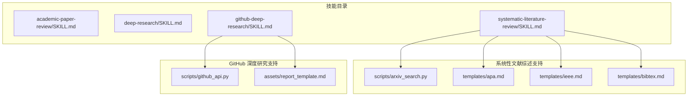
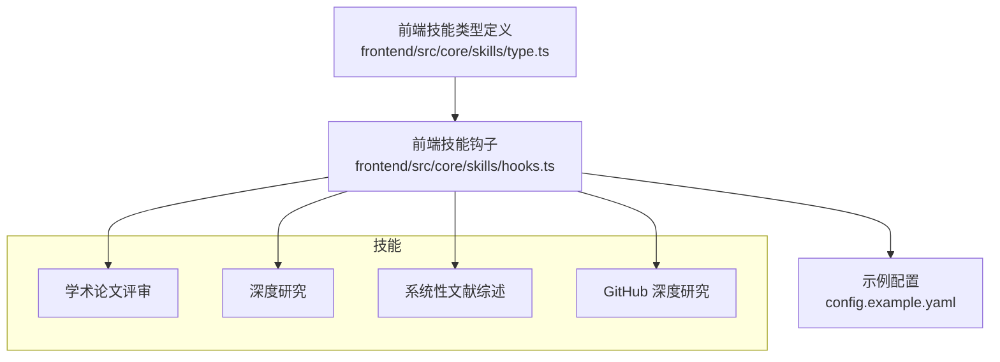
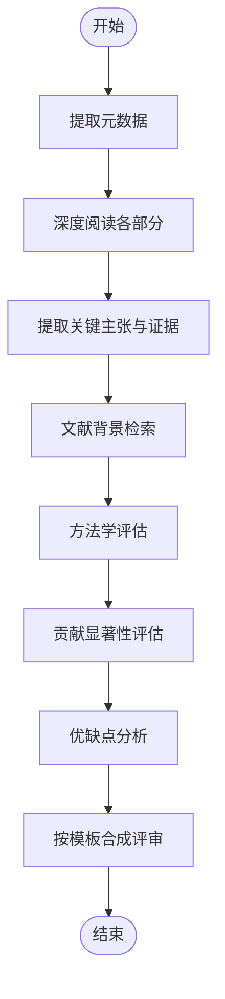
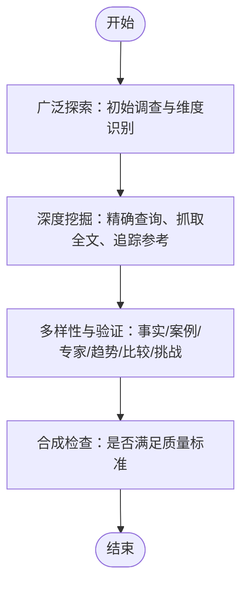
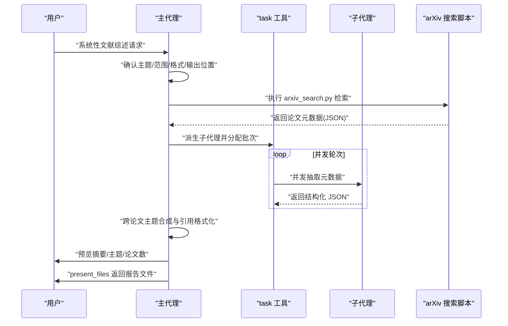
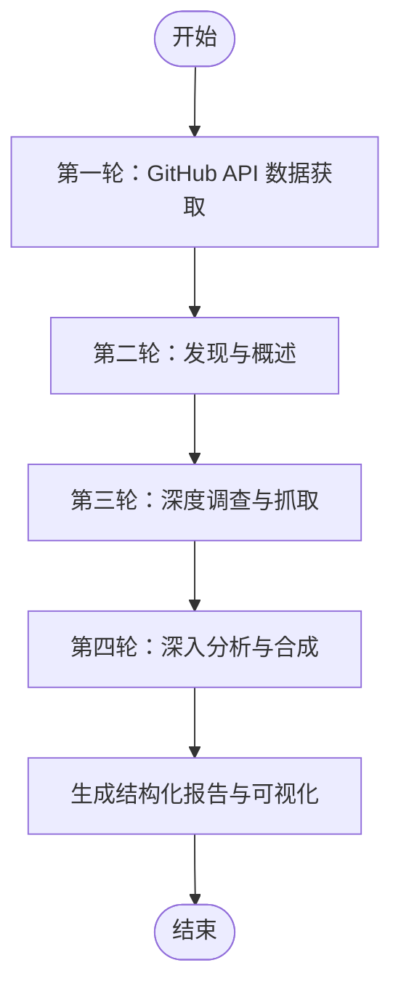

# 研究分析类技能

<cite>
**本文引用的文件**
- [academic-paper-review/SKILL.md](file://skills/public/academic-paper-review/SKILL.md)
- [deep-research/SKILL.md](file://skills/public/deep-research/SKILL.md)
- [systematic-literature-review/SKILL.md](file://skills/public/systematic-literature-review/SKILL.md)
- [github-deep-research/SKILL.md](file://skills/public/github-deep-research/SKILL.md)
- [systematic-literature-review/scripts/arxiv_search.py](file://skills/public/systematic-literature-review/scripts/arxiv_search.py)
- [systematic-literature-review/templates/apa.md](file://skills/public/systematic-literature-review/templates/apa.md)
- [systematic-literature-review/templates/ieee.md](file://skills/public/systematic-literature-review/templates/ieee.md)
- [systematic-literature-review/templates/bibtex.md](file://skills/public/systematic-literature-review/templates/bibtex.md)
- [github-deep-research/scripts/github_api.py](file://skills/public/github-deep-research/scripts/github_api.py)
- [github-deep-research/assets/report_template.md](file://skills/public/github-deep-research/assets/report_template.md)
- [config.example.yaml](file://config.example.yaml)
- [frontend/src/core/skills/type.ts](file://frontend/src/core/skills/type.ts)
- [frontend/src/core/skills/hooks.ts](file://frontend/src/core/skills/hooks.ts)
</cite>

## 目录
1. [引言](#引言)
2. [项目结构](#项目结构)
3. [核心组件](#核心组件)
4. [架构总览](#架构总览)
5. [详细组件分析](#详细组件分析)
6. [依赖分析](#依赖分析)
7. [性能考虑](#性能考虑)
8. [故障排除指南](#故障排除指南)
9. [结论](#结论)
10. [附录](#附录)

## 引言
本文件面向 DeerFlow 的研究分析类技能，聚焦以下四项能力：
- 学术论文评审技能：对单篇学术论文进行结构化同行评审，覆盖摘要、贡献评估、方法学评价、文献定位与可改进建议等。
- 深度研究技能：系统化网络研究方法，提供多角度、多层次的信息收集与验证，为内容生成奠定坚实基础。
- 系统性文献综述技能：在 arXiv 上检索并系统化合成多篇论文，产出带一致引用格式的综述报告。
- GitHub 深度研究技能：围绕 GitHub 仓库开展多轮深度研究，产出包含时间线、架构、指标对比与可视化图示的结构化报告。

本文件将从输入参数、处理流程、输出格式、应用场景、协作关系、性能优化与常见问题等方面进行系统阐述，并提供可操作的使用示例与最佳实践。

## 项目结构
研究分析类技能位于 skills/public 下的四个子目录中，分别对应上述四项能力。每项技能均包含：
- 技能定义文件 SKILL.md，描述用途、工作流、模板与注意事项；
- 可选脚本或模板资源，用于检索、解析与格式化输出。

**图表来源**
- [systematic-literature-review/SKILL.md:1-236](file://skills/public/systematic-literature-review/SKILL.md#L1-L236)
- [github-deep-research/SKILL.md:1-167](file://skills/public/github-deep-research/SKILL.md#L1-L167)

**章节来源**
- [academic-paper-review/SKILL.md:1-290](file://skills/public/academic-paper-review/SKILL.md#L1-L290)
- [deep-research/SKILL.md:1-199](file://skills/public/deep-research/SKILL.md#L1-L199)
- [systematic-literature-review/SKILL.md:1-236](file://skills/public/systematic-literature-review/SKILL.md#L1-L236)
- [github-deep-research/SKILL.md:1-167](file://skills/public/github-deep-research/SKILL.md#L1-L167)

## 核心组件
- 学术论文评审技能：提供结构化评审模板与原则，覆盖元数据提取、关键主张识别、文献背景检索、方法学评分、贡献等级评估、优缺点分析与推荐意见。
- 深度研究技能：强调“先广后深”的研究策略，通过多轮搜索、多样化信息类型与交叉验证，确保内容生成基于充分的事实依据。
- 系统性文献综述技能：以 arXiv 为唯一学术数据库，执行主题规划、检索、并行元数据抽取、跨论文主题合成与引用格式化。
- GitHub 深度研究技能：以 GitHub API 为起点，结合网络发现与深度调查，产出包含时间线、架构与对比分析的结构化报告。

**章节来源**
- [academic-paper-review/SKILL.md:14-290](file://skills/public/academic-paper-review/SKILL.md#L14-L290)
- [deep-research/SKILL.md:12-199](file://skills/public/deep-research/SKILL.md#L12-L199)
- [systematic-literature-review/SKILL.md:30-236](file://skills/public/systematic-literature-review/SKILL.md#L30-L236)
- [github-deep-research/SKILL.md:10-167](file://skills/public/github-deep-research/SKILL.md#L10-L167)

## 架构总览
四项技能在 DeerFlow 中作为“技能”被加载与调用。前端提供技能列表与启用/禁用接口，后端路由与服务负责技能生命周期管理与运行时工具可用性保障。

**图表来源**
- [frontend/src/core/skills/type.ts:1-7](file://frontend/src/core/skills/type.ts#L1-L7)
- [frontend/src/core/skills/hooks.ts:1-31](file://frontend/src/core/skills/hooks.ts#L1-L31)
- [config.example.yaml](file://config.example.yaml)

**章节来源**
- [frontend/src/core/skills/type.ts:1-7](file://frontend/src/core/skills/type.ts#L1-L7)
- [frontend/src/core/skills/hooks.ts:1-31](file://frontend/src/core/skills/hooks.ts#L1-L31)
- [config.example.yaml](file://config.example.yaml)

## 详细组件分析

### 学术论文评审技能
- 输入参数与触发条件
  - 用户提供论文 URL（arXiv、DOI、会议/期刊链接）或上传 PDF。
  - 用户请求“评审/分析/批判/评估/总结”某篇论文。
- 处理流程
  - 阶段一：论文理解
    - 元数据提取（标题、作者、发表/提交状态、年份、领域、论文类型）。
    - 深度阅读：摘要与引言、相关工作、方法学、实验与结果、讨论与局限、结论。
    - 关键主张提取：明确列出主要主张、证据与强度。
  - 阶段二：批判性分析
    - 文献背景检索：围绕主题、方法、作者先前工作、技术局限与综述展开搜索。
    - 方法学评估：从正确性、新颖性、可复现性、实验设计、统计严谨性、可扩展性六个维度打分。
    - 贡献显著性评估：按里程碑、显著、中等、边缘、低于阈值分级。
    - 优缺点分析：针对具体观察点，给出出处与影响说明。
  - 阶段三：评审合成
    - 使用统一评审模板输出：元数据、执行摘要、贡献摘要、优点、缺点、方法学评估、作者提问、小问题、文献定位、总体评估与改进建议。
- 输出格式
  - Markdown 格式，保存至沙箱默认输出路径并通过 present_files 工具呈现给用户。
- 应用场景
  - 会议/期刊审稿前准备、快速筛选用文、比较性评审、教学与指导。
- 使用示例
  - 提供 arXiv 链接或 PDF 文件，要求生成“结构化评审报告”，选择“简要评估”或“完整评审”以适配不同需求深度。
- 协作关系
  - 与深度研究技能配合：先用深度研究掌握领域现状，再用学术论文评审聚焦单篇质量与定位。

**图表来源**
- [academic-paper-review/SKILL.md:38-290](file://skills/public/academic-paper-review/SKILL.md#L38-L290)

**章节来源**
- [academic-paper-review/SKILL.md:25-290](file://skills/public/academic-paper-review/SKILL.md#L25-L290)

### 深度研究技能
- 输入参数与触发条件
  - 用户提出需要“什么是 X”、“解释 X”、“研究 X”、“调查 X”的问题。
  - 内容生成前置研究：PPT、UI 设计、文章、视频等需要真实世界信息与实例。
- 处理流程
  - 广泛探索：初始主题调查，识别关键子主题、视角与利益相关方。
  - 深度挖掘：针对每个重要维度进行精确查询、多词形变化、抓取全文并追踪参考文献。
  - 多样性与验证：覆盖事实数据、案例、专家观点、趋势预测、比较与挑战/批评。
  - 合成检查：确认是否从至少 3-5 个角度研究、是否已读取权威全文、是否包含正反两面、信息是否最新且权威。
- 输出
  - 完整的主题理解、具体事实与统计数据、真实案例与专家观点、当前趋势与背景、挑战与局限。
- 使用示例
  - “请研究 2026 年 AI 在医疗中的应用”，采用“主题 + 权威来源提示 + 时间限定”的查询模式，确保时效性与权威性。

**图表来源**
- [deep-research/SKILL.md:33-199](file://skills/public/deep-research/SKILL.md#L33-L199)

**章节来源**
- [deep-research/SKILL.md:12-199](file://skills/public/deep-research/SKILL.md#L12-L199)

### 系统性文献综述技能
- 输入参数与触发条件
  - 用户希望获得某一主题的系统性综述、文献调查、跨论文比较或注释书目。
  - 明确主题、范围（论文数量上限 50）、时间窗口、arXiv 类别与引用格式（APA/IEEE/BibTeX）。
- 处理流程
  - 计划阶段：确认主题、范围、格式与输出位置；若用户未明确则进行一次澄清性提问。
  - 检索阶段：调用 arxiv_search.py 执行 arXiv 检索，使用“相关性”排序并结合起止日期约束。
  - 并行元数据抽取：通过 task 工具派生最多 3 个子代理并发抽取，遵循批次与回合策略，避免递归过深与令牌超支。
  - 合成与格式化：识别主题、趋同与分歧、空白；根据用户偏好读取对应模板并格式化引用。
  - 保存与呈现：生成文件并使用 present_files 工具供下载。
- 输出格式
  - 按模板结构输出，APA/IEEE/BibTeX 三种格式可选；最终报告保存为 slr-<topic-slug>-<YYYYMMDD>.md。
- 使用示例
  - “做一份关于 transformer attention 变体的系统性文献综述，20 篇，APA 格式”，随后按计划-检索-抽取-合成-保存的顺序执行。

**图表来源**
- [systematic-literature-review/SKILL.md:30-236](file://skills/public/systematic-literature-review/SKILL.md#L30-L236)
- [systematic-literature-review/scripts/arxiv_search.py](file://skills/public/systematic-literature-review/scripts/arxiv_search.py)

**章节来源**
- [systematic-literature-review/SKILL.md:30-236](file://skills/public/systematic-literature-review/SKILL.md#L30-L236)

### GitHub 深度研究技能
- 输入参数与触发条件
  - 用户提供 GitHub 仓库 URL 或开源项目名称，请求综合性分析、时间线重建、竞品分析或深入调查。
- 处理流程
  - 第一轮：GitHub API 直接获取仓库概要、README、树状结构、语言分布、贡献者、提交、议题、拉取请求、发布信息。
  - 第二轮：通用网络搜索，获取概述、官方网站/仓库、主要玩家/竞品。
  - 第三轮：深度调查，关注技术架构、关键事件时间线、社区情绪，抓取有价值链接的全文。
  - 第四轮：深入分析，基于提交历史梳理时间线，审查议题/PR 推动的功能演进，检查贡献者活跃度。
- 输出格式
  - 结构化 Markdown 报告，包含元数据块、执行摘要、时间线、关键分析章节、指标与对比、优缺点、来源、置信度评估与方法论；必要时插入甘特图、流程图、饼图/柱状图等可视化。
- 使用示例
  - “对某开源项目进行深度研究”，先通过 GitHub API 获取仓库信息，再结合网络搜索与深度调查，最终形成包含时间线与架构图的报告。

**图表来源**
- [github-deep-research/SKILL.md:10-167](file://skills/public/github-deep-research/SKILL.md#L10-L167)

**章节来源**
- [github-deep-research/SKILL.md:10-167](file://skills/public/github-deep-research/SKILL.md#L10-L167)

## 依赖分析
- 学术论文评审技能
  - 依赖网络搜索与网页抓取工具以获取文献背景与补充材料。
  - 与深度研究技能存在互补关系：前者聚焦单篇，后者提供领域背景。
- 深度研究技能
  - 依赖多种信息源（权威报告、行业分析、专家访谈、案例研究、统计数据），强调“先广后深”的迭代优化。
- 系统性文献综述技能
  - 严格依赖 arXiv 检索脚本与模板文件；并行元数据抽取依赖 task 工具与子代理机制。
  - 对运行时配置有硬性要求：必须启用子代理（subagent_enabled=true）以执行并行抽取。
- GitHub 深度研究技能
  - 依赖 GitHub API 脚本与报告模板；强调来源优先级与内联引用规范。

**图表来源**
- [academic-paper-review/SKILL.md:285-285](file://skills/public/academic-paper-review/SKILL.md#L285-L285)
- [systematic-literature-review/SKILL.md:229-232](file://skills/public/systematic-literature-review/SKILL.md#L229-L232)
- [github-deep-research/SKILL.md:1-167](file://skills/public/github-deep-research/SKILL.md#L1-L167)

**章节来源**
- [academic-paper-review/SKILL.md:285-285](file://skills/public/academic-paper-review/SKILL.md#L285-L285)
- [systematic-literature-review/SKILL.md:229-232](file://skills/public/systematic-literature-review/SKILL.md#L229-L232)
- [github-deep-research/SKILL.md:1-167](file://skills/public/github-deep-research/SKILL.md#L1-L167)

## 性能考虑
- 检索与抓取
  - 深度研究与系统性文献综述应避免重复检索与过度重试，优先使用权威来源与精确查询词，减少令牌消耗与等待时间。
- 并行与并发
  - 系统性文献综述的并行抽取需遵守每轮最多 3 个子代理的限制，合理安排批次与回合，避免触发运行时并发上限。
- 输出与存储
  - 统一使用 present_files 工具输出，避免在上下文中堆积大体量文本；仅在最终阶段保存到指定输出路径。
- 可视化与可读性
  - 适度使用 Mermaid 图表提升可读性，但避免在长报告中堆砌过多图表导致加载缓慢。

## 故障排除指南
- 子代理不可用
  - 症状：系统性文献综述无法执行并行抽取。
  - 原因：运行时未启用子代理（subagent_enabled=false）。
  - 处理：在配置中启用子代理，或改为手动小规模综述。
- arXiv 检索失败
  - 症状：arxiv_search.py 返回非 200 或无结果。
  - 原因：网络错误或查询过于宽泛/精准不当。
  - 处理：调整查询词（保留 2-3 个核心关键词）、使用类别过滤与时间窗口，重新执行。
- 报告格式不一致
  - 症状：引用格式与用户期望不符。
  - 处理：明确指定 APA/IEEE/BibTeX 之一；若用户未指定，默认 APA。
- GitHub 数据缺失
  - 症状：无法获取仓库详情或提交历史。
  - 处理：确认仓库公开、API 凭据有效；必要时改用网络搜索补充信息。

**章节来源**
- [systematic-literature-review/SKILL.md:229-232](file://skills/public/systematic-literature-review/SKILL.md#L229-L232)
- [systematic-literature-review/SKILL.md:87-87](file://skills/public/systematic-literature-review/SKILL.md#L87-L87)
- [systematic-literature-review/SKILL.md:176-182](file://skills/public/systematic-literature-review/SKILL.md#L176-L182)
- [github-deep-research/SKILL.md:39-58](file://skills/public/github-deep-research/SKILL.md#L39-L58)

## 结论
四项研究分析技能在 DeerFlow 中形成互补的研究闭环：深度研究提供背景与素材，系统性文献综述进行广度合成，学术论文评审聚焦单篇质量，GitHub 深度研究拓展到开源生态。通过规范化的输入参数、严谨的处理流程与严格的输出格式，这些技能能够支撑从概念理解到结构化报告的全链路研究任务。建议在实际使用中结合场景灵活组合，并遵循性能与质量的最佳实践。

## 附录
- 使用示例清单
  - 学术论文评审：提供 arXiv 链接或 PDF，选择“简要/完整”评审深度。
  - 深度研究：针对“2026 年 AI 在医疗中的应用”，采用权威来源 + 时间限定 + 多种内容类型检索。
  - 系统性文献综述：主题“transformer attention 变体”，20 篇，APA 格式，必要时添加 arXiv 类别与时间窗口。
  - GitHub 深度研究：对某开源项目进行时间线与架构分析，产出含可视化图表的报告。
- 最佳实践
  - 先广后深：在内容生成前完成充分研究与交叉验证。
  - 明确边界：单篇评审用学术论文评审，多篇综述用系统性文献综述。
  - 规范引用：所有外部信息均需内联标注来源，确保可追溯性。
  - 控制并发：严格遵守系统性文献综述的子代理并发限制，避免超限与失败。