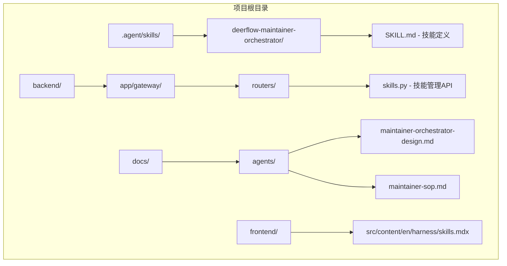
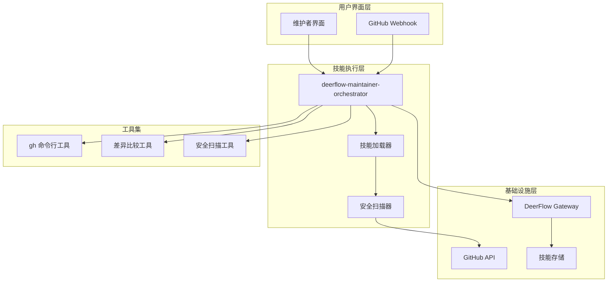
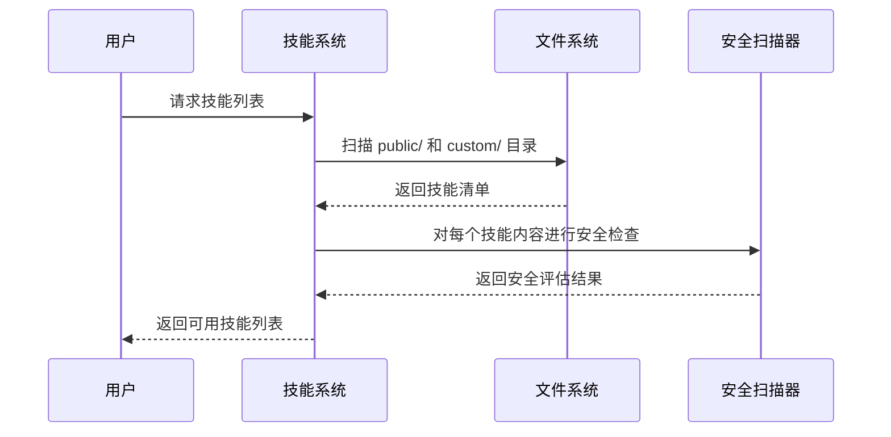
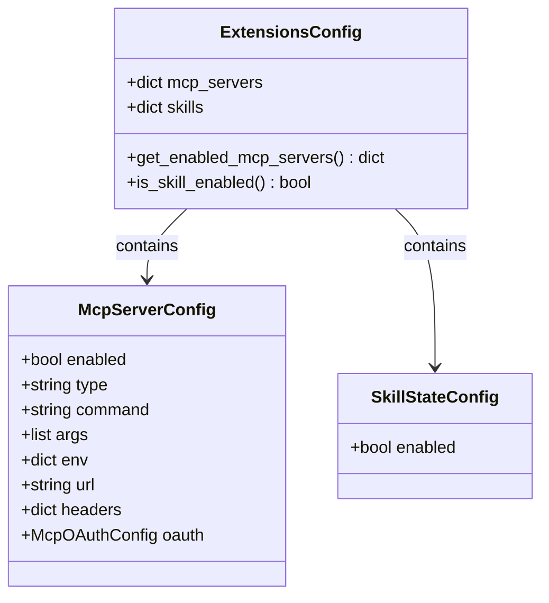
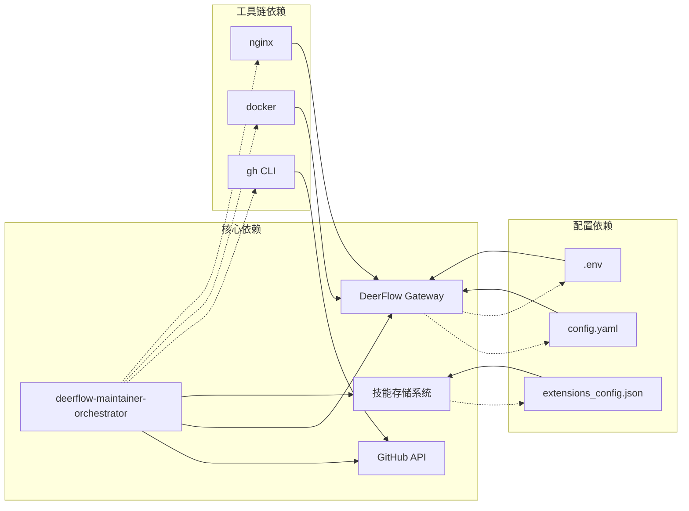

# 维护者编排器技能

<cite>
**本文档引用的文件**
- [deerflow-maintainer-orchestrator/SKILL.md](file://.agent/skills/deerflow-maintainer-orchestrator/SKILL.md)
- [维护者编排器设计说明](file://docs/agents/maintainer-orchestrator-design.md)
- [维护者操作程序（SOP）](file://docs/agents/maintainer-sop.md)
- [后端应用入口](file://backend/app/gateway/app.py)
- [技能路由](file://backend/app/gateway/routers/skills.py)
- [前端技能文档](file://frontend/src/content/en/harness/skills.mdx)
- [README](file://README.md)
- [代理配置](file://backend/packages/harness/deerflow/config/agents_config.py)
- [系统提示模板](file://backend/packages/harness/deerflow/agents/lead_agent/prompt.py)
- [扩展配置](file://backend/packages/harness/deerflow/config/extensions_config.py)
</cite>

## 目录
1. [简介](#简介)
2. [项目结构](#项目结构)
3. [核心组件](#核心组件)
4. [架构概览](#架构概览)
5. [详细组件分析](#详细组件分析)
6. [依赖关系分析](#依赖关系分析)
7. [性能考虑](#性能考虑)
8. [故障排除指南](#故障排除指南)
9. [结论](#结论)

## 简介

维护者编排器技能是 DeerFlow 项目中的一个专门设计的智能体技能，用于自动化处理 GitHub Issues 和 Pull Requests 的审查工作。该技能的核心目标是在不改变现有工作流程的前提下，为维护者提供可重复、可验证的审查支持。

该技能采用"评论平面"的安全模型，专注于在 GitHub 评论层面上进行操作，避免对代码库进行直接修改。通过标准化的工作流程，它能够处理大量重复性的审查任务，让维护者专注于需要判断力的复杂问题。

## 项目结构

DeerFlow 项目采用模块化的架构设计，维护者编排器技能作为其中的一个重要组成部分：

**图表来源**
- [deerflow-maintainer-orchestrator/SKILL.md:1-238](file://.agent/skills/deerflow-maintainer-orchestrator/SKILL.md#L1-L238)
- [后端应用入口:1-416](file://backend/app/gateway/app.py#L1-L416)
- [技能路由:1-353](file://backend/app/gateway/routers/skills.py#L1-L353)

**章节来源**
- [deerflow-maintainer-orchestrator/SKILL.md:1-238](file://.agent/skills/deerflow-maintainer-orchestrator/SKILL.md#L1-L238)
- [README:1-780](file://README.md#L1-L780)

## 核心组件

### 技能定义与规则

维护者编排器技能的核心是一个详细的技能定义文件，包含了完整的操作规则和约束条件：

#### 主要规则框架
- **评论平面原则**：仅在 GitHub 评论层面上进行操作
- **授权机制**：基于维护者的明确授权进行公共评论发布
- **质量标准**：高置信度且至少为 P2 级别的问题才会发布公共评论
- **语言一致性**：根据问题或 PR 的主要语言自动选择输出语言

#### 艺术品解析流程
技能实现了完整的 GitHub 艺术品解析流程，包括：
1. **默认仓库设置**：`bytedance/deer-flow`
2. **URL 路由**：`/issues/<number>` → 问题流；`/pull/<number>` → PR 审查流
3. **批量处理**：支持问题列表和 PR 列表的批量处理
4. **时间窗口过滤**：支持基于时间范围的筛选

**章节来源**
- [deerflow-maintainer-orchestrator/SKILL.md:8-39](file://.agent/skills/deerflow-maintainer-orchestrator/SKILL.md#L8-L39)

### 设计原则文档

维护者编排器的设计说明文档阐述了该技能的深层设计理念：

#### 安全模型
- **评论平面限制**：技能被严格限制在评论层面上，不涉及任何代码修改、分支管理或发布操作
- **风险控制**：通过最低风险、最可逆的操作面来确保安全性
- **信任边界**：明确的表面限制，防止意外的破坏性操作

#### 证据驱动的决策
- **CI 状态信号**：将 CI 状态视为信号而非最终判决
- **差异审查**：针对当前差异进行审查，而非过时的本地分支
- **批量思维**：从整体角度审查相关 PR，识别相互影响

**章节来源**
- [维护者编排器设计说明:1-70](file://docs/agents/maintainer-orchestrator-design.md#L1-L70)

### 操作程序（SOP）

维护者操作程序提供了具体的使用指导：

#### 作用域定义
- **问题流**：分析 GitHub Issues 并发布或草拟问题评论
- **PR 审查流**：审查 GitHub Pull Request 差异并发布或草拟 PR 审查评论
- **评论授权**：维护者授权后，技能可以发布每个选定非跳过问题的一个公共问题评论和每个选定 PR 的一个 PR 审查评论

#### 输出格式
- **运行结果**：包含已发布、已跳过、失败的结果统计
- **批量表格**：推荐使用简洁的维护者面向表格格式
- **状态报告**：包含艺术作品状态、公共行动和备注

**章节来源**
- [维护者操作程序（SOP）:1-173](file://docs/agents/maintainer-sop.md#L1-L173)

## 架构概览

维护者编排器技能在整个 DeerFlow 生态系统中扮演着重要的协调角色：

**图表来源**
- [deerflow-maintainer-orchestrator/SKILL.md:20-39](file://.agent/skills/deerflow-maintainer-orchestrator/SKILL.md#L20-L39)
- [后端应用入口:320-416](file://backend/app/gateway/app.py#L320-L416)

## 详细组件分析

### 技能生命周期管理

维护者编排器技能遵循完整的生命周期管理模式：

#### 发现与加载阶段

**图表来源**
- [前端技能文档:82-110](file://frontend/src/content/en/harness/skills.mdx#L82-L110)

#### 解析与注入阶段
技能内容经过解析后注入到系统提示中，为代理提供上下文信息。系统提示模板包含了技能列表、子代理配置和记忆上下文等关键信息。

**章节来源**
- [系统提示模板:606-800](file://backend/packages/harness/deerflow/agents/lead_agent/prompt.py#L606-L800)

### 安全与权限控制

维护者编排器技能实施了多层次的安全控制：

#### 访问控制
- **评论授权**：只有在维护者明确授权的情况下才能发布公共评论
- **范围限制**：严格限定在评论层面上的操作
- **重复保护**：避免重复发布相同内容

#### 内容安全
- **安全扫描**：对技能内容进行潜在危险模式检查
- **依赖管理**：处理技能声明的 Python 或系统依赖
- **环境隔离**：确保技能在受控环境中运行

**章节来源**
- [deerflow-maintainer-orchestrator/SKILL.md:150-162](file://.agent/skills/deerflow-maintainer-orchestrator/SKILL.md#L150-L162)

### 配置管理系统

技能配置通过统一的扩展配置系统管理：

#### 配置结构

**图表来源**
- [扩展配置:75-87](file://backend/packages/harness/deerflow/config/extensions_config.py#L75-L87)

**章节来源**
- [扩展配置:1-285](file://backend/packages/harness/deerflow/config/extensions_config.py#L1-L285)

### API 接口设计

技能管理通过 RESTful API 提供：

#### 技能管理接口
- **列出技能**：`GET /api/skills` - 获取所有技能列表
- **安装技能**：`POST /api/skills/install` - 从 .skill 文件安装技能
- **更新技能**：`PUT /api/skills/{skill_name}` - 更新技能启用状态
- **自定义技能管理**：支持自定义技能的创建、编辑、删除和回滚

**章节来源**
- [技能路由:1-353](file://backend/app/gateway/routers/skills.py#L1-L353)

## 依赖关系分析

维护者编排器技能与其他系统组件存在密切的依赖关系：

**图表来源**
- [后端应用入口:1-416](file://backend/app/gateway/app.py#L1-L416)
- [技能路由:1-353](file://backend/app/gateway/routers/skills.py#L1-L353)

**章节来源**
- [README:205-320](file://README.md#L205-L320)

## 性能考虑

维护者编排器技能在设计时充分考虑了性能优化：

### 缓存策略
- **技能缓存**：启用技能列表的 LRU 缓存以减少磁盘 I/O
- **配置缓存**：扩展配置采用单例模式，避免重复加载
- **内存管理**：合理使用线程锁确保并发安全

### 资源优化
- **异步处理**：使用异步编程模型提高响应速度
- **连接池**：复用 GitHub API 连接减少建立连接的开销
- **批量操作**：支持批量处理多个艺术作品以提高效率

## 故障排除指南

### 常见问题诊断

#### 技能加载失败
- **症状**：技能无法加载或显示为空
- **原因**：配置文件损坏、权限不足、依赖缺失
- **解决方案**：检查配置文件格式、验证文件权限、重新安装依赖

#### 安全扫描阻断
- **症状**：技能编辑被安全扫描器阻断
- **原因**：检测到潜在危险模式
- **解决方案**：审查技能内容、移除可疑代码、联系安全团队

#### GitHub API 限制
- **症状**：频繁遇到 API 限制错误
- **原因**：超出 GitHub API 速率限制
- **解决方案**：实现重试机制、使用更高效的查询、增加延迟

**章节来源**
- [deerflow-maintainer-orchestrator/SKILL.md:150-162](file://.agent/skills/deerflow-maintainer-orchestrator/SKILL.md#L150-L162)

## 结论

维护者编排器技能代表了 DeerFlow 项目在智能化运维方面的创新实践。通过将复杂的审查流程标准化、自动化，该技能显著提高了维护者的工作效率，同时保持了高度的安全性和可控性。

该技能的成功实施体现了以下关键要素：
- **安全优先**：通过评论平面模型确保操作的可逆性
- **标准化流程**：建立可重复、可验证的工作流程
- **智能辅助**：在保持人类判断主导的同时提供智能支持
- **可扩展性**：设计灵活，易于适应不同的项目需求

随着 AI 技术的不断发展，维护者编排器技能将继续演进，为开源社区的协作提供更加智能化的支持。