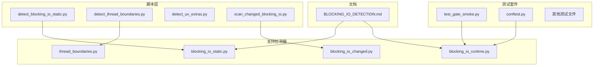
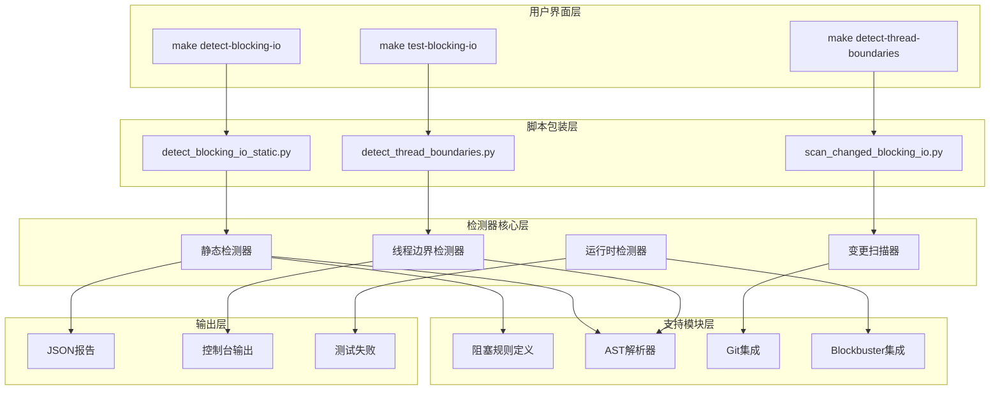
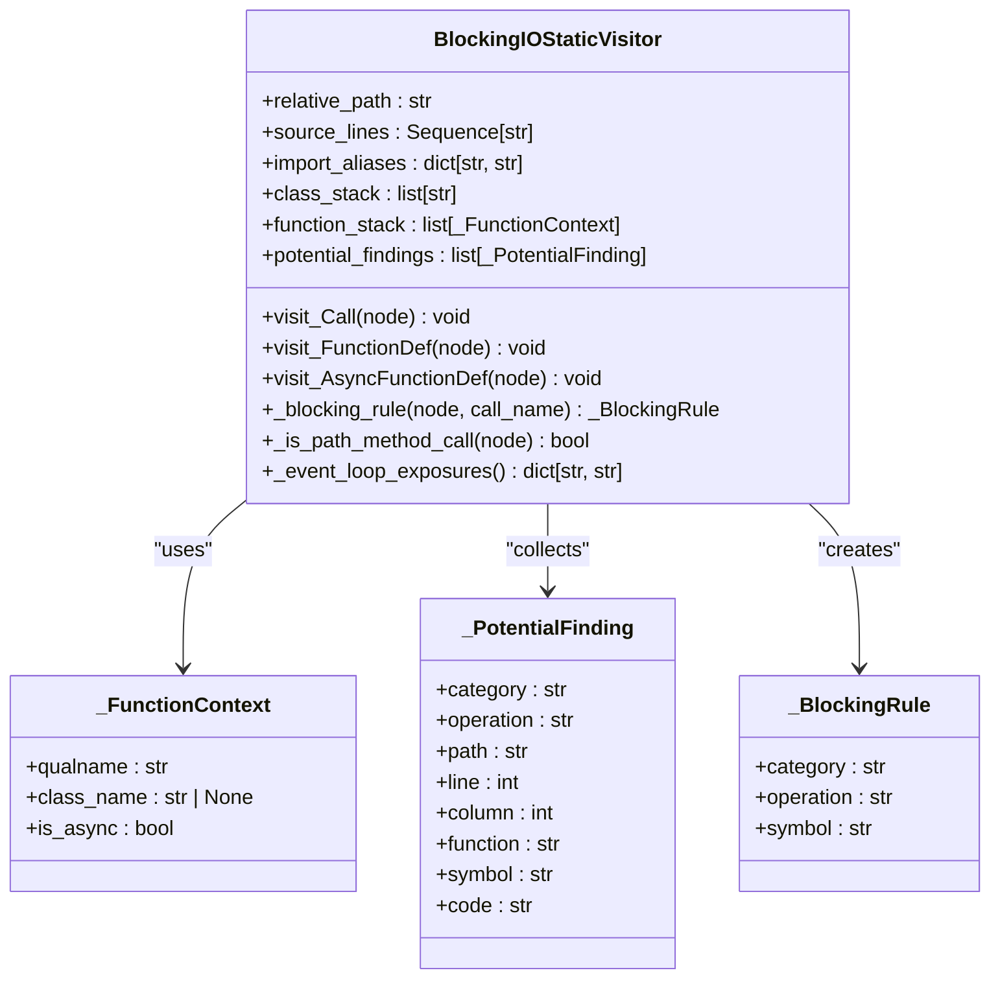
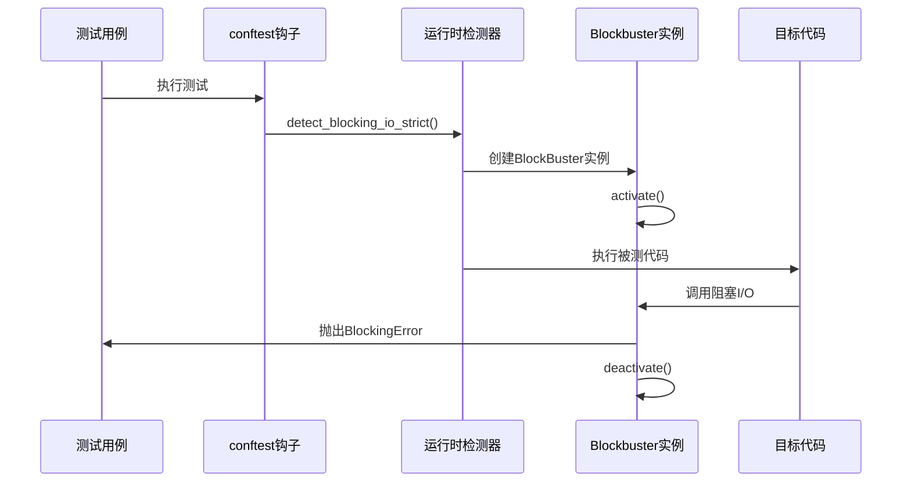
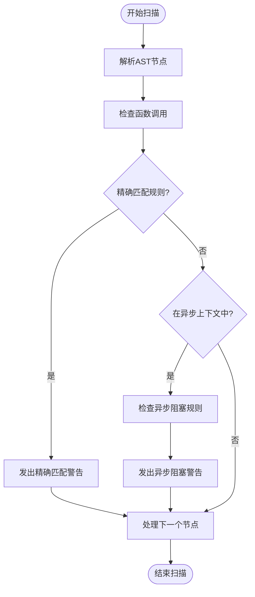
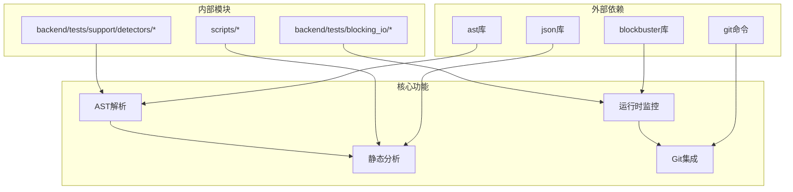

# 阻塞I/O检测技能

<cite>
**本文档引用的文件**
- [BLOCKING_IO_DETECTION.md](file://backend/docs/BLOCKING_IO_DETECTION.md)
- [detect_blocking_io_static.py](file://scripts/detect_blocking_io_static.py)
- [detect_thread_boundaries.py](file://scripts/detect_thread_boundaries.py)
- [detect_uv_extras.py](file://scripts/detect_uv_extras.py)
- [scan_changed_blocking_io.py](file://scripts/scan_changed_blocking_io.py)
- [blocking_io_static.py](file://backend/tests/support/detectors/blocking_io_static.py)
- [blocking_io_runtime.py](file://backend/tests/support/detectors/blocking_io_runtime.py)
- [thread_boundaries.py](file://backend/tests/support/detectors/thread_boundaries.py)
- [blocking_io_changed.py](file://backend/tests/support/detectors/blocking_io_changed.py)
- [test_gate_smoke.py](file://backend/tests/blocking_io/test_gate_smoke.py)
- [conftest.py](file://backend/tests/blocking_io/conftest.py)
</cite>

## 目录
1. [简介](#简介)
2. [项目结构](#项目结构)
3. [核心组件](#核心组件)
4. [架构概览](#架构概览)
5. [详细组件分析](#详细组件分析)
6. [依赖关系分析](#依赖关系分析)
7. [性能考虑](#性能考虑)
8. [故障排除指南](#故障排除指南)
9. [结论](#结论)

## 简介

阻塞I/O检测技能是DeerFlow项目中用于确保异步事件循环安全的重要工具集。该技能旨在发现和防止同步I/O操作阻塞后端异步事件循环路径，通过静态检测和运行时检测两种互补方式来实现全面保护。

该项目的核心目标是窄化范围：发现并阻止可能阻塞后端异步事件循环路径的同步I/O操作。静态检测和运行时检测各有不同的职责，但它们相互补充，共同构建了完整的防护体系。

## 项目结构

DeerFlow项目的阻塞I/O检测技能主要分布在以下目录结构中：

**图表来源**
- [detect_blocking_io_static.py:1-24](file://scripts/detect_blocking_io_static.py#L1-L24)
- [blocking_io_static.py:1-893](file://backend/tests/support/detectors/blocking_io_static.py#L1-L893)
- [blocking_io_runtime.py:1-45](file://backend/tests/support/detectors/blocking_io_runtime.py#L1-L45)

**章节来源**
- [BLOCKING_IO_DETECTION.md:1-147](file://backend/docs/BLOCKING_IO_DETECTION.md#L1-L147)

## 核心组件

阻塞I/O检测技能包含四个核心组件，每个组件都有特定的功能和职责：

### 1. 静态检测器 (Static Detector)
- **功能**：扫描后端源代码，报告可能需要人工审查的候选阻塞I/O调用点
- **特点**：发现工具，提供候选列表而非自动缺陷决策
- **输出**：`.deer-flow/blocking-io-findings.json`文件
- **范围**：扫描`backend/app`、`backend/packages/harness/deerflow`和`backend/scripts`

### 2. 运行时检测器 (Runtime Detector)
- **功能**：使用Blockbuster在CI中防止回归，检测在asyncio事件循环线程上执行的阻塞I/O
- **特点**：CI回归防护，基于确认的生产bug
- **范围**：仅覆盖`backend/tests/blocking_io/`中测试的生产路径

### 3. 线程边界检测器 (Thread Boundaries Detector)
- **功能**：识别开发者审查的异步/线程边界点
- **特点**：非侵入式解析Python源码，报告跨同步/异步/线程边界的代码位置
- **严重性级别**：INFO、WARN、FAIL三个等级

### 4. 变更阻塞I/O扫描器 (Changed Blocking I/O Scanner)
- **功能**：将git diff与静态阻塞I/O发现结果交叉对比
- **特点**：回答"这次变更引入了哪些阻塞I/O候选？"的问题
- **范围**：仅扫描指定的根目录

**章节来源**
- [blocking_io_static.py:1-893](file://backend/tests/support/detectors/blocking_io_static.py#L1-L893)
- [blocking_io_runtime.py:1-45](file://backend/tests/support/detectors/blocking_io_runtime.py#L1-L45)
- [thread_boundaries.py:1-508](file://backend/tests/support/detectors/thread_boundaries.py#L1-L508)
- [blocking_io_changed.py:1-214](file://backend/tests/support/detectors/blocking_io_changed.py#L1-L214)

## 架构概览

阻塞I/O检测技能采用分层架构设计，通过静态分析和动态监控相结合的方式提供全面保护：

**图表来源**
- [detect_blocking_io_static.py:1-24](file://scripts/detect_blocking_io_static.py#L1-L24)
- [detect_thread_boundaries.py:1-24](file://scripts/detect_thread_boundaries.py#L1-L24)
- [scan_changed_blocking_io.py:1-24](file://scripts/scan_changed_blocking_io.py#L1-L24)
- [blocking_io_static.py:1-893](file://backend/tests/support/detectors/blocking_io_static.py#L1-L893)

## 详细组件分析

### 静态检测器实现

静态检测器使用AST（抽象语法树）解析技术来分析Python源代码，识别潜在的阻塞I/O模式：

**图表来源**
- [blocking_io_static.py:309-490](file://backend/tests/support/detectors/blocking_io_static.py#L309-L490)

静态检测器的关键特性包括：

1. **阻塞模式识别**：识别文件I/O、网络请求、子进程调用、睡眠等阻塞操作
2. **异步可达性分析**：确定阻塞调用是否可能在异步函数中执行
3. **优先级分类**：根据操作类型和暴露程度对发现进行优先级排序
4. **代码片段提取**：为每个发现提供上下文代码片段

**章节来源**
- [blocking_io_static.py:1-893](file://backend/tests/support/detectors/blocking_io_static.py#L1-L893)

### 运行时检测器实现

运行时检测器使用Blockbuster库创建严格的作用域，仅检测通过`app.*`或`deerflow.*`调用栈的阻塞I/O：

**图表来源**
- [conftest.py:26-34](file://backend/tests/blocking_io/conftest.py#L26-L34)
- [blocking_io_runtime.py:32-42](file://backend/tests/support/detectors/blocking_io_runtime.py#L32-L42)

运行时检测器的核心配置包括：

- **扫描模块限制**：仅扫描`("app", "deerflow")`模块
- **规则集中管理**：所有项目本地规则都添加到`_PROJECT_BLOCKING_RULES`元组中
- **作用域激活**：使用上下文管理器确保Blockbuster正确激活和停用

**章节来源**
- [blocking_io_runtime.py:1-45](file://backend/tests/support/detectors/blocking_io_runtime.py#L1-L45)
- [conftest.py:1-38](file://backend/tests/blocking_io/conftest.py#L1-L38)

### 线程边界检测器实现

线程边界检测器专门用于识别异步/同步和线程边界转换点：

**图表来源**
- [thread_boundaries.py:244-317](file://backend/tests/support/detectors/thread_boundaries.py#L244-L317)

线程边界检测器识别的关键边界类型：

1. **同步-异步桥接**：如`asyncio.run`、`asyncio.run_coroutine_threadsafe`
2. **线程池边界**：如`concurrent.futures.ThreadPoolExecutor`
3. **原始线程边界**：如`threading.Thread`、`threading.Timer`
4. **LangChain工具边界**：同步工具包装器和异步工具定义

**章节来源**
- [thread_boundaries.py:1-508](file://backend/tests/support/detectors/thread_boundaries.py#L1-L508)

### 变更阻塞I/O扫描器实现

变更扫描器结合git diff和静态分析来识别本次变更引入的阻塞I/O候选：

**图表来源**
- [blocking_io_changed.py:155-173](file://backend/tests/support/detectors/blocking_io_changed.py#L155-L173)

变更扫描器的关键算法：

1. **变更行识别**：解析git diff hunks，识别新增行
2. **稳定键匹配**：使用`(路径, 函数, 符号)`作为稳定键避免行号变化影响
3. **基线比较**：与合并基线比较，捕获新的可达性暴露
4. **结果合并**：合并变更行发现和新于基线的发现

**章节来源**
- [blocking_io_changed.py:1-214](file://backend/tests/support/detectors/blocking_io_changed.py#L1-L214)

## 依赖关系分析

阻塞I/O检测技能的依赖关系呈现清晰的层次结构：

**图表来源**
- [blocking_io_static.py:11-20](file://backend/tests/support/detectors/blocking_io_static.py#L11-L20)
- [blocking_io_runtime.py:17-18](file://backend/tests/support/detectors/blocking_io_runtime.py#L17-L18)

主要依赖关系：

1. **标准库依赖**：`ast`、`json`、`subprocess`、`argparse`等
2. **第三方库依赖**：`blockbuster`用于运行时检测
3. **Git集成**：通过`subprocess`调用git命令获取差异信息
4. **内部模块依赖**：脚本包装器导入支持检测器模块

**章节来源**
- [blocking_io_static.py:1-893](file://backend/tests/support/detectors/blocking_io_static.py#L1-L893)
- [blocking_io_runtime.py:1-45](file://backend/tests/support/detectors/blocking_io_runtime.py#L1-L45)

## 性能考虑

阻塞I/O检测技能在设计时充分考虑了性能因素：

### 静态检测性能优化

1. **AST缓存策略**：避免重复解析相同文件
2. **增量扫描**：变更扫描器只处理受影响的文件
3. **早期退出**：在找到阻塞调用后立即停止进一步分析
4. **内存管理**：使用生成器和迭代器减少内存占用

### 运行时检测性能考虑

1. **最小化开销**：Blockbuster只在测试期间激活
2. **精确作用域**：限制扫描模块范围，避免不必要的检测
3. **快速失败**：一旦检测到阻塞I/O立即抛出异常
4. **资源清理**：确保Blockbuster正确停用，恢复原始状态

### 文件系统扫描优化

1. **忽略目录**：跳过`.git`、`.pytest_cache`、`.venv`等目录
2. **并行处理**：多进程扫描大量文件
3. **路径缓存**：缓存已解析的相对路径
4. **文件过滤**：只处理`.py`文件

## 故障排除指南

### 常见问题及解决方案

#### 1. 静态检测无输出
- **原因**：扫描路径不正确或文件被忽略
- **解决**：检查`DEFAULT_SCAN_PATHS`和`IGNORED_DIR_NAMES`配置
- **验证**：使用`--format=json`查看详细输出

#### 2. 运行时检测误报
- **原因**：Blockbuster规则不足或扫描模块配置错误
- **解决**：在`_PROJECT_BLOCKING_RULES`中添加自定义规则
- **验证**：检查`scanned_modules`参数设置

#### 3. 变更扫描器返回空结果
- **原因**：没有新增的Python文件或变更不涉及阻塞I/O
- **解决**：检查git diff输出和扫描根目录
- **验证**：使用`--base`参数指定正确的基线

#### 4. 线程边界检测器性能问题
- **原因**：扫描了过多文件或复杂度高
- **解决**：限制扫描范围或增加忽略模式
- **验证**：使用`--min-severity`参数过滤结果

**章节来源**
- [BLOCKING_IO_DETECTION.md:58-147](file://backend/docs/BLOCKING_IO_DETECTION.md#L58-L147)
- [test_gate_smoke.py:1-56](file://backend/tests/blocking_io/test_gate_smoke.py#L1-L56)

### 调试技巧

1. **启用详细日志**：使用`--format=json`获取完整JSON输出
2. **缩小扫描范围**：指定具体文件或目录进行测试
3. **检查AST解析**：验证源代码是否能被正确解析
4. **验证规则匹配**：确认阻塞规则是否正确匹配目标调用

## 结论

阻塞I/O检测技能为DeerFlow项目提供了全面的异步安全性保障。通过静态检测和运行时检测的有机结合，该技能能够：

1. **预防性保护**：在开发阶段发现潜在的阻塞I/O问题
2. **持续监控**：通过CI回归测试防止问题重新出现
3. **精确诊断**：提供详细的上下文信息和修复建议
4. **可维护性**：清晰的规则定义和集中化的配置管理

该技能的设计体现了现代软件工程的最佳实践，通过自动化工具和人工审查相结合的方式，确保了DeerFlow后端系统的高性能和稳定性。随着项目的不断发展，该技能将继续演进以适应新的挑战和需求。