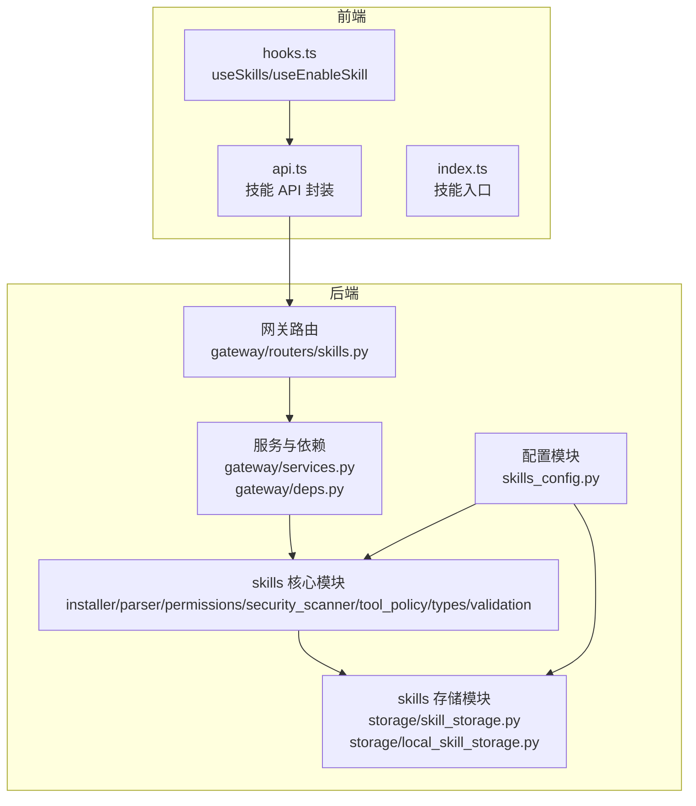
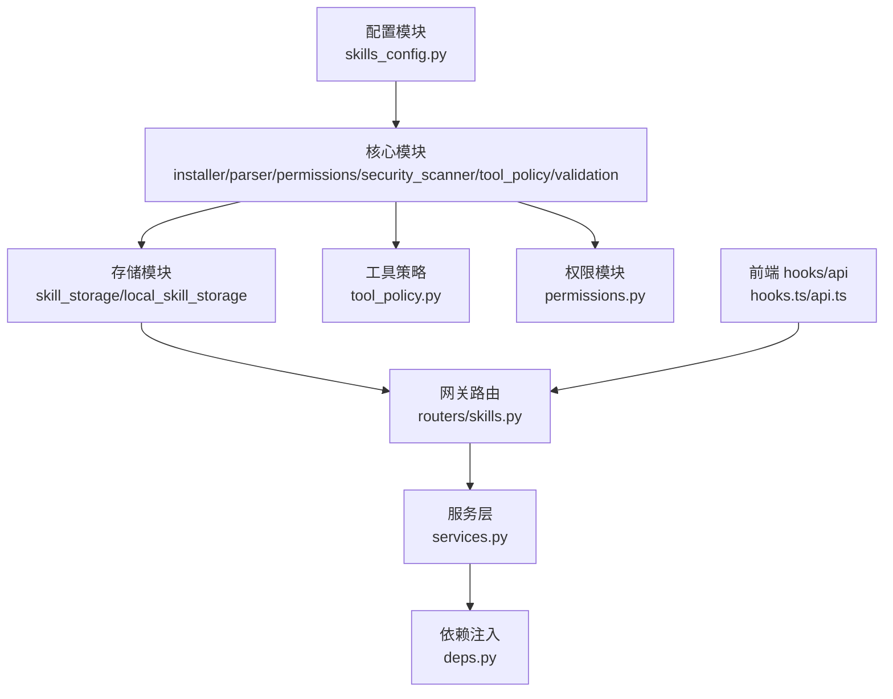
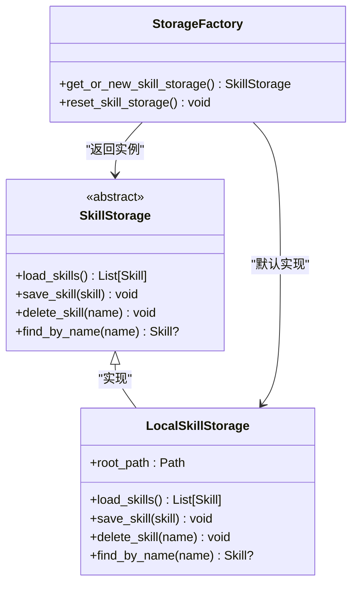
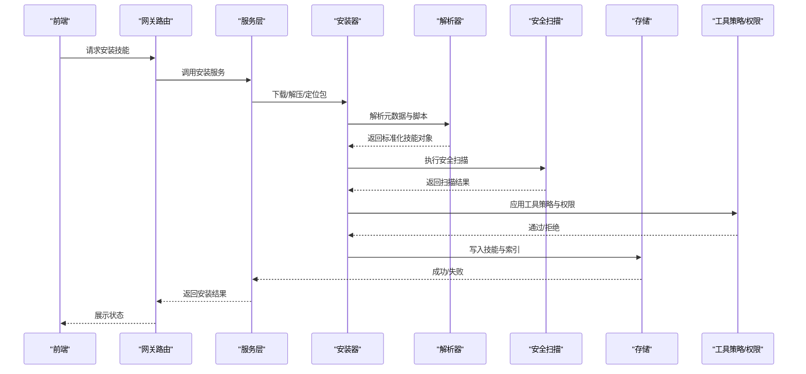
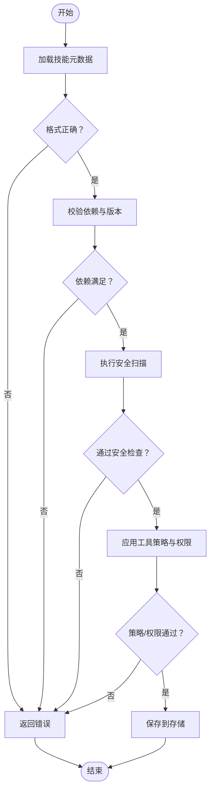
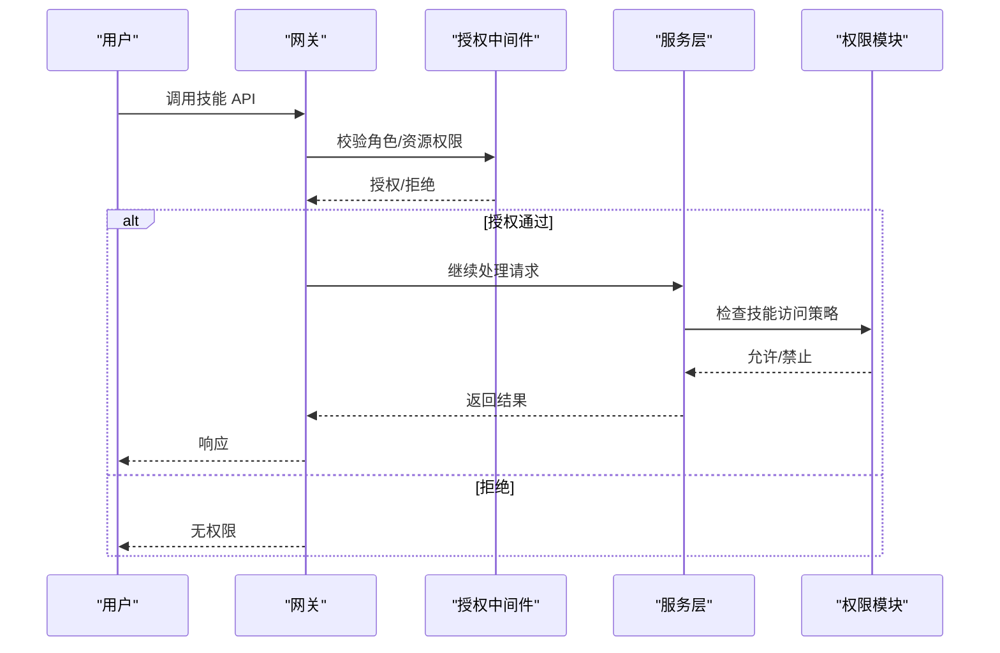
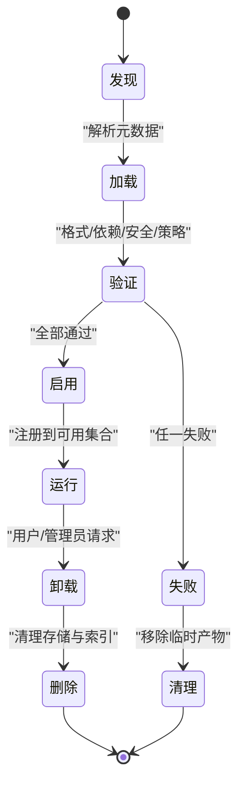
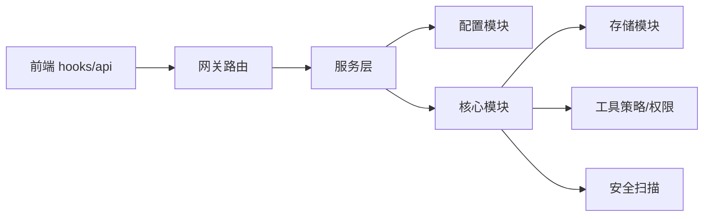

# 技能架构设计

<cite>
**本文引用的文件**
- [backend/packages/harness/deerflow/skills/__init__.py](file://backend/packages/harness/deerflow/skills/__init__.py)
- [backend/packages/harness/deerflow/skills/installer.py](file://backend/packages/harness/deerflow/skills/installer.py)
- [backend/packages/harness/deerflow/skills/parser.py](file://backend/packages/harness/deerflow/skills/parser.py)
- [backend/packages/harness/deerflow/skills/permissions.py](file://backend/packages/harness/deerflow/skills/permissions.py)
- [backend/packages/harness/deerflow/skills/security_scanner.py](file://backend/packages/harness/deerflow/skills/security_scanner.py)
- [backend/packages/harness/deerflow/skills/storage/__init__.py](file://backend/packages/harness/deerflow/skills/storage/__init__.py)
- [backend/packages/harness/deerflow/skills/storage/local_skill_storage.py](file://backend/packages/harness/deerflow/skills/storage/local_skill_storage.py)
- [backend/packages/harness/deerflow/skills/storage/skill_storage.py](file://backend/packages/harness/deerflow/skills/storage/skill_storage.py)
- [backend/packages/harness/deerflow/skills/tool_policy.py](file://backend/packages/harness/deerflow/skills/tool_policy.py)
- [backend/packages/harness/deerflow/skills/types.py](file://backend/packages/harness/deerflow/skills/types.py)
- [backend/packages/harness/deerflow/skills/validation.py](file://backend/packages/harness/deerflow/skills/validation.py)
- [backend/packages/harness/deerflow/config/skills_config.py](file://backend/packages/harness/deerflow/config/skills_config.py)
- [backend/app/gateway/routers/skills.py](file://backend/app/gateway/routers/skills.py)
- [backend/app/gateway/services.py](file://backend/app/gateway/services.py)
- [backend/app/gateway/deps.py](file://backend/app/gateway/deps.py)
- [backend/app/gateway/authz.py](file://backend/app/gateway/authz.py)
- [backend/tests/test_skills_loader.py](file://backend/tests/test_skills_loader.py)
- [backend/tests/test_skills_installer.py](file://backend/tests/test_skills_installer.py)
- [backend/tests/test_skills_parser.py](file://backend/tests/test_skills_parser.py)
- [backend/tests/test_skills_validation.py](file://backend/tests/test_skills_validation.py)
- [backend/tests/test_skills_permissions.py](file://backend/tests/test_skills_permissions.py)
- [backend/tests/test_local_skill_storage_write.py](file://backend/tests/test_local_skill_storage_write.py)
- [frontend/src/core/skills/hooks.ts](file://frontend/src/core/skills/hooks.ts)
- [frontend/src/core/skills/api.ts](file://frontend/src/core/skills/api.ts)
- [frontend/src/core/skills/index.ts](file://frontend/src/core/skills/index.ts)
- [backend/docs/SKILLS.md](file://backend/docs/SKILLS.md)
</cite>

## 目录
1. [引言](#引言)
2. [项目结构](#项目结构)
3. [核心组件](#核心组件)
4. [架构总览](#架构总览)
5. [详细组件分析](#详细组件分析)
6. [依赖关系分析](#依赖关系分析)
7. [性能考虑](#性能考虑)
8. [故障排除指南](#故障排除指南)
9. [结论](#结论)
10. [附录](#附录)

## 引言
本文件面向 DeerFlow 的技能架构设计，系统性阐述技能系统的整体架构与实现细节，覆盖技能加载机制、动态安装系统、权限管理与版本控制策略；深入说明技能存储系统的设计原理（本地技能存储、技能解析器工作机制、技能验证流程）；并给出技能生命周期管理（从发现、加载、验证到卸载）的完整过程。同时，提供可扩展的插件化架构、热加载机制与兼容性保障的设计建议，并配套架构图、序列图与流程图，帮助读者快速理解与落地实施。

## 项目结构
技能子系统位于后端 harness 包中，采用“功能域+分层”的组织方式：skills 子包内含安装器、解析器、权限、安全扫描、工具策略、类型定义与存储等模块；前端通过 hooks 与 API 进行技能查询与启用操作；网关层提供技能路由与服务集成；测试用例覆盖加载、安装、解析、验证与权限等关键路径。

**图表来源**
- [backend/packages/harness/deerflow/skills/__init__.py](file://backend/packages/harness/deerflow/skills/__init__.py)
- [backend/packages/harness/deerflow/skills/storage/__init__.py](file://backend/packages/harness/deerflow/skills/storage/__init__.py)
- [backend/packages/harness/deerflow/config/skills_config.py](file://backend/packages/harness/deerflow/config/skills_config.py)
- [backend/app/gateway/routers/skills.py](file://backend/app/gateway/routers/skills.py)
- [backend/app/gateway/services.py](file://backend/app/gateway/services.py)
- [frontend/src/core/skills/hooks.ts](file://frontend/src/core/skills/hooks.ts)
- [frontend/src/core/skills/api.ts](file://frontend/src/core/skills/api.ts)
- [frontend/src/core/skills/index.ts](file://frontend/src/core/skills/index.ts)

**章节来源**
- [backend/packages/harness/deerflow/skills/__init__.py](file://backend/packages/harness/deerflow/skills/__init__.py)
- [backend/packages/harness/deerflow/skills/storage/__init__.py](file://backend/packages/harness/deerflow/skills/storage/__init__.py)
- [backend/packages/harness/deerflow/config/skills_config.py](file://backend/packages/harness/deerflow/config/skills_config.py)
- [backend/app/gateway/routers/skills.py](file://backend/app/gateway/routers/skills.py)
- [frontend/src/core/skills/hooks.ts](file://frontend/src/core/skills/hooks.ts)

## 核心组件
- 安装器（installer.py）：负责技能包的下载、解压、校验与注册，支持版本选择与冲突处理。
- 解析器（parser.py）：解析技能元数据与脚本定义，生成标准化技能对象。
- 权限模块（permissions.py）：定义技能访问控制策略，结合授权中间件进行权限判定。
- 安全扫描（security_scanner.py）：对技能脚本与依赖进行静态安全检查，阻断高风险内容。
- 工具策略（tool_policy.py）：约束技能内部工具调用范围与行为，确保运行期安全。
- 类型定义（types.py）：统一技能数据模型与枚举，便于跨模块协作。
- 验证模块（validation.py）：执行技能完整性与一致性校验。
- 存储模块（storage/skill_storage.py 与 local_skill_storage.py）：抽象与本地实现，提供技能持久化、检索与更新能力。
- 网关路由（gateway/routers/skills.py）：对外暴露技能 CRUD 与状态变更接口。
- 前端 hooks（frontend/src/core/skills/hooks.ts）：封装技能列表与启用/禁用操作。

**章节来源**
- [backend/packages/harness/deerflow/skills/installer.py](file://backend/packages/harness/deerflow/skills/installer.py)
- [backend/packages/harness/deerflow/skills/parser.py](file://backend/packages/harness/deerflow/skills/parser.py)
- [backend/packages/harness/deerflow/skills/permissions.py](file://backend/packages/harness/deerflow/skills/permissions.py)
- [backend/packages/harness/deerflow/skills/security_scanner.py](file://backend/packages/harness/deerflow/skills/security_scanner.py)
- [backend/packages/harness/deerflow/skills/tool_policy.py](file://backend/packages/harness/deerflow/skills/tool_policy.py)
- [backend/packages/harness/deerflow/skills/types.py](file://backend/packages/harness/deerflow/skills/types.py)
- [backend/packages/harness/deerflow/skills/validation.py](file://backend/packages/harness/deerflow/skills/validation.py)
- [backend/packages/harness/deerflow/skills/storage/skill_storage.py](file://backend/packages/harness/deerflow/skills/storage/skill_storage.py)
- [backend/packages/harness/deerflow/skills/storage/local_skill_storage.py](file://backend/packages/harness/deerflow/skills/storage/local_skill_storage.py)
- [backend/app/gateway/routers/skills.py](file://backend/app/gateway/routers/skills.py)
- [frontend/src/core/skills/hooks.ts](file://frontend/src/core/skills/hooks.ts)

## 架构总览
技能架构采用“配置驱动 + 模块化 + 网关接入”的设计。配置模块提供技能根目录、版本策略与默认启用项；核心模块完成安装、解析、验证与安全扫描；存储模块负责持久化与检索；网关路由提供统一入口；前端通过 hooks 与 API 实现用户交互。

**图表来源**
- [backend/packages/harness/deerflow/config/skills_config.py](file://backend/packages/harness/deerflow/config/skills_config.py)
- [backend/packages/harness/deerflow/skills/installer.py](file://backend/packages/harness/deerflow/skills/installer.py)
- [backend/packages/harness/deerflow/skills/parser.py](file://backend/packages/harness/deerflow/skills/parser.py)
- [backend/packages/harness/deerflow/skills/permissions.py](file://backend/packages/harness/deerflow/skills/permissions.py)
- [backend/packages/harness/deerflow/skills/security_scanner.py](file://backend/packages/harness/deerflow/skills/security_scanner.py)
- [backend/packages/harness/deerflow/skills/tool_policy.py](file://backend/packages/harness/deerflow/skills/tool_policy.py)
- [backend/packages/harness/deerflow/skills/validation.py](file://backend/packages/harness/deerflow/skills/validation.py)
- [backend/packages/harness/deerflow/skills/storage/skill_storage.py](file://backend/packages/harness/deerflow/skills/storage/skill_storage.py)
- [backend/packages/harness/deerflow/skills/storage/local_skill_storage.py](file://backend/packages/harness/deerflow/skills/storage/local_skill_storage.py)
- [backend/app/gateway/routers/skills.py](file://backend/app/gateway/routers/skills.py)
- [backend/app/gateway/services.py](file://backend/app/gateway/services.py)
- [backend/app/gateway/deps.py](file://backend/app/gateway/deps.py)
- [frontend/src/core/skills/hooks.ts](file://frontend/src/core/skills/hooks.ts)
- [frontend/src/core/skills/api.ts](file://frontend/src/core/skills/api.ts)

## 详细组件分析

### 技能存储系统
技能存储系统由抽象基类与本地实现组成，支持单例获取与重置，便于测试与热重载场景。

- 单例工厂：通过全局缓存避免重复初始化，支持在测试或热重载时重置缓存。
- 本地实现：基于文件系统读写技能清单与脚本，提供基础 CRUD 能力。
- 扩展点：可通过替换实现类适配云存储或其他持久化介质。

**图表来源**
- [backend/packages/harness/deerflow/skills/storage/skill_storage.py](file://backend/packages/harness/deerflow/skills/storage/skill_storage.py)
- [backend/packages/harness/deerflow/skills/storage/local_skill_storage.py](file://backend/packages/harness/deerflow/skills/storage/local_skill_storage.py)
- [backend/packages/harness/deerflow/skills/storage/__init__.py](file://backend/packages/harness/deerflow/skills/storage/__init__.py)

**章节来源**
- [backend/packages/harness/deerflow/skills/storage/skill_storage.py](file://backend/packages/harness/deerflow/skills/storage/skill_storage.py)
- [backend/packages/harness/deerflow/skills/storage/local_skill_storage.py](file://backend/packages/harness/deerflow/skills/storage/local_skill_storage.py)
- [backend/packages/harness/deerflow/skills/storage/__init__.py](file://backend/packages/harness/deerflow/skills/storage/__init__.py)

### 技能安装与动态加载
安装器负责从源位置拉取技能包，解析元数据，执行安全扫描与权限校验，最终写入存储并注册到可用技能集合。

- 版本控制：安装器支持指定版本与最新版本策略，冲突时提供回滚与提示。
- 动态注册：安装成功后刷新可用技能集合，前端可即时感知变化。
- 兼容性：解析器与验证模块确保新旧技能格式兼容与一致性。

**图表来源**
- [backend/app/gateway/routers/skills.py](file://backend/app/gateway/routers/skills.py)
- [backend/app/gateway/services.py](file://backend/app/gateway/services.py)
- [backend/packages/harness/deerflow/skills/installer.py](file://backend/packages/harness/deerflow/skills/installer.py)
- [backend/packages/harness/deerflow/skills/parser.py](file://backend/packages/harness/deerflow/skills/parser.py)
- [backend/packages/harness/deerflow/skills/security_scanner.py](file://backend/packages/harness/deerflow/skills/security_scanner.py)
- [backend/packages/harness/deerflow/skills/tool_policy.py](file://backend/packages/harness/deerflow/skills/tool_policy.py)
- [backend/packages/harness/deerflow/skills/permissions.py](file://backend/packages/harness/deerflow/skills/permissions.py)
- [backend/packages/harness/deerflow/skills/storage/local_skill_storage.py](file://backend/packages/harness/deerflow/skills/storage/local_skill_storage.py)

**章节来源**
- [backend/packages/harness/deerflow/skills/installer.py](file://backend/packages/harness/deerflow/skills/installer.py)
- [backend/packages/harness/deerflow/skills/parser.py](file://backend/packages/harness/deerflow/skills/parser.py)
- [backend/packages/harness/deerflow/skills/security_scanner.py](file://backend/packages/harness/deerflow/skills/security_scanner.py)
- [backend/packages/harness/deerflow/skills/tool_policy.py](file://backend/packages/harness/deerflow/skills/tool_policy.py)
- [backend/packages/harness/deerflow/skills/permissions.py](file://backend/packages/harness/deerflow/skills/permissions.py)
- [backend/app/gateway/routers/skills.py](file://backend/app/gateway/routers/skills.py)
- [backend/app/gateway/services.py](file://backend/app/gateway/services.py)

### 技能验证流程
验证模块贯穿安装前后，确保技能完整性、依赖一致性与合规性。

- 失败即停：任一环节失败均终止安装流程，避免污染系统。
- 可观测：每个步骤输出明确的错误码与原因，便于诊断。

**图表来源**
- [backend/packages/harness/deerflow/skills/validation.py](file://backend/packages/harness/deerflow/skills/validation.py)
- [backend/packages/harness/deerflow/skills/security_scanner.py](file://backend/packages/harness/deerflow/skills/security_scanner.py)
- [backend/packages/harness/deerflow/skills/tool_policy.py](file://backend/packages/harness/deerflow/skills/tool_policy.py)
- [backend/packages/harness/deerflow/skills/permissions.py](file://backend/packages/harness/deerflow/skills/permissions.py)
- [backend/packages/harness/deerflow/skills/storage/local_skill_storage.py](file://backend/packages/harness/deerflow/skills/storage/local_skill_storage.py)

**章节来源**
- [backend/packages/harness/deerflow/skills/validation.py](file://backend/packages/harness/deerflow/skills/validation.py)
- [backend/packages/harness/deerflow/skills/security_scanner.py](file://backend/packages/harness/deerflow/skills/security_scanner.py)
- [backend/packages/harness/deerflow/skills/tool_policy.py](file://backend/packages/harness/deerflow/skills/tool_policy.py)
- [backend/packages/harness/deerflow/skills/permissions.py](file://backend/packages/harness/deerflow/skills/permissions.py)

### 权限管理设计
权限模块与授权中间件协同工作，确保技能仅在授权范围内被调用。

- 角色绑定：权限策略与用户角色/资源绑定，支持细粒度控制。
- 中间件拦截：在服务层之前统一拦截，降低漏检风险。
- 策略可配置：通过配置文件与运行时策略调整权限边界。

**图表来源**
- [backend/app/gateway/authz.py](file://backend/app/gateway/authz.py)
- [backend/app/gateway/services.py](file://backend/app/gateway/services.py)
- [backend/packages/harness/deerflow/skills/permissions.py](file://backend/packages/harness/deerflow/skills/permissions.py)

**章节来源**
- [backend/app/gateway/authz.py](file://backend/app/gateway/authz.py)
- [backend/app/gateway/services.py](file://backend/app/gateway/services.py)
- [backend/packages/harness/deerflow/skills/permissions.py](file://backend/packages/harness/deerflow/skills/permissions.py)

### 版本控制策略
版本控制贯穿安装与运行期，确保兼容性与可回溯性。

- 安装阶段：支持固定版本与“最新稳定”两种模式；冲突时保留历史版本并提示回滚。
- 运行阶段：优先使用已安装且通过验证的版本；不兼容时降级至最近一次成功版本。
- 元数据记录：安装器在存储中记录版本号、摘要与时间戳，便于审计与追踪。

**章节来源**
- [backend/packages/harness/deerflow/skills/installer.py](file://backend/packages/harness/deerflow/skills/installer.py)
- [backend/packages/harness/deerflow/skills/storage/local_skill_storage.py](file://backend/packages/harness/deerflow/skills/storage/local_skill_storage.py)

### 技能生命周期管理
从发现、加载、验证到卸载的完整生命周期如下：

- 自动发现：启动时扫描存储根目录，自动加载已安装技能。
- 在线变更：前端启用/禁用触发服务层更新可用集合，无需重启。
- 热重载：存储工厂支持重置缓存，配合测试与开发环境热更新。

**图表来源**
- [backend/packages/harness/deerflow/skills/storage/__init__.py](file://backend/packages/harness/deerflow/skills/storage/__init__.py)
- [backend/app/gateway/routers/skills.py](file://backend/app/gateway/routers/skills.py)
- [frontend/src/core/skills/hooks.ts](file://frontend/src/core/skills/hooks.ts)

**章节来源**
- [backend/packages/harness/deerflow/skills/storage/__init__.py](file://backend/packages/harness/deerflow/skills/storage/__init__.py)
- [backend/app/gateway/routers/skills.py](file://backend/app/gateway/routers/skills.py)
- [frontend/src/core/skills/hooks.ts](file://frontend/src/core/skills/hooks.ts)

### 插件化架构与热加载
- 插件化：安装器与解析器通过统一接口扩展，新增解析规则或安装源只需实现对应协议。
- 热加载：存储工厂提供重置函数，测试与运维可在不重启进程的情况下刷新技能集合。
- 兼容性：类型定义与验证模块确保新旧版本共存期间的数据一致性。

**章节来源**
- [backend/packages/harness/deerflow/skills/types.py](file://backend/packages/harness/deerflow/skills/types.py)
- [backend/packages/harness/deerflow/skills/validation.py](file://backend/packages/harness/deerflow/skills/validation.py)
- [backend/packages/harness/deerflow/skills/storage/__init__.py](file://backend/packages/harness/deerflow/skills/storage/__init__.py)

## 依赖关系分析
技能模块与配置、网关、服务层存在直接依赖；存储模块与配置模块耦合以决定实现类型；前端通过 hooks 与 API 间接依赖网关路由。

**图表来源**
- [backend/packages/harness/deerflow/config/skills_config.py](file://backend/packages/harness/deerflow/config/skills_config.py)
- [backend/app/gateway/routers/skills.py](file://backend/app/gateway/routers/skills.py)
- [backend/app/gateway/services.py](file://backend/app/gateway/services.py)
- [backend/packages/harness/deerflow/skills/installer.py](file://backend/packages/harness/deerflow/skills/installer.py)
- [backend/packages/harness/deerflow/skills/parser.py](file://backend/packages/harness/deerflow/skills/parser.py)
- [backend/packages/harness/deerflow/skills/security_scanner.py](file://backend/packages/harness/deerflow/skills/security_scanner.py)
- [backend/packages/harness/deerflow/skills/tool_policy.py](file://backend/packages/harness/deerflow/skills/tool_policy.py)
- [backend/packages/harness/deerflow/skills/permissions.py](file://backend/packages/harness/deerflow/skills/permissions.py)
- [backend/packages/harness/deerflow/skills/storage/skill_storage.py](file://backend/packages/harness/deerflow/skills/storage/skill_storage.py)

**章节来源**
- [backend/packages/harness/deerflow/config/skills_config.py](file://backend/packages/harness/deerflow/config/skills_config.py)
- [backend/app/gateway/routers/skills.py](file://backend/app/gateway/routers/skills.py)
- [backend/app/gateway/services.py](file://backend/app/gateway/services.py)
- [backend/packages/harness/deerflow/skills/installer.py](file://backend/packages/harness/deerflow/skills/installer.py)
- [backend/packages/harness/deerflow/skills/parser.py](file://backend/packages/harness/deerflow/skills/parser.py)
- [backend/packages/harness/deerflow/skills/security_scanner.py](file://backend/packages/harness/deerflow/skills/security_scanner.py)
- [backend/packages/harness/deerflow/skills/tool_policy.py](file://backend/packages/harness/deerflow/skills/tool_policy.py)
- [backend/packages/harness/deerflow/skills/permissions.py](file://backend/packages/harness/deerflow/skills/permissions.py)
- [backend/packages/harness/deerflow/skills/storage/skill_storage.py](file://backend/packages/harness/deerflow/skills/storage/skill_storage.py)

## 性能考虑
- 缓存与懒加载：前端 hooks 使用查询缓存；后端提示器对技能签名进行缓存，减少重复解析开销。
- 并发控制：安装与扫描阶段避免阻塞主线程，必要时引入队列与异步任务。
- 存储优化：本地存储按需读取脚本内容，避免一次性加载大体积技能包。
- 热重载友好：存储工厂重置与单例缓存设计，支持在不中断服务的情况下刷新技能集合。

**章节来源**
- [backend/packages/harness/deerflow/agents/lead_agent/prompt.py](file://backend/packages/harness/deerflow/agents/lead_agent/prompt.py)
- [backend/packages/harness/deerflow/skills/storage/__init__.py](file://backend/packages/harness/deerflow/skills/storage/__init__.py)

## 故障排除指南
- 安装失败：检查网络连通性、目标路径权限与磁盘空间；查看安装器日志中的具体错误码。
- 解析错误：确认 SKILL.md 与脚本命名符合规范；使用解析器单元测试定位问题。
- 验证失败：关注安全扫描与工具策略的告警；根据错误信息修正脚本或策略配置。
- 权限不足：核对用户角色与资源绑定；检查授权中间件是否生效。
- 热重载无效：调用存储工厂重置函数并刷新前端缓存；确认配置未被强制缓存。

**章节来源**
- [backend/tests/test_skills_loader.py](file://backend/tests/test_skills_loader.py)
- [backend/tests/test_skills_installer.py](file://backend/tests/test_skills_installer.py)
- [backend/tests/test_skills_parser.py](file://backend/tests/test_skills_parser.py)
- [backend/tests/test_skills_validation.py](file://backend/tests/test_skills_validation.py)
- [backend/tests/test_skills_permissions.py](file://backend/tests/test_skills_permissions.py)
- [backend/tests/test_local_skill_storage_write.py](file://backend/tests/test_local_skill_storage_write.py)

## 结论
DeerFlow 技能架构以配置驱动为核心，围绕安装器、解析器、验证与存储构建了完整的闭环；通过权限与安全扫描保障运行期安全；借助单例存储工厂与前端 hooks 实现热加载与可观测性。该设计具备良好的扩展性与兼容性，适合在多版本、多来源的技能生态中演进。

## 附录
- 最佳实践
  - 保持 SKILL.md 与脚本命名规范一致，减少解析成本。
  - 对高风险脚本启用严格的安全扫描与工具策略。
  - 使用版本固定策略在生产环境，避免意外升级。
  - 在开发环境启用热重载与缓存重置，提升迭代效率。
- 相关文档
  - [backend/docs/SKILLS.md](file://backend/docs/SKILLS.md)