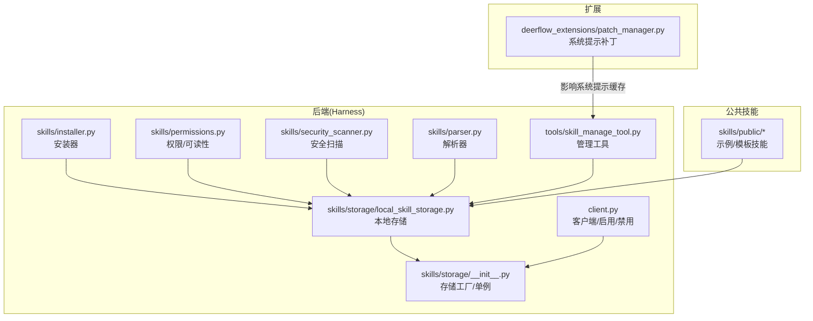
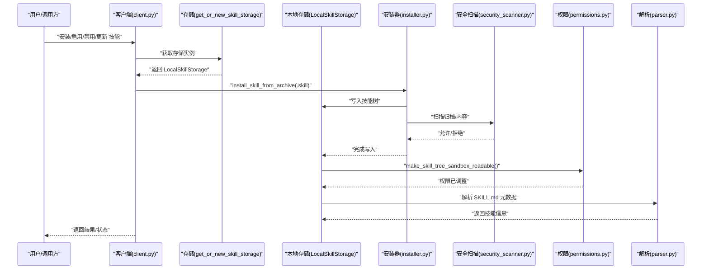
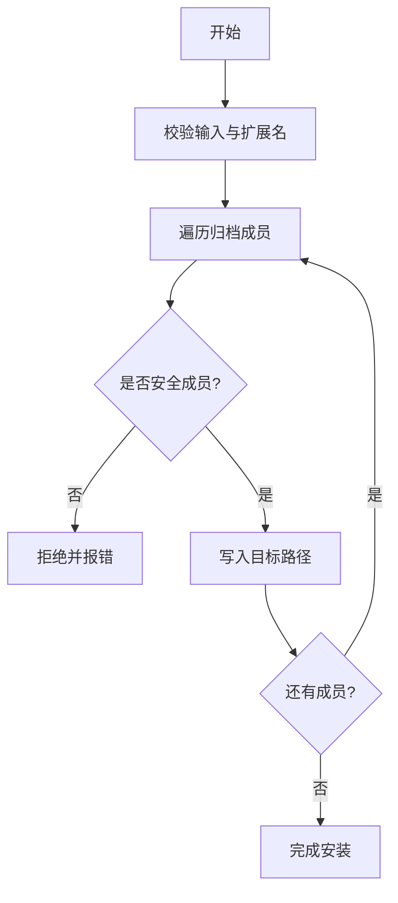
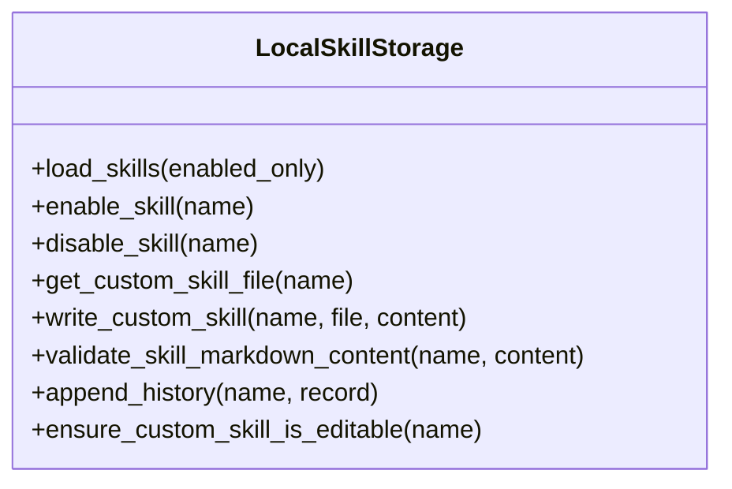
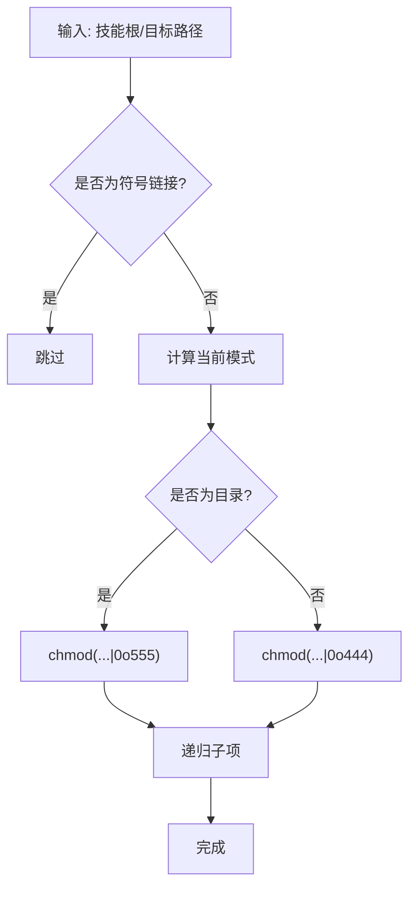
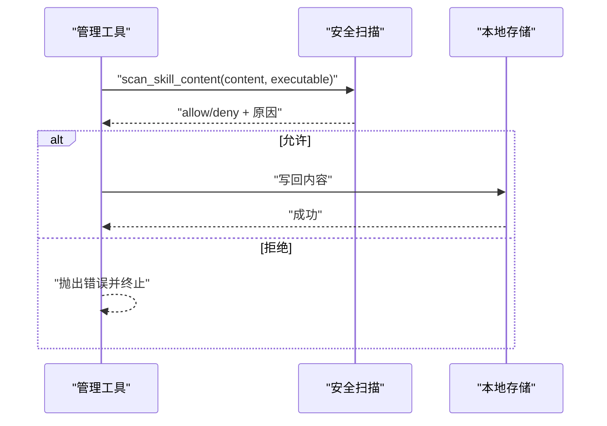
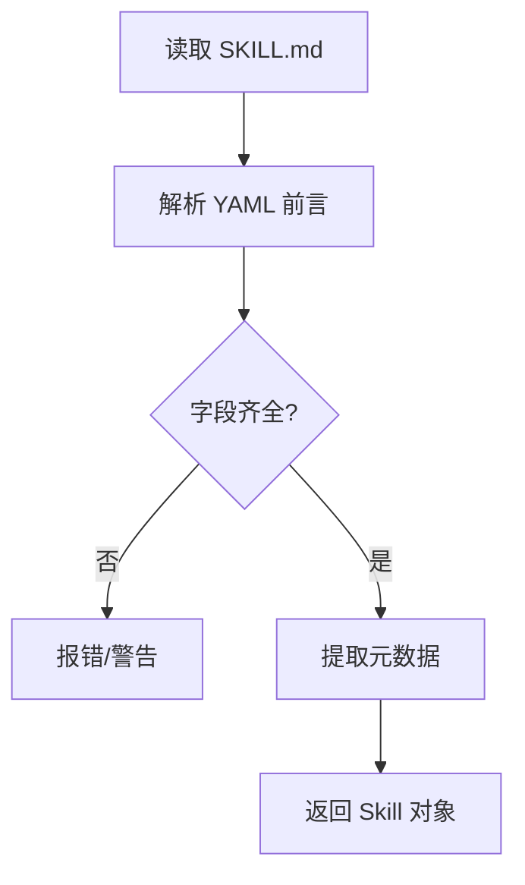
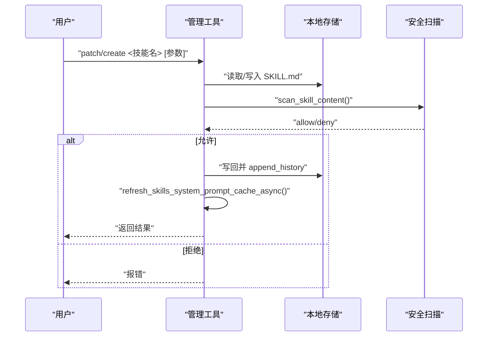
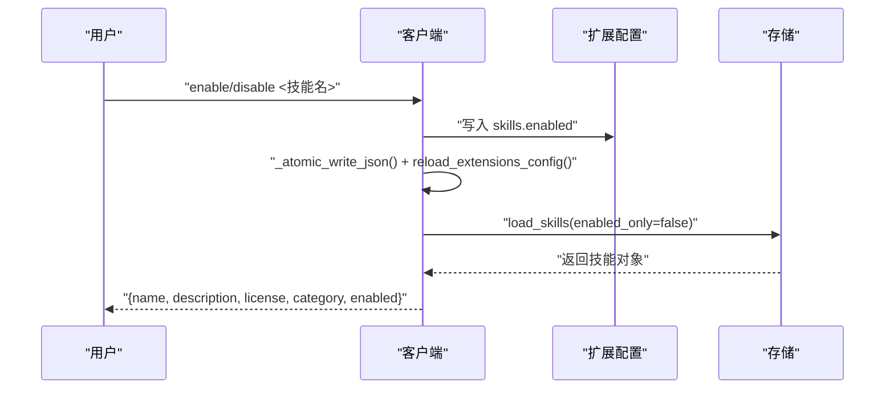
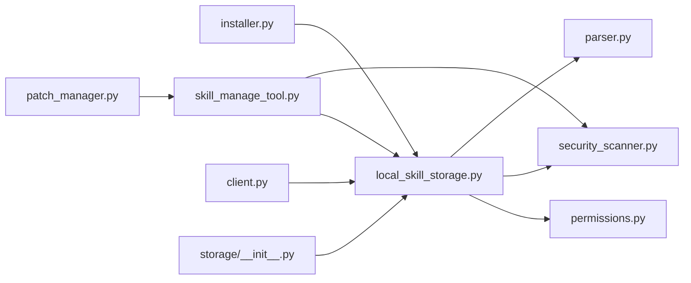

# 技能管理与维护

<cite>
**本文引用的文件**
- [backend/packages/harness/deerflow/skills/installer.py](file://backend/packages/harness/deerflow/skills/installer.py)
- [backend/packages/harness/deerflow/skills/storage/local_skill_storage.py](file://backend/packages/harness/deerflow/skills/storage/local_skill_storage.py)
- [backend/packages/harness/deerflow/skills/storage/__init__.py](file://backend/packages/harness/deerflow/skills/storage/__init__.py)
- [backend/packages/harness/deerflow/skills/permissions.py](file://backend/packages/harness/deerflow/skills/permissions.py)
- [backend/packages/harness/deerflow/skills/security_scanner.py](file://backend/packages/harness/deerflow/skills/security_scanner.py)
- [backend/packages/harness/deerflow/skills/parser.py](file://backend/packages/harness/deerflow/skills/parser.py)
- [backend/packages/harness/deerflow/tools/skill_manage_tool.py](file://backend/packages/harness/deerflow/tools/skill_manage_tool.py)
- [backend/packages/harness/deerflow/client.py](file://backend/packages/harness/deerflow/client.py)
- [backend/tests/test_skills_installer.py](file://backend/tests/test_skills_installer.py)
- [backend/tests/test_skills_loader.py](file://backend/tests/test_skills_loader.py)
- [backend/tests/test_skills_validation.py](file://backend/tests/test_skills_validation.py)
- [backend/tests/test_skill_permissions.py](file://backend/tests/test_skill_permissions.py)
- [backend/tests/test_skill_manage_tool.py](file://backend/tests/test_skill_manage_tool.py)
- [skills/public/skill-creator/scripts/quick_validate.py](file://skills/public/skill-creator/scripts/quick_validate.py)
- [deerflow_extensions/patch_manager.py](file://deerflow_extensions/patch_manager.py)
</cite>

## 目录
1. [简介](#简介)
2. [项目结构](#项目结构)
3. [核心组件](#核心组件)
4. [架构总览](#架构总览)
5. [详细组件分析](#详细组件分析)
6. [依赖关系分析](#依赖关系分析)
7. [性能考量](#性能考量)
8. [故障排除指南](#故障排除指南)
9. [结论](#结论)
10. [附录](#附录)

## 简介
本指南面向 DeerFlow 的技能（Skill）生命周期管理与维护，覆盖安装、卸载、更新与版本管理；权限控制与访问安全；本地与远程存储及缓存策略；技能验证与质量控制；以及维护最佳实践与常见问题排查。内容基于仓库中实际实现与测试用例进行梳理，帮助技术与非技术读者高效上手并安全运维。

## 项目结构
技能相关能力主要分布在后端 Harness 包的 skills 子模块，并通过工具与客户端接口对外提供能力；公共技能模板位于 skills/public；扩展层包含对系统提示注入的补丁管理器。

图示来源
- [backend/packages/harness/deerflow/skills/installer.py](file://backend/packages/harness/deerflow/skills/installer.py)
- [backend/packages/harness/deerflow/skills/storage/local_skill_storage.py](file://backend/packages/harness/deerflow/skills/storage/local_skill_storage.py)
- [backend/packages/harness/deerflow/skills/storage/__init__.py](file://backend/packages/harness/deerflow/skills/storage/__init__.py)
- [backend/packages/harness/deerflow/skills/permissions.py](file://backend/packages/harness/deerflow/skills/permissions.py)
- [backend/packages/harness/deerflow/skills/security_scanner.py](file://backend/packages/harness/deerflow/skills/security_scanner.py)
- [backend/packages/harness/deerflow/skills/parser.py](file://backend/packages/harness/deerflow/skills/parser.py)
- [backend/packages/harness/deerflow/tools/skill_manage_tool.py](file://backend/packages/harness/deerflow/tools/skill_manage_tool.py)
- [backend/packages/harness/deerflow/client.py](file://backend/packages/harness/deerflow/client.py)
- [deerflow_extensions/patch_manager.py](file://deerflow_extensions/patch_manager.py)

章节来源
- [backend/packages/harness/deerflow/skills/installer.py](file://backend/packages/harness/deerflow/skills/installer.py)
- [backend/packages/harness/deerflow/skills/storage/local_skill_storage.py](file://backend/packages/harness/deerflow/skills/storage/local_skill_storage.py)
- [backend/packages/harness/deerflow/skills/storage/__init__.py](file://backend/packages/harness/deerflow/skills/storage/__init__.py)
- [backend/packages/harness/deerflow/skills/permissions.py](file://backend/packages/harness/deerflow/skills/permissions.py)
- [backend/packages/harness/deerflow/skills/security_scanner.py](file://backend/packages/harness/deerflow/skills/security_scanner.py)
- [backend/packages/harness/deerflow/skills/parser.py](file://backend/packages/harness/deerflow/skills/parser.py)
- [backend/packages/harness/deerflow/tools/skill_manage_tool.py](file://backend/packages/harness/deerflow/tools/skill_manage_tool.py)
- [backend/packages/harness/deerflow/client.py](file://backend/packages/harness/deerflow/client.py)
- [deerflow_extensions/patch_manager.py](file://deerflow_extensions/patch_manager.py)

## 核心组件
- 安装器：负责从 .skill 归档安全解包、校验与写入目标目录，确保路径穿越与符号链接等安全风险受控。
- 本地存储：提供技能树加载、启用/禁用、历史记录与可写路径的可读性调整。
- 权限与可读性：将已安装技能树设置为沙箱只读，避免运行时被意外修改。
- 安全扫描：在写入或变更前执行内容扫描，拒绝高风险内容。
- 解析器：解析 SKILL.md 前言元数据与正文，提取技能描述、许可、分类等信息。
- 管理工具：支持创建、补丁式修改自定义技能，内置校验与历史记录。
- 客户端：提供启用/禁用技能的 API，写回扩展配置并触发重载。
- 公共技能：提供示例与模板，便于快速生成符合规范的新技能。
- 补丁管理：对系统提示中的技能段落注入不可变约束，保障提示稳定性。

章节来源
- [backend/packages/harness/deerflow/skills/installer.py](file://backend/packages/harness/deerflow/skills/installer.py)
- [backend/packages/harness/deerflow/skills/storage/local_skill_storage.py](file://backend/packages/harness/deerflow/skills/storage/local_skill_storage.py)
- [backend/packages/harness/deerflow/skills/storage/__init__.py](file://backend/packages/harness/deerflow/skills/storage/__init__.py)
- [backend/packages/harness/deerflow/skills/permissions.py](file://backend/packages/harness/deerflow/skills/permissions.py)
- [backend/packages/harness/deerflow/skills/security_scanner.py](file://backend/packages/harness/deerflow/skills/security_scanner.py)
- [backend/packages/harness/deerflow/skills/parser.py](file://backend/packages/harness/deerflow/skills/parser.py)
- [backend/packages/harness/deerflow/tools/skill_manage_tool.py](file://backend/packages/harness/deerflow/tools/skill_manage_tool.py)
- [backend/packages/harness/deerflow/client.py](file://backend/packages/harness/deerflow/client.py)
- [skills/public/skill-creator/scripts/quick_validate.py](file://skills/public/skill-creator/scripts/quick_validate.py)
- [deerflow_extensions/patch_manager.py](file://deerflow_extensions/patch_manager.py)

## 架构总览
下图展示技能从归档到运行期的完整路径：安装器将 .skill 写入本地存储，权限模块将其调整为沙箱只读，解析器读取元数据，管理工具支持编辑与校验，客户端可启用/禁用并刷新缓存，安全扫描贯穿关键写入点。

图示来源
- [backend/packages/harness/deerflow/client.py](file://backend/packages/harness/deerflow/client.py)
- [backend/packages/harness/deerflow/skills/storage/__init__.py](file://backend/packages/harness/deerflow/skills/storage/__init__.py)
- [backend/packages/harness/deerflow/skills/storage/local_skill_storage.py](file://backend/packages/harness/deerflow/skills/storage/local_skill_storage.py)
- [backend/packages/harness/deerflow/skills/installer.py](file://backend/packages/harness/deerflow/skills/installer.py)
- [backend/packages/harness/deerflow/skills/security_scanner.py](file://backend/packages/harness/deerflow/skills/security_scanner.py)
- [backend/packages/harness/deerflow/skills/permissions.py](file://backend/packages/harness/deerflow/skills/permissions.py)
- [backend/packages/harness/deerflow/skills/parser.py](file://backend/packages/harness/deerflow/skills/parser.py)

## 详细组件分析

### 安装器（installer.py）
职责
- 安全解包 .skill 归档，执行成员级与解析后路径双重校验，防止绝对路径与目录穿越。
- 过滤 macOS 特有元数据与隐藏文件，自动进入单层目录以适配不同打包习惯。
- 将已存在同名技能抛出专用异常，避免覆盖风险。
- 支持流式写入与大小限制，降低内存占用与资源风险。

关键流程
- 归档入口校验与扩展名判断
- 成员遍历与路径合法性检查
- 符号链接检测与忽略
- 目标目录解析与写入
- 失败回滚与错误传播

图示来源
- [backend/packages/harness/deerflow/skills/installer.py](file://backend/packages/harness/deerflow/skills/installer.py)

章节来源
- [backend/packages/harness/deerflow/skills/installer.py](file://backend/packages/harness/deerflow/skills/installer.py)
- [backend/tests/test_skills_installer.py](file://backend/tests/test_skills_installer.py)

### 本地存储（storage/local_skill_storage.py）
职责
- 提供技能树加载、启用/禁用、历史记录与可写路径的可读性调整。
- 维护技能清单与元数据缓存，支持按需刷新。
- 对自定义技能提供可编辑能力与写回保护。

关键流程
- 加载技能树（含缓存与并发刷新控制）
- 启用/禁用技能（写回配置并触发重载）
- 可写路径权限调整（沙箱只读）
- 历史记录与变更审计

图示来源
- [backend/packages/harness/deerflow/skills/storage/local_skill_storage.py](file://backend/packages/harness/deerflow/skills/storage/local_skill_storage.py)

章节来源
- [backend/packages/harness/deerflow/skills/storage/local_skill_storage.py](file://backend/packages/harness/deerflow/skills/storage/local_skill_storage.py)
- [backend/tests/test_skills_loader.py](file://backend/tests/test_skills_loader.py)

### 权限与可读性（permissions.py）
职责
- 将技能树路径设置为沙箱只读，移除组与其它用户的写权限。
- 递归处理目录与文件，保证子树一致的最小权限原则。
- 在写入路径场景中，仅调整根至目标路径的必要节点权限。

图示来源
- [backend/packages/harness/deerflow/skills/permissions.py](file://backend/packages/harness/deerflow/skills/permissions.py)

章节来源
- [backend/packages/harness/deerflow/skills/permissions.py](file://backend/packages/harness/deerflow/skills/permissions.py)
- [backend/tests/test_skill_permissions.py](file://backend/tests/test_skill_permissions.py)

### 安全扫描（security_scanner.py）
职责
- 在写入或变更前对内容进行扫描，拒绝高风险模式或不合规片段。
- 支持可选的可执行标记扫描，避免注入可执行代码。
- 与管理工具协同，确保变更前后均满足安全基线。

图示来源
- [backend/packages/harness/deerflow/skills/security_scanner.py](file://backend/packages/harness/deerflow/skills/security_scanner.py)
- [backend/packages/harness/deerflow/tools/skill_manage_tool.py](file://backend/packages/harness/deerflow/tools/skill_manage_tool.py)

章节来源
- [backend/packages/harness/deerflow/skills/security_scanner.py](file://backend/packages/harness/deerflow/skills/security_scanner.py)
- [backend/packages/harness/deerflow/tools/skill_manage_tool.py](file://backend/packages/harness/deerflow/tools/skill_manage_tool.py)

### 解析器（parser.py）
职责
- 解析 SKILL.md 的 YAML 前言与正文，提取名称、描述、许可、兼容性、分类等元数据。
- 为技能列表与系统提示提供结构化信息。

图示来源
- [backend/packages/harness/deerflow/skills/parser.py](file://backend/packages/harness/deerflow/skills/parser.py)

章节来源
- [backend/packages/harness/deerflow/skills/parser.py](file://backend/packages/harness/deerflow/skills/parser.py)

### 管理工具（tools/skill_manage_tool.py）
职责
- 创建新技能：写入 SKILL.md 并进行安全扫描与校验。
- 补丁式修改：在自定义技能中进行查找替换，支持期望出现次数校验。
- 历史记录：记录每次变更，便于审计与回溯。
- 系统提示缓存刷新：变更后刷新系统提示缓存，确保生效。

图示来源
- [backend/packages/harness/deerflow/tools/skill_manage_tool.py](file://backend/packages/harness/deerflow/tools/skill_manage_tool.py)
- [backend/packages/harness/deerflow/skills/security_scanner.py](file://backend/packages/harness/deerflow/skills/security_scanner.py)
- [backend/packages/harness/deerflow/skills/storage/local_skill_storage.py](file://backend/packages/harness/deerflow/skills/storage/local_skill_storage.py)

章节来源
- [backend/packages/harness/deerflow/tools/skill_manage_tool.py](file://backend/packages/harness/deerflow/tools/skill_manage_tool.py)
- [backend/tests/test_skill_manage_tool.py](file://backend/tests/test_skill_manage_tool.py)

### 客户端（client.py）
职责
- 提供启用/禁用技能的 API，写回扩展配置并触发重载。
- 返回技能最新状态（名称、描述、许可、分类、启用状态）。

图示来源
- [backend/packages/harness/deerflow/client.py](file://backend/packages/harness/deerflow/client.py)
- [backend/packages/harness/deerflow/skills/storage/__init__.py](file://backend/packages/harness/deerflow/skills/storage/__init__.py)

章节来源
- [backend/packages/harness/deerflow/client.py](file://backend/packages/harness/deerflow/client.py)

### 公共技能与验证（skills/public/skill-creator/scripts/quick_validate.py）
职责
- 快速校验技能目录的元数据字段与长度限制，辅助开发者在提交前发现问题。
- 作为模板技能的参考，确保新技能遵循统一规范。

章节来源
- [skills/public/skill-creator/scripts/quick_validate.py](file://skills/public/skill-creator/scripts/quick_validate.py)

### 补丁管理（deerflow_extensions/patch_manager.py）
职责
- 对系统提示中的技能段落注入不可变约束，避免外部修改影响系统提示稳定性。
- 通过缓存与定位策略，确保注入位置正确且仅一次。

章节来源
- [deerflow_extensions/patch_manager.py](file://deerflow_extensions/patch_manager.py)

## 依赖关系分析
- 存储工厂与单例：通过工厂函数创建/复用存储实例，避免重复初始化。
- 安装器依赖存储写入与安全扫描；权限模块依赖存储提供的路径集合。
- 管理工具依赖存储与安全扫描，同时依赖系统提示缓存刷新。
- 客户端依赖存储加载能力与扩展配置写回。

图示来源
- [backend/packages/harness/deerflow/skills/installer.py](file://backend/packages/harness/deerflow/skills/installer.py)
- [backend/packages/harness/deerflow/skills/storage/local_skill_storage.py](file://backend/packages/harness/deerflow/skills/storage/local_skill_storage.py)
- [backend/packages/harness/deerflow/skills/storage/__init__.py](file://backend/packages/harness/deerflow/skills/storage/__init__.py)
- [backend/packages/harness/deerflow/skills/permissions.py](file://backend/packages/harness/deerflow/skills/permissions.py)
- [backend/packages/harness/deerflow/skills/security_scanner.py](file://backend/packages/harness/deerflow/skills/security_scanner.py)
- [backend/packages/harness/deerflow/skills/parser.py](file://backend/packages/harness/deerflow/skills/parser.py)
- [backend/packages/harness/deerflow/tools/skill_manage_tool.py](file://backend/packages/harness/deerflow/tools/skill_manage_tool.py)
- [backend/packages/harness/deerflow/client.py](file://backend/packages/harness/deerflow/client.py)
- [deerflow_extensions/patch_manager.py](file://deerflow_extensions/patch_manager.py)

章节来源
- [backend/packages/harness/deerflow/skills/storage/__init__.py](file://backend/packages/harness/deerflow/skills/storage/__init__.py)
- [backend/packages/harness/deerflow/skills/storage/local_skill_storage.py](file://backend/packages/harness/deerflow/skills/storage/local_skill_storage.py)
- [backend/packages/harness/deerflow/skills/installer.py](file://backend/packages/harness/deerflow/skills/installer.py)
- [backend/packages/harness/deerflow/skills/security_scanner.py](file://backend/packages/harness/deerflow/skills/security_scanner.py)
- [backend/packages/harness/deerflow/skills/permissions.py](file://backend/packages/harness/deerflow/skills/permissions.py)
- [backend/packages/harness/deerflow/skills/parser.py](file://backend/packages/harness/deerflow/skills/parser.py)
- [backend/packages/harness/deerflow/tools/skill_manage_tool.py](file://backend/packages/harness/deerflow/tools/skill_manage_tool.py)
- [backend/packages/harness/deerflow/client.py](file://backend/packages/harness/deerflow/client.py)
- [deerflow_extensions/patch_manager.py](file://deerflow_extensions/patch_manager.py)

## 性能考量
- 流式解包与大小限制：安装器采用流式写入与累计真实字节，避免内存峰值与超大归档风险。
- 缓存与并发：存储层对技能加载进行缓存，并限制并发刷新，避免抖动。
- 权限批量调整：权限模块递归处理，尽量减少多次系统调用。
- 扫描前置：在写入前执行扫描，失败早返回，避免无效写入。

## 故障排除指南
- 安装失败（路径穿越/符号链接）
  - 现象：安装时报错拒绝或未生成技能目录。
  - 排查：确认 .skill 是否包含绝对路径或 .. 成员；检查是否包含符号链接。
  - 处置：重新打包并过滤 macOS 元数据与隐藏文件；使用官方安装器。
  - 参考
    - [backend/tests/test_skills_installer.py](file://backend/tests/test_skills_installer.py)
    - [backend/packages/harness/deerflow/skills/installer.py](file://backend/packages/harness/deerflow/skills/installer.py)

- 权限不足导致沙箱无法读取
  - 现象：沙箱运行时报找不到技能文件或权限错误。
  - 排查：确认技能树已被设置为 0o555（目录）与 0o444（文件）。
  - 处置：重新执行权限调整；检查是否有符号链接被跳过。
  - 参考
    - [backend/tests/test_skill_permissions.py](file://backend/tests/test_skill_permissions.py)
    - [backend/packages/harness/deerflow/skills/permissions.py](file://backend/packages/harness/deerflow/skills/permissions.py)

- 自定义技能补丁失败
  - 现象：补丁找不到目标或替换次数不符。
  - 排查：确认目标技能为自定义技能；检查查找字符串是否存在；核对期望出现次数。
  - 处置：修正查找/替换内容；调整期望计数；确保内容通过安全扫描。
  - 参考
    - [backend/tests/test_skill_manage_tool.py](file://backend/tests/test_skill_manage_tool.py)
    - [backend/packages/harness/deerflow/tools/skill_manage_tool.py](file://backend/packages/harness/deerflow/tools/skill_manage_tool.py)

- 启用/禁用后系统提示未更新
  - 现象：技能启停后提示未变化。
  - 排查：确认客户端写回扩展配置并触发了重载；检查系统提示缓存刷新逻辑。
  - 处置：手动触发缓存刷新；检查补丁管理器是否正确注入。
  - 参考
    - [backend/packages/harness/deerflow/client.py](file://backend/packages/harness/deerflow/client.py)
    - [deerflow_extensions/patch_manager.py](file://deerflow_extensions/patch_manager.py)

- 公共技能验证失败
  - 现象：quick_validate 报告字段类型或长度问题。
  - 排查：对照元数据字段要求，检查类型与长度限制。
  - 处置：修正 SKILL.md 前言字段；重新验证。
  - 参考
    - [skills/public/skill-creator/scripts/quick_validate.py](file://skills/public/skill-creator/scripts/quick_validate.py)

## 结论
DeerFlow 的技能管理体系以“安全优先、权限最小化、可审计可回溯”为核心设计原则。通过安装器的安全解包、存储的权限与缓存管理、安全扫描的前置拦截、解析器的标准化元数据提取，以及客户端与管理工具的闭环操作，实现了从安装到运行期的全链路可控。建议在生产环境严格遵循验证与扫描流程，定期更新与回滚演练，确保技能生态的稳定与安全。

## 附录

### 操作指南：安装、卸载、更新与版本管理
- 安装
  - 使用安装器从 .skill 归档安装到指定 skills_root。
  - 参考
    - [backend/packages/harness/deerflow/skills/installer.py](file://backend/packages/harness/deerflow/skills/installer.py)
    - [backend/tests/test_skills_installer.py](file://backend/tests/test_skills_installer.py)
- 卸载
  - 删除技能目录并清理缓存；如涉及权限调整，需重新应用只读策略。
  - 参考
    - [backend/packages/harness/deerflow/skills/storage/local_skill_storage.py](file://backend/packages/harness/deerflow/skills/storage/local_skill_storage.py)
    - [backend/packages/harness/deerflow/skills/permissions.py](file://backend/packages/harness/deerflow/skills/permissions.py)
- 更新
  - 新版本 .skill 覆盖旧版本目录；若涉及元数据变更，需重新解析与刷新缓存。
  - 参考
    - [backend/packages/harness/deerflow/skills/storage/local_skill_storage.py](file://backend/packages/harness/deerflow/skills/storage/local_skill_storage.py)
    - [backend/packages/harness/deerflow/skills/parser.py](file://backend/packages/harness/deerflow/skills/parser.py)

### 权限控制系统：配置、访问控制与安全策略
- 配置
  - 通过扩展配置启用/禁用技能；客户端写回并重载。
  - 参考
    - [backend/packages/harness/deerflow/client.py](file://backend/packages/harness/deerflow/client.py)
- 访问控制
  - 沙箱运行时仅授予只读权限；写入路径按需调整。
  - 参考
    - [backend/packages/harness/deerflow/skills/permissions.py](file://backend/packages/harness/deerflow/skills/permissions.py)
- 安全策略
  - 写入前扫描；拒绝高风险内容；禁止对内置技能进行补丁式修改。
  - 参考
    - [backend/packages/harness/deerflow/skills/security_scanner.py](file://backend/packages/harness/deerflow/skills/security_scanner.py)
    - [backend/packages/harness/deerflow/tools/skill_manage_tool.py](file://backend/packages/harness/deerflow/tools/skill_manage_tool.py)

### 技能存储管理：本地、远程与缓存策略
- 本地存储
  - 默认使用 LocalSkillStorage；支持自定义 skills_root。
  - 参考
    - [backend/packages/harness/deerflow/skills/storage/local_skill_storage.py](file://backend/packages/harness/deerflow/skills/storage/local_skill_storage.py)
    - [backend/packages/harness/deerflow/skills/storage/__init__.py](file://backend/packages/harness/deerflow/skills/storage/__init__.py)
- 远程存储
  - 通过容器挂载或网络共享路径接入；权限与只读策略同样适用。
- 缓存策略
  - 技能加载与系统提示段落缓存；显式刷新或清空缓存。
  - 参考
    - [backend/tests/test_skills_loader.py](file://backend/tests/test_skills_loader.py)
    - [deerflow_extensions/patch_manager.py](file://deerflow_extensions/patch_manager.py)

### 技能验证与质量控制
- 语法检查
  - 使用 quick_validate 校验元数据字段与长度。
  - 参考
    - [skills/public/skill-creator/scripts/quick_validate.py](file://skills/public/skill-creator/scripts/quick_validate.py)
- 功能测试
  - 通过测试用例验证安装、权限与管理工具行为。
  - 参考
    - [backend/tests/test_skills_installer.py](file://backend/tests/test_skills_installer.py)
    - [backend/tests/test_skill_permissions.py](file://backend/tests/test_skill_permissions.py)
    - [backend/tests/test_skill_manage_tool.py](file://backend/tests/test_skill_manage_tool.py)
- 性能评估
  - 关注安装器的流式写入与大小限制；存储层的并发刷新与缓存命中率。

### 维护最佳实践
- 定期更新
  - 发布新版本 .skill；在灰度环境中验证后再全量推送。
- 安全补丁
  - 对高危漏洞及时修复并回溯受影响技能；变更需经扫描与审批。
- 兼容性管理
  - 在 SKILL.md 中维护兼容性说明；升级前进行回归测试。