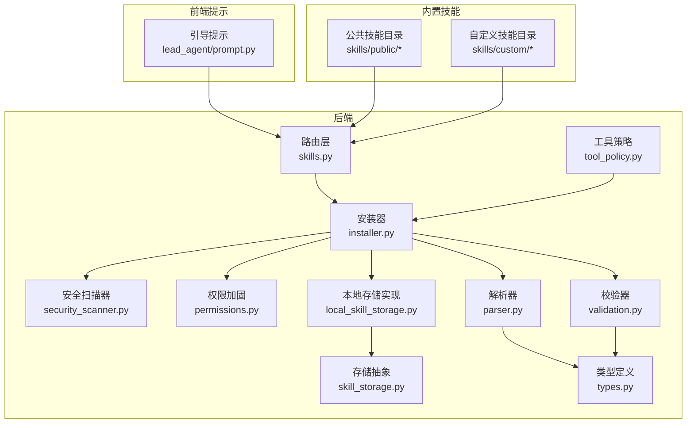
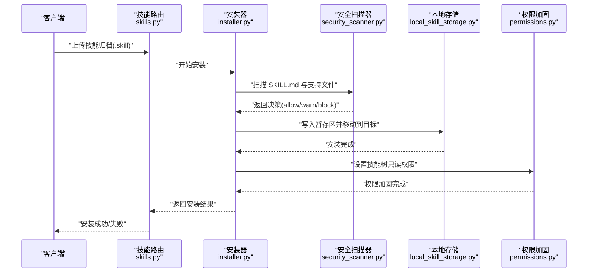
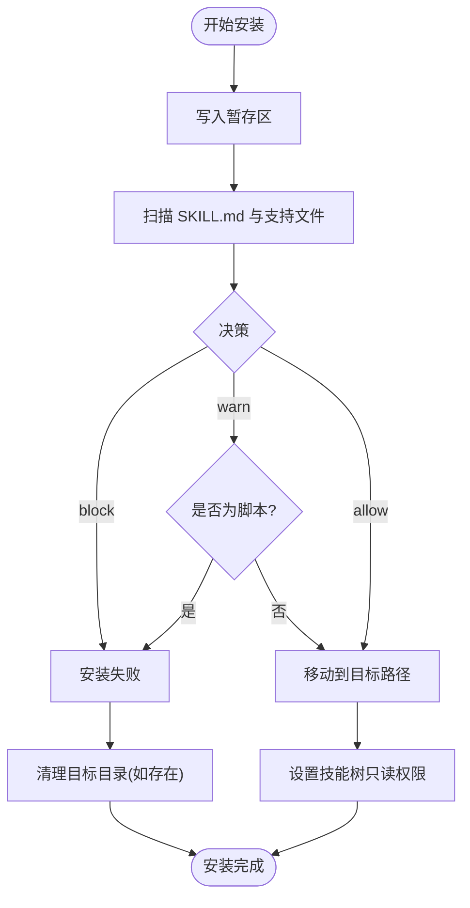
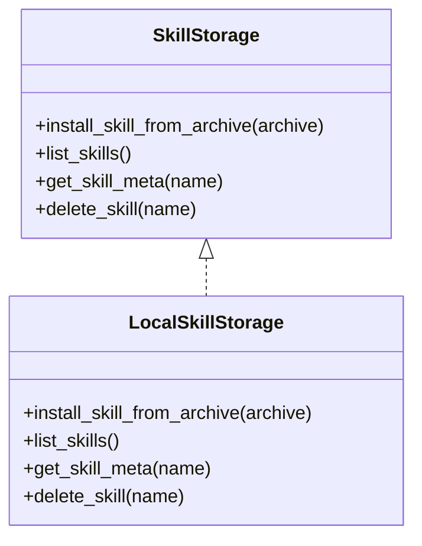
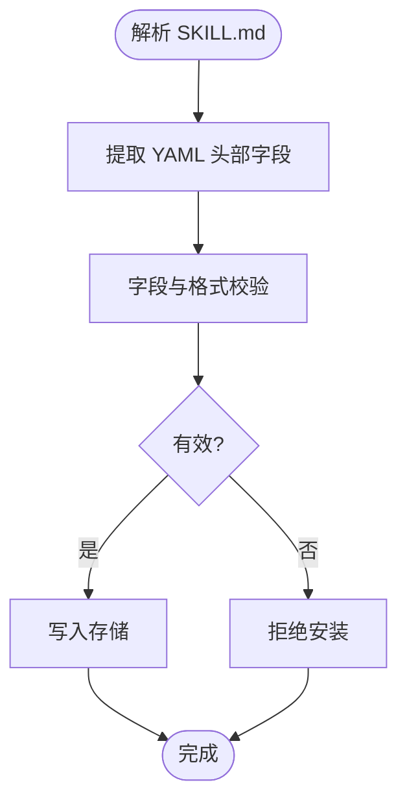
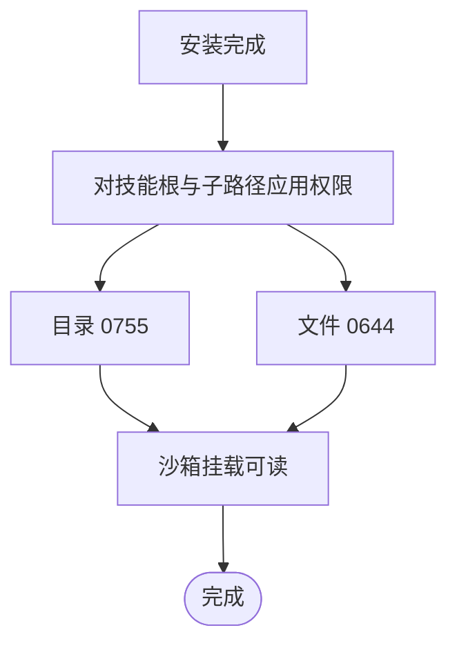
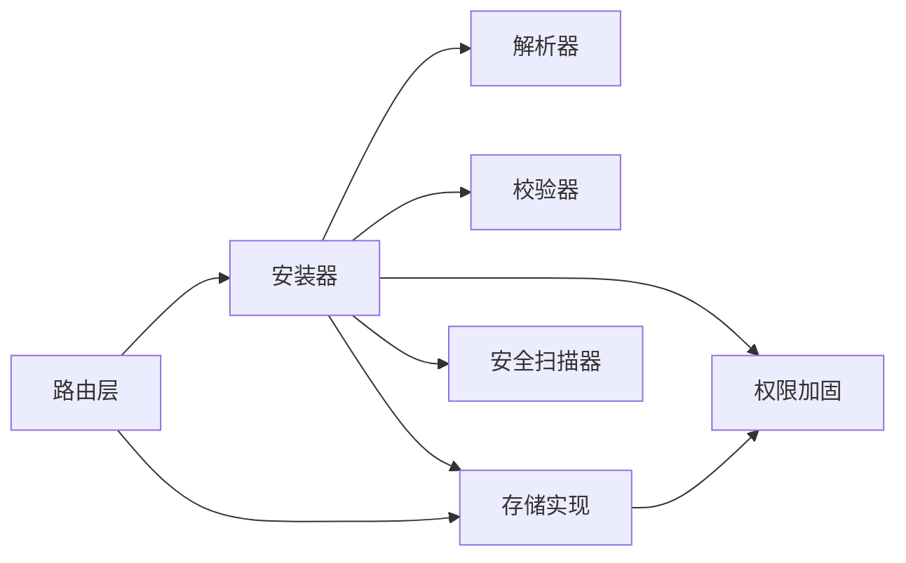

# 技能系统

<cite>
**本文引用的文件**
- [backend/packages/harness/deerflow/skills/installer.py](file://backend/packages/harness/deerflow/skills/installer.py)
- [backend/packages/harness/deerflow/skills/security_scanner.py](file://backend/packages/harness/deerflow/skills/security_scanner.py)
- [backend/packages/harness/deerflow/skills/permissions.py](file://backend/packages/harness/deerflow/skills/permissions.py)
- [backend/packages/harness/deerflow/skills/storage/local_skill_storage.py](file://backend/packages/harness/deerflow/skills/storage/local_skill_storage.py)
- [backend/packages/harness/deerflow/skills/storage/skill_storage.py](file://backend/packages/harness/deerflow/skills/storage/skill_storage.py)
- [backend/packages/harness/deerflow/skills/parser.py](file://backend/packages/harness/deerflow/skills/parser.py)
- [backend/packages/harness/deerflow/skills/validation.py](file://backend/packages/harness/deerflow/skills/validation.py)
- [backend/packages/harness/deerflow/skills/types.py](file://backend/packages/harness/deerflow/skills/types.py)
- [backend/packages/harness/deerflow/skills/tool_policy.py](file://backend/packages/harness/deerflow/skills/tool_policy.py)
- [backend/packages/harness/deerflow/agents/lead_agent/prompt.py](file://backend/packages/harness/deerflow/agents/lead_agent/prompt.py)
- [backend/app/routers/skills.py](file://backend/app/routers/skills.py)
- [backend/tests/test_skills_installer.py](file://backend/tests/test_skills_installer.py)
- [backend/tests/test_skills_loader.py](file://backend/tests/test_skills_loader.py)
- [backend/tests/test_skills_parser.py](file://backend/tests/test_skills_parser.py)
- [backend/tests/test_skills_validation.py](file://backend/tests/test_skills_validation.py)
- [backend/tests/test_skills_custom_router.py](file://backend/tests/test_skills_custom_router.py)
- [backend/tests/test_skill_permissions.py](file://backend/tests/test_skill_permissions.py)
- [skills/public/deep-research/SKILL.md](file://skills/public/deep-research/SKILL.md)
- [skills/public/chart-visualization/SKILL.md](file://skills/public/chart-visualization/SKILL.md)
- [skills/public/code-documentation/SKILL.md](file://skills/public/code-documentation/SKILL.md)
- [skills/public/data-analysis/SKILL.md](file://skills/public/data-analysis/SKILL.md)
- [skills/public/bootstrap/SKILL.md](file://skills/public/bootstrap/SKILL.md)
- [skills/public/systematic-literature-review/SKILL.md](file://skills/public/systematic-literature-review/SKILL.md)
- [skills/public/podcast-generation/SKILL.md](file://skills/public/podcast-generation/SKILL.md)
- [skills/public/newsletter-generation/SKILL.md](file://skills/public/newsletter-generation/SKILL.md)
- [skills/public/video-generation/SKILL.md](file://skills/public/video-generation/SKILL.md)
- [skills/public/image-generation/SKILL.md](file://skills/public/image-generation/SKILL.md)
- [skills/public/ppt-generation/SKILL.md](file://skills/public/ppt-generation/SKILL.md)
- [skills/public/github-deep-research/SKILL.md](file://skills/public/github-deep-research/SKILL.md)
- [skills/public/academic-paper-review/SKILL.md](file://skills/public/academic-paper-review/SKILL.md)
- [skills/public/consulting-analysis/SKILL.md](file://skills/public/consulting-analysis/SKILL.md)
- [skills/public/surprise-me/SKILL.md](file://skills/public/surprise-me/SKILL.md)
- [skills/public/web-design-guidelines/SKILL.md](file://skills/public/web-design-guidelines/SKILL.md)
- [skills/public/vercel-deploy-claimable/SKILL.md](file://skills/public/vercel-deploy-claimable/SKILL.md)
- [skills/public/frontend-design/SKILL.md](file://skills/public/frontend-design/SKILL.md)
- [skills/public/skill-creator/SKILL.md](file://skills/public/skill-creator/SKILL.md)
- [skills/custom/](file://skills/custom/)
- [.agent/skills/smoke-test/SKILL.md](file://.agent/skills/smoke-test/SKILL.md)
- [backend/docs/AUTH_DESIGN.md](file://backend/docs/AUTH_DESIGN.md)
- [backend/docs/MEMORY_IMPROVEMENTS.md](file://backend/docs/MEMORY_IMPROVEMENTS.md)
</cite>

## 目录
1. [简介](#简介)
2. [项目结构](#项目结构)
3. [核心组件](#核心组件)
4. [架构总览](#架构总览)
5. [详细组件分析](#详细组件分析)
6. [依赖关系分析](#依赖关系分析)
7. [性能考量](#性能考量)
8. [故障排查指南](#故障排查指南)
9. [结论](#结论)
10. [附录](#附录)

## 简介
本技术文档面向 DeerFlow 技能系统，系统性阐述技能加载机制、动态安装与安全扫描、权限管理与沙箱可读性、版本与演进策略，以及内置技能实现与自定义技能开发框架（规范、接口、测试、发布）。文档同时提供最佳实践、性能优化建议与安全注意事项，并给出开发示例、配置模板与集成指南，帮助开发者快速上手并产出高质量技能包。

## 项目结构
技能系统主要由以下层次构成：
- 路由层：对外暴露技能安装、查询、管理等 API
- 安装器与存储：负责技能归档解析、安全扫描、写盘与权限加固
- 解析与校验：从 SKILL.md 提取元信息，进行格式与字段校验
- 权限与沙箱：确保已安装技能树对沙箱只读可访问
- 工具策略：限制或允许技能内工具调用范围
- 前端提示：引导代理按“渐进式加载”模式执行技能
- 内置技能：公共与自定义两类，覆盖研究分析、可视化、报告生成、代码文档等场景

图示来源
- [backend/app/routers/skills.py:1-200](file://backend/app/routers/skills.py#L1-L200)
- [backend/packages/harness/deerflow/skills/installer.py:1-250](file://backend/packages/harness/deerflow/skills/installer.py#L1-L250)
- [backend/packages/harness/deerflow/skills/security_scanner.py:1-120](file://backend/packages/harness/deerflow/skills/security_scanner.py#L1-L120)
- [backend/packages/harness/deerflow/skills/permissions.py:1-34](file://backend/packages/harness/deerflow/skills/permissions.py#L1-L34)
- [backend/packages/harness/deerflow/skills/storage/skill_storage.py:1-200](file://backend/packages/harness/deerflow/skills/storage/skill_storage.py#L1-L200)
- [backend/packages/harness/deerflow/skills/storage/local_skill_storage.py:1-200](file://backend/packages/harness/deerflow/skills/storage/local_skill_storage.py#L1-L200)
- [backend/packages/harness/deerflow/skills/parser.py:1-200](file://backend/packages/harness/deerflow/skills/parser.py#L1-L200)
- [backend/packages/harness/deerflow/skills/validation.py:1-200](file://backend/packages/harness/deerflow/skills/validation.py#L1-L200)
- [backend/packages/harness/deerflow/skills/tool_policy.py:1-200](file://backend/packages/harness/deerflow/skills/tool_policy.py#L1-L200)
- [backend/packages/harness/deerflow/skills/types.py:1-200](file://backend/packages/harness/deerflow/skills/types.py#L1-L200)
- [backend/packages/harness/deerflow/agents/lead_agent/prompt.py:594-617](file://backend/packages/harness/deerflow/agents/lead_agent/prompt.py#L594-L617)
- [skills/public/:1-200](file://skills/public/#L1-L200)
- [skills/custom/:1-200](file://skills/custom/#L1-L200)

章节来源
- [backend/app/routers/skills.py:1-200](file://backend/app/routers/skills.py#L1-L200)
- [backend/packages/harness/deerflow/skills/installer.py:1-250](file://backend/packages/harness/deerflow/skills/installer.py#L1-L250)
- [backend/packages/harness/deerflow/skills/security_scanner.py:1-120](file://backend/packages/harness/deerflow/skills/security_scanner.py#L1-L120)
- [backend/packages/harness/deerflow/skills/permissions.py:1-34](file://backend/packages/harness/deerflow/skills/permissions.py#L1-L34)
- [backend/packages/harness/deerflow/skills/storage/skill_storage.py:1-200](file://backend/packages/harness/deerflow/skills/storage/skill_storage.py#L1-L200)
- [backend/packages/harness/deerflow/skills/storage/local_skill_storage.py:1-200](file://backend/packages/harness/deerflow/skills/storage/local_skill_storage.py#L1-L200)
- [backend/packages/harness/deerflow/skills/parser.py:1-200](file://backend/packages/harness/deerflow/skills/parser.py#L1-L200)
- [backend/packages/harness/deerflow/skills/validation.py:1-200](file://backend/packages/harness/deerflow/skills/validation.py#L1-L200)
- [backend/packages/harness/deerflow/skills/tool_policy.py:1-200](file://backend/packages/harness/deerflow/skills/tool_policy.py#L1-L200)
- [backend/packages/harness/deerflow/skills/types.py:1-200](file://backend/packages/harness/deerflow/skills/types.py#L1-L200)
- [backend/packages/harness/deerflow/agents/lead_agent/prompt.py:594-617](file://backend/packages/harness/deerflow/agents/lead_agent/prompt.py#L594-L617)
- [skills/public/:1-200](file://skills/public/#L1-L200)
- [skills/custom/:1-200](file://skills/custom/#L1-L200)

## 核心组件
- 安装器与安全扫描
  - 归档内容扫描：对 SKILL.md 与支持目录/后缀文件进行安全扫描；脚本类文件要求可执行许可且通过扫描
  - 安装流程：先写入暂存区，再原子移动到目标路径；失败时回滚保留目录
  - 沙箱可读性：安装后对技能树设置只读权限，确保沙箱挂载可读
- 存储抽象与实现
  - 抽象接口定义安装、查询、枚举等能力
  - 本地实现负责磁盘读写、路径解析与权限处理
- 解析与校验
  - 从 SKILL.md YAML 头部提取名称、描述、类别等元信息
  - 对必填字段与格式进行严格校验
- 权限与沙箱
  - 将技能树设置为目录 0755、文件 0644 的只读形式，避免沙箱写入
- 工具策略
  - 控制技能内工具调用范围，防止越权或高风险操作
- 前端提示
  - 引导代理采用“渐进式加载”：先读取技能主文件，再按需加载引用资源

章节来源
- [backend/packages/harness/deerflow/skills/installer.py:125-206](file://backend/packages/harness/deerflow/skills/installer.py#L125-L206)
- [backend/packages/harness/deerflow/skills/security_scanner.py:70-80](file://backend/packages/harness/deerflow/skills/security_scanner.py#L70-L80)
- [backend/packages/harness/deerflow/skills/permissions.py:7-34](file://backend/packages/harness/deerflow/skills/permissions.py#L7-L34)
- [backend/packages/harness/deerflow/skills/storage/skill_storage.py:1-200](file://backend/packages/harness/deerflow/skills/storage/skill_storage.py#L1-L200)
- [backend/packages/harness/deerflow/skills/storage/local_skill_storage.py:1-200](file://backend/packages/harness/deerflow/skills/storage/local_skill_storage.py#L1-L200)
- [backend/packages/harness/deerflow/skills/parser.py:1-200](file://backend/packages/harness/deerflow/skills/parser.py#L1-L200)
- [backend/packages/harness/deerflow/skills/validation.py:1-200](file://backend/packages/harness/deerflow/skills/validation.py#L1-L200)
- [backend/packages/harness/deerflow/skills/tool_policy.py:1-200](file://backend/packages/harness/deerflow/skills/tool_policy.py#L1-L200)
- [backend/packages/harness/deerflow/agents/lead_agent/prompt.py:594-617](file://backend/packages/harness/deerflow/agents/lead_agent/prompt.py#L594-L617)

## 架构总览
下图展示技能从归档到可用的关键交互流程，涵盖安装、扫描、权限加固与存储持久化。

图示来源
- [backend/app/routers/skills.py:1-200](file://backend/app/routers/skills.py#L1-L200)
- [backend/packages/harness/deerflow/skills/installer.py:125-206](file://backend/packages/harness/deerflow/skills/installer.py#L125-L206)
- [backend/packages/harness/deerflow/skills/security_scanner.py:70-80](file://backend/packages/harness/deerflow/skills/security_scanner.py#L70-L80)
- [backend/packages/harness/deerflow/skills/storage/local_skill_storage.py:1-200](file://backend/packages/harness/deerflow/skills/storage/local_skill_storage.py#L1-L200)
- [backend/packages/harness/deerflow/skills/permissions.py:7-34](file://backend/packages/harness/deerflow/skills/permissions.py#L7-L34)

## 详细组件分析

### 安装器与安全扫描
- 安装流程要点
  - 暂存区到目标区的原子移动，失败自动回滚
  - 对每个文本/脚本文件执行扫描，拒绝 block 决策
  - 脚本类文件必须获得可执行许可，否则拒绝
- 安全扫描要点
  - 使用统一提示词与 JSON 输出约束，识别注入、越权、外泄与不安全可执行代码
  - 对 SKILL.md 与支持文件分别评估，禁止嵌套 SKILL.md
- 权限加固要点
  - 安装后对技能树递归设置只读权限，确保沙箱可读不可写

图示来源
- [backend/packages/harness/deerflow/skills/installer.py:125-206](file://backend/packages/harness/deerflow/skills/installer.py#L125-L206)
- [backend/packages/harness/deerflow/skills/security_scanner.py:70-80](file://backend/packages/harness/deerflow/skills/security_scanner.py#L70-L80)
- [backend/packages/harness/deerflow/skills/permissions.py:7-34](file://backend/packages/harness/deerflow/skills/permissions.py#L7-L34)

章节来源
- [backend/packages/harness/deerflow/skills/installer.py:125-206](file://backend/packages/harness/deerflow/skills/installer.py#L125-L206)
- [backend/packages/harness/deerflow/skills/security_scanner.py:70-80](file://backend/packages/harness/deerflow/skills/security_scanner.py#L70-L80)
- [backend/tests/test_skills_installer.py:192-219](file://backend/tests/test_skills_installer.py#L192-L219)
- [backend/tests/test_skills_installer.py:297-320](file://backend/tests/test_skills_installer.py#L297-L320)

### 存储抽象与本地实现
- 抽象接口
  - 定义安装、查询、枚举、删除等能力，屏蔽具体存储介质差异
- 本地实现
  - 负责磁盘路径解析、目录权限处理与安装回滚
  - 与安装器协作完成归档解压与权限加固

图示来源
- [backend/packages/harness/deerflow/skills/storage/skill_storage.py:1-200](file://backend/packages/harness/deerflow/skills/storage/skill_storage.py#L1-L200)
- [backend/packages/harness/deerflow/skills/storage/local_skill_storage.py:1-200](file://backend/packages/harness/deerflow/skills/storage/local_skill_storage.py#L1-L200)

章节来源
- [backend/packages/harness/deerflow/skills/storage/skill_storage.py:1-200](file://backend/packages/harness/deerflow/skills/storage/skill_storage.py#L1-L200)
- [backend/packages/harness/deerflow/skills/storage/local_skill_storage.py:1-200](file://backend/packages/harness/deerflow/skills/storage/local_skill_storage.py#L1-L200)

### 解析与校验
- 解析
  - 从 SKILL.md YAML 头部提取名称、描述、类别、版本、作者等元信息
- 校验
  - 必填字段校验、格式校验、版本语义校验、类别枚举校验
  - 与存储层配合，保证元信息一致性

图示来源
- [backend/packages/harness/deerflow/skills/parser.py:1-200](file://backend/packages/harness/deerflow/skills/parser.py#L1-L200)
- [backend/packages/harness/deerflow/skills/validation.py:1-200](file://backend/packages/harness/deerflow/skills/validation.py#L1-L200)
- [backend/packages/harness/deerflow/skills/types.py:1-200](file://backend/packages/harness/deerflow/skills/types.py#L1-L200)

章节来源
- [backend/packages/harness/deerflow/skills/parser.py:1-200](file://backend/packages/harness/deerflow/skills/parser.py#L1-L200)
- [backend/packages/harness/deerflow/skills/validation.py:1-200](file://backend/packages/harness/deerflow/skills/validation.py#L1-L200)
- [backend/tests/test_skills_parser.py:1-200](file://backend/tests/test_skills_parser.py#L1-L200)
- [backend/tests/test_skills_validation.py:1-200](file://backend/tests/test_skills_validation.py#L1-L200)

### 权限与沙箱可读性
- 设计原则
  - 安装后的技能树对沙箱仅可读，避免运行期写入
  - 递归设置目录 0755、文件 0644，确保跨平台兼容
- 实现方式
  - 针对单个路径与整棵技能树设置权限
  - 在写入新文件时，逐步提升父路径权限以保持一致性

图示来源
- [backend/packages/harness/deerflow/skills/permissions.py:7-34](file://backend/packages/harness/deerflow/skills/permissions.py#L7-L34)
- [backend/tests/test_skill_permissions.py:1-200](file://backend/tests/test_skill_permissions.py#L1-L200)

章节来源
- [backend/packages/harness/deerflow/skills/permissions.py:7-34](file://backend/packages/harness/deerflow/skills/permissions.py#L7-L34)
- [backend/tests/test_skill_permissions.py:1-200](file://backend/tests/test_skill_permissions.py#L1-L200)

### 工具策略与安全边界
- 工具策略
  - 限制技能内工具调用范围，防止越权或高风险操作
  - 可结合运行时中间件拦截与白名单控制
- 安全边界
  - 结合安全扫描与权限加固，形成“内容审查 + 运行隔离”的双重保障

章节来源
- [backend/packages/harness/deerflow/skills/tool_policy.py:1-200](file://backend/packages/harness/deerflow/skills/tool_policy.py#L1-L200)

### 前端提示与渐进式加载
- 提示内容
  - 引导代理在匹配技能后，先读取技能主文件，再按需加载引用资源
- 作用
  - 降低一次性加载成本，提升响应速度与安全性

章节来源
- [backend/packages/harness/deerflow/agents/lead_agent/prompt.py:594-617](file://backend/packages/harness/deerflow/agents/lead_agent/prompt.py#L594-L617)

### 内置技能实现概览
- 研究分析类
  - 深度研究：提供系统化研究流程与参考材料组织
  - 系统性文献综述：支持结构化检索与评估
  - GitHub 深度研究：面向开源仓库的研究范式
  - 学术论文评审：学术规范与评审流程
- 报告生成类
  - 播客生成、新闻通讯、视频生成、PPT 生成、图像生成
- 数据可视化与分析
  - 图表可视化：提供图表生成与模板
  - 数据分析：提供分析脚本与模板
- 代码文档
  - 代码文档：面向代码注释与文档生成
- 其他
  - Bootstrap、Web 设计指南、Surprise Me、Vercel Claimable、前端设计、Skill Creator 等

章节来源
- [skills/public/deep-research/SKILL.md](file://skills/public/deep-research/SKILL.md)
- [skills/public/systematic-literature-review/SKILL.md](file://skills/public/systematic-literature-review/SKILL.md)
- [skills/public/github-deep-research/SKILL.md](file://skills/public/github-deep-research/SKILL.md)
- [skills/public/academic-paper-review/SKILL.md](file://skills/public/academic-paper-review/SKILL.md)
- [skills/public/chart-visualization/SKILL.md](file://skills/public/chart-visualization/SKILL.md)
- [skills/public/data-analysis/SKILL.md](file://skills/public/data-analysis/SKILL.md)
- [skills/public/code-documentation/SKILL.md](file://skills/public/code-documentation/SKILL.md)
- [skills/public/podcast-generation/SKILL.md](file://skills/public/podcast-generation/SKILL.md)
- [skills/public/newsletter-generation/SKILL.md](file://skills/public/newsletter-generation/SKILL.md)
- [skills/public/video-generation/SKILL.md](file://skills/public/video-generation/SKILL.md)
- [skills/public/image-generation/SKILL.md](file://skills/public/image-generation/SKILL.md)
- [skills/public/ppt-generation/SKILL.md](file://skills/public/ppt-generation/SKILL.md)
- [skills/public/web-design-guidelines/SKILL.md](file://skills/public/web-design-guidelines/SKILL.md)
- [skills/public/surprise-me/SKILL.md](file://skills/public/surprise-me/SKILL.md)
- [skills/public/vercel-deploy-claimable/SKILL.md](file://skills/public/vercel-deploy-claimable/SKILL.md)
- [skills/public/frontend-design/SKILL.md](file://skills/public/frontend-design/SKILL.md)
- [skills/public/skill-creator/SKILL.md](file://skills/public/skill-creator/SKILL.md)

## 依赖关系分析
- 组件耦合
  - 安装器依赖解析器、校验器、存储与权限模块
  - 存储实现依赖权限与工具策略
  - 路由层依赖安装器与存储
- 外部依赖
  - 文件系统权限、归档解压、异步事件循环
- 循环依赖
  - 当前模块间无明显循环依赖，职责清晰

图示来源
- [backend/app/routers/skills.py:1-200](file://backend/app/routers/skills.py#L1-L200)
- [backend/packages/harness/deerflow/skills/installer.py:1-250](file://backend/packages/harness/deerflow/skills/installer.py#L1-L250)
- [backend/packages/harness/deerflow/skills/parser.py:1-200](file://backend/packages/harness/deerflow/skills/parser.py#L1-L200)
- [backend/packages/harness/deerflow/skills/validation.py:1-200](file://backend/packages/harness/deerflow/skills/validation.py#L1-L200)
- [backend/packages/harness/deerflow/skills/storage/local_skill_storage.py:1-200](file://backend/packages/harness/deerflow/skills/storage/local_skill_storage.py#L1-L200)
- [backend/packages/harness/deerflow/skills/security_scanner.py:1-120](file://backend/packages/harness/deerflow/skills/security_scanner.py#L1-L120)
- [backend/packages/harness/deerflow/skills/permissions.py:1-34](file://backend/packages/harness/deerflow/skills/permissions.py#L1-L34)

章节来源
- [backend/app/routers/skills.py:1-200](file://backend/app/routers/skills.py#L1-L200)
- [backend/packages/harness/deerflow/skills/installer.py:1-250](file://backend/packages/harness/deerflow/skills/installer.py#L1-L250)
- [backend/packages/harness/deerflow/skills/parser.py:1-200](file://backend/packages/harness/deerflow/skills/parser.py#L1-L200)
- [backend/packages/harness/deerflow/skills/validation.py:1-200](file://backend/packages/harness/deerflow/skills/validation.py#L1-L200)
- [backend/packages/harness/deerflow/skills/storage/local_skill_storage.py:1-200](file://backend/packages/harness/deerflow/skills/storage/local_skill_storage.py#L1-L200)
- [backend/packages/harness/deerflow/skills/security_scanner.py:1-120](file://backend/packages/harness/deerflow/skills/security_scanner.py#L1-L120)
- [backend/packages/harness/deerflow/skills/permissions.py:1-34](file://backend/packages/harness/deerflow/skills/permissions.py#L1-L34)

## 性能考量
- 渐进式加载
  - 代理按需读取技能主文件与引用资源，减少一次性 IO 开销
- 并发与线程池
  - 安装过程中若处于运行中事件循环，使用线程池驱动异步安装，避免阻塞
- 权限批量设置
  - 对整棵技能树递归设置权限，建议在安装完成后一次性执行，避免重复 stat/chmod
- 缓存与提示
  - 代理侧缓存技能签名列表，减少重复构建提示成本

章节来源
- [backend/packages/harness/deerflow/agents/lead_agent/prompt.py:594-617](file://backend/packages/harness/deerflow/agents/lead_agent/prompt.py#L594-L617)
- [backend/packages/harness/deerflow/skills/installer.py:197-206](file://backend/packages/harness/deerflow/skills/installer.py#L197-L206)

## 故障排查指南
- 安装失败
  - 检查归档是否包含合法 SKILL.md 与支持文件
  - 确认扫描器未返回 block 决策；必要时调整内容或降级为 warn
  - 若出现嵌套 SKILL.md，需移除
- 权限问题
  - 确认安装后目录与文件权限符合只读要求
  - 沙箱挂载后应可读不可写
- 路由与存储
  - 确认路由层正确转发请求至安装器与存储
  - 检查存储路径与权限是否允许写入暂存区与最终目录

章节来源
- [backend/tests/test_skills_installer.py:192-219](file://backend/tests/test_skills_installer.py#L192-L219)
- [backend/tests/test_skills_installer.py:297-320](file://backend/tests/test_skills_installer.py#L297-L320)
- [backend/tests/test_skill_permissions.py:1-200](file://backend/tests/test_skill_permissions.py#L1-L200)
- [backend/app/routers/skills.py:1-200](file://backend/app/routers/skills.py#L1-L200)

## 结论
DeerFlow 技能系统通过“归档安装 + 安全扫描 + 权限加固 + 渐进式加载”的闭环，实现了安全、可控、可扩展的技能生态。内置技能覆盖研究分析、可视化、报告生成、代码文档等多个领域，自定义技能可通过统一规范与工具链快速接入。建议在开发中遵循安全扫描与权限加固流程，结合工具策略与前端提示，持续优化性能与用户体验。

## 附录

### 自定义技能开发框架
- 开发规范
  - 使用 SKILL.md 描述技能元信息（名称、描述、类别、版本、作者等）
  - 支持目录与脚本文件需纳入扫描范围
  - 禁止嵌套 SKILL.md
- API 接口标准
  - 通过路由层提供的安装接口提交 .skill 归档
  - 返回安装结果与错误信息
- 测试与调试
  - 单元测试覆盖安装、解析、校验、权限与安全扫描关键路径
  - 使用示例归档进行端到端验证
- 发布与分发
  - 将技能打包为 .skill 归档，上传至公共或私有分发渠道
  - 通过路由层安装到 skills/custom 目录

章节来源
- [backend/app/routers/skills.py:1-200](file://backend/app/routers/skills.py#L1-L200)
- [backend/packages/harness/deerflow/skills/parser.py:1-200](file://backend/packages/harness/deerflow/skills/parser.py#L1-L200)
- [backend/packages/harness/deerflow/skills/validation.py:1-200](file://backend/packages/harness/deerflow/skills/validation.py#L1-L200)
- [backend/packages/harness/deerflow/skills/installer.py:125-206](file://backend/packages/harness/deerflow/skills/installer.py#L125-L206)
- [backend/tests/test_skills_custom_router.py:69-87](file://backend/tests/test_skills_custom_router.py#L69-L87)

### 最佳实践
- 内容安全
  - 在开发阶段即进行安全扫描，避免 block 决策
  - 对脚本类文件谨慎授权，优先使用 warn 并人工复核
- 性能优化
  - 合理拆分引用资源，按需加载
  - 批量设置权限，减少多次 stat/chmod
- 安全考虑
  - 严格遵循工具策略，限制高风险工具调用
  - 保持技能树只读，防止运行期写入

章节来源
- [backend/packages/harness/deerflow/skills/security_scanner.py:70-80](file://backend/packages/harness/deerflow/skills/security_scanner.py#L70-L80)
- [backend/packages/harness/deerflow/skills/tool_policy.py:1-200](file://backend/packages/harness/deerflow/skills/tool_policy.py#L1-L200)
- [backend/packages/harness/deerflow/skills/permissions.py:7-34](file://backend/packages/harness/deerflow/skills/permissions.py#L7-L34)

### 配置模板与集成指南
- 配置模板
  - SKILL.md YAML 头部字段：名称、描述、类别、版本、作者、许可证等
  - 支持目录：scripts、templates、references 等
- 集成指南
  - 将 .skill 归档上传至路由层安装接口
  - 代理通过前端提示按“渐进式加载”模式执行技能
  - 在沙箱环境中验证只读权限与资源加载行为

章节来源
- [skills/public/bootstrap/SKILL.md](file://skills/public/bootstrap/SKILL.md)
- [skills/public/skill-creator/SKILL.md](file://skills/public/skill-creator/SKILL.md)
- [backend/packages/harness/deerflow/agents/lead_agent/prompt.py:594-617](file://backend/packages/harness/deerflow/agents/lead_agent/prompt.py#L594-L617)