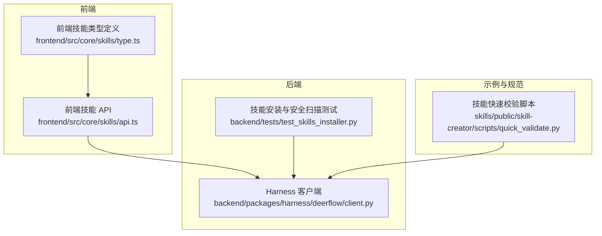
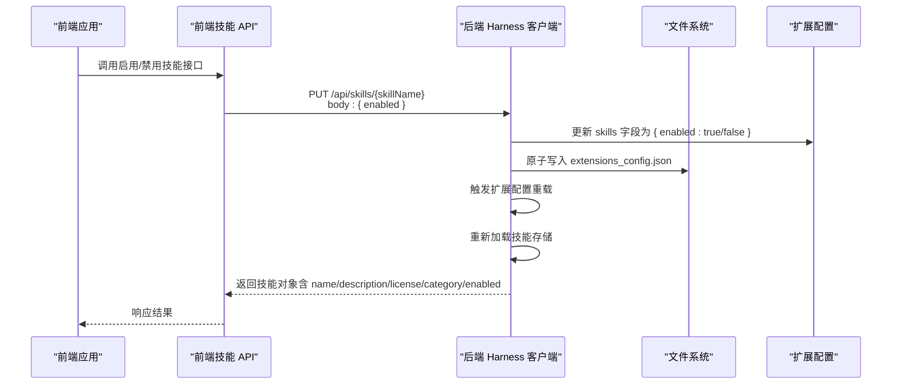
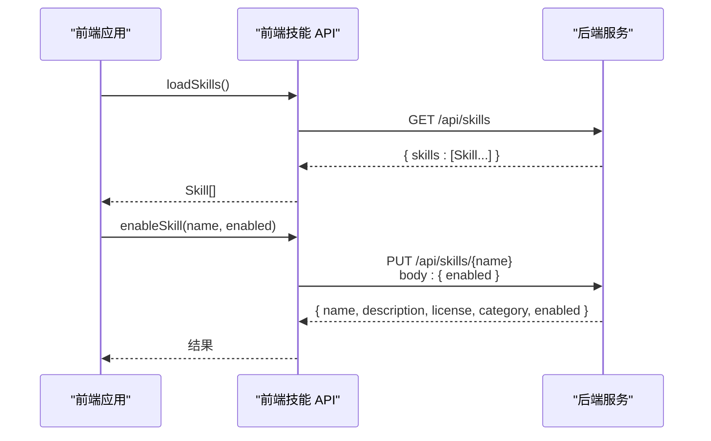
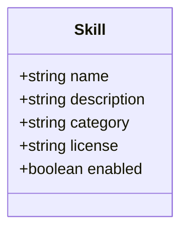
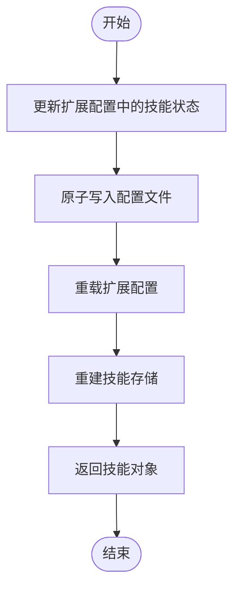
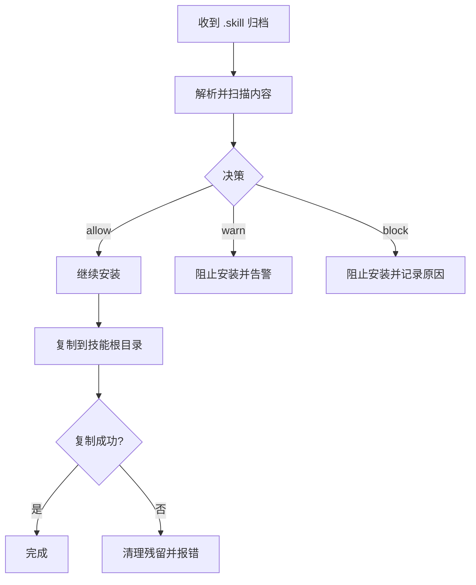
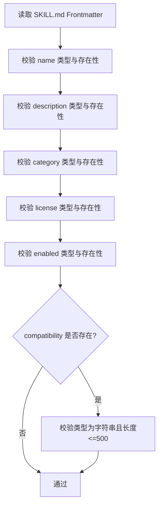
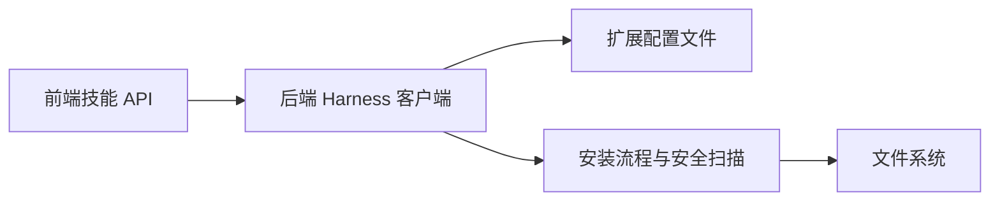

# 技能 API 规范

<cite>
**本文引用的文件**
- [backend/packages/harness/deerflow/client.py](file://backend/packages/harness/deerflow/client.py)
- [frontend/src/core/skills/api.ts](file://frontend/src/core/skills/api.ts)
- [frontend/src/core/skills/type.ts](file://frontend/src/core/skills/type.ts)
- [backend/tests/test_skills_installer.py](file://backend/tests/test_skills_installer.py)
- [skills/public/skill-creator/scripts/quick_validate.py](file://skills/public/skill-creator/scripts/quick_validate.py)
</cite>

## 目录
1. [简介](#简介)
2. [项目结构](#项目结构)
3. [核心组件](#核心组件)
4. [架构总览](#架构总览)
5. [详细组件分析](#详细组件分析)
6. [依赖关系分析](#依赖关系分析)
7. [性能考虑](#性能考虑)
8. [故障排查指南](#故障排查指南)
9. [结论](#结论)
10. [附录](#附录)

## 简介
本规范面向 DeerFlow 技能 API 的设计与实现，覆盖技能配置文件字段定义、参数传递方式、返回值格式、与核心系统的交互协议（含工具调用机制、参数验证规则与错误处理）、安全规范与性能要求，并提供可落地的实现示例与排障建议。目标是帮助开发者遵循统一的技能开发标准，确保技能在系统中的稳定性、安全性与可维护性。

## 项目结构
技能相关能力由后端 Harness 客户端与前端技能管理模块协同实现，测试用例覆盖安装流程与安全扫描逻辑，示例脚本提供技能元数据校验参考。

**图表来源**
- [frontend/src/core/skills/api.ts:1-26](file://frontend/src/core/skills/api.ts#L1-L26)
- [frontend/src/core/skills/type.ts:1-7](file://frontend/src/core/skills/type.ts#L1-L7)
- [backend/packages/harness/deerflow/client.py:1022-1058](file://backend/packages/harness/deerflow/client.py#L1022-L1058)
- [backend/tests/test_skills_installer.py:221-351](file://backend/tests/test_skills_installer.py#L221-L351)
- [skills/public/skill-creator/scripts/quick_validate.py:85-102](file://skills/public/skill-creator/scripts/quick_validate.py#L85-L102)

**章节来源**
- [frontend/src/core/skills/api.ts:1-26](file://frontend/src/core/skills/api.ts#L1-L26)
- [frontend/src/core/skills/type.ts:1-7](file://frontend/src/core/skills/type.ts#L1-L7)
- [backend/packages/harness/deerflow/client.py:1022-1058](file://backend/packages/harness/deerflow/client.py#L1022-L1058)
- [backend/tests/test_skills_installer.py:221-351](file://backend/tests/test_skills_installer.py#L221-L351)
- [skills/public/skill-creator/scripts/quick_validate.py:85-102](file://skills/public/skill-creator/scripts/quick_validate.py#L85-L102)

## 核心组件
- 前端技能 API：提供加载技能列表与启用/禁用技能的 HTTP 接口封装。
- 前端技能类型：定义技能对象的字段结构，用于类型约束与数据一致性。
- 后端 Harness 客户端：负责技能状态更新、配置写入、扩展配置重载等核心逻辑。
- 安装与安全扫描测试：覆盖技能安装前内容扫描、可执行文件警告与阻断、复制失败回滚等行为。
- 快速校验脚本：对技能元数据（如名称、描述、兼容性）进行基础合法性检查。

**章节来源**
- [frontend/src/core/skills/api.ts:1-26](file://frontend/src/core/skills/api.ts#L1-L26)
- [frontend/src/core/skills/type.ts:1-7](file://frontend/src/core/skills/type.ts#L1-L7)
- [backend/packages/harness/deerflow/client.py:1022-1058](file://backend/packages/harness/deerflow/client.py#L1022-L1058)
- [backend/tests/test_skills_installer.py:221-351](file://backend/tests/test_skills_installer.py#L221-L351)
- [skills/public/skill-creator/scripts/quick_validate.py:85-102](file://skills/public/skill-creator/scripts/quick_validate.py#L85-L102)

## 架构总览
技能 API 的调用链路从前端发起，经后端 Harness 客户端处理，最终更新扩展配置并触发运行时重载。安装流程包含安全扫描与原子写入，确保系统稳定与安全。

**图表来源**
- [frontend/src/core/skills/api.ts:12-26](file://frontend/src/core/skills/api.ts#L12-L26)
- [backend/packages/harness/deerflow/client.py:1022-1058](file://backend/packages/harness/deerflow/client.py#L1022-L1058)

## 详细组件分析

### 前端技能 API 组件
- 加载技能列表：GET /api/skills，返回包含 skills 数组的对象，数组元素为技能对象。
- 启用/禁用技能：PUT /api/skills/{skillName}，请求体包含 enabled 字段；成功后返回技能对象。

**图表来源**
- [frontend/src/core/skills/api.ts:6-10](file://frontend/src/core/skills/api.ts#L6-L10)
- [frontend/src/core/skills/api.ts:12-26](file://frontend/src/core/skills/api.ts#L12-L26)

**章节来源**
- [frontend/src/core/skills/api.ts:1-26](file://frontend/src/core/skills/api.ts#L1-L26)

### 前端技能类型定义
技能对象包含以下字段：
- name：字符串，技能名称
- description：字符串，技能描述
- category：字符串，技能分类
- license：字符串，许可证信息
- enabled：布尔值，是否启用

**图表来源**
- [frontend/src/core/skills/type.ts:1-7](file://frontend/src/core/skills/type.ts#L1-L7)

**章节来源**
- [frontend/src/core/skills/type.ts:1-7](file://frontend/src/core/skills/type.ts#L1-L7)

### 后端 Harness 客户端组件
- 更新技能状态：将指定技能的 enabled 写入扩展配置，原子写入 JSON 并触发重载。
- 返回标准化技能对象：包含 name、description、license、category、enabled 字段。
- 安装技能：支持从 .skill 归档安装，内部包含安全扫描与目录复制。

**图表来源**
- [backend/packages/harness/deerflow/client.py:1022-1058](file://backend/packages/harness/deerflow/client.py#L1022-L1058)

**章节来源**
- [backend/packages/harness/deerflow/client.py:1022-1058](file://backend/packages/harness/deerflow/client.py#L1022-L1058)

### 安装与安全扫描组件
- 安装前扫描：对 SKILL.md 与支持文件（scripts、templates、assets 等）进行扫描，识别可执行文件与敏感内容。
- 执行策略：
  - allow：允许安装
  - warn：发出警告但阻止安装（例如需要人工复核的可执行文件）
  - block：直接阻断安装（例如检测到提示词注入风险）
- 失败保护：复制失败时不会留下部分安装产物，保证文件系统一致性。

**图表来源**
- [backend/tests/test_skills_installer.py:221-351](file://backend/tests/test_skills_installer.py#L221-L351)

**章节来源**
- [backend/tests/test_skills_installer.py:221-351](file://backend/tests/test_skills_installer.py#L221-L351)

### 元数据校验组件
- 对技能元数据进行基础校验，包括字段类型与长度限制（如 compatibility 字段长度上限），确保技能配置文件的规范性与可读性。

**图表来源**
- [skills/public/skill-creator/scripts/quick_validate.py:85-102](file://skills/public/skill-creator/scripts/quick_validate.py#L85-L102)

**章节来源**
- [skills/public/skill-creator/scripts/quick_validate.py:85-102](file://skills/public/skill-creator/scripts/quick_validate.py#L85-L102)

## 依赖关系分析
- 前端依赖后端提供的技能 API，使用 fetch 封装进行 HTTP 请求。
- 后端通过扩展配置文件控制技能启用状态，并在更新后重载以生效。
- 安装流程依赖安全扫描器与文件系统操作，确保安装过程可控与可审计。

**图表来源**
- [frontend/src/core/skills/api.ts:1-26](file://frontend/src/core/skills/api.ts#L1-L26)
- [backend/packages/harness/deerflow/client.py:1022-1058](file://backend/packages/harness/deerflow/client.py#L1022-L1058)
- [backend/tests/test_skills_installer.py:221-351](file://backend/tests/test_skills_installer.py#L221-L351)

**章节来源**
- [frontend/src/core/skills/api.ts:1-26](file://frontend/src/core/skills/api.ts#L1-L26)
- [backend/packages/harness/deerflow/client.py:1022-1058](file://backend/packages/harness/deerflow/client.py#L1022-L1058)
- [backend/tests/test_skills_installer.py:221-351](file://backend/tests/test_skills_installer.py#L221-L351)

## 性能考虑
- 前端请求：尽量批量获取技能列表，减少网络往返；启用/禁用操作采用幂等的单项更新。
- 后端写入：使用原子写入避免并发冲突导致的配置损坏；重载仅在必要时触发，降低系统抖动。
- 安装流程：扫描阶段尽量并行处理不同类型的文件；复制失败快速回滚，避免长时间占用资源。

## 故障排查指南
- 启用/禁用失败
  - 检查后端日志中扩展配置写入是否成功。
  - 确认 extensions_config.json 是否存在且具备写权限。
  - 若更新后技能未出现在列表中，确认是否触发了扩展配置重载。
- 安装被阻断
  - 查看扫描日志，确认是否存在可执行文件或敏感内容触发了 warn/block。
  - 检查归档内文件结构，确保 SKILL.md 位于正确位置且无嵌套。
- 复制失败
  - 检查磁盘空间与权限；查看是否有残留临时目录未清理。
  - 重试安装，观察是否能正常回滚至干净状态。

**章节来源**
- [backend/tests/test_skills_installer.py:221-351](file://backend/tests/test_skills_installer.py#L221-L351)

## 结论
本规范明确了 DeerFlow 技能 API 的数据模型、交互协议与安全要求。通过前后端协作、严格的安装与扫描流程以及一致性的错误处理，能够有效保障技能系统的稳定性与安全性。建议在实际开发中严格遵循字段定义、参数校验与安全扫描流程，并结合性能与故障排查建议持续优化。

## 附录

### 接口定义与示例

- 获取技能列表
  - 方法与路径：GET /api/skills
  - 成功响应：包含 skills 数组，数组元素为技能对象
  - 示例路径：[frontend/src/core/skills/api.ts:6-10](file://frontend/src/core/skills/api.ts#L6-L10)

- 启用/禁用技能
  - 方法与路径：PUT /api/skills/{skillName}
  - 请求体：{ enabled: boolean }
  - 成功响应：技能对象（包含 name、description、license、category、enabled）
  - 示例路径：[frontend/src/core/skills/api.ts:12-26](file://frontend/src/core/skills/api.ts#L12-L26)

- 技能对象字段
  - 字段：name、description、category、license、enabled
  - 类型定义：[frontend/src/core/skills/type.ts:1-7](file://frontend/src/core/skills/type.ts#L1-L7)

- 安装与安全扫描
  - 流程要点：扫描 SKILL.md 与支持文件；可执行文件需 warn/block；复制失败回滚
  - 示例路径：[backend/tests/test_skills_installer.py:221-351](file://backend/tests/test_skills_installer.py#L221-L351)

- 元数据校验
  - 校验项：字段类型与长度（如 compatibility 最大长度 500）
  - 示例路径：[skills/public/skill-creator/scripts/quick_validate.py:85-102](file://skills/public/skill-creator/scripts/quick_validate.py#L85-L102)