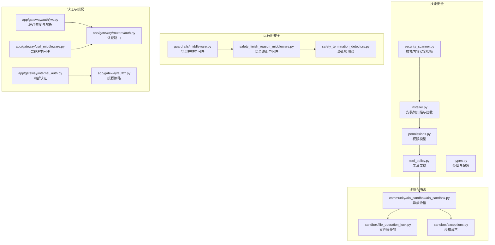
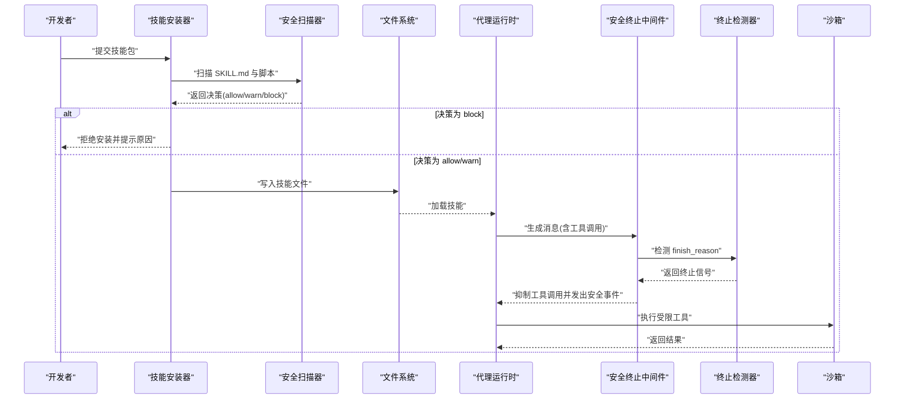
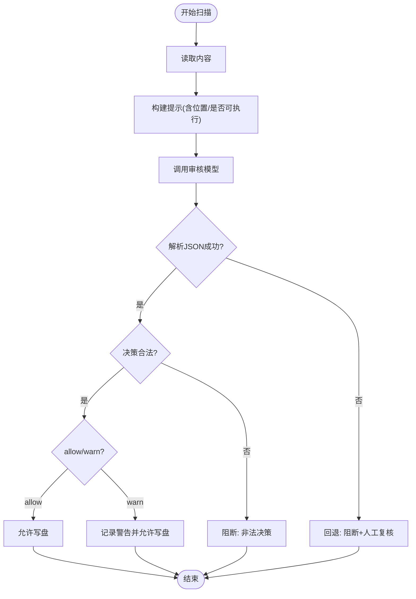
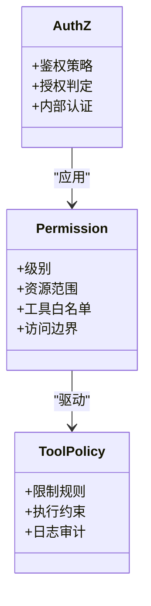
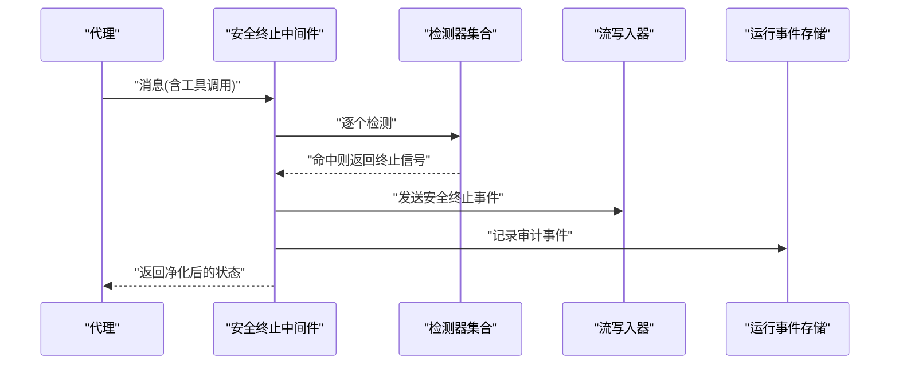
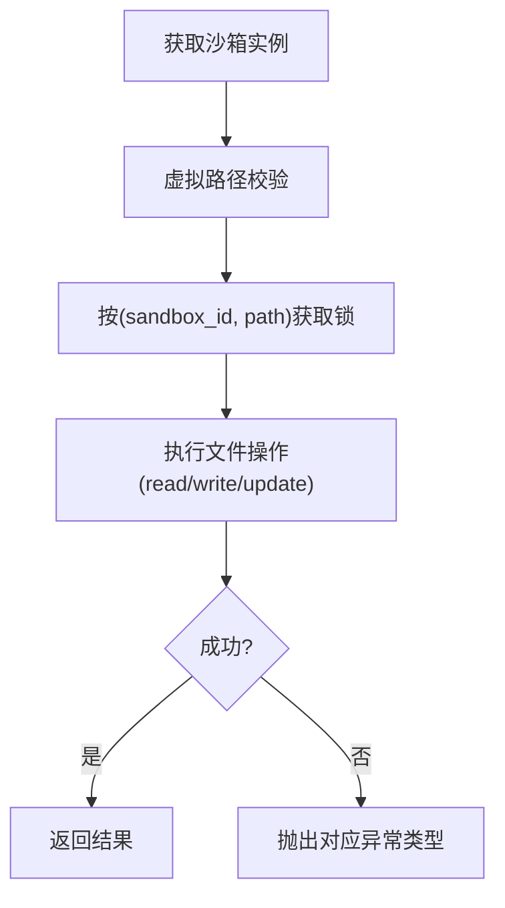
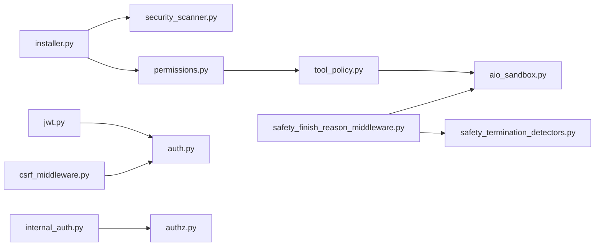

# 技能安全与合规

<cite>
**本文引用的文件**
- [security_scanner.py](file://backend/packages/harness/deerflow/skills/security_scanner.py)
- [installer.py](file://backend/packages/harness/deerflow/skills/installer.py)
- [permissions.py](file://backend/packages/harness/deerflow/skills/permissions.py)
- [types.py](file://backend/packages/harness/deerflow/skills/types.py)
- [tool_policy.py](file://backend/packages/harness/deerflow/skills/tool_policy.py)
- [middleware.py](file://backend/packages/harness/deerflow/guardrails/middleware.py)
- [GUARDRAILS.md](file://backend/docs/GUARDRAILS.md)
- [safety_finish_reason_middleware.py](file://backend/packages/harness/deerflow/agents/middlewares/safety_finish_reason_middleware.py)
- [safety_termination_detectors.py](file://backend/packages/harness/deerflow/agents/middlewares/safety_termination_detectors.py)
- [aio_sandbox.py](file://backend/packages/harness/deerflow/community/aio_sandbox/aio_sandbox.py)
- [file_operation_lock.py](file://backend/packages/harness/deerflow/sandbox/file_operation_lock.py)
- [exceptions.py](file://backend/packages/harness/deerflow/sandbox/exceptions.py)
- [jwt.py](file://backend/app/gateway/auth/jwt.py)
- [auth.py](file://backend/app/gateway/routers/auth.py)
- [csrf_middleware.py](file://backend/app/gateway/csrf_middleware.py)
- [internal_auth.py](file://backend/app/gateway/internal_auth.py)
- [authz.py](file://backend/app/gateway/authz.py)
- [test_safety_finish_reason_middleware.py](file://backend/tests/test_safety_finish_reason_middleware.py)
- [test_security_scanner.py](file://backend/tests/test_security_scanner.py)
- [test_skill_permissions.py](file://backend/tests/test_skill_permissions.py)
- [test_sandbox_tools_security.py](file://backend/tests/test_sandbox_tools_security.py)
- [quick_validate.py](file://skills/public/skill-creator/scripts/quick_validate.py)
</cite>

## 目录
1. 引言
2. 项目结构
3. 核心组件
4. 架构总览
5. 组件详解
6. 依赖关系分析
7. 性能考量
8. 故障排查指南
9. 结论
10. 附录

## 引言
本指南面向 DeerFlow 技能开发者与平台运维人员，系统阐述技能安全扫描机制、权限管理、合规评估与安全开发最佳实践。内容覆盖从技能安装前的代码安全检查、运行时的沙箱隔离与工具调用限制，到权限模型与访问控制策略，并提供可执行的安全审计流程与合规检查清单，帮助在保证功能可用的同时满足企业安全标准。

## 项目结构
围绕“技能安全与合规”的关键目录与文件如下：
- 技能安全扫描与安装：packages/harness/deerflow/skills 下的 security_scanner.py、installer.py、permissions.py、tool_policy.py 等
- 运行时安全中间件：packages/harness/deerflow/agents/middlewares 下的安全终止检测与流式事件输出
- 沙箱与文件操作：packages/harness/deerflow/community/aio_sandbox 与 packages/harness/deerflow/sandbox 的文件锁与异常体系
- 守卫护栏（Guardrails）：packages/harness/deerflow/guardrails/middleware.py 与文档 backend/docs/GUARDRAILS.md
- 认证与授权：app/gateway 下的 jwt、auth 路由、CSRF 中间件、内部认证与授权模块
- 测试与校验：tests 下的安全测试与技能验证脚本 quick_validate.py

图表来源
- [security_scanner.py:70-109](file://backend/packages/harness/deerflow/skills/security_scanner.py#L70-L109)
- [installer.py:160-184](file://backend/packages/harness/deerflow/skills/installer.py#L160-L184)
- [permissions.py](file://backend/packages/harness/deerflow/skills/permissions.py)
- [tool_policy.py](file://backend/packages/harness/deerflow/skills/tool_policy.py)
- [types.py](file://backend/packages/harness/deerflow/skills/types.py)
- [safety_finish_reason_middleware.py:80-215](file://backend/packages/harness/deerflow/agents/middlewares/safety_finish_reason_middleware.py#L80-L215)
- [safety_termination_detectors.py:1-25](file://backend/packages/harness/deerflow/agents/middlewares/safety_termination_detectors.py#L1-L25)
- [aio_sandbox.py:152-285](file://backend/packages/harness/deerflow/community/aio_sandbox/aio_sandbox.py#L152-L285)
- [file_operation_lock.py:1-27](file://backend/packages/harness/deerflow/sandbox/file_operation_lock.py#L1-L27)
- [exceptions.py:31-71](file://backend/packages/harness/deerflow/sandbox/exceptions.py#L31-L71)
- [jwt.py:1-55](file://backend/app/gateway/auth/jwt.py#L1-L55)
- [auth.py](file://backend/app/gateway/routers/auth.py)
- [csrf_middleware.py](file://backend/app/gateway/csrf_middleware.py)
- [internal_auth.py](file://backend/app/gateway/internal_auth.py)
- [authz.py](file://backend/app/gateway/authz.py)

章节来源
- [security_scanner.py:70-109](file://backend/packages/harness/deerflow/skills/security_scanner.py#L70-L109)
- [installer.py:160-184](file://backend/packages/harness/deerflow/skills/installer.py#L160-L184)

## 核心组件
- 技能安全扫描器：对 SKILL.md 与可执行脚本进行分类决策（允许/警告/阻止），并提供回退策略与错误处理
- 安装器：在写盘前调用扫描器，依据决策阻断高危内容或要求人工复核
- 权限与工具策略：定义技能权限级别、访问控制边界与工具调用限制
- 运行时安全中间件：基于 LLM 提供商的 finish_reason 信号触发安全终止，抑制危险工具调用并记录审计事件
- 沙箱与文件锁：通过虚拟路径映射、并发锁与异常类型保障文件操作安全与隔离
- 守卫护栏中间件：统一接入内容过滤与主题敏感词等风控策略
- 认证与授权：JWT 生命周期管理、CSRF 防护、内部认证与细粒度授权

章节来源
- [security_scanner.py:70-109](file://backend/packages/harness/deerflow/skills/security_scanner.py#L70-L109)
- [installer.py:160-184](file://backend/packages/harness/deerflow/skills/installer.py#L160-L184)
- [permissions.py](file://backend/packages/harness/deerflow/skills/permissions.py)
- [tool_policy.py](file://backend/packages/harness/deerflow/skills/tool_policy.py)
- [safety_finish_reason_middleware.py:80-215](file://backend/packages/harness/deerflow/agents/middlewares/safety_finish_reason_middleware.py#L80-L215)
- [aio_sandbox.py:152-285](file://backend/packages/harness/deerflow/community/aio_sandbox/aio_sandbox.py#L152-L285)
- [middleware.py](file://backend/packages/harness/deerflow/guardrails/middleware.py)
- [jwt.py:1-55](file://backend/app/gateway/auth/jwt.py#L1-L55)

## 架构总览
下图展示“技能安装—运行时安全—沙箱隔离”的端到端安全链路：

图表来源
- [installer.py:160-184](file://backend/packages/harness/deerflow/skills/installer.py#L160-L184)
- [security_scanner.py:70-109](file://backend/packages/harness/deerflow/skills/security_scanner.py#L70-L109)
- [safety_finish_reason_middleware.py:80-215](file://backend/packages/harness/deerflow/agents/middlewares/safety_finish_reason_middleware.py#L80-L215)
- [safety_termination_detectors.py:1-25](file://backend/packages/harness/deerflow/agents/middlewares/safety_termination_detectors.py#L1-L25)
- [aio_sandbox.py:152-285](file://backend/packages/harness/deerflow/community/aio_sandbox/aio_sandbox.py#L152-L285)

## 组件详解

### 技能安全扫描机制
- 扫描范围：SKILL.md 与所有可安装文本/脚本文件；对可执行文件采用更严格策略
- 决策维度：明确禁止提示注入、系统角色覆盖、权限提升、数据外泄与不安全可执行代码；对边缘外部 API 引用进行警告
- 回退策略：模型不可用或输出不可解析时采取保守阻断，必要时要求人工复核
- 安装拦截：当决策为 block 或非 allow/warn 时抛出安全异常，阻止写盘

图表来源
- [security_scanner.py:70-109](file://backend/packages/harness/deerflow/skills/security_scanner.py#L70-L109)

章节来源
- [security_scanner.py:70-109](file://backend/packages/harness/deerflow/skills/security_scanner.py#L70-L109)
- [installer.py:160-184](file://backend/packages/harness/deerflow/skills/installer.py#L160-L184)

### 权限管理与访问控制
- 权限级别与边界：通过权限模型定义技能可访问资源与能力上限，结合工具策略限制危险工具调用
- 授权策略：基于用户身份与技能权限进行最小授权，支持内部认证与跨服务访问控制
- 工具策略：对文件系统、网络请求、进程执行等进行白名单/黑名单控制

图表来源
- [permissions.py](file://backend/packages/harness/deerflow/skills/permissions.py)
- [tool_policy.py](file://backend/packages/harness/deerflow/skills/tool_policy.py)
- [authz.py](file://backend/app/gateway/authz.py)
- [internal_auth.py](file://backend/app/gateway/internal_auth.py)

章节来源
- [permissions.py](file://backend/packages/harness/deerflow/skills/permissions.py)
- [tool_policy.py](file://backend/packages/harness/deerflow/skills/tool_policy.py)
- [authz.py](file://backend/app/gateway/authz.py)
- [internal_auth.py](file://backend/app/gateway/internal_auth.py)

### 运行时安全与安全终止
- 终止检测：根据 LLM 提供商的 finish_reason 识别安全终止信号，优先级顺序可配置
- 事件输出：向流写出安全终止事件，记录抑制的工具调用数量与名称
- 审计记录：将中间件事件持久化以便事后审计
- 兼容性：单个检测器异常不影响整体运行，确保鲁棒性

图表来源
- [safety_finish_reason_middleware.py:80-215](file://backend/packages/harness/deerflow/agents/middlewares/safety_finish_reason_middleware.py#L80-L215)
- [safety_termination_detectors.py:1-25](file://backend/packages/harness/deerflow/agents/middlewares/safety_termination_detectors.py#L1-L25)

章节来源
- [safety_finish_reason_middleware.py:80-215](file://backend/packages/harness/deerflow/agents/middlewares/safety_finish_reason_middleware.py#L80-L215)
- [test_safety_finish_reason_middleware.py:57-400](file://backend/tests/test_safety_finish_reason_middleware.py#L57-L400)

### 沙箱隔离与文件操作安全
- 虚拟路径映射：确保上传与工作路径在容器内正确映射，避免直接写宿主真实路径
- 并发安全：按 sandbox_id 与路径建立弱引用锁，防止竞态与内存泄漏
- 异常建模：区分命令执行、文件操作、权限不足与未找到等场景，便于定位问题

图表来源
- [aio_sandbox.py:152-285](file://backend/packages/harness/deerflow/community/aio_sandbox/aio_sandbox.py#L152-L285)
- [file_operation_lock.py:1-27](file://backend/packages/harness/deerflow/sandbox/file_operation_lock.py#L1-L27)
- [exceptions.py:31-71](file://backend/packages/harness/deerflow/sandbox/exceptions.py#L31-L71)

章节来源
- [aio_sandbox.py:152-285](file://backend/packages/harness/deerflow/community/aio_sandbox/aio_sandbox.py#L152-L285)
- [file_operation_lock.py:1-27](file://backend/packages/harness/deerflow/sandbox/file_operation_lock.py#L1-L27)
- [exceptions.py:31-71](file://backend/packages/harness/deerflow/sandbox/exceptions.py#L31-L71)

### 守卫护栏（Guardrails）
- 中间件职责：统一接入内容过滤、主题敏感词与业务规则，作为第一道防线
- 文档参考：详见 Guardrails 设计文档，明确策略配置与生效范围

章节来源
- [middleware.py](file://backend/packages/harness/deerflow/guardrails/middleware.py)
- [GUARDRAILS.md](file://backend/docs/GUARDRAILS.md)

### 认证与授权
- JWT：签发与解码，包含过期、签名无效、格式错误等错误类型
- CSRF：跨站请求伪造防护中间件
- 内部认证：服务间调用的身份校验与令牌版本控制
- 授权：基于用户与技能权限的最小授权策略

章节来源
- [jwt.py:1-55](file://backend/app/gateway/auth/jwt.py#L1-L55)
- [csrf_middleware.py](file://backend/app/gateway/csrf_middleware.py)
- [internal_auth.py](file://backend/app/gateway/internal_auth.py)
- [authz.py](file://backend/app/gateway/authz.py)

## 依赖关系分析
- 安装阶段：installer 依赖 security_scanner 的决策结果；权限与工具策略影响后续运行时行为
- 运行阶段：安全终止中间件依赖检测器实现；沙箱中间件与异常体系支撑工具执行安全
- 认证层：JWT 与 CSRF 为上层路由与中间件提供基础安全能力

图表来源
- [installer.py:160-184](file://backend/packages/harness/deerflow/skills/installer.py#L160-L184)
- [security_scanner.py:70-109](file://backend/packages/harness/deerflow/skills/security_scanner.py#L70-L109)
- [permissions.py](file://backend/packages/harness/deerflow/skills/permissions.py)
- [tool_policy.py](file://backend/packages/harness/deerflow/skills/tool_policy.py)
- [aio_sandbox.py:152-285](file://backend/packages/harness/deerflow/community/aio_sandbox/aio_sandbox.py#L152-L285)
- [safety_finish_reason_middleware.py:80-215](file://backend/packages/harness/deerflow/agents/middlewares/safety_finish_reason_middleware.py#L80-L215)
- [safety_termination_detectors.py:1-25](file://backend/packages/harness/deerflow/agents/middlewares/safety_termination_detectors.py#L1-L25)
- [jwt.py:1-55](file://backend/app/gateway/auth/jwt.py#L1-L55)
- [auth.py](file://backend/app/gateway/routers/auth.py)
- [csrf_middleware.py](file://backend/app/gateway/csrf_middleware.py)
- [internal_auth.py](file://backend/app/gateway/internal_auth.py)
- [authz.py](file://backend/app/gateway/authz.py)

## 性能考量
- 模型调用：安全扫描依赖 LLM，建议合理配置超时与重试策略，避免阻塞安装流程
- 沙箱并发：文件操作锁采用弱引用字典，降低长时运行内存压力；注意避免过度细分路径导致锁竞争
- 中间件开销：安全终止检测器应尽量轻量化，异常检测失败不应影响主流程
- 缓存与回退：在模型不可用时快速回退至保守策略，减少等待时间

## 故障排查指南
- 安全扫描失败
  - 现象：安装时报“扫描失败”或“决策非法”
  - 处理：检查模型配置与网络连通性；查看回退逻辑是否被触发；必要时人工复核
  - 参考
    - [security_scanner.py:70-109](file://backend/packages/harness/deerflow/skills/security_scanner.py#L70-L109)
    - [installer.py:160-184](file://backend/packages/harness/deerflow/skills/installer.py#L160-L184)
- 沙箱文件操作异常
  - 现象：写入/读取失败、权限错误或未找到
  - 处理：确认虚拟路径映射正确；检查并发锁是否被持有；根据异常类型定位问题
  - 参考
    - [aio_sandbox.py:152-285](file://backend/packages/harness/deerflow/community/aio_sandbox/aio_sandbox.py#L152-L285)
    - [exceptions.py:31-71](file://backend/packages/harness/deerflow/sandbox/exceptions.py#L31-L71)
- 安全终止未生效
  - 现象：工具调用未被抑制或事件未记录
  - 处理：检查检测器配置与实现；验证流写入器可用性；查看测试用例以确认行为
  - 参考
    - [safety_finish_reason_middleware.py:80-215](file://backend/packages/harness/deerflow/agents/middlewares/safety_finish_reason_middleware.py#L80-L215)
    - [test_safety_finish_reason_middleware.py:57-400](file://backend/tests/test_safety_finish_reason_middleware.py#L57-L400)
- 权限策略不生效
  - 现象：技能越权访问资源
  - 处理：核对权限级别与工具策略；检查授权中间件是否启用
  - 参考
    - [permissions.py](file://backend/packages/harness/deerflow/skills/permissions.py)
    - [tool_policy.py](file://backend/packages/harness/deerflow/skills/tool_policy.py)
    - [authz.py](file://backend/app/gateway/authz.py)

章节来源
- [security_scanner.py:70-109](file://backend/packages/harness/deerflow/skills/security_scanner.py#L70-L109)
- [installer.py:160-184](file://backend/packages/harness/deerflow/skills/installer.py#L160-L184)
- [aio_sandbox.py:152-285](file://backend/packages/harness/deerflow/community/aio_sandbox/aio_sandbox.py#L152-L285)
- [exceptions.py:31-71](file://backend/packages/harness/deerflow/sandbox/exceptions.py#L31-L71)
- [safety_finish_reason_middleware.py:80-215](file://backend/packages/harness/deerflow/agents/middlewares/safety_finish_reason_middleware.py#L80-L215)
- [test_safety_finish_reason_middleware.py:57-400](file://backend/tests/test_safety_finish_reason_middleware.py#L57-L400)
- [permissions.py](file://backend/packages/harness/deerflow/skills/permissions.py)
- [tool_policy.py](file://backend/packages/harness/deerflow/skills/tool_policy.py)
- [authz.py](file://backend/app/gateway/authz.py)

## 结论
通过“安装前扫描—运行时安全—沙箱隔离—权限与授权—守卫护栏—认证与CSRF”的多层防护，DeerFlow 在技能生命周期各阶段提供了系统化的安全与合规保障。建议在实际落地中结合企业安全基线完善策略配置与审计流程，持续优化模型与检测器性能，确保安全与效率的平衡。

## 附录

### 安全开发最佳实践
- 输入验证
  - 对用户输入与外部数据进行白名单校验与长度限制
  - 使用参数化查询与安全模板，避免注入类攻击
- 输出过滤
  - 对敏感信息进行脱敏与最小化披露
  - 基于守卫护栏中间件进行内容过滤
- 安全编码规范
  - 禁止动态拼接可执行命令；使用受控工具集
  - 严格限制文件系统与网络访问权限
  - 明确异常处理与日志记录策略

### 常见安全漏洞与预防
- 提示注入与系统角色覆盖：通过安全扫描与守卫护栏拦截
- 权限提升与数据外泄：通过权限模型与工具策略限制
- 不安全可执行代码：安装前阻断，运行时沙箱隔离
- CSRF 攻击：启用 CSRF 中间件并配合 JWT

### 安全审计流程与合规检查清单
- 审计流程
  - 安装前：扫描决策、人工复核记录
  - 运行中：安全终止事件、工具调用审计、沙箱操作日志
  - 结束后：事件归档与回放分析
- 合规检查清单
  - 是否启用安全扫描与守卫护栏
  - 是否配置最小权限与工具白名单
  - 是否启用 CSRF 与 JWT 有效期内的会话管理
  - 是否记录并可追溯安全事件
  - 是否定期更新模型与检测器规则

章节来源
- [middleware.py](file://backend/packages/harness/deerflow/guardrails/middleware.py)
- [GUARDRAILS.md](file://backend/docs/GUARDRAILS.md)
- [csrf_middleware.py](file://backend/app/gateway/csrf_middleware.py)
- [jwt.py:1-55](file://backend/app/gateway/auth/jwt.py#L1-L55)
- [safety_finish_reason_middleware.py:80-215](file://backend/packages/harness/deerflow/agents/middlewares/safety_finish_reason_middleware.py#L80-L215)
- [aio_sandbox.py:152-285](file://backend/packages/harness/deerflow/community/aio_sandbox/aio_sandbox.py#L152-L285)