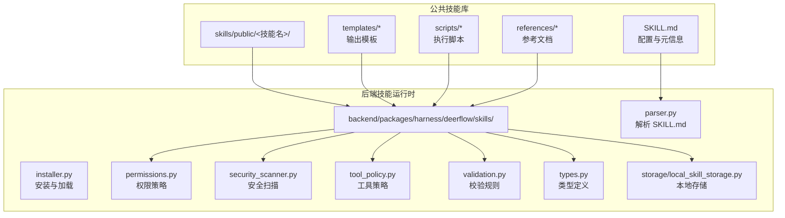
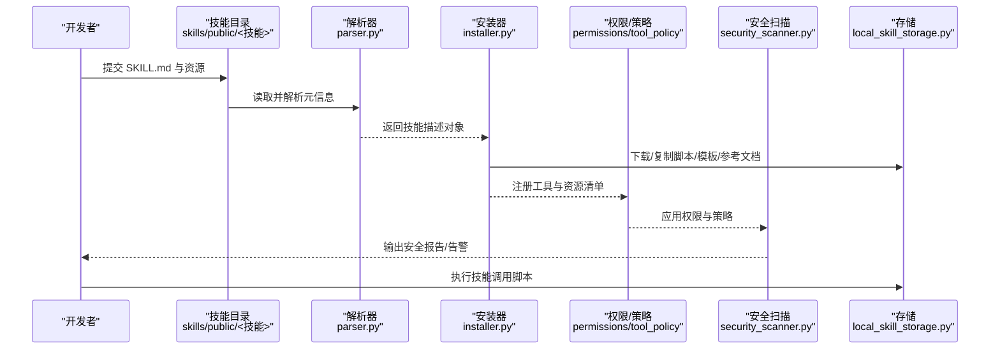
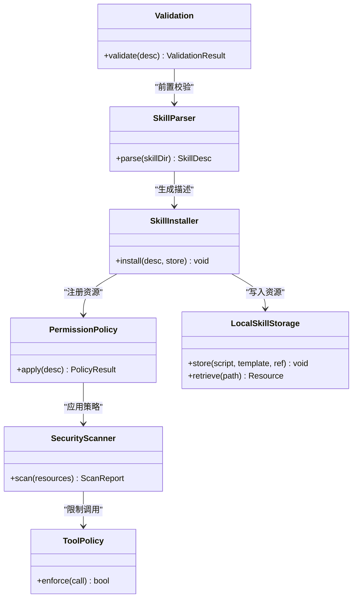
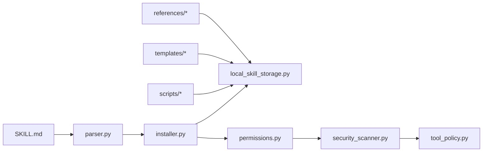

# 技能开发框架

<cite>
**本文引用的文件**
- [SKILL.md（bootstrap）](file://skills/public/bootstrap/SKILL.md)
- [SOUL 模板](file://skills/public/bootstrap/templates/SOUL.template.md)
- [conversation-guide.md（bootstrap）](file://skills/public/bootstrap/references/conversation-guide.md)
- [generate.js（chart-visualization）](file://skills/public/chart-visualization/scripts/generate.js)
- [analyze.py（data-analysis）](file://skills/public/data-analysis/scripts/analyze.py)
- [github_api.py（github-deep-research）](file://skills/public/github-deep-research/scripts/github_api.py)
- [generate.py（image-generation）](file://skills/public/image-generation/scripts/generate.py)
- [tech-explainer.md（podcast-generation）](file://skills/public/podcast-generation/templates/tech-explainer.md)
- [init_skill.py（skill-creator）](file://skills/public/skill-creator/scripts/init_skill.py)
- [quick_validate.py（skill-creator）](file://skills/public/skill-creator/scripts/quick_validate.py)
- [run_eval.py（skill-creator）](file://skills/public/skill-creator/scripts/run_eval.py)
- [generate_report.py（skill-creator）](file://skills/public/skill-creator/scripts/generate_report.py)
- [output-patterns.md（skill-creator）](file://skills/public/skill-creator/references/output-patterns.md)
- [schemas.md（skill-creator）](file://skills/public/skill-creator/references/schemas.md)
- [workflows.md（skill-creator）](file://skills/public/skill-creator/references/workflows.md)
- [evals.json（systematic-literature-review）](file://skills/public/systematic-literature-review/evals/evals.json)
- [trigger_eval_set.json（systematic-literature-review）](file://skills/public/systematic-literature-review/evals/trigger_eval_set.json)
- [local_skill_storage.py](file://backend/packages/harness/deerflow/skills/storage/local_skill_storage.py)
- [installer.py](file://backend/packages/harness/deerflow/skills/installer.py)
- [parser.py](file://backend/packages/harness/deerflow/skills/parser.py)
- [permissions.py](file://backend/packages/harness/deerflow/skills/permissions.py)
- [security_scanner.py](file://backend/packages/harness/deerflow/skills/security_scanner.py)
- [tool_policy.py](file://backend/packages/harness/deerflow/skills/tool_policy.py)
- [validation.py](file://backend/packages/harness/deerflow/skills/validation.py)
- [types.py](file://backend/packages/harness/deerflow/skills/types.py)
- [README.md（技能目录）](file://skills/README.md)
- [README.md（项目根）](file://README.md)
- [CONFIGURATION.md（后端文档）](file://backend/docs/CONFIGURATION.md)
- [ARCHITECTURE.md（后端文档）](file://backend/docs/ARCHITECTURE.md)
- [AUTH_DESIGN.md（后端文档）](file://backend/docs/AUTH_DESIGN.md)
- [MCP_SERVER.md（后端文档）](file://backend/docs/MCP_SERVER.md)
- [PATH_EXAMPLES.md（后端文档）](file://backend/docs/PATH_EXAMPLES.md)
- [API.md（后端文档）](file://backend/docs/API.md)
- [setup_wizard.py](file://scripts/setup_wizard.py)
- [check.py](file://scripts/check.py)
- [doctor.py](file://scripts/doctor.py)
- [start-deerflow.sh](file://scripts/start-deerflow.sh)
- [deploy.sh](file://scripts/deploy.sh)
- [skill-creator/SKILL.md](file://skills/public/skill-creator/SKILL.md)
</cite>

## 目录
1. [简介](#简介)
2. [项目结构](#项目结构)
3. [核心组件](#核心组件)
4. [架构总览](#架构总览)
5. [详细组件分析](#详细组件分析)
6. [依赖关系分析](#依赖关系分析)
7. [性能考虑](#性能考虑)
8. [故障排查指南](#故障排查指南)
9. [结论](#结论)
10. [附录](#附录)

## 简介
本指南面向希望在 DeerFlow 平台上开发“技能”的工程师与产品人员。内容涵盖技能目录结构、配置文件规范、模板系统与脚本工具链，以及从初始化项目到核心逻辑实现、测试验证的完整开发流程。同时总结最佳实践与常见陷阱，帮助团队遵循统一的开发规范。

## 项目结构
DeerFlow 的技能生态由“公共技能库”和“后端技能运行时”两部分组成：
- 公共技能库：位于 skills/public，每个技能以独立目录呈现，包含配置文件、脚本、模板与参考文档。
- 后端技能运行时：位于 backend/packages/harness/deerflow/skills，负责解析、安装、权限校验、安全扫描、策略与类型定义等。

图示来源
- [SKILL.md（bootstrap）](file://skills/public/bootstrap/SKILL.md)
- [local_skill_storage.py](file://backend/packages/harness/deerflow/skills/storage/local_skill_storage.py)
- [installer.py](file://backend/packages/harness/deerflow/skills/installer.py)
- [parser.py](file://backend/packages/harness/deerflow/skills/parser.py)
- [permissions.py](file://backend/packages/harness/deerflow/skills/permissions.py)
- [security_scanner.py](file://backend/packages/harness/deerflow/skills/security_scanner.py)
- [tool_policy.py](file://backend/packages/harness/deerflow/skills/tool_policy.py)
- [validation.py](file://backend/packages/harness/deerflow/skills/validation.py)
- [types.py](file://backend/packages/harness/deerflow/skills/types.py)

章节来源
- [README.md（技能目录）](file://skills/README.md)
- [README.md（项目根）](file://README.md)

## 核心组件
- 解析器（parser.py）：负责解析 SKILL.md 中的元信息与声明，生成可执行的技能描述对象。
- 安装器（installer.py）：根据解析结果下载或复制资源（脚本、模板、参考文档），并注册到运行时。
- 权限策略（permissions.py）：定义技能可访问的工具与资源范围，确保最小权限原则。
- 安全扫描（security_scanner.py）：对脚本与模板进行静态扫描，识别潜在风险。
- 工具策略（tool_policy.py）：约束技能调用外部工具的行为，防止滥用。
- 校验模块（validation.py）：对技能配置与资源进行一致性与完整性校验。
- 类型定义（types.py）：统一技能相关的数据结构与枚举。
- 存储（storage/local_skill_storage.py）：提供技能资源的本地持久化与检索能力。

章节来源
- [parser.py](file://backend/packages/harness/deerflow/skills/parser.py)
- [installer.py](file://backend/packages/harness/deerflow/skills/installer.py)
- [permissions.py](file://backend/packages/harness/deerflow/skills/permissions.py)
- [security_scanner.py](file://backend/packages/harness/deerflow/skills/security_scanner.py)
- [tool_policy.py](file://backend/packages/harness/deerflow/skills/tool_policy.py)
- [validation.py](file://backend/packages/harness/deerflow/skills/validation.py)
- [types.py](file://backend/packages/harness/deerflow/skills/types.py)
- [local_skill_storage.py](file://backend/packages/harness/deerflow/skills/storage/local_skill_storage.py)

## 架构总览
下图展示了从“技能目录”到“后端运行时”的整体交互流程，包括解析、安装、策略与安全检查、存储与执行。

图示来源
- [parser.py](file://backend/packages/harness/deerflow/skills/parser.py)
- [installer.py](file://backend/packages/harness/deerflow/skills/installer.py)
- [permissions.py](file://backend/packages/harness/deerflow/skills/permissions.py)
- [security_scanner.py](file://backend/packages/harness/deerflow/skills/security_scanner.py)
- [local_skill_storage.py](file://backend/packages/harness/deerflow/skills/storage/local_skill_storage.py)

## 详细组件分析

### 组件一：技能目录结构与配置规范
- 必需文件
  - SKILL.md：技能元信息与声明，用于驱动解析与安装。
- 可选目录
  - scripts：存放技能执行脚本（如 Python/JS/Shell）。
  - templates：存放输出模板（Markdown/HTML 等）。
  - references：存放参考文档（如 SOP、工作流、模式等）。
- 示例参考
  - bootstrap：包含模板与对话指南，适合初学者快速上手。
  - chart-visualization：包含图表生成脚本。
  - data-analysis：包含数据分析脚本。
  - github-deep-research：包含 GitHub API 调用脚本与报告模板。
  - image-generation：包含图像生成脚本与模板。
  - podcast-generation：包含播客生成脚本与模板。
  - systematic-literature-review：包含评估集与模板。
  - skill-creator：包含初始化、校验、评测与报告生成脚本，以及参考文档。

章节来源
- [SKILL.md（bootstrap）](file://skills/public/bootstrap/SKILL.md)
- [SOUL 模板](file://skills/public/bootstrap/templates/SOUL.template.md)
- [conversation-guide.md（bootstrap）](file://skills/public/bootstrap/references/conversation-guide.md)
- [generate.js（chart-visualization）](file://skills/public/chart-visualization/scripts/generate.js)
- [analyze.py（data-analysis）](file://skills/public/data-analysis/scripts/analyze.py)
- [github_api.py（github-deep-research）](file://skills/public/github-deep-research/scripts/github_api.py)
- [generate.py（image-generation）](file://skills/public/image-generation/scripts/generate.py)
- [tech-explainer.md（podcast-generation）](file://skills/public/podcast-generation/templates/tech-explainer.md)
- [evals.json（systematic-literature-review）](file://skills/public/systematic-literature-review/evals/evals.json)
- [trigger_eval_set.json（systematic-literature-review）](file://skills/public/systematic-literature-review/evals/trigger_eval_set.json)

### 组件二：模板系统
- 模板位置：skills/public/<技能>/templates
- 作用：标准化输出格式，便于前端渲染与用户阅读。
- 使用建议：
  - 为不同输出场景准备多套模板（如报告、摘要、可视化说明）。
  - 在 SKILL.md 中声明模板映射与参数约定。
  - 结合脚本动态填充变量，避免硬编码。

章节来源
- [SOUL 模板](file://skills/public/bootstrap/templates/SOUL.template.md)
- [tech-explainer.md（podcast-generation）](file://skills/public/podcast-generation/templates/tech-explainer.md)

### 组件三：脚本与工具链
- 脚本位置：skills/public/<技能>/scripts
- 建议：
  - 将复杂逻辑拆分为多个小脚本，便于测试与复用。
  - 明确输入/输出约定，便于在运行时编排。
  - 对外部 API 调用添加重试与错误处理。
- 示例脚本：
  - 图表生成：generate.js
  - 数据分析：analyze.py
  - GitHub 检索：github_api.py
  - 图像生成：generate.py

章节来源
- [generate.js（chart-visualization）](file://skills/public/chart-visualization/scripts/generate.js)
- [analyze.py（data-analysis）](file://skills/public/data-analysis/scripts/analyze.py)
- [github_api.py（github-deep-research）](file://skills/public/github-deep-research/scripts/github_api.py)
- [generate.py（image-generation）](file://skills/public/image-generation/scripts/generate.py)

### 组件四：参考文档与工作流
- references 目录用于沉淀知识资产，如 SOP、工作流、模式等。
- 建议：
  - 将对话指南、输出模式、Schema 作为参考文档长期维护。
  - 在 SKILL.md 中引用关键参考，形成闭环。

章节来源
- [conversation-guide.md（bootstrap）](file://skills/public/bootstrap/references/conversation-guide.md)
- [output-patterns.md（skill-creator）](file://skills/public/skill-creator/references/output-patterns.md)
- [schemas.md（skill-creator）](file://skills/public/skill-creator/references/schemas.md)
- [workflows.md（skill-creator）](file://skills/public/skill-creator/references/workflows.md)

### 组件五：后端技能运行时
- 解析与安装
  - 解析 SKILL.md，生成技能描述对象。
  - 安装脚本、模板与参考文档至本地存储。
- 策略与安全
  - 应用权限策略与工具策略，限制危险操作。
  - 运行安全扫描，输出风险报告。
- 类型与校验
  - 使用统一类型定义，确保配置一致性。
  - 执行完整性与语义校验。

图示来源
- [parser.py](file://backend/packages/harness/deerflow/skills/parser.py)
- [installer.py](file://backend/packages/harness/deerflow/skills/installer.py)
- [permissions.py](file://backend/packages/harness/deerflow/skills/permissions.py)
- [security_scanner.py](file://backend/packages/harness/deerflow/skills/security_scanner.py)
- [tool_policy.py](file://backend/packages/harness/deerflow/skills/tool_policy.py)
- [validation.py](file://backend/packages/harness/deerflow/skills/validation.py)
- [types.py](file://backend/packages/harness/deerflow/skills/types.py)
- [local_skill_storage.py](file://backend/packages/harness/deerflow/skills/storage/local_skill_storage.py)

## 依赖关系分析
- 文件耦合
  - skills/public/<技能>/SKILL.md 是入口，驱动 backend 的解析与安装。
  - scripts 与 templates 通过安装器写入本地存储，供运行时调用。
- 外部依赖
  - 大多数技能脚本依赖标准库与第三方库（如 requests、numpy、pandas 等），需在沙箱环境中受控执行。
- 循环依赖
  - 当前结构采用单向依赖：前端/脚本依赖后端运行时；后端运行时不反向依赖技能内容。

图示来源
- [SKILL.md（bootstrap）](file://skills/public/bootstrap/SKILL.md)
- [parser.py](file://backend/packages/harness/deerflow/skills/parser.py)
- [installer.py](file://backend/packages/harness/deerflow/skills/installer.py)
- [permissions.py](file://backend/packages/harness/deerflow/skills/permissions.py)
- [security_scanner.py](file://backend/packages/harness/deerflow/skills/security_scanner.py)
- [tool_policy.py](file://backend/packages/harness/deerflow/skills/tool_policy.py)
- [local_skill_storage.py](file://backend/packages/harness/deerflow/skills/storage/local_skill_storage.py)

## 性能考虑
- 资源加载
  - 尽量将大型模板与脚本按需加载，避免一次性全量读取。
- 执行效率
  - 对耗时任务（如网络请求、文件处理）使用异步或并发策略，并设置超时与重试。
- 存储优化
  - 利用本地存储缓存常用资源，减少重复安装与 IO。
- 安全与性能平衡
  - 安全扫描与策略检查会带来额外开销，应在 CI/CD 中预检，上线后按需启用严格模式。

## 故障排查指南
- 常见问题
  - SKILL.md 格式不正确：检查字段是否齐全、语法是否符合预期。
  - 脚本执行失败：查看日志与返回码，确认环境变量与依赖已就绪。
  - 模板渲染异常：核对模板变量与传参，确保无未定义键。
  - 权限被拒：检查权限策略与工具策略，确认调用范围在白名单内。
- 排查工具
  - 后端内置校验与安全扫描报告可用于定位问题。
  - 使用 quick_validate.py 与 run_eval.py 在本地快速验证技能行为。

章节来源
- [quick_validate.py（skill-creator）](file://skills/public/skill-creator/scripts/quick_validate.py)
- [run_eval.py（skill-creator）](file://skills/public/skill-creator/scripts/run_eval.py)
- [doctor.py](file://scripts/doctor.py)
- [check.py](file://scripts/check.py)

## 结论
通过规范化的技能目录结构、严谨的解析与安装流程、完善的权限与安全策略，以及可复用的模板与脚本工具链，DeerFlow 为技能开发提供了高内聚、低耦合的工程化支撑。遵循本文档的流程与最佳实践，可显著提升开发效率与质量。

## 附录

### 开发流程（从零到一）
- 初始化项目
  - 使用 skill-creator 的初始化脚本生成基础目录与骨架。
  - 编写 SKILL.md，明确功能、输入/输出与依赖。
- 实现核心逻辑
  - 在 scripts 目录中实现具体算法或调用外部服务。
  - 在 templates 目录中准备输出模板。
- 测试与验证
  - 使用 quick_validate.py 与 run_eval.py 在本地验证。
  - 产出评估报告，持续迭代。
- 发布与集成
  - 通过安装器将资源注册到后端运行时。
  - 在生产环境启用安全扫描与策略检查。

章节来源
- [init_skill.py（skill-creator）](file://skills/public/skill-creator/scripts/init_skill.py)
- [quick_validate.py（skill-creator）](file://skills/public/skill-creator/scripts/quick_validate.py)
- [run_eval.py（skill-creator）](file://skills/public/skill-creator/scripts/run_eval.py)
- [generate_report.py（skill-creator）](file://skills/public/skill-creator/scripts/generate_report.py)
- [installer.py](file://backend/packages/harness/deerflow/skills/installer.py)

### 最佳实践
- 配置优先：先写 SKILL.md，再实现脚本，最后补充模板与参考文档。
- 分而治之：将复杂流程拆分为多个小脚本，便于测试与演进。
- 文档闭环：在 references 中沉淀 SOP、模式与 Schema，形成知识资产。
- 安全第一：默认启用严格权限与策略，仅在必要时放宽。
- 可观测性：为脚本输出结构化日志，便于追踪与审计。

### 常见陷阱
- 忽视输入校验：导致运行时异常或安全风险。
- 模板变量缺失：渲染失败或输出不符合预期。
- 权限越界：调用未授权工具或访问受限资源。
- 依赖漂移：未锁定版本导致环境差异引发问题。
- 缺少评估：未在发布前进行充分评测与回归。