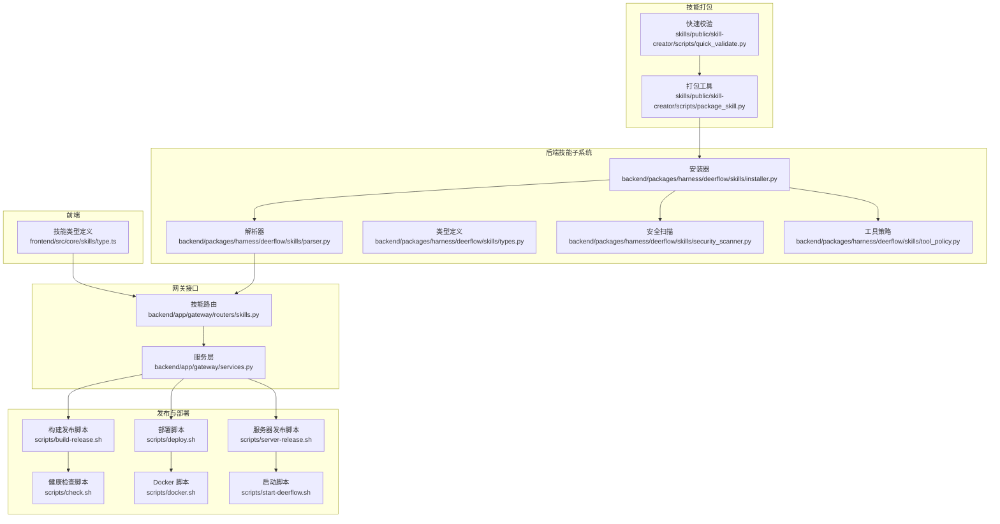
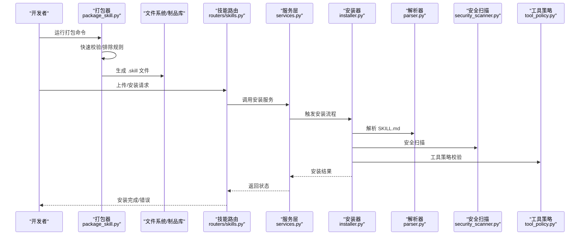
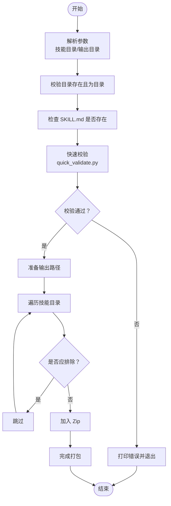
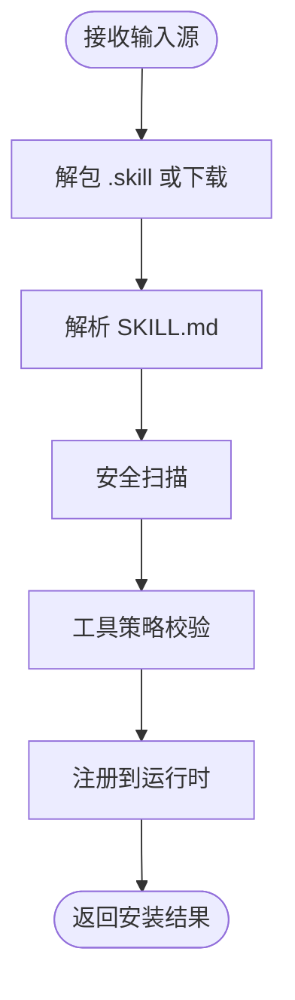
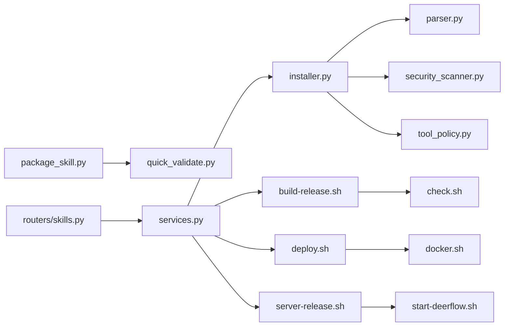

# 技能打包与分发

<cite>
**本文引用的文件**
- [skills/public/skill-creator/scripts/package_skill.py](file://skills/public/skill-creator/scripts/package_skill.py)
- [skills/public/skill-creator/scripts/quick_validate.py](file://skills/public/skill-creator/scripts/quick_validate.py)
- [backend/packages/harness/deerflow/skills/installer.py](file://backend/packages/harness/deerflow/skills/installer.py)
- [backend/packages/harness/deerflow/skills/parser.py](file://backend/packages/harness/deerflow/skills/parser.py)
- [backend/packages/harness/deerflow/skills/types.py](file://backend/packages/harness/deerflow/skills/types.py)
- [backend/packages/harness/deerflow/skills/security_scanner.py](file://backend/packages/harness/deerflow/skills/security_scanner.py)
- [backend/packages/harness/deerflow/skills/tool_policy.py](file://backend/packages/harness/deerflow/skills/tool_policy.py)
- [backend/app/gateway/routers/skills.py](file://backend/app/gateway/routers/skills.py)
- [backend/app/gateway/services.py](file://backend/app/gateway/services.py)
- [scripts/build-release.sh](file://scripts/build-release.sh)
- [scripts/deploy.sh](file://scripts/deploy.sh)
- [scripts/server-release.sh](file://scripts/server-release.sh)
- [scripts/check.sh](file://scripts/check.sh)
- [scripts/docker.sh](file://scripts/docker.sh)
- [scripts/start-deerflow.sh](file://scripts/start-deerflow.sh)
- [Install.md](file://Install.md)
- [README.md](file://README.md)
- [docs/operations/BUILD_AND_DEPLOY.md](file://docs/operations/BUILD_AND_DEPLOY.md)
- [docs/operations/USE_GUIDE.md](file://docs/operations/USE_GUIDE.md)
- [docs/changelog/code_change_summary/skills.md](file://docs/changelog/code_change_summary/skills.md)
</cite>

## 目录
1. [简介](#简介)
2. [项目结构](#项目结构)
3. [核心组件](#核心组件)
4. [架构总览](#架构总览)
5. [详细组件分析](#详细组件分析)
6. [依赖关系分析](#依赖关系分析)
7. [性能考虑](#性能考虑)
8. [故障排查指南](#故障排查指南)
9. [结论](#结论)
10. [附录](#附录)

## 简介
本指南面向开发者与运维人员，系统性介绍 DeerFlow 技能的打包与分发流程，覆盖从代码整理、依赖管理到压缩打包的全过程；详述技能分发的标准流程（版本管理、发布渠道、分发策略）；提供技能安装器的使用方法（本地安装、远程安装、批量部署）；总结技能版本控制最佳实践（语义化版本、兼容性测试、回滚机制）；并给出技能市场发布的流程与要求，以及技能维护与更新的管理策略。

## 项目结构
技能相关能力主要分布在以下位置：
- 前端技能类型定义：frontend/src/core/skills/type.ts
- 技能打包工具：skills/public/skill-creator/scripts/package_skill.py
- 技能验证工具：skills/public/skill-creator/scripts/quick_validate.py
- 后端技能安装器与解析器：backend/packages/harness/deerflow/skills/*
- 技能路由与服务：backend/app/gateway/routers/skills.py、backend/app/gateway/services.py
- 发布与部署脚本：scripts/*.sh
- 文档与说明：docs/、Install.md、README.md

图表来源
- [skills/public/skill-creator/scripts/package_skill.py:1-136](file://skills/public/skill-creator/scripts/package_skill.py#L1-L136)
- [skills/public/skill-creator/scripts/quick_validate.py](file://skills/public/skill-creator/scripts/quick_validate.py)
- [backend/packages/harness/deerflow/skills/installer.py](file://backend/packages/harness/deerflow/skills/installer.py)
- [backend/packages/harness/deerflow/skills/parser.py](file://backend/packages/harness/deerflow/skills/parser.py)
- [backend/packages/harness/deerflow/skills/types.py](file://backend/packages/harness/deerflow/skills/types.py)
- [backend/packages/harness/deerflow/skills/security_scanner.py](file://backend/packages/harness/deerflow/skills/security_scanner.py)
- [backend/packages/harness/deerflow/skills/tool_policy.py](file://backend/packages/harness/deerflow/skills/tool_policy.py)
- [backend/app/gateway/routers/skills.py](file://backend/app/gateway/routers/skills.py)
- [backend/app/gateway/services.py](file://backend/app/gateway/services.py)
- [scripts/build-release.sh](file://scripts/build-release.sh)
- [scripts/deploy.sh](file://scripts/deploy.sh)
- [scripts/server-release.sh](file://scripts/server-release.sh)
- [scripts/check.sh](file://scripts/check.sh)
- [scripts/docker.sh](file://scripts/docker.sh)
- [scripts/start-deerflow.sh](file://scripts/start-deerflow.sh)

章节来源
- [README.md](file://README.md)
- [Install.md](file://Install.md)

## 核心组件
- 技能打包器：将技能目录打包为 .skill 文件（Zip），内置排除规则与预检校验。
- 技能安装器：负责解包、解析、安全扫描、权限与工具策略校验，并注册到运行时。
- 技能解析器：读取 SKILL.md 并解析元信息与执行配置。
- 技能类型与策略：统一技能数据结构与工具调用策略。
- 网关路由与服务：对外提供技能安装、查询、卸载等接口。
- 发布与部署脚本：自动化构建、健康检查、容器化与启动流程。

章节来源
- [skills/public/skill-creator/scripts/package_skill.py:1-136](file://skills/public/skill-creator/scripts/package_skill.py#L1-L136)
- [skills/public/skill-creator/scripts/quick_validate.py](file://skills/public/skill-creator/scripts/quick_validate.py)
- [backend/packages/harness/deerflow/skills/installer.py](file://backend/packages/harness/deerflow/skills/installer.py)
- [backend/packages/harness/deerflow/skills/parser.py](file://backend/packages/harness/deerflow/skills/parser.py)
- [backend/packages/harness/deerflow/skills/types.py](file://backend/packages/harness/deerflow/skills/types.py)
- [backend/packages/harness/deerflow/skills/security_scanner.py](file://backend/packages/harness/deerflow/skills/security_scanner.py)
- [backend/packages/harness/deerflow/skills/tool_policy.py](file://backend/packages/harness/deerflow/skills/tool_policy.py)
- [backend/app/gateway/routers/skills.py](file://backend/app/gateway/routers/skills.py)
- [backend/app/gateway/services.py](file://backend/app/gateway/services.py)

## 架构总览
下图展示从“技能打包”到“运行时加载”的端到端流程，以及与“发布与部署”的衔接。

图表来源
- [skills/public/skill-creator/scripts/package_skill.py:42-108](file://skills/public/skill-creator/scripts/package_skill.py#L42-L108)
- [backend/app/gateway/routers/skills.py](file://backend/app/gateway/routers/skills.py)
- [backend/app/gateway/services.py](file://backend/app/gateway/services.py)
- [backend/packages/harness/deerflow/skills/installer.py](file://backend/packages/harness/deerflow/skills/installer.py)
- [backend/packages/harness/deerflow/skills/parser.py](file://backend/packages/harness/deerflow/skills/parser.py)
- [backend/packages/harness/deerflow/skills/security_scanner.py](file://backend/packages/harness/deerflow/skills/security_scanner.py)
- [backend/packages/harness/deerflow/skills/tool_policy.py](file://backend/packages/harness/deerflow/skills/tool_policy.py)

## 详细组件分析

### 技能打包器（package_skill.py）
- 功能职责
  - 将技能目录打包为 .skill 文件（Zip 格式），内置排除规则（如缓存目录、临时文件、根目录特定目录等）。
  - 打包前执行快速校验，确保关键文件存在且符合基本规范。
- 关键流程
  - 参数解析与输出路径确定
  - 校验 SKILL.md 存在性
  - 调用快速校验模块进行预检
  - 遍历目录，按排除规则写入 Zip
  - 输出成功或失败信息

图表来源
- [skills/public/skill-creator/scripts/package_skill.py:27-108](file://skills/public/skill-creator/scripts/package_skill.py#L27-L108)
- [skills/public/skill-creator/scripts/quick_validate.py](file://skills/public/skill-creator/scripts/quick_validate.py)

章节来源
- [skills/public/skill-creator/scripts/package_skill.py:1-136](file://skills/public/skill-creator/scripts/package_skill.py#L1-L136)

### 技能安装器（installer.py）
- 功能职责
  - 接收 .skill 文件或远程源，执行解包、解析、安全扫描与策略校验，最终注册到运行时。
- 关键流程
  - 接收输入源（本地文件/URL）
  - 解包与目标路径选择
  - 调用解析器读取元信息
  - 安全扫描与工具策略校验
  - 注册到技能存储与运行时

图表来源
- [backend/packages/harness/deerflow/skills/installer.py](file://backend/packages/harness/deerflow/skills/installer.py)
- [backend/packages/harness/deerflow/skills/parser.py](file://backend/packages/harness/deerflow/skills/parser.py)
- [backend/packages/harness/deerflow/skills/security_scanner.py](file://backend/packages/harness/deerflow/skills/security_scanner.py)
- [backend/packages/harness/deerflow/skills/tool_policy.py](file://backend/packages/harness/deerflow/skills/tool_policy.py)

章节来源
- [backend/packages/harness/deerflow/skills/installer.py](file://backend/packages/harness/deerflow/skills/installer.py)

### 技能解析器与类型（parser.py、types.py）
- 功能职责
  - 解析 SKILL.md 获取技能元信息与执行配置。
  - 统一技能数据结构，便于后续安装与运行时处理。
- 关键点
  - 元信息字段标准化（名称、描述、类别、许可证、启用状态等）
  - 执行配置解析（脚本、模板、参考文档等）

章节来源
- [backend/packages/harness/deerflow/skills/parser.py](file://backend/packages/harness/deerflow/skills/parser.py)
- [backend/packages/harness/deerflow/skills/types.py](file://backend/packages/harness/deerflow/skills/types.py)

### 安全扫描与工具策略（security_scanner.py、tool_policy.py）
- 功能职责
  - 安全扫描：识别潜在风险内容（如可疑脚本、不安全路径等）。
  - 工具策略：限制或允许特定工具调用，保障运行时安全。
- 关键点
  - 与安装器串联，在安装阶段强制执行。

章节来源
- [backend/packages/harness/deerflow/skills/security_scanner.py](file://backend/packages/harness/deerflow/skills/security_scanner.py)
- [backend/packages/harness/deerflow/skills/tool_policy.py](file://backend/packages/harness/deerflow/skills/tool_policy.py)

### 网关路由与服务（routers/skills.py、services.py）
- 功能职责
  - 对外暴露技能安装、查询、卸载等接口。
  - 协调安装器与存储，返回标准响应。
- 关键点
  - 请求参数校验与异常处理
  - 与安装器/解析器/安全扫描器协作

章节来源
- [backend/app/gateway/routers/skills.py](file://backend/app/gateway/routers/skills.py)
- [backend/app/gateway/services.py](file://backend/app/gateway/services.py)

## 依赖关系分析
- 打包器依赖快速校验模块，确保质量门槛。
- 安装器依赖解析器、安全扫描器与工具策略，形成“安装即审”的闭环。
- 网关路由与服务作为入口，串联安装器与后端基础设施。
- 发布与部署脚本提供自动化构建、健康检查与容器化支持。

图表来源
- [skills/public/skill-creator/scripts/package_skill.py:17-17](file://skills/public/skill-creator/scripts/package_skill.py#L17-L17)
- [skills/public/skill-creator/scripts/quick_validate.py](file://skills/public/skill-creator/scripts/quick_validate.py)
- [backend/app/gateway/routers/skills.py](file://backend/app/gateway/routers/skills.py)
- [backend/app/gateway/services.py](file://backend/app/gateway/services.py)
- [backend/packages/harness/deerflow/skills/installer.py](file://backend/packages/harness/deerflow/skills/installer.py)
- [backend/packages/harness/deerflow/skills/parser.py](file://backend/packages/harness/deerflow/skills/parser.py)
- [backend/packages/harness/deerflow/skills/security_scanner.py](file://backend/packages/harness/deerflow/skills/security_scanner.py)
- [backend/packages/harness/deerflow/skills/tool_policy.py](file://backend/packages/harness/deerflow/skills/tool_policy.py)
- [scripts/build-release.sh](file://scripts/build-release.sh)
- [scripts/deploy.sh](file://scripts/deploy.sh)
- [scripts/server-release.sh](file://scripts/server-release.sh)
- [scripts/check.sh](file://scripts/check.sh)
- [scripts/docker.sh](file://scripts/docker.sh)
- [scripts/start-deerflow.sh](file://scripts/start-deerflow.sh)

## 性能考虑
- 打包阶段
  - 使用 Zip 压缩减少传输体积，建议在 CI 中缓存未变更的依赖以加速构建。
  - 排除规则避免打包无关文件，降低体积与安装时间。
- 安装阶段
  - 安全扫描与策略校验应尽量并行化，避免阻塞主流程。
  - 大型技能可采用增量安装或分块校验，提升用户体验。
- 运行阶段
  - 技能存储与运行时注册应使用异步队列，避免阻塞主线程。
  - 对频繁访问的技能进行缓存与预热，减少冷启动开销。

## 故障排查指南
- 打包失败
  - 检查 SKILL.md 是否存在且格式正确。
  - 查看排除规则是否误删必要文件。
  - 确认输出目录权限与磁盘空间充足。
- 安装失败
  - 查看安全扫描与工具策略日志，确认是否存在违规项。
  - 检查网络连通性（远程安装场景）。
  - 确认目标运行时版本与技能兼容。
- 接口异常
  - 检查网关路由与服务日志，定位具体错误。
  - 使用健康检查脚本（scripts/check.sh）验证服务状态。
- 部署问题
  - 使用部署脚本（scripts/deploy.sh）与容器脚本（scripts/docker.sh）核对环境变量与配置。
  - 通过服务器发布脚本（scripts/server-release.sh）与启动脚本（scripts/start-deerflow.sh）确认进程状态。

章节来源
- [scripts/check.sh](file://scripts/check.sh)
- [scripts/deploy.sh](file://scripts/deploy.sh)
- [scripts/docker.sh](file://scripts/docker.sh)
- [scripts/server-release.sh](file://scripts/server-release.sh)
- [scripts/start-deerflow.sh](file://scripts/start-deerflow.sh)

## 结论
通过“打包器—安装器—解析器—安全扫描—工具策略—网关服务”的完整链路，DeerFlow 实现了从开发到运行的闭环技能分发。结合自动化脚本与标准化流程，开发者可以高效地完成技能打包、安装与发布，并在生产环境中保持稳定性与安全性。

## 附录

### 技能打包完整流程
- 代码整理
  - 确保 SKILL.md 存在且描述完整。
  - 清理缓存与临时文件，遵循排除规则。
- 依赖管理
  - 在技能内声明所需外部资源与许可。
  - 避免打包不必要的第三方依赖，减小体积。
- 压缩打包
  - 使用打包器生成 .skill 文件，确保预检通过。
  - 校验产物完整性与可安装性。

章节来源
- [skills/public/skill-creator/scripts/package_skill.py:42-108](file://skills/public/skill-creator/scripts/package_skill.py#L42-L108)
- [skills/public/skill-creator/scripts/quick_validate.py](file://skills/public/skill-creator/scripts/quick_validate.py)

### 技能分发标准流程
- 版本管理
  - 采用语义化版本（SemVer），在 SKILL.md 中记录版本号与变更摘要。
  - 变更日志集中于 docs/changelog/code_change_summary/skills.md。
- 发布渠道
  - 内部制品库：用于灰度与回归测试。
  - 外部市场：面向用户发布的正式版本。
- 分发策略
  - 按需推送至不同环境（开发/测试/生产）。
  - 提供批量安装与回滚策略。

章节来源
- [docs/changelog/code_change_summary/skills.md](file://docs/changelog/code_change_summary/skills.md)
- [docs/operations/BUILD_AND_DEPLOY.md](file://docs/operations/BUILD_AND_DEPLOY.md)

### 技能安装器使用指南
- 本地安装
  - 通过网关路由提交本地 .skill 文件路径，触发安装流程。
- 远程安装
  - 提交可访问的 URL，安装器自动下载并安装。
- 批量部署
  - 编排多个安装请求，结合健康检查脚本（scripts/check.sh）监控状态。

章节来源
- [backend/app/gateway/routers/skills.py](file://backend/app/gateway/routers/skills.py)
- [backend/app/gateway/services.py](file://backend/app/gateway/services.py)
- [scripts/check.sh](file://scripts/check.sh)

### 技能版本控制最佳实践
- 语义化版本
  - 主版本：破坏性变更
  - 次版本：向后兼容的功能新增
  - 修订版本：向后兼容的问题修复
- 兼容性测试
  - 在不同运行时版本上验证技能行为一致性。
- 回滚机制
  - 记录每次安装的快照与版本号，支持一键回退。

章节来源
- [docs/operations/BUILD_AND_DEPLOY.md](file://docs/operations/BUILD_AND_DEPLOY.md)

### 技能市场发布要求与流程
- 发布要求
  - 完整的 SKILL.md 描述、许可证与最小依赖清单。
  - 通过安全扫描与工具策略校验。
- 发布流程
  - 本地打包并通过预检。
  - 提交至市场审核，审核通过后公开发布。

章节来源
- [backend/packages/harness/deerflow/skills/security_scanner.py](file://backend/packages/harness/deerflow/skills/security_scanner.py)
- [backend/packages/harness/deerflow/skills/tool_policy.py](file://backend/packages/harness/deerflow/skills/tool_policy.py)

### 技能维护与更新管理策略
- 更新策略
  - 优先向后兼容，提供迁移指引与过渡期。
  - 重要更新采用灰度发布，逐步扩大范围。
- 维护策略
  - 建立定期巡检与健康检查机制。
  - 通过变更日志与发布说明沉淀经验。

章节来源
- [docs/operations/USE_GUIDE.md](file://docs/operations/USE_GUIDE.md)
- [docs/changelog/code_change_summary/skills.md](file://docs/changelog/code_change_summary/skills.md)