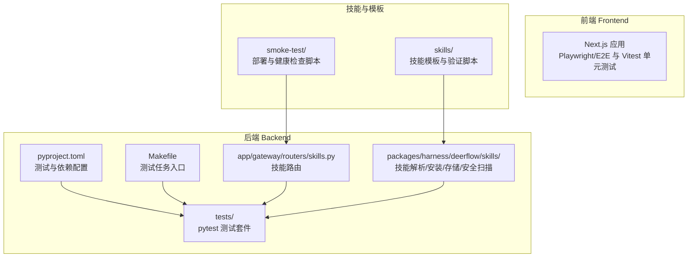
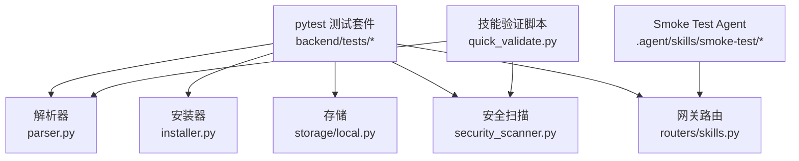
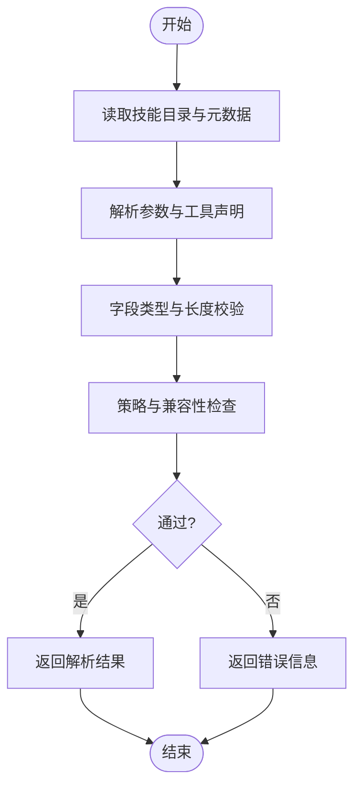
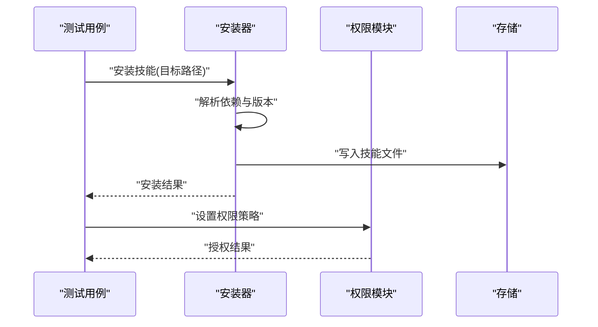
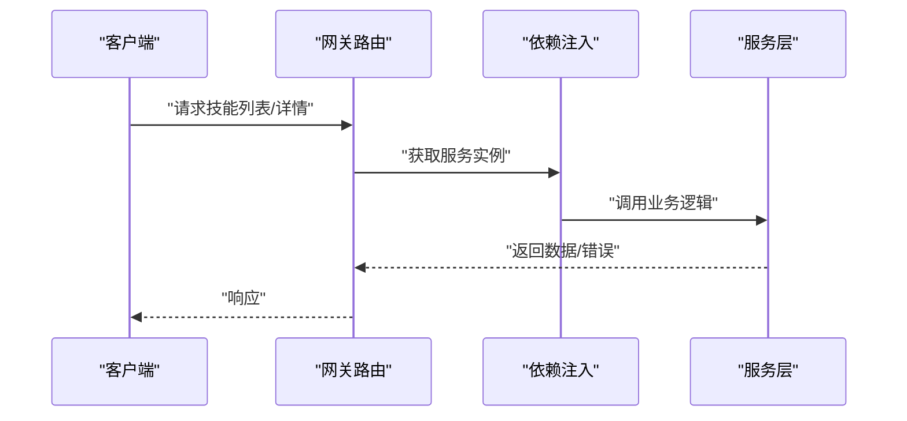
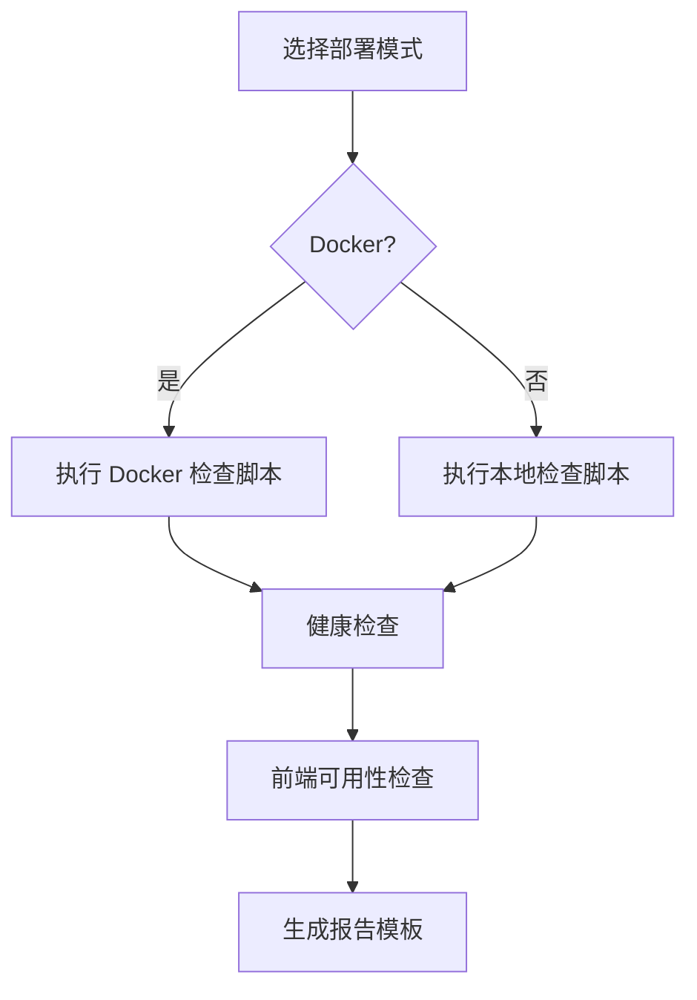
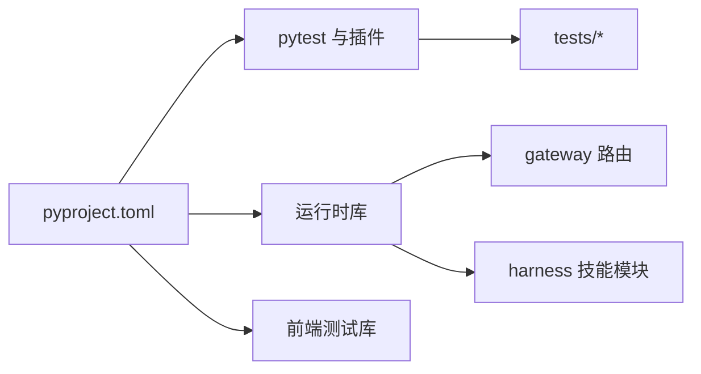

# 技能测试与调试

<cite>
**本文引用的文件**
- [backend/pyproject.toml](file://backend/pyproject.toml)
- [backend/Makefile](file://backend/Makefile)
- [backend/README.md](file://backend/README.md)
- [backend/tests/conftest.py](file://backend/tests/conftest.py)
- [backend/tests/test_skills_loader.py](file://backend/tests/test_skills_loader.py)
- [backend/tests/test_skills_parser.py](file://backend/tests/test_skills_parser.py)
- [backend/tests/test_skills_validation.py](file://backend/tests/test_skills_validation.py)
- [backend/tests/test_skills_installer.py](file://backend/tests/test_skills_installer.py)
- [backend/tests/test_skills_custom_router.py](file://backend/tests/test_skills_custom_router.py)
- [backend/tests/test_skills_archive_root.py](file://backend/tests/test_skills_archive_root.py)
- [backend/tests/test_skills_bundled.py](file://backend/tests/test_skills_bundled.py)
- [backend/tests/test_skills_manage_tool.py](file://backend/tests/test_skills_manage_tool.py)
- [backend/tests/test_skills_permissions.py](file://backend/tests/test_skills_permissions.py)
- [backend/tests/test_skills_storage_write.py](file://backend/tests/test_skills_storage_write.py)
- [backend/packages/harness/deerflow/skills/parser.py](file://backend/packages/harness/deerflow/skills/parser.py)
- [backend/packages/harness/deerflow/skills/types.py](file://backend/packages/harness/deerflow/skills/types.py)
- [backend/packages/harness/deerflow/skills/installer.py](file://backend/packages/harness/deerflow/skills/installer.py)
- [backend/packages/harness/deerflow/skills/security_scanner.py](file://backend/packages/harness/deerflow/skills/security_scanner.py)
- [backend/packages/harness/deerflow/skills/tool_policy.py](file://backend/packages/harness/deerflow/skills/tool_policy.py)
- [backend/packages/harness/deerflow/skills/storage/local.py](file://backend/packages/harness/deerflow/skills/storage/local.py)
- [backend/app/gateway/routers/skills.py](file://backend/app/gateway/routers/skills.py)
- [backend/app/gateway/services.py](file://backend/app/gateway/services.py)
- [backend/app/gateway/deps.py](file://backend/app/gateway/deps.py)
- [backend/app/gateway/utils.py](file://backend/app/gateway/utils.py)
- [.agent/skills/smoke-test/SKILL.md](file://.agent/skills/smoke-test/SKILL.md)
- [.agent/skills/smoke-test/references/SOP.md](file://.agent/skills/smoke-test/references/SOP.md)
- [.agent/skills/smoke-test/references/troubleshooting.md](file://.agent/skills/smoke-test/references/troubleshooting.md)
- [.agent/skills/smoke-test/scripts/check_docker.sh](file://.agent/skills/smoke-test/scripts/check_docker.sh)
- [.agent/skills/smoke-test/scripts/check_local_env.sh](file://.agent/skills/smoke-test/scripts/check_local_env.sh)
- [.agent/skills/smoke-test/scripts/deploy_docker.sh](file://.agent/skills/smoke-test/scripts/deploy_docker.sh)
- [.agent/skills/smoke-test/scripts/deploy_local.sh](file://.agent/skills/smoke-test/scripts/deploy_local.sh)
- [.agent/skills/smoke-test/scripts/frontend_check.sh](file://.agent/skills/smoke-test/scripts/frontend_check.sh)
- [.agent/skills/smoke-test/scripts/health_check.sh](file://.agent/skills/smoke-test/scripts/health_check.sh)
- [.agent/skills/smoke-test/scripts/pull_code.sh](file://.agent/skills/smoke-test/scripts/pull_code.sh)
- [skills/public/skill-creator/scripts/quick_validate.py](file://skills/public/skill-creator/scripts/quick_validate.py)
- [skills/public/skill-creator/SKILL.md](file://skills/public/skill-creator/SKILL.md)
- [skills/public/code-documentation/SKILL.md](file://skills/public/code-documentation/SKILL.md)
- [scripts/doctor.py](file://scripts/doctor.py)
- [scripts/tool-error-degradation-detection.sh](file://scripts/tool-error-degradation-detection.sh)
- [backend/docs/AUTH_TEST_PLAN.md](file://backend/docs/AUTH_TEST_PLAN.md)
- [backend/docs/AUTH_TEST_DOCKER_GAP.md](file://backend/docs/AUTH_TEST_DOCKER_GAP.md)
</cite>

## 目录
1. [简介](#简介)
2. [项目结构](#项目结构)
3. [核心组件](#核心组件)
4. [架构总览](#架构总览)
5. [详细组件分析](#详细组件分析)
6. [依赖关系分析](#依赖关系分析)
7. [性能考虑](#性能考虑)
8. [故障排查指南](#故障排查指南)
9. [结论](#结论)
10. [附录](#附录)

## 简介
本指南面向 DeerFlow 技能（Skill）开发与维护团队，系统性地给出从单元测试、集成测试到性能测试的完整流程，以及调试工具的使用方法（日志分析、错误追踪、性能分析）。同时提供技能测试最佳实践、常见问题诊断与修复建议，并明确测试覆盖率与质量标准，以保障技能代码的质量与稳定性。

## 项目结构
DeerFlow 后端采用 Python/FastAPI 构建，测试框架基于 pytest；技能相关逻辑集中在后端 harness 包与网关路由中；前端使用 Next.js 并包含端到端与单元测试配置；技能模板与验证脚本位于 skills 目录；Smoke Test Agent 提供部署与健康检查脚本。

图示来源
- [backend/pyproject.toml](file://backend/pyproject.toml)
- [backend/Makefile](file://backend/Makefile)
- [backend/tests/conftest.py](file://backend/tests/conftest.py)
- [backend/app/gateway/routers/skills.py](file://backend/app/gateway/routers/skills.py)
- [backend/packages/harness/deerflow/skills/parser.py](file://backend/packages/harness/deerflow/skills/parser.py)

章节来源
- [backend/README.md](file://backend/README.md)
- [backend/pyproject.toml](file://backend/pyproject.toml)
- [backend/Makefile](file://backend/Makefile)

## 核心组件
- 技能解析器：负责从技能目录加载与解析元数据、参数、工具声明等。
- 技能安装器：负责技能包的安装、版本管理与依赖处理。
- 技能存储：本地或远程存储策略，支持写入与隔离。
- 安全扫描：对技能进行安全策略校验与合规检查。
- 网关路由：对外暴露技能相关的 API 接口，供客户端调用。
- Smoke Test Agent：提供部署、环境检查、健康检查与报告模板。

章节来源
- [backend/packages/harness/deerflow/skills/parser.py](file://backend/packages/harness/deerflow/skills/parser.py)
- [backend/packages/harness/deerflow/skills/installer.py](file://backend/packages/harness/deerflow/skills/installer.py)
- [backend/packages/harness/deerflow/skills/storage/local.py](file://backend/packages/harness/deerflow/skills/storage/local.py)
- [backend/packages/harness/deerflow/skills/security_scanner.py](file://backend/packages/harness/deerflow/skills/security_scanner.py)
- [backend/app/gateway/routers/skills.py](file://backend/app/gateway/routers/skills.py)
- [.agent/skills/smoke-test/SKILL.md](file://.agent/skills/smoke-test/SKILL.md)

## 架构总览
下图展示技能测试与调试在系统中的位置与交互关系：测试通过 pytest 执行，覆盖解析、安装、权限、存储、安全扫描与网关路由；Smoke Test Agent 负责端到端部署与健康检查；技能模板与验证脚本辅助质量保证。

图示来源
- [backend/tests/test_skills_loader.py](file://backend/tests/test_skills_loader.py)
- [backend/tests/test_skills_parser.py](file://backend/tests/test_skills_parser.py)
- [backend/tests/test_skills_validation.py](file://backend/tests/test_skills_validation.py)
- [backend/tests/test_skills_installer.py](file://backend/tests/test_skills_installer.py)
- [backend/tests/test_skills_permissions.py](file://backend/tests/test_skills_permissions.py)
- [backend/tests/test_skills_storage_write.py](file://backend/tests/test_skills_storage_write.py)
- [backend/packages/harness/deerflow/skills/parser.py](file://backend/packages/harness/deerflow/skills/parser.py)
- [backend/packages/harness/deerflow/skills/installer.py](file://backend/packages/harness/deerflow/skills/installer.py)
- [backend/packages/harness/deerflow/skills/storage/local.py](file://backend/packages/harness/deerflow/skills/storage/local.py)
- [backend/packages/harness/deerflow/skills/security_scanner.py](file://backend/packages/harness/deerflow/skills/security_scanner.py)
- [backend/app/gateway/routers/skills.py](file://backend/app/gateway/routers/skills.py)
- [skills/public/skill-creator/scripts/quick_validate.py](file://skills/public/skill-creator/scripts/quick_validate.py)

## 详细组件分析

### 组件一：技能解析与验证
- 解析器负责读取技能元数据与参数定义，生成类型化对象，便于后续安装与运行。
- 验证脚本对技能目录进行快速校验，确保字段类型、长度与兼容性满足约束。
- 测试用例覆盖解析失败、参数缺失、格式错误等边界场景。

图示来源
- [backend/packages/harness/deerflow/skills/parser.py](file://backend/packages/harness/deerflow/skills/parser.py)
- [skills/public/skill-creator/scripts/quick_validate.py](file://skills/public/skill-creator/scripts/quick_validate.py)
- [backend/tests/test_skills_parser.py](file://backend/tests/test_skills_parser.py)
- [backend/tests/test_skills_validation.py](file://backend/tests/test_skills_validation.py)

章节来源
- [backend/packages/harness/deerflow/skills/parser.py](file://backend/packages/harness/deerflow/skills/parser.py)
- [backend/tests/test_skills_parser.py](file://backend/tests/test_skills_parser.py)
- [backend/tests/test_skills_validation.py](file://backend/tests/test_skills_validation.py)
- [skills/public/skill-creator/scripts/quick_validate.py](file://skills/public/skill-creator/scripts/quick_validate.py)

### 组件二：技能安装与权限控制
- 安装器负责将技能包安装至指定路径，处理依赖与版本冲突。
- 权限模块限制技能可访问的资源与工具集合，避免越权调用。
- 存储模块提供写入能力与隔离策略，确保多用户或多技能并行时的数据一致性。

图示来源
- [backend/packages/harness/deerflow/skills/installer.py](file://backend/packages/harness/deerflow/skills/installer.py)
- [backend/packages/harness/deerflow/skills/tool_policy.py](file://backend/packages/harness/deerflow/skills/tool_policy.py)
- [backend/packages/harness/deerflow/skills/storage/local.py](file://backend/packages/harness/deerflow/skills/storage/local.py)
- [backend/tests/test_skills_installer.py](file://backend/tests/test_skills_installer.py)
- [backend/tests/test_skills_permissions.py](file://backend/tests/test_skills_permissions.py)
- [backend/tests/test_skills_storage_write.py](file://backend/tests/test_skills_storage_write.py)

章节来源
- [backend/packages/harness/deerflow/skills/installer.py](file://backend/packages/harness/deerflow/skills/installer.py)
- [backend/packages/harness/deerflow/skills/tool_policy.py](file://backend/packages/harness/deerflow/skills/tool_policy.py)
- [backend/packages/harness/deerflow/skills/storage/local.py](file://backend/packages/harness/deerflow/skills/storage/local.py)
- [backend/tests/test_skills_installer.py](file://backend/tests/test_skills_installer.py)
- [backend/tests/test_skills_permissions.py](file://backend/tests/test_skills_permissions.py)
- [backend/tests/test_skills_storage_write.py](file://backend/tests/test_skills_storage_write.py)

### 组件三：网关路由与集成测试
- 网关路由提供技能注册、查询、更新与删除等接口，测试用例覆盖正常路径与异常路径。
- 集成测试通过依赖注入与服务层协作，验证端到端流程。

图示来源
- [backend/app/gateway/routers/skills.py](file://backend/app/gateway/routers/skills.py)
- [backend/app/gateway/deps.py](file://backend/app/gateway/deps.py)
- [backend/app/gateway/services.py](file://backend/app/gateway/services.py)
- [backend/tests/test_skills_custom_router.py](file://backend/tests/test_skills_custom_router.py)

章节来源
- [backend/app/gateway/routers/skills.py](file://backend/app/gateway/routers/skills.py)
- [backend/app/gateway/deps.py](file://backend/app/gateway/deps.py)
- [backend/app/gateway/services.py](file://backend/app/gateway/services.py)
- [backend/tests/test_skills_custom_router.py](file://backend/tests/test_skills_custom_router.py)

### 组件四：Smoke Test Agent 与部署检查
- 提供 Docker 与本地两种部署模式的检查脚本，包含拉取代码、健康检查与前端可用性检测。
- SOP 与故障排查文档指导标准化操作与问题定位。

图示来源
- [.agent/skills/smoke-test/scripts/deploy_docker.sh](file://.agent/skills/smoke-test/scripts/deploy_docker.sh)
- [.agent/skills/smoke-test/scripts/deploy_local.sh](file://.agent/skills/smoke-test/scripts/deploy_local.sh)
- [.agent/skills/smoke-test/scripts/health_check.sh](file://.agent/skills/smoke-test/scripts/health_check.sh)
- [.agent/skills/smoke-test/scripts/frontend_check.sh](file://.agent/skills/smoke-test/scripts/frontend_check.sh)
- [.agent/skills/smoke-test/references/SOP.md](file://.agent/skills/smoke-test/references/SOP.md)
- [.agent/skills/smoke-test/references/troubleshooting.md](file://.agent/skills/smoke-test/references/troubleshooting.md)

章节来源
- [.agent/skills/smoke-test/SKILL.md](file://.agent/skills/smoke-test/SKILL.md)
- [.agent/skills/smoke-test/scripts/pull_code.sh](file://.agent/skills/smoke-test/scripts/pull_code.sh)
- [.agent/skills/smoke-test/scripts/health_check.sh](file://.agent/skills/smoke-test/scripts/health_check.sh)
- [.agent/skills/smoke-test/scripts/frontend_check.sh](file://.agent/skills/smoke-test/scripts/frontend_check.sh)
- [.agent/skills/smoke-test/references/SOP.md](file://.agent/skills/smoke-test/references/SOP.md)
- [.agent/skills/smoke-test/references/troubleshooting.md](file://.agent/skills/smoke-test/references/troubleshooting.md)

## 依赖关系分析
- 测试依赖：pytest、pytest-asyncio、httpx、pydantic、ruff（lint）、coverage（覆盖率）。
- 运行时依赖：FastAPI、uvicorn、SQLAlchemy、pydantic-settings、aiofiles 等。
- 前端测试依赖：Playwright、Vitest、@testing-library/react 等。

图示来源
- [backend/pyproject.toml](file://backend/pyproject.toml)
- [backend/Makefile](file://backend/Makefile)

章节来源
- [backend/pyproject.toml](file://backend/pyproject.toml)
- [backend/Makefile](file://backend/Makefile)

## 性能考虑
- 避免阻塞 I/O：参考后端文档中的阻塞 I/O 检测与线程边界识别工具，确保技能调用非阻塞。
- 并发与超时：为外部工具调用设置合理超时与重试策略，防止长时间占用资源。
- 缓存与复用：对重复计算与网络请求进行缓存，减少重复开销。
- 日志采样：生产环境启用采样日志，避免高频事件导致磁盘与带宽压力。

章节来源
- [backend/docs/BLOCKING_IO_DETECTION.md](file://backend/docs/BLOCKING_IO_DETECTION.md)
- [scripts/detect_blocking_io_static.py](file://scripts/detect_blocking_io_static.py)
- [scripts/detect_thread_boundaries.py](file://scripts/detect_thread_boundaries.py)

## 故障排查指南
- 日志分析
  - 后端：查看 uvicorn 日志与结构化日志输出，定位请求链路与异常堆栈。
  - 前端：使用浏览器开发者工具 Network/Console，结合 Playwright 日志定位 UI 问题。
- 错误追踪
  - 使用工具脚本检测工具错误降级与异常传播路径，辅助快速定位根因。
  - 参考认证测试计划与 Docker 环境差异说明，排除环境因素干扰。
- 性能分析
  - 使用覆盖率报告评估测试充分性；结合阻塞 I/O 检测工具识别热点函数。
  - 对高延迟工具调用进行采样与指标埋点，定位瓶颈环节。

章节来源
- [scripts/tool-error-degradation-detection.sh](file://scripts/tool-error-degradation-detection.sh)
- [backend/docs/AUTH_TEST_PLAN.md](file://backend/docs/AUTH_TEST_PLAN.md)
- [backend/docs/AUTH_TEST_DOCKER_GAP.md](file://backend/docs/AUTH_TEST_DOCKER_GAP.md)

## 结论
通过完善的单元测试、集成测试与性能测试流程，配合日志分析、错误追踪与性能分析工具，能够有效提升 DeerFlow 技能的质量与稳定性。建议在 CI 中强制执行覆盖率门槛与静态检查，并持续优化阻塞 I/O 与并发策略，确保技能在复杂场景下的可靠运行。

## 附录

### A. 技能测试最佳实践
- 测试用例设计
  - 覆盖正常路径、边界条件与异常路径；优先使用参数化测试覆盖多种输入组合。
  - 对解析、安装、权限、存储与安全扫描分别建立独立测试集。
- 模拟数据准备
  - 使用 fixtures 或临时目录模拟技能包与配置文件，避免污染真实环境。
  - 对外部依赖（如网络、文件系统）使用 Mock 或 Fake 实现。
- 自动化测试脚本
  - 在 Makefile 中定义一键测试命令，统一执行 pytest、覆盖率与静态检查。
  - 将 Smoke Test Agent 的部署与健康检查纳入 CI 步骤，确保端到端可用性。

章节来源
- [backend/Makefile](file://backend/Makefile)
- [backend/tests/conftest.py](file://backend/tests/conftest.py)

### B. 常见问题与解决方案
- 技能解析失败
  - 检查元数据字段类型与长度是否符合约束；确认兼容性字段合法。
- 安装失败或权限不足
  - 校验安装路径权限与磁盘空间；核对工具策略与白名单配置。
- 网关路由异常
  - 检查依赖注入与服务层返回值；关注 4xx/5xx 错误码与响应体。
- 部署与健康检查失败
  - 使用 Smoke Test Agent 的脚本逐项排查；对照 SOP 与故障排查文档。

章节来源
- [skills/public/skill-creator/scripts/quick_validate.py](file://skills/public/skill-creator/scripts/quick_validate.py)
- [backend/tests/test_skills_parser.py](file://backend/tests/test_skills_parser.py)
- [backend/tests/test_skills_installer.py](file://backend/tests/test_skills_installer.py)
- [backend/tests/test_skills_permissions.py](file://backend/tests/test_skills_permissions.py)
- [.agent/skills/smoke-test/references/troubleshooting.md](file://.agent/skills/smoke-test/references/troubleshooting.md)

### C. 测试覆盖率与质量标准
- 覆盖率要求
  - 建议关键模块（解析、安装、权限、存储、安全扫描）行覆盖率不低于 80%，分支覆盖率不低于 60%。
- 质量标准
  - 代码风格与静态检查通过；无未捕获异常；日志清晰可追溯；错误处理完备。
  - 技能文档完整性检查清单与交叉验证，确保文档与实现一致。

章节来源
- [skills/public/code-documentation/SKILL.md](file://skills/public/code-documentation/SKILL.md)