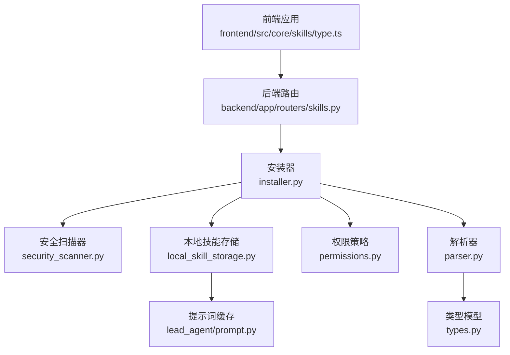
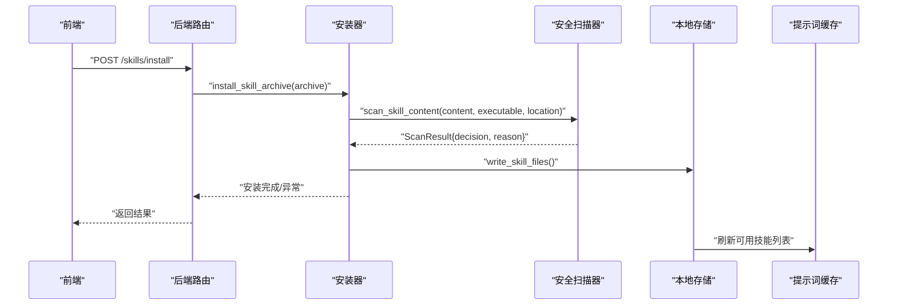
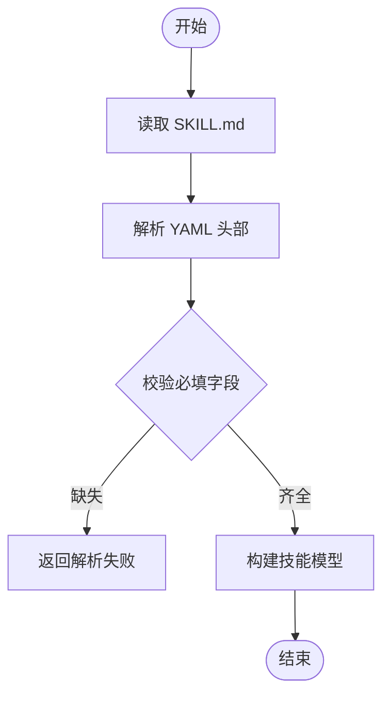
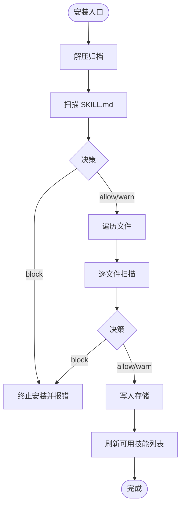
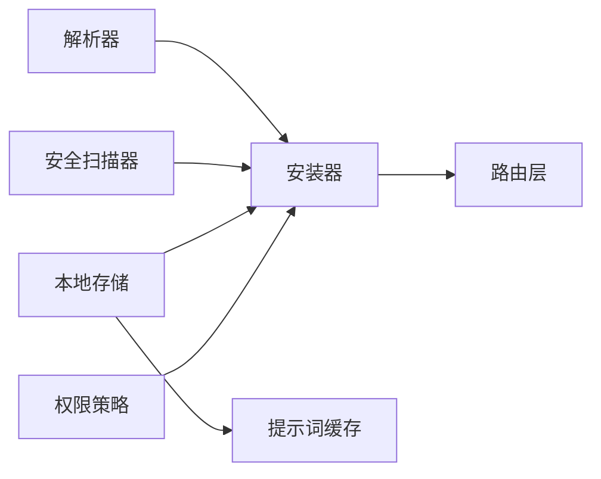

# 自定义技能开发

<cite>
**本文引用的文件**
- [backend/docs/ARCHITECTURE.md](file://backend/docs/ARCHITECTURE.md)
- [backend/packages/harness/deerflow/skills/types.py](file://backend/packages/harness/deerflow/skills/types.py)
- [backend/packages/harness/deerflow/skills/parser.py](file://backend/packages/harness/deerflow/skills/parser.py)
- [backend/packages/harness/deerflow/skills/installer.py](file://backend/packages/harness/deerflow/skills/installer.py)
- [backend/packages/harness/deerflow/skills/security_scanner.py](file://backend/packages/harness/deerflow/skills/security_scanner.py)
- [backend/packages/harness/deerflow/skills/permissions.py](file://backend/packages/harness/deerflow/skills/permissions.py)
- [backend/packages/harness/deerflow/skills/storage/local_skill_storage.py](file://backend/packages/harness/deerflow/skills/storage/local_skill_storage.py)
- [backend/app/routers/skills.py](file://backend/app/routers/skills.py)
- [backend/tests/test_skills_parser.py](file://backend/tests/test_skills_parser.py)
- [backend/tests/test_skills_custom_router.py](file://backend/tests/test_skills_custom_router.py)
- [backend/tests/test_security_scanner.py](file://backend/tests/test_security_scanner.py)
- [backend/tests/test_skills_permissions.py](file://backend/tests/test_skills_permissions.py)
- [frontend/src/core/skills/type.ts](file://frontend/src/core/skills/type.ts)
- [skills/public/bootstrap/SKILL.md](file://skills/public/bootstrap/SKILL.md)
- [skills/public/chart-visualization/SKILL.md](file://skills/public/chart-visualization/SKILL.md)
- [skills/public/skill-creator/SKILL.md](file://skills/public/skill-creator/SKILL.md)
- [skills/custom/user-installed/SKILL.md](file://skills/custom/user-installed/SKILL.md)
- [scripts/wizard/steps/execution.py](file://scripts/wizard/steps/execution.py)
- [scripts/wizard/ui.py](file://scripts/wizard/ui.py)
- [scripts/wizard/writer.py](file://scripts/wizard/writer.py)
- [backend/README.md](file://backend/README.md)
- [frontend/README.md](file://frontend/README.md)
- [docs/skills/README.md](file://docs/skills/README.md)
</cite>

## 目录
1. [简介](#简介)
2. [项目结构](#项目结构)
3. [核心组件](#核心组件)
4. [架构总览](#架构总览)
5. [详细组件分析](#详细组件分析)
6. [依赖关系分析](#依赖关系分析)
7. [性能考虑](#性能考虑)
8. [故障排查指南](#故障排查指南)
9. [结论](#结论)
10. [附录](#附录)

## 简介
本指南面向希望在 DeerFlow 平台上开发自定义技能（Skill）的开发者，系统讲解技能开发框架的设计理念、开发规范、接口与数据格式标准、从初始化到打包发布的全流程、安全扫描机制与最佳实践、权限管理、性能优化与错误处理，并提供可直接参考的模板与示例路径，帮助快速上手。

## 项目结构
DeerFlow 的技能系统由“前端展示层”、“后端网关与路由层”、“技能解析与安装器”、“本地存储与权限控制”以及“安全扫描器”构成。技能内容以归档形式安装至 skills/custom 或 skills/public 目录，通过解析器读取 SKILL.md 元信息，再经安装器写入本地存储并触发安全扫描，最终注入到代理提示词中供执行。

图示来源
- [backend/app/routers/skills.py](file://backend/app/routers/skills.py)
- [backend/packages/harness/deerflow/skills/installer.py](file://backend/packages/harness/deerflow/skills/installer.py)
- [backend/packages/harness/deerflow/skills/security_scanner.py](file://backend/packages/harness/deerflow/skills/security_scanner.py)
- [backend/packages/harness/deerflow/skills/storage/local_skill_storage.py](file://backend/packages/harness/deerflow/skills/storage/local_skill_storage.py)
- [backend/packages/harness/deerflow/skills/permissions.py](file://backend/packages/harness/deerflow/skills/permissions.py)
- [backend/packages/harness/deerflow/skills/parser.py](file://backend/packages/harness/deerflow/skills/parser.py)
- [backend/packages/harness/deerflow/skills/types.py](file://backend/packages/harness/deerflow/skills/types.py)
- [backend/packages/harness/deerflow/agents/lead_agent/prompt.py](file://backend/packages/harness/deerflow/agents/lead_agent/prompt.py)

章节来源
- [backend/docs/ARCHITECTURE.md](file://backend/docs/ARCHITECTURE.md)
- [frontend/src/core/skills/type.ts](file://frontend/src/core/skills/type.ts)

## 核心组件
- 类型与数据模型：定义技能元数据结构，确保前后端一致的数据契约。
- 解析器：负责从 SKILL.md 中提取名称、描述、许可证、允许工具等元信息。
- 安装器：负责将技能归档解压、写入本地存储、运行安全扫描并处理拒绝或警告。
- 安全扫描器：基于配置的模型对技能内容进行三态判定（允许/警告/阻止），并回退保守策略。
- 权限策略：控制技能可用性、可见性与工具调用范围。
- 本地存储：持久化技能文件与元数据，支持刷新与隔离。
- 路由层：对外暴露技能安装、查询、启用/禁用等 API。
- 前端类型：统一技能对象字段，便于 UI 展示与交互。

章节来源
- [backend/packages/harness/deerflow/skills/types.py](file://backend/packages/harness/deerflow/skills/types.py)
- [backend/packages/harness/deerflow/skills/parser.py](file://backend/packages/harness/deerflow/skills/parser.py)
- [backend/packages/harness/deerflow/skills/installer.py](file://backend/packages/harness/deerflow/skills/installer.py)
- [backend/packages/harness/deerflow/skills/security_scanner.py](file://backend/packages/harness/deerflow/skills/security_scanner.py)
- [backend/packages/harness/deerflow/skills/permissions.py](file://backend/packages/harness/deerflow/skills/permissions.py)
- [backend/packages/harness/deerflow/skills/storage/local_skill_storage.py](file://backend/packages/harness/deerflow/skills/storage/local_skill_storage.py)
- [backend/app/routers/skills.py](file://backend/app/routers/skills.py)
- [frontend/src/core/skills/type.ts](file://frontend/src/core/skills/type.ts)

## 架构总览
下图展示了技能从上传到注入提示词的关键流程：前端提交归档 → 后端路由接收 → 安装器执行扫描与写盘 → 存储更新 → 提示词缓存与可用技能列表生成。

图示来源
- [backend/app/routers/skills.py](file://backend/app/routers/skills.py)
- [backend/packages/harness/deerflow/skills/installer.py](file://backend/packages/harness/deerflow/skills/installer.py)
- [backend/packages/harness/deerflow/skills/security_scanner.py](file://backend/packages/harness/deerflow/skills/security_scanner.py)
- [backend/packages/harness/deerflow/skills/storage/local_skill_storage.py](file://backend/packages/harness/deerflow/skills/storage/local_skill_storage.py)
- [backend/packages/harness/deerflow/agents/lead_agent/prompt.py](file://backend/packages/harness/deerflow/agents/lead_agent/prompt.py)

## 详细组件分析

### 技能结构模板与 API 接口标准
- 技能目录结构
  - public：公共技能，随仓库分发；custom：用户自定义技能，通常被忽略。
  - 每个技能根目录需包含 SKILL.md 元信息文件，其他资源如脚本、模板、参考文档可按需放置。
- SKILL.md 元信息字段
  - 必填：name、description、license
  - 可选：allowed-tools（声明该技能可使用的工具集合）
  - 其他：版本、作者、标签等建议字段
- API 接口
  - 安装：POST /skills/install（接收归档，内部调用安装器）
  - 查询：GET /skills（列出已安装技能，受权限与可用性过滤）
  - 启用/禁用：PATCH /skills/{id}/enable 或 /disable
  - 删除：DELETE /skills/{id}

章节来源
- [backend/docs/ARCHITECTURE.md](file://backend/docs/ARCHITECTURE.md)
- [backend/app/routers/skills.py](file://backend/app/routers/skills.py)
- [skills/public/bootstrap/SKILL.md](file://skills/public/bootstrap/SKILL.md)
- [skills/public/chart-visualization/SKILL.md](file://skills/public/chart-visualization/SKILL.md)
- [skills/public/skill-creator/SKILL.md](file://skills/public/skill-creator/SKILL.md)
- [skills/custom/user-installed/SKILL.md](file://skills/custom/user-installed/SKILL.md)

### 数据模型与解析流程
- 类型模型
  - 统一技能对象字段（名称、描述、分类、许可证、是否启用），保证前后端一致性。
- 解析器
  - 从 SKILL.md 读取 YAML 头部，解析 name/description/license/allowed-tools 等字段，处理引号与转义。
  - 单元测试覆盖了未加引号、双引号、单引号等边界情况，确保解析稳定。
- 流程图

图示来源
- [backend/packages/harness/deerflow/skills/parser.py](file://backend/packages/harness/deerflow/skills/parser.py)
- [backend/packages/harness/deerflow/skills/types.py](file://backend/packages/harness/deerflow/skills/types.py)
- [backend/tests/test_skills_parser.py](file://backend/tests/test_skills_parser.py)

章节来源
- [backend/packages/harness/deerflow/skills/types.py](file://backend/packages/harness/deerflow/skills/types.py)
- [backend/packages/harness/deerflow/skills/parser.py](file://backend/packages/harness/deerflow/skills/parser.py)
- [backend/tests/test_skills_parser.py](file://backend/tests/test_skills_parser.py)
- [frontend/src/core/skills/type.ts](file://frontend/src/core/skills/type.ts)

### 安装器与安全扫描机制
- 安装流程
  - 接收归档文件，解压到临时目录
  - 对 SKILL.md 进行首次扫描（非可执行）
  - 遍历所有文本与脚本文件，逐项扫描
  - 写入本地存储，触发刷新
- 安全扫描
  - 使用配置中的模型对内容进行三态判定
  - 若模型不可用或输出不可解析，则采用保守回退策略（阻断）
  - 可执行文件必须得到明确允许，否则阻断
- 错误处理
  - 扫描失败抛出特定异常，阻止安装
  - 对于非 SKILL.md 的阻断，给出具体位置与原因

图示来源
- [backend/packages/harness/deerflow/skills/installer.py](file://backend/packages/harness/deerflow/skills/installer.py)
- [backend/packages/harness/deerflow/skills/security_scanner.py](file://backend/packages/harness/deerflow/skills/security_scanner.py)
- [backend/packages/harness/deerflow/skills/storage/local_skill_storage.py](file://backend/packages/harness/deerflow/skills/storage/local_skill_storage.py)

章节来源
- [backend/packages/harness/deerflow/skills/installer.py](file://backend/packages/harness/deerflow/skills/installer.py)
- [backend/packages/harness/deerflow/skills/security_scanner.py](file://backend/packages/harness/deerflow/skills/security_scanner.py)
- [backend/tests/test_skills_custom_router.py](file://backend/tests/test_skills_custom_router.py)
- [backend/tests/test_security_scanner.py](file://backend/tests/test_security_scanner.py)

### 权限管理与工具策略
- allowed-tools 列表用于限制技能可调用的工具集合
- 安装时会根据策略对工具调用进行约束
- 建议为每个技能维护最小权限集，遵循“最小授权原则”

章节来源
- [backend/packages/harness/deerflow/skills/permissions.py](file://backend/packages/harness/deerflow/skills/permissions.py)
- [backend/tests/test_skills_permissions.py](file://backend/tests/test_skills_permissions.py)

### 前端展示与交互
- 技能对象字段与 UI 显示保持一致
- 支持启用/禁用切换、列表筛选与详情查看

章节来源
- [frontend/src/core/skills/type.ts](file://frontend/src/core/skills/type.ts)

## 依赖关系分析
- 组件耦合
  - 安装器依赖解析器、存储与安全扫描器
  - 路由层依赖安装器与权限策略
  - 提示词缓存依赖存储与可用技能键集合
- 外部依赖
  - 配置驱动的安全模型选择
  - 文件系统与归档处理

图示来源
- [backend/packages/harness/deerflow/skills/parser.py](file://backend/packages/harness/deerflow/skills/parser.py)
- [backend/packages/harness/deerflow/skills/installer.py](file://backend/packages/harness/deerflow/skills/installer.py)
- [backend/packages/harness/deerflow/skills/security_scanner.py](file://backend/packages/harness/deerflow/skills/security_scanner.py)
- [backend/packages/harness/deerflow/skills/permissions.py](file://backend/packages/harness/deerflow/skills/permissions.py)
- [backend/packages/harness/deerflow/skills/storage/local_skill_storage.py](file://backend/packages/harness/deerflow/skills/storage/local_skill_storage.py)
- [backend/app/routers/skills.py](file://backend/app/routers/skills.py)
- [backend/packages/harness/deerflow/agents/lead_agent/prompt.py](file://backend/packages/harness/deerflow/agents/lead_agent/prompt.py)

## 性能考虑
- 缓存与增量更新
  - 提示词缓存使用键值缓存，减少重复构造成本
  - 存储刷新仅在安装/卸载/变更时触发
- I/O 与并发
  - 归档解压与文件扫描应避免阻塞主线程
  - 对大文件扫描建议异步化与超时控制
- 工具调用
  - 严格限制 allowed-tools，降低外部调用开销与风险

## 故障排查指南
- 安装失败
  - 检查 SKILL.md 是否符合元信息规范
  - 查看安全扫描日志与回退原因
  - 确认归档内文件是否被正确识别为可执行或文本
- 权限问题
  - 确认 allowed-tools 列表与实际调用一致
  - 检查权限策略是否正确加载
- 前端显示异常
  - 确保技能对象字段与前端类型一致
  - 检查路由返回状态与数据结构

章节来源
- [backend/tests/test_skills_custom_router.py](file://backend/tests/test_skills_custom_router.py)
- [backend/tests/test_skills_permissions.py](file://backend/tests/test_skills_permissions.py)
- [backend/tests/test_security_scanner.py](file://backend/tests/test_security_scanner.py)

## 结论
通过标准化的 SKILL.md 元信息、严格的安装与安全扫描流程、最小权限的工具策略以及完善的前端展示，DeerFlow 为自定义技能开发提供了清晰、安全且可扩展的框架。遵循本文规范与最佳实践，开发者可以高效地完成从设计、实现、测试到上线的全流程。

## 附录

### 开发流程速览
- 初始化项目
  - 在 skills/custom 下创建你的技能目录，并编写 SKILL.md
  - 准备脚本、模板与参考文档
- 编写核心逻辑
  - 将技能工作流与最佳实践写入 SKILL.md 的说明部分
  - 使用 allowed-tools 明确可调用工具
- 测试与调试
  - 使用内置测试用例思路验证解析与扫描行为
  - 通过路由接口安装归档，观察日志与回退策略
- 打包发布
  - 将技能目录压缩为 .skill 归档
  - 通过 /skills/install 接口安装，确认可用性与提示词注入

章节来源
- [backend/app/routers/skills.py](file://backend/app/routers/skills.py)
- [backend/packages/harness/deerflow/skills/installer.py](file://backend/packages/harness/deerflow/skills/installer.py)
- [backend/tests/test_skills_parser.py](file://backend/tests/test_skills_parser.py)
- [backend/tests/test_security_scanner.py](file://backend/tests/test_security_scanner.py)

### 示例与模板
- 公共技能示例
  - bootstrap、chart-visualization、skill-creator 等均包含完整的 SKILL.md 作为参考
- 自定义技能示例
  - skills/custom/user-installed/SKILL.md 可作为起点

章节来源
- [skills/public/bootstrap/SKILL.md](file://skills/public/bootstrap/SKILL.md)
- [skills/public/chart-visualization/SKILL.md](file://skills/public/chart-visualization/SKILL.md)
- [skills/public/skill-creator/SKILL.md](file://skills/public/skill-creator/SKILL.md)
- [skills/custom/user-installed/SKILL.md](file://skills/custom/user-installed/SKILL.md)

### 调试工具与向导
- 脚本向导
  - scripts/wizard/steps/execution.py、ui.py、writer.py 提供交互式向导能力，可用于辅助生成 SKILL.md 与脚本骨架
- 后端/前端文档
  - backend/README.md 与 frontend/README.md 提供运行与开发指引

章节来源
- [scripts/wizard/steps/execution.py](file://scripts/wizard/steps/execution.py)
- [scripts/wizard/ui.py](file://scripts/wizard/ui.py)
- [scripts/wizard/writer.py](file://scripts/wizard/writer.py)
- [backend/README.md](file://backend/README.md)
- [frontend/README.md](file://frontend/README.md)