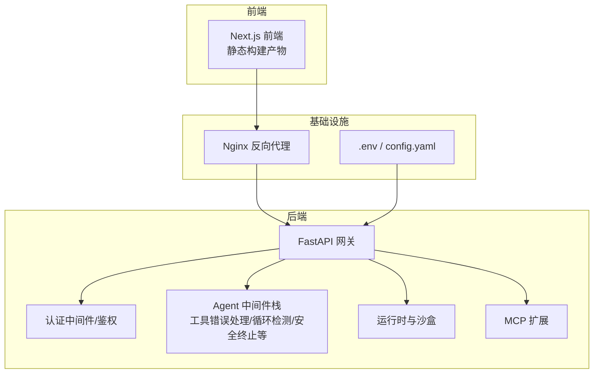
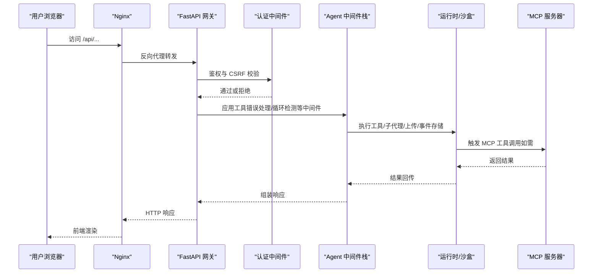
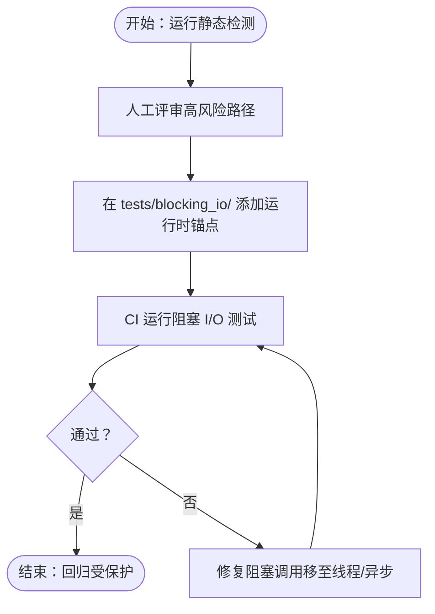
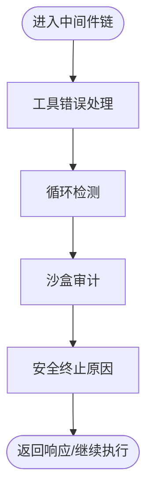
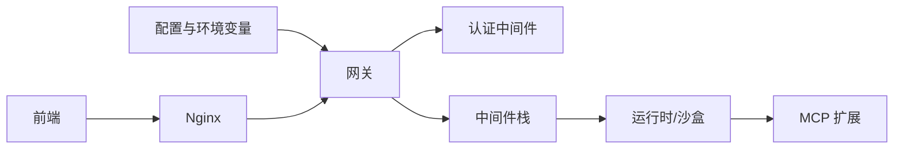
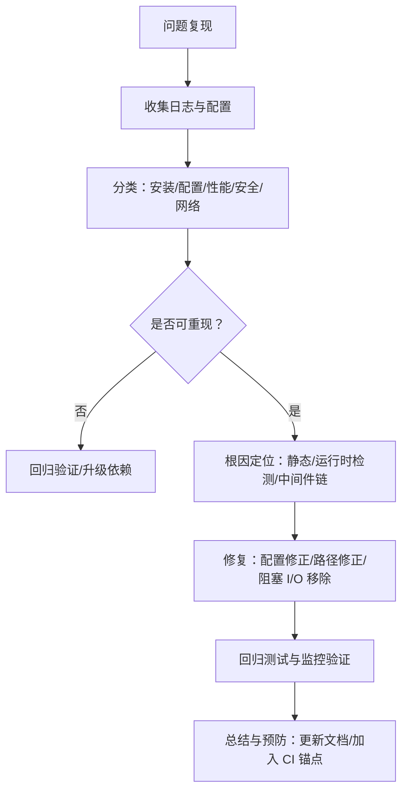

# 故障排除与常见问题

<cite>
**本文引用的文件**   
- [Install.md](file://Install.md)
- [DEPLOYMENT_KNOWN_ISSUES.md](file://docs/operations/DEPLOYMENT_KNOWN_ISSUES.md)
- [BLOCKING_IO_DETECTION.md](file://backend/docs/BLOCKING_IO_DETECTION.md)
- [doctor.py](file://scripts/doctor.py)
- [ADS-MCP对接DeerFlow整合指南-实测版.md](file://docs/mcp/ADS-MCP对接DeerFlow整合指南-实测版.md)
- [USE_GUIDE.md](file://docs/operations/USE_GUIDE.md)
- [debug.py](file://backend/debug.py)
- [test_logging_level_from_config.py](file://backend/tests/test_logging_level_from_config.py)
- [test_tool_error_handling_middleware.py](file://backend/tests/test_tool_error_handling_middleware.py)
- [test_loop_detection_middleware.py](file://backend/tests/test_loop_detection_middleware.py)
- [loop_detection_middleware.py](file://backend/packages/harness/deerflow/agents/middlewares/loop_detection_middleware.py)
- [llm_error_handling_middleware.py](file://backend/packages/harness/deerflow/agents/middlewares/llm_error_handling_middleware.py)
- [langgraph_auth.py](file://backend/app/gateway/langgraph_auth.py)
- [auth_middleware.py](file://backend/app/gateway/auth_middleware.py)
- [test_sandbox_audit_middleware.py](file://backend/tests/test_sandbox_audit_middleware.py)
</cite>

## 目录
1. [简介](#简介)
2. [项目结构](#项目结构)
3. [核心组件](#核心组件)
4. [架构总览](#架构总览)
5. [详细组件分析](#详细组件分析)
6. [依赖分析](#依赖分析)
7. [性能考虑](#性能考虑)
8. [故障排除指南](#故障排除指南)
9. [结论](#结论)
10. [附录](#附录)

## 简介
本文件面向 DeerFlow 用户与运维工程师，提供从安装部署到运行维护的全流程故障排除与常见问题解决方案。内容涵盖安装部署问题、配置错误排查、性能问题诊断、兼容性问题处理、调试技巧（日志分析、性能分析、网络问题排查、内存泄漏检测）、故障排除流程（问题分类、根因分析、解决方案与预防措施）、具体故障案例与修复步骤，以及运维最佳实践、监控告警与应急响应建议。

## 项目结构
- 后端（Python/FastAPI）：网关、认证鉴权、中间件、运行时与沙盒、MCP 扩展等。
- 前端（Next.js）：独立构建产物，通过 Nginx 提供静态服务。
- 文档与脚本：安装说明、部署已知问题、健康检查脚本、阻塞 I/O 检测、MCP 整合指南等。
- 扩展（Extensions）：MCP 服务器、环境设置、主题守卫等。

图示来源
- [USE_GUIDE.md: 产品清单与产物结构:18-50](file://docs/operations/USE_GUIDE.md#L18-L50)

章节来源
- [USE_GUIDE.md: 产品清单与产物结构:18-50](file://docs/operations/USE_GUIDE.md#L18-L50)

## 核心组件
- 安装与验证：安装指引、健康检查脚本、配置校验。
- 部署与兼容性：发布产物、Docker 与裸机差异、MCP 配置路径与权限。
- 性能与事件循环安全：阻塞 I/O 静态与运行时检测。
- 调试与可观测性：日志级别、调试输出、错误消息提取。
- 安全与鉴权：CSRF、Cookie/JWT 校验、鉴权中间件。
- 中间件链：工具错误处理、循环检测、安全终止原因等。

章节来源
- [Install.md: 安装与验证:58-88](file://Install.md#L58-L88)
- [doctor.py: 健康检查:632-722](file://scripts/doctor.py#L632-L722)
- [BLOCKING_IO_DETECTION.md: 阻塞 I/O 检测:1-155](file://backend/docs/BLOCKING_IO_DETECTION.md#L1-L155)
- [debug.py: 调试日志配置:47-70](file://backend/debug.py#L47-L70)
- [langgraph_auth.py: CSRF/鉴权:41-81](file://backend/app/gateway/langgraph_auth.py#L41-L81)
- [auth_middleware.py: 认证中间件:53-61](file://backend/app/gateway/auth_middleware.py#L53-L61)

## 架构总览
下图展示典型请求流经网关、鉴权、中间件、运行时与沙盒，最终到达 MCP 的调用链路。

图示来源
- [USE_GUIDE.md: 产物清单与入口:29-42](file://docs/operations/USE_GUIDE.md#L29-L42)
- [langgraph_auth.py: CSRF/鉴权:41-81](file://backend/app/gateway/langgraph_auth.py#L41-L81)
- [auth_middleware.py: 认证中间件:53-61](file://backend/app/gateway/auth_middleware.py#L53-L61)

## 详细组件分析

### 安装与部署问题排查
- Docker 与本地安装差异
  - Docker：完成前置准备即可，服务未默认启动；确认配置文件存在。
  - 本地：检查系统依赖（Node/pnpm/uv/nginx），安装完成后生成配置。
- 发布产物与路径一致性
  - MCP 路径需与发布目录结构一致，避免 ENOENT。
  - ADS MCP 源码与构建产物路径需匹配，确保 dist 与 node_modules 存在。
- 环境变量与 .env 加载
  - serve.sh 默认加载 .env；手动启动需显式 source。
- 前端构建与 .next 目录
  - 预览模式会重建 .next，依赖完整与 .env 存在；release 推荐直接启动而非重建。

章节来源
- [Install.md: 安装与验证:58-88](file://Install.md#L58-L88)
- [DEPLOYMENT_KNOWN_ISSUES.md: 模型配置/前端构建/MCP/启动脚本/运行环境/环境配置:8-298](file://docs/operations/DEPLOYMENT_KNOWN_ISSUES.md#L8-L298)
- [USE_GUIDE.md: 产物清单与入口:18-50](file://docs/operations/USE_GUIDE.md#L18-L50)

### 配置错误排查
- 模型配置
  - 支持“思考”模式需配置 supports_thinking 字段。
  - 模型名称需与项目根 config.yaml 保持一致。
- MCP 配置
  - ADS MCP args 与 env 路径需使用相对路径（相对于 backend/）。
  - .ads-mcp/config.json 需包含完整服务与凭据配置。
- 环境变量
  - config-upgrade.sh 与 serve.sh 的路径差异需修正。
  - .env 未自动加载时需手动 source 或使用脚本启动。

章节来源
- [DEPLOYMENT_KNOWN_ISSUES.md: 模型配置/前端构建/MCP/启动脚本/环境配置:8-201](file://docs/operations/DEPLOYMENT_KNOWN_ISSUES.md#L8-L201)

### 性能问题诊断
- 阻塞 I/O 检测
  - 静态检测：定位潜在同步 I/O 调用点，用于评审与优先级排序。
  - 运行时检测：CI 回归保护，聚焦生产异步路径，防止阻塞事件循环。
- 运行时锚点与规则
  - 新增规则需集中维护，避免对低层辅助函数测试。
  - 锚点应调用真实生产异步入口，失败条件明确。

图示来源
- [BLOCKING_IO_DETECTION.md: 静态/运行时检测与维护流程:10-155](file://backend/docs/BLOCKING_IO_DETECTION.md#L10-L155)

章节来源
- [BLOCKING_IO_DETECTION.md: 静态/运行时检测与维护流程:10-155](file://backend/docs/BLOCKING_IO_DETECTION.md#L10-L155)

### 兼容性问题解决
- 跨平台 .venv 不兼容
  - 服务器架构/OS 不匹配时，重新 uv sync 或使用无网络模式安装。
- rsync 权限错误
  - 使用 --no-g --no-o 跳过组/属主属性，配合 || true 避免脚本中断。
- 网络与地址隔离
  - 沙盒内无法影响宿主机端口，需在宿主机执行端口清理。

章节来源
- [DEPLOYMENT_KNOWN_ISSUES.md: 跨平台虚拟环境/权限/网络隔离:149-218](file://docs/operations/DEPLOYMENT_KNOWN_ISSUES.md#L149-L218)

### 调试技巧
- 日志分析
  - debug.log 输出与 root logger 配置，避免交互控制台污染。
  - 从配置映射 log_level 字符串到 logging 常量，确保命名日志器级别不受 root 影响。
- 错误消息提取
  - 从异常对象提取可读详情，优先使用字符串 detail/message，回退类名。
- 性能分析
  - 使用阻塞 I/O 静态与运行时检测结合，定位热点路径。
- 网络问题排查
  - ADS MCP：检查 dist 与 node_modules 是否存在；容器内路径与只读文件系统问题；通过 UI 触发懒加载。
- 内存泄漏检测
  - 通过中间件与运行时队列状态观察，结合循环检测与工具输出预算中间件进行定位。

章节来源
- [debug.py: 调试日志配置:47-70](file://backend/debug.py#L47-L70)
- [test_logging_level_from_config.py: 日志级别映射与行为:74-91](file://backend/tests/test_logging_level_from_config.py#L74-L91)
- [llm_error_handling_middleware.py: 错误详情提取:385-404](file://backend/packages/harness/deerflow/agents/middlewares/llm_error_handling_middleware.py#L385-L404)
- [ADS-MCP对接DeerFlow整合指南-实测版.md: MCP 故障排查:271-441](file://docs/mcp/ADS-MCP对接DeerFlow整合指南-实测版.md#L271-L441)

### 安全与鉴权
- CSRF 与 Cookie/JWT 校验
  - 缺少 CSRF 或不一致时直接返回 403。
  - 鉴权中间件对非公开路径严格校验，公共路径白名单明确。
- 鉴权中间件
  - 失败即 401，区分缺失、格式错误、过期或版本不匹配等情形。

章节来源
- [langgraph_auth.py: CSRF/鉴权:41-81](file://backend/app/gateway/langgraph_auth.py#L41-L81)
- [auth_middleware.py: 认证中间件:53-61](file://backend/app/gateway/auth_middleware.py#L53-L61)

### 中间件链与工具错误处理
- 工具错误处理中间件
  - 异常转为 ToolMessage，携带工具名与错误详情；必要时回填 tool_call_id。
  - 对 GraphInterrupt 保持透传，避免吞掉中断信号。
- 循环检测中间件
  - 哈希与频率双层检测，窗口滑动与队列上限控制，防止告警风暴。
- 沙盒审计中间件
  - 高风险命令 100% 命中，中风险告警召回率≥90%，误报率 0%。

图示来源
- [test_tool_error_handling_middleware.py: 工具错误处理测试:134-208](file://backend/tests/test_tool_error_handling_middleware.py#L134-L208)
- [test_loop_detection_middleware.py: 循环检测测试:405-1076](file://backend/tests/test_loop_detection_middleware.py#L405-L1076)
- [loop_detection_middleware.py: 循环检测实现要点:300-329](file://backend/packages/harness/deerflow/agents/middlewares/loop_detection_middleware.py#L300-L329)
- [test_sandbox_audit_middleware.py: 沙盒审计指标:704-716](file://backend/tests/test_sandbox_audit_middleware.py#L704-L716)

章节来源
- [test_tool_error_handling_middleware.py: 工具错误处理测试:134-208](file://backend/tests/test_tool_error_handling_middleware.py#L134-L208)
- [test_loop_detection_middleware.py: 循环检测测试:405-1076](file://backend/tests/test_loop_detection_middleware.py#L405-L1076)
- [loop_detection_middleware.py: 循环检测实现要点:300-329](file://backend/packages/harness/deerflow/agents/middlewares/loop_detection_middleware.py#L300-L329)
- [test_sandbox_audit_middleware.py: 沙盒审计指标:704-716](file://backend/tests/test_sandbox_audit_middleware.py#L704-L716)

## 依赖分析
- 组件耦合
  - 网关依赖认证中间件与全局安全策略；中间件链彼此解耦，通过统一接口组合。
  - MCP 作为扩展，通过配置与运行时动态加载，避免强耦合。
- 外部依赖
  - Node/pnpm/uv/nginx：前端与后端构建/运行必备。
  - Docker/Apple Container：容器沙盒执行模式依赖。
- 潜在循环依赖
  - 中间件链通过职责单一避免循环；MCP 采用懒加载降低启动时耦合。

图示来源
- [USE_GUIDE.md: 产物清单与入口:29-42](file://docs/operations/USE_GUIDE.md#L29-L42)
- [DEPLOYMENT_KNOWN_ISSUES.md: MCP 路径与依赖:66-118](file://docs/operations/DEPLOYMENT_KNOWN_ISSUES.md#L66-L118)

章节来源
- [USE_GUIDE.md: 产物清单与入口:29-42](file://docs/operations/USE_GUIDE.md#L29-L42)
- [DEPLOYMENT_KNOWN_ISSUES.md: MCP 路径与依赖:66-118](file://docs/operations/DEPLOYMENT_KNOWN_ISSUES.md#L66-L118)

## 性能考虑
- 避免阻塞事件循环
  - 使用 to_thread/offload 同步操作；静态与运行时检测互补。
- 中间件开销控制
  - 限制待处理警告数量与窗口大小，防止风暴。
- 工具输出预算与安全终止
  - 控制工具输出长度与频率，及时终止危险路径。

章节来源
- [BLOCKING_IO_DETECTION.md: 阻塞 I/O 检测与维护:10-155](file://backend/docs/BLOCKING_IO_DETECTION.md#L10-L155)
- [loop_detection_middleware.py: 循环检测实现要点:300-329](file://backend/packages/harness/deerflow/agents/middlewares/loop_detection_middleware.py#L300-L329)

## 故障排除指南

### 通用流程

### 安装部署类
- Docker 未启动服务
  - 确认 docker-init 成功，下一步执行 docker-start。
- 本地依赖缺失
  - 按 doctor 输出补齐 Node/pnpm/uv/nginx。
- 发布产物路径不一致
  - MCP args/env 使用相对路径；.ads-mcp/config.json 完整配置。

章节来源
- [Install.md: 安装与验证:58-88](file://Install.md#L58-L88)
- [DEPLOYMENT_KNOWN_ISSUES.md: 发布产物与路径:66-118](file://docs/operations/DEPLOYMENT_KNOWN_ISSUES.md#L66-L118)

### 配置类
- 模型不可用/模式受限
  - 补充 supports_thinking；统一模型名称。
- 环境变量未加载
  - 使用 serve.sh 或手动 source .env。
- MCP 配置路径错误
  - 使用相对路径；检查 dist 与 node_modules；容器内路径与只读文件系统问题。

章节来源
- [DEPLOYMENT_KNOWN_ISSUES.md: 模型配置/环境变量/MCP 配置:8-201](file://docs/operations/DEPLOYMENT_KNOWN_ISSUES.md#L8-L201)
- [ADS-MCP对接DeerFlow整合指南-实测版.md: MCP 故障排查:271-441](file://docs/mcp/ADS-MCP对接DeerFlow整合指南-实测版.md#L271-L441)

### 性能类
- 阻塞 I/O 导致卡顿
  - 运行静态检测与 CI 锚点，定位并 offload 同步调用。
- 工具调用频繁导致资源紧张
  - 使用循环检测与工具输出预算中间件，限制频率与长度。
- 沙盒命令误报/漏报
  - 检查审计规则与命令分类，确保召回率与精度达标。

章节来源
- [BLOCKING_IO_DETECTION.md: 静态/运行时检测:10-155](file://backend/docs/BLOCKING_IO_DETECTION.md#L10-L155)
- [test_loop_detection_middleware.py: 循环检测测试:405-1076](file://backend/tests/test_loop_detection_middleware.py#L405-L1076)
- [test_sandbox_audit_middleware.py: 沙盒审计指标:704-716](file://backend/tests/test_sandbox_audit_middleware.py#L704-L716)

### 安全类
- CSRF/鉴权失败
  - 检查 Cookie 与 Header 是否一致；确认访问路径是否在白名单。
- 认证中间件拒绝
  - 核对令牌有效性、过期与版本；确认非公开路径的鉴权逻辑。

章节来源
- [langgraph_auth.py: CSRF/鉴权:41-81](file://backend/app/gateway/langgraph_auth.py#L41-L81)
- [auth_middleware.py: 认证中间件:53-61](file://backend/app/gateway/auth_middleware.py#L53-L61)

### 网络与 MCP 类
- ADS MCP 未识别/只读文件系统
  - 检查 dist 与 node_modules；容器内路径覆盖 .env；避免只读写入。
- MCP 工具未出现
  - 通过 UI 发送消息触发懒加载。

章节来源
- [ADS-MCP对接DeerFlow整合指南-实测版.md: MCP 故障排查:271-441](file://docs/mcp/ADS-MCP对接DeerFlow整合指南-实测版.md#L271-L441)

### 调试与诊断步骤
- 日志级别与输出
  - 使用 debug.log 与配置映射，避免干扰交互控制台。
- 错误消息提取
  - 优先 detail/message，回退类名，便于前端展示。
- 健康检查
  - 运行 doctor.py，按类别汇总失败/警告项，指导修复。

章节来源
- [debug.py: 调试日志配置:47-70](file://backend/debug.py#L47-L70)
- [test_logging_level_from_config.py: 日志级别映射:74-91](file://backend/tests/test_logging_level_from_config.py#L74-L91)
- [llm_error_handling_middleware.py: 错误详情提取:385-404](file://backend/packages/harness/deerflow/agents/middlewares/llm_error_handling_middleware.py#L385-L404)
- [doctor.py: 健康检查:632-722](file://scripts/doctor.py#L632-L722)

## 结论
通过安装验证、配置校验、阻塞 I/O 检测、中间件链与安全机制的协同，DeerFlow 能够在复杂环境中稳定运行。建议将故障排查流程标准化，持续完善 CI 锚点与文档，形成可追溯的根因分析与预防闭环。

## 附录

### 运维最佳实践
- 前端构建：release 使用直接启动，避免重建 .next。
- 后端运行：.venv 跨平台不兼容时重新安装；rsync 跳过属主/组属性。
- MCP：统一相对路径、确保 dist 与 node_modules、容器内路径覆盖 .env。
- 监控告警：结合中间件链指标（循环检测、工具错误、沙盒审计）建立阈值告警。
- 应急响应：优先恢复公共路径与健康检查端点，逐步放行业务路径。

章节来源
- [DEPLOYMENT_KNOWN_ISSUES.md: 前端/后端/网络与地址隔离:37-218](file://docs/operations/DEPLOYMENT_KNOWN_ISSUES.md#L37-L218)
- [USE_GUIDE.md: 产物清单与入口:18-50](file://docs/operations/USE_GUIDE.md#L18-L50)