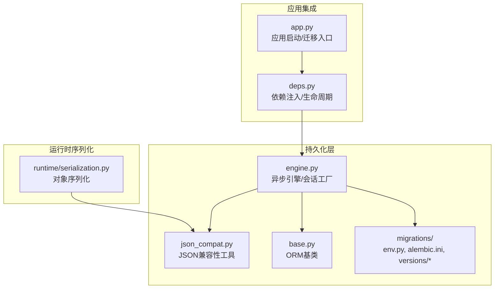
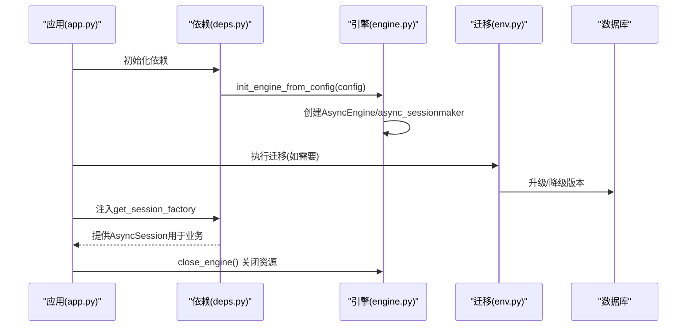
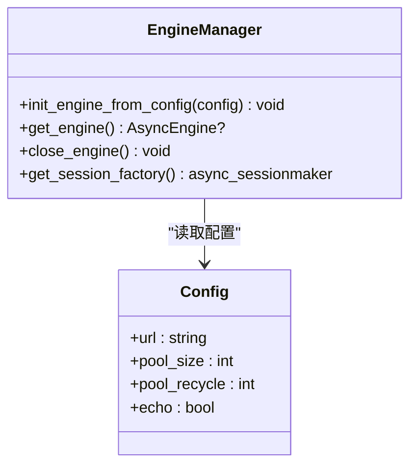
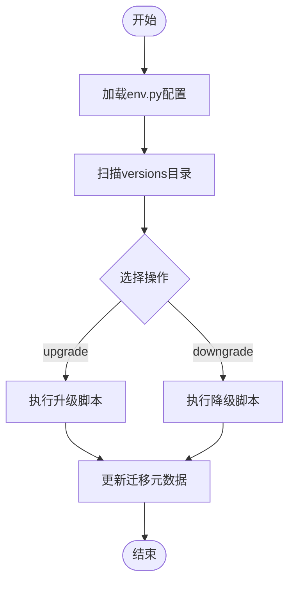
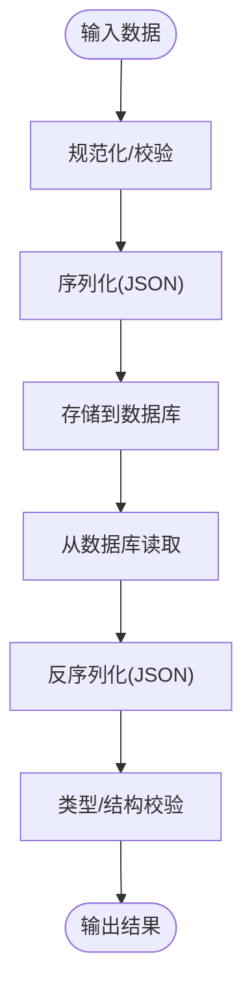
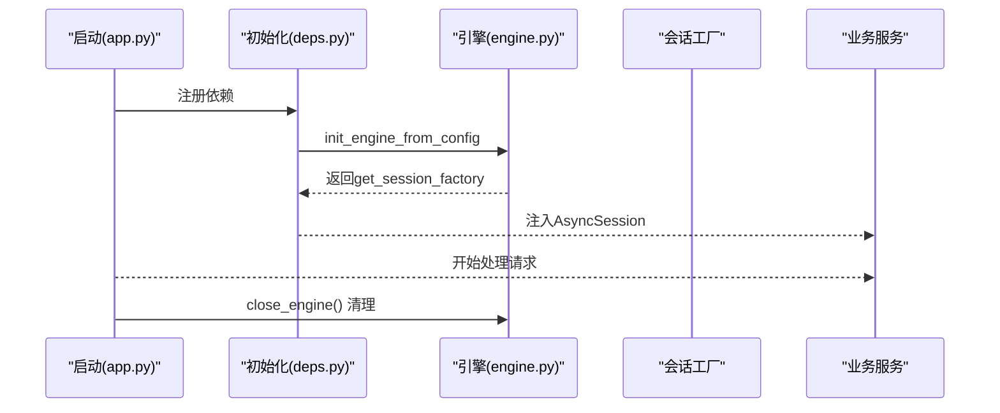
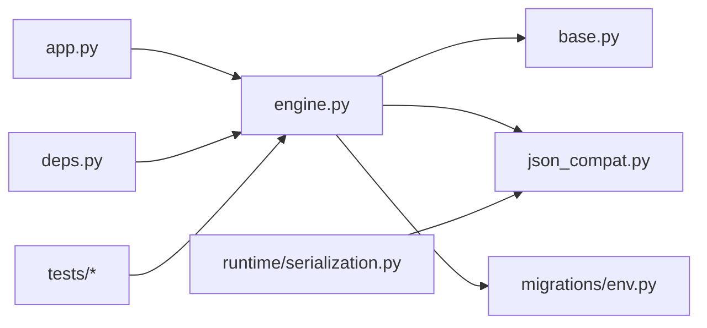

# 数据库架构

<cite>
**本文引用的文件**
- [backend/packages/harness/deerflow/persistence/engine.py](file://backend/packages/harness/deerflow/persistence/engine.py)
- [backend/packages/harness/deerflow/persistence/json_compat.py](file://backend/packages/harness/deerflow/persistence/json_compat.py)
- [backend/packages/harness/deerflow/config/database_config.py](file://backend/packages/harness/deerflow/config/database_config.py)
- [backend/packages/harness/deerflow/persistence/base.py](file://backend/packages/harness/deerflow/persistence/base.py)
- [backend/packages/harness/deerflow/persistence/migrations/env.py](file://backend/packages/harness/deerflow/persistence/migrations/env.py)
- [backend/packages/harness/deerflow/persistence/migrations/alembic.ini](file://backend/packages/harness/deerflow/persistence/migrations/alembic.ini)
- [backend/packages/harness/deerflow/persistence/migrations/versions/0001_initial.py](file://backend/packages/harness/deerflow/persistence/migrations/versions/0001_initial.py)
- [backend/packages/harness/deerflow/persistence/migrations/versions/0002_add_user_id_columns.py](file://backend/packages/harness/deerflow/persistence/migrations/versions/0002_add_user_id_columns.py)
- [backend/packages/harness/deerflow/persistence/thread_meta/sql.py](file://backend/packages/harness/deerflow/persistence/thread_meta/sql.py)
- [backend/app/gateway/deps.py](file://backend/app/gateway/deps.py)
- [backend/app/gateway/app.py](file://backend/app/gateway/app.py)
- [backend/packages/harness/deerflow/runtime/serialization.py](file://backend/packages/harness/deerflow/runtime/serialization.py)
- [backend/tests/test_auth_type_system.py](file://backend/tests/test_auth_type_system.py)
- [backend/tests/test_feedback.py](file://backend/tests/test_feedback.py)
- [backend/tests/test_gateway_run_recovery.py](file://backend/tests/test_gateway_run_recovery.py)
</cite>

## 目录
1. [简介](#简介)
2. [项目结构](#项目结构)
3. [核心组件](#核心组件)
4. [架构总览](#架构总览)
5. [详细组件分析](#详细组件分析)
6. [依赖关系分析](#依赖关系分析)
7. [性能考虑](#性能考虑)
8. [故障排除指南](#故障排除指南)
9. [结论](#结论)
10. [附录](#附录)

## 简介
本文件系统性梳理 DeerFlow 的数据库架构，覆盖连接管理、引擎配置与基础抽象层设计；详解 Alembic 迁移体系（版本管理、迁移脚本编写与数据库演进策略）；阐述 JSON 兼容性处理机制（序列化、反序列化与类型转换）；并提供配置选项、连接池管理与性能优化建议。文档面向开发者与运维人员，帮助理解与维护 DeerFlow 的数据库基础设施。

## 项目结构
数据库相关代码主要集中在后端 harness 包的 persistence 子模块，并通过网关应用在启动时初始化与注入。关键目录与文件如下：
- 引擎与会话工厂：engine.py
- JSON 兼容性工具：json_compat.py
- 数据库配置：database_config.py
- 基类模型：base.py
- Alembic 迁移：persistence/migrations/{env.py, alembic.ini, versions/*}

图表来源
- [backend/packages/harness/deerflow/persistence/engine.py](file://backend/packages/harness/deerflow/persistence/engine.py)
- [backend/packages/harness/deerflow/persistence/json_compat.py](file://backend/packages/harness/deerflow/persistence/json_compat.py)
- [backend/packages/harness/deerflow/persistence/base.py](file://backend/packages/harness/deerflow/persistence/base.py)
- [backend/packages/harness/deerflow/persistence/migrations/env.py](file://backend/packages/harness/deerflow/persistence/migrations/env.py)
- [backend/app/gateway/app.py](file://backend/app/gateway/app.py)
- [backend/app/gateway/deps.py](file://backend/app/gateway/deps.py)
- [backend/packages/harness/deerflow/runtime/serialization.py](file://backend/packages/harness/deerflow/runtime/serialization.py)

章节来源
- [backend/packages/harness/deerflow/persistence/engine.py](file://backend/packages/harness/deerflow/persistence/engine.py)
- [backend/packages/harness/deerflow/persistence/json_compat.py](file://backend/packages/harness/deerflow/persistence/json_compat.py)
- [backend/packages/harness/deerflow/persistence/base.py](file://backend/packages/harness/deerflow/persistence/base.py)
- [backend/packages/harness/deerflow/persistence/migrations/env.py](file://backend/packages/harness/deerflow/persistence/migrations/env.py)
- [backend/app/gateway/app.py](file://backend/app/gateway/app.py)
- [backend/app/gateway/deps.py](file://backend/app/gateway/deps.py)
- [backend/packages/harness/deerflow/runtime/serialization.py](file://backend/packages/harness/deerflow/runtime/serialization.py)

## 核心组件
- 异步引擎与会话工厂：负责创建与管理异步 SQLAlchemy 引擎、会话工厂与连接池，支持从配置初始化、获取引擎实例与关闭资源。
- JSON 兼容性工具：提供键/值校验、匹配与序列化辅助，确保 ORM 模型中 JSON 字段的稳定读写。
- 基类模型：定义 ORM 基类，统一字段与行为，便于迁移与模型扩展。
- Alembic 迁移：通过 env.py 与 alembic.ini 配置迁移环境，版本脚本位于 versions 目录，按顺序演进数据库结构。
- 应用集成：在应用启动阶段初始化引擎，在依赖注入中提供会话工厂，并在特定场景执行一次性迁移。

章节来源
- [backend/packages/harness/deerflow/persistence/engine.py](file://backend/packages/harness/deerflow/persistence/engine.py)
- [backend/packages/harness/deerflow/persistence/json_compat.py](file://backend/packages/harness/deerflow/persistence/json_compat.py)
- [backend/packages/harness/deerflow/persistence/base.py](file://backend/packages/harness/deerflow/persistence/base.py)
- [backend/packages/harness/deerflow/persistence/migrations/env.py](file://backend/packages/harness/deerflow/persistence/migrations/env.py)
- [backend/app/gateway/deps.py](file://backend/app/gateway/deps.py)
- [backend/app/gateway/app.py](file://backend/app/gateway/app.py)

## 架构总览
下图展示从应用启动到数据库连接、迁移与会话使用的整体流程：

图表来源
- [backend/app/gateway/app.py](file://backend/app/gateway/app.py)
- [backend/app/gateway/deps.py](file://backend/app/gateway/deps.py)
- [backend/packages/harness/deerflow/persistence/engine.py](file://backend/packages/harness/deerflow/persistence/engine.py)
- [backend/packages/harness/deerflow/persistence/migrations/env.py](file://backend/packages/harness/deerflow/persistence/migrations/env.py)

## 详细组件分析

### 组件一：数据库引擎与连接管理
- 能力概览
  - 支持从配置初始化异步引擎与会话工厂
  - 提供获取引擎实例与关闭资源的能力
  - 使用连接池参数控制并发与生命周期
- 关键点
  - 异步引擎与会话工厂的创建与配置
  - 生命周期钩子（初始化/关闭）
  - 与 Alembic 的集成以支持迁移

图表来源
- [backend/packages/harness/deerflow/persistence/engine.py](file://backend/packages/harness/deerflow/persistence/engine.py)
- [backend/packages/harness/deerflow/config/database_config.py](file://backend/packages/harness/deerflow/config/database_config.py)

章节来源
- [backend/packages/harness/deerflow/persistence/engine.py](file://backend/packages/harness/deerflow/persistence/engine.py)
- [backend/packages/harness/deerflow/config/database_config.py](file://backend/packages/harness/deerflow/config/database_config.py)

### 组件二：Alembic 迁移系统
- 版本管理
  - 通过 versions 目录存放版本化迁移脚本
  - env.py 定义迁移上下文与目标元数据
  - alembic.ini 提供通用配置项（如脚本路径、日志等）
- 迁移脚本编写
  - 建议遵循“可逆”原则，分别实现升级与降级逻辑
  - 在脚本中使用异步迁移接口（由 env.py 配置）
- 数据库演进策略
  - 小步快跑：每次只做必要的结构变更
  - 兼容性：避免破坏性变更，必要时添加新列/表并逐步替换
  - 回滚演练：确保降级脚本能安全执行

图表来源
- [backend/packages/harness/deerflow/persistence/migrations/env.py](file://backend/packages/harness/deerflow/persistence/migrations/env.py)
- [backend/packages/harness/deerflow/persistence/migrations/alembic.ini](file://backend/packages/harness/deerflow/persistence/migrations/alembic.ini)
- [backend/packages/harness/deerflow/persistence/migrations/versions/0001_initial.py](file://backend/packages/harness/deerflow/persistence/migrations/versions/0001_initial.py)
- [backend/packages/harness/deerflow/persistence/migrations/versions/0002_add_user_id_columns.py](file://backend/packages/harness/deerflow/persistence/migrations/versions/0002_add_user_id_columns.py)

章节来源
- [backend/packages/harness/deerflow/persistence/migrations/env.py](file://backend/packages/harness/deerflow/persistence/migrations/env.py)
- [backend/packages/harness/deerflow/persistence/migrations/alembic.ini](file://backend/packages/harness/deerflow/persistence/migrations/alembic.ini)
- [backend/packages/harness/deerflow/persistence/migrations/versions/0001_initial.py](file://backend/packages/harness/deerflow/persistence/migrations/versions/0001_initial.py)
- [backend/packages/harness/deerflow/persistence/migrations/versions/0002_add_user_id_columns.py](file://backend/packages/harness/deerflow/persistence/migrations/versions/0002_add_user_id_columns.py)

### 组件三：JSON 兼容性处理
- 设计目标
  - 统一 JSON 字段的校验与匹配规则
  - 保证序列化/反序列化过程中的类型一致性
  - 与运行时序列化模块协同工作
- 关键能力
  - 键/值校验：对过滤键与值进行合法性检查
  - 匹配函数：支持基于 JSON 的查询与过滤
  - 与 ORM 模型结合：在模型层提供一致的 JSON 行为

图表来源
- [backend/packages/harness/deerflow/persistence/json_compat.py](file://backend/packages/harness/deerflow/persistence/json_compat.py)
- [backend/packages/harness/deerflow/persistence/thread_meta/sql.py](file://backend/packages/harness/deerflow/persistence/thread_meta/sql.py)
- [backend/packages/harness/deerflow/runtime/serialization.py](file://backend/packages/harness/deerflow/runtime/serialization.py)

章节来源
- [backend/packages/harness/deerflow/persistence/json_compat.py](file://backend/packages/harness/deerflow/persistence/json_compat.py)
- [backend/packages/harness/deerflow/persistence/thread_meta/sql.py](file://backend/packages/harness/deerflow/persistence/thread_meta/sql.py)
- [backend/packages/harness/deerflow/runtime/serialization.py](file://backend/packages/harness/deerflow/runtime/serialization.py)

### 组件四：基础抽象层（ORM 基类）
- 作用
  - 统一模型字段与行为，降低重复代码
  - 为迁移与扩展提供稳定的基座
- 建议
  - 在新增模型时继承该基类
  - 明确主键、时间戳等通用字段

章节来源
- [backend/packages/harness/deerflow/persistence/base.py](file://backend/packages/harness/deerflow/persistence/base.py)

### 组件五：应用集成与生命周期
- 启动阶段
  - 初始化数据库引擎与会话工厂
  - 可选地执行一次性迁移（如用户隔离迁移）
- 依赖注入
  - 在路由与服务中注入会话工厂，获取 AsyncSession
- 关闭阶段
  - 正确关闭引擎与释放资源

图表来源
- [backend/app/gateway/app.py](file://backend/app/gateway/app.py)
- [backend/app/gateway/deps.py](file://backend/app/gateway/deps.py)
- [backend/packages/harness/deerflow/persistence/engine.py](file://backend/packages/harness/deerflow/persistence/engine.py)

章节来源
- [backend/app/gateway/app.py](file://backend/app/gateway/app.py)
- [backend/app/gateway/deps.py](file://backend/app/gateway/deps.py)
- [backend/packages/harness/deerflow/persistence/engine.py](file://backend/packages/harness/deerflow/persistence/engine.py)

## 依赖关系分析
- 组件耦合
  - 引擎模块是核心，被应用与测试广泛依赖
  - JSON 兼容性工具与运行时序列化模块存在协作关系
  - 迁移系统独立于业务逻辑，但需与引擎配置保持一致
- 外部依赖
  - SQLAlchemy 异步引擎与会话工厂
  - Alembic 迁移框架
  - 测试模块对引擎初始化/关闭的直接调用

图表来源
- [backend/packages/harness/deerflow/persistence/engine.py](file://backend/packages/harness/deerflow/persistence/engine.py)
- [backend/packages/harness/deerflow/persistence/base.py](file://backend/packages/harness/deerflow/persistence/base.py)
- [backend/packages/harness/deerflow/persistence/json_compat.py](file://backend/packages/harness/deerflow/persistence/json_compat.py)
- [backend/packages/harness/deerflow/persistence/migrations/env.py](file://backend/packages/harness/deerflow/persistence/migrations/env.py)
- [backend/packages/harness/deerflow/runtime/serialization.py](file://backend/packages/harness/deerflow/runtime/serialization.py)
- [backend/app/gateway/app.py](file://backend/app/gateway/app.py)
- [backend/app/gateway/deps.py](file://backend/app/gateway/deps.py)
- [backend/tests/test_auth_type_system.py](file://backend/tests/test_auth_type_system.py)
- [backend/tests/test_feedback.py](file://backend/tests/test_feedback.py)
- [backend/tests/test_gateway_run_recovery.py](file://backend/tests/test_gateway_run_recovery.py)

章节来源
- [backend/packages/harness/deerflow/persistence/engine.py](file://backend/packages/harness/deerflow/persistence/engine.py)
- [backend/packages/harness/deerflow/persistence/json_compat.py](file://backend/packages/harness/deerflow/persistence/json_compat.py)
- [backend/packages/harness/deerflow/persistence/base.py](file://backend/packages/harness/deerflow/persistence/base.py)
- [backend/packages/harness/deerflow/persistence/migrations/env.py](file://backend/packages/harness/deerflow/persistence/migrations/env.py)
- [backend/packages/harness/deerflow/runtime/serialization.py](file://backend/packages/harness/deerflow/runtime/serialization.py)
- [backend/app/gateway/app.py](file://backend/app/gateway/app.py)
- [backend/app/gateway/deps.py](file://backend/app/gateway/deps.py)
- [backend/tests/test_auth_type_system.py](file://backend/tests/test_auth_type_system.py)
- [backend/tests/test_feedback.py](file://backend/tests/test_feedback.py)
- [backend/tests/test_gateway_run_recovery.py](file://backend/tests/test_gateway_run_recovery.py)

## 性能考虑
- 连接池参数
  - pool_size：根据并发访问峰值设置，避免过多连接导致数据库压力
  - pool_recycle：合理设置回收周期，防止连接失效
  - echo：生产环境建议关闭，避免日志开销
- 查询优化
  - 对频繁查询的 JSON 字段建立索引或物化视图（依据实际需求）
  - 分页与限制返回数量，避免一次性加载大量数据
- 异步优势
  - 利用异步 I/O 减少阻塞，提升吞吐
- 迁移窗口
  - 在低峰期执行大变更，缩短迁移窗口

## 故障排除指南
- 迁移失败
  - 检查 env.py 与 alembic.ini 配置是否正确
  - 查看版本脚本是否存在语法错误或依赖缺失
  - 确认数据库权限与网络连通性
- 连接异常
  - 核对配置中的数据库 URL、凭据与网络可达性
  - 检查连接池参数是否合理
- 序列化/反序列化问题
  - 校验 JSON 兼容性工具的键/值校验逻辑
  - 对比运行时序列化与存储格式的一致性
- 生命周期问题
  - 确保在应用关闭阶段调用关闭引擎，避免资源泄漏
  - 在测试中模拟初始化/关闭流程，验证资源回收

章节来源
- [backend/packages/harness/deerflow/persistence/migrations/env.py](file://backend/packages/harness/deerflow/persistence/migrations/env.py)
- [backend/packages/harness/deerflow/persistence/engine.py](file://backend/packages/harness/deerflow/persistence/engine.py)
- [backend/tests/test_auth_type_system.py](file://backend/tests/test_auth_type_system.py)
- [backend/tests/test_feedback.py](file://backend/tests/test_feedback.py)
- [backend/tests/test_gateway_run_recovery.py](file://backend/tests/test_gateway_run_recovery.py)

## 结论
DeerFlow 的数据库架构以异步 SQLAlchemy 为核心，配合 Alembic 迁移与 JSON 兼容性工具，构建了可演进、可维护且高性能的数据层。通过清晰的生命周期管理与测试验证，开发者可以安全地扩展模型与迁移策略，同时确保序列化与类型转换的稳定性。

## 附录

### 配置选项与示例
- 数据库配置项（示例字段）
  - url：数据库连接字符串
  - pool_size：连接池大小
  - pool_recycle：连接回收秒数
  - echo：是否打印 SQL 日志
- 示例路径
  - [database_config.py](file://backend/packages/harness/deerflow/config/database_config.py)

章节来源
- [backend/packages/harness/deerflow/config/database_config.py](file://backend/packages/harness/deerflow/config/database_config.py)

### 迁移命令使用指南
- 初始化迁移环境
  - 使用 Alembic 配置文件与 env.py
  - 参考：[alembic.ini](file://backend/packages/harness/deerflow/persistence/migrations/alembic.ini)，[env.py](file://backend/packages/harness/deerflow/persistence/migrations/env.py)
- 常用命令（示例）
  - 生成迁移脚本：alembic revision --autogenerate -m "描述"
  - 执行升级：alembic upgrade +1 或指定版本
  - 执行降级：alembic downgrade -1 或指定版本
- 版本脚本位置
  - [versions/0001_initial.py](file://backend/packages/harness/deerflow/persistence/migrations/versions/0001_initial.py)
  - [versions/0002_add_user_id_columns.py](file://backend/packages/harness/deerflow/persistence/migrations/versions/0002_add_user_id_columns.py)

章节来源
- [backend/packages/harness/deerflow/persistence/migrations/alembic.ini](file://backend/packages/harness/deerflow/persistence/migrations/alembic.ini)
- [backend/packages/harness/deerflow/persistence/migrations/env.py](file://backend/packages/harness/deerflow/persistence/migrations/env.py)
- [backend/packages/harness/deerflow/persistence/migrations/versions/0001_initial.py](file://backend/packages/harness/deerflow/persistence/migrations/versions/0001_initial.py)
- [backend/packages/harness/deerflow/persistence/migrations/versions/0002_add_user_id_columns.py](file://backend/packages/harness/deerflow/persistence/migrations/versions/0002_add_user_id_columns.py)