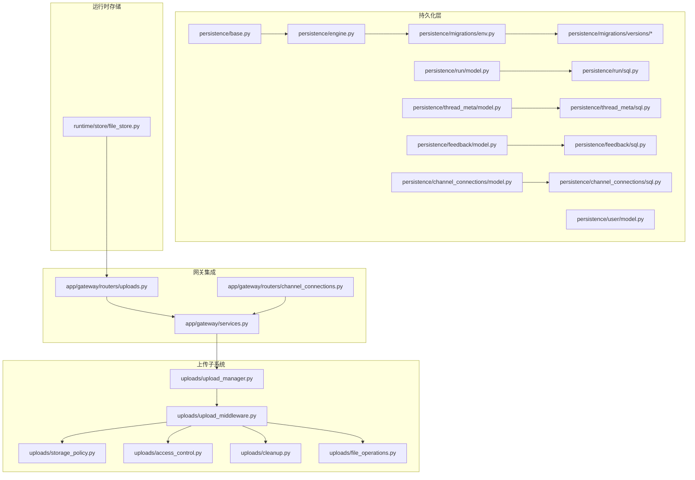
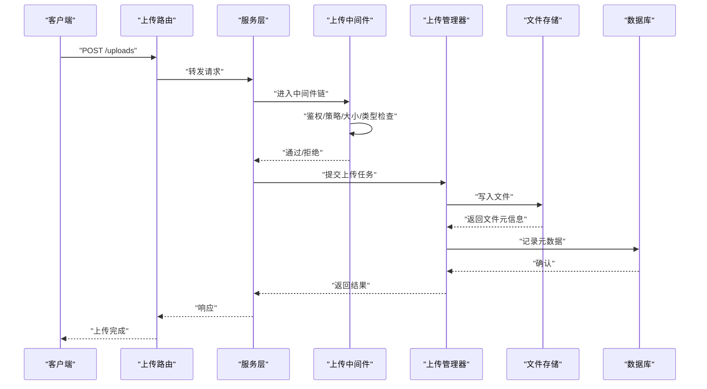
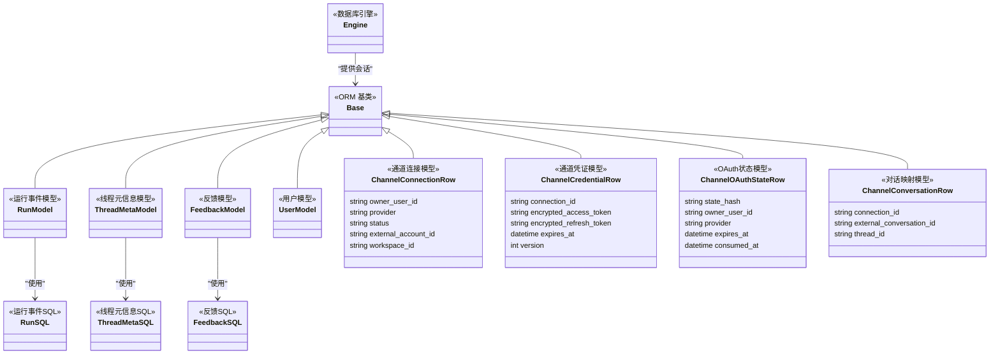
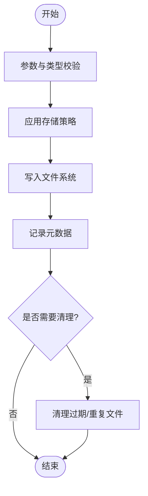
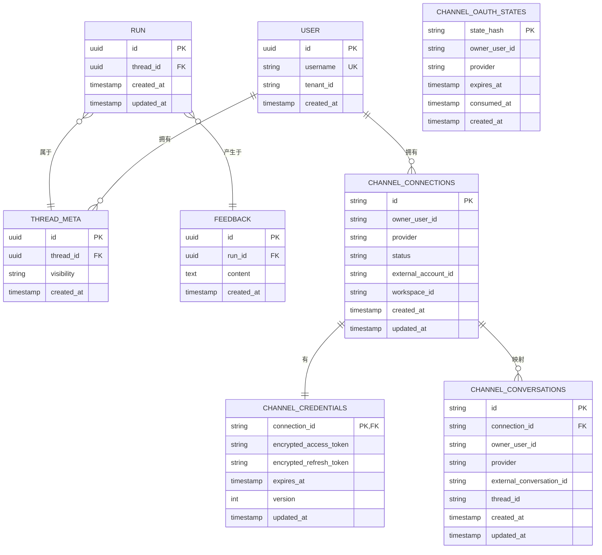
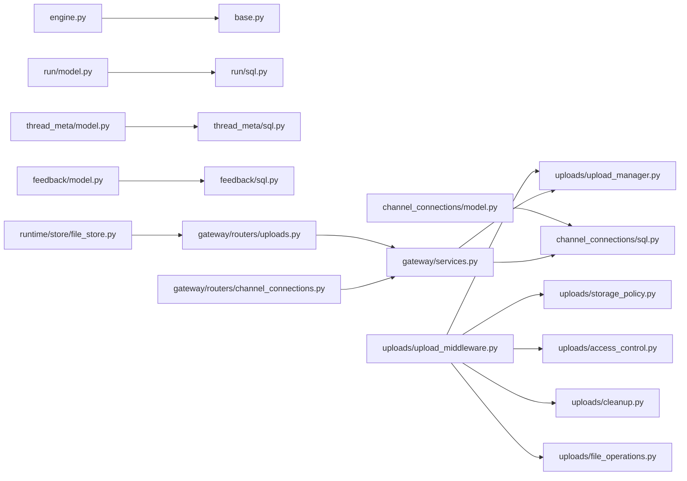

# 数据持久化

<cite>
**本文引用的文件**
- [backend/packages/harness/deerflow/persistence/base.py](file://backend/packages/harness/deerflow/persistence/base.py)
- [backend/packages/harness/deerflow/persistence/engine.py](file://backend/packages/harness/deerflow/persistence/engine.py)
- [backend/packages/harness/deerflow/persistence/models/run_event.py](file://backend/packages/harness/deerflow/persistence/models/run_event.py)
- [backend/packages/harness/deerflow/persistence/migrations/env.py](file://backend/packages/harness/deerflow/persistence/migrations/env.py)
- [backend/packages/harness/deerflow/persistence/migrations/versions/0001_initial.py](file://backend/packages/harness/deerflow/persistence/migrations/versions/0001_initial.py)
- [backend/packages/harness/deerflow/persistence/thread_meta/model.py](file://backend/packages/harness/deerflow/persistence/thread_meta/model.py)
- [backend/packages/harness/deerflow/persistence/thread_meta/sql.py](file://backend/packages/harness/deerflow/persistence/thread_meta/sql.py)
- [backend/packages/harness/deerflow/persistence/thread_meta/memory.py](file://backend/packages/harness/deerflow/persistence/thread_meta/memory.py)
- [backend/packages/harness/deerflow/persistence/run/model.py](file://backend/packages/harness/deerflow/persistence/run/model.py)
- [backend/packages/harness/deerflow/persistence/run/sql.py](file://backend/packages/harness/deerflow/persistence/run/sql.py)
- [backend/packages/harness/deerflow/persistence/user/model.py](file://backend/packages/harness/deerflow/persistence/user/model.py)
- [backend/packages/harness/deerflow/persistence/feedback/model.py](file://backend/packages/harness/deerflow/persistence/feedback/model.py)
- [backend/packages/harness/deerflow/persistence/feedback/sql.py](file://backend/packages/harness/deerflow/persistence/feedback/sql.py)
- [backend/packages/harness/deerflow/persistence/channel_connections/model.py](file://backend/packages/harness/deerflow/persistence/channel_connections/model.py)
- [backend/packages/harness/deerflow/persistence/channel_connections/sql.py](file://backend/packages/harness/deerflow/persistence/channel_connections/sql.py)
- [backend/packages/harness/deerflow/persistence/channel_connections/__init__.py](file://backend/packages/harness/deerflow/persistence/channel_connections/__init__.py)
- [backend/app/gateway/routers/channel_connections.py](file://backend/app/gateway/routers/channel_connections.py)
- [backend/app/gateway/routers/uploads.py](file://backend/app/gateway/routers/uploads.py)
- [backend/app/gateway/services.py](file://backend/app/gateway/services.py)
- [backend/docs/FILE_UPLOAD.md](file://backend/docs/FILE_UPLOAD.md)
- [backend/packages/harness/deerflow/config/database_config.py](file://backend/packages/harness/deerflow/config/database_config.py)
- [backend/packages/harness/deerflow/config/channel_connections_config.py](file://backend/packages/harness/deerflow/config/channel_connections_config.py)
- [backend/packages/harness/deerflow/runtime/store/file_store.py](file://backend/packages/harness/deerflow/runtime/store/file_store.py)
- [backend/packages/harness/deerflow/runtime/store/__init__.py](file://backend/packages/harness/deerflow/runtime/store/__init__.py)
- [backend/packages/harness/deerflow/uploads/upload_manager.py](file://backend/packages/harness/deerflow/uploads/upload_manager.py)
- [backend/packages/harness/deerflow/uploads/upload_middleware.py](file://backend/packages/harness/deerflow/uploads/upload_middleware.py)
- [backend/packages/harness/deerflow/uploads/storage_policy.py](file://backend/packages/harness/deerflow/uploads/storage_policy.py)
- [backend/packages/harness/deerflow/uploads/access_control.py](file://backend/packages/harness/deerflow/uploads/access_control.py)
- [backend/packages/harness/deerflow/uploads/cleanup.py](file://backend/packages/harness/deerflow/uploads/cleanup.py)
- [backend/packages/harness/deerflow/uploads/file_operations.py](file://backend/packages/harness/deerflow/uploads/file_operations.py)
- [backend/tests/test_channel_connections_repository.py](file://backend/tests/test_channel_connections_repository.py)
- [backend/tests/test_channel_connections_router.py](file://backend/tests/test_channel_connections_router.py)
- [backend/tests/test_channel_connections_config.py](file://backend/tests/test_channel_connections_config.py)
- [backend/tests/test_uploads_manager.py](file://backend/tests/test_uploads_manager.py)
- [backend/tests/test_uploads_middleware_core_logic.py](file://backend/tests/test_uploads_middleware_core_logic.py)
- [backend/tests/test_run_event_store.py](file://backend/tests/test_run_event_store.py)
- [backend/tests/test_run_event_store_pagination.py](file://backend/tests/test_run_event_store_pagination.py)
- [backend/tests/test_memory_storage.py](file://backend/tests/test_memory_storage.py)
- [backend/tests/test_memory_thread_meta_isolation.py](file://backend/tests/test_memory_thread_meta_isolation.py)
- [backend/tests/test_memory_upload_filtering.py](file://backend/tests/test_memory_upload_filtering.py)
</cite>

## 更新摘要
**变更内容**
- 新增通道连接系统数据持久化模块，支持用户拥有的即时消息（IM）渠道连接
- 添加数据库约束和单活跃所有者不变量，确保数据一致性和安全性
- 集成加密凭证存储和 OAuth 状态管理
- 扩展路由层以支持浏览器连接的 IM 渠道 API

## 目录
1. [简介](#简介)
2. [项目结构](#项目结构)
3. [核心组件](#核心组件)
4. [架构总览](#架构总览)
5. [详细组件分析](#详细组件分析)
6. [依赖分析](#依赖分析)
7. [性能考虑](#性能考虑)
8. [故障排查指南](#故障排查指南)
9. [结论](#结论)
10. [附录](#附录)

## 简介
本文件面向 DeerFlow 的数据持久化系统，系统性梳理数据库架构设计（模型规范、迁移管理、查询优化、缓存）、文件存储系统（上传处理、存储策略、访问控制、清理回收）以及数据模型与访问模式。文档同时提供配置示例、使用指南与最佳实践，帮助开发者高效管理与维护数据存储。

**更新** 新增通道连接系统的数据持久化模块，支持用户拥有的即时消息（IM）渠道连接，包括数据库约束、单活跃所有者不变量、加密凭证存储和 OAuth 状态管理。

## 项目结构
数据持久化相关代码主要集中在后端 harness 包的 persistence 子模块，并与运行时文件存储、上传中间件、路由服务等模块协同工作。关键目录与职责概览如下：
- persistence：数据库 ORM 基类、引擎、迁移、模型与 SQL 实现
- persistence/channel_connections：用户拥有的即时消息渠道连接持久化
- runtime/store：运行时文件存储抽象与实现
- uploads：上传管理器、中间件、存储策略、访问控制与清理回收
- app/gateway/routers：上传路由与服务集成，新增通道连接路由
- tests：覆盖持久化、内存存储、上传过滤、通道连接等测试用例

**图表来源**
- [backend/packages/harness/deerflow/persistence/base.py](file://backend/packages/harness/deerflow/persistence/base.py)
- [backend/packages/harness/deerflow/persistence/engine.py](file://backend/packages/harness/deerflow/persistence/engine.py)
- [backend/packages/harness/deerflow/persistence/migrations/env.py](file://backend/packages/harness/deerflow/persistence/migrations/env.py)
- [backend/packages/harness/deerflow/persistence/run/model.py](file://backend/packages/harness/deerflow/persistence/run/model.py)
- [backend/packages/harness/deerflow/persistence/run/sql.py](file://backend/packages/harness/deerflow/persistence/run/sql.py)
- [backend/packages/harness/deerflow/persistence/thread_meta/model.py](file://backend/packages/harness/deerflow/persistence/thread_meta/model.py)
- [backend/packages/harness/deerflow/persistence/thread_meta/sql.py](file://backend/packages/harness/deerflow/persistence/thread_meta/sql.py)
- [backend/packages/harness/deerflow/persistence/feedback/model.py](file://backend/packages/harness/deerflow/persistence/feedback/model.py)
- [backend/packages/harness/deerflow/persistence/feedback/sql.py](file://backend/packages/harness/deerflow/persistence/feedback/sql.py)
- [backend/packages/harness/deerflow/persistence/channel_connections/model.py](file://backend/packages/harness/deerflow/persistence/channel_connections/model.py)
- [backend/packages/harness/deerflow/persistence/channel_connections/sql.py](file://backend/packages/harness/deerflow/persistence/channel_connections/sql.py)
- [backend/packages/harness/deerflow/runtime/store/file_store.py](file://backend/packages/harness/deerflow/runtime/store/file_store.py)
- [backend/packages/harness/deerflow/uploads/upload_manager.py](file://backend/packages/harness/deerflow/uploads/upload_manager.py)
- [backend/packages/harness/deerflow/uploads/upload_middleware.py](file://backend/packages/harness/deerflow/uploads/upload_middleware.py)
- [backend/packages/harness/deerflow/uploads/storage_policy.py](file://backend/packages/harness/deerflow/uploads/storage_policy.py)
- [backend/packages/harness/deerflow/uploads/access_control.py](file://backend/packages/harness/deerflow/uploads/access_control.py)
- [backend/packages/harness/deerflow/uploads/cleanup.py](file://backend/packages/harness/deerflow/uploads/cleanup.py)
- [backend/packages/harness/deerflow/uploads/file_operations.py](file://backend/packages/harness/deerflow/uploads/file_operations.py)
- [backend/app/gateway/routers/uploads.py](file://backend/app/gateway/routers/uploads.py)
- [backend/app/gateway/routers/channel_connections.py](file://backend/app/gateway/routers/channel_connections.py)
- [backend/app/gateway/services.py](file://backend/app/gateway/services.py)

**章节来源**
- [backend/packages/harness/deerflow/persistence/base.py](file://backend/packages/harness/deerflow/persistence/base.py)
- [backend/packages/harness/deerflow/persistence/engine.py](file://backend/packages/harness/deerflow/persistence/engine.py)
- [backend/packages/harness/deerflow/persistence/migrations/env.py](file://backend/packages/harness/deerflow/persistence/migrations/env.py)
- [backend/packages/harness/deerflow/persistence/run/model.py](file://backend/packages/harness/deerflow/persistence/run/model.py)
- [backend/packages/harness/deerflow/persistence/thread_meta/model.py](file://backend/packages/harness/deerflow/persistence/thread_meta/model.py)
- [backend/packages/harness/deerflow/persistence/feedback/model.py](file://backend/packages/harness/deerflow/persistence/feedback/model.py)
- [backend/packages/harness/deerflow/persistence/channel_connections/model.py](file://backend/packages/harness/deerflow/persistence/channel_connections/model.py)
- [backend/packages/harness/deerflow/runtime/store/file_store.py](file://backend/packages/harness/deerflow/runtime/store/file_store.py)
- [backend/packages/harness/deerflow/uploads/upload_manager.py](file://backend/packages/harness/deerflow/uploads/upload_manager.py)
- [backend/packages/harness/deerflow/uploads/upload_middleware.py](file://backend/packages/harness/deerflow/uploads/upload_middleware.py)
- [backend/app/gateway/routers/uploads.py](file://backend/app/gateway/routers/uploads.py)
- [backend/app/gateway/routers/channel_connections.py](file://backend/app/gateway/routers/channel_connections.py)
- [backend/app/gateway/services.py](file://backend/app/gateway/services.py)

## 核心组件
- ORM 基类与引擎：统一数据库连接、会话管理与事务控制，支持多环境配置与生命周期管理。
- 迁移框架：基于 Alembic 的版本化迁移，确保数据库演进可追踪、可回滚。
- 模型与 SQL：按领域划分的模型与 SQL 层，分离业务逻辑与数据访问细节。
- **通道连接持久化**：用户拥有的即时消息渠道连接，支持加密凭证存储、OAuth 状态管理、单活跃所有者不变量。
- 文件存储：运行时文件存储抽象，结合上传中间件与策略实现安全可控的文件落地。
- 上传子系统：管理器负责任务编排，中间件负责请求拦截与校验，策略与清理保障容量与合规。

**章节来源**
- [backend/packages/harness/deerflow/persistence/base.py](file://backend/packages/harness/deerflow/persistence/base.py)
- [backend/packages/harness/deerflow/persistence/engine.py](file://backend/packages/harness/deerflow/persistence/engine.py)
- [backend/packages/harness/deerflow/persistence/migrations/env.py](file://backend/packages/harness/deerflow/persistence/migrations/env.py)
- [backend/packages/harness/deerflow/persistence/channel_connections/model.py](file://backend/packages/harness/deerflow/persistence/channel_connections/model.py)
- [backend/packages/harness/deerflow/persistence/channel_connections/sql.py](file://backend/packages/harness/deerflow/persistence/channel_connections/sql.py)
- [backend/packages/harness/deerflow/runtime/store/file_store.py](file://backend/packages/harness/deerflow/runtime/store/file_store.py)
- [backend/packages/harness/deerflow/uploads/upload_manager.py](file://backend/packages/harness/deerflow/uploads/upload_manager.py)
- [backend/packages/harness/deerflow/uploads/upload_middleware.py](file://backend/packages/harness/deerflow/uploads/upload_middleware.py)

## 架构总览
下图展示从网关到持久化与文件存储的整体流程：请求经由上传路由进入服务层，再由上传中间件进行鉴权与策略检查，随后交由上传管理器协调执行，最终落盘至运行时文件存储并写入数据库。

**图表来源**
- [backend/app/gateway/routers/uploads.py](file://backend/app/gateway/routers/uploads.py)
- [backend/app/gateway/services.py](file://backend/app/gateway/services.py)
- [backend/packages/harness/deerflow/uploads/upload_middleware.py](file://backend/packages/harness/deerflow/uploads/upload_middleware.py)
- [backend/packages/harness/deerflow/uploads/upload_manager.py](file://backend/packages/harness/deerflow/uploads/upload_manager.py)
- [backend/packages/harness/deerflow/runtime/store/file_store.py](file://backend/packages/harness/deerflow/runtime/store/file_store.py)

## 详细组件分析

### 数据库架构与模型设计
- 统一基类与引擎
  - 基类提供通用的 ORM 映射约定与工具函数，确保各模型的一致性。
  - 引擎负责数据库连接池、方言适配、事务边界与生命周期钩子。
- 迁移管理
  - 使用 Alembic 管理版本化迁移，env 中配置目标表空间与脚本路径，版本目录存放具体变更脚本。
- 模型与 SQL 分层
  - 每个领域（如 run、thread_meta、feedback、user、channel_connections）均提供模型与 SQL 实现，降低耦合度，便于独立演进与测试。

**更新** 新增通道连接持久化模块，包含以下核心模型：
- ChannelConnectionRow：用户拥有的即时消息渠道连接，支持唯一约束和索引
- ChannelCredentialRow：加密存储的渠道凭证，支持版本控制和自动更新时间戳
- ChannelOAuthStateRow：OAuth 状态管理，支持一次性消费和过期控制
- ChannelConversationRow：渠道对话映射，支持连接级别的对话隔离

**图表来源**
- [backend/packages/harness/deerflow/persistence/base.py](file://backend/packages/harness/deerflow/persistence/base.py)
- [backend/packages/harness/deerflow/persistence/engine.py](file://backend/packages/harness/deerflow/persistence/engine.py)
- [backend/packages/harness/deerflow/persistence/run/model.py](file://backend/packages/harness/deerflow/persistence/run/model.py)
- [backend/packages/harness/deerflow/persistence/run/sql.py](file://backend/packages/harness/deerflow/persistence/run/sql.py)
- [backend/packages/harness/deerflow/persistence/thread_meta/model.py](file://backend/packages/harness/deerflow/persistence/thread_meta/model.py)
- [backend/packages/harness/deerflow/persistence/thread_meta/sql.py](file://backend/packages/harness/deerflow/persistence/thread_meta/sql.py)
- [backend/packages/harness/deerflow/persistence/feedback/model.py](file://backend/packages/harness/deerflow/persistence/feedback/model.py)
- [backend/packages/harness/deerflow/persistence/feedback/sql.py](file://backend/packages/harness/deerflow/persistence/feedback/sql.py)
- [backend/packages/harness/deerflow/persistence/user/model.py](file://backend/packages/harness/deerflow/persistence/user/model.py)
- [backend/packages/harness/deerflow/persistence/channel_connections/model.py](file://backend/packages/harness/deerflow/persistence/channel_connections/model.py)

**章节来源**
- [backend/packages/harness/deerflow/persistence/base.py](file://backend/packages/harness/deerflow/persistence/base.py)
- [backend/packages/harness/deerflow/persistence/engine.py](file://backend/packages/harness/deerflow/persistence/engine.py)
- [backend/packages/harness/deerflow/persistence/migrations/env.py](file://backend/packages/harness/deerflow/persistence/migrations/env.py)
- [backend/packages/harness/deerflow/persistence/migrations/versions/0001_initial.py](file://backend/packages/harness/deerflow/persistence/migrations/versions/0001_initial.py)
- [backend/packages/harness/deerflow/persistence/run/model.py](file://backend/packages/harness/deerflow/persistence/run/model.py)
- [backend/packages/harness/deerflow/persistence/run/sql.py](file://backend/packages/harness/deerflow/persistence/run/sql.py)
- [backend/packages/harness/deerflow/persistence/thread_meta/model.py](file://backend/packages/harness/deerflow/persistence/thread_meta/model.py)
- [backend/packages/harness/deerflow/persistence/thread_meta/sql.py](file://backend/packages/harness/deerflow/persistence/thread_meta/sql.py)
- [backend/packages/harness/deerflow/persistence/feedback/model.py](file://backend/packages/harness/deerflow/persistence/feedback/model.py)
- [backend/packages/harness/deerflow/persistence/feedback/sql.py](file://backend/packages/harness/deerflow/persistence/feedback/sql.py)
- [backend/packages/harness/deerflow/persistence/user/model.py](file://backend/packages/harness/deerflow/persistence/user/model.py)
- [backend/packages/harness/deerflow/persistence/channel_connections/model.py](file://backend/packages/harness/deerflow/persistence/channel_connections/model.py)

### 查询优化与缓存机制设计
- 查询优化
  - 采用分页与索引策略，避免全表扫描；对高频查询建立复合索引或物化视图。
  - 使用批量插入与批量更新减少往返次数；在事务中聚合写操作。
  - **通道连接查询优化**：为 owner_user_id、provider、workspace_id 等关键字段建立索引，支持快速查找用户的所有连接。
- 缓存机制
  - 对热点读取（如线程元信息、用户配置）引入二级缓存，设置合理过期时间与失效策略。
  - 结合缓存标签与失效队列，保证一致性与性能平衡。

### 文件存储系统
- 文件上传处理
  - 路由接收上传请求，服务层进行参数解析与校验，中间件执行鉴权、大小限制、类型白名单与内容检测。
  - 管理器根据策略选择存储位置与命名规则，调用文件操作接口写入，记录元数据并返回结果。
- 存储策略设计
  - 支持本地直存与对象存储（如 S3），策略可按租户/用户隔离，支持热温冷分层与压缩归档。
- 访问权限控制
  - 基于 JWT 令牌与资源级 ACL，限制文件可见范围；支持预签名链接与临时授权。
- 清理回收机制
  - 定时任务扫描过期未取走文件与重复冗余文件，触发删除与回收站归档。

**图表来源**
- [backend/app/gateway/routers/uploads.py](file://backend/app/gateway/routers/uploads.py)
- [backend/app/gateway/services.py](file://backend/app/gateway/services.py)
- [backend/packages/harness/deerflow/uploads/upload_middleware.py](file://backend/packages/harness/deerflow/uploads/upload_middleware.py)
- [backend/packages/harness/deerflow/uploads/upload_manager.py](file://backend/packages/harness/deerflow/uploads/upload_manager.py)
- [backend/packages/harness/deerflow/uploads/storage_policy.py](file://backend/packages/harness/deerflow/uploads/storage_policy.py)
- [backend/packages/harness/deerflow/uploads/cleanup.py](file://backend/packages/harness/deerflow/uploads/cleanup.py)

**章节来源**
- [backend/app/gateway/routers/uploads.py](file://backend/app/gateway/routers/uploads.py)
- [backend/app/gateway/services.py](file://backend/app/gateway/services.py)
- [backend/packages/harness/deerflow/uploads/upload_middleware.py](file://backend/packages/harness/deerflow/uploads/upload_middleware.py)
- [backend/packages/harness/deerflow/uploads/upload_manager.py](file://backend/packages/harness/deerflow/uploads/upload_manager.py)
- [backend/packages/harness/deerflow/uploads/storage_policy.py](file://backend/packages/harness/deerflow/uploads/storage_policy.py)
- [backend/packages/harness/deerflow/uploads/access_control.py](file://backend/packages/harness/deerflow/uploads/access_control.py)
- [backend/packages/harness/deerflow/uploads/cleanup.py](file://backend/packages/harness/deerflow/uploads/cleanup.py)
- [backend/packages/harness/deerflow/uploads/file_operations.py](file://backend/packages/harness/deerflow/uploads/file_operations.py)
- [backend/docs/FILE_UPLOAD.md](file://backend/docs/FILE_UPLOAD.md)

### 数据模型设计与实体关系
- 实体关系
  - run：承载一次运行事件，关联 thread_meta 与 feedback。
  - thread_meta：线程维度的元信息，支持隔离与权限控制。
  - feedback：用户反馈，与 run 关联。
  - user：用户主体，用于访问控制与审计。
  - **channel_connections**：用户拥有的即时消息渠道连接，支持一对一凭证、一对多对话映射。
- 字段定义与约束
  - 主键与外键：统一使用 UUID 主键，外键约束保证引用完整性。
  - 时间戳：创建/更新时间自动维护，支持时区与排序。
  - 约束：非空、唯一、枚举值域等，确保数据一致性。
  - **数据库约束**：通道连接支持唯一约束（owner_user_id, provider, external_account_id, workspace_id），防止重复连接。
- 复杂度与性能
  - 建立必要索引以支撑高频查询；对大字段采用延迟加载或外部存储。
  - **通道连接索引**：为 owner_user_id、provider、workspace_id、bot_user_id 建立复合索引，优化查询性能。

**更新** 新增通道连接系统的实体关系图：

**图表来源**
- [backend/packages/harness/deerflow/persistence/run/model.py](file://backend/packages/harness/deerflow/persistence/run/model.py)
- [backend/packages/harness/deerflow/persistence/thread_meta/model.py](file://backend/packages/harness/deerflow/persistence/thread_meta/model.py)
- [backend/packages/harness/deerflow/persistence/feedback/model.py](file://backend/packages/harness/deerflow/persistence/feedback/model.py)
- [backend/packages/harness/deerflow/persistence/user/model.py](file://backend/packages/harness/deerflow/persistence/user/model.py)
- [backend/packages/harness/deerflow/persistence/channel_connections/model.py](file://backend/packages/harness/deerflow/persistence/channel_connections/model.py)

**章节来源**
- [backend/packages/harness/deerflow/persistence/run/model.py](file://backend/packages/harness/deerflow/persistence/run/model.py)
- [backend/packages/harness/deerflow/persistence/thread_meta/model.py](file://backend/packages/harness/deerflow/persistence/thread_meta/model.py)
- [backend/packages/harness/deerflow/persistence/feedback/model.py](file://backend/packages/harness/deerflow/persistence/feedback/model.py)
- [backend/packages/harness/deerflow/persistence/user/model.py](file://backend/packages/harness/deerflow/persistence/user/model.py)
- [backend/packages/harness/deerflow/persistence/channel_connections/model.py](file://backend/packages/harness/deerflow/persistence/channel_connections/model.py)

### 通道连接系统详解
**新增** 通道连接系统是 DeerFlow 的重要扩展，支持用户拥有的即时消息（IM）渠道连接。该系统包含以下核心特性：

#### 数据库约束与不变量
- **单活跃所有者不变量**：每个用户只能有一个活跃的渠道连接，通过唯一约束确保数据一致性
- **加密凭证存储**：使用 Fernet 对称加密算法保护敏感的访问令牌和刷新令牌
- **OAuth 状态管理**：支持一次性消费的 OAuth 状态，防止重放攻击
- **对话映射隔离**：每个连接的对话映射相互隔离，支持跨用户共享相同外部对话ID

#### 核心模型设计
- **ChannelConnectionRow**：用户拥有的渠道连接，支持唯一约束和索引优化
- **ChannelCredentialRow**：加密存储的凭证，支持版本控制和自动更新时间戳
- **ChannelOAuthStateRow**：OAuth 状态管理，支持过期控制和一次性消费
- **ChannelConversationRow**：对话映射，支持连接级别的隔离

#### 安全特性
- **凭证加密**：所有敏感信息在存储前进行加密，解密仅在需要时进行
- **访问控制**：每个连接都绑定到特定用户，防止越权访问
- **审计日志**：记录连接状态变化和凭证操作历史

**章节来源**
- [backend/packages/harness/deerflow/persistence/channel_connections/model.py](file://backend/packages/harness/deerflow/persistence/channel_connections/model.py)
- [backend/packages/harness/deerflow/persistence/channel_connections/sql.py](file://backend/packages/harness/deerflow/persistence/channel_connections/sql.py)
- [backend/packages/harness/deerflow/persistence/channel_connections/__init__.py](file://backend/packages/harness/deerflow/persistence/channel_connections/__init__.py)
- [backend/app/gateway/routers/channel_connections.py](file://backend/app/gateway/routers/channel_connections.py)
- [backend/packages/harness/deerflow/config/channel_connections_config.py](file://backend/packages/harness/deerflow/config/channel_connections_config.py)

### 数据访问模式与安全要求
- 访问模式
  - 读多写少场景：对只读查询使用只读副本或缓存；写操作集中于主库并使用事务。
  - 高并发写入：采用批量写与异步队列，削峰填谷。
  - **通道连接访问模式**：用户连接查询按 owner_user_id 过滤，支持分页和排序。
- 安全要求
  - 传输加密：TLS 保护数据库与对象存储通信。
  - 存储加密：敏感字段加密存储，密钥轮换与审计日志。
  - 权限最小化：基于角色的访问控制（RBAC），资源级 ACL 与行级安全策略。
  - **凭证安全**：通道连接凭证使用强加密算法，密钥管理遵循安全最佳实践。

## 依赖分析
- 组件内聚与耦合
  - persistence 各子模块低耦合，通过统一基类与引擎交互；run/thread_meta/feedback/user 模块相互独立，仅通过外键关联。
  - **通道连接模块**：与基础 persistence 模块完全集成，通过外键关系与运行时存储解耦。
- 外部依赖
  - 数据库驱动与 Alembic；文件系统或对象存储 SDK；JWT 与 ACL 库；**Fernet 加密库**。
- 循环依赖
  - 通过分层与接口抽象避免循环导入；SQL 层仅依赖模型层，不反向依赖服务层。

**更新** 新增通道连接模块的依赖关系：

**图表来源**
- [backend/packages/harness/deerflow/persistence/engine.py](file://backend/packages/harness/deerflow/persistence/engine.py)
- [backend/packages/harness/deerflow/persistence/base.py](file://backend/packages/harness/deerflow/persistence/base.py)
- [backend/packages/harness/deerflow/persistence/run/model.py](file://backend/packages/harness/deerflow/persistence/run/model.py)
- [backend/packages/harness/deerflow/persistence/run/sql.py](file://backend/packages/harness/deerflow/persistence/run/sql.py)
- [backend/packages/harness/deerflow/persistence/thread_meta/model.py](file://backend/packages/harness/deerflow/persistence/thread_meta/model.py)
- [backend/packages/harness/deerflow/persistence/thread_meta/sql.py](file://backend/packages/harness/deerflow/persistence/thread_meta/sql.py)
- [backend/packages/harness/deerflow/persistence/feedback/model.py](file://backend/packages/harness/deerflow/persistence/feedback/model.py)
- [backend/packages/harness/deerflow/persistence/feedback/sql.py](file://backend/packages/harness/deerflow/persistence/feedback/sql.py)
- [backend/packages/harness/deerflow/persistence/channel_connections/model.py](file://backend/packages/harness/deerflow/persistence/channel_connections/model.py)
- [backend/packages/harness/deerflow/persistence/channel_connections/sql.py](file://backend/packages/harness/deerflow/persistence/channel_connections/sql.py)
- [backend/packages/harness/deerflow/uploads/upload_middleware.py](file://backend/packages/harness/deerflow/uploads/upload_middleware.py)
- [backend/packages/harness/deerflow/uploads/upload_manager.py](file://backend/packages/harness/deerflow/uploads/upload_manager.py)
- [backend/packages/harness/deerflow/uploads/storage_policy.py](file://backend/packages/harness/deerflow/uploads/storage_policy.py)
- [backend/packages/harness/deerflow/uploads/access_control.py](file://backend/packages/harness/deerflow/uploads/access_control.py)
- [backend/packages/harness/deerflow/uploads/cleanup.py](file://backend/packages/harness/deerflow/uploads/cleanup.py)
- [backend/packages/harness/deerflow/uploads/file_operations.py](file://backend/packages/harness/deerflow/uploads/file_operations.py)
- [backend/app/gateway/routers/uploads.py](file://backend/app/gateway/routers/uploads.py)
- [backend/app/gateway/routers/channel_connections.py](file://backend/app/gateway/routers/channel_connections.py)
- [backend/app/gateway/services.py](file://backend/app/gateway/services.py)
- [backend/packages/harness/deerflow/runtime/store/file_store.py](file://backend/packages/harness/deerflow/runtime/store/file_store.py)

**章节来源**
- [backend/packages/harness/deerflow/persistence/engine.py](file://backend/packages/harness/deerflow/persistence/engine.py)
- [backend/packages/harness/deerflow/persistence/base.py](file://backend/packages/harness/deerflow/persistence/base.py)
- [backend/packages/harness/deerflow/persistence/run/model.py](file://backend/packages/harness/deerflow/persistence/run/model.py)
- [backend/packages/harness/deerflow/persistence/thread_meta/model.py](file://backend/packages/harness/deerflow/persistence/thread_meta/model.py)
- [backend/packages/harness/deerflow/persistence/feedback/model.py](file://backend/packages/harness/deerflow/persistence/feedback/model.py)
- [backend/packages/harness/deerflow/persistence/channel_connections/model.py](file://backend/packages/harness/deerflow/persistence/channel_connections/model.py)
- [backend/packages/harness/deerflow/persistence/channel_connections/sql.py](file://backend/packages/harness/deerflow/persistence/channel_connections/sql.py)
- [backend/packages/harness/deerflow/uploads/upload_middleware.py](file://backend/packages/harness/deerflow/uploads/upload_middleware.py)
- [backend/packages/harness/deerflow/uploads/upload_manager.py](file://backend/packages/harness/deerflow/uploads/upload_manager.py)
- [backend/app/gateway/routers/uploads.py](file://backend/app/gateway/routers/uploads.py)
- [backend/app/gateway/routers/channel_connections.py](file://backend/app/gateway/routers/channel_connections.py)
- [backend/app/gateway/services.py](file://backend/app/gateway/services.py)
- [backend/packages/harness/deerflow/runtime/store/file_store.py](file://backend/packages/harness/deerflow/runtime/store/file_store.py)

## 性能考虑
- 数据库层面
  - 合理索引：对常用过滤与排序字段建立索引；避免过度索引导致写入开销增大。
  - 连接池：配置最大连接数与空闲超时，避免峰值拥塞。
  - 分片与分区：按时间或租户维度水平拆分，提升查询与维护效率。
  - **通道连接索引优化**：为 owner_user_id、provider、workspace_id 建立复合索引，优化用户连接查询性能。
- 文件系统层面
  - 批量写入：合并小文件，减少 inode 与目录项压力。
  - 并发控制：使用文件锁或分布式锁避免竞态。
  - 压缩与去重：对重复内容进行去重与压缩，节省存储成本。
- **加密性能考虑**
  - 凭证加密：使用高效的对称加密算法，避免影响系统性能。
  - 缓存策略：对频繁访问的连接信息进行缓存，减少数据库查询次数。

## 故障排查指南
- 数据库迁移失败
  - 检查 Alembic 版本与目标数据库兼容性；核对 env 配置与权限；查看迁移日志定位冲突。
- 上传失败或权限异常
  - 核对中间件策略配置（大小、类型、白名单）；检查 ACL 规则与 JWT 令牌有效性；验证存储后端可用性。
- 文件丢失或不可访问
  - 检查清理任务调度与保留策略；确认文件路径与权限；比对元数据与实际文件一致性。
- 性能退化
  - 分析慢查询日志与索引使用情况；评估连接池与并发阈值；监控磁盘与网络 IO。
- **通道连接故障排查**
  - 凭证解密失败：检查加密密钥是否正确，查看解密错误日志。
  - 连接状态异常：验证唯一约束是否被违反，检查连接状态更新逻辑。
  - OAuth 状态问题：确认状态哈希计算正确，检查过期时间设置。

**章节来源**
- [backend/packages/harness/deerflow/persistence/migrations/env.py](file://backend/packages/harness/deerflow/persistence/migrations/env.py)
- [backend/packages/harness/deerflow/persistence/channel_connections/sql.py](file://backend/packages/harness/deerflow/persistence/channel_connections/sql.py)
- [backend/packages/harness/deerflow/persistence/channel_connections/model.py](file://backend/packages/harness/deerflow/persistence/channel_connections/model.py)
- [backend/packages/harness/deerflow/uploads/upload_middleware.py](file://backend/packages/harness/deerflow/uploads/upload_middleware.py)
- [backend/packages/harness/deerflow/uploads/access_control.py](file://backend/packages/harness/deerflow/uploads/access_control.py)
- [backend/packages/harness/deerflow/uploads/cleanup.py](file://backend/packages/harness/deerflow/uploads/cleanup.py)
- [backend/tests/test_channel_connections_repository.py](file://backend/tests/test_channel_connections_repository.py)
- [backend/tests/test_channel_connections_router.py](file://backend/tests/test_channel_connections_router.py)
- [backend/tests/test_channel_connections_config.py](file://backend/tests/test_channel_connections_config.py)
- [backend/tests/test_uploads_manager.py](file://backend/tests/test_uploads_manager.py)
- [backend/tests/test_uploads_middleware_core_logic.py](file://backend/tests/test_uploads_middleware_core_logic.py)
- [backend/tests/test_run_event_store.py](file://backend/tests/test_run_event_store.py)
- [backend/tests/test_run_event_store_pagination.py](file://backend/tests/test_run_event_store_pagination.py)
- [backend/tests/test_memory_storage.py](file://backend/tests/test_memory_storage.py)
- [backend/tests/test_memory_thread_meta_isolation.py](file://backend/tests/test_memory_thread_meta_isolation.py)
- [backend/tests/test_memory_upload_filtering.py](file://backend/tests/test_memory_upload_filtering.py)

## 结论
DeerFlow 的数据持久化体系通过清晰的分层与模块化设计，实现了数据库与文件系统的解耦与可扩展。配合完善的迁移、缓存与安全策略，能够满足高并发与合规要求。

**更新** 新增的通道连接系统进一步增强了 DeerFlow 的即时消息集成能力，通过严格的数据库约束和加密机制，确保用户数据的安全性和一致性。该系统支持多种即时消息平台，为用户提供灵活的连接管理体验。

建议在生产环境中持续完善索引与分区策略，强化监控与告警，并定期演练迁移与恢复流程。对于通道连接系统，特别需要注意加密密钥的安全管理与轮换策略。

## 附录
- 配置示例与最佳实践
  - 数据库配置：参考数据库配置模块，设置连接池、方言与 TLS 参数。
  - 上传策略：按租户/用户设定大小上限、类型白名单与保留周期。
  - 缓存策略：热点数据缓存 5–15 分钟，长尾数据使用 LRU 或 LFU。
  - 安全加固：启用 HTTPS/TLS、最小权限原则、定期密钥轮换与审计日志。
  - **通道连接配置**：为每个支持的即时消息平台配置相应的认证参数和运行时设置。
  - **凭证安全管理**：使用强随机密钥进行凭证加密，定期轮换加密密钥并备份。

**章节来源**
- [backend/packages/harness/deerflow/config/database_config.py](file://backend/packages/harness/deerflow/config/database_config.py)
- [backend/packages/harness/deerflow/config/channel_connections_config.py](file://backend/packages/harness/deerflow/config/channel_connections_config.py)
- [backend/packages/harness/deerflow/uploads/storage_policy.py](file://backend/packages/harness/deerflow/uploads/storage_policy.py)
- [backend/packages/harness/deerflow/uploads/access_control.py](file://backend/packages/harness/deerflow/uploads/access_control.py)
- [backend/packages/harness/deerflow/runtime/store/file_store.py](file://backend/packages/harness/deerflow/runtime/store/file_store.py)
- [backend/docs/FILE_UPLOAD.md](file://backend/docs/FILE_UPLOAD.md)