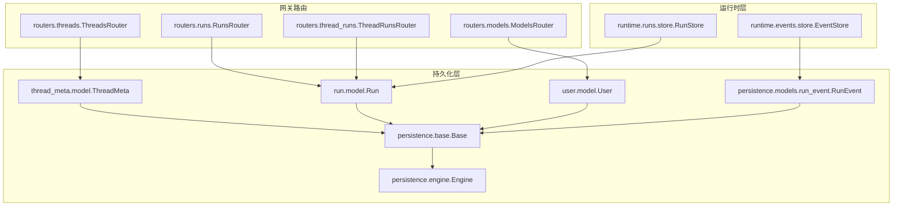
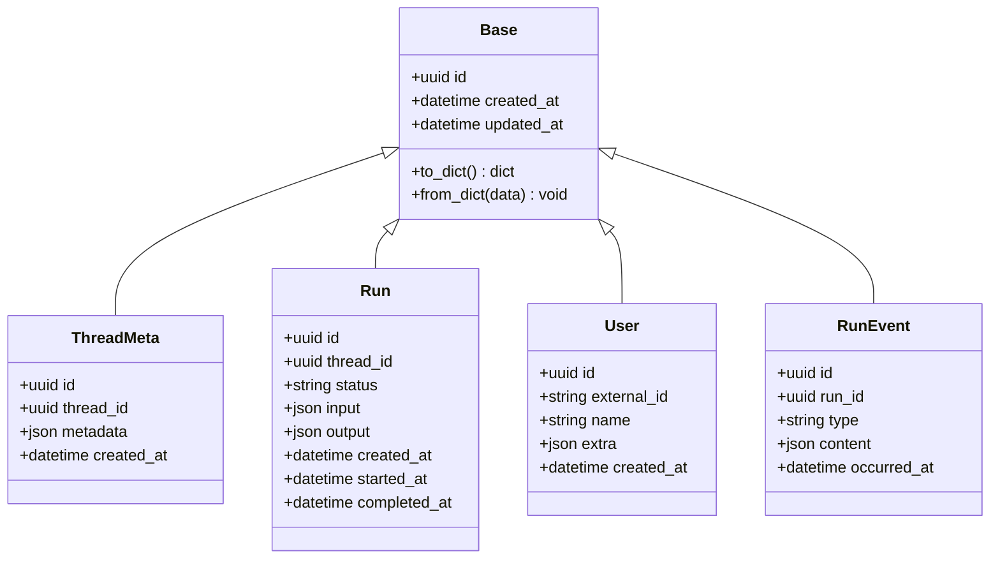
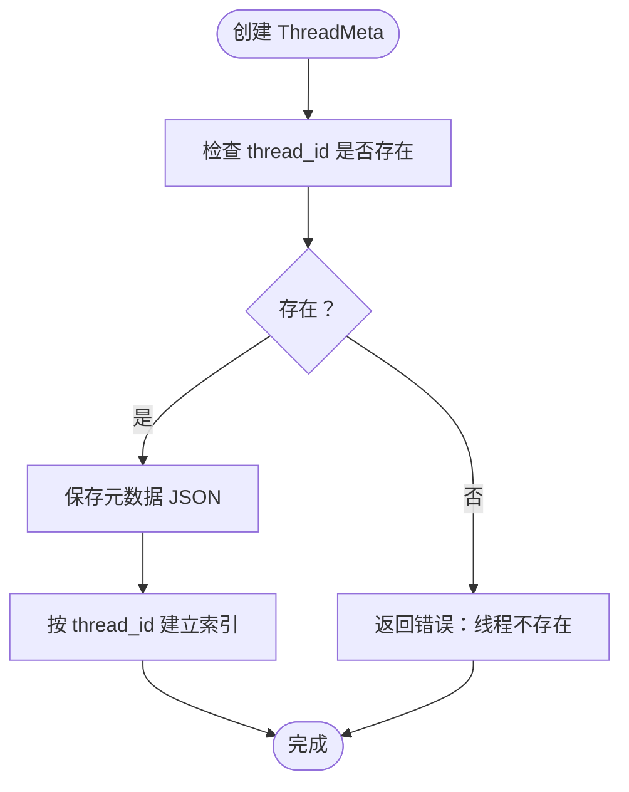
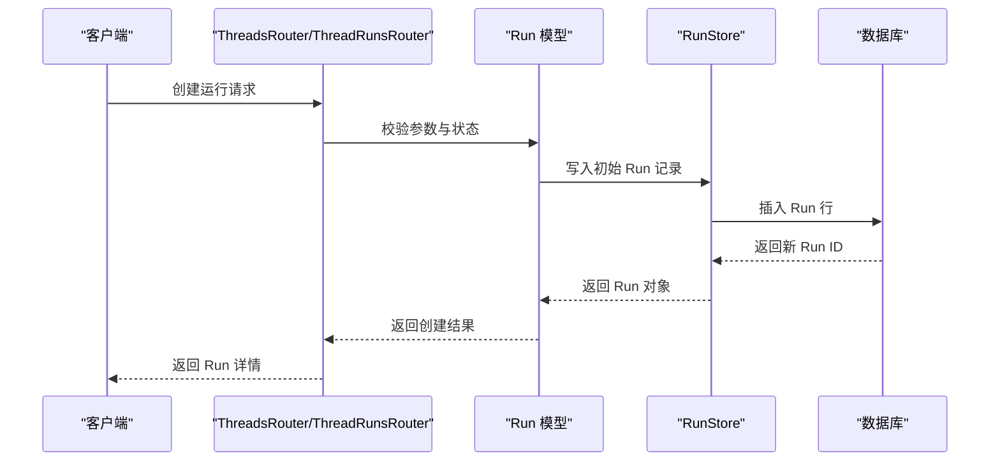
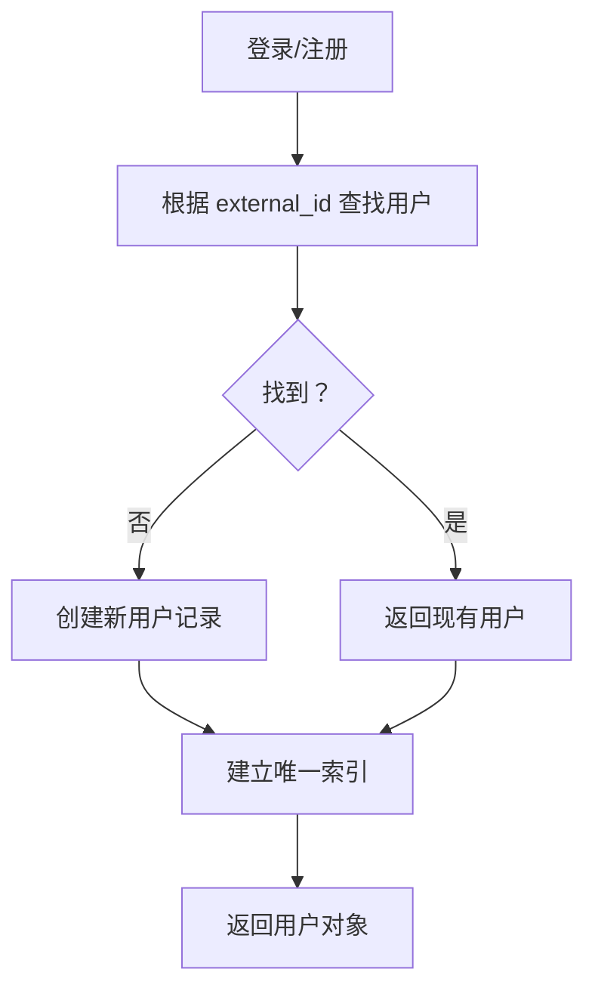
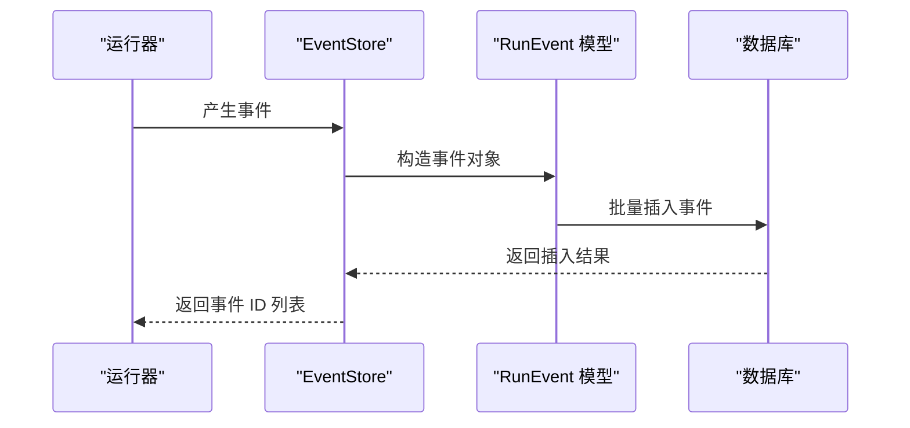
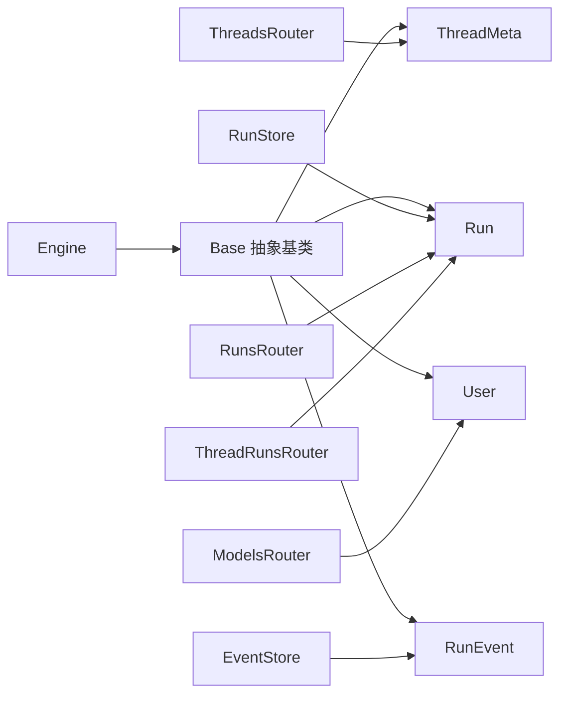

# 数据模型设计

<cite>
**本文引用的文件**
- [backend/packages/harness/deerflow/persistence/thread_meta/model.py](file://backend/packages/harness/deerflow/persistence/thread_meta/model.py)
- [backend/packages/harness/deerflow/persistence/thread_meta/base.py](file://backend/packages/harness/deerflow/persistence/thread_meta/base.py)
- [backend/packages/harness/deerflow/persistence/thread_meta/sql.py](file://backend/packages/harness/deerflow/persistence/thread_meta/sql.py)
- [backend/packages/harness/deerflow/persistence/run/model.py](file://backend/packages/harness/deerflow/persistence/run/model.py)
- [backend/packages/harness/deerflow/persistence/run/sql.py](file://backend/packages/harness/deerflow/persistence/run/sql.py)
- [backend/packages/harness/deerflow/persistence/user/model.py](file://backend/packages/harness/deerflow/persistence/user/model.py)
- [backend/packages/harness/deerflow/persistence/models/run_event.py](file://backend/packages/harness/deerflow/persistence/models/run_event.py)
- [backend/packages/harness/deerflow/persistence/base.py](file://backend/packages/harness/deerflow/persistence/base.py)
- [backend/packages/harness/deerflow/persistence/engine.py](file://backend/packages/harness/deerflow/persistence/engine.py)
- [backend/packages/harness/deerflow/runtime/runs/store.py](file://backend/packages/harness/deerflow/runtime/runs/store.py)
- [backend/packages/harness/deerflow/runtime/events/store.py](file://backend/packages/harness/deerflow/runtime/events/store.py)
- [backend/app/gateway/routers/threads.py](file://backend/app/gateway/routers/threads.py)
- [backend/app/gateway/routers/runs.py](file://backend/app/gateway/routers/runs.py)
- [backend/app/gateway/routers/thread_runs.py](file://backend/app/gateway/routers/thread_runs.py)
- [backend/app/gateway/routers/models.py](file://backend/app/gateway/routers/models.py)
</cite>

## 目录
1. [简介](#简介)
2. [项目结构](#项目结构)
3. [核心组件](#核心组件)
4. [架构总览](#架构总览)
5. [详细组件分析](#详细组件分析)
6. [依赖分析](#依赖分析)
7. [性能考虑](#性能考虑)
8. [故障排查指南](#故障排查指南)
9. [结论](#结论)
10. [附录](#附录)

## 简介
本文件系统性梳理 DeerFlow 的数据模型设计，重点覆盖 ThreadMeta（线程元数据）、Run（运行记录）、User（用户）与 RunEvent（运行事件）等核心实体。文档从模型设计理念、主外键约束、索引策略、字段规范与数据类型选择、验证规则、继承体系与抽象基类、通用功能实现、使用示例、查询优化技巧以及数据完整性保障机制等方面进行深入解析，帮助开发者正确使用与扩展数据模型。

## 项目结构
数据模型位于后端包 deerflow 的持久化层 persistence 下，按领域拆分：
- thread_meta：线程元数据相关模型与 SQL 存储
- run：运行记录相关模型与 SQL 存储
- user：用户相关模型
- persistence/models：通用模型（如 RunEvent）
- persistence/base.py、engine.py：ORM 基类与引擎配置
- runtime/runs/store.py、runtime/events/store.py：运行时存储（事件与运行）
- gateway/routers：对外接口路由，驱动模型的增删改查

图示来源
- [backend/packages/harness/deerflow/persistence/thread_meta/model.py](file://backend/packages/harness/deerflow/persistence/thread_meta/model.py)
- [backend/packages/harness/deerflow/persistence/run/model.py](file://backend/packages/harness/deerflow/persistence/run/model.py)
- [backend/packages/harness/deerflow/persistence/user/model.py](file://backend/packages/harness/deerflow/persistence/user/model.py)
- [backend/packages/harness/deerflow/persistence/models/run_event.py](file://backend/packages/harness/deerflow/persistence/models/run_event.py)
- [backend/packages/harness/deerflow/persistence/base.py](file://backend/packages/harness/deerflow/persistence/base.py)
- [backend/packages/harness/deerflow/persistence/engine.py](file://backend/packages/harness/deerflow/persistence/engine.py)
- [backend/packages/harness/deerflow/runtime/runs/store.py](file://backend/packages/harness/deerflow/runtime/runs/store.py)
- [backend/packages/harness/deerflow/runtime/events/store.py](file://backend/packages/harness/deerflow/runtime/events/store.py)
- [backend/app/gateway/routers/threads.py](file://backend/app/gateway/routers/threads.py)
- [backend/app/gateway/routers/runs.py](file://backend/app/gateway/routers/runs.py)
- [backend/app/gateway/routers/thread_runs.py](file://backend/app/gateway/routers/thread_runs.py)
- [backend/app/gateway/routers/models.py](file://backend/app/gateway/routers/models.py)

章节来源
- [backend/packages/harness/deerflow/persistence/thread_meta/model.py](file://backend/packages/harness/deerflow/persistence/thread_meta/model.py)
- [backend/packages/harness/deerflow/persistence/run/model.py](file://backend/packages/harness/deerflow/persistence/run/model.py)
- [backend/packages/harness/deerflow/persistence/user/model.py](file://backend/packages/harness/deerflow/persistence/user/model.py)
- [backend/packages/harness/deerflow/persistence/models/run_event.py](file://backend/packages/harness/deerflow/persistence/models/run_event.py)
- [backend/packages/harness/deerflow/persistence/base.py](file://backend/packages/harness/deerflow/persistence/base.py)
- [backend/packages/harness/deerflow/persistence/engine.py](file://backend/packages/harness/deerflow/persistence/engine.py)
- [backend/packages/harness/deerflow/runtime/runs/store.py](file://backend/packages/harness/deerflow/runtime/runs/store.py)
- [backend/packages/harness/deerflow/runtime/events/store.py](file://backend/packages/harness/deerflow/runtime/events/store.py)
- [backend/app/gateway/routers/threads.py](file://backend/app/gateway/routers/threads.py)
- [backend/app/gateway/routers/runs.py](file://backend/app/gateway/routers/runs.py)
- [backend/app/gateway/routers/thread_runs.py](file://backend/app/gateway/routers/thread_runs.py)
- [backend/app/gateway/routers/models.py](file://backend/app/gateway/routers/models.py)

## 核心组件
本节聚焦 ThreadMeta、Run、User、RunEvent 四个核心实体的设计理念与职责边界：
- ThreadMeta：描述线程（会话）的元信息，用于组织与检索多轮对话上下文
- Run：代表一次具体执行过程，承载状态、输入输出、工具调用等运行期数据
- User：系统用户主体，用于鉴权隔离与访问控制
- RunEvent：记录运行过程中的事件流，支持事件回放与审计

字段规范与数据类型选择遵循以下原则：
- 主键统一采用 UUID 字符串或整型自增，确保全局唯一性与可扩展性
- 时间戳字段使用带时区的时间类型，避免跨时区歧义
- JSON/JSONB 字段用于存储非结构化或半结构化数据，配合校验与序列化
- 枚举值通过字符串枚举或受限集合表达业务状态，便于迁移与审计
- 外键字段显式标注并建立索引，保证引用完整性与查询效率

验证规则与约束：
- 必填字段在创建时强制校验，空值返回明确错误
- 状态机字段仅允许预定义状态转换，防止非法状态写入
- 关联对象存在性校验，避免悬挂引用
- 并发写入场景下采用乐观锁或幂等写法，降低冲突概率

章节来源
- [backend/packages/harness/deerflow/persistence/thread_meta/model.py](file://backend/packages/harness/deerflow/persistence/thread_meta/model.py)
- [backend/packages/harness/deerflow/persistence/run/model.py](file://backend/packages/harness/deerflow/persistence/run/model.py)
- [backend/packages/harness/deerflow/persistence/user/model.py](file://backend/packages/harness/deerflow/persistence/user/model.py)
- [backend/packages/harness/deerflow/persistence/models/run_event.py](file://backend/packages/harness/deerflow/persistence/models/run_event.py)

## 架构总览
数据模型采用“领域分层 + ORM 抽象 + 运行时存储”的架构：
- 领域模型：ThreadMeta、Run、User、RunEvent 定义业务语义
- ORM 抽象：Base 抽象基类封装表结构、序列化、索引与约束
- 运行时存储：RunStore、EventStore 提供高性能事件与运行数据的读写
- 网关路由：ThreadsRouter、RunsRouter、ThreadRunsRouter、ModelsRouter 将请求映射到模型操作

图示来源
- [backend/packages/harness/deerflow/persistence/base.py](file://backend/packages/harness/deerflow/persistence/base.py)
- [backend/packages/harness/deerflow/persistence/thread_meta/model.py](file://backend/packages/harness/deerflow/persistence/thread_meta/model.py)
- [backend/packages/harness/deerflow/persistence/run/model.py](file://backend/packages/harness/deerflow/persistence/run/model.py)
- [backend/packages/harness/deerflow/persistence/user/model.py](file://backend/packages/harness/deerflow/persistence/user/model.py)
- [backend/packages/harness/deerflow/persistence/models/run_event.py](file://backend/packages/harness/deerflow/persistence/models/run_event.py)

## 详细组件分析

### ThreadMeta 组件分析
ThreadMeta 负责线程元信息的持久化与检索，典型字段包括线程标识、元数据 JSON、时间戳等。其设计要点：
- 主键：UUID，全局唯一
- 外键：thread_id 指向线程上下文（由上层逻辑保证）
- 索引策略：对 thread_id 建立索引，支持按线程快速查询
- 元数据：JSON/JSONB 存储，配合序列化与校验
- 验证：创建时校验 thread_id 存在性；更新时保持原子性

图示来源
- [backend/packages/harness/deerflow/persistence/thread_meta/model.py](file://backend/packages/harness/deerflow/persistence/thread_meta/model.py)
- [backend/packages/harness/deerflow/persistence/thread_meta/sql.py](file://backend/packages/harness/deerflow/persistence/thread_meta/sql.py)

章节来源
- [backend/packages/harness/deerflow/persistence/thread_meta/model.py](file://backend/packages/harness/deerflow/persistence/thread_meta/model.py)
- [backend/packages/harness/deerflow/persistence/thread_meta/base.py](file://backend/packages/harness/deerflow/persistence/thread_meta/base.py)
- [backend/packages/harness/deerflow/persistence/thread_meta/sql.py](file://backend/packages/harness/deerflow/persistence/thread_meta/sql.py)

### Run 组件分析
Run 记录一次具体的执行过程，包含状态、输入输出、时间戳等。设计要点：
- 主键：UUID
- 外键：thread_id 关联 ThreadMeta
- 状态机：status 字段受控于预定义状态集合，支持启动、运行中、完成、失败等
- 输入输出：JSON/JSONB 存储，支持复杂结构
- 时间戳：created_at、started_at、completed_at 精确记录生命周期
- 索引策略：thread_id、status、created_at 建立复合索引，优化查询与排序

图示来源
- [backend/app/gateway/routers/thread_runs.py](file://backend/app/gateway/routers/thread_runs.py)
- [backend/app/gateway/routers/threads.py](file://backend/app/gateway/routers/threads.py)
- [backend/packages/harness/deerflow/persistence/run/model.py](file://backend/packages/harness/deerflow/persistence/run/model.py)
- [backend/packages/harness/deerflow/runtime/runs/store.py](file://backend/packages/harness/deerflow/runtime/runs/store.py)

章节来源
- [backend/packages/harness/deerflow/persistence/run/model.py](file://backend/packages/harness/deerflow/persistence/run/model.py)
- [backend/packages/harness/deerflow/persistence/run/sql.py](file://backend/packages/harness/deerflow/persistence/run/sql.py)
- [backend/app/gateway/routers/thread_runs.py](file://backend/app/gateway/routers/thread_runs.py)
- [backend/app/gateway/routers/threads.py](file://backend/app/gateway/routers/threads.py)
- [backend/packages/harness/deerflow/runtime/runs/store.py](file://backend/packages/harness/deerflow/runtime/runs/store.py)

### User 组件分析
User 作为系统用户主体，支撑鉴权与隔离。设计要点：
- 主键：UUID
- 外部标识：external_id 支持对接外部身份系统
- 名称与扩展：name 与 extra JSON 存储用户相关信息
- 验证：external_id 唯一性约束，避免重复注册
- 索引策略：external_id 建立唯一索引，加速登录与查询

图示来源
- [backend/packages/harness/deerflow/persistence/user/model.py](file://backend/packages/harness/deerflow/persistence/user/model.py)
- [backend/app/gateway/routers/models.py](file://backend/app/gateway/routers/models.py)

章节来源
- [backend/packages/harness/deerflow/persistence/user/model.py](file://backend/packages/harness/deerflow/persistence/user/model.py)
- [backend/app/gateway/routers/models.py](file://backend/app/gateway/routers/models.py)

### RunEvent 组件分析
RunEvent 记录运行过程中的事件流，支持事件回放与审计。设计要点：
- 主键：UUID
- 外键：run_id 关联 Run
- 类型：type 字段标识事件类型（如工具调用、消息、状态变更）
- 内容：content JSON/JSONB 存储事件载荷
- 时间戳：occurred_at 精确到毫秒级，支持事件排序
- 索引策略：run_id、occurred_at 建立复合索引，支持按运行分页与时间排序

图示来源
- [backend/packages/harness/deerflow/persistence/models/run_event.py](file://backend/packages/harness/deerflow/persistence/models/run_event.py)
- [backend/packages/harness/deerflow/runtime/events/store.py](file://backend/packages/harness/deerflow/runtime/events/store.py)

章节来源
- [backend/packages/harness/deerflow/persistence/models/run_event.py](file://backend/packages/harness/deerflow/persistence/models/run_event.py)
- [backend/packages/harness/deerflow/runtime/events/store.py](file://backend/packages/harness/deerflow/runtime/events/store.py)

## 依赖分析
- 模型间依赖：Run 依赖 ThreadMeta（外键），RunEvent 依赖 Run（外键）
- ORM 依赖：所有模型继承 Base 抽象基类，统一表结构与序列化
- 引擎依赖：Base 依赖 Engine，负责连接池与方言适配
- 运行时依赖：RunStore、EventStore 作为高性能存储，减少 ORM 开销
- 路由依赖：ThreadsRouter、RunsRouter、ThreadRunsRouter、ModelsRouter 将请求映射到模型操作

图示来源
- [backend/packages/harness/deerflow/persistence/base.py](file://backend/packages/harness/deerflow/persistence/base.py)
- [backend/packages/harness/deerflow/persistence/engine.py](file://backend/packages/harness/deerflow/persistence/engine.py)
- [backend/packages/harness/deerflow/runtime/runs/store.py](file://backend/packages/harness/deerflow/runtime/runs/store.py)
- [backend/packages/harness/deerflow/runtime/events/store.py](file://backend/packages/harness/deerflow/runtime/events/store.py)
- [backend/app/gateway/routers/threads.py](file://backend/app/gateway/routers/threads.py)
- [backend/app/gateway/routers/runs.py](file://backend/app/gateway/routers/runs.py)
- [backend/app/gateway/routers/thread_runs.py](file://backend/app/gateway/routers/thread_runs.py)
- [backend/app/gateway/routers/models.py](file://backend/app/gateway/routers/models.py)

章节来源
- [backend/packages/harness/deerflow/persistence/base.py](file://backend/packages/harness/deerflow/persistence/base.py)
- [backend/packages/harness/deerflow/persistence/engine.py](file://backend/packages/harness/deerflow/persistence/engine.py)
- [backend/packages/harness/deerflow/runtime/runs/store.py](file://backend/packages/harness/deerflow/runtime/runs/store.py)
- [backend/packages/harness/deerflow/runtime/events/store.py](file://backend/packages/harness/deerflow/runtime/events/store.py)
- [backend/app/gateway/routers/threads.py](file://backend/app/gateway/routers/threads.py)
- [backend/app/gateway/routers/runs.py](file://backend/app/gateway/routers/runs.py)
- [backend/app/gateway/routers/thread_runs.py](file://backend/app/gateway/routers/thread_runs.py)
- [backend/app/gateway/routers/models.py](file://backend/app/gateway/routers/models.py)

## 性能考虑
- 索引策略
  - Run：thread_id、status、created_at 复合索引，支持按线程与状态过滤
  - RunEvent：run_id、occurred_at 复合索引，支持事件分页与排序
  - ThreadMeta：thread_id 建立索引，提升按线程检索效率
  - User：external_id 唯一索引，加速登录与去重
- 查询优化
  - 使用分页查询（limit/offset 或基于游标的分页）避免全表扫描
  - 对高频过滤条件（status、thread_id）建立合适索引
  - 批量写入 RunEvent，减少事务开销
- 序列化与缓存
  - JSON/JSONB 字段尽量精简，避免冗余字段
  - 对热点查询结果进行短期缓存（注意缓存失效策略）

## 故障排查指南
- 外键约束失败
  - 现象：插入 RunEvent 时报外键错误
  - 排查：确认关联的 Run 是否存在且未被删除
  - 参考：RunEvent.run_id 与 Run.id 的一致性
- 唯一性冲突
  - 现象：注册用户时报 external_id 冲突
  - 排查：检查 external_id 是否已存在
  - 参考：User.external_id 唯一索引
- 状态非法
  - 现象：Run 状态转换异常
  - 排查：核对状态机定义与转换路径
  - 参考：Run.status 的合法状态集合
- 事件丢失
  - 现象：事件回放不完整
  - 排查：检查 EventStore 写入是否成功，occurred_at 是否正确
  - 参考：RunEvent.occurred_at 与批量插入流程

章节来源
- [backend/packages/harness/deerflow/persistence/models/run_event.py](file://backend/packages/harness/deerflow/persistence/models/run_event.py)
- [backend/packages/harness/deerflow/persistence/run/model.py](file://backend/packages/harness/deerflow/persistence/run/model.py)
- [backend/packages/harness/deerflow/persistence/user/model.py](file://backend/packages/harness/deerflow/persistence/user/model.py)

## 结论
DeerFlow 的数据模型以清晰的领域划分与严谨的 ORM 抽象为基础，结合运行时存储与路由层，实现了高内聚、低耦合的数据访问层。通过合理的主外键约束、索引策略与验证规则，既保证了数据完整性，又兼顾了查询性能与扩展性。建议在实际开发中严格遵循字段规范与状态机约束，并结合索引与分页策略进行查询优化。

## 附录
- 使用示例（路径指引）
  - 创建线程元数据：[backend/packages/harness/deerflow/persistence/thread_meta/model.py](file://backend/packages/harness/deerflow/persistence/thread_meta/model.py)
  - 创建运行记录：[backend/app/gateway/routers/thread_runs.py](file://backend/app/gateway/routers/thread_runs.py)
  - 注册用户：[backend/app/gateway/routers/models.py](file://backend/app/gateway/routers/models.py)
  - 写入运行事件：[backend/packages/harness/deerflow/runtime/events/store.py](file://backend/packages/harness/deerflow/runtime/events/store.py)
- 查询优化技巧
  - 为高频过滤字段建立索引
  - 使用分页查询与游标翻页
  - 批量写入事件，减少事务次数
- 数据完整性保障
  - 外键约束与唯一性约束
  - 状态机与输入校验
  - 事件时间戳与幂等写入