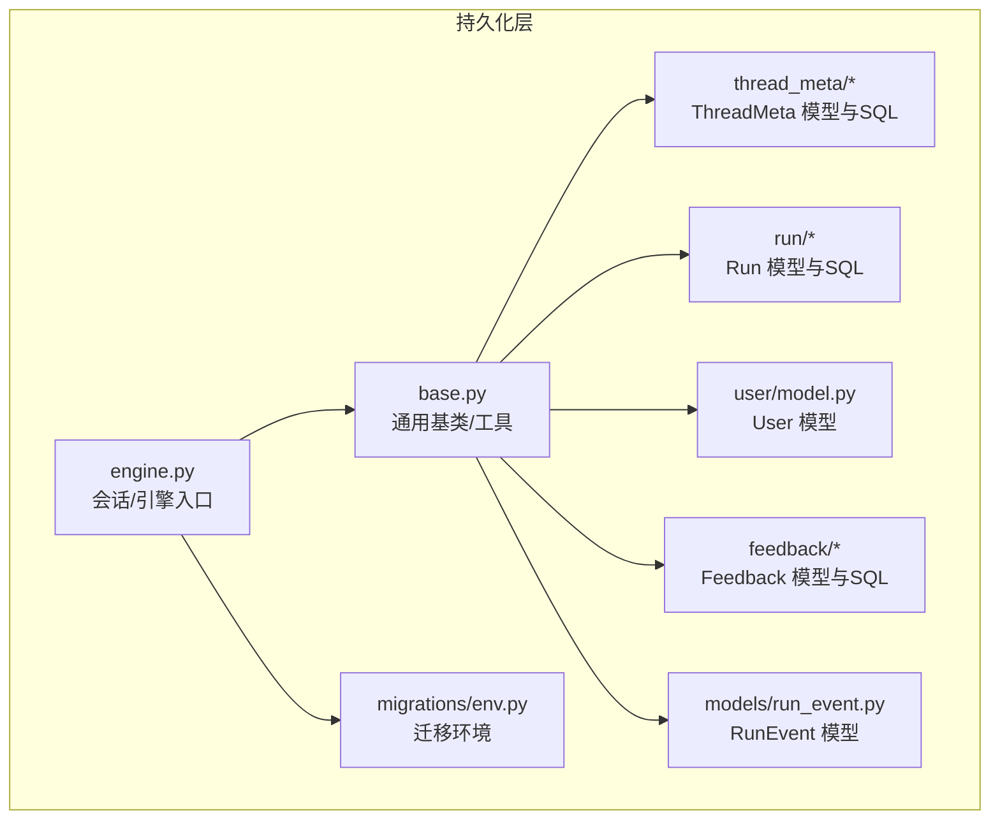
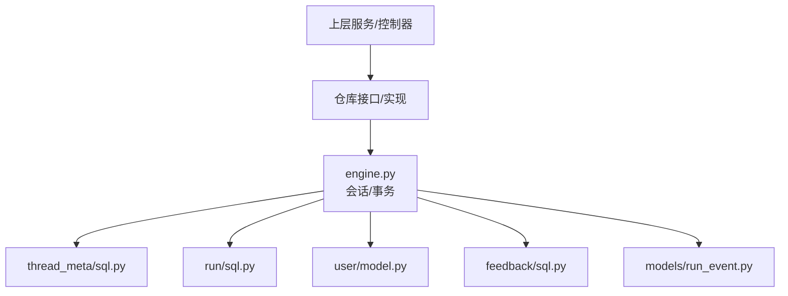
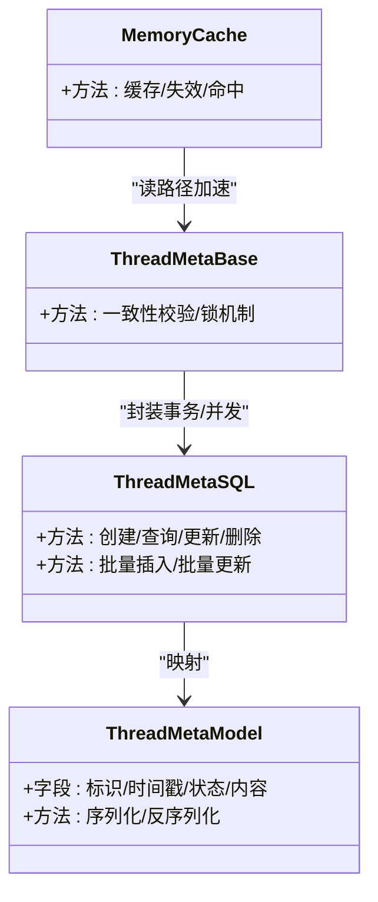
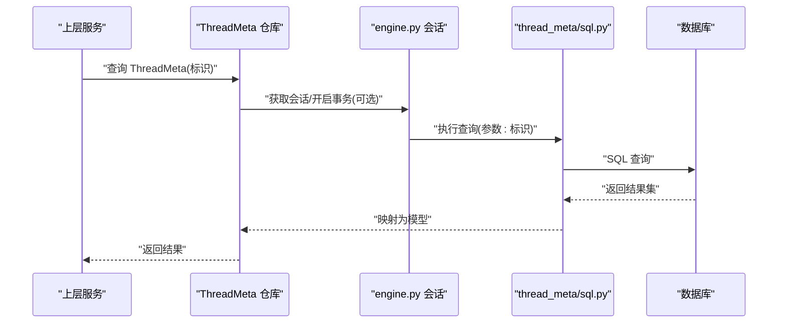
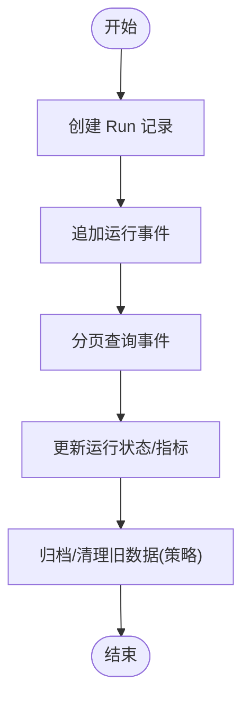
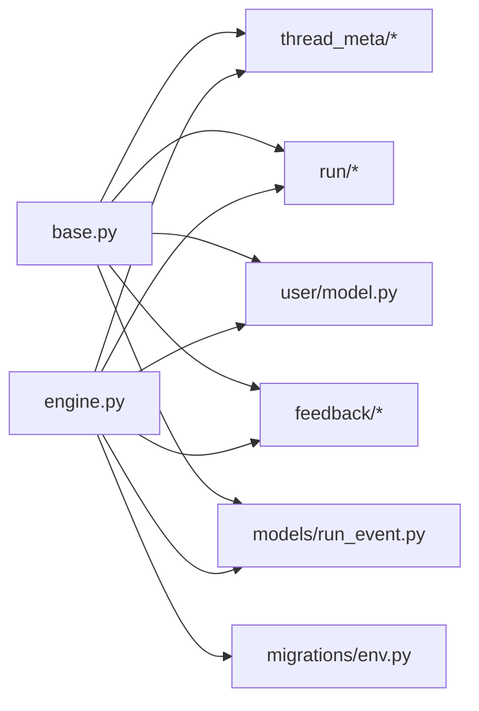

# 数据访问层

<cite>
**本文引用的文件**
- [backend/packages/harness/deerflow/persistence/base.py](file://backend/packages/harness/deerflow/persistence/base.py)
- [backend/packages/harness/deerflow/persistence/engine.py](file://backend/packages/harness/deerflow/persistence/engine.py)
- [backend/packages/harness/deerflow/persistence/thread_meta/model.py](file://backend/packages/harness/deerflow/persistence/thread_meta/model.py)
- [backend/packages/harness/deerflow/persistence/thread_meta/sql.py](file://backend/packages/harness/deerflow/persistence/thread_meta/sql.py)
- [backend/packages/harness/deerflow/persistence/thread_meta/base.py](file://backend/packages/harness/deerflow/persistence/thread_meta/base.py)
- [backend/packages/harness/deerflow/persistence/thread_meta/memory.py](file://backend/packages/harness/deerflow/persistence/thread_meta/memory.py)
- [backend/packages/harness/deerflow/persistence/run/model.py](file://backend/packages/harness/deerflow/persistence/run/model.py)
- [backend/packages/harness/deerflow/persistence/run/sql.py](file://backend/packages/harness/deerflow/persistence/run/sql.py)
- [backend/packages/harness/deerflow/persistence/user/model.py](file://backend/packages/harness/deerflow/persistence/user/model.py)
- [backend/packages/harness/deerflow/persistence/models/run_event.py](file://backend/packages/harness/deerflow/persistence/models/run_event.py)
- [backend/packages/harness/deerflow/persistence/feedback/model.py](file://backend/packages/harness/deerflow/persistence/feedback/model.py)
- [backend/packages/harness/deerflow/persistence/feedback/sql.py](file://backend/packages/harness/deerflow/persistence/feedback/sql.py)
- [backend/packages/harness/deerflow/persistence/migrations/env.py](file://backend/packages/harness/deerflow/persistence/migrations/env.py)
</cite>

## 目录
1. [简介](#简介)
2. [项目结构](#项目结构)
3. [核心组件](#核心组件)
4. [架构总览](#架构总览)
5. [详细组件分析](#详细组件分析)
6. [依赖关系分析](#依赖关系分析)
7. [性能考量](#性能考量)
8. [故障排查指南](#故障排查指南)
9. [结论](#结论)
10. [附录](#附录)

## 简介
本文件系统性梳理 DeerFlow 的数据访问层（Persistence Layer），聚焦以下目标：
- SQL 查询封装与 ORM 映射设计
- 实体模型的 CRUD 实现：ThreadMeta、Run、User 等
- 查询优化策略：索引使用、批量操作、事务管理
- 异常处理、连接管理与并发控制机制
- 典型查询示例、性能调优技巧与最佳实践

数据访问层采用“分层 + 模块化”的组织方式：以 engine 作为连接与会话入口，base 提供通用基类与工具，各业务子模块（thread_meta、run、user、feedback、models）分别定义模型与 SQL 封装，并通过迁移脚本维护数据库演进。

## 项目结构
数据访问层位于 backend/packages/harness/deerflow/persistence 下，主要由以下部分组成：
- engine：数据库引擎初始化与会话管理
- base：通用基类、类型与工具
- thread_meta：线程元信息相关模型与 SQL
- run：运行记录相关模型与 SQL
- user：用户相关模型
- feedback：反馈相关模型与 SQL
- models：通用事件等模型
- migrations：数据库迁移环境配置

图表来源
- [backend/packages/harness/deerflow/persistence/engine.py](file://backend/packages/harness/deerflow/persistence/engine.py)
- [backend/packages/harness/deerflow/persistence/base.py](file://backend/packages/harness/deerflow/persistence/base.py)
- [backend/packages/harness/deerflow/persistence/thread_meta/model.py](file://backend/packages/harness/deerflow/persistence/thread_meta/model.py)
- [backend/packages/harness/deerflow/persistence/run/model.py](file://backend/packages/harness/deerflow/persistence/run/model.py)
- [backend/packages/harness/deerflow/persistence/user/model.py](file://backend/packages/harness/deerflow/persistence/user/model.py)
- [backend/packages/harness/deerflow/persistence/feedback/model.py](file://backend/packages/harness/deerflow/persistence/feedback/model.py)
- [backend/packages/harness/deerflow/persistence/models/run_event.py](file://backend/packages/harness/deerflow/persistence/models/run_event.py)
- [backend/packages/harness/deerflow/persistence/migrations/env.py](file://backend/packages/harness/deerflow/persistence/migrations/env.py)

章节来源
- [backend/packages/harness/deerflow/persistence/engine.py](file://backend/packages/harness/deerflow/persistence/engine.py)
- [backend/packages/harness/deerflow/persistence/base.py](file://backend/packages/harness/deerflow/persistence/base.py)

## 核心组件
- 引擎与会话管理：engine 负责创建数据库连接、管理会话生命周期与事务上下文，确保跨模块的一致性访问。
- 通用基类与工具：base 定义基础模型接口、序列化兼容、通用查询辅助函数等，降低重复代码并统一行为。
- 实体模型与 SQL 封装：各模块在 model.py 中声明数据结构，在 sql.py 中封装 CRUD 与复杂查询，形成清晰的职责边界。
- 迁移与版本控制：migrations/env.py 提供迁移执行环境，配合 Alembic 版本化管理数据库结构变更。

章节来源
- [backend/packages/harness/deerflow/persistence/engine.py](file://backend/packages/harness/deerflow/persistence/engine.py)
- [backend/packages/harness/deerflow/persistence/base.py](file://backend/packages/harness/deerflow/persistence/base.py)
- [backend/packages/harness/deerflow/persistence/migrations/env.py](file://backend/packages/harness/deerflow/persistence/migrations/env.py)

## 架构总览
下图展示数据访问层的整体交互：上层服务通过依赖注入获取仓库实例，仓库内部使用 engine 获取会话，再调用对应模块的 SQL 封装完成数据操作。

图表来源
- [backend/packages/harness/deerflow/persistence/engine.py](file://backend/packages/harness/deerflow/persistence/engine.py)
- [backend/packages/harness/deerflow/persistence/thread_meta/sql.py](file://backend/packages/harness/deerflow/persistence/thread_meta/sql.py)
- [backend/packages/harness/deerflow/persistence/run/sql.py](file://backend/packages/harness/deerflow/persistence/run/sql.py)
- [backend/packages/harness/deerflow/persistence/user/model.py](file://backend/packages/harness/deerflow/persistence/user/model.py)
- [backend/packages/harness/deerflow/persistence/feedback/sql.py](file://backend/packages/harness/deerflow/persistence/feedback/sql.py)
- [backend/packages/harness/deerflow/persistence/models/run_event.py](file://backend/packages/harness/deerflow/persistence/models/run_event.py)

## 详细组件分析

### ThreadMeta 数据访问
ThreadMeta 用于存储线程级元信息，支持按标识检索、更新与归档等操作。其模型与 SQL 封装分别位于 model.py 与 sql.py；同时提供内存缓存与一致性基类以提升读写效率与正确性。

图表来源
- [backend/packages/harness/deerflow/persistence/thread_meta/model.py](file://backend/packages/harness/deerflow/persistence/thread_meta/model.py)
- [backend/packages/harness/deerflow/persistence/thread_meta/sql.py](file://backend/packages/harness/deerflow/persistence/thread_meta/sql.py)
- [backend/packages/harness/deerflow/persistence/thread_meta/base.py](file://backend/packages/harness/deerflow/persistence/thread_meta/base.py)
- [backend/packages/harness/deerflow/persistence/thread_meta/memory.py](file://backend/packages/harness/deerflow/persistence/thread_meta/memory.py)

典型查询流程（以“按标识查询”为例）：

图表来源
- [backend/packages/harness/deerflow/persistence/thread_meta/sql.py](file://backend/packages/harness/deerflow/persistence/thread_meta/sql.py)
- [backend/packages/harness/deerflow/persistence/engine.py](file://backend/packages/harness/deerflow/persistence/engine.py)

章节来源
- [backend/packages/harness/deerflow/persistence/thread_meta/model.py](file://backend/packages/harness/deerflow/persistence/thread_meta/model.py)
- [backend/packages/harness/deerflow/persistence/thread_meta/sql.py](file://backend/packages/harness/deerflow/persistence/thread_meta/sql.py)
- [backend/packages/harness/deerflow/persistence/thread_meta/base.py](file://backend/packages/harness/deerflow/persistence/thread_meta/base.py)
- [backend/packages/harness/deerflow/persistence/thread_meta/memory.py](file://backend/packages/harness/deerflow/persistence/thread_meta/memory.py)

### Run 数据访问
Run 表示一次运行任务的状态与事件流，包含运行元数据与事件记录。其模型与 SQL 封装分别位于 run/model.py 与 run/sql.py，支持运行创建、状态更新、事件追加与分页查询。

图表来源
- [backend/packages/harness/deerflow/persistence/run/model.py](file://backend/packages/harness/deerflow/persistence/run/model.py)
- [backend/packages/harness/deerflow/persistence/run/sql.py](file://backend/packages/harness/deerflow/persistence/run/sql.py)

章节来源
- [backend/packages/harness/deerflow/persistence/run/model.py](file://backend/packages/harness/deerflow/persistence/run/model.py)
- [backend/packages/harness/deerflow/persistence/run/sql.py](file://backend/packages/harness/deerflow/persistence/run/sql.py)

### User 数据访问
User 模型位于 user/model.py，提供用户基本信息的持久化能力。结合上层鉴权与授权逻辑，实现用户注册、登录态维护与权限隔离。

章节来源
- [backend/packages/harness/deerflow/persistence/user/model.py](file://backend/packages/harness/deerflow/persistence/user/model.py)

### Feedback 数据访问
Feedback 模型与 SQL 封装位于 feedback/model.py 与 feedback/sql.py，支持用户反馈的收集、查询与统计分析，便于产品迭代与质量监控。

章节来源
- [backend/packages/harness/deerflow/persistence/feedback/model.py](file://backend/packages/harness/deerflow/persistence/feedback/model.py)
- [backend/packages/harness/deerflow/persistence/feedback/sql.py](file://backend/packages/harness/deerflow/persistence/feedback/sql.py)

### RunEvent 模型
run_event.py 提供运行事件的通用模型定义，便于 Run 与其它模块共享事件结构，统一序列化与传输格式。

章节来源
- [backend/packages/harness/deerflow/persistence/models/run_event.py](file://backend/packages/harness/deerflow/persistence/models/run_event.py)

## 依赖关系分析
- 组件内聚：每个模块（thread_meta、run、user、feedback、models）自包含模型与 SQL，职责清晰，耦合度低。
- 组件耦合：所有模块均依赖 engine 与 base，形成统一的连接与工具层，避免重复实现。
- 外部依赖：迁移环境 migrations/env.py 与 Alembic 协作，保证数据库结构演进可控。

图表来源
- [backend/packages/harness/deerflow/persistence/base.py](file://backend/packages/harness/deerflow/persistence/base.py)
- [backend/packages/harness/deerflow/persistence/engine.py](file://backend/packages/harness/deerflow/persistence/engine.py)
- [backend/packages/harness/deerflow/persistence/thread_meta/model.py](file://backend/packages/harness/deerflow/persistence/thread_meta/model.py)
- [backend/packages/harness/deerflow/persistence/run/model.py](file://backend/packages/harness/deerflow/persistence/run/model.py)
- [backend/packages/harness/deerflow/persistence/user/model.py](file://backend/packages/harness/deerflow/persistence/user/model.py)
- [backend/packages/harness/deerflow/persistence/feedback/model.py](file://backend/packages/harness/deerflow/persistence/feedback/model.py)
- [backend/packages/harness/deerflow/persistence/models/run_event.py](file://backend/packages/harness/deerflow/persistence/models/run_event.py)
- [backend/packages/harness/deerflow/persistence/migrations/env.py](file://backend/packages/harness/deerflow/persistence/migrations/env.py)

章节来源
- [backend/packages/harness/deerflow/persistence/base.py](file://backend/packages/harness/deerflow/persistence/base.py)
- [backend/packages/harness/deerflow/persistence/engine.py](file://backend/packages/harness/deerflow/persistence/engine.py)
- [backend/packages/harness/deerflow/persistence/migrations/env.py](file://backend/packages/harness/deerflow/persistence/migrations/env.py)

## 性能考量
- 索引使用
  - 常用过滤字段（如标识、时间戳、状态）建议建立复合索引或单列索引，减少全表扫描。
  - 对于高并发写入场景，避免在热点列上过度索引，平衡写入与查询成本。
- 批量操作
  - 使用批量插入/更新减少往返次数；对大批次分页提交，避免单事务过大导致锁竞争。
  - 写入前进行去重与合并，降低无效写放大。
- 事务管理
  - 将读写分离与短事务原则结合，尽量缩短事务持有时间，降低锁等待。
  - 对幂等写入（如更新计数器）采用乐观锁或 CAS，减少冲突。
- 连接管理
  - 使用连接池限制最大连接数，设置合理的空闲回收与超时阈值。
  - 在高并发场景下启用异步 I/O 或连接复用，避免阻塞。
- 并发控制
  - 对关键写路径使用行级锁或分布式锁，确保一致性。
  - 对只读路径引入缓存（如内存缓存）与多级缓存策略，减轻数据库压力。
- 查询优化
  - 使用 EXPLAIN 分析慢查询，识别索引缺失与回表问题。
  - 对分页查询使用“游标翻页”替代 OFFSET/LIMIT，降低偏移带来的性能损耗。
- 最佳实践
  - 将热点数据与冷数据分离，冷数据定期归档或迁移至历史库。
  - 对频繁变更的维度字段进行物化视图或汇总表，支撑报表与分析查询。

## 故障排查指南
- 连接与会话
  - 若出现连接泄漏或超时，检查会话关闭与异常分支的资源释放逻辑。
  - 核对连接池配置（最大连接、空闲回收、超时），避免峰值拥塞。
- 事务异常
  - 发生死锁或长时间锁等待时，优先回滚小事务，调整锁顺序与粒度。
  - 对幂等写入失败，检查重试策略与补偿机制。
- 查询性能
  - 使用慢查询日志定位热点 SQL，结合索引策略与查询计划优化。
  - 对大批量导入，采用批处理与分区策略，避免单表膨胀。
- 数据一致性
  - 对并发写入场景，确认是否使用了合适的隔离级别与锁策略。
  - 对缓存与数据库双写，确保更新顺序与过期策略一致。
- 迁移与版本
  - 执行迁移前备份数据；迁移失败时回滚到上一个稳定版本。
  - 对生产环境迁移，先在预生产验证，再灰度发布。

## 结论
DeerFlow 的数据访问层通过“引擎 + 基类 + 模块化 SQL 封装”的架构，实现了清晰的职责划分与良好的扩展性。结合索引、批量、事务与缓存等优化手段，可在保证一致性的同时显著提升吞吐与稳定性。建议在实际落地中持续监控关键指标，迭代优化热点路径与数据结构设计。

## 附录
- 常用查询示例（路径）
  - 按标识查询 ThreadMeta：[backend/packages/harness/deerflow/persistence/thread_meta/sql.py](file://backend/packages/harness/deerflow/persistence/thread_meta/sql.py)
  - 创建 Run 并追加事件：[backend/packages/harness/deerflow/persistence/run/sql.py](file://backend/packages/harness/deerflow/persistence/run/sql.py)
  - 用户信息读写：[backend/packages/harness/deerflow/persistence/user/model.py](file://backend/packages/harness/deerflow/persistence/user/model.py)
  - 反馈收集与统计：[backend/packages/harness/deerflow/persistence/feedback/sql.py](file://backend/packages/harness/deerflow/persistence/feedback/sql.py)
- 迁移与版本控制
  - 迁移环境：[backend/packages/harness/deerflow/persistence/migrations/env.py](file://backend/packages/harness/deerflow/persistence/migrations/env.py)