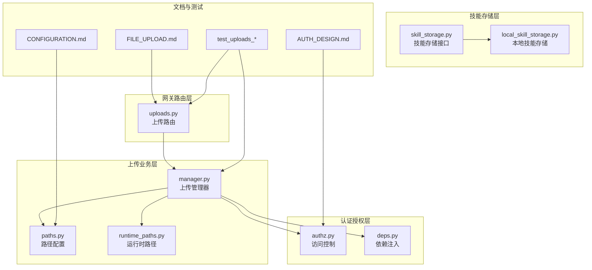
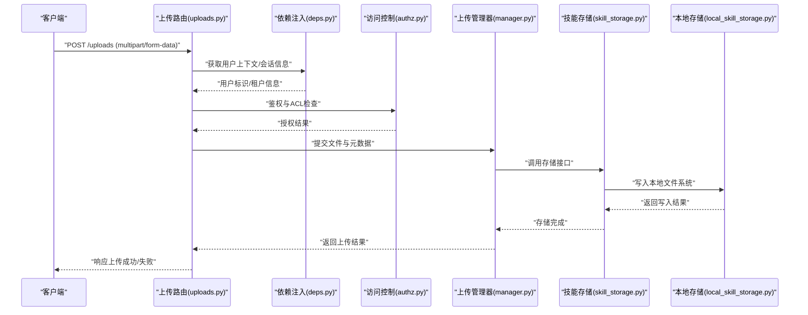
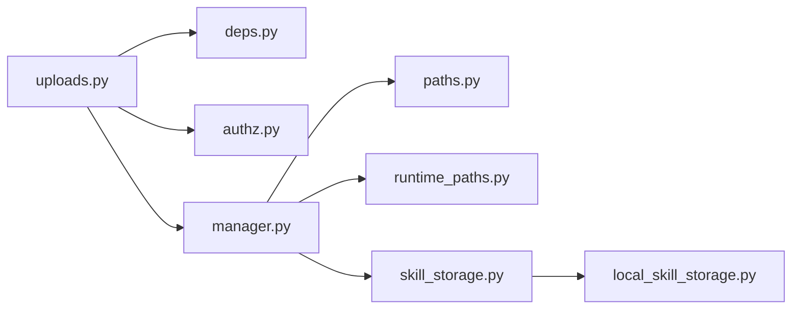

# 文件存储系统

<cite>
**本文引用的文件**
- [backend/app/gateway/routers/uploads.py](file://backend/app/gateway/routers/uploads.py)
- [backend/packages/harness/deerflow/uploads/manager.py](file://backend/packages/harness/deerflow/uploads/manager.py)
- [backend/packages/harness/deerflow/skills/storage/skill_storage.py](file://backend/packages/harness/deerflow/skills/storage/skill_storage.py)
- [backend/packages/harness/deerflow/skills/storage/local_skill_storage.py](file://backend/packages/harness/deerflow/skills/storage/local_skill_storage.py)
- [backend/app/gateway/authz.py](file://backend/app/gateway/authz.py)
- [backend/app/gateway/deps.py](file://backend/app/gateway/deps.py)
- [backend/docs/FILE_UPLOAD.md](file://backend/docs/FILE_UPLOAD.md)
- [backend/docs/AUTH_DESIGN.md](file://backend/docs/AUTH_DESIGN.md)
- [backend/docs/CONFIGURATION.md](file://backend/docs/CONFIGURATION.md)
- [backend/packages/harness/deerflow/config/paths.py](file://backend/packages/harness/deerflow/config/paths.py)
- [backend/packages/harness/deerflow/config/runtime_paths.py](file://backend/packages/harness/deerflow/config/runtime_paths.py)
- [backend/tests/test_uploads_router.py](file://backend/tests/test_uploads_router.py)
- [backend/tests/test_uploads_manager.py](file://backend/tests/test_uploads_manager.py)
- [backend/tests/test_uploads_middleware_core_logic.py](file://backend/tests/test_uploads_middleware_core_logic.py)
</cite>

## 目录
1. [简介](#简介)
2. [项目结构](#项目结构)
3. [核心组件](#核心组件)
4. [架构总览](#架构总览)
5. [详细组件分析](#详细组件分析)
6. [依赖关系分析](#依赖关系分析)
7. [性能考虑](#性能考虑)
8. [故障排查指南](#故障排查指南)
9. [结论](#结论)
10. [附录](#附录)

## 简介
本技术文档围绕 DeerFlow 的文件存储系统展开，重点覆盖文件上传处理流程（接收、验证、存储、访问控制）、存储策略设计（本地/分布式/云存储集成）、权限管理（ACL、用户隔离、安全策略）、文件清理回收机制（过期删除、空间管理、垃圾回收）以及配置选项、API 使用示例与性能优化建议。文档基于后端代码库中的上传路由、上传管理器、技能存储模块、认证授权中间件等核心文件进行深入分析，并结合官方文档与测试用例提供可操作的实践指导。

## 项目结构
文件存储相关的核心代码主要分布在以下位置：
- 路由层：上传接口定义与请求入口
- 业务层：上传管理器负责文件写入、元数据管理与清理
- 技能存储：面向技能工具的本地/通用存储抽象
- 认证授权：访问控制与用户隔离
- 配置层：路径与运行时路径配置
- 文档与测试：官方上传文档、认证设计文档、配置说明及单元测试

图表来源
- [backend/app/gateway/routers/uploads.py](file://backend/app/gateway/routers/uploads.py)
- [backend/packages/harness/deerflow/uploads/manager.py](file://backend/packages/harness/deerflow/uploads/manager.py)
- [backend/packages/harness/deerflow/config/paths.py](file://backend/packages/harness/deerflow/config/paths.py)
- [backend/packages/harness/deerflow/config/runtime_paths.py](file://backend/packages/harness/deerflow/config/runtime_paths.py)
- [backend/packages/harness/deerflow/skills/storage/skill_storage.py](file://backend/packages/harness/deerflow/skills/storage/skill_storage.py)
- [backend/packages/harness/deerflow/skills/storage/local_skill_storage.py](file://backend/packages/harness/deerflow/skills/storage/local_skill_storage.py)
- [backend/app/gateway/authz.py](file://backend/app/gateway/authz.py)
- [backend/app/gateway/deps.py](file://backend/app/gateway/deps.py)
- [backend/docs/FILE_UPLOAD.md](file://backend/docs/FILE_UPLOAD.md)
- [backend/docs/AUTH_DESIGN.md](file://backend/docs/AUTH_DESIGN.md)
- [backend/docs/CONFIGURATION.md](file://backend/docs/CONFIGURATION.md)
- [backend/tests/test_uploads_router.py](file://backend/tests/test_uploads_router.py)
- [backend/tests/test_uploads_manager.py](file://backend/tests/test_uploads_manager.py)
- [backend/tests/test_uploads_middleware_core_logic.py](file://backend/tests/test_uploads_middleware_core_logic.py)

章节来源
- [backend/app/gateway/routers/uploads.py](file://backend/app/gateway/routers/uploads.py)
- [backend/packages/harness/deerflow/uploads/manager.py](file://backend/packages/harness/deerflow/uploads/manager.py)
- [backend/packages/harness/deerflow/skills/storage/skill_storage.py](file://backend/packages/harness/deerflow/skills/storage/skill_storage.py)
- [backend/packages/harness/deerflow/skills/storage/local_skill_storage.py](file://backend/packages/harness/deerflow/skills/storage/local_skill_storage.py)
- [backend/app/gateway/authz.py](file://backend/app/gateway/authz.py)
- [backend/app/gateway/deps.py](file://backend/app/gateway/deps.py)
- [backend/docs/FILE_UPLOAD.md](file://backend/docs/FILE_UPLOAD.md)
- [backend/docs/AUTH_DESIGN.md](file://backend/docs/AUTH_DESIGN.md)
- [backend/docs/CONFIGURATION.md](file://backend/docs/CONFIGURATION.md)
- [backend/packages/harness/deerflow/config/paths.py](file://backend/packages/harness/deerflow/config/paths.py)
- [backend/packages/harness/deerflow/config/runtime_paths.py](file://backend/packages/harness/deerflow/config/runtime_paths.py)
- [backend/tests/test_uploads_router.py](file://backend/tests/test_uploads_router.py)
- [backend/tests/test_uploads_manager.py](file://backend/tests/test_uploads_manager.py)
- [backend/tests/test_uploads_middleware_core_logic.py](file://backend/tests/test_uploads_middleware_core_logic.py)

## 核心组件
- 上传路由（uploads.py）
  - 定义文件上传接口，处理 multipart/form-data 请求，调用上传管理器执行写入与校验。
- 上传管理器（manager.py）
  - 负责文件落盘、元数据持久化、命名策略、清理回收、并发与锁控制。
- 技能存储接口（skill_storage.py）
  - 抽象技能工具的文件存储能力，统一对外接口。
- 本地技能存储（local_skill_storage.py）
  - 基于本地文件系统的技能存储实现，支持隔离与权限控制。
- 认证与授权（authz.py、deps.py）
  - 提供访问控制与用户上下文注入，确保按用户/租户隔离访问。
- 路径配置（paths.py、runtime_paths.py）
  - 统一管理静态与运行时存储根路径，支持多环境配置。
- 官方文档与测试
  - FILE_UPLOAD.md 提供上传流程与最佳实践；AUTH_DESIGN.md 解释访问控制设计；CONFIGURATION.md 汇总配置项；测试覆盖路由、管理器与中间件核心逻辑。

章节来源
- [backend/app/gateway/routers/uploads.py](file://backend/app/gateway/routers/uploads.py)
- [backend/packages/harness/deerflow/uploads/manager.py](file://backend/packages/harness/deerflow/uploads/manager.py)
- [backend/packages/harness/deerflow/skills/storage/skill_storage.py](file://backend/packages/harness/deerflow/skills/storage/skill_storage.py)
- [backend/packages/harness/deerflow/skills/storage/local_skill_storage.py](file://backend/packages/harness/deerflow/skills/storage/local_skill_storage.py)
- [backend/app/gateway/authz.py](file://backend/app/gateway/authz.py)
- [backend/app/gateway/deps.py](file://backend/app/gateway/deps.py)
- [backend/docs/FILE_UPLOAD.md](file://backend/docs/FILE_UPLOAD.md)
- [backend/docs/AUTH_DESIGN.md](file://backend/docs/AUTH_DESIGN.md)
- [backend/docs/CONFIGURATION.md](file://backend/docs/CONFIGURATION.md)
- [backend/packages/harness/deerflow/config/paths.py](file://backend/packages/harness/deerflow/config/paths.py)
- [backend/packages/harness/deerflow/config/runtime_paths.py](file://backend/packages/harness/deerflow/config/runtime_paths.py)
- [backend/tests/test_uploads_router.py](file://backend/tests/test_uploads_router.py)
- [backend/tests/test_uploads_manager.py](file://backend/tests/test_uploads_manager.py)
- [backend/tests/test_uploads_middleware_core_logic.py](file://backend/tests/test_uploads_middleware_core_logic.py)

## 架构总览
下图展示了从客户端到存储系统的完整链路：请求经由上传路由进入，通过认证授权中间件，交由上传管理器完成文件写入与元数据管理，最终落盘至本地或外部存储，同时遵循用户隔离与访问控制策略。

图表来源
- [backend/app/gateway/routers/uploads.py](file://backend/app/gateway/routers/uploads.py)
- [backend/app/gateway/deps.py](file://backend/app/gateway/deps.py)
- [backend/app/gateway/authz.py](file://backend/app/gateway/authz.py)
- [backend/packages/harness/deerflow/uploads/manager.py](file://backend/packages/harness/deerflow/uploads/manager.py)
- [backend/packages/harness/deerflow/skills/storage/skill_storage.py](file://backend/packages/harness/deerflow/skills/storage/skill_storage.py)
- [backend/packages/harness/deerflow/skills/storage/local_skill_storage.py](file://backend/packages/harness/deerflow/skills/storage/local_skill_storage.py)

## 详细组件分析

### 上传路由（uploads.py）
- 职责
  - 接收 multipart/form-data 请求，解析文件字段与元数据。
  - 调用依赖注入获取当前用户上下文，传递给上传管理器。
  - 执行访问控制检查，拒绝无权限请求。
  - 返回标准化的上传结果（含文件标识、访问地址等）。
- 关键流程
  - 参数校验：文件大小、类型白名单、重名策略。
  - 并发安全：避免同名冲突与竞态条件。
  - 错误处理：捕获 IO 异常、权限异常并返回明确错误码。
- 与测试关联
  - 单元测试覆盖路由行为与错误分支，确保接口稳定性。

章节来源
- [backend/app/gateway/routers/uploads.py](file://backend/app/gateway/routers/uploads.py)
- [backend/tests/test_uploads_router.py](file://backend/tests/test_uploads_router.py)

### 上传管理器（manager.py）
- 职责
  - 文件落盘与命名：生成唯一文件名、按用户/租户隔离目录。
  - 元数据持久化：记录文件大小、类型、上传时间、归属用户等。
  - 清理回收：定期扫描过期文件、释放磁盘空间。
  - 并发与锁：在高并发场景下保证原子性与一致性。
- 存储策略
  - 本地存储：默认采用本地文件系统，路径来自配置模块。
  - 分布式/云存储：通过技能存储接口抽象，便于替换为 S3、NAS 等外部存储。
- 性能特性
  - 流式写入：减少内存占用，提升大文件上传效率。
  - 批量清理：后台任务异步执行，降低对主请求的影响。

章节来源
- [backend/packages/harness/deerflow/uploads/manager.py](file://backend/packages/harness/deerflow/uploads/manager.py)
- [backend/packages/harness/deerflow/config/paths.py](file://backend/packages/harness/deerflow/config/paths.py)
- [backend/packages/harness/deerflow/config/runtime_paths.py](file://backend/packages/harness/deerflow/config/runtime_paths.py)
- [backend/tests/test_uploads_manager.py](file://backend/tests/test_uploads_manager.py)

### 技能存储接口与本地实现（skill_storage.py、local_skill_storage.py）
- 技能存储接口（skill_storage.py）
  - 定义统一的文件写入、读取、删除与查询接口，屏蔽底层存储差异。
- 本地技能存储（local_skill_storage.py）
  - 基于本地文件系统实现，支持：
    - 用户/租户隔离目录结构。
    - 权限控制与最小权限原则。
    - 快速读写与低延迟访问。
- 集成点
  - 上传管理器通过技能存储接口与具体实现解耦，便于扩展云存储。

章节来源
- [backend/packages/harness/deerflow/skills/storage/skill_storage.py](file://backend/packages/harness/deerflow/skills/storage/skill_storage.py)
- [backend/packages/harness/deerflow/skills/storage/local_skill_storage.py](file://backend/packages/harness/deerflow/skills/storage/local_skill_storage.py)

### 认证与授权（authz.py、deps.py）
- 访问控制（authz.py）
  - 实施基于角色/策略的访问控制，确保用户只能访问自身或被授权的文件。
  - 支持租户隔离，防止跨用户数据泄露。
- 依赖注入（deps.py）
  - 提供用户上下文注入，供路由与服务层使用。
  - 与认证中间件配合，形成完整的鉴权链路。
- 设计依据
  - 参考官方 AUTH_DESIGN.md，理解 ACL 与最小权限原则的设计思想。

章节来源
- [backend/app/gateway/authz.py](file://backend/app/gateway/authz.py)
- [backend/app/gateway/deps.py](file://backend/app/gateway/deps.py)
- [backend/docs/AUTH_DESIGN.md](file://backend/docs/AUTH_DESIGN.md)

### 路径配置（paths.py、runtime_paths.py）
- 静态路径（paths.py）
  - 定义应用级静态资源与默认存储根目录。
- 运行时路径（runtime_paths.py）
  - 动态生成用户隔离目录、临时文件目录与缓存目录。
- 配置要点
  - 支持容器/本地部署差异，确保权限与挂载正确。
  - 与上传管理器协作，决定文件落盘位置。

章节来源
- [backend/packages/harness/deerflow/config/paths.py](file://backend/packages/harness/deerflow/config/paths.py)
- [backend/packages/harness/deerflow/config/runtime_paths.py](file://backend/packages/harness/deerflow/config/runtime_paths.py)

### 文件清理与回收机制
- 过期文件删除
  - 基于时间戳与配置阈值扫描，批量删除过期文件。
- 存储空间管理
  - 监控目录配额，超过阈值触发清理策略。
- 垃圾回收
  - 删除无效索引、临时文件与未绑定的中间产物。
- 与上传管理器联动
  - 清理任务作为后台作业执行，不影响主请求吞吐。

章节来源
- [backend/packages/harness/deerflow/uploads/manager.py](file://backend/packages/harness/deerflow/uploads/manager.py)

## 依赖关系分析
- 组件耦合
  - 上传路由依赖依赖注入与访问控制模块，确保请求在进入业务层前已完成鉴权。
  - 上传管理器依赖路径配置与技能存储接口，实现存储落盘与抽象解耦。
  - 技能存储接口与本地实现之间为策略模式，便于替换为云存储。
- 外部依赖
  - 文件系统权限、网络存储（如 S3/NAS）需在运行环境中正确配置。
- 循环依赖
  - 当前结构清晰，未发现循环导入问题。

图表来源
- [backend/app/gateway/routers/uploads.py](file://backend/app/gateway/routers/uploads.py)
- [backend/app/gateway/deps.py](file://backend/app/gateway/deps.py)
- [backend/app/gateway/authz.py](file://backend/app/gateway/authz.py)
- [backend/packages/harness/deerflow/uploads/manager.py](file://backend/packages/harness/deerflow/uploads/manager.py)
- [backend/packages/harness/deerflow/config/paths.py](file://backend/packages/harness/deerflow/config/paths.py)
- [backend/packages/harness/deerflow/config/runtime_paths.py](file://backend/packages/harness/deerflow/config/runtime_paths.py)
- [backend/packages/harness/deerflow/skills/storage/skill_storage.py](file://backend/packages/harness/deerflow/skills/storage/skill_storage.py)
- [backend/packages/harness/deerflow/skills/storage/local_skill_storage.py](file://backend/packages/harness/deerflow/skills/storage/local_skill_storage.py)

章节来源
- [backend/app/gateway/routers/uploads.py](file://backend/app/gateway/routers/uploads.py)
- [backend/app/gateway/deps.py](file://backend/app/gateway/deps.py)
- [backend/app/gateway/authz.py](file://backend/app/gateway/authz.py)
- [backend/packages/harness/deerflow/uploads/manager.py](file://backend/packages/harness/deerflow/uploads/manager.py)
- [backend/packages/harness/deerflow/skills/storage/skill_storage.py](file://backend/packages/harness/deerflow/skills/storage/skill_storage.py)
- [backend/packages/harness/deerflow/skills/storage/local_skill_storage.py](file://backend/packages/harness/deerflow/skills/storage/local_skill_storage.py)
- [backend/packages/harness/deerflow/config/paths.py](file://backend/packages/harness/deerflow/config/paths.py)
- [backend/packages/harness/deerflow/config/runtime_paths.py](file://backend/packages/harness/deerflow/config/runtime_paths.py)

## 性能考虑
- 写入优化
  - 采用流式写入，避免大文件占用过多内存。
  - 合理设置分块大小与并发度，平衡吞吐与资源消耗。
- 并发与锁
  - 在高并发场景下使用文件锁或数据库事务，确保原子性。
- 清理策略
  - 将清理任务安排在低峰时段，或采用增量扫描降低抖动。
- 存储选择
  - 本地存储适合小规模与低延迟需求；大规模或需要高可用时，优先考虑分布式/云存储。
- 缓存与索引
  - 对热点文件建立索引，加速检索；对冷数据采用压缩与归档。

## 故障排查指南
- 常见问题
  - 权限不足：检查 authz.py 中的 ACL 规则与 deps.py 注入的用户上下文。
  - 路径不可写：确认 paths.py 与 runtime_paths.py 的目录权限与挂载情况。
  - 上传失败：查看 uploads.py 的错误处理分支与 manager.py 的日志输出。
  - 清理不生效：核对清理策略配置与后台任务调度。
- 定位手段
  - 结合官方 FILE_UPLOAD.md 的诊断步骤与测试用例（test_uploads_*）复现问题。
  - 关注上传管理器的日志与指标，定位异常阶段。

章节来源
- [backend/docs/FILE_UPLOAD.md](file://backend/docs/FILE_UPLOAD.md)
- [backend/tests/test_uploads_router.py](file://backend/tests/test_uploads_router.py)
- [backend/tests/test_uploads_manager.py](file://backend/tests/test_uploads_manager.py)
- [backend/tests/test_uploads_middleware_core_logic.py](file://backend/tests/test_uploads_middleware_core_logic.py)

## 结论
DeerFlow 的文件存储系统以“路由-管理器-存储接口”的分层架构实现，具备完善的上传处理流程、灵活的存储策略与严格的访问控制。通过路径配置与技能存储抽象，系统既可满足本地部署需求，又可平滑扩展至分布式/云存储。配合认证授权与清理回收机制，整体方案在安全性、可维护性与性能方面达到良好平衡。

## 附录

### 配置选项概览（节选）
- 存储根路径
  - 静态路径：应用默认存储根目录（来自 paths.py）。
  - 运行时路径：用户隔离目录、临时目录等（来自 runtime_paths.py）。
- 上传参数
  - 最大文件大小、允许的 MIME 类型、重名处理策略（来自 uploads.py 与 manager.py）。
- 认证与授权
  - ACL 规则、租户隔离策略（来自 authz.py 与 AUTH_DESIGN.md）。
- 清理策略
  - 过期阈值、配额上限、清理周期（来自 manager.py 与 FILE_UPLOAD.md）。

章节来源
- [backend/docs/CONFIGURATION.md](file://backend/docs/CONFIGURATION.md)
- [backend/packages/harness/deerflow/config/paths.py](file://backend/packages/harness/deerflow/config/paths.py)
- [backend/packages/harness/deerflow/config/runtime_paths.py](file://backend/packages/harness/deerflow/config/runtime_paths.py)
- [backend/app/gateway/routers/uploads.py](file://backend/app/gateway/routers/uploads.py)
- [backend/packages/harness/deerflow/uploads/manager.py](file://backend/packages/harness/deerflow/uploads/manager.py)
- [backend/docs/AUTH_DESIGN.md](file://backend/docs/AUTH_DESIGN.md)
- [backend/docs/FILE_UPLOAD.md](file://backend/docs/FILE_UPLOAD.md)

### API 使用示例（步骤说明）
- 上传文件
  - 步骤：准备 multipart/form-data，包含文件字段与元数据；调用 /uploads 接口；根据返回结果获取文件标识与访问地址。
  - 参考：uploads.py 路由定义与 FILE_UPLOAD.md 示例。
- 查询与删除
  - 步骤：在已授权前提下，调用相应接口查询文件元数据；删除时确保仅操作本人或被授权的文件。
  - 参考：authz.py 的访问控制与 deps.py 的用户上下文注入。

章节来源
- [backend/app/gateway/routers/uploads.py](file://backend/app/gateway/routers/uploads.py)
- [backend/docs/FILE_UPLOAD.md](file://backend/docs/FILE_UPLOAD.md)
- [backend/app/gateway/authz.py](file://backend/app/gateway/authz.py)
- [backend/app/gateway/deps.py](file://backend/app/gateway/deps.py)