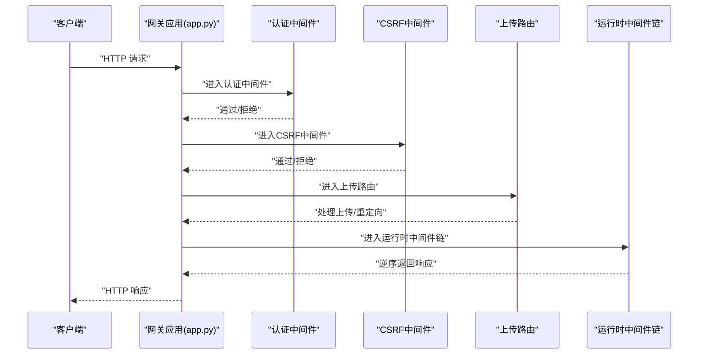
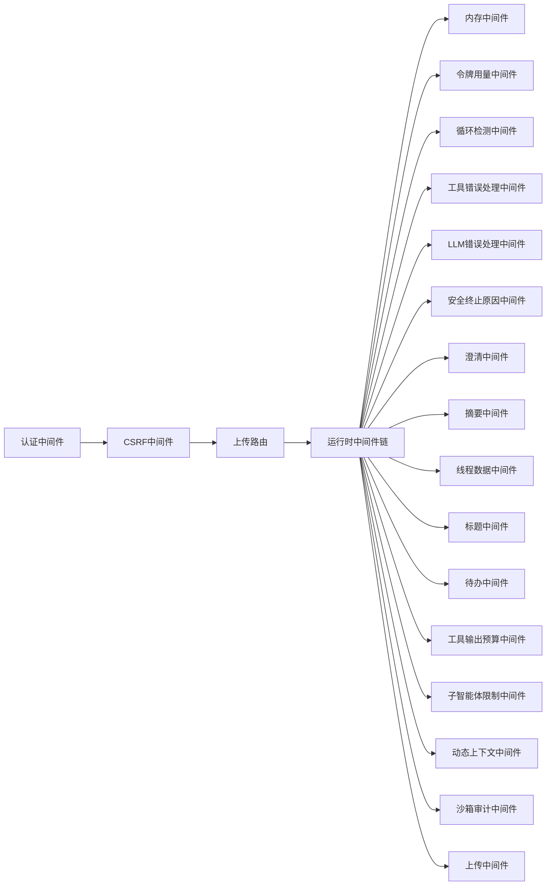

# 中间件系统

<cite>
**本文引用的文件**
- [backend/app/gateway/auth_middleware.py](file://backend/app/gateway/auth_middleware.py)
- [backend/app/gateway/csrf_middleware.py](file://backend/app/gateway/csrf_middleware.py)
- [backend/packages/harness/deerflow/agents/middlewares/uploads_middleware.py](file://backend/packages/harness/deerflow/agents/middlewares/uploads_middleware.py)
- [backend/packages/harness/deerflow/sandbox/middleware.py](file://backend/packages/harness/deerflow/sandbox/middleware.py)
- [backend/packages/harness/deerflow/guardrails/middleware.py](file://backend/packages/harness/deerflow/guardrails/middleware.py)
- [backend/packages/harness/deerflow/agents/middlewares/memory_middleware.py](file://backend/packages/harness/deerflow/agents/middlewares/memory_middleware.py)
- [backend/packages/harness/deerflow/agents/middlewares/token_usage_middleware.py](file://backend/packages/harness/deerflow/agents/middlewares/token_usage_middleware.py)
- [backend/packages/harness/deerflow/agents/middlewares/loop_detection_middleware.py](file://backend/packages/harness/deerflow/agents/middlewares/loop_detection_middleware.py)
- [backend/packages/harness/deerflow/agents/middlewares/tool_error_handling_middleware.py](file://backend/packages/harness/deerflow/agents/middlewares/tool_error_handling_middleware.py)
- [backend/packages/harness/deerflow/agents/middlewares/llm_error_handling_middleware.py](file://backend/packages/harness/deerflow/agents/middlewares/llm_error_handling_middleware.py)
- [backend/packages/harness/deerflow/agents/middlewares/safety_finish_reason_middleware.py](file://backend/packages/harness/deerflow/agents/middlewares/safety_finish_reason_middleware.py)
- [backend/packages/harness/deerflow/agents/middlewares/clarification_middleware.py](file://backend/packages/harness/deerflow/agents/middlewares/clarification_middleware.py)
- [backend/packages/harness/deerflow/agents/middlewares/dangling_tool_call_middleware.py](file://backend/packages/harness/deerflow/agents/middlewares/dangling_tool_call_middleware.py)
- [backend/packages/harness/deerflow/agents/middlewares/summarization_middleware.py](file://backend/packages/harness/deerflow/agents/middlewares/summarization_middleware.py)
- [backend/packages/harness/deerflow/agents/middlewares/thread_data_middleware.py](file://backend/packages/harness/deerflow/agents/middlewares/thread_data_middleware.py)
- [backend/packages/harness/deerflow/agents/middlewares/title_middleware.py](file://backend/packages/harness/deerflow/agents/middlewares/title_middleware.py)
- [backend/packages/harness/deerflow/agents/middlewares/todo_middleware.py](file://backend/packages/harness/deerflow/agents/middlewares/todo_middleware.py)
- [backend/packages/harness/deerflow/agents/middlewares/tool_output_budget_middleware.py](file://backend/packages/harness/deerflow/agents/middlewares/tool_output_budget_middleware.py)
- [backend/packages/harness/deerflow/agents/middlewares/subagent_limit_middleware.py](file://backend/packages/harness/deerflow/agents/middlewares/subagent_limit_middleware.py)
- [backend/packages/harness/deerflow/agents/middlewares/dynamic_context_middleware.py](file://backend/packages/harness/deerflow/agents/middlewares/dynamic_context_middleware.py)
- [backend/packages/harness/deerflow/agents/middlewares/sandbox_audit_middleware.py](file://backend/packages/harness/deerflow/agents/middlewares/sandbox_audit_middleware.py)
- [backend/app/gateway/routers/uploads.py](file://backend/app/gateway/routers/uploads.py)
- [backend/app/gateway/routers/auth.py](file://backend/app/gateway/routers/auth.py)
- [backend/app/gateway/app.py](file://backend/app/gateway/app.py)
- [backend/docs/middleware-execution-flow.md](file://backend/docs/middleware-execution-flow.md)
- [backend/packages/harness/deerflow/sandbox/sandbox.py](file://backend/packages/harness/deerflow/sandbox/sandbox.py)
- [backend/packages/harness/deerflow/sandbox/security.py](file://backend/packages/harness/deerflow/sandbox/security.py)
- [backend/packages/harness/deerflow/sandbox/search.py](file://backend/packages/harness/deerflow/sandbox/search.py)
- [backend/packages/harness/deerflow/sandbox/tools.py](file://backend/packages/harness/deerflow/sandbox/tools.py)
- [backend/packages/harness/deerflow/sandbox/file_operation_lock.py](file://backend/packages/harness/deerflow/sandbox/file_operation_lock.py)
- [backend/packages/harness/deerflow/sandbox/exceptions.py](file://backend/packages/harness/deerflow/sandbox/exceptions.py)
- [backend/packages/harness/deerflow/sandbox/sandbox_provider.py](file://backend/packages/harness/deerflow/sandbox/sandbox_provider.py)
- [backend/packages/harness/deerflow/config/sandbox_config.py](file://backend/packages/harness/deerflow/config/sandbox_config.py)
- [backend/packages/harness/deerflow/config/app_config.py](file://backend/packages/harness/deerflow/config/app_config.py)
- [backend/packages/harness/deerflow/runtime/__init__.py](file://backend/packages/harness/deerflow/runtime/__init__.py)
- [backend/packages/harness/deerflow/runtime/journal.py](file://backend/packages/harness/deerflow/runtime/journal.py)
- [backend/packages/harness/deerflow/runtime/serialization.py](file://backend/packages/harness/deerflow/runtime/serialization.py)
- [backend/packages/harness/deerflow/runtime/user_context.py](file://backend/packages/harness/deerflow/runtime/user_context.py)
- [backend/packages/harness/deerflow/runtime/checkpointer/__init__.py](file://backend/packages/harness/deerflow/runtime/checkpointer/__init__.py)
- [backend/packages/harness/deerflow/runtime/events/__init__.py](file://backend/packages/harness/deerflow/runtime/events/__init__.py)
- [backend/packages/harness/deerflow/runtime/runs/__init__.py](file://backend/packages/harness/deerflow/runtime/runs/__init__.py)
- [backend/packages/harness/deerflow/runtime/store/__init__.py](file://backend/packages/harness/deerflow/runtime/store/__init__.py)
- [backend/packages/harness/deerflow/runtime/stream_bridge/__init__.py](file://backend/packages/harness/deerflow/runtime/stream_bridge/__init__.py)
- [backend/packages/harness/deerflow/runtime/converters.py](file://backend/packages/harness/deerflow/runtime/converters.py)
- [backend/packages/harness/deerflow/runtime/serialization.py](file://backend/packages/harness/deerflow/runtime/serialization.py)
- [backend/packages/harness/deerflow/runtime/user_context.py](file://backend/packages/harness/deerflow/runtime/user_context.py)
- [backend/packages/harness/deerflow/runtime/journal.py](file://backend/packages/harness/deerflow/runtime/journal.py)
- [backend/packages/harness/deerflow/runtime/checkpointer/__init__.py](file://backend/packages/harness/deerflow/runtime/checkpointer/__init__.py)
- [backend/packages/harness/deerflow/runtime/events/__init__.py](file://backend/packages/harness/deerflow/runtime/events/__init__.py)
- [backend/packages/harness/deerflow/runtime/runs/__init__.py](file://backend/packages/harness/deerflow/runtime/runs/__init__.py)
- [backend/packages/harness/deerflow/runtime/store/__init__.py](file://backend/packages/harness/deerflow/runtime/store/__init__.py)
- [backend/packages/harness/deerflow/runtime/stream_bridge/__init__.py](file://backend/packages/harness/deerflow/runtime/stream_bridge/__init__.py)
- [backend/packages/harness/deerflow/runtime/converters.py](file://backend/packages/harness/deerflow/runtime/converters.py)
- [backend/packages/harness/deerflow/runtime/serialization.py](file://backend/packages/harness/deerflow/runtime/serialization.py)
- [backend/packages/harness/deerflow/runtime/user_context.py](file://backend/packages/harness/deerflow/runtime/user_context.py)
- [backend/packages/harness/deerflow/runtime/journal.py](file://backend/packages/harness/deerflow/runtime/journal.py)
- [backend/packages/harness/deerflow/runtime/checkpointer/__init__.py](file://backend/packages/harness/deerflow/runtime/checkpointer/__init__.py)
- [backend/packages/harness/deerflow/runtime/events/__init__.py](file://backend/packages/harness/deerflow/runtime/events/__init__.py)
- [backend/packages/harness/deerflow/runtime/runs/__init__.py](file://backend/packages/harness/deerflow/runtime/runs/__init__.py)
- [backend/packages/harness/deerflow/runtime/store/__init__.py](file://backend/packages/harness/deerflow/runtime/store/__init__.py)
- [backend/packages/harness/deerflow/runtime/stream_bridge/__init__.py](file://backend/packages/harness/deerflow/runtime/stream_bridge/__init__.py)
- [backend/packages/harness/deerflow/runtime/converters.py](file://backend/packages/harness/deerflow/runtime/converters.py)
- [backend/packages/harness/deerflow/runtime/serialization.py](file://backend/packages/harness/deerflow/runtime/serialization.py)
- [backend/packages/harness/deerflow/runtime/user_context.py](file://backend/packages/harness/deerflow/runtime/user_context.py)
- [backend/packages/harness/deerflow/runtime/journal.py](file://backend/packages/harness/deerflow/runtime/journal.py)
- [backend/packages/harness/deerflow/runtime/checkpointer/__init__.py](file://backend/packages/harness/deerflow/runtime/checkpointer/__init__.py)
- [backend/packages/harness/deerflow/runtime/events/__init__.py](file://backend/packages/harness/deerflow/runtime/events/__init__.py)
- [backend/packages/harness/deerflow/runtime/runs/__init__.py](file://backend/packages/harness/deerflow/runtime/runs/__init__.py)
- [backend/packages/harness/deerflow/runtime/store/__init__.py](file://backend/packages/harness/deerflow/runtime/store/__init__.py)
- [backend/packages/harness/deerflow/runtime/stream_bridge/__init__.py](file://backend/packages/harness/deerflow/runtime/stream_bridge/__init__.py)
- [backend/packages/harness/deerflow/runtime/converters.py](file://backend/packages/harness/deerflow/runtime/converters.py)
- [backend/packages/harness/deerflow/runtime/serialization.py](file://backend/packages/harness/deerflow/runtime/serialization.py)
- [backend/packages/harness/deerflow/runtime/user_context.py](file://backend/packages/harness/deerflow/runtime/user_context.py)
- [backend/packages/harness/deerflow/runtime/journal.py](file://backend/packages/harness/deerflow/runtime/journal.py)
- [backend/packages/harness/deerflow/runtime/checkpointer/__init__.py](file://backend/packages/harness/deerflow/runtime/checkpointer/__init__.py)
- [backend/packages/harness/deerflow/runtime/events/__init__.py](file://backend/packages/harness/deerflow/runtime/events/__init__.py)
- [backend/packages/harness/deerflow/runtime/runs/__init__.py](file://backend/packages/harness/deerflow/runtime/runs/__init__.py)
- [backend/packages/harness/deerflow/runtime/store/__init__.py](file://backend/packages/harness/deerflow/runtime/store/__init__.py)
- [backend/packages/harness/deerflow/runtime/stream_bridge/__init__.py](file://backend/packages/harness/deerflow/runtime/stream_bridge/__init__.py)
- [backend/packages/harness/deerflow/runtime/converters.py](file://backend/packages/harness/deerflow/runtime/converters.py)
- [backend/packages/harness/deerflow/runtime/serialization.py](file://backend/packages/harness/deerflow/runtime/serialization.py)
- [backend/packages/harness/deerflow/runtime/user_context.py](file://backend/packages/harness/deerflow/runtime/user_context.py)
- [backend/packages/harness/deerflow/runtime/journal.py](file://backend/packages/harness/deerflow/runtime/journal.py)
- [backend/packages/harness/deerflow/runtime/checkpointer/__init__.py](file://backend/packages/harness/deerflow/runtime/checkpointer/__init__.py)
- [backend/packages/harness/deerflow/runtime/events/__init__.py](file://backend/packages/harness/deerflow/runtime/events/__init__.py)
- [backend/packages/harness/deerflow/runtime/runs/__init__.py](file://backend/packages/harness/deerflow/runtime/runs/__init__.py)
- [backend/packages/harness/deerflow/runtime/store/__init__.py](file://backend/packages/harness/deerflow/runtime/store/__init__.py)
- [backend/packages/harness/deerflow/runtime/stream_bridge/__init__.py](file://backend/packages/harness/deerflow/runtime/stream_bridge/__init__.py)
- [backend/packages/harness/deerflow/runtime/converters.py](file://backend/packages/harness/deerflow/runtime/converters.py)
- [backend/packages/harness/deerflow/runtime/serialization.py](file://backend/packages/harness/deerflow/runtime/serialization.py)
- [backend/packages/harness/deerflow/runtime/user_context.py](file://backend/packages/harness/deerflow/runtime/user_context.py)
- [backend/packages/harness/deerflow/runtime/journal.py](file://backend/packages/harness/deerflow/runtime/journal.py)
- [backend/packages/harness/deerflow/runtime/checkpointer/__init__.py](file://backend/packages/harness/deerflow/runtime/checkpointer/__init__.py)
- [backend/packages/harness/deerflow/runtime/events/__init__.py](file://backend/packages/harness/deerflow/runtime/events/__init__.py)
- [backend/packages/harness/deerflow/runtime/runs/__init__.py](file://backend/packages/harness/deerflow/runtime/runs/__init__.py)
- [backend/packages/harness/deerflow/runtime/store/__init__.py](file://......
</cite>

## 目录
1. [引言](#引言)
2. [项目结构](#项目结构)
3. [核心组件](#核心组件)
4. [架构总览](#架构总览)
5. [详细组件分析](#详细组件分析)
6. [依赖关系分析](#依赖关系分析)
7. [性能考量](#性能考量)
8. [故障排查指南](#故障排查指南)
9. [结论](#结论)
10. [附录](#附录)

## 引言
本文件系统性梳理 DeerFlow 的中间件体系，覆盖网关层与智能体运行时两大部分。重点包括：
- 网关中间件：认证、CSRF 保护、上传处理等
- 智能体中间件：内存、令牌用量、循环检测、工具与 LLM 错误处理、安全终止原因、澄清与摘要、线程数据、标题生成、待办、工具输出预算、子智能体限制、动态上下文、沙箱审计等
- 执行顺序与职责分工：如何在请求链路中串联各中间件，以及异常传播与错误处理策略
- 配置项、性能影响与扩展方法：如何通过配置优化行为，如何编写自定义中间件并融入生命周期管理

## 项目结构
DeerFlow 的中间件主要分布在两个层面：
- 网关层（FastAPI 应用）：负责入口级的安全与路由控制，如认证、CSRF、上传路由
- 智能体运行时中间件（Agent Middlewares）：围绕一次“运行”（run）贯穿前后，对消息、工具调用、内存、计费等进行横切增强

```mermaid
graph TB
subgraph "网关层"
GW_APP["gateway/app.py"]
AUTH_MW["auth_middleware.py"]
CSRF_MW["csrf_middleware.py"]
UPLOADS_RT["routers/uploads.py"]
end
subgraph "智能体运行时中间件"
MEM_MW["memory_middleware.py"]
TOK_MW["token_usage_middleware.py"]
LOOP_MW["loop_detection_middleware.py"]
TOOL_ERR_MW["tool_error_handling_middleware.py"]
LLM_ERR_MW["llm_error_handling_middleware.py"]
SAFETY_MW["safety_finish_reason_middleware.py"]
CLARIFY_MW["clarification_middleware.py"]
SUMM_MW["summarization_middleware.py"]
THREAD_MW["thread_data_middleware.py"]
TITLE_MW["title_middleware.py"]
TODO_MW["todo_middleware.py"]
TOOL_BUDGET_MW["tool_output_budget_middleware.py"]
SUB_LIMIT_MW["subagent_limit_middleware.py"]
DYN_CTX_MW["dynamic_context_middleware.py"]
SAN_AUDIT_MW["sandbox_audit_middleware.py"]
UPLOADS_MW["uploads_middleware.py"]
end
GW_APP --> AUTH_MW --> CSRF_MW --> UPLOADS_RT
GW_APP --> MEM_MW
GW_APP --> TOK_MW
GW_APP --> LOOP_MW
GW_APP --> TOOL_ERR_MW
GW_APP --> LLM_ERR_MW
GW_APP --> SAFETY_MW
GW_APP --> CLARIFY_MW
GW_APP --> SUMM_MW
GW_APP --> THREAD_MW
GW_APP --> TITLE_MW
GW_APP --> TODO_MW
GW_APP --> TOOL_BUDGET_MW
GW_APP --> SUB_LIMIT_MW
GW_APP --> DYN_CTX_MW
GW_APP --> SAN_AUDIT_MW
GW_APP --> UPLOADS_MW
```

图表来源
- [backend/app/gateway/app.py](file://backend/app/gateway/app.py)
- [backend/app/gateway/auth_middleware.py](file://backend/app/gateway/auth_middleware.py)
- [backend/app/gateway/csrf_middleware.py](file://backend/app/gateway/csrf_middleware.py)
- [backend/app/gateway/routers/uploads.py](file://backend/app/gateway/routers/uploads.py)
- [backend/packages/harness/deerflow/agents/middlewares/memory_middleware.py](file://backend/packages/harness/deerflow/agents/middlewares/memory_middleware.py)
- [backend/packages/harness/deerflow/agents/middlewares/token_usage_middleware.py](file://backend/packages/harness/deerflow/agents/middlewares/token_usage_middleware.py)
- [backend/packages/harness/deerflow/agents/middlewares/loop_detection_middleware.py](file://backend/packages/harness/deerflow/agents/middlewares/loop_detection_middleware.py)
- [backend/packages/harness/deerflow/agents/middlewares/tool_error_handling_middleware.py](file://backend/packages/harness/deerflow/agents/middlewares/tool_error_handling_middleware.py)
- [backend/packages/harness/deerflow/agents/middlewares/llm_error_handling_middleware.py](file://backend/packages/harness/deerflow/agents/middlewares/llm_error_handling_middleware.py)
- [backend/packages/harness/deerflow/agents/middlewares/safety_finish_reason_middleware.py](file://backend/packages/harness/deerflow/agents/middlewares/safety_finish_reason_middleware.py)
- [backend/packages/harness/deerflow/agents/middlewares/clarification_middleware.py](file://backend/packages/harness/deerflow/agents/middlewares/clarification_middleware.py)
- [backend/packages/harness/deerflow/agents/middlewares/summarization_middleware.py](file://backend/packages/harness/deerflow/agents/middlewares/summarization_middleware.py)
- [backend/packages/harness/deerflow/agents/middlewares/thread_data_middleware.py](file://backend/packages/harness/deerflow/agents/middlewares/thread_data_middleware.py)
- [backend/packages/harness/deerflow/agents/middlewares/title_middleware.py](file://backend/packages/harness/deerflow/agents/middlewares/title_middleware.py)
- [backend/packages/harness/deerflow/agents/middlewares/todo_middleware.py](file://backend/packages/harness/deerflow/agents/middlewares/todo_middleware.py)
- [backend/packages/harness/deerflow/agents/middlewares/tool_output_budget_middleware.py](file://backend/packages/harness/deerflow/agents/middlewares/tool_output_budget_middleware.py)
- [backend/packages/harness/deerflow/agents/middlewares/subagent_limit_middleware.py](file://backend/packages/harness/deerflow/agents/middlewares/subagent_limit_middleware.py)
- [backend/packages/harness/deerflow/agents/middlewares/dynamic_context_middleware.py](file://backend/packages/harness/deerflow/agents/middlewares/dynamic_context_middleware.py)
- [backend/packages/harness/deerflow/agents/middlewares/sandbox_audit_middleware.py](file://backend/packages/harness/deerflow/agents/middlewares/sandbox_audit_middleware.py)
- [backend/packages/harness/deerflow/agents/middlewares/uploads_middleware.py](file://backend/packages/harness/deerflow/agents/middlewares/uploads_middleware.py)

章节来源
- [backend/app/gateway/app.py](file://backend/app/gateway/app.py)
- [backend/app/gateway/auth_middleware.py](file://backend/app/gateway/auth_middleware.py)
- [backend/app/gateway/csrf_middleware.py](file://backend/app/gateway/csrf_middleware.py)
- [backend/app/gateway/routers/uploads.py](file://backend/app/gateway/routers/uploads.py)
- [backend/packages/harness/deerflow/agents/middlewares/memory_middleware.py](file://backend/packages/harness/deerflow/agents/middlewares/memory_middleware.py)
- [backend/packages/harness/deerflow/agents/middlewares/token_usage_middleware.py](file://backend/packages/harness/deerflow/agents/middlewares/token_usage_middleware.py)
- [backend/packages/harness/deerflow/agents/middlewares/loop_detection_middleware.py](file://backend/packages/harness/deerflow/agents/middlewares/loop_detection_middleware.py)
- [backend/packages/harness/deerflow/agents/middlewares/tool_error_handling_middleware.py](file://backend/packages/harness/deerflow/agents/middlewares/tool_error_handling_middleware.py)
- [backend/packages/harness/deerflow/agents/middlewares/llm_error_handling_middleware.py](file://backend/packages/harness/deerflow/agents/middlewares/llm_error_handling_middleware.py)
- [backend/packages/harness/deerflow/agents/middlewares/safety_finish_reason_middleware.py](file://backend/packages/harness/deerflow/agents/middlewares/safety_finish_reason_middleware.py)
- [backend/packages/harness/deerflow/agents/middlewares/clarification_middleware.py](file://backend/packages/harness/deerflow/agents/middlewares/clarification_middleware.py)
- [backend/packages/harness/deerflow/agents/middlewares/summarization_middleware.py](file://backend/packages/harness/deerflow/agents/middlewares/summarization_middleware.py)
- [backend/packages/harness/deerflow/agents/middlewares/thread_data_middleware.py](file://backend/packages/harness/deerflow/agents/middlewares/thread_data_middleware.py)
- [backend/packages/harness/deerflow/agents/middlewares/title_middleware.py](file://backend/packages/harness/deerflow/agents/middlewares/title_middleware.py)
- [backend/packages/harness/deerflow/agents/middlewares/todo_middleware.py](file://backend/packages/harness/deerflow/agents/middlewares/todo_middleware.py)
- [backend/packages/harness/deerflow/agents/middlewares/tool_output_budget_middleware.py](file://backend/packages/harness/deerflow/agents/middlewares/tool_output_budget_middleware.py)
- [backend/packages/harness/deerflow/agents/middlewares/subagent_limit_middleware.py](file://backend/packages/harness/deerflow/agents/middlewares/subagent_limit_middleware.py)
- [backend/packages/harness/deerflow/agents/middlewares/dynamic_context_middleware.py](file://backend/packages/harness/deerflow/agents/middlewares/dynamic_context_middleware.py)
- [backend/packages/harness/deerflow/agents/middlewares/sandbox_audit_middleware.py](file://backend/packages/harness/deerflow/agents/middlewares/sandbox_audit_middleware.py)
- [backend/packages/harness/deerflow/agents/middlewares/uploads_middleware.py](file://backend/packages/harness/deerflow/agents/middlewares/uploads_middleware.py)

## 核心组件
- 网关中间件
  - 认证中间件：解析与验证访问凭据，注入用户上下文
  - CSRF 保护中间件：校验跨站请求合法性
  - 上传路由：处理文件上传与临时存储
- 智能体中间件
  - 内存中间件：维护与更新对话历史与上下文
  - 令牌用量中间件：统计与限制 LLM 调用成本
  - 循环检测中间件：防止运行陷入死循环
  - 工具错误处理中间件：捕获与降级工具调用异常
  - LLM 错误处理中间件：统一处理大模型调用失败
  - 安全终止原因中间件：记录与上报安全终止条件
  - 澄清中间件：引导用户提供更明确的指令
  - 摘要中间件：对长对话或结果进行摘要
  - 线程数据中间件：标准化线程与消息数据结构
  - 标题生成中间件：自动生成会话标题
  - 待办中间件：提取与维护任务清单
  - 工具输出预算中间件：限制工具输出长度与数量
  - 子智能体限制中间件：控制子任务并发与深度
  - 动态上下文中间件：按需注入外部上下文
  - 沙箱审计中间件：记录与审计沙箱操作
  - 上传中间件：在运行期间处理附件与输入文件

章节来源
- [backend/app/gateway/auth_middleware.py](file://backend/app/gateway/auth_middleware.py)
- [backend/app/gateway/csrf_middleware.py](file://backend/app/gateway/csrf_middleware.py)
- [backend/app/gateway/routers/uploads.py](file://backend/app/gateway/routers/uploads.py)
- [backend/packages/harness/deerflow/agents/middlewares/memory_middleware.py](file://backend/packages/harness/deerflow/agents/middlewares/memory_middleware.py)
- [backend/packages/harness/deerflow/agents/middlewares/token_usage_middleware.py](file://backend/packages/harness/deerflow/agents/middlewares/token_usage_middleware.py)
- [backend/packages/harness/deerflow/agents/middlewares/loop_detection_middleware.py](file://backend/packages/harness/deerflow/agents/middlewares/loop_detection_middleware.py)
- [backend/packages/harness/deerflow/agents/middlewares/tool_error_handling_middleware.py](file://backend/packages/harness/deerflow/agents/middlewares/tool_error_handling_middleware.py)
- [backend/packages/harness/deerflow/agents/middlewares/llm_error_handling_middleware.py](file://backend/packages/harness/deerflow/agents/middlewares/llm_error_handling_middleware.py)
- [backend/packages/harness/deerflow/agents/middlewares/safety_finish_reason_middleware.py](file://backend/packages/harness/deerflow/agents/middlewares/safety_finish_reason_middleware.py)
- [backend/packages/harness/deerflow/agents/middlewares/clarification_middleware.py](file://backend/packages/harness/deerflow/agents/middlewares/clarification_middleware.py)
- [backend/packages/harness/deerflow/agents/middlewares/summarization_middleware.py](file://backend/packages/harness/deerflow/agents/middlewares/summarization_middleware.py)
- [backend/packages/harness/deerflow/agents/middlewares/thread_data_middleware.py](file://backend/packages/harness/deerflow/agents/middlewares/thread_data_middleware.py)
- [backend/packages/harness/deerflow/agents/middlewares/title_middleware.py](file://backend/packages/harness/deerflow/agents/middlewares/title_middleware.py)
- [backend/packages/harness/deerflow/agents/middlewares/todo_middleware.py](file://backend/packages/harness/deerflow/agents/middlewares/todo_middleware.py)
- [backend/packages/harness/deerflow/agents/middlewares/tool_output_budget_middleware.py](file://backend/packages/harness/deerflow/agents/middlewares/tool_output_budget_middleware.py)
- [backend/packages/harness/deerflow/agents/middlewares/subagent_limit_middleware.py](file://backend/packages/harness/deerflow/agents/middlewares/subagent_limit_middleware.py)
- [backend/packages/harness/deerflow/agents/middlewares/dynamic_context_middleware.py](file://backend/packages/harness/deerflow/agents/middlewares/dynamic_context_middleware.py)
- [backend/packages/harness/deerflow/agents/middlewares/sandbox_audit_middleware.py](file://backend/packages/harness/deerflow/agents/middlewares/sandbox_audit_middleware.py)
- [backend/packages/harness/deerflow/agents/middlewares/uploads_middleware.py](file://backend/packages/harness/deerflow/agents/middlewares/uploads_middleware.py)

## 架构总览
中间件链在请求进入时自上而下执行，在响应返回时自下而上逆序执行。整体分为两类：
- 网关层：负责身份认证、安全校验与路由分发
- 运行时层：围绕一次“运行”贯穿前后，对消息、工具、内存、计费等进行横切增强

图表来源
- [backend/app/gateway/app.py](file://backend/app/gateway/app.py)
- [backend/app/gateway/auth_middleware.py](file://backend/app/gateway/auth_middleware.py)
- [backend/app/gateway/csrf_middleware.py](file://backend/app/gateway/csrf_middleware.py)
- [backend/app/gateway/routers/uploads.py](file://backend/app/gateway/routers/uploads.py)

章节来源
- [backend/app/gateway/app.py](file://backend/app/gateway/app.py)
- [backend/docs/middleware-execution-flow.md](file://backend/docs/middleware-execution-flow.md)

## 详细组件分析

### 认证中间件
- 设计模式：拦截器模式，前置校验请求头中的凭据，解析后注入用户信息到请求上下文
- 执行顺序：在 CSRF 之前，确保后续安全中间件基于已认证主体工作
- 关键职责：
  - 解析 JWT 或其他凭据格式
  - 校验签发者与有效期
  - 注入用户标识与权限集合
  - 失败时返回 401/403 并中断后续链
- 典型配置：密钥来源、算法、过期时间、白名单路径
- 性能影响：缓存解码后的用户信息，避免重复解析；对高并发场景建议启用连接池与限流
- 扩展方法：支持多提供商切换、自定义声明映射、动态权限刷新

章节来源
- [backend/app/gateway/auth_middleware.py](file://backend/app/gateway/auth_middleware.py)
- [backend/app/gateway/routers/auth.py](file://backend/app/gateway/routers/auth.py)

### CSRF 保护中间件
- 设计模式：基于 Cookie 与请求头的双因子校验
- 执行顺序：在认证之后，确保仅对已登录用户进行 CSRF 校验
- 关键职责：
  - 从 Cookie 与请求头提取 CSRF Token
  - 校验一致性与时效性
  - 对于状态变更类请求强制校验
- 典型配置：Cookie 属性、允许的来源域、例外路径
- 性能影响：Token 校验开销极小；可结合缓存减少重复计算
- 扩展方法：支持自定义 Token 生成策略与存储介质

章节来源
- [backend/app/gateway/csrf_middleware.py](file://backend/app/gateway/csrf_middleware.py)

### 上传处理中间件与路由
- 设计模式：请求体预处理 + 临时存储 + 后续清理
- 执行顺序：在路由分发前，确保上传数据被正确解析与落盘
- 关键职责：
  - 识别 multipart/form-data
  - 将文件写入临时目录并生成唯一标识
  - 在运行时中间件中读取并转换为消息附件
  - 生命周期结束时清理临时文件
- 典型配置：临时目录、最大文件大小、允许的 MIME 类型、清理周期
- 性能影响：I/O 密集；建议异步写入与并发清理
- 扩展方法：支持分片上传、断点续传、压缩传输

章节来源
- [backend/app/gateway/routers/uploads.py](file://backend/app/gateway/routers/uploads.py)
- [backend/packages/harness/deerflow/agents/middlewares/uploads_middleware.py](file://backend/packages/harness/deerflow/agents/middlewares/uploads_middleware.py)

### 沙箱中间件
- 设计模式：运行时隔离与审计
- 执行顺序：在工具调用前后插入，确保所有外部操作受控
- 关键职责：
  - 工具调用前：建立沙箱环境、设置资源配额、记录基线
  - 工具调用后：收集输出、评估风险、回滚不安全操作
  - 审计日志：记录文件读写、网络访问、进程创建等事件
- 典型配置：沙箱模式（本地/远程）、资源上限、白名单工具、挂载路径
- 性能影响：容器/进程启动与网络栈开销；可通过复用与池化降低抖动
- 扩展方法：自定义沙箱提供者、扩展安全策略、接入外部合规平台

章节来源
- [backend/packages/harness/deerflow/sandbox/middleware.py](file://backend/packages/harness/deerflow/sandbox/middleware.py)
- [backend/packages/harness/deerflow/sandbox/sandbox.py](file://backend/packages/harness/deerflow/sandbox/sandbox.py)
- [backend/packages/harness/deerflow/sandbox/security.py](file://backend/packages/harness/deerflow/sandbox/security.py)
- [backend/packages/harness/deerflow/sandbox/search.py](file://backend/packages/harness/deerflow/sandbox/search.py)
- [backend/packages/harness/deerflow/sandbox/tools.py](file://backend/packages/harness/deerflow/sandbox/tools.py)
- [backend/packages/harness/deerflow/sandbox/file_operation_lock.py](file://backend/packages/harness/deerflow/sandbox/file_operation_lock.py)
- [backend/packages/harness/deerflow/sandbox/exceptions.py](file://backend/packages/harness/deerflow/sandbox/exceptions.py)
- [backend/packages/harness/deerflow/sandbox/sandbox_provider.py](file://backend/packages/harness/deerflow/sandbox/sandbox_provider.py)
- [backend/packages/harness/deerflow/config/sandbox_config.py](file://backend/packages/harness/deerflow/config/sandbox_config.py)

### 内存中间件
- 设计模式：消息与上下文的持久化与增量更新
- 执行顺序：在运行开始时加载历史，在结束时持久化最新状态
- 关键职责：
  - 加载线程历史消息与元数据
  - 在运行过程中追加新消息与工具输出
  - 控制上下文窗口大小与截断策略
- 典型配置：历史保留条数、截断策略、序列化格式
- 性能影响：数据库/缓存 I/O；可采用批量写入与延迟提交
- 扩展方法：支持多模态内容、外部知识库检索、向量索引

章节来源
- [backend/packages/harness/deerflow/agents/middlewares/memory_middleware.py](file://backend/packages/harness/deerflow/agents/middlewares/memory_middleware.py)

### 令牌用量中间件
- 设计模式：计数器与预算控制
- 执行顺序：在每次 LLM/工具调用前后更新用量
- 关键职责：
  - 统计输入/输出 token 数量
  - 与预算对比，触发告警或短路
  - 支持按模型/供应商维度聚合
- 典型配置：单次调用预算、日/月度总预算、阈值告警
- 性能影响：轻量计数；注意并发场景下的原子更新
- 扩展方法：接入计费系统、动态调整预算

章节来源
- [backend/packages/harness/deerflow/agents/middlewares/token_usage_middleware.py](file://backend/packages/harness/deerflow/agents/middlewares/token_usage_middleware.py)

### 循环检测中间件
- 设计模式：状态机与历史比对
- 执行顺序：在关键节点（如工具调用、LLM 推理）检查是否出现重复状态
- 关键职责：
  - 记录最近若干步的状态指纹
  - 发现循环时中断并上报
- 典型配置：检测窗口大小、容忍度、动作（中断/降级）
- 性能影响：哈希计算与集合操作；窗口过大会增加内存占用
- 扩展方法：引入语义相似度检测

章节来源
- [backend/packages/harness/deerflow/agents/middlewares/loop_detection_middleware.py](file://backend/packages/harness/deerflow/agents/middlewares/loop_detection_middleware.py)

### 工具与 LLM 错误处理中间件
- 设计模式：统一异常捕获与降级策略
- 执行顺序：在工具与 LLM 调用前后包裹，保证异常可控
- 关键职责：
  - 工具错误：参数校验失败、超时、权限不足等
  - LLM 错误：模型不可用、输出解析失败、内容安全拦截
  - 提供重试、降级提示、替代方案
- 典型配置：重试次数与退避策略、降级开关、告警阈值
- 性能影响：重试与降级可能放大延迟；需配合熔断与隔离
- 扩展方法：自定义错误分类、引入可观测性指标

章节来源
- [backend/packages/harness/deerflow/agents/middlewares/tool_error_handling_middleware.py](file://backend/packages/harness/deerflow/agents/middlewares/tool_error_handling_middleware.py)
- [backend/packages/harness/deerflow/agents/middlewares/llm_error_handling_middleware.py](file://backend/packages/harness/deerflow/agents/middlewares/llm_error_handling_middleware.py)

### 安全终止原因中间件
- 设计模式：规则引擎与事件上报
- 执行顺序：在运行结束时汇总并判定是否触发安全终止
- 关键职责：
  - 收集安全相关事件（敏感词、异常输出、违规工具）
  - 生成终止原因并写入运行元数据
- 典型配置：规则集、阈值、上报通道
- 性能影响：规则匹配与上报开销较小
- 扩展方法：支持外部安全平台联动

章节来源
- [backend/packages/harness/deerflow/agents/middlewares/safety_finish_reason_middleware.py](file://backend/packages/harness/deerflow/agents/middlewares/safety_finish_reason_middleware.py)

### 澄清与摘要中间件
- 设计模式：提示工程与迭代优化
- 执行顺序：在用户意图模糊或输出冗长时介入
- 关键职责：
  - 澄清：引导用户提供更明确的指令
  - 摘要：对长文本或多次交互进行压缩
- 典型配置：触发阈值、摘要算法、提示模板
- 性能影响：额外 LLM 调用带来成本与延迟
- 扩展方法：多轮澄清策略、可插拔摘要模型

章节来源
- [backend/packages/harness/deerflow/agents/middlewares/clarification_middleware.py](file://backend/packages/harness/deerflow/agents/middlewares/clarification_middleware.py)
- [backend/packages/harness/deerflow/agents/middlewares/summarization_middleware.py](file://backend/packages/harness/deerflow/agents/middlewares/summarization_middleware.py)

### 线程数据、标题与待办中间件
- 设计模式：数据规范化与自动化
- 执行顺序：在消息进入与退出时进行结构化与增强
- 关键职责：
  - 线程数据：统一字段与类型
  - 标题：根据首条消息或摘要生成
  - 待办：从对话中抽取任务清单
- 典型配置：字段映射、生成策略、过滤规则
- 性能影响：正则与简单解析开销低
- 扩展方法：支持多语言与领域定制

章节来源
- [backend/packages/harness/deerflow/agents/middlewares/thread_data_middleware.py](file://backend/packages/harness/deerflow/agents/middlewares/thread_data_middleware.py)
- [backend/packages/harness/deerflow/agents/middlewares/title_middleware.py](file://backend/packages/harness/deerflow/agents/middlewares/title_middleware.py)
- [backend/packages/harness/deerflow/agents/middlewares/todo_middleware.py](file://backend/packages/harness/deerflow/agents/middlewares/todo_middleware.py)

### 工具输出预算与子智能体限制中间件
- 设计模式：配额与并发控制
- 执行顺序：在工具调用与子任务派发时生效
- 关键职责：
  - 工具输出预算：限制输出长度与数量，避免污染下游
  - 子智能体限制：控制并发与深度，防止资源耗尽
- 典型配置：最大输出字节、条目数、并发上限、深度上限
- 性能影响：检查逻辑开销小；注意与缓存命中率的关系
- 扩展方法：动态预算分配、优先级调度

章节来源
- [backend/packages/harness/deerflow/agents/middlewares/tool_output_budget_middleware.py](file://backend/packages/harness/deerflow/agents/middlewares/tool_output_budget_middleware.py)
- [backend/packages/harness/deerflow/agents/middlewares/subagent_limit_middleware.py](file://backend/packages/harness/deerflow/agents/middlewares/subagent_limit_middleware.py)

### 动态上下文与沙箱审计中间件
- 设计模式：按需增强与全程留痕
- 执行顺序：在需要外部知识或合规审计时插入
- 关键职责：
  - 动态上下文：检索外部知识库、注入实时数据
  - 沙箱审计：记录所有越界操作，便于追溯
- 典型配置：上下文源、审计级别、留存周期
- 性能影响：外部查询与日志写入是主要开销
- 扩展方法：支持多源上下文融合、审计报告导出

章节来源
- [backend/packages/harness/deerflow/agents/middlewares/dynamic_context_middleware.py](file://backend/packages/harness/deerflow/agents/middlewares/dynamic_context_middleware.py)
- [backend/packages/harness/deerflow/agents/middlewares/sandbox_audit_middleware.py](file://backend/packages/harness/deerflow/agents/middlewares/sandbox_audit_middleware.py)

## 依赖关系分析
- 组件内聚与耦合
  - 网关中间件彼此独立，通过 FastAPI 中间件栈串联
  - 智能体中间件通过运行时上下文共享状态，存在较强协作关系
- 外部依赖
  - 认证依赖鉴权服务与密钥管理
  - 沙箱依赖容器/进程管理与文件系统
  - 内存中间件依赖持久化存储与序列化框架
- 潜在循环依赖
  - 中间件之间避免直接互相导入，通过接口与回调解耦
- 配置契约
  - 所有中间件均通过配置模块读取参数，保持一致的加载与校验流程

图表来源
- [backend/app/gateway/auth_middleware.py](file://backend/app/gateway/auth_middleware.py)
- [backend/app/gateway/csrf_middleware.py](file://backend/app/gateway/csrf_middleware.py)
- [backend/app/gateway/routers/uploads.py](file://backend/app/gateway/routers/uploads.py)
- [backend/packages/harness/deerflow/agents/middlewares/memory_middleware.py](file://backend/packages/harness/deerflow/agents/middlewares/memory_middleware.py)
- [backend/packages/harness/deerflow/agents/middlewares/token_usage_middleware.py](file://backend/packages/harness/deerflow/agents/middlewares/token_usage_middleware.py)
- [backend/packages/harness/deerflow/agents/middlewares/loop_detection_middleware.py](file://backend/packages/harness/deerflow/agents/middlewares/loop_detection_middleware.py)
- [backend/packages/harness/deerflow/agents/middlewares/tool_error_handling_middleware.py](file://backend/packages/harness/deerflow/agents/middlewares/tool_error_handling_middleware.py)
- [backend/packages/harness/deerflow/agents/middlewares/llm_error_handling_middleware.py](file://backend/packages/harness/deerflow/agents/middlewares/llm_error_handling_middleware.py)
- [backend/packages/harness/deerflow/agents/middlewares/safety_finish_reason_middleware.py](file://backend/packages/harness/deerflow/agents/middlewares/safety_finish_reason_middleware.py)
- [backend/packages/harness/deerflow/agents/middlewares/clarification_middleware.py](file://backend/packages/harness/deerflow/agents/middlewares/clarification_middleware.py)
- [backend/packages/harness/deerflow/agents/middlewares/summarization_middleware.py](file://backend/packages/harness/deerflow/agents/middlewares/summarization_middleware.py)
- [backend/packages/harness/deerflow/agents/middlewares/thread_data_middleware.py](file://backend/packages/harness/deerflow/agents/middlewares/thread_data_middleware.py)
- [backend/packages/harness/deerflow/agents/middlewares/title_middleware.py](file://backend/packages/harness/deerflow/agents/middlewares/title_middleware.py)
- [backend/packages/harness/deerflow/agents/middlewares/todo_middleware.py](file://backend/packages/harness/deerflow/agents/middlewares/todo_middleware.py)
- [backend/packages/harness/deerflow/agents/middlewares/tool_output_budget_middleware.py](file://backend/packages/harness/deerflow/agents/middlewares/tool_output_budget_middleware.py)
- [backend/packages/harness/deerflow/agents/middlewares/subagent_limit_middleware.py](file://backend/packages/harness/deerflow/agents/middlewares/subagent_limit_middleware.py)
- [backend/packages/harness/deerflow/agents/middlewares/dynamic_context_middleware.py](file://backend/packages/harness/deerflow/agents/middlewares/dynamic_context_middleware.py)
- [backend/packages/harness/deerflow/agents/middlewares/sandbox_audit_middleware.py](file://backend/packages/harness/deerflow/agents/middlewares/sandbox_audit_middleware.py)
- [backend/packages/harness/deerflow/agents/middlewares/uploads_middleware.py](file://backend/packages/harness/deerflow/agents/middlewares/uploads_middleware.py)

## 性能考量
- 中间件排序优化
  - 将快速失败的中间件（认证、CSRF）置于前排，尽早拒绝无效请求
  - 将昂贵的中间件（摘要、澄清、沙箱）按需启用或延迟执行
- 缓存与池化
  - 用户信息、令牌、沙箱实例可复用
  - 数据库与外部 API 调用使用连接池与超时控制
- 异步与并发
  - 文件上传与清理采用异步队列
  - 工具与 LLM 调用使用并发限制与熔断
- 监控与可观测性
  - 为每个中间件埋点关键指标（耗时、失败率、配额使用）
  - 结合追踪 ID 实现端到端链路观测

## 故障排查指南
- 常见问题定位
  - 认证失败：检查凭据格式、签名算法、过期时间与白名单
  - CSRF 拒绝：确认 Cookie 与请求头一致性、来源域与例外路径
  - 上传失败：检查临时目录权限、磁盘配额与清理策略
  - 沙箱异常：查看审计日志、资源配额与工具白名单
  - 工具/LLM 错误：核对重试策略、降级开关与告警阈值
- 日志与追踪
  - 使用统一的日志格式与追踪 ID
  - 对关键中间件输出上下文摘要与错误堆栈
- 快速恢复
  - 临时关闭高风险中间件以隔离问题
  - 回滚配置版本并验证修复

章节来源
- [backend/packages/harness/deerflow/sandbox/exceptions.py](file://backend/packages/harness/deerflow/sandbox/exceptions.py)

## 结论
DeerFlow 的中间件体系通过“网关层 + 运行时层”的双层设计，实现了从入口安全到运行过程的全链路治理。合理的执行顺序、清晰的职责划分与完善的配置体系，使得系统在安全性、稳定性与可扩展性之间取得平衡。建议在生产环境中结合监控与灰度发布策略，持续优化中间件的性能与可靠性。

## 附录
- 自定义中间件开发指南
  - 设计原则：单一职责、无副作用、幂等性
  - 接口规范：遵循现有中间件的装饰器/回调约定
  - 生命周期：在请求进入与响应返回时成对处理
  - 配置管理：通过配置模块集中管理参数与开关
  - 测试策略：单元测试 + 集成测试 + 场景化压测
- 最佳实践
  - 优先使用异步与缓存提升吞吐
  - 将昂贵操作下沉至后台任务
  - 严格区分“失败即中止”与“失败即降级”
  - 为每个中间件提供可观测性与告警
- 与智能体运行时的集成
  - 通过运行时上下文共享状态，避免全局变量
  - 在运行开始与结束阶段分别执行初始化与收尾逻辑
  - 与检查点、事件流、序列化模块协同工作