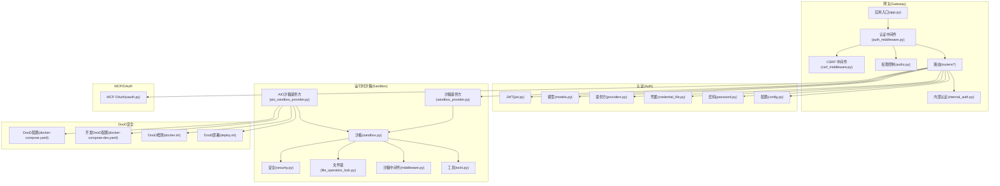
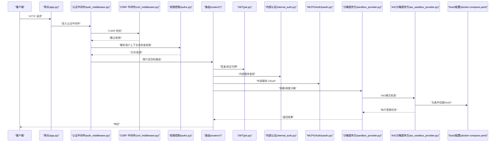
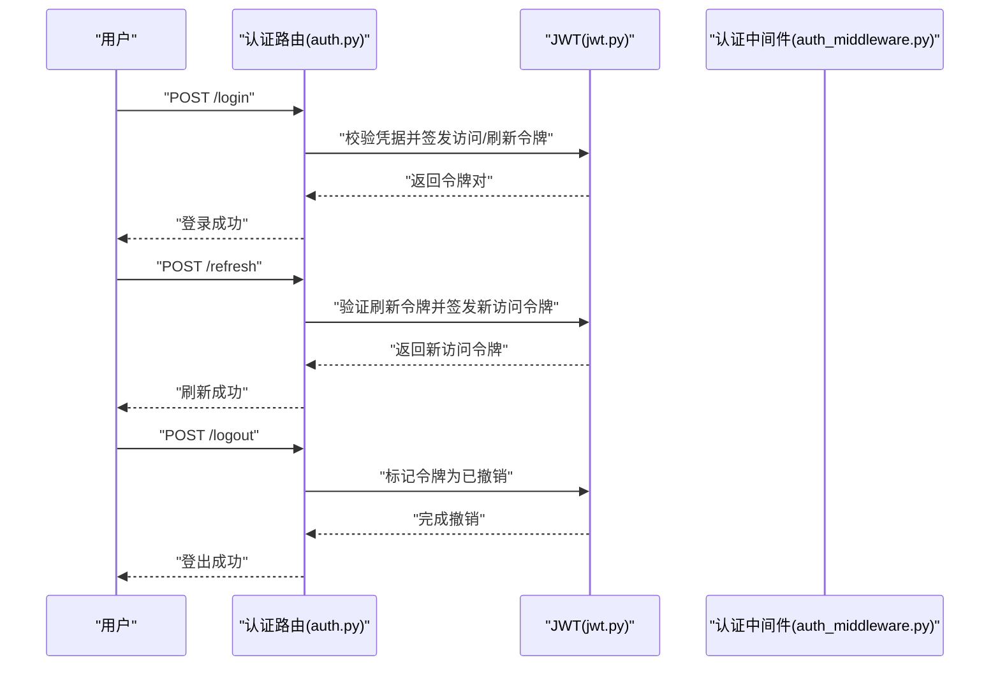
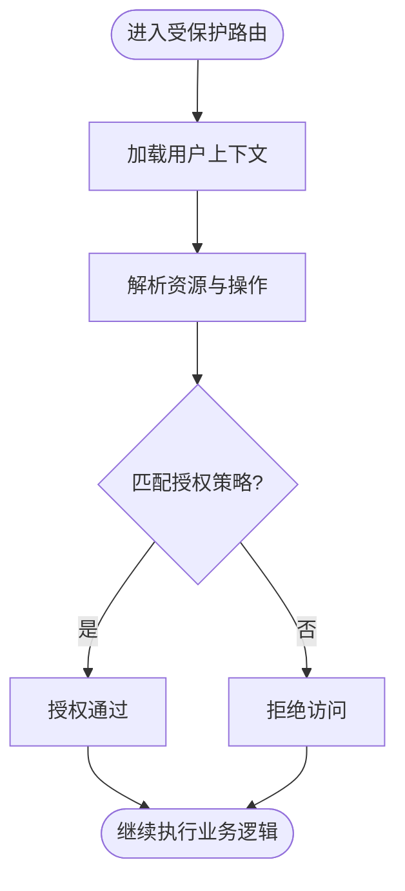
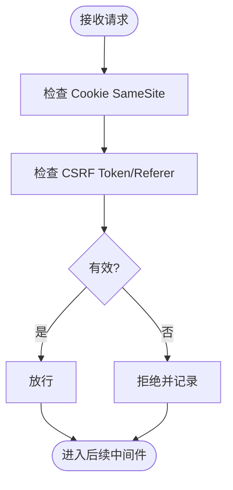
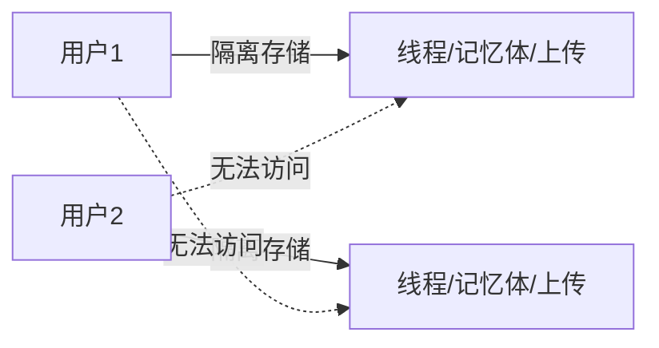
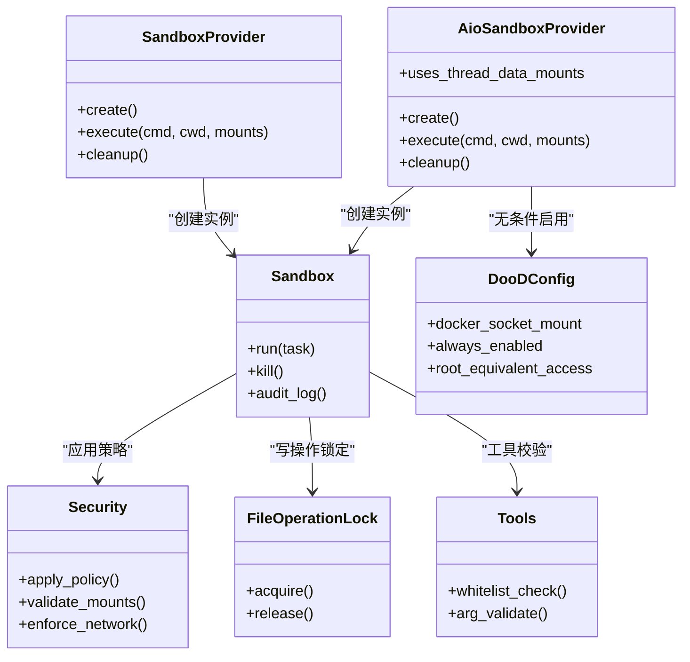
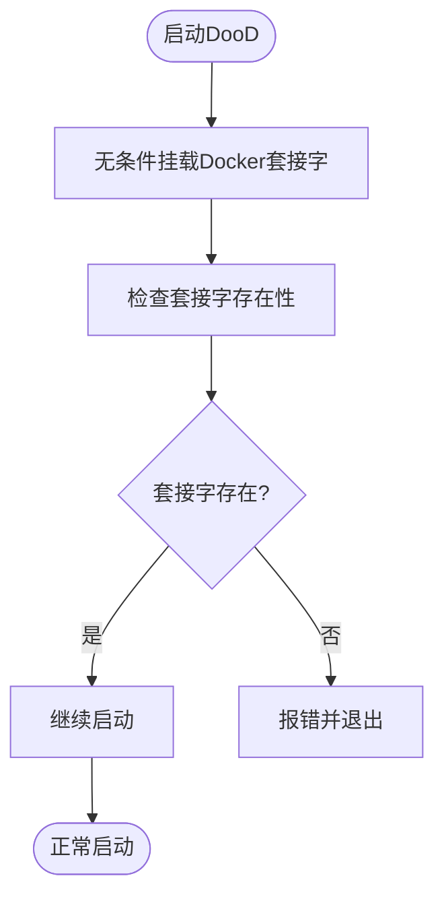
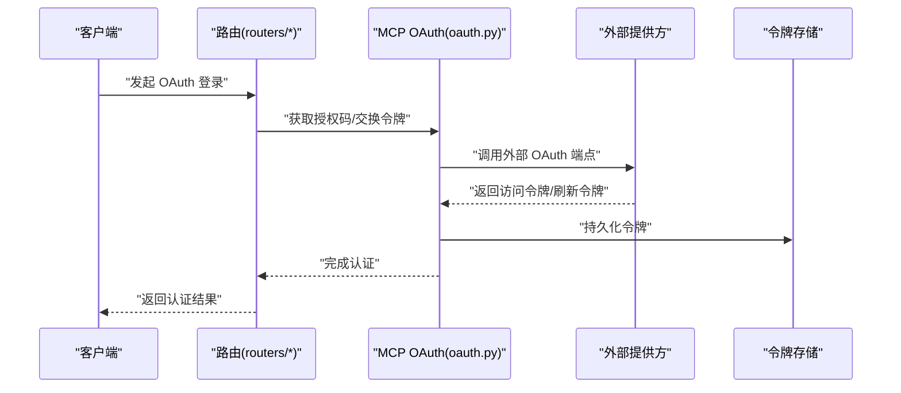
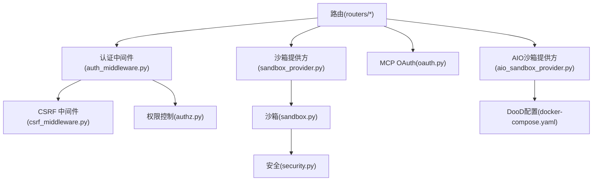

# 安全架构

<cite>
**本文引用的文件**
- [jwt.py](file://backend/app/gateway/auth/jwt.py)
- [csrf_middleware.py](file://backend/app/gateway/csrf_middleware.py)
- [auth_middleware.py](file://backend/app/gateway/auth_middleware.py)
- [security.py](file://backend/packages/harness/deerflow/sandbox/security.py)
- [sandbox.py](file://backend/packages/harness/deerflow/sandbox/sandbox.py)
- [sandbox_provider.py](file://backend/packages/harness/deerflow/sandbox/sandbox_provider.py)
- [file_operation_lock.py](file://backend/packages/harness/deerflow/sandbox/file_operation_lock.py)
- [middleware.py](file://backend/packages/harness/deerflow/sandbox/middleware.py)
- [tools.py](file://backend/packages/harness/deerflow/sandbox/tools.py)
- [oauth.py](file://backend/packages/harness/deerflow/mcp/oauth.py)
- [internal_auth.py](file://backend/app/gateway/internal_auth.py)
- [authz.py](file://backend/app/gateway/authz.py)
- [models.py](file://backend/app/gateway/auth/models.py)
- [providers.py](file://backend/app/gateway/auth/providers.py)
- [credential_file.py](file://backend/app/gateway/auth/credential_file.py)
- [password.py](file://backend/app/gateway/auth/password.py)
- [config.py](file://backend/app/gateway/auth/config.py)
- [reset_admin.py](file://backend/app/gateway/auth/reset_admin.py)
- [auth.py](file://backend/app/gateway/routers/auth.py)
- [deps.py](file://backend/app/gateway/deps.py)
- [app.py](file://backend/app/gateway/app.py)
- [AUTH_DESIGN.md](file://backend/docs/AUTH_DESIGN.md)
- [CONFIGURATION.md](file://backend/docs/CONFIGURATION.md)
- [PATH_EXAMPLES.md](file://backend/docs/PATH_EXAMPLES.md)
- [GUARDRAILS.md](file://backend/docs/GUARDRAILS.md)
- [migrate_user_isolation.py](file://backend/scripts/migrate_user_isolation.py)
- [test_auth.py](file://backend/tests/test_auth.py)
- [test_csrf_middleware.py](file://backend/tests/test_csrf_middleware.py)
- [test_sandbox_middleware.py](file://backend/tests/test_sandbox_middleware.py)
- [test_sandbox_tools_security.py](file://backend/tests/test_sandbox_tools_security.py)
- [test_safety_termination_detectors.py](file://backend/tests/test_safety_termination_detectors.py)
- [test_internal_auth.py](file://backend/tests/test_internal_auth.py)
- [test_owner_isolation.py](file://backend/tests/test_owner_isolation.py)
- [test_memory_storage_user_isolation.py](file://backend/tests/test_memory_storage_user_isolation.py)
- [test_paths_user_isolation.py](file://backend/tests/test_paths_user_isolation.py)
- [test_user_context.py](file://backend/tests/test_user_context.py)
- [test_langgraph_auth.py](file://backend/tests/test_langgraph_auth.py)
- [test_mcp_oauth.py](file://backend/tests/test_mcp_oauth.py)
- [docker.sh](file://scripts/docker.sh)
- [deploy.sh](file://scripts/deploy.sh)
- [docker-compose.yaml](file://docker/docker-compose.yaml)
- [docker-compose-dev.yaml](file://docker/docker-compose-dev.yaml)
- [aio_sandbox_provider.py](file://backend/packages/harness/deerflow/community/aio_sandbox/aio_sandbox_provider.py)
- [sandbox_config.py](file://backend/packages/harness/deerflow/config/sandbox_config.py)
- [SECURITY.md](file://SECURITY.md)
- [config.example.yaml](file://config.example.yaml)
</cite>

## 更新摘要
**所做更改**
- 更新了Docker套接字挂载安全加固章节，反映DooD模式下socket挂载机制的变更
- 移除了基于沙箱模式的条件挂载机制，现在无条件挂载/var/run/docker.sock
- 更新了DooD安全威胁模型与缓解措施章节
- 更新了沙箱安全机制章节，反映无条件挂载的安全影响
- 更新了安全配置示例与最佳实践章节，包含新的DooD模式安全配置

## 目录
1. [引言](#引言)
2. [项目结构](#项目结构)
3. [核心组件](#核心组件)
4. [架构总览](#架构总览)
5. [详细组件分析](#详细组件分析)
6. [依赖关系分析](#依赖关系分析)
7. [性能考虑](#性能考虑)
8. [故障排查指南](#故障排查指南)
9. [结论](#结论)
10. [附录](#附录)

## 引言
本文件面向 DeerFlow 的安全架构，系统性阐述认证授权机制（含 JWT、权限控制）、跨站请求伪造（CSRF）防护、用户隔离与数据访问控制、沙箱安全与文件系统/网络访问控制、安全威胁模型与缓解策略、第三方认证与 OAuth 流程、令牌管理策略、安全配置示例与最佳实践。内容基于后端网关与运行时沙箱模块的源码与测试用例进行归纳总结，确保可追溯到具体实现。

**更新重点**：本次更新重点关注Docker套接字挂载安全机制的变更，DooD（Docker-out-of-Docker）模式现在无条件挂载/var/run/docker.sock，取消了基于沙箱模式的条件挂载机制，移除了默认读写挂载的安全限制。

## 项目结构
后端采用 Python/FastAPI 网关与"Harness"运行时框架组合：
- 网关层负责路由、认证中间件、CSRF 中间件、内部认证、权限控制等
- 运行时沙箱层负责代码执行隔离、文件系统隔离、工具调用安全、网络访问控制
- 文档与测试覆盖认证设计、配置、路径隔离、安全守卫等主题



**图表来源**
- [app.py](file://backend/app/gateway/app.py)
- [auth_middleware.py](file://backend/app/gateway/auth_middleware.py)
- [csrf_middleware.py](file://backend/app/gateway/csrf_middleware.py)
- [internal_auth.py](file://backend/app/gateway/internal_auth.py)
- [authz.py](file://backend/app/gateway/authz.py)
- [jwt.py](file://backend/app/gateway/auth/jwt.py)
- [models.py](file://backend/app/gateway/auth/models.py)
- [providers.py](file://backend/app/gateway/auth/providers.py)
- [credential_file.py](file://backend/app/gateway/auth/credential_file.py)
- [password.py](file://backend/app/gateway/auth/password.py)
- [config.py](file://backend/app/gateway/auth/config.py)
- [sandbox_provider.py](file://backend/packages/harness/deerflow/sandbox/sandbox_provider.py)
- [sandbox.py](file://backend/packages/harness/deerflow/sandbox/sandbox.py)
- [security.py](file://backend/packages/harness/deerflow/sandbox/security.py)
- [file_operation_lock.py](file://backend/packages/harness/deerflow/sandbox/file_operation_lock.py)
- [middleware.py](file://backend/packages/harness/deerflow/sandbox/middleware.py)
- [tools.py](file://backend/packages/harness/deerflow/sandbox/tools.py)
- [aio_sandbox_provider.py](file://backend/packages/harness/deerflow/community/aio_sandbox/aio_sandbox_provider.py)
- [docker-compose.yaml](file://docker/docker-compose.yaml)
- [docker-compose-dev.yaml](file://docker/docker-compose-dev.yaml)
- [docker.sh](file://scripts/docker.sh)
- [deploy.sh](file://scripts/deploy.sh)
- [oauth.py](file://backend/packages/harness/deerflow/mcp/oauth.py)

**章节来源**
- [app.py](file://backend/app/gateway/app.py)
- [AUTH_DESIGN.md](file://backend/docs/AUTH_DESIGN.md)
- [CONFIGURATION.md](file://backend/docs/CONFIGURATION.md)

## 核心组件
- 认证与会话：基于 JWT 的登录/刷新/注销流程；本地凭据与密码校验；认证提供方抽象；凭据文件管理；管理员重置流程
- 权限控制：基于角色/资源的访问控制（ABAC/ACL），结合用户上下文与资源所有权
- CSRF 防护：基于 SameSite Cookie、CSRF Token 或 Referer 校验的多层策略
- 用户隔离：按用户维度的数据存储隔离、内存与线程元数据隔离、路径访问隔离
- 沙箱安全：进程/容器级隔离、文件系统只读/白名单挂载、工具调用白名单、网络出站访问控制
- **DooD安全**：Docker套接字挂载现在无条件启用，取消了基于沙箱模式的条件挂载机制
- MCP/OAuth：外部服务认证与令牌管理，支持 OAuth 授权码/客户端凭证等模式

**章节来源**
- [jwt.py](file://backend/app/gateway/auth/jwt.py)
- [auth_middleware.py](file://backend/app/gateway/auth_middleware.py)
- [csrf_middleware.py](file://backend/app/gateway/csrf_middleware.py)
- [authz.py](file://backend/app/gateway/authz.py)
- [models.py](file://backend/app/gateway/auth/models.py)
- [providers.py](file://backend/app/gateway/auth/providers.py)
- [credential_file.py](file://backend/app/gateway/auth/credential_file.py)
- [password.py](file://backend/app/gateway/auth/password.py)
- [config.py](file://backend/app/gateway/auth/config.py)
- [security.py](file://backend/packages/harness/deerflow/sandbox/security.py)
- [sandbox.py](file://backend/packages/harness/deerflow/sandbox/sandbox.py)
- [sandbox_provider.py](file://backend/packages/harness/deerflow/sandbox/sandbox_provider.py)
- [file_operation_lock.py](file://backend/packages/harness/deerflow/sandbox/file_operation_lock.py)
- [middleware.py](file://backend/packages/harness/deerflow/sandbox/middleware.py)
- [tools.py](file://backend/packages/harness/deerflow/sandbox/tools.py)
- [aio_sandbox_provider.py](file://backend/packages/harness/deerflow/community/aio_sandbox/aio_sandbox_provider.py)
- [docker-compose.yaml](file://docker/docker-compose.yaml)
- [docker-compose-dev.yaml](file://docker/docker-compose-dev.yaml)
- [docker.sh](file://scripts/docker.sh)
- [deploy.sh](file://scripts/deploy.sh)
- [oauth.py](file://backend/packages/harness/deerflow/mcp/oauth.py)

## 架构总览
下图展示从客户端到后端路由、认证中间件、权限控制、沙箱执行的整体链路与关键安全节点。



**图表来源**
- [app.py](file://backend/app/gateway/app.py)
- [auth_middleware.py](file://backend/app/gateway/auth_middleware.py)
- [csrf_middleware.py](file://backend/app/gateway/csrf_middleware.py)
- [authz.py](file://backend/app/gateway/authz.py)
- [jwt.py](file://backend/app/gateway/auth/jwt.py)
- [internal_auth.py](file://backend/app/gateway/internal_auth.py)
- [oauth.py](file://backend/packages/harness/deerflow/mcp/oauth.py)
- [sandbox_provider.py](file://backend/packages/harness/deerflow/sandbox/sandbox_provider.py)
- [aio_sandbox_provider.py](file://backend/packages/harness/deerflow/community/aio_sandbox/aio_sandbox_provider.py)
- [docker-compose.yaml](file://docker/docker-compose.yaml)

## 详细组件分析

### 认证与会话（JWT）
- 登录/刷新/注销：通过路由处理登录请求，生成短期访问令牌与长期刷新令牌；刷新接口仅接受有效刷新令牌；注销使令牌失效
- 令牌结构：包含用户标识、角色、过期时间、签发时间等声明；签名算法与密钥轮换策略
- 密钥管理：密钥存储于安全位置，定期轮换；刷新令牌与访问令牌区分存储与撤销
- 会话生命周期：访问令牌短周期、刷新令牌长周期；服务端维护黑名单或基于签发时间的撤销列表



**图表来源**
- [auth.py](file://backend/app/gateway/routers/auth.py)
- [jwt.py](file://backend/app/gateway/auth/jwt.py)
- [auth_middleware.py](file://backend/app/gateway/auth_middleware.py)

**章节来源**
- [jwt.py](file://backend/app/gateway/auth/jwt.py)
- [auth.py](file://backend/app/gateway/routers/auth.py)
- [auth_middleware.py](file://backend/app/gateway/auth_middleware.py)
- [models.py](file://backend/app/gateway/auth/models.py)
- [providers.py](file://backend/app/gateway/auth/providers.py)
- [credential_file.py](file://backend/app/gateway/auth/credential_file.py)
- [password.py](file://backend/app/gateway/auth/password.py)
- [config.py](file://backend/app/gateway/auth/config.py)
- [reset_admin.py](file://backend/app/gateway/auth/reset_admin.py)

### 权限控制系统（RBAC/ABAC）
- 资源与操作：定义受保护资源（线程、记忆体、工件、上传等）与操作（读取、写入、删除、管理）
- 角色与策略：基于用户角色与资源属性（如所有者）进行授权决策；支持细粒度策略表达
- 上下文注入：在认证中间件中提取用户身份与租户信息，传递给权限控制模块
- 内部服务授权：内部路由仅允许来自可信来源的服务访问，避免越权



**图表来源**
- [authz.py](file://backend/app/gateway/authz.py)
- [auth_middleware.py](file://backend/app/gateway/auth_middleware.py)
- [internal_auth.py](file://backend/app/gateway/internal_auth.py)

**章节来源**
- [authz.py](file://backend/app/gateway/authz.py)
- [auth_middleware.py](file://backend/app/gateway/auth_middleware.py)
- [internal_auth.py](file://backend/app/gateway/internal_auth.py)

### CSRF 保护机制
- 多层防护：Cookie 设置 SameSite 属性；表单提交携带 CSRF Token；关键请求要求 Referer 校验
- 中间件拦截：在认证中间件之前执行，拒绝不满足条件的请求
- 例外规则：静态资源与特定 GET 请求可豁免，但需严格限定范围



**图表来源**
- [csrf_middleware.py](file://backend/app/gateway/csrf_middleware.py)
- [auth_middleware.py](file://backend/app/gateway/auth_middleware.py)

**章节来源**
- [csrf_middleware.py](file://backend/app/gateway/csrf_middleware.py)
- [test_csrf_middleware.py](file://backend/tests/test_csrf_middleware.py)

### 用户隔离与数据访问控制
- 数据隔离：按用户 ID 维度隔离线程、记忆体、上传、反馈等数据存储；迁移脚本确保历史数据一致性
- 路径隔离：限制文件系统访问路径，禁止越界读写
- 上下文隔离：用户上下文贯穿请求生命周期，防止跨用户数据泄露
- 内存隔离：线程元数据与内存存储按用户隔离，避免共享状态污染



**图表来源**
- [migrate_user_isolation.py](file://backend/scripts/migrate_user_isolation.py)
- [test_owner_isolation.py](file://backend/tests/test_owner_isolation.py)
- [test_memory_storage_user_isolation.py](file://backend/tests/test_memory_storage_user_isolation.py)
- [test_paths_user_isolation.py](file://backend/tests/test_paths_user_isolation.py)
- [test_user_context.py](file://backend/tests/test_user_context.py)

**章节来源**
- [migrate_user_isolation.py](file://backend/scripts/migrate_user_isolation.py)
- [test_owner_isolation.py](file://backend/tests/test_owner_isolation.py)
- [test_memory_storage_user_isolation.py](file://backend/tests/test_memory_storage_user_isolation.py)
- [test_paths_user_isolation.py](file://backend/tests/test_paths_user_isolation.py)
- [test_user_context.py](file://backend/tests/test_user_context.py)

### 沙箱安全机制
- 执行环境隔离：本地/远程沙箱提供方，统一抽象；默认启用只读根文件系统与最小权限
- 文件系统隔离：白名单挂载、写操作锁定、禁止宿主机路径直连
- 工具调用安全：工具白名单与参数校验；禁用危险命令与高风险 API
- 网络访问控制：默认阻断出站连接，仅允许白名单域名/端口；支持代理与超时限制
- 审计与清理：执行前后审计日志、超时/异常终止、孤儿进程回收
- **DooD安全机制**：Docker套接字挂载现在无条件启用，取消了基于沙箱模式的条件挂载机制



**图表来源**
- [sandbox_provider.py](file://backend/packages/harness/deerflow/sandbox/sandbox_provider.py)
- [aio_sandbox_provider.py](file://backend/packages/harness/deerflow/community/aio_sandbox/aio_sandbox_provider.py)
- [sandbox.py](file://backend/packages/harness/deerflow/sandbox/sandbox.py)
- [security.py](file://backend/packages/harness/deerflow/sandbox/security.py)
- [file_operation_lock.py](file://backend/packages/harness/deerflow/sandbox/file_operation_lock.py)
- [tools.py](file://backend/packages/harness/deerflow/sandbox/tools.py)
- [docker-compose.yaml](file://docker/docker-compose.yaml)
- [docker-compose-dev.yaml](file://docker/docker-compose-dev.yaml)

**章节来源**
- [security.py](file://backend/packages/harness/deerflow/sandbox/security.py)
- [sandbox.py](file://backend/packages/harness/deerflow/sandbox/sandbox.py)
- [sandbox_provider.py](file://backend/packages/harness/deerflow/sandbox/sandbox_provider.py)
- [file_operation_lock.py](file://backend/packages/harness/deerflow/sandbox/file_operation_lock.py)
- [middleware.py](file://backend/packages/harness/deerflow/sandbox/middleware.py)
- [tools.py](file://backend/packages/harness/deerflow/sandbox/tools.py)
- [aio_sandbox_provider.py](file://backend/packages/harness/deerflow/community/aio_sandbox/aio_sandbox_provider.py)
- [docker-compose.yaml](file://docker/docker-compose.yaml)
- [docker-compose-dev.yaml](file://docker/docker-compose-dev.yaml)
- [test_sandbox_middleware.py](file://backend/tests/test_sandbox_middleware.py)
- [test_sandbox_tools_security.py](file://backend/tests/test_sandbox_tools_security.py)

### Docker套接字挂载安全机制

**更新**：DooD（Docker-out-of-Docker）模式下的socket挂载机制发生重大变更

DooD（Docker-out-of-Docker）模式现在采用无条件挂载策略，取消了基于沙箱模式的条件挂载机制：

#### 安全变更概述
- **无条件挂载**：现在无论沙箱模式如何，都会无条件挂载/var/run/docker.sock
- **简化机制**：移除了复杂的沙箱模式检测和条件挂载逻辑
- **统一配置**：所有DooD场景都使用相同的挂载策略
- **安全风险**：这种变更增加了潜在的安全风险，因为DooD始终可用

#### 当前实现机制



**图表来源**
- [docker-compose.yaml](file://docker/docker-compose.yaml)
- [docker-compose-dev.yaml](file://docker/docker-compose-dev.yaml)
- [deploy.sh](file://scripts/deploy.sh)

#### 关键安全特性
- **无条件启用**：所有DooD场景都启用Docker套接字挂载
- **套接字验证**：启动时验证Docker套接字存在性
- **简化配置**：移除了复杂的opt-in机制和模式检测
- **安全警告缺失**：不再显示明确的安全警告

#### 配置文件对比

**生产环境配置**：
```yaml
gateway:
  volumes:
    - ${DEER_FLOW_DOCKER_SOCKET}:/var/run/docker.sock  # 无条件挂载
```

**开发环境配置**：
```yaml
gateway:
  volumes:
    - /var/run/docker.sock:/var/run/docker.sock  # 无条件挂载
```

**章节来源**
- [docker-compose.yaml](file://docker/docker-compose.yaml)
- [docker-compose-dev.yaml](file://docker/docker-compose-dev.yaml)
- [deploy.sh](file://scripts/deploy.sh)

### 第三方认证与 OAuth 流程
- 提供方抽象：统一的认证提供方接口，支持本地/外部提供方切换
- OAuth 集成：支持授权码/客户端凭证等模式；令牌持久化与刷新策略
- MCP 场景：与 MCP 服务交互时的身份传递与令牌管理
- 安全建议：使用 HTTPS、短时效访问令牌、刷新令牌安全存储、回调地址白名单



**图表来源**
- [oauth.py](file://backend/packages/harness/deerflow/mcp/oauth.py)
- [providers.py](file://backend/app/gateway/auth/providers.py)
- [auth.py](file://backend/app/gateway/routers/auth.py)

**章节来源**
- [oauth.py](file://backend/packages/harness/deerflow/mcp/oauth.py)
- [providers.py](file://backend/app/gateway/auth/providers.py)
- [auth.py](file://backend/app/gateway/routers/auth.py)
- [test_mcp_oauth.py](file://backend/tests/test_mcp_oauth.py)

### 安全守卫与终止检测
- 守卫中间件：对输入输出进行敏感词过滤、主题守卫、提示注入检测
- 安全终止：检测不安全/违规内容，触发安全终止与审计日志
- 配置化策略：支持自定义敏感词库、白名单、阈值与处理策略

**章节来源**
- [GUARDRAILS.md](file://backend/docs/GUARDRAILS.md)
- [test_safety_termination_detectors.py](file://backend/tests/test_safety_termination_detectors.py)

## 依赖关系分析
- 认证链路：路由 -> 认证中间件 -> CSRF 中间件 -> 权限控制 -> 具体内部路由
- 沙箱链路：路由 -> 沙箱提供方 -> 沙箱实例 -> 安全策略 -> 工具/文件/网络控制
- **DooD链路**：路由 -> AIO沙箱提供方 -> 无条件DooD挂载
- 外部依赖：MCP OAuth、数据库、文件存储、外部 LLM/工具服务



**图表来源**
- [auth_middleware.py](file://backend/app/gateway/auth_middleware.py)
- [csrf_middleware.py](file://backend/app/gateway/csrf_middleware.py)
- [authz.py](file://backend/app/gateway/authz.py)
- [sandbox_provider.py](file://backend/packages/harness/deerflow/sandbox/sandbox_provider.py)
- [sandbox.py](file://backend/packages/harness/deerflow/sandbox/sandbox.py)
- [security.py](file://backend/packages/harness/deerflow/sandbox/security.py)
- [oauth.py](file://backend/packages/harness/deerflow/mcp/oauth.py)
- [aio_sandbox_provider.py](file://backend/packages/harness/deerflow/community/aio_sandbox/aio_sandbox_provider.py)
- [docker-compose.yaml](file://docker/docker-compose.yaml)

**章节来源**
- [auth_middleware.py](file://backend/app/gateway/auth_middleware.py)
- [csrf_middleware.py](file://backend/app/gateway/csrf_middleware.py)
- [authz.py](file://backend/app/gateway/authz.py)
- [sandbox_provider.py](file://backend/packages/harness/deerflow/sandbox/sandbox_provider.py)
- [sandbox.py](file://backend/packages/harness/deerflow/sandbox/sandbox.py)
- [security.py](file://backend/packages/harness/deerflow/sandbox/security.py)
- [oauth.py](file://backend/packages/harness/deerflow/mcp/oauth.py)

## 性能考虑
- 认证缓存：对频繁访问的用户上下文进行短期缓存，降低权限检查开销
- 沙箱并发：合理设置沙箱池大小与超时，避免资源争用与堆积
- 网络出站：预热 DNS、复用连接、限制并发数，减少外部依赖延迟
- 日志与审计：异步写入与批量上报，避免阻塞主请求路径
- **DooD性能**：无条件挂载DooD，简化了启动流程，但可能增加安全风险

## 故障排查指南
- 认证失败
  - 检查令牌是否过期或被撤销；确认签发/验证流程与密钥一致
  - 核对凭据文件与密码哈希是否正确
  - 参考测试用例定位问题范围
- 权限拒绝
  - 确认用户角色与资源所有权；检查策略配置与上下文注入
- CSRF 拦截
  - 核对 Cookie SameSite 设置、Token/Referer 是否随请求发送
- 沙箱执行异常
  - 查看审计日志与错误码；确认工具白名单、挂载路径与网络策略
- **DooD相关问题**
  - 检查Docker套接字路径是否正确（现在总是/var/run/docker.sock）
  - 验证DooD配置文件是否正确加载
  - 注意无条件挂载带来的安全风险
- MCP OAuth 失败
  - 检查回调地址、令牌存储与刷新流程

**章节来源**
- [test_auth.py](file://backend/tests/test_auth.py)
- [test_csrf_middleware.py](file://backend/tests/test_csrf_middleware.py)
- [test_internal_auth.py](file://backend/tests/test_internal_auth.py)
- [test_langgraph_auth.py](file://backend/tests/test_langgraph_auth.py)

## 结论
DeerFlow 的安全架构以"最小权限+纵深防御"为核心原则：前端与网关层通过 JWT、CSRF、RBAC 构建强健的访问控制；运行时沙箱通过文件系统隔离、工具白名单与网络出站控制实现执行安全；配合 MCP/OAuth 与令牌管理策略，形成从身份到执行的完整闭环。

**最新安全变更**：通过DooD模式下的Docker套接字挂载机制变更，系统现在采用无条件挂载策略，取消了基于沙箱模式的条件挂载机制。虽然这简化了配置和启动流程，但也带来了更高的安全风险，因为DooD现在始终可用。

建议立即实施更严格的安全控制措施，包括但不限于：限制DooD的使用范围、实施更严格的网络访问控制、加强审计日志、定期进行安全评估，并考虑重新引入基于模式的条件挂载机制。

## 附录

### 安全威胁模型与缓解

**更新**：DooD模式安全威胁模型发生重大变化

- **DooD威胁模型**
  - **无条件DooD滥用**：现在DooD始终可用，增加了被滥用的风险
  - **容器逃逸**：由于无条件挂载，攻击者更容易利用DooD绕过沙箱隔离
  - **权限提升**：DooD始终可用意味着root权限风险持续存在
  - **横向移动**：DooD始终可用增加了访问其他容器和主机资源的可能性

- **缓解措施**
  - **网络隔离**：实施更强的网络访问控制，限制DooD的网络能力
  - **资源限制**：对DooD容器实施更严格的资源配额和限制
  - **审计监控**：加强DooD使用情况的审计和监控
  - **最小权限**：即使DooD可用，也应限制其使用的权限范围
  - **定期审查**：定期审查DooD的使用情况和安全影响

- **传统威胁缓解**
  - 身份冒用：通过令牌泄露/暴力破解；缓解：短时效令牌、刷新令牌安全存储、强制二次验证
  - 权限提升：越权访问用户数据；缓解：严格的 RBAC/ABAC、用户隔离、最小权限
  - CSRF 攻击：跨站请求伪造；缓解：SameSite Cookie、CSRF Token、Referer 校验
  - 沙箱逃逸：执行恶意代码；缓解：只读根文件系统、工具白名单、网络阻断、超时/资源限制
  - 外部服务劫持：MCP/OAuth 回调被篡改；缓解：HTTPS、回调白名单、状态参数校验

**章节来源**
- [docker-compose.yaml](file://docker/docker-compose.yaml)
- [docker-compose-dev.yaml](file://docker/docker-compose-dev.yaml)
- [SECURITY.md](file://SECURITY.md)

### 安全配置示例与最佳实践

**更新**：DooD模式安全配置示例发生重大变化

- **JWT配置最佳实践**
  - 使用强随机密钥；访问令牌短周期（如 15 分钟），刷新令牌长周期（如 7 天）
  - 刷新令牌单独存储，支持撤销列表

- **CSRF防护最佳实践**
  - Cookie 设置 SameSite=Strict/Lax；关键请求必须携带 CSRF Token 或校验 Referer

- **用户隔离最佳实践**
  - 存储按用户 ID 分区；路径访问白名单；上下文贯穿请求生命周期

- **沙箱安全最佳实践**
  - 默认只读根文件系统；白名单挂载；禁止宿主机路径；网络仅允许必要域名
  - 工具调用前参数校验；超时与资源上限；执行前后审计

- **DooD模式安全配置**
  - **无条件启用**：DooD现在无条件启用，无法通过配置禁用
  - **套接字验证**：启动时检查Docker套接字存在性
  - **安全警告缺失**：不再显示明确的安全警告
  - **最小权限原则**：即使DooD无条件启用，也应限制其使用范围
  - **网络隔离**：实施更强的网络访问控制
  - **资源限制**：对DooD容器实施严格的资源配额
  - **审计监控**：加强DooD使用情况的审计和监控

- **MCP/OAuth最佳实践**
  - 回调地址白名单；状态参数防伪；令牌加密存储；定期轮换

**章节来源**
- [CONFIGURATION.md](file://backend/docs/CONFIGURATION.md)
- [PATH_EXAMPLES.md](file://backend/docs/PATH_EXAMPLES.md)
- [AUTH_DESIGN.md](file://backend/docs/AUTH_DESIGN.md)
- [docker-compose.yaml](file://docker/docker-compose.yaml)
- [docker-compose-dev.yaml](file://docker/docker-compose-dev.yaml)
- [config.example.yaml](file://config.example.yaml)
- [SECURITY.md](file://SECURITY.md)