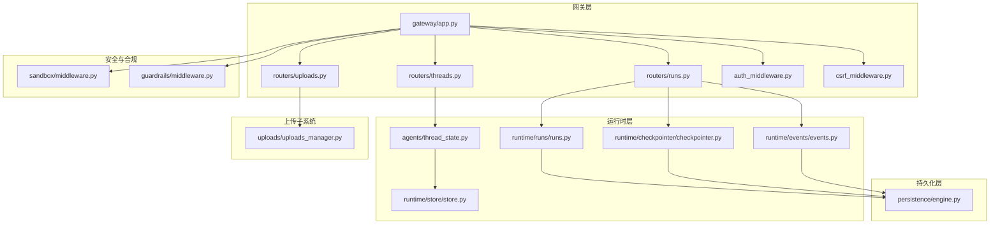
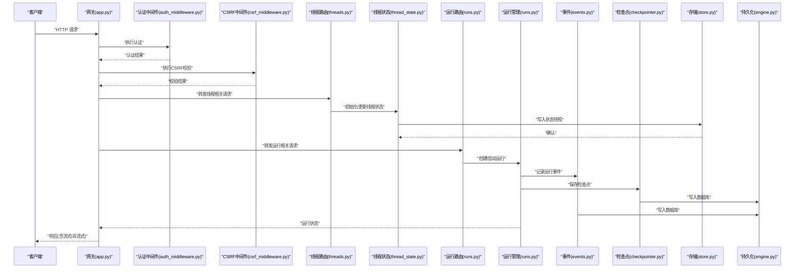
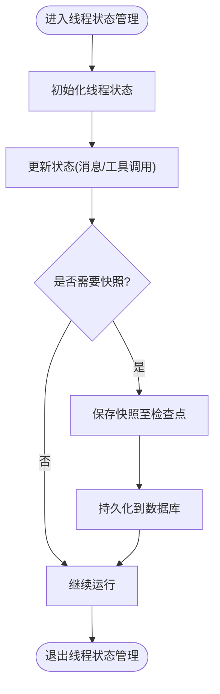
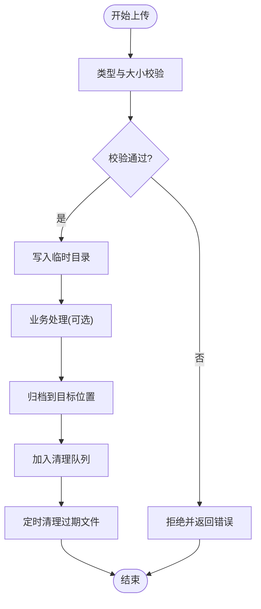
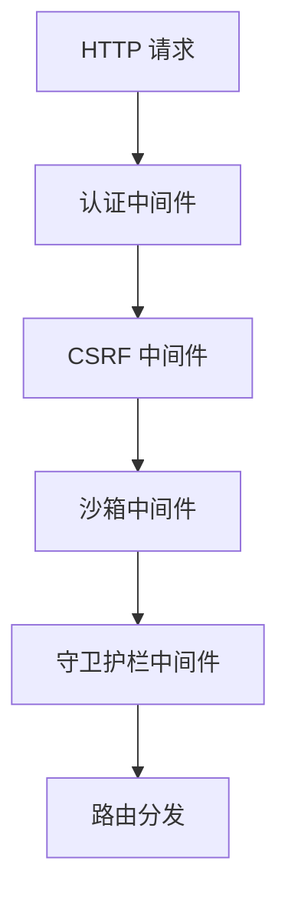
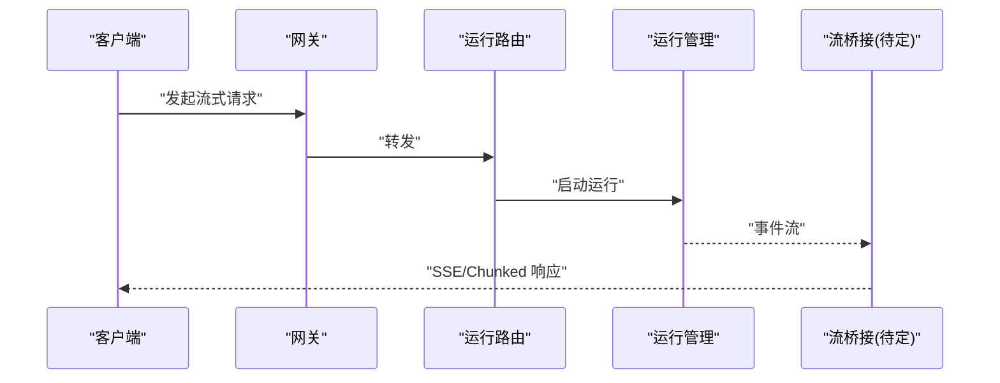
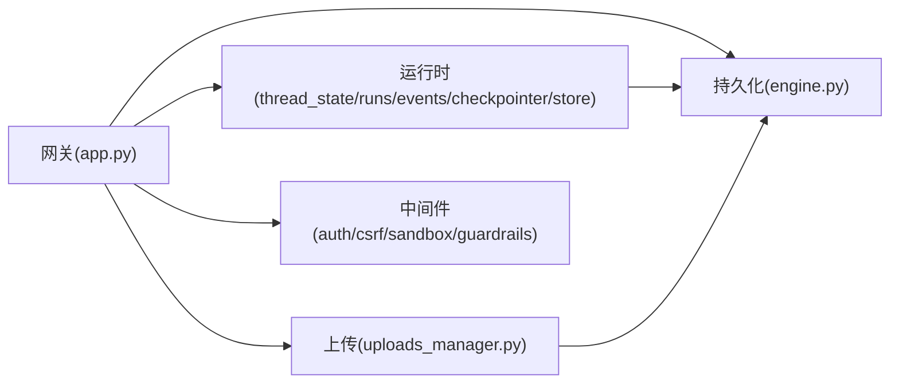

# 数据流设计

<cite>
**本文引用的文件**
- [backend/app/gateway/app.py](file://backend/app/gateway/app.py)
- [backend/app/gateway/routers/threads.py](file://backend/app/gateway/routers/threads.py)
- [backend/app/gateway/routers/runs.py](file://backend/app/gateway/routers/runs.py)
- [backend/app/gateway/routers/uploads.py](file://backend/app/gateway/routers/uploads.py)
- [backend/app/gateway/auth_middleware.py](file://backend/app/gateway/auth_middleware.py)
- [backend/app/gateway/csrf_middleware.py](file://backend/app/gateway/csrf_middleware.py)
- [backend/packages/harness/deerflow/agents/thread_state.py](file://backend/packages/harness/deerflow/agents/thread_state.py)
- [backend/packages/harness/deerflow/runtime/checkpointer/checkpointer.py](file://backend/packages/harness/deerflow/runtime/checkpointer/checkpointer.py)
- [backend/packages/harness/deerflow/runtime/store/store.py](file://backend/packages/harness/deerflow/runtime/store/store.py)
- [backend/packages/harness/deerflow/runtime/events/events.py](file://backend/packages/harness/deerflow/runtime/events/events.py)
- [backend/packages/harness/deerflow/runtime/runs/runs.py](file://backend/packages/harness/deerflow/runtime/runs/runs.py)
- [backend/packages/harness/deerflow/persistence/engine.py](file://backend/packages/harness/deerflow/persistence/engine.py)
- [backend/packages/harness/deerflow/uploads/uploads_manager.py](file://backend/packages/harness/deerflow/uploads/uploads_manager.py)
- [backend/packages/harness/deerflow/sandbox/middleware.py](file://backend/packages/harness/deerflow/sandbox/middleware.py)
- [backend/packages/harness/deerflow/guardrails/middleware.py](file://backend/packages/harness/deerflow/guardrails/middleware.py)
- [backend/docs/FILE_UPLOAD.md](file://backend/docs/FILE_UPLOAD.md)
- [backend/docs/middleware-execution-flow.md](file://backend/docs/middleware-execution-flow.md)
- [backend/docs/STREAMING.md](file://backend/docs/STREAMING.md)
- [backend/docs/MEMORY_IMPROVEMENTS.md](file://backend/docs/MEMORY_IMPROVEMENTS.md)
</cite>

## 目录
1. [引言](#引言)
2. [项目结构](#项目结构)
3. [核心组件](#核心组件)
4. [架构总览](#架构总览)
5. [详细组件分析](#详细组件分析)
6. [依赖关系分析](#依赖关系分析)
7. [性能考虑](#性能考虑)
8. [故障排除指南](#故障排除指南)
9. [结论](#结论)

## 引言
本文件面向 DeerFlow 数据流设计，系统性阐述从用户请求到响应的完整数据流路径，覆盖请求路由、中间件处理、智能体执行、消息传递、文件上传与清理、数据持久化与缓存、性能优化、验证规则、错误处理与异常恢复等主题。文档以代码级可视化图表呈现关键数据转换点与状态变化，帮助技术与非技术读者快速理解系统运作机制。

## 项目结构
后端采用分层与功能模块化组织：网关层负责路由与中间件编排；运行时层承载线程状态、检查点、事件与运行管理；持久化层提供数据库引擎与迁移；沙箱与守卫护栏提供安全与合规控制；上传子系统负责文件处理与清理；前端通过 Next.js 提供交互界面。

**图表来源**
- [backend/app/gateway/app.py](file://backend/app/gateway/app.py)
- [backend/app/gateway/routers/threads.py](file://backend/app/gateway/routers/threads.py)
- [backend/app/gateway/routers/runs.py](file://backend/app/gateway/routers/runs.py)
- [backend/app/gateway/routers/uploads.py](file://backend/app/gateway/routers/uploads.py)
- [backend/packages/harness/deerflow/agents/thread_state.py](file://backend/packages/harness/deerflow/agents/thread_state.py)
- [backend/packages/harness/deerflow/runtime/checkpointer/checkpointer.py](file://backend/packages/harness/deerflow/runtime/checkpointer/checkpointer.py)
- [backend/packages/harness/deerflow/runtime/store/store.py](file://backend/packages/harness/deerflow/runtime/store/store.py)
- [backend/packages/harness/deerflow/runtime/events/events.py](file://backend/packages/harness/deerflow/runtime/events/events.py)
- [backend/packages/harness/deerflow/runtime/runs/runs.py](file://backend/packages/harness/deerflow/runtime/runs/runs.py)
- [backend/packages/harness/deerflow/persistence/engine.py](file://backend/packages/harness/deerflow/persistence/engine.py)
- [backend/packages/harness/deerflow/uploads/uploads_manager.py](file://backend/packages/harness/deerflow/uploads/uploads_manager.py)
- [backend/packages/harness/deerflow/sandbox/middleware.py](file://backend/packages/harness/deerflow/sandbox/middleware.py)
- [backend/packages/harness/deerflow/guardrails/middleware.py](file://backend/packages/harness/deerflow/guardrails/middleware.py)

**章节来源**
- [backend/app/gateway/app.py](file://backend/app/gateway/app.py)
- [backend/app/gateway/routers/threads.py](file://backend/app/gateway/routers/threads.py)
- [backend/app/gateway/routers/runs.py](file://backend/app/gateway/routers/runs.py)
- [backend/app/gateway/routers/uploads.py](file://backend/app/gateway/routers/uploads.py)

## 核心组件
- 网关应用与路由：统一入口负责中间件链与各业务路由（线程、运行、上传）的调度。
- 运行时系统：线程状态管理、检查点持久化、事件存储、运行生命周期管理。
- 持久化引擎：统一数据库连接、事务与迁移能力。
- 安全与合规：沙箱中间件与守卫护栏中间件在请求进入核心逻辑前进行安全校验与内容过滤。
- 上传子系统：文件接收、临时存储、类型与大小校验、清理回收。

**章节来源**
- [backend/app/gateway/app.py](file://backend/app/gateway/app.py)
- [backend/packages/harness/deerflow/agents/thread_state.py](file://backend/packages/harness/deerflow/agents/thread_state.py)
- [backend/packages/harness/deerflow/runtime/checkpointer/checkpointer.py](file://backend/packages/harness/deerflow/runtime/checkpointer/checkpointer.py)
- [backend/packages/harness/deerflow/persistence/engine.py](file://backend/packages/harness/deerflow/persistence/engine.py)
- [backend/packages/harness/deerflow/sandbox/middleware.py](file://backend/packages/harness/deerflow/sandbox/middleware.py)
- [backend/packages/harness/deerflow/guardrails/middleware.py](file://backend/packages/harness/deerflow/guardrails/middleware.py)
- [backend/packages/harness/deerflow/uploads/uploads_manager.py](file://backend/packages/harness/deerflow/uploads/uploads_manager.py)

## 架构总览
下图展示一次典型“创建线程并启动运行”的端到端数据流：客户端发起请求 → 网关中间件链 → 路由器 → 运行时系统 → 持久化层 → 响应返回。

**图表来源**
- [backend/app/gateway/app.py](file://backend/app/gateway/app.py)
- [backend/app/gateway/auth_middleware.py](file://backend/app/gateway/auth_middleware.py)
- [backend/app/gateway/csrf_middleware.py](file://backend/app/gateway/csrf_middleware.py)
- [backend/app/gateway/routers/threads.py](file://backend/app/gateway/routers/threads.py)
- [backend/packages/harness/deerflow/agents/thread_state.py](file://backend/packages/harness/deerflow/agents/thread_state.py)
- [backend/app/gateway/routers/runs.py](file://backend/app/gateway/routers/runs.py)
- [backend/packages/harness/deerflow/runtime/runs/runs.py](file://backend/packages/harness/deerflow/runtime/runs/runs.py)
- [backend/packages/harness/deerflow/runtime/events/events.py](file://backend/packages/harness/deerflow/runtime/events/events.py)
- [backend/packages/harness/deerflow/runtime/checkpointer/checkpointer.py](file://backend/packages/harness/deerflow/runtime/checkpointer/checkpointer.py)
- [backend/packages/harness/deerflow/runtime/store/store.py](file://backend/packages/harness/deerflow/runtime/store/store.py)
- [backend/packages/harness/deerflow/persistence/engine.py](file://backend/packages/harness/deerflow/persistence/engine.py)

## 详细组件分析

### 线程状态管理与消息传递
- 线程状态：维护对话上下文、工具调用历史、内存索引等，支持增量更新与快照保存。
- 存储与检查点：状态变更写入本地或共享存储，结合检查点实现断点续跑与回放。
- 事件驱动：运行过程中的关键动作转化为事件，便于审计与追踪。

**图表来源**
- [backend/packages/harness/deerflow/agents/thread_state.py](file://backend/packages/harness/deerflow/agents/thread_state.py)
- [backend/packages/harness/deerflow/runtime/checkpointer/checkpointer.py](file://backend/packages/harness/deerflow/runtime/checkpointer/checkpointer.py)
- [backend/packages/harness/deerflow/runtime/store/store.py](file://backend/packages/harness/deerflow/runtime/store/store.py)
- [backend/packages/harness/deerflow/persistence/engine.py](file://backend/packages/harness/deerflow/persistence/engine.py)

**章节来源**
- [backend/packages/harness/deerflow/agents/thread_state.py](file://backend/packages/harness/deerflow/agents/thread_state.py)
- [backend/packages/harness/deerflow/runtime/store/store.py](file://backend/packages/harness/deerflow/runtime/store/store.py)
- [backend/packages/harness/deerflow/runtime/checkpointer/checkpointer.py](file://backend/packages/harness/deerflow/runtime/checkpointer/checkpointer.py)
- [backend/packages/harness/deerflow/persistence/engine.py](file://backend/packages/harness/deerflow/persistence/engine.py)

### 文件上传处理与清理流程
- 接收与校验：限制文件类型与大小，生成唯一标识，写入临时目录。
- 处理与归档：根据业务需求进行转换或直接归档，随后进入清理队列。
- 清理策略：定时任务扫描过期临时文件，删除无效附件，释放磁盘空间。

**图表来源**
- [backend/app/gateway/routers/uploads.py](file://backend/app/gateway/routers/uploads.py)
- [backend/packages/harness/deerflow/uploads/uploads_manager.py](file://backend/packages/harness/deerflow/uploads/uploads_manager.py)
- [backend/docs/FILE_UPLOAD.md](file://backend/docs/FILE_UPLOAD.md)

**章节来源**
- [backend/app/gateway/routers/uploads.py](file://backend/app/gateway/routers/uploads.py)
- [backend/packages/harness/deerflow/uploads/uploads_manager.py](file://backend/packages/harness/deerflow/uploads/uploads_manager.py)
- [backend/docs/FILE_UPLOAD.md](file://backend/docs/FILE_UPLOAD.md)

### 中间件执行顺序与职责
- 认证中间件：解析凭据、校验令牌有效性、注入用户上下文。
- CSRF 中间件：校验请求来源与令牌，防止跨站请求伪造。
- 沙箱中间件：对请求内容进行安全扫描与隔离策略。
- 守卫护栏中间件：基于敏感词与主题白名单进行内容过滤与阻断。

**图表来源**
- [backend/app/gateway/auth_middleware.py](file://backend/app/gateway/auth_middleware.py)
- [backend/app/gateway/csrf_middleware.py](file://backend/app/gateway/csrf_middleware.py)
- [backend/packages/harness/deerflow/sandbox/middleware.py](file://backend/packages/harness/deerflow/sandbox/middleware.py)
- [backend/packages/harness/deerflow/guardrails/middleware.py](file://backend/packages/harness/deerflow/guardrails/middleware.py)
- [backend/docs/middleware-execution-flow.md](file://backend/docs/middleware-execution-flow.md)

**章节来源**
- [backend/app/gateway/auth_middleware.py](file://backend/app/gateway/auth_middleware.py)
- [backend/app/gateway/csrf_middleware.py](file://backend/app/gateway/csrf_middleware.py)
- [backend/packages/harness/deerflow/sandbox/middleware.py](file://backend/packages/harness/deerflow/sandbox/middleware.py)
- [backend/packages/harness/deerflow/guardrails/middleware.py](file://backend/packages/harness/deerflow/guardrails/middleware.py)
- [backend/docs/middleware-execution-flow.md](file://backend/docs/middleware-execution-flow.md)

### 流式响应与性能优化
- 流式传输：运行结果按事件逐步推送，降低首字节延迟，提升用户体验。
- 缓存策略：对频繁访问的元数据与配置进行缓存，减少数据库压力。
- 并发与限流：在路由与运行管理中实施并发控制与速率限制，避免资源争用。

**图表来源**
- [backend/app/gateway/routers/runs.py](file://backend/app/gateway/routers/runs.py)
- [backend/packages/harness/deerflow/runtime/runs/runs.py](file://backend/packages/harness/deerflow/runtime/runs/runs.py)
- [backend/docs/STREAMING.md](file://backend/docs/STREAMING.md)

**章节来源**
- [backend/app/gateway/routers/runs.py](file://backend/app/gateway/routers/runs.py)
- [backend/packages/harness/deerflow/runtime/runs/runs.py](file://backend/packages/harness/deerflow/runtime/runs/runs.py)
- [backend/docs/STREAMING.md](file://backend/docs/STREAMING.md)

## 依赖关系分析
- 组件耦合：网关层通过路由器与运行时层解耦；运行时层内部通过事件与检查点实现松耦合。
- 外部依赖：数据库引擎提供统一访问接口；上传子系统依赖文件系统与临时目录。
- 循环依赖：未发现直接循环依赖；中间件链顺序明确，避免相互依赖。

**图表来源**
- [backend/app/gateway/app.py](file://backend/app/gateway/app.py)
- [backend/packages/harness/deerflow/agents/thread_state.py](file://backend/packages/harness/deerflow/agents/thread_state.py)
- [backend/packages/harness/deerflow/runtime/runs/runs.py](file://backend/packages/harness/deerflow/runtime/runs/runs.py)
- [backend/packages/harness/deerflow/runtime/events/events.py](file://backend/packages/harness/deerflow/runtime/events/events.py)
- [backend/packages/harness/deerflow/runtime/checkpointer/checkpointer.py](file://backend/packages/harness/deerflow/runtime/checkpointer/checkpointer.py)
- [backend/packages/harness/deerflow/runtime/store/store.py](file://backend/packages/harness/deerflow/runtime/store/store.py)
- [backend/packages/harness/deerflow/persistence/engine.py](file://backend/packages/harness/deerflow/persistence/engine.py)
- [backend/packages/harness/deerflow/uploads/uploads_manager.py](file://backend/packages/harness/deerflow/uploads/uploads_manager.py)
- [backend/app/gateway/auth_middleware.py](file://backend/app/gateway/auth_middleware.py)
- [backend/app/gateway/csrf_middleware.py](file://backend/app/gateway/csrf_middleware.py)
- [backend/packages/harness/deerflow/sandbox/middleware.py](file://backend/packages/harness/deerflow/sandbox/middleware.py)
- [backend/packages/harness/deerflow/guardrails/middleware.py](file://backend/packages/harness/deerflow/guardrails/middleware.py)

**章节来源**
- [backend/app/gateway/app.py](file://backend/app/gateway/app.py)
- [backend/packages/harness/deerflow/persistence/engine.py](file://backend/packages/harness/deerflow/persistence/engine.py)
- [backend/packages/harness/deerflow/uploads/uploads_manager.py](file://backend/packages/harness/deerflow/uploads/uploads_manager.py)

## 性能考虑
- I/O 优化：上传与下载采用异步与流式处理，避免阻塞主线程。
- 内存管理：线程状态与事件缓冲区设置上限，定期清理与压缩。
- 缓存命中：热点数据与配置缓存，结合失效策略保证一致性。
- 并发控制：运行管理器对工具调用与外部服务请求实施并发限制。
- 监控与告警：通过事件与日志记录关键指标，及时发现性能瓶颈。

**章节来源**
- [backend/docs/MEMORY_IMPROVEMENTS.md](file://backend/docs/MEMORY_IMPROVEMENTS.md)

## 故障排除指南
- 认证失败：检查令牌格式、有效期与签发方；确认中间件链顺序正确。
- CSRF 拒绝：核对请求头与令牌一致性；确保会话状态有效。
- 上传失败：检查文件类型与大小限制、临时目录权限与磁盘配额。
- 运行中断：查看事件日志与检查点恢复；确认数据库连接与事务一致性。
- 安全拦截：审查沙箱与守卫护栏规则；调整白名单与敏感词库。

**章节来源**
- [backend/app/gateway/auth_middleware.py](file://backend/app/gateway/auth_middleware.py)
- [backend/app/gateway/csrf_middleware.py](file://backend/app/gateway/csrf_middleware.py)
- [backend/packages/harness/deerflow/sandbox/middleware.py](file://backend/packages/harness/deerflow/sandbox/middleware.py)
- [backend/packages/harness/deerflow/guardrails/middleware.py](file://backend/packages/harness/deerflow/guardrails/middleware.py)
- [backend/packages/harness/deerflow/uploads/uploads_manager.py](file://backend/packages/harness/deerflow/uploads/uploads_manager.py)

## 结论
DeerFlow 的数据流设计以“网关中间件链 + 运行时事件驱动 + 持久化引擎”为核心，通过线程状态与检查点实现断点续跑，借助沙箱与守卫护栏保障安全合规，配合流式传输与缓存策略提升性能体验。该架构在可扩展性、可观测性与安全性方面具备良好基础，适合在多场景下演进与落地。