# 系统架构

<cite>
**本文引用的文件**
- [backend/docs/ARCHITECTURE.md](file://backend/docs/ARCHITECTURE.md)
- [backend/app/gateway/app.py](file://backend/app/gateway/app.py)
- [backend/langgraph.json](file://backend/langgraph.json)
- [docker/docker-compose.yaml](file://docker/docker-compose.yaml)
- [docker/nginx/nginx.conf](file://docker/nginx/nginx.conf)
- [frontend/package.json](file://frontend/package.json)
- [frontend/next.config.js](file://frontend/next.config.js)
- [backend/packages/harness/deerflow/agents/lead_agent/agent.py](file://backend/packages/harness/deerflow/agents/lead_agent/agent.py)
- [backend/packages/harness/deerflow/runtime/checkpointer/async_provider.py](file://backend/packages/harness/deerflow/runtime/checkpointer/async_provider.py)
- [backend/app/gateway/routers/threads.py](file://backend/app/gateway/routers/threads.py)
- [frontend/src/env.js](file://frontend/src/env.js)
- [deerflow_extensions/boot.py](file://deerflow_extensions/boot.py)
- [backend/app/gateway/deps.py](file://backend/app/gateway/deps.py)
- [backend/packages/harness/deerflow/config/app_config.py](file://backend/packages/harness/deerflow/config/app_config.py)
</cite>

## 目录
1. [引言](#引言)
2. [项目结构](#项目结构)
3. [核心组件](#核心组件)
4. [架构总览](#架构总览)
5. [详细组件分析](#详细组件分析)
6. [依赖分析](#依赖分析)
7. [性能考虑](#性能考虑)
8. [故障排查指南](#故障排查指南)
9. [结论](#结论)
10. [附录](#附录)

## 引言
本文件面向 DeerFlow 系统的架构文档，聚焦后端与前端分离、微服务式网关、容器化部署、Nginx 反向代理、Gateway API 设计以及 LangGraph 集成架构。文档从系统边界、组件交互与数据流入手，结合架构图与组件分解，说明各模块职责划分与接口设计，并阐述技术栈选择、架构决策与设计约束，帮助开发者快速理解并参与开发。

## 项目结构
DeerFlow 采用前后端分离与容器化部署策略：
- 前端：Next.js 应用，通过环境变量与路由重写将 /api/* 请求转发至后端网关（或直接走 LangGraph 兼容路径）。
- 后端：FastAPI 网关，内置 LangGraph 运行时，提供 LangGraph 平台兼容的 runs/threads API 与自定义业务 API。
- 反向代理：Nginx 统一入口，按路径将 /api/langgraph/* 路由到网关，其他 /api/* 与静态资源分别代理到网关与前端。
- 容器编排：docker-compose 定义 nginx、frontend、gateway 三类服务，支持可选的 sandbox provisioner。

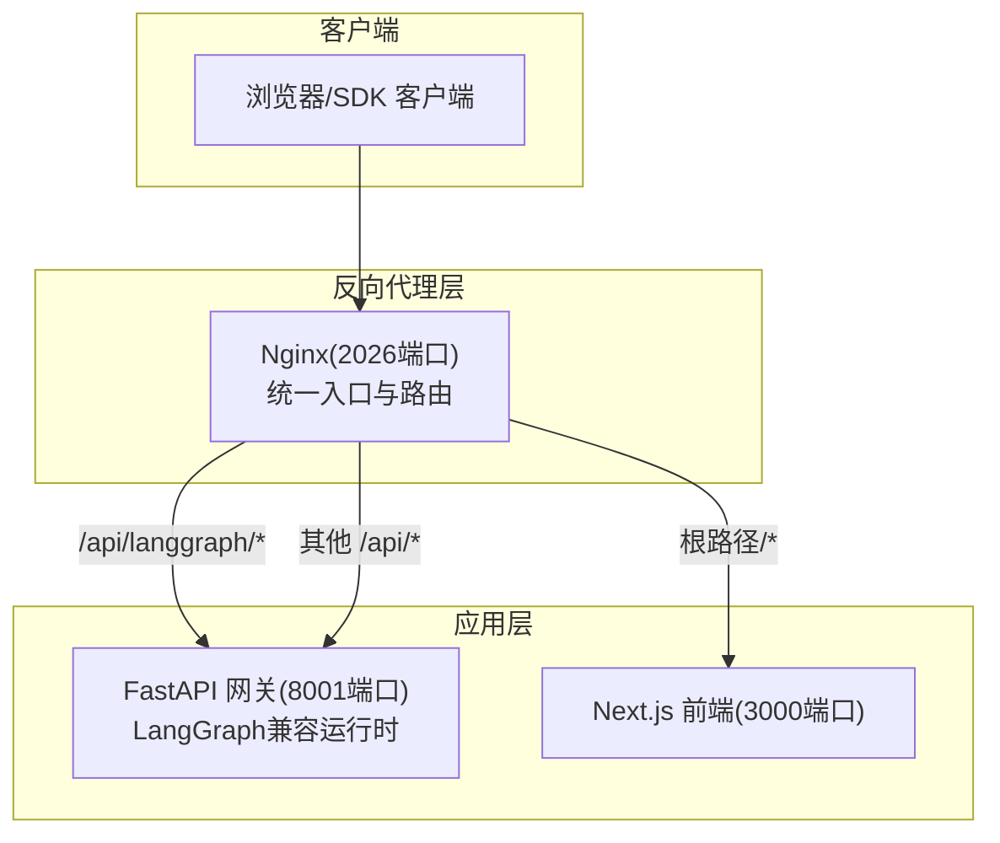

**图表来源**
- [docker/nginx/nginx.conf:20-265](file://docker/nginx/nginx.conf#L20-L265)
- [docker/docker-compose.yaml:26-163](file://docker/docker-compose.yaml#L26-L163)
- [backend/app/gateway/app.py:229-418](file://backend/app/gateway/app.py#L229-L418)

**章节来源**
- [docker/docker-compose.yaml:1-163](file://docker/docker-compose.yaml#L1-L163)
- [docker/nginx/nginx.conf:1-265](file://docker/nginx/nginx.conf#L1-L265)
- [backend/app/gateway/app.py:229-418](file://backend/app/gateway/app.py#L229-L418)

## 核心组件
- Nginx 反向代理：集中处理 CORS、SSE/长连接、路径重写与上游健康检查，作为统一入口。
- FastAPI 网关：内置 LangGraph 运行时，提供 LangGraph 平台兼容的 runs/threads API 与自定义业务 API（模型、MCP、技能、上传、工件、建议等）。
- 前端 Next.js：负责用户界面与交互，通过路由重写将 API 请求转发至网关。
- LangGraph 集成：通过 langgraph.json 暴露图与认证/检查点提供者；网关嵌入运行时以兼容 LangGraph SDK。
- 扩展注入：deerflow_extensions 提供 ads_auth、env_settings、topic_guardrail 等扩展的统一加载入口。
- 配置系统：AppConfig 支持热重载与多后端持久化（内存/SQLite/PostgreSQL），并统一数据库配置。

**章节来源**
- [backend/docs/ARCHITECTURE.md:51-485](file://backend/docs/ARCHITECTURE.md#L51-L485)
- [backend/app/gateway/app.py:322-418](file://backend/app/gateway/app.py#L322-L418)
- [backend/langgraph.json:1-18](file://backend/langgraph.json#L1-L18)
- [deerflow_extensions/boot.py:56-111](file://deerflow_extensions/boot.py#L56-L111)
- [backend/packages/harness/deerflow/config/app_config.py:85-114](file://backend/packages/harness/deerflow/config/app_config.py#L85-L114)

## 架构总览
下图展示系统边界、组件交互与数据流：

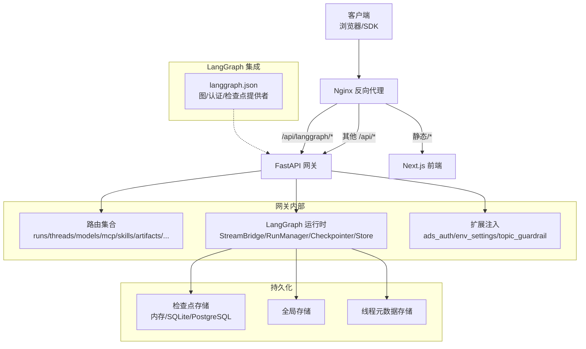

**图表来源**
- [backend/docs/ARCHITECTURE.md:51-127](file://backend/docs/ARCHITECTURE.md#L51-L127)
- [backend/app/gateway/app.py:169-227](file://backend/app/gateway/app.py#L169-L227)
- [backend/langgraph.json:8-17](file://backend/langgraph.json#L8-L17)
- [backend/packages/harness/deerflow/runtime/checkpointer/async_provider.py:167-203](file://backend/packages/harness/deerflow/runtime/checkpointer/async_provider.py#L167-L203)

**章节来源**
- [backend/docs/ARCHITECTURE.md:51-127](file://backend/docs/ARCHITECTURE.md#L51-L127)
- [backend/app/gateway/app.py:169-227](file://backend/app/gateway/app.py#L169-L227)
- [backend/langgraph.json:1-18](file://backend/langgraph.json#L1-L18)

## 详细组件分析

### Nginx 反向代理架构
- 路由规则：
  - /api/langgraph/* → 重写为 /api/* 再代理到网关（8001），保持 LangGraph SDK 兼容性。
  - /api/* 其他路径 → 直接代理到网关。
  - 根路径 /* → 代理到前端（3000）。
- 流式支持：开启 proxy_set_header X-Accel-Buffering no，确保 SSE/长连接不被缓冲。
- CORS：在 Nginx 层集中设置允许头，避免上游重复设置。
- 上游解析：使用 Docker 内部 DNS 动态解析 gateway/frontend/provisioner，避免容器重启导致的 IP 失效。

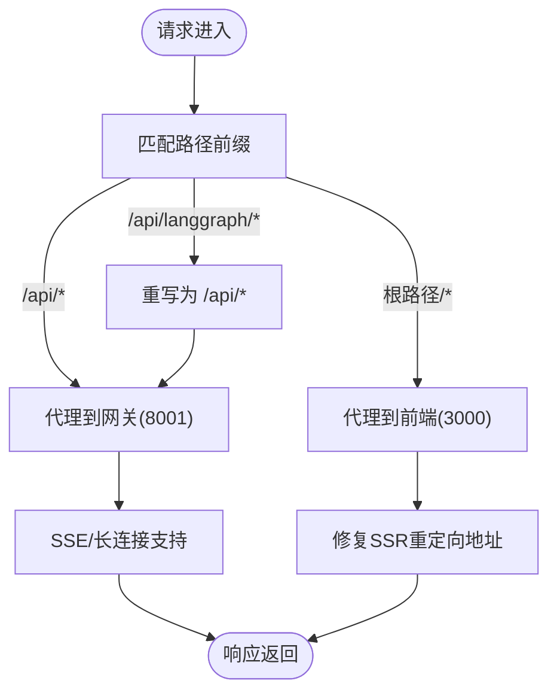

**图表来源**
- [docker/nginx/nginx.conf:61-84](file://docker/nginx/nginx.conf#L61-L84)
- [docker/nginx/nginx.conf:142-155](file://docker/nginx/nginx.conf#L142-L155)
- [docker/nginx/nginx.conf:242-263](file://docker/nginx/nginx.conf#L242-L263)

**章节来源**
- [docker/nginx/nginx.conf:20-265](file://docker/nginx/nginx.conf#L20-L265)

### Gateway API 设计
- 应用生命周期：FastAPI lifespan 中初始化 LangGraph 运行时（StreamBridge、RunManager、Checkpointer、Store、RunEventStore）、线程元数据存储与通道服务；关闭时有序清理。
- 中间件链：认证中间件、CSRF 中间件、CORS 中间件；扩展注入通过 boot_all_extensions 完成。
- 路由集合：模型、MCP、记忆、技能、工件、上传、线程清理、代理、建议、通道、助手兼容、认证、反馈、LangGraph runs、健康检查等。
- 配置热重载：AppConfig 在请求时间解析，支持 mtime 热重载；启动时的引擎（如 checkpointer、store）绑定启动快照，避免“半脑”状态。

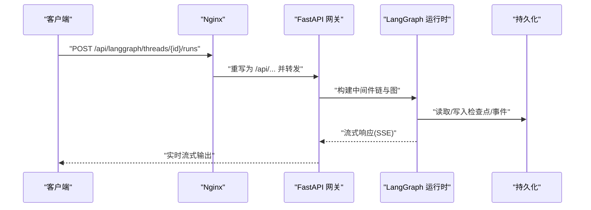

**图表来源**
- [backend/app/gateway/app.py:169-227](file://backend/app/gateway/app.py#L169-L227)
- [backend/app/gateway/deps.py:96-181](file://backend/app/gateway/deps.py#L96-L181)
- [backend/langgraph.json:8-17](file://backend/langgraph.json#L8-L17)

**章节来源**
- [backend/app/gateway/app.py:229-418](file://backend/app/gateway/app.py#L229-L418)
- [backend/app/gateway/deps.py:70-94](file://backend/app/gateway/deps.py#L70-L94)

### LangGraph 集成架构
- 图注册：langgraph.json 指定 lead_agent 图入口、认证回调与检查点提供者，便于工具链与 Studio 使用。
- 运行时嵌入：Gateway 内置 LangGraph 运行时，LangGraph SDK 客户端无需独立服务器即可调用。
- 检查点提供者：支持内存、SQLite、PostgreSQL 三种后端，通过 async_provider 提供异步上下文管理器。

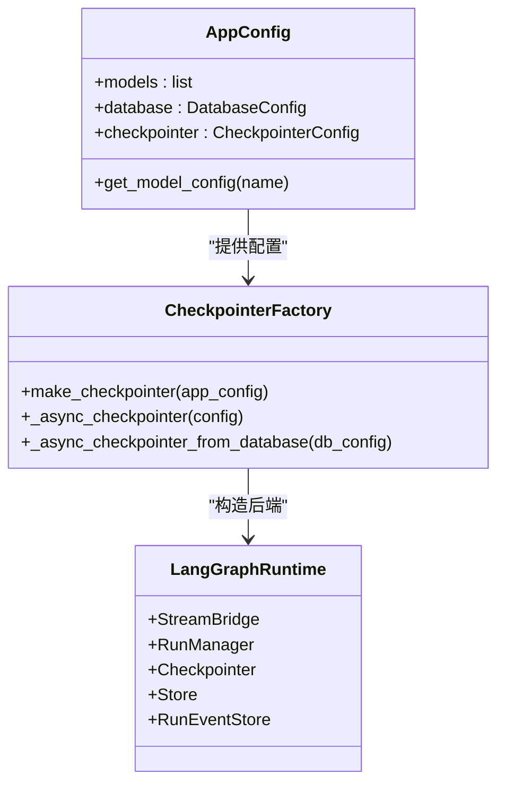

**图表来源**
- [backend/packages/harness/deerflow/config/app_config.py:85-114](file://backend/packages/harness/deerflow/config/app_config.py#L85-L114)
- [backend/packages/harness/deerflow/runtime/checkpointer/async_provider.py:167-203](file://backend/packages/harness/deerflow/runtime/checkpointer/async_provider.py#L167-L203)
- [backend/app/gateway/deps.py:121-181](file://backend/app/gateway/deps.py#L121-L181)

**章节来源**
- [backend/langgraph.json:1-18](file://backend/langgraph.json#L1-L18)
- [backend/packages/harness/deerflow/runtime/checkpointer/async_provider.py:90-124](file://backend/packages/harness/deerflow/runtime/checkpointer/async_provider.py#L90-L124)

### Agent 与中间件链
- Lead Agent 工厂：根据运行时配置动态构建中间件链，包含动态上下文、摘要、计划任务、标题生成、记忆、图像处理、循环检测、子代理限制、安全终止原因拦截、澄清请求等。
- 中间件顺序：严格控制执行顺序，确保上下文注入、摘要、计划、标题、记忆、图像、错误处理与澄清请求的正确性与一致性。

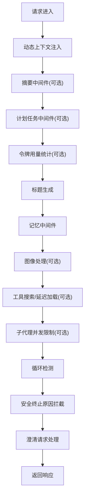

**图表来源**
- [backend/packages/harness/deerflow/agents/lead_agent/agent.py:266-353](file://backend/packages/harness/deerflow/agents/lead_agent/agent.py#L266-L353)

**章节来源**
- [backend/packages/harness/deerflow/agents/lead_agent/agent.py:378-495](file://backend/packages/harness/deerflow/agents/lead_agent/agent.py#L378-L495)

### 线程清理与数据流
- 删除对话流程：先通过 LangGraph 兼容路由删除线程状态，再由网关清理本地线程目录与检查点。
- 文件上传流程：校验与存储到线程专用目录，必要时转换为 Markdown；后续运行时通过中间件注入文件列表与虚拟路径访问。

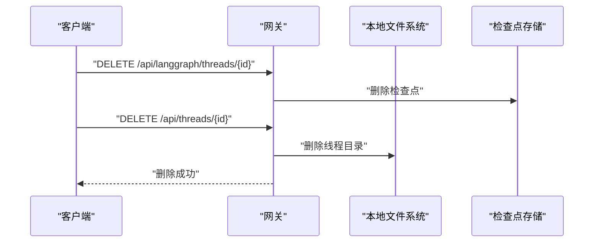

**图表来源**
- [backend/app/gateway/routers/threads.py:212-243](file://backend/app/gateway/routers/threads.py#L212-L243)

**章节来源**
- [backend/app/gateway/routers/threads.py:169-185](file://backend/app/gateway/routers/threads.py#L169-L185)

### 扩展注入与前端集成
- 扩展注入：boot_all_extensions 统一加载 ads_auth、env_settings、topic_guardrail 等扩展，具备幂等保护。
- 前端路由重写：Next.js 通过 rewrites 将 /api/langgraph 与 /api/* 重写到网关，支持通过环境变量切换后端基地址。
- 环境变量：前端 env.js 对服务端与客户端变量进行校验与暴露。

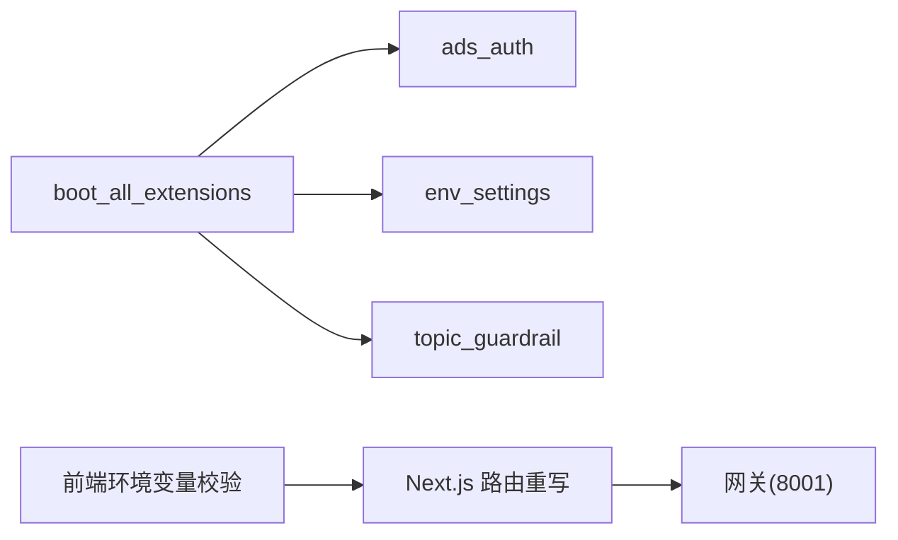

**图表来源**
- [deerflow_extensions/boot.py:56-111](file://deerflow_extensions/boot.py#L56-L111)
- [frontend/next.config.js:31-136](file://frontend/next.config.js#L31-L136)
- [frontend/src/env.js:4-50](file://frontend/src/env.js#L4-L50)

**章节来源**
- [deerflow_extensions/boot.py:56-111](file://deerflow_extensions/boot.py#L56-L111)
- [frontend/next.config.js:17-136](file://frontend/next.config.js#L17-L136)
- [frontend/src/env.js:1-51](file://frontend/src/env.js#L1-L51)

## 依赖分析
- 技术栈选择：
  - 后端：FastAPI、LangGraph、SSE-Starlette、Uvicorn、LangChain 生态（模型工厂、工具系统、中间件）。
  - 前端：Next.js、React、@langchain/langgraph-sdk、@tanstack/react-query。
  - 反向代理：Nginx。
  - 容器：Docker Compose。
- 组件耦合：
  - 网关对 LangGraph 运行时强耦合，但通过 AppConfig 与 deps 解耦配置与单例对象。
  - 前后端通过 /api/* 接口解耦，Nginx 作为统一入口。
  - 扩展通过 boot 注入，避免硬编码依赖。
- 外部依赖：
  - 数据库：内存/SQLite/PostgreSQL（通过 checkpointer 与 store）。
  - MCP：通过 extensions_config.json 配置外部 MCP 服务器。

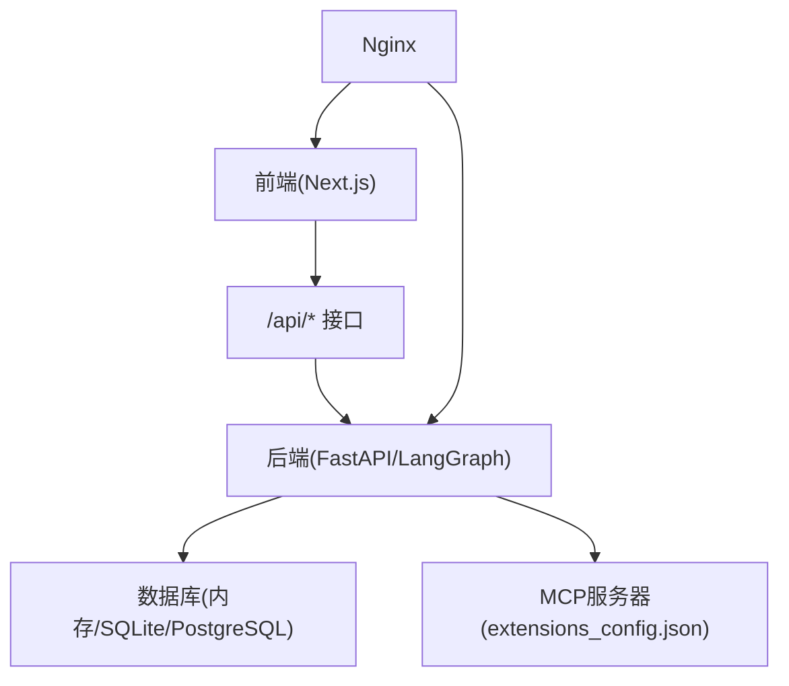

**图表来源**
- [backend/packages/harness/deerflow/runtime/checkpointer/async_provider.py:167-203](file://backend/packages/harness/deerflow/runtime/checkpointer/async_provider.py#L167-L203)
- [frontend/package.json:29-30](file://frontend/package.json#L29-L30)
- [docker/docker-compose.yaml:26-163](file://docker/docker-compose.yaml#L26-L163)

**章节来源**
- [frontend/package.json:21-92](file://frontend/package.json#L21-L92)
- [backend/packages/harness/deerflow/runtime/checkpointer/async_provider.py:167-203](file://backend/packages/harness/deerflow/runtime/checkpointer/async_provider.py#L167-L203)

## 性能考虑
- 缓存与热重载：
  - MCP 工具基于文件 mtime 缓存；配置在请求时间解析，支持 mtime 热重载。
  - 技能在启动时解析缓存；LangGraph 运行时单例绑定启动快照，避免配置漂移。
- 流式传输：
  - SSE/长连接禁用缓冲，降低首 token 延迟，提升长任务可见性。
- 上下文管理：
  - 摘要中间件在接近阈值时压缩上下文，保留近期消息，平衡成本与质量。
- 并发与限流：
  - 子代理并发限制与循环检测中间件，防止资源滥用与死循环。

**章节来源**
- [backend/docs/ARCHITECTURE.md:427-443](file://backend/docs/ARCHITECTURE.md#L427-L443)
- [backend/packages/harness/deerflow/agents/lead_agent/agent.py:327-353](file://backend/packages/harness/deerflow/agents/lead_agent/agent.py#L327-L353)

## 故障排查指南
- 配置问题：
  - AppConfig 在请求时间解析，若配置文件缺失或权限不足会返回 503；检查 DEER_FLOW_CONFIG_PATH 与文件权限。
  - extensions_config.json 更新后，MCP 管理器通过 mtime 检测变更并重建客户端。
- 线程清理失败：
  - 网关删除本地线程目录时捕获异常并返回 500；确认线程 ID 有效与目录存在。
- 运行时恢复：
  - SQLite 后端在启动时进行运行恢复与线程状态标记；若出现异常，查看运行事件存储与 RunManager 日志。
- 前端重写与代理：
  - 若 /api/* 未命中，检查 Next.js rewrites 与 DEER_FLOW_INTERNAL_GATEWAY_BASE_URL；确认 Nginx upstream 解析正常。

**章节来源**
- [backend/app/gateway/deps.py:70-94](file://backend/app/gateway/deps.py#L70-L94)
- [backend/app/gateway/routers/threads.py:169-185](file://backend/app/gateway/routers/threads.py#L169-L185)
- [backend/app/gateway/app.py:169-227](file://backend/app/gateway/app.py#L169-L227)
- [frontend/next.config.js:31-136](file://frontend/next.config.js#L31-L136)

## 结论
DeerFlow 采用“Nginx 统一入口 + FastAPI 网关 + Next.js 前端”的分层架构，结合 LangGraph 运行时实现多代理工作流编排与流式响应。通过容器化与扩展注入机制，系统具备良好的可维护性与可扩展性。配置热重载与多后端持久化进一步提升了运维弹性。建议在生产中优先使用 PostgreSQL 作为检查点后端，并启用 MCP 与扩展功能以满足企业级需求。

## 附录
- 系统上下文图（概念性）
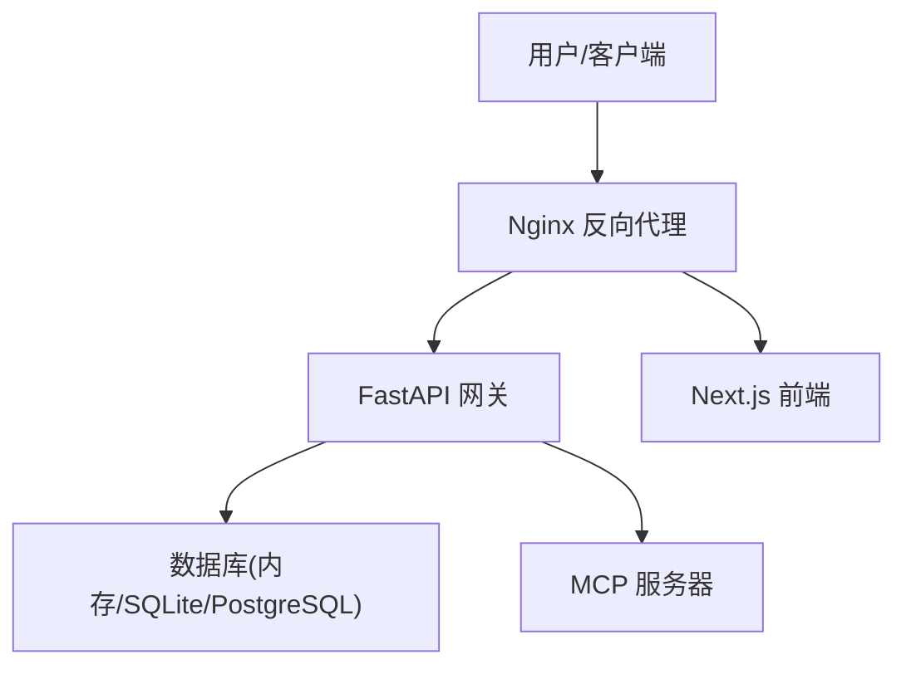

- 部署拓扑图（概念性）
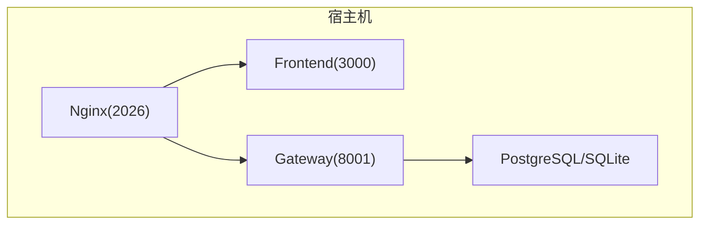