# 组件交互

<cite>
**本文引用的文件**
- [backend/packages/harness/deerflow/agents/factory.py](file://backend/packages/harness/deerflow/agents/factory.py)
- [backend/packages/harness/deerflow/runtime/__init__.py](file://backend/packages/harness/deerflow/runtime/__init__.py)
- [backend/packages/harness/deerflow/sandbox/sandbox.py](file://backend/packages/harness/deerflow/sandbox/sandbox.py)
- [backend/packages/harness/deerflow/sandbox/middleware.py](file://backend/packages/harness/deerflow/sandbox/middleware.py)
- [backend/packages/harness/deerflow/skills/__init__.py](file://backend/packages/harness/deerflow/skills/__init__.py)
- [backend/packages/harness/deerflow/tools/__init__.py](file://backend/packages/harness/deerflow/tools/__init__.py)
- [backend/packages/harness/deerflow/models/factory.py](file://backend/packages/harness/deerflow/models/factory.py)
- [backend/packages/harness/deerflow/guardrails/middleware.py](file://backend/packages/harness/deerflow/guardrails/middleware.py)
- [backend/packages/harness/deerflow/tracing/factory.py](file://backend/packages/harness/deerflow/tracing/factory.py)
- [backend/packages/harness/deerflow/persistence/engine.py](file://backend/packages/harness/deerflow/persistence/engine.py)
- [backend/packages/harness/deerflow/subagents/executor.py](file://backend/packages/harness/deerflow/subagents/executor.py)
- [backend/packages/harness/deerflow/runtime/runs/__init__.py](file://backend/packages/harness/deerflow/runtime/runs/__init__.py)
- [backend/packages/harness/deerflow/runtime/events/__init__.py](file://backend/packages/harness/deerflow/runtime/events/__init__.py)
- [backend/packages/harness/deerflow/runtime/store/__init__.py](file://backend/packages/harness/deerflow/runtime/store/__init__.py)
- [backend/packages/harness/deerflow/runtime/stream_bridge/__init__.py](file://backend/packages/harness/deerflow/runtime/stream_bridge/__init__.py)
- [backend/packages/harness/deerflow/config/app_config.py](file://backend/packages/harness/deerflow/config/app_config.py)
- [backend/packages/harness/deerflow/config/sandbox_config.py](file://backend/packages/harness/deerflow/config/sandbox_config.py)
- [backend/packages/harness/deerflow/config/skills_config.py](file://backend/packages/harness/deerflow/config/skills_config.py)
- [backend/packages/harness/deerflow/config/tool_config.py](file://backend/packages/harness/deerflow/config/tool_config.py)
- [backend/packages/harness/deerflow/config/model_config.py](file://backend/packages/harness/deerflow/config/model_config.py)
- [backend/packages/harness/deerflow/config/guardrails_config.py](file://backend/packages/harness/deerflow/config/guardrails_config.py)
- [backend/packages/harness/deerflow/config/tracing_config.py](file://backend/packages/harness/deerflow/config/tracing_config.py)
- [backend/packages/harness/deerflow/config/token_usage_config.py](file://backend/packages/harness/deerflow/config/token_usage_config.py)
- [backend/packages/harness/deerflow/config/checkpointer_config.py](file://backend/packages/harness/deerflow/config/checkpointer_config.py)
- [backend/packages/harness/deerflow/config/run_events_config.py](file://backend/packages/harness/deerflow/config/run_events_config.py)
- [backend/packages/harness/deerflow/config/stream_bridge_config.py](file://backend/packages/harness/deerflow/config/stream_bridge_config.py)
- [backend/packages/harness/deerflow/config/subagents_config.py](file://backend/packages/harness/deerflow/config/subagents_config.py)
- [backend/packages/harness/deerflow/config/memory_config.py](file://backend/packages/harness/deerflow/config/memory_config.py)
- [backend/packages/harness/deerflow/config/summarization_config.py](file://backend/packages/harness/deerflow/config/summarization_config.py)
- [backend/packages/harness/deerflow/config/title_config.py](file://backend/packages/harness/deerflow/config/title_config.py)
- [backend/packages/harness/deerflow/config/tool_output_config.py](file://backend/packages/harness/deerflow/config/tool_output_config.py)
- [backend/packages/harness/deerflow/config/tool_search_config.py](file://backend/packages/harness/deerflow/config/tool_search_config.py)
- [backend/packages/harness/deerflow/config/loop_detection_config.py](file://backend/packages/harness/deerflow/config/loop_detection_config.py)
- [backend/packages/harness/deerflow/config/safety_finish_reason_config.py](file://backend/packages/harness/deerflow/config/safety_finish_reason_config.py)
- [backend/packages/harness/deerflow/config/acp_config.py](file://backend/packages/harness/deerflow/config/acp_config.py)
- [backend/packages/harness/deerflow/config/agents_config.py](file://backend/packages/harness/deerflow/config/agents_config.py)
- [backend/packages/harness/deerflow/config/agents_api_config.py](file://backend/packages/harness/deerflow/config/agents_api_config.py)
- [backend/packages/harness/deerflow/config/database_config.py](file://backend/packages/harness/deerflow/config/database_config.py)
- [backend/packages/harness/deerflow/config/extensions_config.py](file://backend/packages/harness/deerflow/config/extensions_config.py)
- [backend/packages/harness/deerflow/config/runtime_paths.py](file://backend/packages/harness/deerflow/config/runtime_paths.py)
- [backend/packages/harness/deerflow/config/paths.py](file://backend/packages/harness/deerflow/config/paths.py)
- [backend/packages/harness/deerflow/client.py](file://backend/packages/harness/deerflow/client.py)
- [backend/app/gateway/app.py](file://backend/app/gateway/app.py)
- [backend/app/gateway/routers/agents.py](file://backend/app/gateway/routers/agents.py)
- [backend/app/gateway/routers/runs.py](file://backend/app/gateway/routers/runs.py)
- [backend/app/gateway/routers/skills.py](file://backend/app/gateway/routers/skills.py)
- [backend/app/gateway/routers/models.py](file://backend/app/gateway/routers/models.py)
- [backend/app/gateway/services.py](file://backend/app/gateway/services.py)
- [backend/app/gateway/deps.py](file://backend/app/gateway/deps.py)
- [backend/app/channels/manager.py](file://backend/app/channels/manager.py)
- [backend/app/channels/message_bus.py](file://backend/app/channels/message_bus.py)
- [backend/app/channels/service.py](file://backend/app/channels/service.py)
- [backend/app/channels/store.py](file://backend/app/channels/store.py)
- [backend/docs/ARCHITECTURE.md](file://backend/docs/ARCHITECTURE.md)
- [backend/docs/MEMORY_SETTINGS_REVIEW.md](file://backend/docs/MEMORY_SETTINGS_REVIEW.md)
- [backend/docs/MCP_SERVER.md](file://backend/docs/MCP_SERVER.md)
- [backend/docs/AUTH_DESIGN.md](file://backend/docs/AUTH_DESIGN.md)
- [backend/docs/CONFIGURATION.md](file://backend/docs/CONFIGURATION.md)
- [backend/docs/STREAMING.md](file://backend/docs/STREAMING.md)
- [backend/docs/TITLE_GENERATION_IMPLEMENTATION.md](file://backend/docs/TITLE_GENERATION_IMPLEMENTATION.md)
- [backend/docs/MEMORY_IMPROVEMENTS.md](file://backend/docs/MEMORY_IMPROVEMENTS.md)
- [backend/docs/MEMORY_IMPROVEMENTS_SUMMARY.md](file://backend/docs/MEMORY_IMPROVEMENTS_SUMMARY.md)
- [backend/docs/MEMORY_SETTINGS_REVIEW.md](file://backend/docs/MEMORY_SETTINGS_REVIEW.md)
- [backend/docs/GUARDRAILS.md](file://backend/docs/GUARDRAILS.md)
- [backend/docs/SETUP.md](file://backend/docs/SETUP.md)
- [backend/docs/API.md](file://backend/docs/API.md)
- [backend/docs/plan_mode_usage.md](file://backend/docs/plan_mode_usage.md)
- [backend/docs/rfc-create-deerflow-agent.md](file://backend/docs/rfc-create-deerflow-agent.md)
- [backend/docs/rfc-extract-shared-modules.md](file://backend/docs/rfc-extract-shared-modules.md)
- [backend/docs/rfc-grep-glob-tools.md](file://backend/docs/rfc-grep-glob-tools.md)
- [backend/docs/task_tool_improvements.md](file://backend/docs/task_tool_improvements.md)
- [deerflow_extensions/boot.py](file://deerflow_extensions/boot.py)
- [deerflow_extensions/entrypoint.sh](file://deerflow_extensions/entrypoint.sh)
- [deerflow_extensions/patch_manager.py](file://deerflow_extensions/patch_manager.py)
- [frontend/src/core/agents/index.ts](file://frontend/src/core/agents/index.ts)
- [frontend/src/core/api/agents.ts](file://frontend/src/core/api/agents.ts)
- [frontend/src/core/api/runs.ts](file://frontend/src/core/api/runs.ts)
- [frontend/src/core/api/skills.ts](file://frontend/src/core/api/skills.ts)
- [frontend/src/core/api/models.ts](file://frontend/src/core/api/models.ts)
- [frontend/src/core/mcp/index.ts](file://frontend/src/core/mcp/index.ts)
- [frontend/src/core/memory/index.ts](file://frontend/src/core/memory/index.ts)
- [frontend/src/core/settings/index.ts](file://frontend/src/core/settings/index.ts)
- [frontend/src/core/skills/index.ts](file://frontend/src/core/skills/index.ts)
- [frontend/src/core/tasks/index.ts](file://frontend/src/core/tasks/index.ts)
- [frontend/src/core/tools/index.ts](file://frontend/src/core/tools/index.ts)
- [frontend/src/core/uploads/index.ts](file://frontend/src/core/uploads/index.ts)
- [frontend/src/core/utils/index.ts](file://frontend/src/core/utils/index.ts)
</cite>

## 目录
1. [引言](#引言)
2. [项目结构](#项目结构)
3. [核心组件](#核心组件)
4. [架构总览](#架构总览)
5. [详细组件分析](#详细组件分析)
6. [依赖分析](#依赖分析)
7. [性能考虑](#性能考虑)
8. [故障排查指南](#故障排查指南)
9. [结论](#结论)
10. [附录](#附录)

## 引言
本文件面向 DeerFlow 的组件交互与集成，聚焦以下核心子系统：智能体运行时、沙箱系统、技能系统、工具系统与模型工厂。文档从系统架构、组件关系、数据流与事件通知、扩展点与插件机制、生命周期管理与资源协调等方面进行深入解析，并通过多种图示（类图、时序图、流程图）展示典型场景下的交互过程，帮助开发者与运维人员快速理解并高效扩展 DeerFlow。

## 项目结构
DeerFlow 后端采用“分层+功能域”混合组织方式：
- 核心运行时与基础设施位于 backend/packages/harness/deerflow 下，包含 agents、runtime、sandbox、skills、tools、models、guardrails、tracing、persistence、subagents 等子模块。
- 网关层在 backend/app/gateway 提供路由与服务编排，连接前端与后端核心能力。
- 扩展机制通过 deerflow_extensions 提供启动引导、入口脚本与补丁管理。
- 前端在 frontend/src/core 下按领域划分模块，统一调用后端 API。

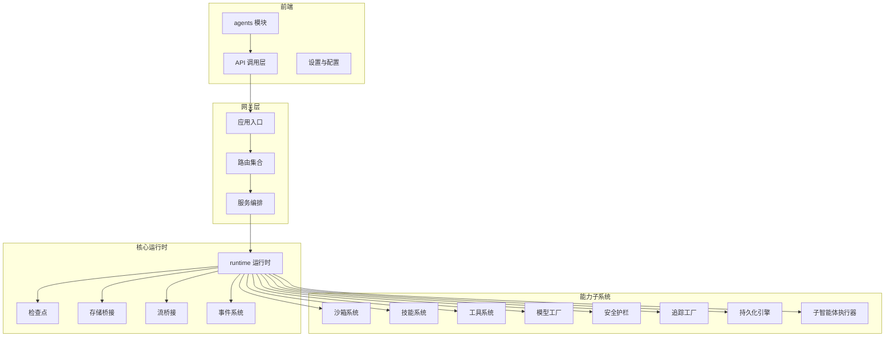

图表来源
- [backend/app/gateway/app.py](file://backend/app/gateway/app.py)
- [backend/packages/harness/deerflow/runtime/__init__.py](file://backend/packages/harness/deerflow/runtime/__init__.py)
- [backend/packages/harness/deerflow/sandbox/sandbox.py](file://backend/packages/harness/deerflow/sandbox/sandbox.py)
- [backend/packages/harness/deerflow/skills/__init__.py](file://backend/packages/harness/deerflow/skills/__init__.py)
- [backend/packages/harness/deerflow/tools/__init__.py](file://backend/packages/harness/deerflow/tools/__init__.py)
- [backend/packages/harness/deerflow/models/factory.py](file://backend/packages/harness/deerflow/models/factory.py)
- [backend/packages/harness/deerflow/guardrails/middleware.py](file://backend/packages/harness/deerflow/guardrails/middleware.py)
- [backend/packages/harness/deerflow/tracing/factory.py](file://backend/packages/harness/deerflow/tracing/factory.py)
- [backend/packages/harness/deerflow/persistence/engine.py](file://backend/packages/harness/deerflow/persistence/engine.py)
- [backend/packages/harness/deerflow/subagents/executor.py](file://backend/packages/harness/deerflow/subagents/executor.py)

章节来源
- [backend/docs/ARCHITECTURE.md](file://backend/docs/ARCHITECTURE.md)
- [backend/docs/CONFIGURATION.md](file://backend/docs/CONFIGURATION.md)

## 核心组件
- 智能体运行时（runtime）
  - 负责线程状态管理、运行生命周期、事件驱动与数据流编排；提供检查点、存储桥接、流桥接与事件系统。
- 沙箱系统（sandbox）
  - 提供隔离执行环境与安全控制，支持本地与远程后端，封装文件操作锁与安全策略。
- 技能系统（skills）
  - 管理技能安装、解析、权限与安全扫描，提供技能存储与类型定义。
- 工具系统（tools）
  - 提供内置工具集与通用工具注册、同步与类型定义，支撑技能与运行时调用。
- 模型工厂（models.factory）
  - 统一模型提供商接入与实例化，支持多厂商适配与参数配置。
- 安全护栏（guardrails.middleware）
  - 在运行时注入安全策略与合规检查中间件。
- 追踪工厂（tracing.factory）
  - 提供分布式追踪与元数据标注能力。
- 持久化引擎（persistence.engine）
  - 提供运行记录、线程元数据与用户数据的持久化抽象。
- 子智能体执行器（subagents.executor）
  - 支持子任务拆分与并发执行，配合令牌统计与限制策略。

章节来源
- [backend/packages/harness/deerflow/runtime/__init__.py](file://backend/packages/harness/deerflow/runtime/__init__.py)
- [backend/packages/harness/deerflow/sandbox/sandbox.py](file://backend/packages/harness/deerflow/sandbox/sandbox.py)
- [backend/packages/harness/deerflow/skills/__init__.py](file://backend/packages/harness/deerflow/skills/__init__.py)
- [backend/packages/harness/deerflow/tools/__init__.py](file://backend/packages/harness/deerflow/tools/__init__.py)
- [backend/packages/harness/deerflow/models/factory.py](file://backend/packages/harness/deerflow/models/factory.py)
- [backend/packages/harness/deerflow/guardrails/middleware.py](file://backend/packages/harness/deerflow/guardrails/middleware.py)
- [backend/packages/harness/deerflow/tracing/factory.py](file://backend/packages/harness/deerflow/tracing/factory.py)
- [backend/packages/harness/deerflow/persistence/engine.py](file://backend/packages/harness/deerflow/persistence/engine.py)
- [backend/packages/harness/deerflow/subagents/executor.py](file://backend/packages/harness/deerflow/subagents/executor.py)

## 架构总览
下图展示了从网关到核心运行时与各子系统的整体交互关系，以及配置与扩展点的接入位置。

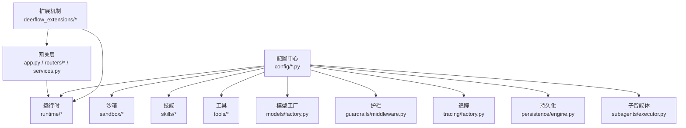

图表来源
- [backend/app/gateway/app.py](file://backend/app/gateway/app.py)
- [backend/packages/harness/deerflow/config/app_config.py](file://backend/packages/harness/deerflow/config/app_config.py)
- [deerflow_extensions/boot.py](file://deerflow_extensions/boot.py)
- [deerflow_extensions/entrypoint.sh](file://deerflow_extensions/entrypoint.sh)
- [deerflow_extensions/patch_manager.py](file://deerflow_extensions/patch_manager.py)

章节来源
- [backend/docs/ARCHITECTURE.md](file://backend/docs/ARCHITECTURE.md)
- [backend/docs/CONFIGURATION.md](file://backend/docs/CONFIGURATION.md)

## 详细组件分析

### 智能体运行时（runtime）
- 职责
  - 管理线程状态与运行生命周期，协调事件、存储与流桥接。
  - 通过检查点实现断点续跑与状态恢复。
- 关键子系统
  - runs：运行管理与状态机。
  - events：事件发布/订阅与处理流水线。
  - store：运行态数据存储桥接。
  - stream_bridge：流式输出桥接。
- 交互模式
  - 由网关触发运行请求，运行时根据配置选择模型、技能与工具，期间通过护栏与追踪进行治理与可观测性。

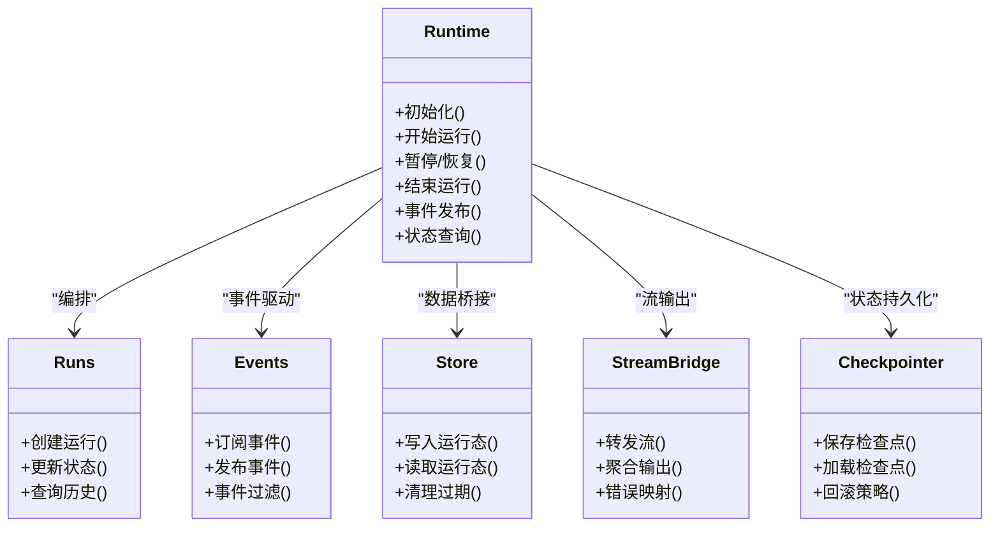

图表来源
- [backend/packages/harness/deerflow/runtime/__init__.py](file://backend/packages/harness/deerflow/runtime/__init__.py)
- [backend/packages/harness/deerflow/runtime/runs/__init__.py](file://backend/packages/harness/deerflow/runtime/runs/__init__.py)
- [backend/packages/harness/deerflow/runtime/events/__init__.py](file://backend/packages/harness/deerflow/runtime/events/__init__.py)
- [backend/packages/harness/deerflow/runtime/store/__init__.py](file://backend/packages/harness/deerflow/runtime/store/__init__.py)
- [backend/packages/harness/deerflow/runtime/stream_bridge/__init__.py](file://backend/packages/harness/deerflow/runtime/stream_bridge/__init__.py)

章节来源
- [backend/packages/harness/deerflow/runtime/__init__.py](file://backend/packages/harness/deerflow/runtime/__init__.py)
- [backend/packages/harness/deerflow/runtime/runs/__init__.py](file://backend/packages/harness/deerflow/runtime/runs/__init__.py)
- [backend/packages/harness/deerflow/runtime/events/__init__.py](file://backend/packages/harness/deerflow/runtime/events/__init__.py)
- [backend/packages/harness/deerflow/runtime/store/__init__.py](file://backend/packages/harness/deerflow/runtime/store/__init__.py)
- [backend/packages/harness/deerflow/runtime/stream_bridge/__init__.py](file://backend/packages/harness/deerflow/runtime/stream_bridge/__init__.py)

### 沙箱系统（sandbox）
- 职责
  - 提供隔离执行环境，控制文件操作与网络访问，保障运行安全。
- 关键点
  - 中间件负责拦截与审计，提供安全策略与合规检查。
  - 提供本地与远程后端抽象，支持虚拟路径与挂载策略。
- 与运行时的关系
  - 运行时在需要执行外部命令或文件操作时，通过沙箱中间件进行安全校验与执行。

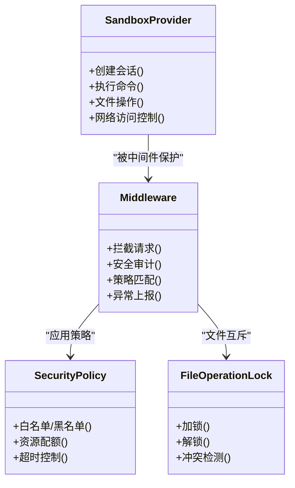

图表来源
- [backend/packages/harness/deerflow/sandbox/sandbox.py](file://backend/packages/harness/deerflow/sandbox/sandbox.py)
- [backend/packages/harness/deerflow/sandbox/middleware.py](file://backend/packages/harness/deerflow/sandbox/middleware.py)
- [backend/packages/harness/deerflow/sandbox/security.py](file://backend/packages/harness/deerflow/sandbox/security.py)
- [backend/packages/harness/deerflow/sandbox/file_operation_lock.py](file://backend/packages/harness/deerflow/sandbox/file_operation_lock.py)

章节来源
- [backend/packages/harness/deerflow/sandbox/sandbox.py](file://backend/packages/harness/deerflow/sandbox/sandbox.py)
- [backend/packages/harness/deerflow/sandbox/middleware.py](file://backend/packages/harness/deerflow/sandbox/middleware.py)
- [backend/packages/harness/deerflow/sandbox/security.py](file://backend/packages/harness/deerflow/sandbox/security.py)
- [backend/packages/harness/deerflow/sandbox/file_operation_lock.py](file://backend/packages/harness/deerflow/sandbox/file_operation_lock.py)

### 技能系统（skills）
- 职责
  - 技能安装、解析、权限与安全扫描，提供技能存储与类型定义。
- 与运行时的协作
  - 运行时在决策阶段加载技能清单，结合工具系统与模型工厂生成动作序列。

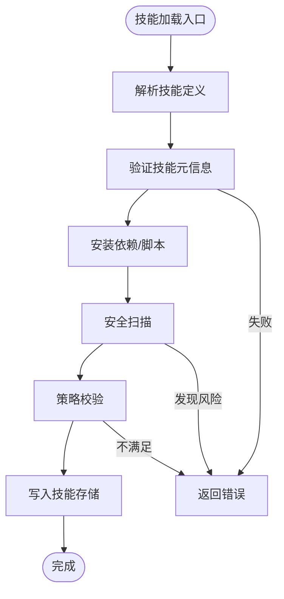

图表来源
- [backend/packages/harness/deerflow/skills/__init__.py](file://backend/packages/harness/deerflow/skills/__init__.py)
- [backend/packages/harness/deerflow/skills/parser.py](file://backend/packages/harness/deerflow/skills/parser.py)
- [backend/packages/harness/deerflow/skills/installer.py](file://backend/packages/harness/deerflow/skills/installer.py)
- [backend/packages/harness/deerflow/skills/security_scanner.py](file://backend/packages/harness/deerflow/skills/security_scanner.py)
- [backend/packages/harness/deerflow/skills/tool_policy.py](file://backend/packages/harness/deerflow/skills/tool_policy.py)

章节来源
- [backend/packages/harness/deerflow/skills/__init__.py](file://backend/packages/harness/deerflow/skills/__init__.py)
- [backend/packages/harness/deerflow/skills/parser.py](file://backend/packages/harness/deerflow/skills/parser.py)
- [backend/packages/harness/deerflow/skills/installer.py](file://backend/packages/harness/deerflow/skills/installer.py)
- [backend/packages/harness/deerflow/skills/security_scanner.py](file://backend/packages/harness/deerflow/skills/security_scanner.py)
- [backend/packages/harness/deerflow/skills/tool_policy.py](file://backend/packages/harness/deerflow/skills/tool_policy.py)

### 工具系统（tools）
- 职责
  - 提供工具注册、同步与类型定义，支撑技能与运行时调用。
- 与模型工厂的协作
  - 模型工厂在推理过程中根据工具签名与上下文动态选择可用工具。

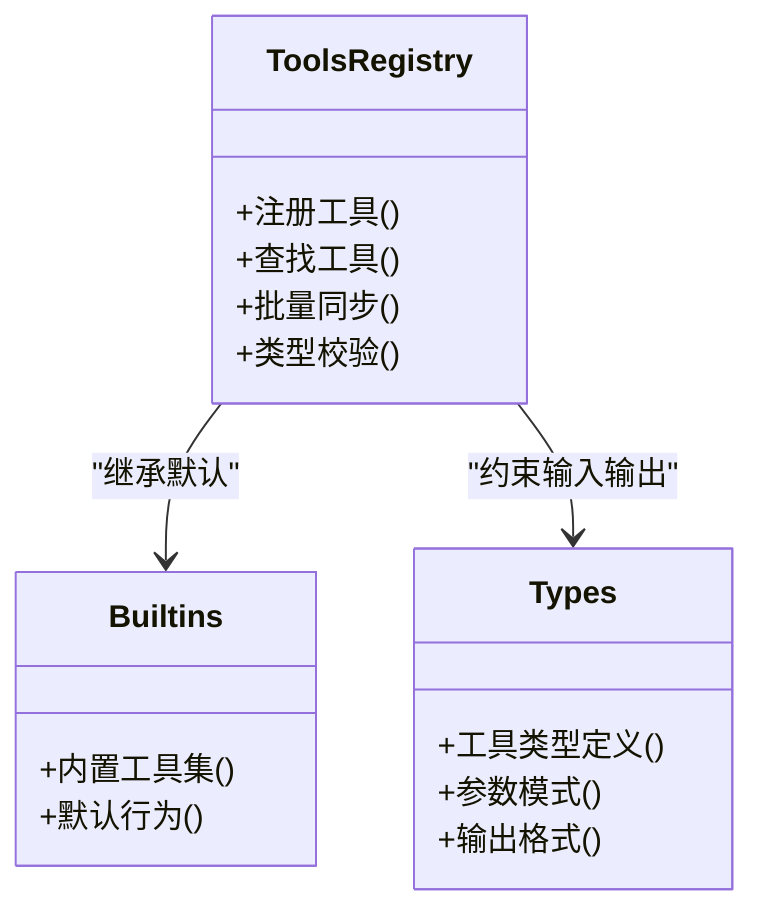

图表来源
- [backend/packages/harness/deerflow/tools/__init__.py](file://backend/packages/harness/deerflow/tools/__init__.py)
- [backend/packages/harness/deerflow/tools/tools.py](file://backend/packages/harness/deerflow/tools/tools.py)
- [backend/packages/harness/deerflow/tools/types.py](file://backend/packages/harness/deerflow/tools/types.py)
- [backend/packages/harness/deerflow/tools/builtins/](file://backend/packages/harness/deerflow/tools/builtins/)

章节来源
- [backend/packages/harness/deerflow/tools/__init__.py](file://backend/packages/harness/deerflow/tools/__init__.py)
- [backend/packages/harness/deerflow/tools/tools.py](file://backend/packages/harness/deerflow/tools/tools.py)
- [backend/packages/harness/deerflow/tools/types.py](file://backend/packages/harness/deerflow/tools/types.py)

### 模型工厂（models.factory）
- 职责
  - 统一模型提供商接入与实例化，支持多厂商适配与参数配置。
- 与运行时的协作
  - 运行时在推理阶段调用工厂获取模型实例，依据配置选择具体提供商与参数。

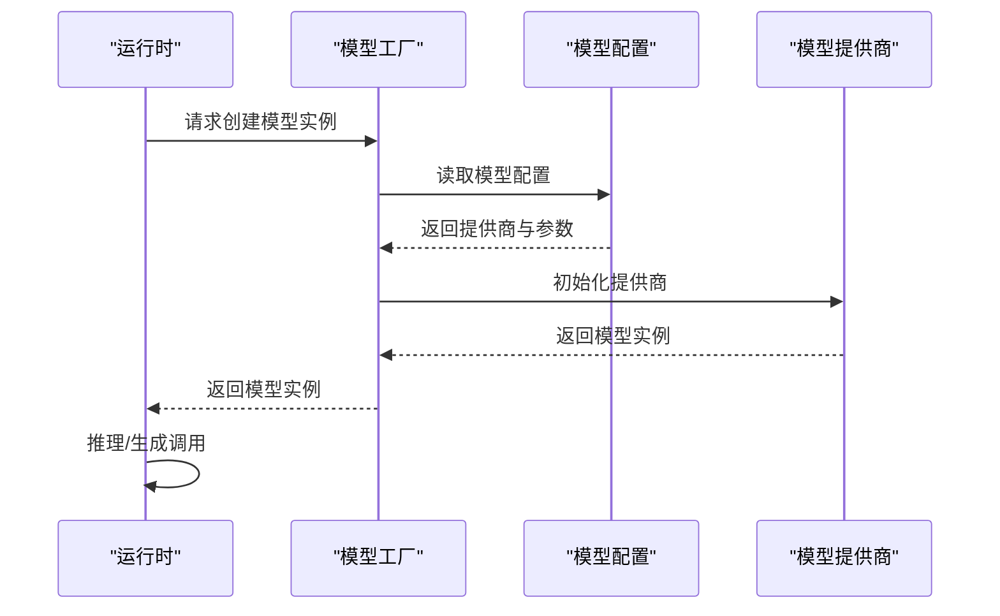

图表来源
- [backend/packages/harness/deerflow/models/factory.py](file://backend/packages/harness/deerflow/models/factory.py)
- [backend/packages/harness/deerflow/config/model_config.py](file://backend/packages/harness/deerflow/config/model_config.py)
- [backend/packages/harness/deerflow/models/claude_provider.py](file://backend/packages/harness/deerflow/models/claude_provider.py)
- [backend/packages/harness/deerflow/models/openai_codex_provider.py](file://backend/packages/harness/deerflow/models/openai_codex_provider.py)
- [backend/packages/harness/deerflow/models/vllm_provider.py](file://backend/packages/harness/deerflow/models/vllm_provider.py)

章节来源
- [backend/packages/harness/deerflow/models/factory.py](file://backend/packages/harness/deerflow/models/factory.py)
- [backend/packages/harness/deerflow/config/model_config.py](file://backend/packages/harness/deerflow/config/model_config.py)

### 安全护栏（guardrails.middleware）
- 职责
  - 在运行时注入安全策略与合规检查中间件，防止不当内容与越权行为。
- 与运行时的协作
  - 运行时在关键节点（如工具调用、输出生成）触发护栏中间件进行校验。

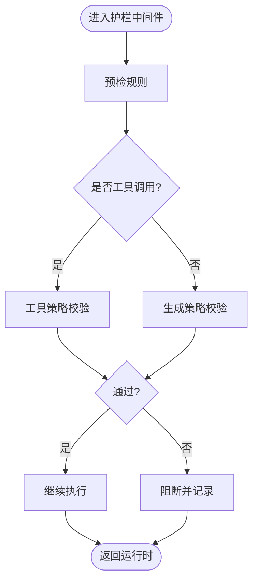

图表来源
- [backend/packages/harness/deerflow/guardrails/middleware.py](file://backend/packages/harness/deerflow/guardrails/middleware.py)
- [backend/packages/harness/deerflow/guardrails/provider.py](file://backend/packages/harness/deerflow/guardrails/provider.py)
- [backend/packages/harness/deerflow/guardrails/builtin.py](file://backend/packages/harness/deerflow/guardrails/builtin.py)

章节来源
- [backend/packages/harness/deerflow/guardrails/middleware.py](file://backend/packages/harness/deerflow/guardrails/middleware.py)
- [backend/packages/harness/deerflow/guardrails/provider.py](file://backend/packages/harness/deerflow/guardrails/provider.py)
- [backend/packages/harness/deerflow/guardrails/builtin.py](file://backend/packages/harness/deerflow/guardrails/builtin.py)

### 追踪工厂（tracing.factory）
- 职责
  - 提供分布式追踪与元数据标注能力，贯穿运行时与各子系统。
- 与运行时的协作
  - 运行时在事件与流桥接处打点，追踪工厂统一收集与上报。

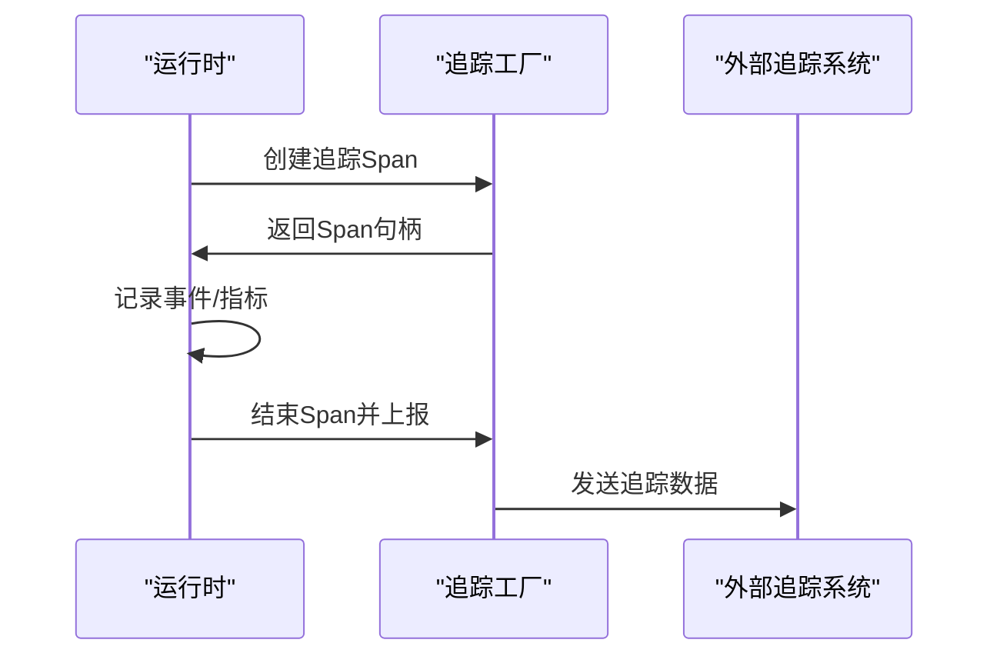

图表来源
- [backend/packages/harness/deerflow/tracing/factory.py](file://backend/packages/harness/deerflow/tracing/factory.py)
- [backend/packages/harness/deerflow/config/tracing_config.py](file://backend/packages/harness/deerflow/config/tracing_config.py)

章节来源
- [backend/packages/harness/deerflow/tracing/factory.py](file://backend/packages/harness/deerflow/tracing/factory.py)
- [backend/packages/harness/deerflow/config/tracing_config.py](file://backend/packages/harness/deerflow/config/tracing_config.py)

### 持久化引擎（persistence.engine）
- 职责
  - 提供运行记录、线程元数据与用户数据的持久化抽象，支持迁移与兼容。
- 与运行时的协作
  - 运行时在事件与检查点处写入持久化引擎，确保可恢复与审计。

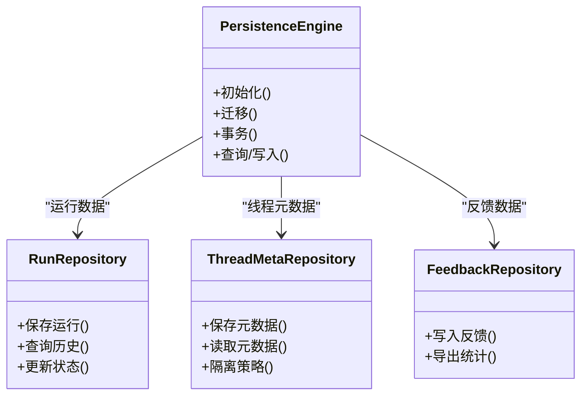

图表来源
- [backend/packages/harness/deerflow/persistence/engine.py](file://backend/packages/harness/deerflow/persistence/engine.py)
- [backend/packages/harness/deerflow/persistence/run/](file://backend/packages/harness/deerflow/persistence/run/)
- [backend/packages/harness/deerflow/persistence/thread_meta/](file://backend/packages/harness/deerflow/persistence/thread_meta/)
- [backend/packages/harness/deerflow/persistence/feedback/](file://backend/packages/harness/deerflow/persistence/feedback/)

章节来源
- [backend/packages/harness/deerflow/persistence/engine.py](file://backend/packages/harness/deerflow/persistence/engine.py)

### 子智能体执行器（subagents.executor）
- 职责
  - 支持子任务拆分与并发执行，配合令牌统计与限制策略。
- 与运行时的协作
  - 运行时在复杂任务中调度子智能体，汇总结果并回传主流程。

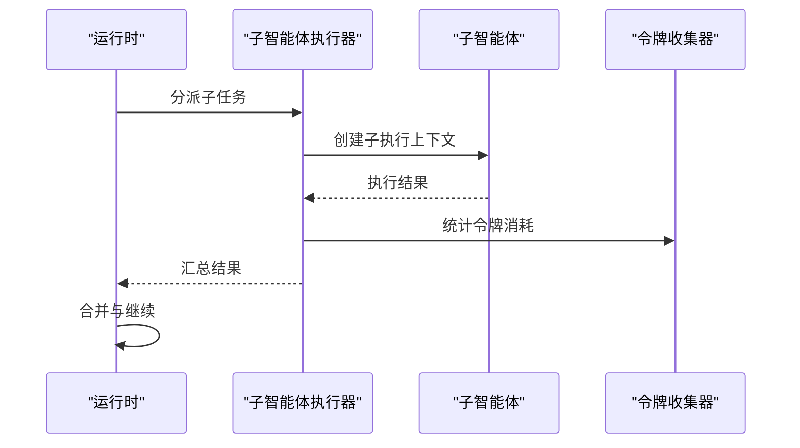

图表来源
- [backend/packages/harness/deerflow/subagents/executor.py](file://backend/packages/harness/deerflow/subagents/executor.py)
- [backend/packages/harness/deerflow/config/subagents_config.py](file://backend/packages/harness/deerflow/config/subagents_config.py)
- [backend/packages/harness/deerflow/subagents/token_collector.py](file://backend/packages/harness/deerflow/subagents/token_collector.py)

章节来源
- [backend/packages/harness/deerflow/subagents/executor.py](file://backend/packages/harness/deerflow/subagents/executor.py)
- [backend/packages/harness/deerflow/config/subagents_config.py](file://backend/packages/harness/deerflow/config/subagents_config.py)
- [backend/packages/harness/deerflow/subagents/token_collector.py](file://backend/packages/harness/deerflow/subagents/token_collector.py)

## 依赖分析
- 组件耦合与内聚
  - 运行时作为中枢，高内聚地协调各子系统；子系统之间通过明确接口（配置、事件、存储）交互，降低直接耦合。
- 外部依赖与集成点
  - 网关层提供统一入口与路由编排；前端通过 API 层对接后端；MCP 与扩展机制提供外部集成与插件扩展。
- 循环依赖
  - 未见直接循环依赖；运行时对子系统的依赖方向单一，从上至下。

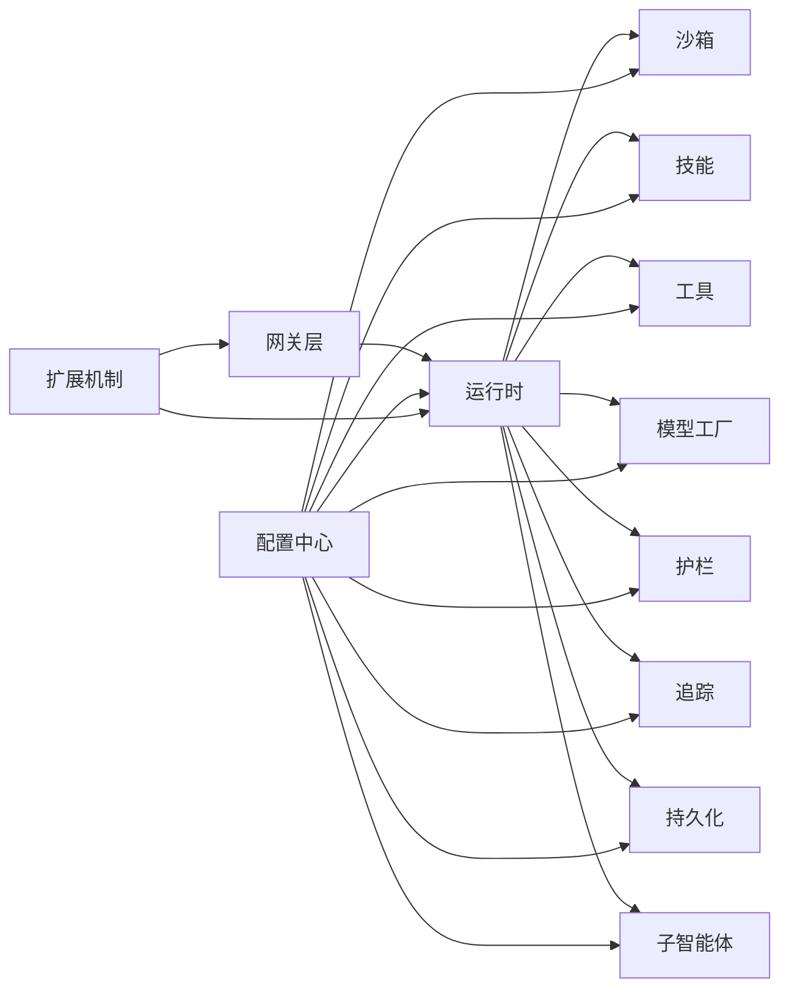

图表来源
- [backend/app/gateway/app.py](file://backend/app/gateway/app.py)
- [backend/packages/harness/deerflow/config/app_config.py](file://backend/packages/harness/deerflow/config/app_config.py)
- [deerflow_extensions/boot.py](file://deerflow_extensions/boot.py)

章节来源
- [backend/app/gateway/app.py](file://backend/app/gateway/app.py)
- [backend/packages/harness/deerflow/config/app_config.py](file://backend/packages/harness/deerflow/config/app_config.py)
- [deerflow_extensions/boot.py](file://deerflow_extensions/boot.py)

## 性能考虑
- 并发与限流
  - 子智能体执行器与工具系统应配合令牌统计与限流策略，避免资源争用。
- I/O 与缓存
  - 运行时的事件与存储应采用异步与批处理策略，减少阻塞；工具与模型调用可引入缓存与预热。
- 可观测性
  - 追踪工厂与护栏中间件应覆盖关键路径，便于定位性能瓶颈与异常。

## 故障排查指南
- 沙箱相关
  - 检查沙箱中间件日志与安全策略配置，确认文件操作锁与网络访问控制是否触发。
- 技能与工具
  - 核对技能解析与安装日志，关注安全扫描与策略校验结果；工具类型定义与参数模式需严格匹配。
- 模型工厂
  - 核对模型配置与提供商初始化日志，确认凭证与参数正确性。
- 运行时事件
  - 使用事件系统与持久化引擎回溯运行轨迹，定位异常发生点。
- 追踪与护栏
  - 通过追踪工厂查看跨组件调用链，结合护栏中间件的阻断记录进行问题复盘。

章节来源
- [backend/packages/harness/deerflow/sandbox/middleware.py](file://backend/packages/harness/deerflow/sandbox/middleware.py)
- [backend/packages/harness/deerflow/skills/security_scanner.py](file://backend/packages/harness/deerflow/skills/security_scanner.py)
- [backend/packages/harness/deerflow/tools/types.py](file://backend/packages/harness/deerflow/tools/types.py)
- [backend/packages/harness/deerflow/models/factory.py](file://backend/packages/harness/deerflow/models/factory.py)
- [backend/packages/harness/deerflow/runtime/events/__init__.py](file://backend/packages/harness/deerflow/runtime/events/__init__.py)
- [backend/packages/harness/deerflow/tracing/factory.py](file://backend/packages/harness/deerflow/tracing/factory.py)
- [backend/packages/harness/deerflow/guardrails/middleware.py](file://backend/packages/harness/deerflow/guardrails/middleware.py)

## 结论
DeerFlow 通过“运行时中枢 + 子系统解耦”的架构实现了智能体执行的可扩展与可治理。沙箱、技能、工具、模型工厂、护栏、追踪与持久化等子系统围绕运行时协同工作，形成完整的执行闭环。配置中心与扩展机制进一步增强了系统的灵活性与可集成性。建议在实际部署中重点关注并发控制、可观测性与安全策略的落地执行。

## 附录
- 典型场景交互流程（以“技能触发工具调用并生成结果”为例）

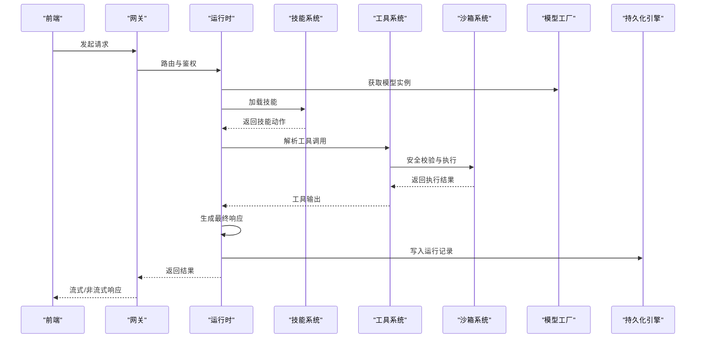

图表来源
- [backend/app/gateway/routers/agents.py](file://backend/app/gateway/routers/agents.py)
- [backend/packages/harness/deerflow/runtime/__init__.py](file://backend/packages/harness/deerflow/runtime/__init__.py)
- [backend/packages/harness/deerflow/skills/__init__.py](file://backend/packages/harness/deerflow/skills/__init__.py)
- [backend/packages/harness/deerflow/tools/__init__.py](file://backend/packages/harness/deerflow/tools/__init__.py)
- [backend/packages/harness/deerflow/sandbox/sandbox.py](file://backend/packages/harness/deerflow/sandbox/sandbox.py)
- [backend/packages/harness/deerflow/models/factory.py](file://backend/packages/harness/deerflow/models/factory.py)
- [backend/packages/harness/deerflow/persistence/engine.py](file://backend/packages/harness/deerflow/persistence/engine.py)

- 配置与扩展点参考
  - 应用与运行时路径配置：[backend/packages/harness/deerflow/config/app_config.py](file://backend/packages/harness/deerflow/config/app_config.py)、[backend/packages/harness/deerflow/config/runtime_paths.py](file://backend/packages/harness/deerflow/config/runtime_paths.py)
  - 沙箱配置：[backend/packages/harness/deerflow/config/sandbox_config.py](file://backend/packages/harness/deerflow/config/sandbox_config.py)
  - 技能配置：[backend/packages/harness/deerflow/config/skills_config.py](file://backend/packages/harness/deerflow/config/skills_config.py)
  - 工具配置：[backend/packages/harness/deerflow/config/tool_config.py](file://backend/packages/harness/deerflow/config/tool_config.py)
  - 模型配置：[backend/packages/harness/deerflow/config/model_config.py](file://backend/packages/harness/deerflow/config/model_config.py)
  - 护栏配置：[backend/packages/harness/deerflow/config/guardrails_config.py](file://backend/packages/harness/deerflow/config/guardrails_config.py)
  - 追踪配置：[backend/packages/harness/deerflow/config/tracing_config.py](file://backend/packages/harness/deerflow/config/tracing_config.py)
  - 令牌用量配置：[backend/packages/harness/deerflow/config/token_usage_config.py](file://backend/packages/harness/deerflow/config/token_usage_config.py)
  - 检查点配置：[backend/packages/harness/deerflow/config/checkpointer_config.py](file://backend/packages/harness/deerflow/config/checkpointer_config.py)
  - 运行事件配置：[backend/packages/harness/deerflow/config/run_events_config.py](file://backend/packages/harness/deerflow/config/run_events_config.py)
  - 流桥接配置：[backend/packages/harness/deerflow/config/stream_bridge_config.py](file://backend/packages/harness/deerflow/config/stream_bridge_config.py)
  - 子智能体配置：[backend/packages/harness/deerflow/config/subagents_config.py](file://backend/packages/harness/deerflow/config/subagents_config.py)
  - 内存配置：[backend/packages/harness/deerflow/config/memory_config.py](file://backend/packages/harness/deerflow/config/memory_config.py)
  - 摘要与标题配置：[backend/packages/harness/deerflow/config/summarization_config.py](file://backend/packages/harness/deerflow/config/summarization_config.py)、[backend/packages/harness/deerflow/config/title_config.py](file://backend/packages/harness/deerflow/config/title_config.py)
  - 工具输出与检索配置：[backend/packages/harness/deerflow/config/tool_output_config.py](file://backend/packages/harness/deerflow/config/tool_output_config.py)、[backend/packages/harness/deerflow/config/tool_search_config.py](file://backend/packages/harness/deerflow/config/tool_search_config.py)
  - 循环检测与安全终止配置：[backend/packages/harness/deerflow/config/loop_detection_config.py](file://backend/packages/harness/deerflow/config/loop_detection_config.py)、[backend/packages/harness/deerflow/config/safety_finish_reason_config.py](file://backend/packages/harness/deerflow/config/safety_finish_reason_config.py)
  - ACP 与代理配置：[backend/packages/harness/deerflow/config/acp_config.py](file://backend/packages/harness/deerflow/config/acp_config.py)、[backend/packages/harness/deerflow/config/agents_config.py](file://backend/packages/harness/deerflow/config/agents_config.py)、[backend/packages/harness/deerflow/config/agents_api_config.py](file://backend/packages/harness/deerflow/config/agents_api_config.py)
  - 数据库与扩展配置：[backend/packages/harness/deerflow/config/database_config.py](file://backend/packages/harness/deerflow/config/database_config.py)、[backend/packages/harness/deerflow/config/extensions_config.py](file://backend/packages/harness/deerflow/config/extensions_config.py)
  - 路径与运行时路径：[backend/packages/harness/deerflow/config/paths.py](file://backend/packages/harness/deerflow/config/paths.py)

- 文档与指南
  - 架构与配置：[backend/docs/ARCHITECTURE.md](file://backend/docs/ARCHITECTURE.md)、[backend/docs/CONFIGURATION.md](file://backend/docs/CONFIGURATION.md)
  - 安全护栏：[backend/docs/GUARDRAILS.md](file://backend/docs/GUARDRAILS.md)
  - 流式输出：[backend/docs/STREAMING.md](file://backend/docs/STREAMING.md)
  - 标题生成实现：[backend/docs/TITLE_GENERATION_IMPLEMENTATION.md](file://backend/docs/TITLE_GENERATION_IMPLEMENTATION.md)
  - MCP 服务器：[backend/docs/MCP_SERVER.md](file://backend/docs/MCP_SERVER.md)
  - 计划模式使用：[backend/docs/plan_mode_usage.md](file://backend/docs/plan_mode_usage.md)
  - RFC 与改进文档：[backend/docs/rfc-create-deerflow-agent.md](file://backend/docs/rfc-create-deerflow-agent.md)、[backend/docs/rfc-extract-shared-modules.md](file://backend/docs/rfc-extract-shared-modules.md)、[backend/docs/rfc-grep-glob-tools.md](file://backend/docs/rfc-grep-glob-tools.md)、[backend/docs/task_tool_improvements.md](file://backend/docs/task_tool_improvements.md)

- 前端集成参考
  - 代理、API、设置、技能、工具、上传与通用工具模块：[frontend/src/core/agents/index.ts](file://frontend/src/core/agents/index.ts)、[frontend/src/core/api/agents.ts](file://frontend/src/core/api/agents.ts)、[frontend/src/core/api/runs.ts](file://frontend/src/core/api/runs.ts)、[frontend/src/core/api/skills.ts](file://frontend/src/core/api/skills.ts)、[frontend/src/core/api/models.ts](file://frontend/src/core/api/models.ts)、[frontend/src/core/mcp/index.ts](file://frontend/src/core/mcp/index.ts)、[frontend/src/core/memory/index.ts](file://frontend/src/core/memory/index.ts)、[frontend/src/core/settings/index.ts](file://frontend/src/core/settings/index.ts)、[frontend/src/core/skills/index.ts](file://frontend/src/core/skills/index.ts)、[frontend/src/core/tasks/index.ts](file://frontend/src/core/tasks/index.ts)、[frontend/src/core/tools/index.ts](file://frontend/src/core/tools/index.ts)、[frontend/src/core/uploads/index.ts](file://frontend/src/core/uploads/index.ts)、[frontend/src/core/utils/index.ts](file://frontend/src/core/utils/index.ts)