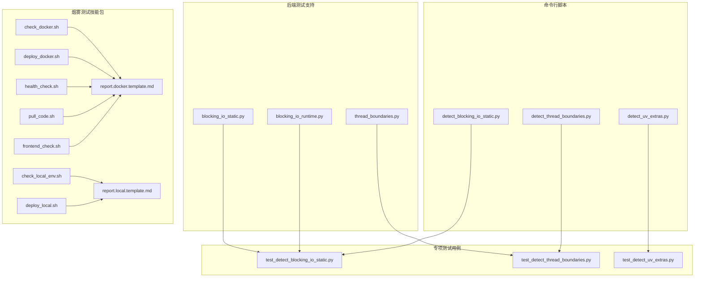
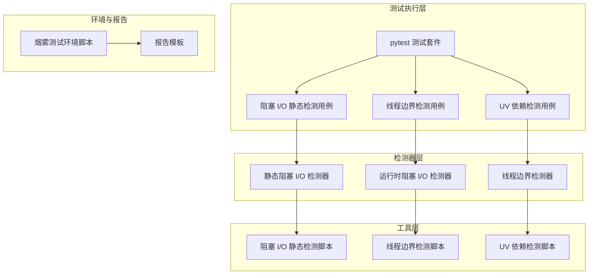
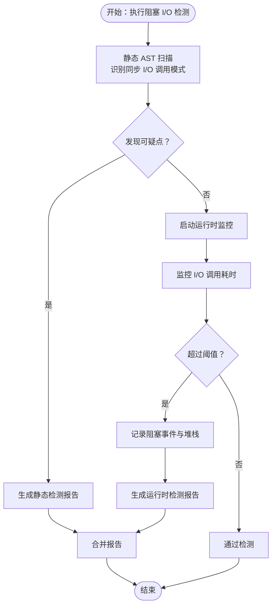
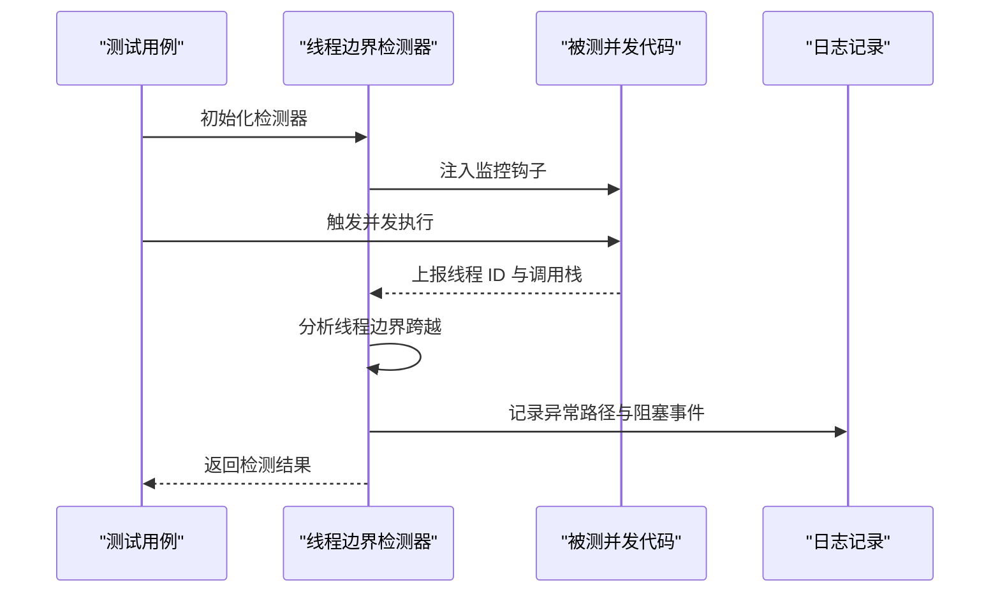
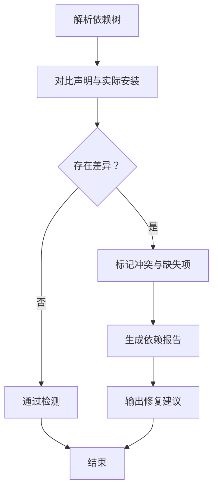
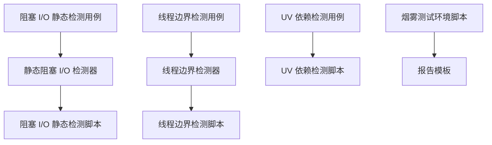

# 专项测试

<cite>
**本文引用的文件**
- [blocking_io_static.py](file://backend/tests/support/detectors/blocking_io_static.py)
- [blocking_io_runtime.py](file://backend/tests/support/detectors/blocking_io_runtime.py)
- [thread_boundaries.py](file://backend/tests/support/detectors/thread_boundaries.py)
- [test_detect_blocking_io_static.py](file://backend/tests/test_detect_blocking_io_static.py)
- [test_detect_thread_boundaries.py](file://backend/tests/test_detect_thread_boundaries.py)
- [test_detect_uv_extras.py](file://backend/tests/test_detect_uv_extras.py)
- [detect_blocking_io_static.py](file://scripts/detect_blocking_io_static.py)
- [detect_thread_boundaries.py](file://scripts/detect_thread_boundaries.py)
- [detect_uv_extras.py](file://scripts/detect_uv_extras.py)
- [BLOCKING_IO_DETECTION.md](file://backend/docs/BLOCKING_IO_DETECTION.md)
- [SKILL.md](file://.agent/skills/smoke-test/SKILL.md)
- [report.docker.template.md](file://.agent/skills/smoke-test/templates/report.docker.template.md)
- [report.local.template.md](file://.agent/skills/smoke-test/templates/report.local.template.md)
- [check_docker.sh](file://.agent/skills/smoke-test/scripts/check_docker.sh)
- [deploy_docker.sh](file://.agent/skills/smoke-test/scripts/deploy_docker.sh)
- [health_check.sh](file://.agent/skills/smoke-test/scripts/health_check.sh)
- [pull_code.sh](file://.agent/skills/smoke-test/scripts/pull_code.sh)
- [frontend_check.sh](file://.agent/skills/smoke-test/scripts/frontend_check.sh)
- [check_local_env.sh](file://.agent/skills/smoke-test/scripts/check_local_env.sh)
- [deploy_local.sh](file://.agent/skills/smoke-test/scripts/deploy_local.sh)
</cite>

## 目录
1. [引言](#引言)
2. [项目结构](#项目结构)
3. [核心组件](#核心组件)
4. [架构概览](#架构概览)
5. [详细组件分析](#详细组件分析)
6. [依赖关系分析](#依赖关系分析)
7. [性能考量](#性能考量)
8. [故障排除指南](#故障排除指南)
9. [结论](#结论)
10. [附录](#附录)

## 引言
本文档面向 DeerFlow 的专项测试需求，系统性介绍三类关键测试场景：阻塞 I/O 检测、线程边界检测和 UV 包额外依赖检测。文档涵盖检测工具的原理、使用方法、配置流程、执行步骤与结果分析，并提供可操作的测试脚本示例与问题诊断技巧，帮助开发者快速定位并解决系统中的性能瓶颈与并发问题。

## 项目结构
专项测试相关代码主要分布在以下位置：
- 后端测试支持模块：位于 backend/tests/support/detectors，包含静态阻塞 I/O 检测器、运行时阻塞 I/O 检测器与线程边界检测器
- 后端专项测试用例：位于 backend/tests，包含针对上述检测器的 pytest 测试
- 命令行检测脚本：位于 scripts/，提供独立于测试框架的检测工具
- 烟雾测试技能包：位于 .agent/skills/smoke-test，包含环境检查与部署脚本模板
- 文档说明：位于 backend/docs，包含阻塞 I/O 检测的专门文档

**图表来源**
- [blocking_io_static.py](file://backend/tests/support/detectors/blocking_io_static.py)
- [blocking_io_runtime.py](file://backend/tests/support/detectors/blocking_io_runtime.py)
- [thread_boundaries.py](file://backend/tests/support/detectors/thread_boundaries.py)
- [test_detect_blocking_io_static.py](file://backend/tests/test_detect_blocking_io_static.py)
- [test_detect_thread_boundaries.py](file://backend/tests/test_detect_thread_boundaries.py)
- [test_detect_uv_extras.py](file://backend/tests/test_detect_uv_extras.py)
- [detect_blocking_io_static.py](file://scripts/detect_blocking_io_static.py)
- [detect_thread_boundaries.py](file://scripts/detect_thread_boundaries.py)
- [detect_uv_extras.py](file://scripts/detect_uv_extras.py)
- [check_docker.sh](file://.agent/skills/smoke-test/scripts/check_docker.sh)
- [deploy_docker.sh](file://.agent/skills/smoke-test/scripts/deploy_docker.sh)
- [health_check.sh](file://.agent/skills/smoke-test/scripts/health_check.sh)
- [pull_code.sh](file://.agent/skills/smoke-test/scripts/pull_code.sh)
- [frontend_check.sh](file://.agent/skills/smoke-test/scripts/frontend_check.sh)
- [check_local_env.sh](file://.agent/skills/smoke-test/scripts/check_local_env.sh)
- [deploy_local.sh](file://.agent/skills/smoke-test/scripts/deploy_local.sh)
- [report.docker.template.md](file://.agent/skills/smoke-test/templates/report.docker.template.md)
- [report.local.template.md](file://.agent/skills/smoke-test/templates/report.local.template.md)

**章节来源**
- [blocking_io_static.py](file://backend/tests/support/detectors/blocking_io_static.py)
- [blocking_io_runtime.py](file://backend/tests/support/detectors/blocking_io_runtime.py)
- [thread_boundaries.py](file://backend/tests/support/detectors/thread_boundaries.py)
- [test_detect_blocking_io_static.py](file://backend/tests/test_detect_blocking_io_static.py)
- [test_detect_thread_boundaries.py](file://backend/tests/test_detect_thread_boundaries.py)
- [test_detect_uv_extras.py](file://backend/tests/test_detect_uv_extras.py)
- [detect_blocking_io_static.py](file://scripts/detect_blocking_io_static.py)
- [detect_thread_boundaries.py](file://scripts/detect_thread_boundaries.py)
- [detect_uv_extras.py](file://scripts/detect_uv_extras.py)
- [BLOCKING_IO_DETECTION.md](file://backend/docs/BLOCKING_IO_DETECTION.md)
- [SKILL.md](file://.agent/skills/smoke-test/SKILL.md)
- [report.docker.template.md](file://.agent/skills/smoke-test/templates/report.docker.template.md)
- [report.local.template.md](file://.agent/skills/smoke-test/templates/report.local.template.md)

## 核心组件
本节概述三类专项测试的核心组件与职责：
- 静态阻塞 I/O 检测器：通过 AST 分析源码，识别可能造成阻塞的同步调用模式
- 运行时阻塞 I/O 检测器：在测试执行期间监控 I/O 调用的耗时与阻塞行为
- 线程边界检测器：验证并发代码是否正确地跨越线程边界，避免死锁与竞态条件
- UV 包额外依赖检测器：扫描项目依赖树，识别未声明或冲突的 UV 包额外依赖

**章节来源**
- [blocking_io_static.py](file://backend/tests/support/detectors/blocking_io_static.py)
- [blocking_io_runtime.py](file://backend/tests/support/detectors/blocking_io_runtime.py)
- [thread_boundaries.py](file://backend/tests/support/detectors/thread_boundaries.py)
- [test_detect_blocking_io_static.py](file://backend/tests/test_detect_blocking_io_static.py)
- [test_detect_thread_boundaries.py](file://backend/tests/test_detect_thread_boundaries.py)
- [test_detect_uv_extras.py](file://backend/tests/test_detect_uv_extras.py)

## 架构概览
下图展示了专项测试的整体架构：测试用例驱动支持检测器，检测器通过命令行脚本或直接调用实现检测逻辑；烟雾测试技能包提供环境准备与健康检查模板。

**图表来源**
- [test_detect_blocking_io_static.py](file://backend/tests/test_detect_blocking_io_static.py)
- [test_detect_thread_boundaries.py](file://backend/tests/test_detect_thread_boundaries.py)
- [test_detect_uv_extras.py](file://backend/tests/test_detect_uv_extras.py)
- [blocking_io_static.py](file://backend/tests/support/detectors/blocking_io_static.py)
- [blocking_io_runtime.py](file://backend/tests/support/detectors/blocking_io_runtime.py)
- [thread_boundaries.py](file://backend/tests/support/detectors/thread_boundaries.py)
- [detect_blocking_io_static.py](file://scripts/detect_blocking_io_static.py)
- [detect_thread_boundaries.py](file://scripts/detect_thread_boundaries.py)
- [detect_uv_extras.py](file://scripts/detect_uv_extras.py)
- [check_docker.sh](file://.agent/skills/smoke-test/scripts/check_docker.sh)
- [deploy_docker.sh](file://.agent/skills/smoke-test/scripts/deploy_docker.sh)
- [health_check.sh](file://.agent/skills/smoke-test/scripts/health_check.sh)
- [report.docker.template.md](file://.agent/skills/smoke-test/templates/report.docker.template.md)

## 详细组件分析

### 阻塞 I/O 检测
阻塞 I/O 检测分为静态分析与运行时检测两个维度，分别用于不同阶段的问题发现。

- 静态分析（AST 扫描）
  - 目标：在不执行代码的前提下，识别可能造成阻塞的同步调用点
  - 实现要点：遍历 AST 节点，匹配特定函数调用模式与 I/O 相关 API
  - 输出：检测到的可疑节点列表及上下文信息
  - 参考文档：阻塞 I/O 检测专门文档

- 运行时检测（测试期间监控）
  - 目标：在真实测试执行中测量 I/O 调用耗时，识别潜在阻塞
  - 实现要点：包装 I/O 调用或使用计时器记录耗时，设定阈值触发告警
  - 输出：耗时统计、阻塞事件日志与堆栈信息

- 使用建议
  - 在 CI 中先执行静态分析，再执行运行时检测，确保覆盖全面
  - 将检测结果纳入质量门禁，阻止高风险变更进入主干

**图表来源**
- [blocking_io_static.py](file://backend/tests/support/detectors/blocking_io_static.py)
- [blocking_io_runtime.py](file://backend/tests/support/detectors/blocking_io_runtime.py)
- [test_detect_blocking_io_static.py](file://backend/tests/test_detect_blocking_io_static.py)
- [BLOCKING_IO_DETECTION.md](file://backend/docs/BLOCKING_IO_DETECTION.md)

**章节来源**
- [blocking_io_static.py](file://backend/tests/support/detectors/blocking_io_static.py)
- [blocking_io_runtime.py](file://backend/tests/support/detectors/blocking_io_runtime.py)
- [test_detect_blocking_io_static.py](file://backend/tests/test_detect_blocking_io_static.py)
- [detect_blocking_io_static.py](file://scripts/detect_blocking_io_static.py)
- [BLOCKING_IO_DETECTION.md](file://backend/docs/BLOCKING_IO_DETECTION.md)

### 线程边界检测
线程边界检测用于验证并发代码是否正确地跨越线程边界，避免在单线程环境中错误地进行阻塞操作，从而导致性能退化或死锁。

- 检测目标
  - 并发路径上的同步阻塞调用
  - 错误地在主线程中执行 I/O 密集型任务
  - 缺失的线程切换或上下文切换

- 检测策略
  - 识别并发入口与退出点
  - 跟踪线程 ID 变化与阻塞事件
  - 对异常路径进行告警与日志记录

- 应用场景
  - 多线程/多进程服务的并发模块
  - 异步任务队列与工作器
  - I/O 密集型中间件与网关

**图表来源**
- [thread_boundaries.py](file://backend/tests/support/detectors/thread_boundaries.py)
- [test_detect_thread_boundaries.py](file://backend/tests/test_detect_thread_boundaries.py)

**章节来源**
- [thread_boundaries.py](file://backend/tests/support/detectors/thread_boundaries.py)
- [test_detect_thread_boundaries.py](file://backend/tests/test_detect_thread_boundaries.py)

### UV 包额外依赖检测
UV 包额外依赖检测用于识别项目中未声明或冲突的 UV 包额外依赖，帮助发现潜在的性能问题与依赖冲突。

- 检测范围
  - 未在依赖清单中声明的 UV 包额外依赖
  - 版本冲突与循环依赖
  - 不兼容的平台或 Python 版本要求

- 检测流程
  - 解析依赖树与安装信息
  - 对比声明依赖与实际安装差异
  - 生成冲突与缺失报告

- 结果处理
  - 在 CI 中作为质量门禁
  - 提供修复建议与回滚策略

**图表来源**
- [test_detect_uv_extras.py](file://backend/tests/test_detect_uv_extras.py)
- [detect_uv_extras.py](file://scripts/detect_uv_extras.py)

**章节来源**
- [test_detect_uv_extras.py](file://backend/tests/test_detect_uv_extras.py)
- [detect_uv_extras.py](file://scripts/detect_uv_extras.py)

## 依赖关系分析
专项测试组件之间的依赖关系如下：

**图表来源**
- [test_detect_blocking_io_static.py](file://backend/tests/test_detect_blocking_io_static.py)
- [blocking_io_static.py](file://backend/tests/support/detectors/blocking_io_static.py)
- [detect_blocking_io_static.py](file://scripts/detect_blocking_io_static.py)
- [test_detect_thread_boundaries.py](file://backend/tests/test_detect_thread_boundaries.py)
- [thread_boundaries.py](file://backend/tests/support/detectors/thread_boundaries.py)
- [detect_thread_boundaries.py](file://scripts/detect_thread_boundaries.py)
- [test_detect_uv_extras.py](file://backend/tests/test_detect_uv_extras.py)
- [detect_uv_extras.py](file://scripts/detect_uv_extras.py)
- [check_docker.sh](file://.agent/skills/smoke-test/scripts/check_docker.sh)
- [deploy_docker.sh](file://.agent/skills/smoke-test/scripts/deploy_docker.sh)
- [health_check.sh](file://.agent/skills/smoke-test/scripts/health_check.sh)
- [report.docker.template.md](file://.agent/skills/smoke-test/templates/report.docker.template.md)

**章节来源**
- [test_detect_blocking_io_static.py](file://backend/tests/test_detect_blocking_io_static.py)
- [test_detect_thread_boundaries.py](file://backend/tests/test_detect_thread_boundaries.py)
- [test_detect_uv_extras.py](file://backend/tests/test_detect_uv_extras.py)
- [blocking_io_static.py](file://backend/tests/support/detectors/blocking_io_static.py)
- [blocking_io_runtime.py](file://backend/tests/support/detectors/blocking_io_runtime.py)
- [thread_boundaries.py](file://backend/tests/support/detectors/thread_boundaries.py)
- [detect_blocking_io_static.py](file://scripts/detect_blocking_io_static.py)
- [detect_thread_boundaries.py](file://scripts/detect_thread_boundaries.py)
- [detect_uv_extras.py](file://scripts/detect_uv_extras.py)

## 性能考量
- 静态分析成本低但覆盖有限，适合在开发阶段快速筛查
- 运行时检测更贴近真实环境，但会增加测试执行时间
- 线程边界检测需要对并发路径进行精确建模，避免误报
- UV 依赖检测应结合版本锁定策略，减少不必要的升级波动

## 故障排除指南
- 阻塞 I/O 检测误报
  - 检查静态规则是否过于严格，适当放宽匹配条件
  - 结合运行时检测结果进行二次确认

- 线程边界检测异常
  - 确认并发入口与退出点定义准确
  - 排查是否存在异步回调未正确跟踪

- UV 依赖冲突
  - 优先解决版本冲突，必要时降级或升级相关包
  - 清理缓存并重新安装以消除残留影响

- 烟雾测试环境问题
  - 使用环境检查脚本验证容器与本地环境状态
  - 参考报告模板完善测试结果记录

**章节来源**
- [BLOCKING_IO_DETECTION.md](file://backend/docs/BLOCKING_IO_DETECTION.md)
- [check_docker.sh](file://.agent/skills/smoke-test/scripts/check_docker.sh)
- [check_local_env.sh](file://.agent/skills/smoke-test/scripts/check_local_env.sh)
- [health_check.sh](file://.agent/skills/smoke-test/scripts/health_check.sh)
- [report.docker.template.md](file://.agent/skills/smoke-test/templates/report.docker.template.md)
- [report.local.template.md](file://.agent/skills/smoke-test/templates/report.local.template.md)

## 结论
通过阻塞 I/O 检测、线程边界检测与 UV 包额外依赖检测的组合，可以系统性地发现并解决 DeerFlow 在并发与依赖方面的潜在问题。建议将这些检测集成到 CI/CD 流水线中，形成持续的质量保障机制，并配合烟雾测试技能包完成端到端的部署与健康检查。

## 附录
- 专项测试配置与执行
  - 阻塞 I/O 静态检测：在 CI 中添加对应脚本步骤，解析输出并设置失败阈值
  - 线程边界检测：在并发测试中启用检测器，收集线程切换与阻塞事件
  - UV 依赖检测：在构建前执行依赖扫描，确保依赖一致性

- 测试脚本使用示例
  - 阻塞 I/O 静态检测脚本：用于在本地或 CI 中执行 AST 扫描
  - 线程边界检测脚本：用于并发路径的实时监控
  - UV 依赖检测脚本：用于扫描依赖树并生成报告

- 报告与模板
  - 烟雾测试报告模板：标准化测试结果格式，便于团队协作与审计

**章节来源**
- [detect_blocking_io_static.py](file://scripts/detect_blocking_io_static.py)
- [detect_thread_boundaries.py](file://scripts/detect_thread_boundaries.py)
- [detect_uv_extras.py](file://scripts/detect_uv_extras.py)
- [SKILL.md](file://.agent/skills/smoke-test/SKILL.md)
- [report.docker.template.md](file://.agent/skills/smoke-test/templates/report.docker.template.md)
- [report.local.template.md](file://.agent/skills/smoke-test/templates/report.local.template.md)