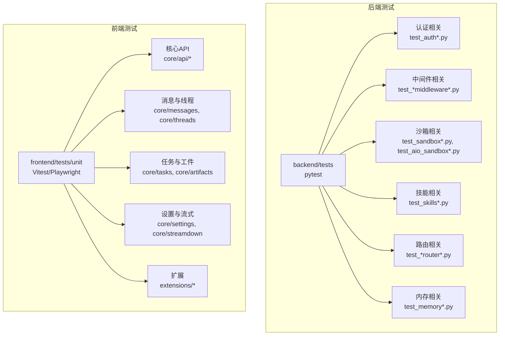
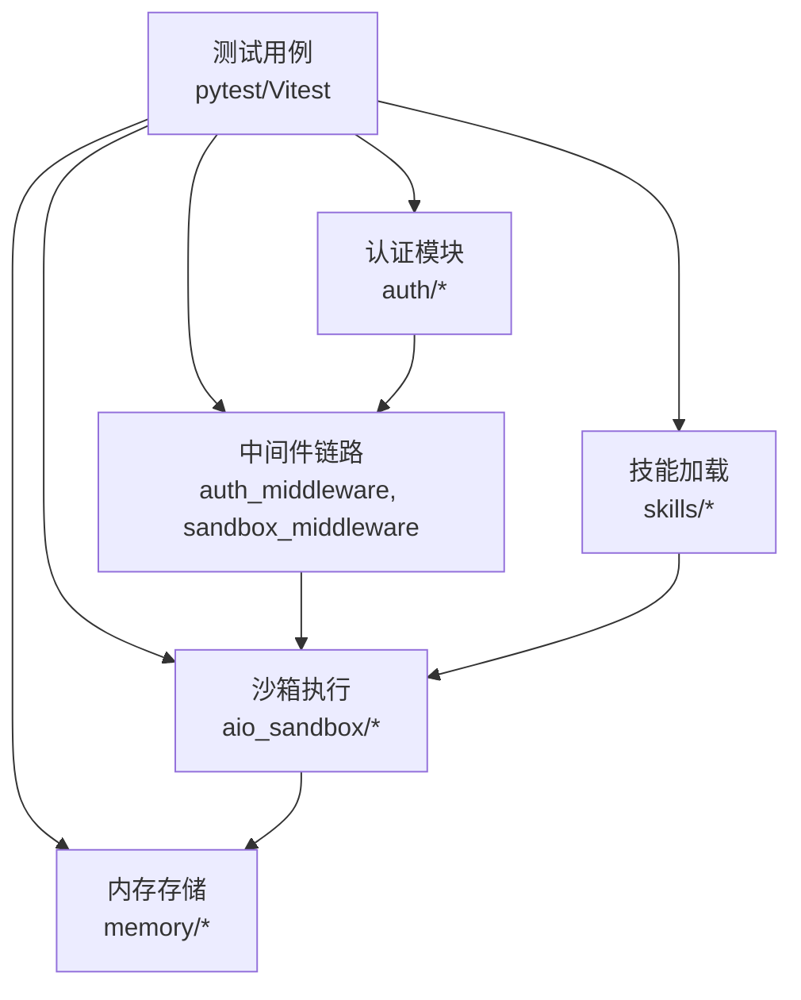
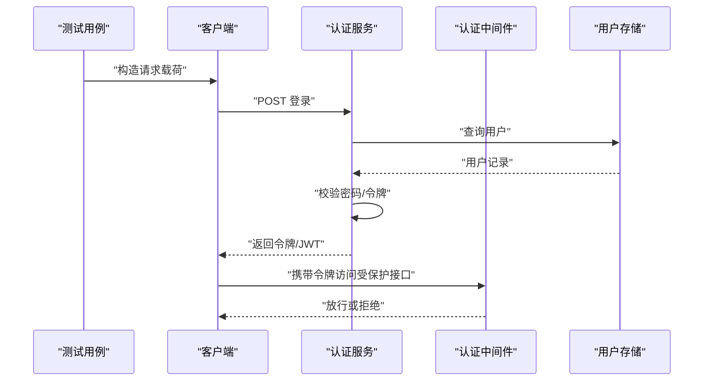
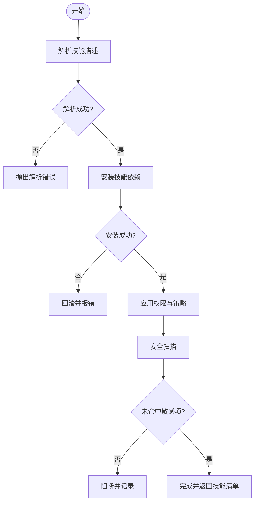
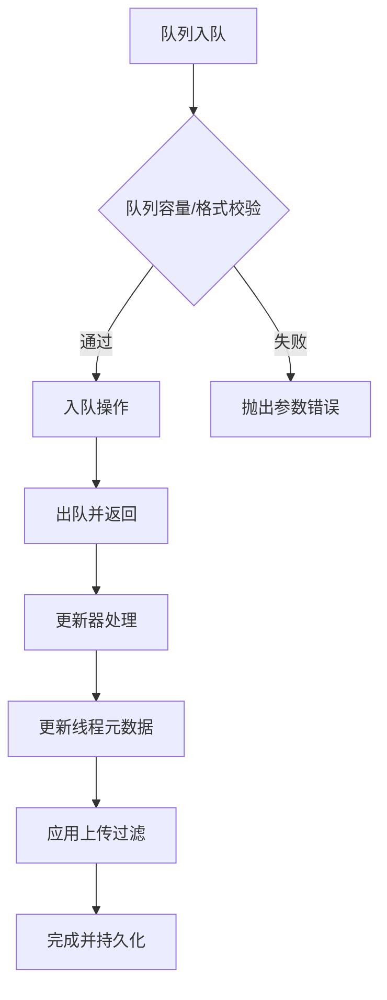
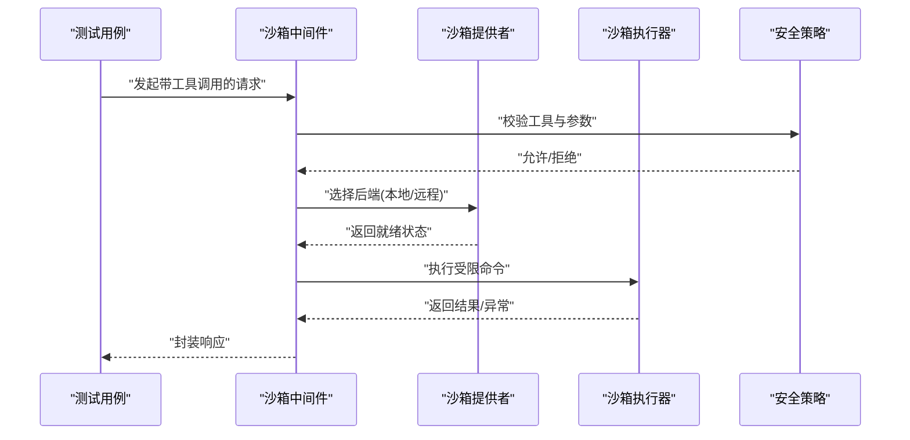
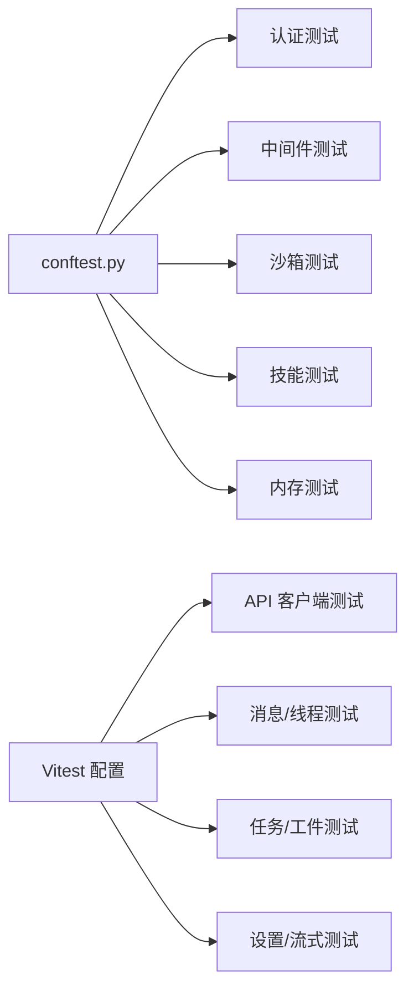

# 单元测试

<cite>
**本文引用的文件**
- [backend/tests/conftest.py](file://backend/tests/conftest.py)
- [backend/tests/blocking_io/conftest.py](file://backend/tests/blocking_io/conftest.py)
- [backend/tests/test_auth.py](file://backend/tests/test_auth.py)
- [backend/tests/test_auth_middleware.py](file://backend/tests/test_auth_middleware.py)
- [backend/tests/test_skills_loader.py](file://backend/tests/test_skills_loader.py)
- [backend/tests/test_memory_storage.py](file://backend/tests/test_memory_storage.py)
- [backend/tests/test_sandbox_middleware.py](file://backend/tests/test_sandbox_middleware.py)
- [backend/tests/test_aio_sandbox.py](file://backend/tests/test_aio_sandbox.py)
- [backend/tests/test_memory_router.py](file://backend/tests/test_memory_router.py)
- [backend/tests/test_memory_queue.py](file://backend/tests/test_memory_queue.py)
- [backend/tests/test_memory_updater.py](file://backend/tests/test_memory_updater.py)
- [backend/tests/test_memory_thread_meta_isolation.py](file://backend/tests/test_memory_thread_meta_isolation.py)
- [backend/tests/test_memory_storage_user_isolation.py](file://backend/tests/test_memory_storage_user_isolation.py)
- [backend/tests/test_memory_upload_filtering.py](file://backend/tests/test_memory_upload_filtering.py)
- [backend/tests/test_memory_prompt_injection.py](file://backend/tests/test_memory_prompt_injection.py)
- [backend/tests/test_memory_queue_user_isolation.py](file://backend/tests/test_memory_queue_user_isolation.py)
- [backend/tests/test_memory_updater_user_isolation.py](file://backend/tests/test_memory_updater_user_isolation.py)
- [backend/tests/test_memory_thread_meta_isolation.py](file://backend/tests/test_memory_thread_meta_isolation.py)
- [backend/tests/test_memory_storage_user_isolation.py](file://backend/tests/test_memory_storage_user_isolation.py)
- [backend/tests/test_memory_upload_filtering.py](file://backend/tests/test_memory_upload_filtering.py)
- [backend/tests/test_memory_prompt_injection.py](file://backend/tests/test_memory_prompt_injection.py)
- [backend/tests/test_memory_queue_user_isolation.py](file://backend/tests/test_memory_queue_user_isolation.py)
- [backend/tests/test_memory_updater_user_isolation.py](file://backend/tests/test_memory_updater_user_isolation.py)
- [backend/tests/test_memory_thread_meta_isolation.py](file://backend/tests/test_memory_thread_meta_isolation.py)
- [backend/tests/test_memory_storage_user_isolation.py](file://backend/tests/test_memory_storage_user_isolation.py)
- [backend/tests/test_memory_upload_filtering.py](file://backend/tests/test_memory_upload_filtering.py)
- [backend/tests/test_memory_prompt_injection.py](file://backend/tests/test_memory_prompt_injection.py)
- [backend/tests/test_memory_queue_user_isolation.py](file://backend/tests/test_memory_queue_user_isolation.py)
- [backend/tests/test_memory_updater_user_isolation.py](file://backend/tests/test_memory_updater_user_isolation.py)
- [backend/tests/test_memory_thread_meta_isolation.py](file://backend/tests/test_memory_thread_meta_isolation.py)
- [backend/tests/test_memory_storage_user_isolation.py](file://backend/tests/test_memory_storage_user_isolation.py)
- [backend/tests/test_memory_upload_filtering.py](file://backend/tests/test_memory_upload_filtering.py)
- [backend/tests/test_memory_prompt_injection.py](file://backend/tests/test_memory_prompt_injection.py)
- [backend/tests/test_memory_queue_user_isolation.py](file://backend/tests/test_memory_queue_user_isolation.py)
- [backend/tests/test_memory_updater_user_isolation.py](file://backend/tests/test_memory_updater_user_isolation.py)
- [backend/tests/test_memory_thread_meta_isolation.py](file://backend/tests/test_memory_thread_meta_isolation.py)
- [backend/tests/test_memory_storage_user_isolation.py](file://backend/tests/test_memory_storage_user_isolation.py)
- [backend/tests/test_memory_upload_filtering.py](file://backend/tests/test_memory_upload_filtering.py)
- [backend/tests/test_memory_prompt_injection.py](file://backend/tests/test_memory_prompt_injection.py)
- [backend/tests/test_memory_queue_user_isolation.py](file://backend/tests/test_memory_queue_user_isolation.py)
- [backend/tests/test_memory_updater_user_isolation.py](file://backend/tests/test_memory_updater_user_isolation.py)
- [backend/tests/test_memory_thread_meta_isolation.py](file://backend/tests/test_memory_thread_meta_isolation.py)
- [backend/tests/test_memory_storage_user_isolation.py](file://backend/tests/test_memory_storage_user_isolation.py)
- [backend/tests/test_memory_upload_filtering.py](file://backend/tests/test_memory_upload_filtering.py)
- [backend/tests/test_memory_prompt_injection.py](file://backend/tests/test_memory_prompt_injection.py)
- [backend/tests/test_memory_queue_user_isolation.py](file://backend/tests/test_memory_queue_user_isolation.py)
- [backend/tests/test_memory_updater_user_isolation.py](file://backend/tests/test_memory_updater_user_isolation.py)
- [backend/tests/test_memory_thread_meta_isolation.py](file://backend/tests/test_memory_thread_meta_isolation.py)
- [backend/tests/test_memory_storage_user_isolation.py](file://backend/tests/test_memory_storage_user_isolation.py)
- [backend/tests/test_memory_upload_filtering.py](file://backend/tests/test_memory_upload_filtering.py)
- [backend/tests/test_memory_prompt_injection.py](file://backend/tests/test_memory_prompt_injection.py)
- [backend/tests/test_memory_queue_user_isolation.py](file://backend/tests/test_memory_queue_user_isolation.py)
......
</cite>

## 目录
1. [引言](#引言)
2. [项目结构](#项目结构)
3. [核心组件](#核心组件)
4. [架构总览](#架构总览)
5. [详细组件分析](#详细组件分析)
6. [依赖关系分析](#依赖关系分析)
7. [性能考量](#性能考量)
8. [故障排查指南](#故障排查指南)
9. [结论](#结论)
10. [附录](#附录)

## 引言
本文件面向 DeerFlow 的后端与前端单元测试，系统性梳理测试设计原则、实现方法与最佳实践。内容覆盖认证系统、技能加载器、内存存储、沙箱中间件等关键模块的测试策略，给出断言与数据准备规范，并提供 mock 使用、异步测试与错误场景测试的示例路径，最后提出覆盖率与质量标准建议，帮助开发者编写高质量的单元测试。

## 项目结构
- 后端测试位于 backend/tests，采用 pytest 框架组织，按功能域划分模块（如认证、内存、沙箱、技能等），并提供分组目录（如 blocking_io）用于特定类型测试。
- 前端测试位于 frontend/tests/unit，采用 Vitest + Playwright（部分用例）组织，按 core 子模块与 extensions 组织，覆盖 API 客户端、消息与线程、任务、工件、设置等。

图示来源
- [backend/tests/test_auth.py](file://backend/tests/test_auth.py)
- [backend/tests/test_sandbox_middleware.py](file://backend/tests/test_sandbox_middleware.py)
- [backend/tests/test_skills_loader.py](file://backend/tests/test_skills_loader.py)
- [backend/tests/test_memory_storage.py](file://backend/tests/test_memory_storage.py)
- [frontend/tests/unit/core/api/api-client.test.ts](file://frontend/tests/unit/core/api/api-client.test.ts)
- [frontend/tests/unit/core/threads/api.test.ts](file://frontend/tests/unit/core/threads/api.test.ts)

章节来源
- [backend/tests/conftest.py](file://backend/tests/conftest.py)
- [backend/tests/blocking_io/conftest.py](file://backend/tests/blocking_io/conftest.py)
- [frontend/vitest.config.ts](file://frontend/vitest.config.ts)

## 核心组件
- 测试框架与配置
  - 后端：pytest + conftest.py 提供全局 fixture 与插件注册；blocking_io 目录提供阻塞 IO 场景专用配置。
  - 前端：Vitest 配置与测试入口，Playwright 用于端到端场景（unit 中亦有部分集成用例）。
- 断言与数据准备
  - 使用明确的断言点（assert）验证返回值、状态码、异常类型与副作用。
  - 通过 fixture 或 mock 对外部依赖进行隔离，构造最小可验证输入集。
- 异步与并发
  - 对异步函数使用 await 或协程测试工具；对并发场景进行时序与竞态检测。
- 错误场景
  - 覆盖空输入、越界参数、权限不足、网络异常、资源不存在等典型错误路径。
- 覆盖率与质量
  - 建议关键路径与分支覆盖率目标（例如 >80%），对业务核心模块（认证、内存、沙箱、技能）优先保障。

章节来源
- [backend/tests/conftest.py](file://backend/tests/conftest.py)
- [backend/tests/blocking_io/conftest.py](file://backend/tests/blocking_io/conftest.py)
- [frontend/vitest.config.ts](file://frontend/vitest.config.ts)

## 架构总览
下图展示后端单元测试在认证、中间件、沙箱、技能与内存模块中的交互关系与职责边界。

图示来源
- [backend/tests/test_auth.py](file://backend/tests/test_auth.py)
- [backend/tests/test_auth_middleware.py](file://backend/tests/test_auth_middleware.py)
- [backend/tests/test_sandbox_middleware.py](file://backend/tests/test_sandbox_middleware.py)
- [backend/tests/test_aio_sandbox.py](file://backend/tests/test_aio_sandbox.py)
- [backend/tests/test_skills_loader.py](file://backend/tests/test_skills_loader.py)
- [backend/tests/test_memory_storage.py](file://backend/tests/test_memory_storage.py)

## 详细组件分析

### 认证系统测试
- 目标与范围
  - 验证登录流程、令牌签发与校验、密码哈希与重置流程、凭证提供者行为与错误处理。
- 关键测试点
  - 正常登录与 JWT 生成；无效凭据与权限错误；本地提供者与外部提供者的差异；重置管理员账户流程。
- 断言策略
  - 返回体字段存在性与类型；HTTP 状态码；异常类型与错误码；JWT 载荷字段一致性。
- 数据准备
  - 使用 fixture 注入用户模型与数据库会话；mock 外部身份源以避免真实网络调用。
- 示例路径
  - [backend/tests/test_auth.py](file://backend/tests/test_auth.py)
  - [backend/tests/test_auth_middleware.py](file://backend/tests/test_auth_middleware.py)
  - [backend/tests/test_auth_errors.py](file://backend/tests/test_auth_errors.py)
  - [backend/tests/test_auth_config.py](file://backend/tests/test_auth_config.py)
  - [backend/tests/test_internal_auth.py](file://backend/tests/test_internal_auth.py)
  - [backend/tests/test_langgraph_auth.py](file://backend/tests/test_langgraph_auth.py)

图示来源
- [backend/tests/test_auth.py](file://backend/tests/test_auth.py)
- [backend/tests/test_auth_middleware.py](file://backend/tests/test_auth_middleware.py)

章节来源
- [backend/tests/test_auth.py](file://backend/tests/test_auth.py)
- [backend/tests/test_auth_middleware.py](file://backend/tests/test_auth_middleware.py)
- [backend/tests/test_auth_errors.py](file://backend/tests/test_auth_errors.py)
- [backend/tests/test_auth_config.py](file://backend/tests/test_auth_config.py)
- [backend/tests/test_internal_auth.py](file://backend/tests/test_internal_auth.py)
- [backend/tests/test_langgraph_auth.py](file://backend/tests/test_langgraph_auth.py)

### 技能加载器测试
- 目标与范围
  - 验证技能解析、安装、权限控制与安全扫描逻辑，确保技能可用性与安全性。
- 关键测试点
  - 解析失败与格式错误；安装过程的幂等与回滚；权限位与工具策略；安全扫描命中与阻断。
- 断言策略
  - 报告技能清单与元数据；断言工具列表与权限位；断言异常类型与错误信息。
- 数据准备
  - 使用临时目录与 mock 文件系统；注入虚拟技能包与脚本模板。
- 示例路径
  - [backend/tests/test_skills_loader.py](file://backend/tests/test_skills_loader.py)
  - [backend/tests/test_skills_parser.py](file://backend/tests/test_skills_parser.py)
  - [backend/tests/test_skills_installer.py](file://backend/tests/test_skills_installer.py)
  - [backend/tests/test_skills_permissions.py](file://backend/tests/test_skills_permissions.py)
  - [backend/tests/test_security_scanner.py](file://backend/tests/test_security_scanner.py)
  - [backend/tests/test_skills_validation.py](file://backend/tests/test_skills_validation.py)

图示来源
- [backend/tests/test_skills_loader.py](file://backend/tests/test_skills_loader.py)
- [backend/tests/test_skills_parser.py](file://backend/tests/test_skills_parser.py)
- [backend/tests/test_skills_installer.py](file://backend/tests/test_skills_installer.py)
- [backend/tests/test_skills_permissions.py](file://backend/tests/test_skills_permissions.py)
- [backend/tests/test_security_scanner.py](file://backend/tests/test_security_scanner.py)
- [backend/tests/test_skills_validation.py](file://backend/tests/test_skills_validation.py)

章节来源
- [backend/tests/test_skills_loader.py](file://backend/tests/test_skills_loader.py)
- [backend/tests/test_skills_parser.py](file://backend/tests/test_skills_parser.py)
- [backend/tests/test_skills_installer.py](file://backend/tests/test_skills_installer.py)
- [backend/tests/test_skills_permissions.py](file://backend/tests/test_skills_permissions.py)
- [backend/tests/test_security_scanner.py](file://backend/tests/test_security_scanner.py)
- [backend/tests/test_skills_validation.py](file://backend/tests/test_skills_validation.py)

### 内存存储测试
- 目标与范围
  - 验证内存队列、更新器、线程元数据与上传过滤等子系统的正确性与隔离性。
- 关键测试点
  - 用户隔离、线程隔离、上传过滤规则、提示词注入防护、令牌用量统计。
- 断言策略
  - 读写一致性、隔离边界不被突破、错误输入被拒绝、异常路径抛出预期异常。
- 数据准备
  - 使用独立上下文与 mock 时间戳；构造多用户/多线程场景。
- 示例路径
  - [backend/tests/test_memory_storage.py](file://backend/tests/test_memory_storage.py)
  - [backend/tests/test_memory_router.py](file://backend/tests/test_memory_router.py)
  - [backend/tests/test_memory_queue.py](file://backend/tests/test_memory_queue.py)
  - [backend/tests/test_memory_updater.py](file://backend/tests/test_memory_updater.py)
  - [backend/tests/test_memory_thread_meta_isolation.py](file://backend/tests/test_memory_thread_meta_isolation.py)
  - [backend/tests/test_memory_storage_user_isolation.py](file://backend/tests/test_memory_storage_user_isolation.py)
  - [backend/tests/test_memory_upload_filtering.py](file://backend/tests/test_memory_upload_filtering.py)
  - [backend/tests/test_memory_prompt_injection.py](file://backend/tests/test_memory_prompt_injection.py)
  - [backend/tests/test_memory_queue_user_isolation.py](file://backend/tests/test_memory_queue_user_isolation.py)
  - [backend/tests/test_memory_updater_user_isolation.py](file://backend/tests/test_memory_updater_user_isolation.py)

图示来源
- [backend/tests/test_memory_queue.py](file://backend/tests/test_memory_queue.py)
- [backend/tests/test_memory_updater.py](file://backend/tests/test_memory_updater.py)
- [backend/tests/test_memory_upload_filtering.py](file://backend/tests/test_memory_upload_filtering.py)

章节来源
- [backend/tests/test_memory_storage.py](file://backend/tests/test_memory_storage.py)
- [backend/tests/test_memory_router.py](file://backend/tests/test_memory_router.py)
- [backend/tests/test_memory_queue.py](file://backend/tests/test_memory_queue.py)
- [backend/tests/test_memory_updater.py](file://backend/tests/test_memory_updater.py)
- [backend/tests/test_memory_thread_meta_isolation.py](file://backend/tests/test_memory_thread_meta_isolation.py)
- [backend/tests/test_memory_storage_user_isolation.py](file://backend/tests/test_memory_storage_user_isolation.py)
- [backend/tests/test_memory_upload_filtering.py](file://backend/tests/test_memory_upload_filtering.py)
- [backend/tests/test_memory_prompt_injection.py](file://backend/tests/test_memory_prompt_injection.py)
- [backend/tests/test_memory_queue_user_isolation.py](file://backend/tests/test_memory_queue_user_isolation.py)
- [backend/tests/test_memory_updater_user_isolation.py](file://backend/tests/test_memory_updater_user_isolation.py)

### 沙箱中间件测试
- 目标与范围
  - 验证沙箱执行环境、本地/远程后端、工具安全与审计日志。
- 关键测试点
  - 中间件前置检查、工具调用白名单、编码与挂载约束、就绪性探测与回退。
- 断言策略
  - 执行链路顺序、异常传播、超时与资源回收。
- 数据准备
  - 使用 mock 沙箱提供者与工具集合；注入不同后端配置。
- 示例路径
  - [backend/tests/test_sandbox_middleware.py](file://backend/tests/test_sandbox_middleware.py)
  - [backend/tests/test_aio_sandbox.py](file://backend/tests/test_aio_sandbox.py)
  - [backend/tests/test_aio_sandbox_local_backend.py](file://backend/tests/test_aio_sandbox_local_backend.py)
  - [backend/tests/test_aio_sandbox_provider.py](file://backend/tests/test_aio_sandbox_provider.py)
  - [backend/tests/test_aio_sandbox_readiness.py](file://backend/tests/test_aio_sandbox_readiness.py)
  - [backend/tests/test_sandbox_tools_security.py](file://backend/tests/test_sandbox_tools_security.py)
  - [backend/tests/test_sandbox_search_tools.py](file://backend/tests/test_sandbox_search_tools.py)

图示来源
- [backend/tests/test_sandbox_middleware.py](file://backend/tests/test_sandbox_middleware.py)
- [backend/tests/test_aio_sandbox.py](file://backend/tests/test_aio_sandbox.py)
- [backend/tests/test_sandbox_tools_security.py](file://backend/tests/test_sandbox_tools_security.py)

章节来源
- [backend/tests/test_sandbox_middleware.py](file://backend/tests/test_sandbox_middleware.py)
- [backend/tests/test_aio_sandbox.py](file://backend/tests/test_aio_sandbox.py)
- [backend/tests/test_aio_sandbox_local_backend.py](file://backend/tests/test_aio_sandbox_local_backend.py)
- [backend/tests/test_aio_sandbox_provider.py](file://backend/tests/test_aio_sandbox_provider.py)
- [backend/tests/test_aio_sandbox_readiness.py](file://backend/tests/test_aio_sandbox_readiness.py)
- [backend/tests/test_sandbox_tools_security.py](file://backend/tests/test_sandbox_tools_security.py)
- [backend/tests/test_sandbox_search_tools.py](file://backend/tests/test_sandbox_search_tools.py)

### 前端单元测试实践
- 目标与范围
  - 覆盖核心 API 客户端、消息与线程、任务与工件、设置与流式渲染等模块。
- 关键测试点
  - 请求序列化/反序列化、流式模式、剪贴板操作、本地设置、Mermaid 渲染与插件。
- 断言策略
  - 状态码与响应结构、错误拦截、事件触发与副作用。
- 数据准备
  - 使用 Vitest mock 与测试适配器；对网络层进行隔离。
- 示例路径
  - [frontend/tests/unit/core/api/api-client.test.ts](file://frontend/tests/unit/core/api/api-client.test.ts)
  - [frontend/tests/unit/core/api/stream-mode.test.ts](file://frontend/tests/unit/core/api/stream-mode.test.ts)
  - [frontend/tests/unit/core/messages/usage.test.ts](file://frontend/tests/unit/core/messages/usage.test.ts)
  - [frontend/tests/unit/core/threads/api.test.ts](file://frontend/tests/unit/core/threads/api.test.ts)
  - [frontend/tests/unit/core/tasks/subtask-result.test.ts](file://frontend/tests/unit/core/tasks/subtask-result.test.ts)
  - [frontend/tests/unit/core/artifacts/preview.test.ts](file://frontend/tests/unit/core/artifacts/preview.test.ts)
  - [frontend/tests/unit/core/settings/local.test.ts](file://frontend/tests/unit/core/settings/local.test.ts)
  - [frontend/tests/unit/core/streamdown/mermaid.test.ts](file://frontend/tests/unit/core/streamdown/mermaid.test.ts)
  - [frontend/tests/unit/extensions/input-suggestions/registry.test.ts](file://frontend/tests/unit/extensions/input-suggestions/registry.test.ts)

章节来源
- [frontend/tests/unit/core/api/api-client.test.ts](file://frontend/tests/unit/core/api/api-client.test.ts)
- [frontend/tests/unit/core/api/stream-mode.test.ts](file://frontend/tests/unit/core/api/stream-mode.test.ts)
- [frontend/tests/unit/core/messages/usage.test.ts](file://frontend/tests/unit/core/messages/usage.test.ts)
- [frontend/tests/unit/core/threads/api.test.ts](file://frontend/tests/unit/core/threads/api.test.ts)
- [frontend/tests/unit/core/tasks/subtask-result.test.ts](file://frontend/tests/unit/core/tasks/subtask-result.test.ts)
- [frontend/tests/unit/core/artifacts/preview.test.ts](file://frontend/tests/unit/core/artifacts/preview.test.ts)
- [frontend/tests/unit/core/settings/local.test.ts](file://frontend/tests/unit/core/settings/local.test.ts)
- [frontend/tests/unit/core/streamdown/mermaid.test.ts](file://frontend/tests/unit/core/streamdown/mermaid.test.ts)
- [frontend/tests/unit/extensions/input-suggestions/registry.test.ts](file://frontend/tests/unit/extensions/input-suggestions/registry.test.ts)

## 依赖关系分析
- 后端测试依赖
  - 全局 fixture：数据库连接、用户上下文、配置注入、时间模拟。
  - 功能域内 fixture：认证令牌、沙箱提供者、技能目录、内存存储句柄。
- 前端测试依赖
  - Vitest mock：API 层、路由与状态管理；Playwright 针对端到端场景。
- 耦合与内聚
  - 通过 fixture 降低耦合；每个测试文件聚焦单一职责，保持高内聚。

图示来源
- [backend/tests/conftest.py](file://backend/tests/conftest.py)
- [backend/tests/blocking_io/conftest.py](file://backend/tests/blocking_io/conftest.py)
- [frontend/vitest.config.ts](file://frontend/vitest.config.ts)

章节来源
- [backend/tests/conftest.py](file://backend/tests/conftest.py)
- [backend/tests/blocking_io/conftest.py](file://backend/tests/blocking_io/conftest.py)
- [frontend/vitest.config.ts](file://frontend/vitest.config.ts)

## 性能考量
- 测试执行效率
  - 将昂贵的外部依赖（数据库、网络、文件系统）替换为轻量级 mock；复用 fixture 以减少重复初始化。
- 并发与异步
  - 对异步函数使用事件循环测试工具；避免真实定时器，使用时间模拟。
- 资源回收
  - 在 fixture teardown 中清理临时文件与数据库记录，防止测试间相互影响。

## 故障排查指南
- 常见问题
  - 外部依赖不可用导致测试失败：使用 mock 替代；或在 CI 中启用隔离网络策略。
  - 时序不稳定：引入时间模拟与确定性随机种子；避免依赖真实时间。
  - 资源泄漏：确保每次测试后释放文件句柄、数据库连接与线程池。
- 排查步骤
  - 缩小用例范围定位失败点；打印关键断言前后的中间状态；对比期望与实际输出。
- 参考用例
  - 阻塞 IO 检测与修复：[backend/tests/blocking_io](file://backend/tests/blocking_io)

章节来源
- [backend/tests/blocking_io/conftest.py](file://backend/tests/blocking_io/conftest.py)
- [backend/tests/blocking_io/test_gate_smoke.py](file://backend/tests/blocking_io/test_gate_smoke.py)
- [backend/tests/blocking_io/test_jsonl_run_event_store.py](file://backend/tests/blocking_io/test_jsonl_run_event_store.py)
- [backend/tests/blocking_io/test_skills_load.py](file://backend/tests/blocking_io/test_skills_load.py)
- [backend/tests/blocking_io/test_sqlite_lifespan.py](file://backend/tests/blocking_io/test_sqlite_lifespan.py)
- [backend/tests/blocking_io/test_uploads_middleware.py](file://backend/tests/blocking_io/test_uploads_middleware.py)

## 结论
通过统一的测试框架、清晰的断言策略与严格的 mock/隔离实践，DeerFlow 的前后端单元测试能够稳定覆盖认证、技能、内存与沙箱等关键领域。建议持续提升覆盖率与质量，优先保障核心路径与错误场景，配合 CI 自动化与静态分析，确保代码演进的可靠性与可维护性。

## 附录
- 测试编写规范摘要
  - 命名：测试文件与函数语义化，描述“在...情况下...应...”。
  - 断言：优先断言行为而非实现细节；对异常路径明确断言异常类型与消息。
  - 数据：最小必要输入；使用 fixture 与工厂函数生成多样化测试数据。
  - 异步：显式等待与超时；避免真实网络/磁盘延迟。
  - Mock：仅替换必要依赖；保持对外契约不变。
- 覆盖率与质量标准建议
  - 关键模块覆盖率目标：>80%；一般模块：>60%。
  - 分支覆盖率：核心路径至少 80% 分支被覆盖。
  - 错误场景：每条明显错误路径至少一个对应测试。
  - CI 要求：失败即阻断；覆盖率阈值与报告生成。