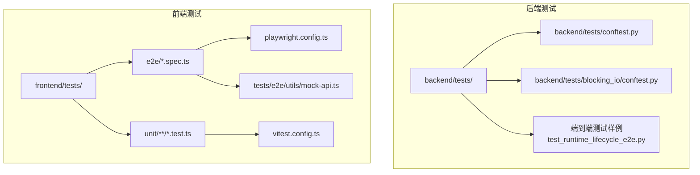
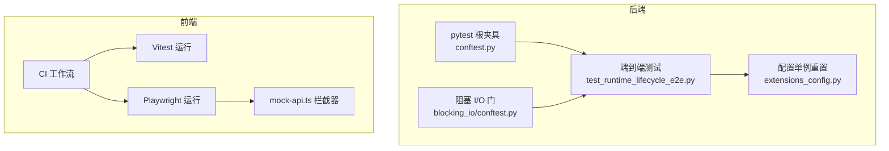
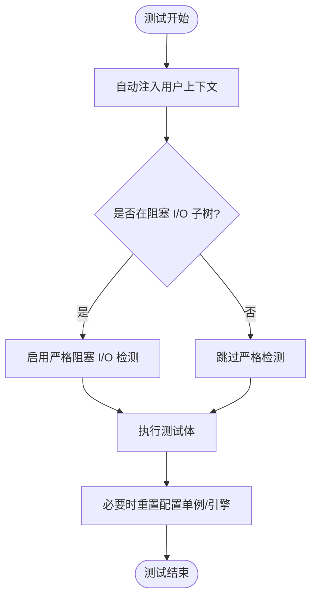
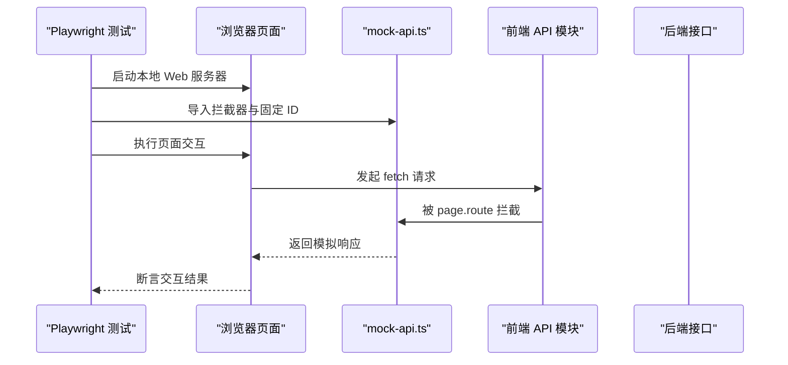
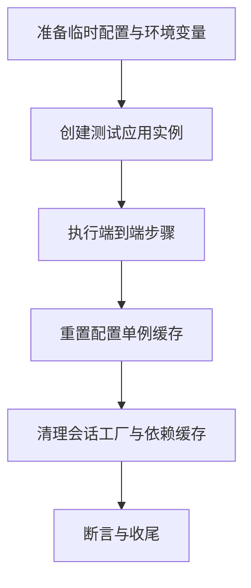
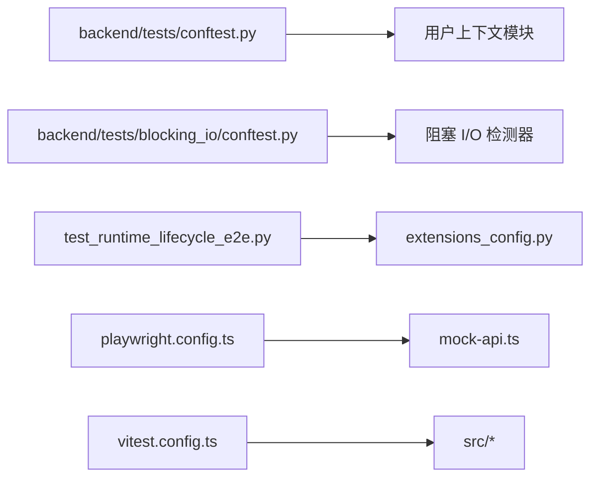

# 测试架构设计

<cite>
**本文引用的文件**
- [backend/tests/conftest.py](file://backend/tests/conftest.py)
- [backend/tests/blocking_io/conftest.py](file://backend/tests/blocking_io/conftest.py)
- [backend/tests/_agent_e2e_helpers.py](file://backend/tests/_agent_e2e_helpers.py)
- [backend/tests/_router_auth_helpers.py](file://backend/tests/_router_auth_helpers.py)
- [backend/tests/test_runtime_lifecycle_e2e.py](file://backend/tests/test_runtime_lifecycle_e2e.py)
- [backend/packages/harness/deerflow/config/extensions_config.py](file://backend/packages/harness/deerflow/config/extensions_config.py)
- [frontend/playwright.config.ts](file://frontend/playwright.config.ts)
- [frontend/vitest.config.ts](file://frontend/vitest.config.ts)
- [frontend/tests/e2e/utils/mock-api.ts](file://frontend/tests/e2e/utils/mock-api.ts)
- [frontend/src/core/agents/api.ts](file://frontend/src/core/agents/api.ts)
- [frontend/README.md](file://frontend/README.md)
- [frontend/CLAUDE.md](file://frontend/CLAUDE.md)
- [.github/workflows/e2e-tests.yml](file://.github/workflows/e2e-tests.yml)
- [.github/workflows/frontend-unit-tests.yml](file://.github/workflows/frontend-unit-tests.yml)
- [scripts/test-wecom-api.sh](file://scripts/test-wecom-api.sh)
- [.agent/skills/smoke-test/scripts/frontend_check.sh](file://.agent/skills/smoke-test/scripts/frontend_check.sh)
</cite>

## 目录
1. [引言](#引言)
2. [项目结构](#项目结构)
3. [核心组件](#核心组件)
4. [架构总览](#架构总览)
5. [详细组件分析](#详细组件分析)
6. [依赖关系分析](#依赖关系分析)
7. [性能考量](#性能考量)
8. [故障排查指南](#故障排查指南)
9. [结论](#结论)
10. [附录](#附录)

## 引言
本文件系统性梳理 DeerFlow 的测试架构设计，覆盖后端 Python/pytest 单元与集成测试、端到端测试，以及前端 Next.js 的单元测试与 Playwright 端到端测试。重点阐述测试分层策略、pytest 配置与夹具（fixtures）设计、前后端测试差异、测试数据与模拟对象管理、隔离与最佳实践，并通过图示展示关键流程与依赖关系。

## 项目结构
- 后端测试位于 backend/tests，包含：
  - 根级 conftest.py 提供全局夹具与自动注入行为
  - blocking_io 子目录的 conftest.py 为特定子树启用严格阻塞 I/O 检测
  - 大量按功能域划分的测试模块，涵盖认证、路由、运行时生命周期、沙箱、工具链等
- 前端测试位于 frontend/tests，包含：
  - e2e 目录：Playwright 端到端测试，通过 page.route 拦截网络请求进行无真实后端的交互测试
  - unit 目录：Vitest 单元测试，镜像 src 目录结构，测试核心逻辑与组件行为
- GitHub Actions 工作流分别驱动前端单元测试与端到端测试流水线

图表来源
- [backend/tests/conftest.py:113-139](file://backend/tests/conftest.py#L113-L139)
- [backend/tests/blocking_io/conftest.py:26-37](file://backend/tests/blocking_io/conftest.py#L26-L37)
- [backend/tests/test_runtime_lifecycle_e2e.py:175-223](file://backend/tests/test_runtime_lifecycle_e2e.py#L175-L223)
- [frontend/playwright.config.ts:1-34](file://frontend/playwright.config.ts#L1-L34)
- [frontend/vitest.config.ts:1-14](file://frontend/vitest.config.ts#L1-L14)
- [frontend/tests/e2e/utils/mock-api.ts:1-45](file://frontend/tests/e2e/utils/mock-api.ts#L1-L45)

章节来源
- [backend/tests/conftest.py:113-139](file://backend/tests/conftest.py#L113-L139)
- [backend/tests/blocking_io/conftest.py:26-37](file://backend/tests/blocking_io/conftest.py#L26-L37)
- [backend/tests/test_runtime_lifecycle_e2e.py:175-223](file://backend/tests/test_runtime_lifecycle_e2e.py#L175-L223)
- [frontend/playwright.config.ts:1-34](file://frontend/playwright.config.ts#L1-L34)
- [frontend/vitest.config.ts:1-14](file://frontend/vitest.config.ts#L1-L14)
- [frontend/tests/e2e/utils/mock-api.ts:1-45](file://frontend/tests/e2e/utils/mock-api.ts#L1-L45)

## 核心组件
- 后端 pytest 全局夹具与自动注入
  - 自动用户上下文夹具：在未显式禁用的情况下，为每个测试注入默认用户上下文，确保持久化层访问一致性；支持通过标记禁用
  - 阻塞 I/O 严格门：仅对 blocking_io 子树启用，围绕整个测试项协议执行严格检测，支持允许标记豁免
- 前端测试运行时配置
  - Vitest：通过别名与包含规则定位单元测试
  - Playwright：配置并行、重试、工作进程、超时、报告器、设备集与本地 Web 服务器启动命令
- 前端 E2E 模拟层
  - 统一的 mock-api 工具：导出确定性的线程/运行 ID、类型与拦截器，便于跨测试复用
  - 基于 page.route 的网络拦截：在无真实后端情况下模拟 LangGraph/后端 API

章节来源
- [backend/tests/conftest.py:113-139](file://backend/tests/conftest.py#L113-L139)
- [backend/tests/blocking_io/conftest.py:26-37](file://backend/tests/blocking_io/conftest.py#L26-L37)
- [frontend/vitest.config.ts:1-14](file://frontend/vitest.config.ts#L1-L14)
- [frontend/playwright.config.ts:1-34](file://frontend/playwright.config.ts#L1-L34)
- [frontend/tests/e2e/utils/mock-api.ts:1-45](file://frontend/tests/e2e/utils/mock-api.ts#L1-L45)

## 架构总览
下图展示了后端与前端测试的整体架构与交互路径，包括夹具注入、E2E 生命周期清理、模拟层与 CI 工作流。

图表来源
- [backend/tests/conftest.py:113-139](file://backend/tests/conftest.py#L113-L139)
- [backend/tests/blocking_io/conftest.py:26-37](file://backend/tests/blocking_io/conftest.py#L26-L37)
- [backend/tests/test_runtime_lifecycle_e2e.py:175-223](file://backend/tests/test_runtime_lifecycle_e2e.py#L175-L223)
- [backend/packages/harness/deerflow/config/extensions_config.py:246-266](file://backend/packages/harness/deerflow/config/extensions_config.py#L246-L266)
- [frontend/playwright.config.ts:1-34](file://frontend/playwright.config.ts#L1-L34)
- [frontend/tests/e2e/utils/mock-api.ts:1-45](file://frontend/tests/e2e/utils/mock-api.ts#L1-L45)
- [.github/workflows/e2e-tests.yml:1-63](file://.github/workflows/e2e-tests.yml#L1-L63)
- [.github/workflows/frontend-unit-tests.yml:1-43](file://.github/workflows/frontend-unit-tests.yml#L1-L43)

## 详细组件分析

### 后端测试分层与夹具设计
- 分层策略
  - 单元测试：针对模块内函数、类与小范围协作，快速反馈与高覆盖率
  - 集成测试：围绕路由、服务、中间件与数据库交互，验证组件间接口契约
  - 端到端测试：覆盖从客户端到后端网关再到持久化的完整链路，强调真实配置与运行时生命周期
- pytest 配置与夹具
  - 自动用户上下文夹具：在未标记禁用时，延迟导入用户上下文模块，设置默认用户并在测试结束后清理
  - 阻塞 I/O 严格门：通过 hookwrapper 包裹测试项协议，在指定路径下的测试中启用严格检测，支持允许标记豁免
  - E2E 生命周期清理：在运行时生命周期相关的端到端测试中，显式重置配置单例与引擎缓存，避免跨测试污染

图表来源
- [backend/tests/conftest.py:113-139](file://backend/tests/conftest.py#L113-L139)
- [backend/tests/blocking_io/conftest.py:26-37](file://backend/tests/blocking_io/conftest.py#L26-L37)
- [backend/tests/test_runtime_lifecycle_e2e.py:175-223](file://backend/tests/test_runtime_lifecycle_e2e.py#L175-L223)

章节来源
- [backend/tests/conftest.py:113-139](file://backend/tests/conftest.py#L113-L139)
- [backend/tests/blocking_io/conftest.py:26-37](file://backend/tests/blocking_io/conftest.py#L26-L37)
- [backend/tests/test_runtime_lifecycle_e2e.py:175-223](file://backend/tests/test_runtime_lifecycle_e2e.py#L175-L223)

### 前端测试策略与模拟层
- 单元测试（Vitest）
  - 采用与源码同目录映射的测试布局，通过别名简化导入，聚焦纯函数与组件逻辑
- 端到端测试（Playwright）
  - 使用 Chromium 设备集，配置并行、重试与报告器；本地 Web 服务器启动命令与环境变量控制认证状态
  - 通过统一的 mock-api 工具拦截所有 LangGraph/后端 API，保证测试独立性与可重复性
- API 访问与模拟
  - 前端核心 API 模块通过基础 URL 访问后端；E2E 测试通过 page.route 拦截这些调用，返回预设响应

图表来源
- [frontend/playwright.config.ts:1-34](file://frontend/playwright.config.ts#L1-L34)
- [frontend/tests/e2e/utils/mock-api.ts:1-45](file://frontend/tests/e2e/utils/mock-api.ts#L1-L45)
- [frontend/src/core/agents/api.ts:38-65](file://frontend/src/core/agents/api.ts#L38-L65)

章节来源
- [frontend/vitest.config.ts:1-14](file://frontend/vitest.config.ts#L1-L14)
- [frontend/playwright.config.ts:1-34](file://frontend/playwright.config.ts#L1-L34)
- [frontend/tests/e2e/utils/mock-api.ts:1-45](file://frontend/tests/e2e/utils/mock-api.ts#L1-L45)
- [frontend/src/core/agents/api.ts:38-65](file://frontend/src/core/agents/api.ts#L38-L65)

### 端到端测试生命周期与隔离
- 生命周期测试关注点
  - 在端到端场景中，需要临时配置与运行时单例的隔离，避免不同测试之间相互影响
  - 通过猴子补丁（monkeypatch）重置关键模块的单例缓存，确保每次测试加载独立配置
- 配置单例重置
  - 提供专用的重置与设置函数，用于在测试前后恢复或注入自定义配置实例

图表来源
- [backend/tests/test_runtime_lifecycle_e2e.py:175-223](file://backend/tests/test_runtime_lifecycle_e2e.py#L175-L223)
- [backend/packages/harness/deerflow/config/extensions_config.py:246-266](file://backend/packages/harness/deerflow/config/extensions_config.py#L246-L266)

章节来源
- [backend/tests/test_runtime_lifecycle_e2e.py:175-223](file://backend/tests/test_runtime_lifecycle_e2e.py#L175-L223)
- [backend/packages/harness/deerflow/config/extensions_config.py:246-266](file://backend/packages/harness/deerflow/config/extensions_config.py#L246-L266)

### 测试数据管理与模拟对象
- 前端 E2E 固定 ID 与类型
  - 统一导出确定性的线程与运行 ID，配合类型定义，确保跨测试的一致性与可预测性
- 后端配置单例
  - 提供重置与设置函数，便于在测试中切换或注入不同的扩展配置实例，提升隔离度与可控性

章节来源
- [frontend/tests/e2e/utils/mock-api.ts:15-45](file://frontend/tests/e2e/utils/mock-api.ts#L15-L45)
- [backend/packages/harness/deerflow/config/extensions_config.py:246-266](file://backend/packages/harness/deerflow/config/extensions_config.py#L246-L266)

### 测试隔离与最佳实践
- 自动用户上下文注入与禁用
  - 通过标记禁用自动注入，减少对不需要持久化层的测试的副作用
- 严格阻塞 I/O 检测
  - 仅在特定子树启用，避免对全量测试造成性能与稳定性影响
- 端到端生命周期清理
  - 显式重置配置单例与引擎缓存，防止跨测试污染
- 前端模拟层
  - 通过 page.route 拦截网络请求，确保测试不依赖外部后端，提高稳定性与速度

章节来源
- [backend/tests/conftest.py:113-139](file://backend/tests/conftest.py#L113-L139)
- [backend/tests/blocking_io/conftest.py:26-37](file://backend/tests/blocking_io/conftest.py#L26-L37)
- [backend/tests/test_runtime_lifecycle_e2e.py:175-223](file://backend/tests/test_runtime_lifecycle_e2e.py#L175-L223)
- [frontend/tests/e2e/utils/mock-api.ts:1-45](file://frontend/tests/e2e/utils/mock-api.ts#L1-L45)

## 依赖关系分析
- 后端
  - 根夹具依赖用户上下文模块（按需导入），在测试生命周期中注入/清理
  - 阻塞 I/O 门依赖支持检测模块，仅作用于指定路径下的测试项
  - 端到端测试依赖配置单例重置能力，以确保隔离
- 前端
  - Playwright 依赖 Vitest 别名与包含规则，统一运行单元与端到端测试
  - E2E 依赖 mock-api 工具提供的拦截器与固定 ID，保障稳定与可重复

图表来源
- [backend/tests/conftest.py:113-139](file://backend/tests/conftest.py#L113-L139)
- [backend/tests/blocking_io/conftest.py:26-37](file://backend/tests/blocking_io/conftest.py#L26-L37)
- [backend/tests/test_runtime_lifecycle_e2e.py:175-223](file://backend/tests/test_runtime_lifecycle_e2e.py#L175-L223)
- [backend/packages/harness/deerflow/config/extensions_config.py:246-266](file://backend/packages/harness/deerflow/config/extensions_config.py#L246-L266)
- [frontend/playwright.config.ts:1-34](file://frontend/playwright.config.ts#L1-L34)
- [frontend/vitest.config.ts:1-14](file://frontend/vitest.config.ts#L1-L14)
- [frontend/tests/e2e/utils/mock-api.ts:1-45](file://frontend/tests/e2e/utils/mock-api.ts#L1-L45)

章节来源
- [backend/tests/conftest.py:113-139](file://backend/tests/conftest.py#L113-L139)
- [backend/tests/blocking_io/conftest.py:26-37](file://backend/tests/blocking_io/conftest.py#L26-L37)
- [backend/tests/test_runtime_lifecycle_e2e.py:175-223](file://backend/tests/test_runtime_lifecycle_e2e.py#L175-L223)
- [backend/packages/harness/deerflow/config/extensions_config.py:246-266](file://backend/packages/harness/deerflow/config/extensions_config.py#L246-L266)
- [frontend/playwright.config.ts:1-34](file://frontend/playwright.config.ts#L1-L34)
- [frontend/vitest.config.ts:1-14](file://frontend/vitest.config.ts#L1-L14)
- [frontend/tests/e2e/utils/mock-api.ts:1-45](file://frontend/tests/e2e/utils/mock-api.ts#L1-L45)

## 性能考量
- 并行与重试
  - Playwright 在 CI 上启用并行与重试，缩短失败重试时间；本地开发可按需调整工作进程数
- 严格阻塞 I/O 检测范围
  - 仅在 blocking_io 子树启用，避免对全量测试引入额外开销
- 本地服务器复用
  - CI 场景下可复用已存在的本地服务器，减少冷启动时间

章节来源
- [frontend/playwright.config.ts:5-8](file://frontend/playwright.config.ts#L5-L8)
- [backend/tests/blocking_io/conftest.py:26-37](file://backend/tests/blocking_io/conftest.py#L26-L37)
- [frontend/playwright.config.ts:27-28](file://frontend/playwright.config.ts#L27-L28)

## 故障排查指南
- 端到端测试配置污染
  - 若出现与配置相关的异常，优先检查是否正确重置了配置单例与引擎缓存
- 阻塞 I/O 警告
  - 在 blocking_io 子树中若出现阻塞 I/O 警告，确认是否误用同步操作；必要时使用允许标记豁免
- 前端 E2E 网络不稳定
  - 检查 mock-api 是否正确拦截；确认本地服务器启动参数与环境变量（如认证开关）是否符合预期
- CI 报告与产物
  - E2E 与前端单元测试工作流均上传报告或制品，便于定位问题

章节来源
- [backend/tests/test_runtime_lifecycle_e2e.py:175-223](file://backend/tests/test_runtime_lifecycle_e2e.py#L175-L223)
- [backend/tests/blocking_io/conftest.py:26-37](file://backend/tests/blocking_io/conftest.py#L26-L37)
- [frontend/playwright.config.ts:9-15](file://frontend/playwright.config.ts#L9-L15)
- [.github/workflows/e2e-tests.yml:57-63](file://.github/workflows/e2e-tests.yml#L57-L63)
- [.github/workflows/frontend-unit-tests.yml:41-43](file://.github/workflows/frontend-unit-tests.yml#L41-L43)

## 结论
DeerFlow 的测试架构以 pytest 为核心，结合严格的阻塞 I/O 检测、自动用户上下文注入与端到端生命周期隔离，构建了稳健的后端测试体系；前端则通过 Vitest 与 Playwright 实现单元与端到端测试分离，并以统一的模拟层确保测试独立性与可重复性。整体设计强调隔离、可控与可维护性，适合在持续集成环境中高效运行。

## 附录
- 前端测试命令与说明
  - 参考前端 README 与 CLAUDE.md，了解开发与测试命令、工作区与运行时配置要点
- API 暴力测试脚本
  - 用于后端 WeCom Bot 配置 REST API 的集成与端到端测试辅助脚本

章节来源
- [frontend/README.md:127-153](file://frontend/README.md#L127-L153)
- [frontend/CLAUDE.md:1-27](file://frontend/CLAUDE.md#L1-L27)
- [scripts/test-wecom-api.sh:1-51](file://scripts/test-wecom-api.sh#L1-L51)
- [.agent/skills/smoke-test/scripts/frontend_check.sh:50-70](file://.agent/skills/smoke-test/scripts/frontend_check.sh#L50-L70)