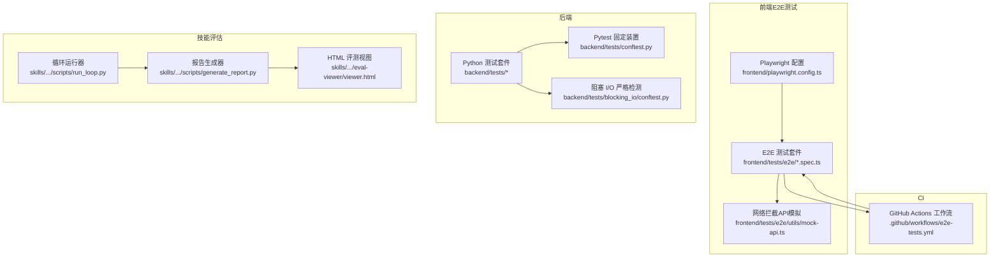
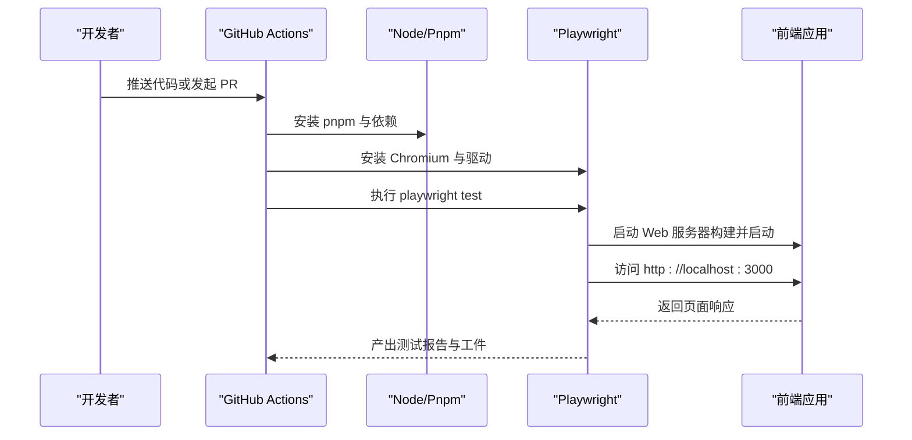
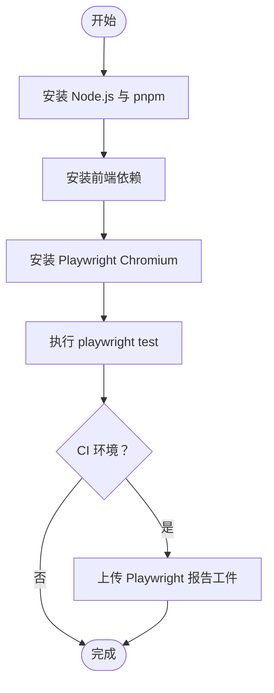
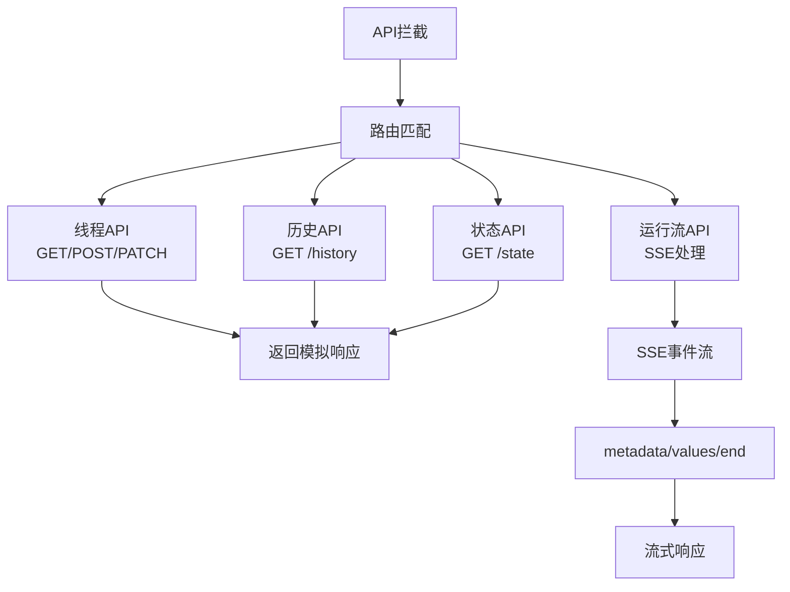
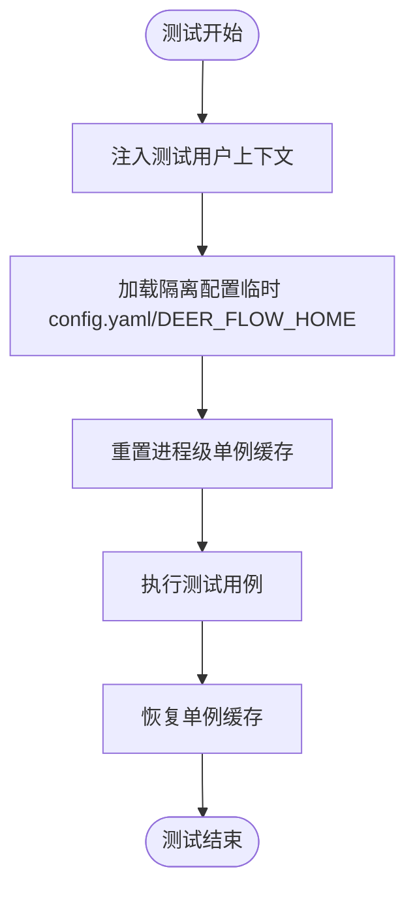
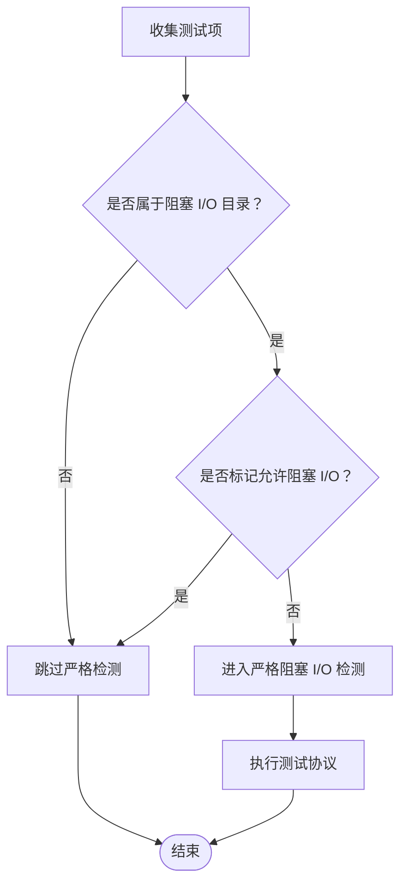
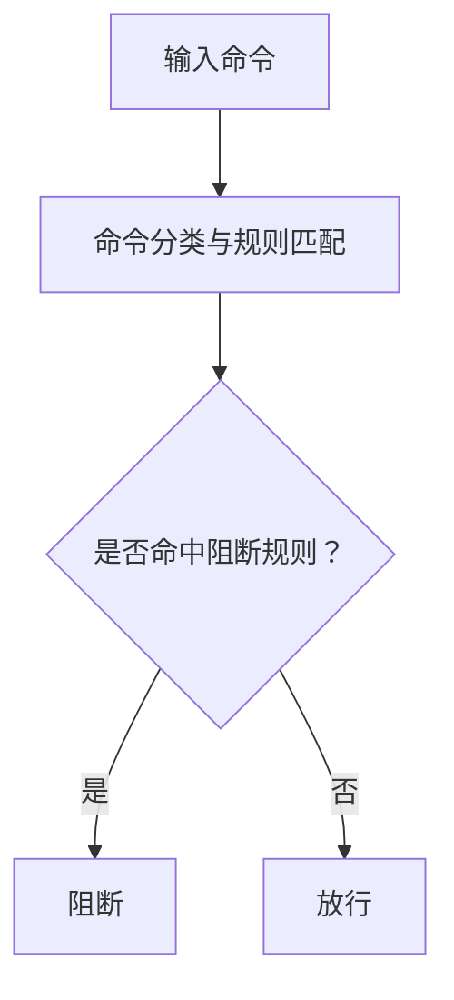
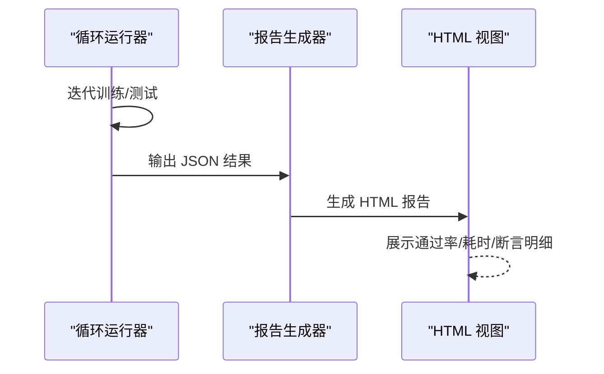
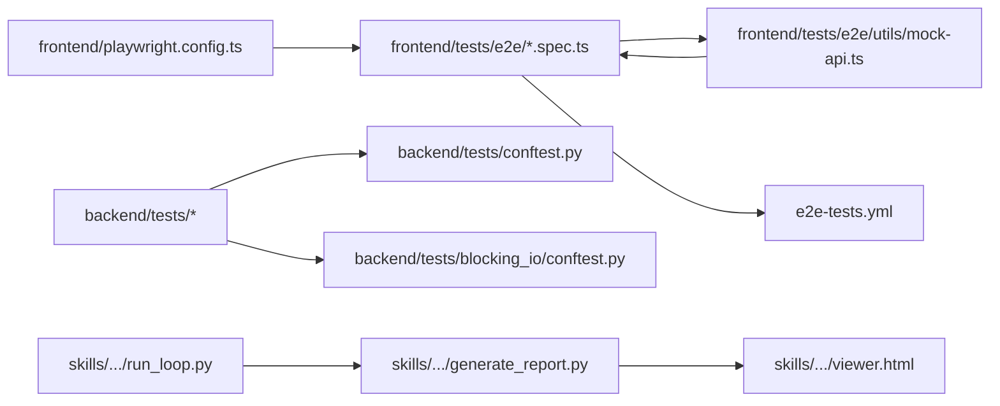

# 测试自动化

<cite>
**本文引用的文件**
- [playwright.config.ts](file://frontend/playwright.config.ts)
- [e2e-tests.yml](file://.github/workflows/e2e-tests.yml)
- [mock-api.ts](file://frontend/tests/e2e/utils/mock-api.ts)
- [agent-chat.spec.ts](file://frontend/tests/e2e/agent-chat.spec.ts)
- [chat.spec.ts](file://frontend/tests/e2e/chat.spec.ts)
- [landing.spec.ts](file://frontend/tests/e2e/landing.spec.ts)
- [sidebar.spec.ts](file://frontend/tests/e2e/sidebar.spec.ts)
- [thread-history.spec.ts](file://frontend/tests/e2e/thread-history.spec.ts)
- [artifact-preview.spec.ts](file://frontend/tests/e2e/artifact-preview.spec.ts)
- [chat-thread-init-ordering.spec.ts](file://frontend/tests/e2e/chat-thread-init-ordering.spec.ts)
- [thread-history-mermaid.spec.ts](file://frontend/tests/e2e/thread-history-mermaid.spec.ts)
- [conftest.py](file://backend/tests/conftest.py)
- [blocking_io/conftest.py](file://backend/tests/blocking_io/conftest.py)
- [test_runtime_lifecycle_e2e.py](file://backend/tests/test_runtime_lifecycle_e2e.py)
- [extensions_config.py](file://backend/packages/harness/deerflow/config/extensions_config.py)
- [test_sandbox_audit_middleware.py](file://backend/tests/test_sandbox_audit_middleware.py)
- [test_loop_detection_middleware.py](file://backend/tests/test_loop_detection_middleware.py)
- [run_loop.py](file://skills/public/skill-creator/scripts/run_loop.py)
- [generate_report.py](file://skills/public/skill-creator/scripts/generate_report.py)
- [viewer.html](file://skills/public/skill-creator/eval-viewer/viewer.html)
</cite>

## 更新摘要
**所做更改**
- 新增完整的Playwright E2E测试框架章节，包含14个测试用例的详细说明
- 添加网络拦截API模拟和SSE流处理的测试基础设施
- 更新CI集成配置和测试执行流程
- 扩展测试套件覆盖聊天、侧边栏、线程历史、工件预览等关键功能
- 新增请求顺序测试和Mermaid图表渲染测试

## 目录
1. [引言](#引言)
2. [项目结构](#项目结构)
3. [核心组件](#核心组件)
4. [架构总览](#架构总览)
5. [详细组件分析](#详细组件分析)
6. [依赖关系分析](#依赖关系分析)
7. [性能考量](#性能考量)
8. [故障排查指南](#故障排查指南)
9. [结论](#结论)
10. [附录](#附录)

## 引言
本文件面向 DeerFlow 测试自动化体系，系统性梳理后端 Python 单元/集成测试、前端 Playwright 端到端测试、以及技能评估与报告生成的自动化流程。内容覆盖：测试脚本编写与维护、持续集成流水线、测试环境自动化配置、测试数据与结果的自动生成与分析，并给出回归测试、性能测试与安全测试的实践建议与最佳实践。

**更新** 新增完整的Playwright E2E测试框架，包含14个测试用例、网络拦截API模拟、CI集成等完整测试基础设施。

## 项目结构
- 前端测试位于 frontend/tests/e2e，采用 Playwright 进行端到端测试；Playwright 配置集中于 frontend/playwright.config.ts。
- 后端测试位于 backend/tests，包含大量单元与集成测试，配合 pytest 固定装置（fixture）与严格阻塞 I/O 检测。
- 技能评估与报告生成位于 skills/public/skill-creator，包含循环训练/评测运行器与 HTML 报告生成器。

**图表来源**
- [playwright.config.ts:1-34](file://frontend/playwright.config.ts#L1-L34)
- [e2e-tests.yml:1-64](file://.github/workflows/e2e-tests.yml#L1-L64)
- [mock-api.ts:1-262](file://frontend/tests/e2e/utils/mock-api.ts#L1-L262)

**章节来源**
- [playwright.config.ts:1-34](file://frontend/playwright.config.ts#L1-L34)
- [.github/workflows/e2e-tests.yml:1-64](file://.github/workflows/e2e-tests.yml#L1-L64)

## 核心组件
- 前端 E2E 测试与 CI 集成：通过 GitHub Actions 在 Ubuntu 环境安装 Node.js、pnpm、Playwright 依赖并执行测试，支持上传 Playwright 报告制品。
- 网络拦截API模拟：提供完整的LangGraph后端API拦截功能，包括线程管理、代理列表、消息流处理等，确保测试独立运行。
- SSE流处理：实现最小化的SSE事件流，模拟AI响应和消息传递过程。
- 后端 Python 测试与固定装置：提供自动注入用户上下文、隔离配置缓存、重置进程级单例等能力，确保测试隔离与稳定性。
- 阻塞 I/O 严格检测：对特定测试目录启用严格阻塞 I/O 检测，防止异步生命周期中的阻塞调用影响测试稳定性。
- 技能评估与报告：提供循环训练/评测运行器与 HTML 报告生成器，支持按配置对比、断言明细与可视化展示。

**章节来源**
- [e2e-tests.yml:1-64](file://.github/workflows/e2e-tests.yml#L1-L64)
- [mock-api.ts:1-262](file://frontend/tests/e2e/utils/mock-api.ts#L1-L262)
- [conftest.py:113-139](file://backend/tests/conftest.py#L113-L139)
- [blocking_io/conftest.py:1-37](file://backend/tests/blocking_io/conftest.py#L1-L37)
- [run_loop.py:112-137](file://skills/public/skill-creator/scripts/run_loop.py#L112-L137)
- [generate_report.py:272-309](file://skills/public/skill-creator/scripts/generate_report.py#L272-L309)
- [viewer.html:1156-1283](file://skills/public/skill-creator/eval-viewer/viewer.html#L1156-L1283)

## 架构总览
下图展示了从本地开发到 CI 的测试执行路径，以及 Playwright 如何启动前端服务并执行端到端测试。

**图表来源**
- [e2e-tests.yml:28-64](file://.github/workflows/e2e-tests.yml#L28-L64)
- [playwright.config.ts:24-33](file://frontend/playwright.config.ts#L24-L33)

## 详细组件分析

### 前端 E2E 测试与 Playwright 配置
- 配置要点
  - 测试目录与并行策略：使用 fullyParallel、retries、workers 控制测试并行度与重试。
  - 报告器选择：CI 环境使用 github 报告器，本地使用 html 报告器。
  - 超时与追踪：统一超时时间与首次重试时开启 trace。
  - 设备与浏览器：默认使用 Desktop Chrome。
  - Web 服务器：本地开发时复用现有服务，CI 环境通过 pnpm 构建并启动。
- CI 集成
  - 使用 actions/checkout 获取源码。
  - actions/setup-node 与 corepack 激活 pnpm 版本。
  - 安装依赖后执行 npx playwright install chromium --with-deps。
  - 运行 pnpm exec playwright test 并上传 playwright-report 工件。

**图表来源**
- [e2e-tests.yml:28-64](file://.github/workflows/e2e-tests.yml#L28-L64)
- [playwright.config.ts:1-34](file://frontend/playwright.config.ts#L1-L34)

**章节来源**
- [playwright.config.ts:1-34](file://frontend/playwright.config.ts#L1-L34)
- [.github/workflows/e2e-tests.yml:1-64](file://.github/workflows/e2e-tests.yml#L1-L64)

### 网络拦截API模拟与SSE流处理
- API拦截范围
  - 完整覆盖LangGraph后端API：线程搜索、创建、更新、历史查询、状态获取、运行流等。
  - 代理管理：代理列表获取和单个代理详情查询。
  - SSE流处理：最小化的事件流响应，包含元数据、消息值和结束事件。
- 拦截策略
  - 使用page.route方法拦截所有LangGraph API端点。
  - 支持不同HTTP方法的差异化响应。
  - 提供确定性的ID生成，确保测试一致性。
- SSE流实现
  - 事件类型：metadata、values、end。
  - 数据格式：符合LangGraph SDK解析要求。
  - 响应内容：标准AI消息"Hello from DeerFlow!"。

**图表来源**
- [mock-api.ts:50-216](file://frontend/tests/e2e/utils/mock-api.ts#L50-L216)
- [mock-api.ts:226-261](file://frontend/tests/e2e/utils/mock-api.ts#L226-L261)

**章节来源**
- [mock-api.ts:1-262](file://frontend/tests/e2e/utils/mock-api.ts#L1-L262)

### 完整E2E测试套件分析
- 测试用例数量：共14个测试用例，覆盖核心功能模块
- 测试分类：
  - 聊天功能：新聊天页面、消息输入、发送消息、AI响应显示
  - 导航功能：侧边栏导航、代理页面访问、页面跳转验证
  - 线程管理：线程历史显示、线程切换、历史消息加载
  - 工件预览：HTML、Markdown、JSON等不同类型工件的预览
  - 请求顺序：首次发送时的API请求顺序保证
  - Mermaid图表：历史运行消息中的Mermaid图表渲染

**章节来源**
- [agent-chat.spec.ts:1-47](file://frontend/tests/e2e/agent-chat.spec.ts#L1-L47)
- [chat.spec.ts:1-52](file://frontend/tests/e2e/chat.spec.ts#L1-L52)
- [landing.spec.ts:1-33](file://frontend/tests/e2e/landing.spec.ts#L1-L33)
- [sidebar.spec.ts:1-33](file://frontend/tests/e2e/sidebar.spec.ts#L1-L33)
- [thread-history.spec.ts:1-77](file://frontend/tests/e2e/thread-history.spec.ts#L1-L77)
- [artifact-preview.spec.ts:1-175](file://frontend/tests/e2e/artifact-preview.spec.ts#L1-L175)
- [chat-thread-init-ordering.spec.ts:1-116](file://frontend/tests/e2e/chat-thread-init-ordering.spec.ts#L1-L116)
- [thread-history-mermaid.spec.ts:1-92](file://frontend/tests/e2e/thread-history-mermaid.spec.ts#L1-L92)

### 后端 Python 测试与固定装置
- 自动用户上下文注入
  - 通过 autouse fixture 注入默认测试用户上下文，支持通过标记禁用。
  - 依赖延迟导入以避免未使用持久层的测试产生额外开销。
- 配置缓存与进程单例重置
  - 在 E2E 生命周期测试中，显式重置应用配置、扩展配置、路径、数据库引擎与认证提供者等进程级单例，防止测试间污染。
  - 提供扩展配置的 reset/set 辅助函数，便于测试切换配置。

**图表来源**
- [conftest.py:113-139](file://backend/tests/conftest.py#L113-L139)
- [test_runtime_lifecycle_e2e.py:175-223](file://backend/tests/test_runtime_lifecycle_e2e.py#L175-L223)
- [extensions_config.py:246-266](file://backend/packages/harness/deerflow/config/extensions_config.py#L246-L266)

**章节来源**
- [conftest.py:113-139](file://backend/tests/conftest.py#L113-L139)
- [test_runtime_lifecycle_e2e.py:175-223](file://backend/tests/test_runtime_lifecycle_e2e.py#L175-L223)
- [extensions_config.py:246-266](file://backend/packages/harness/deerflow/config/extensions_config.py#L246-L266)

### 阻塞 I/O 严格检测
- 作用范围
  - 仅对 backend/tests/blocking_io 目录下的测试启用严格阻塞 I/O 检测。
  - 支持通过标记允许阻塞 I/O 的测试项绕过检测。
- 实现机制
  - 通过 pytest hookwrapper 包裹整个测试协议（setup/call/teardown），在严格模式下捕获阻塞 I/O。

**图表来源**
- [blocking_io/conftest.py:1-37](file://backend/tests/blocking_io/conftest.py#L1-L37)

**章节来源**
- [blocking_io/conftest.py:1-37](file://backend/tests/blocking_io/conftest.py#L1-L37)

### 安全测试自动化（沙箱审计中间件）
- 测试目标
  - 对命令分类进行"放行/阻断"判定，覆盖常见安全场景与规避误报的保护逻辑。
- 断言要点
  - 安全命令应被判定为"pass"，部分可能触发误报的命令需保持"pass"。
  - 复合命令按子命令拆分处理，确保粒度正确。

**图表来源**
- [test_sandbox_audit_middleware.py:157-186](file://backend/tests/test_sandbox_audit_middleware.py#L157-L186)

**章节来源**
- [test_sandbox_audit_middleware.py:157-186](file://backend/tests/test_sandbox_audit_middleware.py#L157-L186)

### 性能测试自动化（循环训练/评测与报告）
- 循环运行器
  - 支持迭代训练与测试集评估，输出每轮通过数、失败数与总数，并保留历史记录。
- 报告生成器
  - 将 run_loop 输出转换为 HTML 报告，包含通过率、耗时、断言明细等。
- HTML 视图
  - 提供配置对比表、平均行与断言明细表格，支持按配置分组与排序。

**图表来源**
- [run_loop.py:112-137](file://skills/public/skill-creator/scripts/run_loop.py#L112-L137)
- [generate_report.py:272-309](file://skills/public/skill-creator/scripts/generate_report.py#L272-L309)
- [viewer.html:1156-1283](file://skills/public/skill-creator/eval-viewer/viewer.html#L1156-L1283)

**章节来源**
- [run_loop.py:112-137](file://skills/public/skill-creator/scripts/run_loop.py#L112-L137)
- [generate_report.py:272-309](file://skills/public/skill-creator/scripts/generate_report.py#L272-L309)
- [viewer.html:1156-1283](file://skills/public/skill-creator/eval-viewer/viewer.html#L1156-L1283)

### 回归测试自动化（基于 Playwright）
- 基于 Playwright 的 E2E 测试套件覆盖聊天、侧边栏、线程历史等关键交互。
- CI 中自动安装依赖并执行，确保每次变更在受控环境中回归验证。
- 网络拦截确保测试独立性，不依赖真实后端服务。

**章节来源**
- [playwright.config.ts:1-34](file://frontend/playwright.config.ts#L1-L34)
- [.github/workflows/e2e-tests.yml:1-64](file://.github/workflows/e2e-tests.yml#L1-L64)

### 请求顺序测试与并发控制
- 测试目的：防止首次发送时的竞态条件，确保API调用顺序正确
- 实现方式：通过事件日志记录请求发送和完成时间，验证POST /runs/stream先于GET /history和GET /runs触发
- 并发控制：使用setTimeout延缓SSE流响应，扩大竞态窗口以便发现潜在问题

**章节来源**
- [chat-thread-init-ordering.spec.ts:1-116](file://frontend/tests/e2e/chat-thread-init-ordering.spec.ts#L1-L116)

### Mermaid图表渲染测试
- 测试内容：历史运行消息中的Mermaid图表正确渲染
- 实现方式：拦截/runs接口返回包含Mermaid内容的消息，验证图表标签可见且无错误
- 覆盖场景：关系图、流程图等不同类型的Mermaid图表

**章节来源**
- [thread-history-mermaid.spec.ts:1-92](file://frontend/tests/e2e/thread-history-mermaid.spec.ts#L1-L92)

## 依赖关系分析
- 前端测试依赖 Playwright 驱动与本地/CI 环境的 Node.js/pnpm。
- 网络拦截API模拟依赖Playwright的page.route功能和SSE流处理。
- 后端测试依赖 pytest、隔离配置与进程单例重置机制。
- 技能评估依赖 Python 脚本与 HTML 渲染工具链。

**图表来源**
- [playwright.config.ts:1-34](file://frontend/playwright.config.ts#L1-L34)
- [e2e-tests.yml:1-64](file://.github/workflows/e2e-tests.yml#L1-L64)
- [mock-api.ts:1-262](file://frontend/tests/e2e/utils/mock-api.ts#L1-L262)
- [conftest.py:113-139](file://backend/tests/conftest.py#L113-L139)
- [blocking_io/conftest.py:1-37](file://backend/tests/blocking_io/conftest.py#L1-L37)
- [run_loop.py:112-137](file://skills/public/skill-creator/scripts/run_loop.py#L112-L137)
- [generate_report.py:272-309](file://skills/public/skill-creator/scripts/generate_report.py#L272-L309)
- [viewer.html:1156-1283](file://skills/public/skill-creator/eval-viewer/viewer.html#L1156-L1283)

## 性能考量
- 前端测试
  - 充分利用 fullyParallel 与 workers/retries 参数平衡速度与稳定性。
  - 在 CI 中启用 github 报告器，减少本地资源占用。
  - 网络拦截确保测试独立性，避免外部依赖影响性能。
- 后端测试
  - 通过自动用户上下文与配置缓存重置降低测试间耦合，提升并行度。
  - 严格阻塞 I/O 检测可提前暴露潜在性能问题，但需合理设置测试范围。
- 技能评估
  - 循环运行器输出汇总指标，便于识别性能退化趋势。

## 故障排查指南
- Playwright 报告缺失
  - 检查 CI 步骤是否成功执行 playwright test 与 upload-artifact。
  - 确认 playwright.config.ts 中 webServer.reuseExistingServer 设置与本地/CI 环境差异。
- 测试超时或不稳定
  - 调整 playwright.config.ts 中 timeout 与 retries。
  - 在本地使用 html 报告器定位首失败重试的 trace。
- 网络拦截失效
  - 检查mockLangGraphAPI是否正确导入和调用。
  - 验证API端点匹配模式是否正确，包括通配符使用。
- SSE流处理问题
  - 确认handleRunStream函数正确返回SSE格式数据。
  - 检查事件类型和数据格式是否符合LangGraph SDK要求。
- 阻塞 I/O 导致测试失败
  - 对涉及异步生命周期的测试启用 allow_blocking_io 标记，或重构为非阻塞实现。
- 配置污染导致测试失败
  - 确保测试前后正确重置进程级单例与配置缓存。

**章节来源**
- [.github/workflows/e2e-tests.yml:1-64](file://.github/workflows/e2e-tests.yml#L1-L64)
- [playwright.config.ts:1-34](file://frontend/playwright.config.ts#L1-L34)
- [mock-api.ts:1-262](file://frontend/tests/e2e/utils/mock-api.ts#L1-L262)
- [blocking_io/conftest.py:1-37](file://backend/tests/blocking_io/conftest.py#L1-L37)
- [test_runtime_lifecycle_e2e.py:175-223](file://backend/tests/test_runtime_lifecycle_e2e.py#L175-L223)

## 结论
DeerFlow 已形成从前端 E2E 到后端 Python 测试再到技能评估与报告的完整测试自动化闭环。通过 CI 集成、严格的测试隔离与报告工具，团队可以高效地进行回归、性能与安全测试，持续保障系统质量与交付效率。

**更新** 新增的Playwright E2E测试框架提供了14个覆盖核心功能的测试用例，包括网络拦截API模拟、SSE流处理、请求顺序控制等完整测试基础设施，进一步增强了系统的测试覆盖率和稳定性保障。

## 附录
- 测试工具链建议
  - 前端：Playwright + Next.js 开发服务器，CI 中使用 actions/setup-node 与 corepack。
  - 后端：pytest + 自定义固定装置 + 配置缓存重置。
  - 技能评估：run_loop + generate_report + viewer.html。
- 测试覆盖率与质量度量
  - 可结合后端 pytest 与前端覆盖率工具（如 Playwright 的覆盖率功能）扩展覆盖率统计。
  - 使用报告生成器输出的关键指标（通过率、耗时、断言明细）作为质量度量基线。
- 新增测试基础设施
  - 网络拦截API模拟：支持14个主要API端点的拦截和响应。
  - SSE流处理：完整的事件流模拟和错误处理。
  - 请求顺序测试：防止竞态条件的顺序验证机制。
  - 多格式工件预览：HTML、Markdown、JSON等不同类型工件的预览测试。