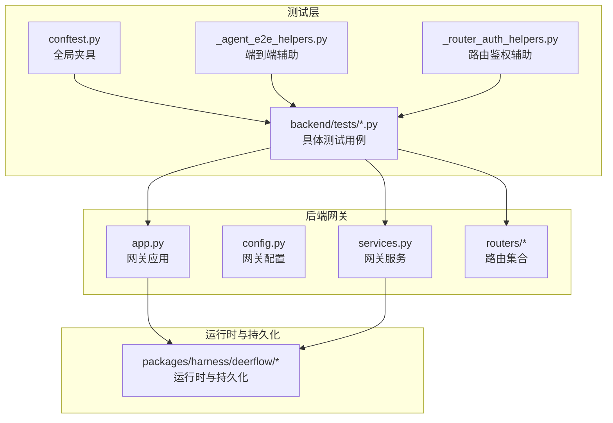
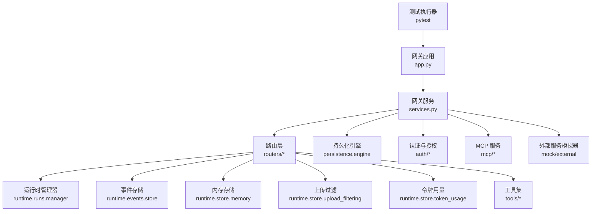
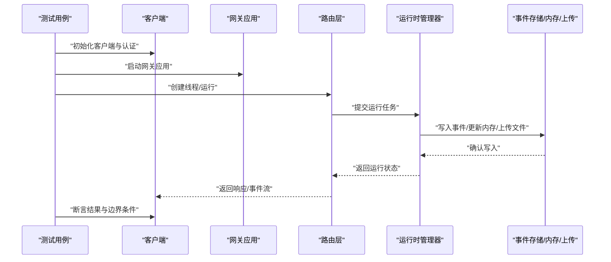
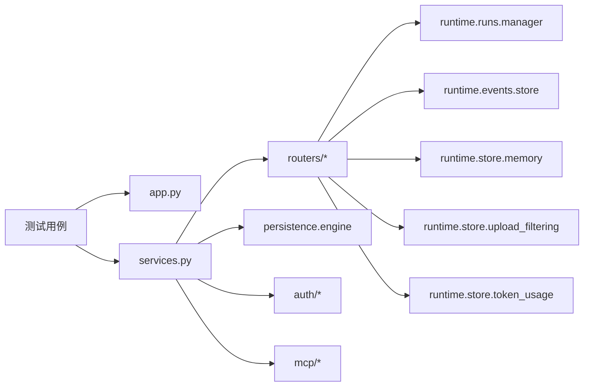

# 集成测试

<cite>
**本文引用的文件**
- [backend/tests/conftest.py](file://backend/tests/conftest.py)
- [backend/tests/_agent_e2e_helpers.py](file://backend/tests/_agent_e2e_helpers.py)
- [backend/tests/_router_auth_helpers.py](file://backend/tests/_router_auth_helpers.py)
- [backend/tests/test_client_e2e.py](file://backend/tests/test_client_e2e.py)
- [backend/tests/test_runtime_lifecycle_e2e.py](file://backend/tests/test_runtime_lifecycle_e2e.py)
- [backend/tests/test_gateway_services.py](file://backend/tests/test_gateway_services.py)
- [backend/tests/test_gateway_lifespan_shutdown.py](file://backend/tests/test_gateway_lifespan_shutdown.py)
- [backend/tests/test_gateway_run_recovery.py](file://backend/tests/test_gateway_run_recovery.py)
- [backend/tests/test_gateway_runtime_cleanup.py](file://backend/tests/test_gateway_runtime_cleanup.py)
- [backend/tests/test_auth.py](file://backend/tests/test_auth.py)
- [backend/tests/test_auth_middleware.py](file://backend/tests/test_auth_middleware.py)
- [backend/tests/test_auth_errors.py](file://backend/tests/test_auth_errors.py)
- [backend/tests/test_auth_type_system.py](file://backend/tests/test_auth_type_system.py)
- [backend/tests/test_auth_config.py](file://backend/tests/test_auth_config.py)
- [backend/tests/test_internal_auth.py](file://backend/tests/test_internal_auth.py)
- [backend/tests/test_langgraph_auth.py](file://backend/tests/test_langgraph_auth.py)
- [backend/tests/test_runs_api_endpoints.py](file://backend/tests/test_runs_api_endpoints.py)
- [backend/tests/test_threads_router.py](file://backend/tests/test_threads_router.py)
- [backend/tests/test_artifacts_router.py](file://backend/tests/test_artifacts_router.py)
- [backend/tests/test_suggestions_router.py](file://backend/tests/test_suggestions_router.py)
- [backend/tests/test_memory_router.py](file://backend/tests/test_memory_router.py)
- [backend/tests/test_uploads_router.py](file://backend/tests/test_uploads_router.py)
- [backend/tests/test_run_event_store.py](file://backend/tests/test_run_event_store.py)
- [backend/tests/test_run_event_store_pagination.py](file://backend/tests/test_run_event_store_pagination.py)
- [backend/tests/test_run_journal.py](file://backend/tests/test_run_journal.py)
- [backend/tests/test_run_manager.py](file://backend/tests/test_run_manager.py)
- [backend/tests/test_run_repository.py](file://backend/tests/test_run_repository.py)
- [backend/tests/test_cancel_run_idempotent.py](file://backend/tests/test_cancel_run_idempotent.py)
- [backend/tests/test_memory_storage.py](file://backend/tests/test_memory_storage.py)
- [backend/tests/test_memory_storage_user_isolation.py](file://backend/tests/test_memory_storage_user_isolation.py)
- [backend/tests/test_memory_thread_meta_isolation.py](file://backend/tests/test_memory_thread_meta_isolation.py)
- [backend/tests/test_memory_updater.py](file://backend/tests/test_memory_updater.py)
- [backend/tests/test_memory_updater_user_isolation.py](file://backend/tests/test_memory_updater_user_isolation.py)
- [backend/tests/test_memory_queue.py](file://backend/tests/test_memory_queue.py)
- [backend/tests/test_memory_upload_filtering.py](file://backend/tests/test_memory_upload_filtering.py)
- [backend/tests/test_memory_prompt_injection.py](file://backend/tests/test_memory_prompt_injection.py)
- [backend/tests/test_memory_router.py](file://backend/tests/test_memory_router.py)
- [backend/tests/test_channels.py](file://backend/tests/test_channels.py)
- [backend/tests/test_channel_file_attachments.py](file://backend/tests/test_channel_file_attachments.py)
- [backend/tests/test_dingtalk_channel.py](file://backend/tests/test_dingtalk_channel.py)
- [backend/tests/test_discord_channel.py](file://backend/tests/test_discord_channel.py)
- [backend/tests/test_feishu_parser.py](file://backend/tests/test_feishu_parser.py)
- [backend/tests/test_wechat_channel.py](file://backend/tests/test_wechat_channel.py)
- [backend/tests/test_client.py](file://backend/tests/test_client.py)
- [backend/tests/test_client_live.py](file://backend/tests/test_client_live.py)
- [backend/tests/test_client_message_serialization.py](file://backend/tests/test_client_message_serialization.py)
- [backend/tests/test_client_langfuse_metadata.py](file://backend/tests/test_client_langfuse_metadata.py)
- [backend/tests/test_setup_agent_e2e_user_isolation.py](file://backend/tests/test_setup_agent_e2e_user_isolation.py)
- [backend/tests/test_update_agent_e2e_user_isolation.py](file://backend/tests/test_update_agent_e2e_user_isolation.py)
- [backend/tests/test_setup_agent_http_e2e_real_server.py](file://backend/tests/test_setup_agent_http_e2e_real_server.py)
- [backend/tests/test_sandbox_orphan_reconciliation_e2e.py](file://backend/tests/test_sandbox_orphan_reconciliation_e2e.py)
- [backend/tests/test_safety_termination_detectors.py](file://backend/tests/test_safety_termination_detectors.py)
- [backend/tests/test_safety_finish_reason_middleware.py](file://backend/tests/test_safety_finish_reason_middleware.py)
- [backend/tests/test_safety_finish_reason_graph_integration.py](file://backend/tests/test_safety_finish_reason_graph_integration.py)
- [backend/tests/test_guardrail_middleware.py](file://backend/tests/test_guardrail_middleware.py)
- [backend/tests/test_summarization_middleware.py](file://backend/tests/test_summarization_middleware.py)
- [backend/tests/test_token_usage_middleware.py](file://backend/tests/test_token_usage_middleware.py)
- [backend/tests/test_thread_data_middleware.py](file://backend/tests/test_thread_data_middleware.py)
- [backend/tests/test_tool_error_handling_middleware.py](file://backend/tests/test_tool_error_handling_middleware.py)
- [backend/tests/test_llm_error_handling_middleware.py](file://backend/tests/test_llm_error_handling_middleware.py)
- [backend/tests/test_subagent_limit_middleware.py](file://backend/tests/test_subagent_limit_middleware.py)
- [backend/tests/test_subagent_timeout_config.py](file://backend/tests/test_subagent_timeout_config.py)
- [backend/tests/test_subagent_skills_config.py](file://backend/tests/test_subagent_skills_config.py)
- [backend/tests/test_subagent_prompt_security.py](file://backend/tests/test_subagent_prompt_security.py)
- [backend/tests/test_subagent_token_collector.py](file://backend/tests/test_subagent_token_collector.py)
- [backend/tests/test_sandbox_middleware.py](file://backend/tests/test_sandbox_middleware.py)
- [backend/tests/test_sandbox_audit_middleware.py](file://backend/tests/test_sandbox_audit_middleware.py)
- [backend/tests/test_sandbox_search_tools.py](file://backend/tests/test_sandbox_search_tools.py)
- [backend/tests/test_sandbox_tools_security.py](file://backend/tests/test_sandbox_tools_security.py)
- [backend/tests/test_aio_sandbox.py](file://backend/tests/test_aio_sandbox.py)
- [backend/tests/test_aio_sandbox_local_backend.py](file://backend/tests/test_aio_sandbox_local_backend.py)
- [backend/tests/test_aio_sandbox_provider.py](file://backend/tests/test_aio_sandbox_provider.py)
- [backend/tests/test_aio_sandbox_readiness.py](file://backend/tests/test_aio_sandbox_readiness.py)
- [backend/tests/test_local_sandbox_provider_mounts.py](file://backend/tests/test_local_sandbox_provider_mounts.py)
- [backend/tests/test_local_sandbox_virtual_path_contract.py](file://backend/tests/test_local_sandbox_virtual_path_contract.py)
- [backend/tests/test_local_sandbox_encoding.py](file://backend/tests/test_local_sandbox_encoding.py)
- [backend/tests/test_local_skill_storage_write.py](file://backend/tests/test_local_skill_storage_write.py)
- [backend/tests/test_skills_loader.py](file://backend/tests/test_skills_loader.py)
- [backend/tests/test_skills_parser.py](file://backend/tests/test_skills_parser.py)
- [backend/tests/test_skills_validation.py](file://backend/tests/test_skills_validation.py)
- [backend/tests/test_skills_custom_router.py](file://backend/tests/test_skills_custom_router.py)
- [backend/tests/test_skills_installer.py](file://backend/tests/test_skills_installer.py)
- [backend/tests/test_skills_bundled.py](file://backend/tests/test_skills_bundled.py)
- [backend/tests/test_skills_archive_root.py](file://backend/tests/test_skills_archive_root.py)
- [backend/tests/test_skill_manage_tool.py](file://backend/tests/test_skill_manage_tool.py)
- [backend/tests/test_skill_permissions.py](file://backend/tests/test_skill_permissions.py)
- [backend/tests/test_tool_search.py](file://backend/tests/test_tool_search.py)
- [backend/tests/test_task_tool_core_logic.py](file://backend/tests/test_task_tool_core_logic.py)
- [backend/tests/test_present_file_tool_core_logic.py](file://backend/tests/test_present_file_tool_core_logic.py)
- [backend/tests/test_view_image_tool.py](file://backend/tests/test_view_image_tool.py)
- [backend/tests/test_view_image_middleware.py](file://backend/tests/test_view_image_middleware.py)
- [backend/tests/test_token_usage.py](file://backend/tests/test_token_usage.py)
- [backend/tests/test_token_usage_config.py](file://backend/tests/test_token_usage_config.py)
- [backend/tests/test_thread_token_usage.py](file://backend/tests/test_thread_token_usage.py)
- [backend/tests/test_thread_run_messages_pagination.py](file://backend/tests/test_thread_run_messages_pagination.py)
- [backend/tests/test_thread_state_reducers.py](file://backend/tests/test_thread_state_reducers.py)
- [backend/tests/test_thread_meta_repo.py](file://backend/tests/test_thread_meta_repo.py)
- [backend/tests/test_serialization.py](file://backend/tests/test_serialization.py)
- [backend/tests/test_serialize_message_content.py](file://backend/tests/test_serialize_message_content.py)
- [backend/tests/test_file_conversion.py](file://backend/tests/test_file_conversion.py)
- [backend/tests/test_uploads_manager.py](file://backend/tests/test_uploads_manager.py)
- [backend/tests/test_uploads_middleware_core_logic.py](file://backend/tests/test_uploads_middleware_core_logic.py)
- [backend/tests/test_uploads_router.py](file://backend/tests/test_uploads_router.py)
- [backend/tests/test_user_context.py](file://backend/tests/test_user_context.py)
- [backend/tests/test_utils_time.py](file://backend/tests/test_utils_time.py)
- [backend/tests/test_model_config.py](file://backend/tests/test_model_config.py)
- [backend/tests/test_model_factory.py](file://backend/tests/test_model_factory.py)
- [backend/tests/test_patched_openai.py](file://backend/tests/test_patched_openai.py)
- [backend/tests/test_patched_deepseek.py](file://backend/tests/test_patched_deepseek.py)
- [backend/tests/test_patched_mimo.py](file://backend/tests/test_patched_mimo.py)
- [backend/tests/test_patched_minimax.py](file://backend/tests/test_patched_minimax.py)
- [backend/tests/test_vllm_provider.py](file://backend/tests/test_vllm_provider.py)
- [backend/tests/test_claude_provider_oauth_billing.py](file://backend/tests/test_claude_provider_oauth_billing.py)
- [backend/tests/test_claude_provider_prompt_caching.py](file://backend/tests/test_claude_provider_prompt_caching.py)
- [backend/tests/test_mcp_client_config.py](file://backend/tests/test_mcp_client_config.py)
- [backend/tests/test_mcp_config_secrets.py](file://backend/tests/test_mcp_config_secrets.py)
- [backend/tests/test_mcp_custom_interceptors.py](file://backend/tests/test_mcp_custom_interceptors.py)
- [backend/tests/test_mcp_oauth.py](file://backend/tests/test_mcp_oauth.py)
- [backend/tests/test_mcp_session_pool.py](file://backend/tests/test_mcp_session_pool.py)
- [backend/tests/test_mcp_sync_wrapper.py](file://backend/tests/test_mcp_sync_wrapper.py)
- [backend/tests/test_credential_loader.py](file://backend/tests/test_credential_loader.py)
- [backend/tests/test_openapi_operation_ids.py](file://backend/tests/test_openapi_operation_ids.py)
- [backend/tests/test_tracing_config.py](file://backend/tests/test_tracing_config.py)
- [backend/tests/test_tracing_factory.py](file://backend/tests/test_tracing_factory.py)
- [backend/tests/test_tracing_metadata.py](file://backend/tests/test_tracing_metadata.py)
- [backend/tests/test_sse_format.py](file://backend/tests/test_sse_format.py)
- [backend/tests/test_wait_disconnect_handling.py](file://backend/tests/test_wait_disconnect_handling.py)
- [backend/tests/test_jsonl_event_store_async_io.py](file://backend/tests/test_jsonl_event_store_async_io.py)
- [backend/tests/test_jsonl_run_event_store.py](file://backend/tests/test_jsonl_run_event_store.py)
- [backend/tests/test_sqlite_lifespan.py](file://backend/tests/test_sqlite_lifespan.py)
- [backend/tests/test_check_script.py](file://backend/tests/test_check_script.py)
- [backend/tests/test_detect_blocking_io_static.py](file://backend/tests/test_detect_blocking_io_static.py)
- [backend/tests/test_detect_thread_boundaries.py](file://backend/tests/test_detect_thread_boundaries.py)
- [backend/tests/test_detect_uv_extras.py](file://backend/tests/test_detect_uv_extras.py)
- [backend/tests/test_blocking_io_suite.py](file://backend/tests/blocking_io/test_gate_smoke.py)
- [backend/tests/test_blocking_io_suite.py](file://backend/tests/blocking_io/test_skills_load.py)
- [backend/tests/test_blocking_io_suite.py](file://backend/tests/blocking_io/test_uploads_middleware.py)
- [backend/tests/test_blocking_io_suite.py](file://backend/tests/blocking_io/test_jsonl_run_event_store.py)
- [backend/tests/test_blocking_io_suite.py](file://backend/tests/blocking_io/test_sqlite_lifespan.py)
- [backend/tests/support/__init__.py](file://backend/tests/support/__init__.py)
- [backend/app/gateway/app.py](file://backend/app/gateway/app.py)
- [backend/app/gateway/config.py](file://backend/app/gateway/config.py)
- [backend/app/gateway/services.py](file://backend/app/gateway/services.py)
- [backend/app/gateway/routers/agents.py](file://backend/app/gateway/routers/agents.py)
- [backend/app/gateway/routers/runs.py](file://backend/app/gateway/routers/runs.py)
- [backend/app/gateway/routers/threads.py](file://backend/app/gateway/routers/threads.py)
- [backend/app/gateway/routers/artifacts.py](file://backend/app/gateway/routers/artifacts.py)
- [backend/app/gateway/routers/suggestions.py](file://backend/app/gateway/routers/suggestions.py)
- [backend/app/gateway/routers/memory.py](file://backend/app/gateway/routers/memory.py)
- [backend/app/gateway/routers/uploads.py](file://backend/app/gateway/routers/uploads.py)
- [backend/app/gateway/auth/models.py](file://backend/app/gateway/auth/models.py)
- [backend/app/gateway/auth/jwt.py](file://backend/app/gateway/auth/jwt.py)
- [backend/app/gateway/auth/providers.py](file://backend/app/gateway/auth/providers.py)
- [backend/app/gateway/auth/credential_file.py](file://backend/app/gateway/auth/credential_file.py)
- [backend/app/gateway/auth/local_provider.py](file://backend/app/gateway/auth/local_provider.py)
- [backend/app/gateway/auth/password.py](file://backend/app/gateway/auth/password.py)
- [backend/app/gateway/auth/reset_admin.py](file://backend/app/gateway/auth/reset_admin.py)
- [backend/app/gateway/auth/errors.py](file://backend/app/gateway/auth/errors.py)
- [backend/packages/harness/deerflow/persistence/engine.py](file://backend/packages/harness/deerflow/persistence/engine.py)
- [backend/packages/harness/deerflow/persistence/base.py](file://backend/packages/harness/deerflow/persistence/base.py)
- [backend/packages/harness/deerflow/persistence/migrations/versions/](file://backend/packages/harness/deerflow/persistence/migrations/versions/)
- [backend/packages/harness/deerflow/runtime/runs/manager.py](file://backend/packages/harness/deerflow/runtime/runs/manager.py)
- [backend/packages/harness/deerflow/runtime/runs/repository.py](file://backend/packages/harness/deerflow/runtime/runs/repository.py)
- [backend/packages/harness/deerflow/runtime/events/store.py](file://backend/packages/harness/deerflow/runtime/events/store.py)
- [backend/packages/harness/deerflow/runtime/checkpointer/checkpointer.py](file://backend/packages/harness/deerflow/runtime/checkpointer/checkpointer.py)
- [backend/packages/harness/deerflow/runtime/store/memory.py](file://backend/packages/harness/deerflow/runtime/store/memory.py)
- [backend/packages/harness/deerflow/runtime/store/thread_meta.py](file://backend/packages/harness/deerflow/runtime/store/thread_meta.py)
- [backend/packages/harness/deerflow/runtime/store/updater.py](file://backend/packages/harness/deerflow/runtime/store/updater.py)
- [backend/packages/harness/deerflow/runtime/store/queue.py](file://backend/packages/harness/deerflow/runtime/store/queue.py)
- [backend/packages/harness/deerflow/runtime/store/upload_filtering.py](file://backend/packages/harness/deerflow/runtime/store/upload_filtering.py)
- [backend/packages/harness/deerflow/runtime/store/prompt_injection.py](file://backend/packages/harness/deerflow/runtime/store/prompt_injection.py)
- [backend/packages/harness/deerflow/runtime/store/user_isolation.py](file://backend/packages/harness/deerflow/runtime/store/user_isolation.py)
- [backend/packages/harness/deerflow/runtime/store/token_usage.py](file://backend/packages/harness/deerflow/runtime/store/token_usage.py)
- [backend/packages/harness/deerflow/runtime/store/thread_token_usage.py](file://backend/packages/harness/deerflow/runtime/store/thread_token_usage.py)
- [backend/packages/harness/deerflow/runtime/store/thread_run_messages_pagination.py](file://backend/packages/harness/deerflow/runtime/store/thread_run_messages_pagination.py)
- [backend/packages/harness/deerflow/runtime/store/thread_state_reducers.py](file://backend/packages/harness/deerflow/runtime/store/thread_state_reducers.py)
- [backend/packages/harness/deerflow/runtime/store/thread_meta_repo.py](file://backend/packages/harness/deerflow/runtime/store/thread_meta_repo.py)
- [backend/packages/harness/deerflow/runtime/store/serialization.py](file://backend/packages/harness/deerflow/runtime/store/serialization.py)
- [backend/packages/harness/deerflow/runtime/store/converters.py](file://backend/packages/harness/deerflow/runtime/store/converters.py)
- [backend/packages/harness/deerflow/runtime/store/utils/time.py](file://backend/packages/harness/deerflow/runtime/store/utils/time.py)
- [backend/packages/harness/deerflow/runtime/store/tools/search.py](file://backend/packages/harness/deerflow/runtime/store/tools/search.py)
- [backend/packages/harness/deerflow/runtime/store/tools/task.py](file://backend/packages/harness/deerflow/runtime/store/tools/task.py)
- [backend/packages/harness/deerflow/runtime/store/tools/present_file.py](file://backend/packages/harness/deerflow/runtime/store/tools/present_file.py)
- [backend/packages/harness/deerflow/runtime/store/tools/view_image.py](file://backend/packages/harness/deerflow/runtime/store/tools/view_image.py)
- [backend/packages/harness/deerflow/runtime/store/tools/token_usage.py](file://backend/packages/harness/deerflow/runtime/store/tools/token_usage.py)
- [backend/packages/harness/deerflow/runtime/store/tools/thread_token_usage.py](file://backend/packages/harness/deerflow/runtime/store/tools/thread_token_usage.py)
- [backend/packages/harness/deerflow/runtime/store/tools/thread_run_messages_pagination.py](file://backend/packages/harness/deerflow/runtime/store/tools/thread_run_messages_pagination.py)
- [backend/packages/harness/deerflow/runtime/store/tools/thread_state_reducers.py](file://backend/packages/harness/deerflow/runtime/store/tools/thread_state_reducers.py)
- [backend/packages/harness/deerflow/runtime/store/tools/thread_meta_repo.py](file://backend/packages/harness/deerflow/runtime/store/tools/thread_meta_repo.py)
- [backend/packages/harness/deerflow/runtime/store/tools/serialization.py](file://backend/packages/harness/deerflow/runtime/store/tools/serialization.py)
- [backend/packages/harness/deerflow/runtime/store/tools/converters.py](file://backend/packages/harness/deerflow/runtime/store/tools/converters.py)
- [backend/packages/harness/deerflow/runtime/store/tools/utils/time.py](file://backend/packages/harness/deerflow/runtime/store/tools/utils/time.py)
- [backend/packages/harness/deerflow/runtime/store/tools/utils/__init__.py](file://backend/packages/harness/deerflow/runtime/store/tools/utils/__init__.py)
- [backend/packages/harness/deerflow/runtime/store/tools/utils/__init__.py](file://backend/packages/harness/deerflow/runtime/store/tools/utils/__init__.py)
- [backend/packages/harness/deerflow/runtime/store/tools/utils/__init__.py](file://backend/packages/harness/deerflow/runtime/store/tools/utils/__init__.py)
- [backend/packages/harness/deerflow/runtime/store/tools/utils/__init__.py](file://backend/packages/harness/deerflow/runtime/store/tools/utils/__init__.py)
- [backend/packages/harness/deerflow/runtime/store/tools/utils/__init__.py](file://backend/packages/harness/deerflow/runtime/store/tools/utils/__init__.py)
- [backend/packages/harness/deerflow/runtime/store/tools/utils/__init__.py](file://backend/packages/harness/deerflow/runtime/store/tools/utils/__init__.py)
- [backend/packages/harness/deerflow/runtime/store/tools/utils/__init__.py](file://backend/packages/harness/deerflow/runtime/store/tools/utils/__init__.py)
- [backend/packages/harness/deerflow/runtime/store/tools/utils/__init__.py](file://backend/packages/harness/deerflow/runtime/store/tools/utils/__init__.py)
- [backend/packages/harness/deerflow/runtime/store/tools/utils/__init__.py](file://backend/packages/harness/deerflow/runtime/store/tools/utils/__init__.py)
- [backend/packages/harness/deerflow/runtime/store/tools/utils/__init__.py](file://backend/packages/harness/deerflow/runtime/store/tools/utils/__init__.py)
- [backend/packages/harness/deerflow/runtime/store/tools/utils/__init__.py](file://backend/packages/harness/deerflow/runtime/store/tools/utils/__init__.py)
- [backend/packages/harness/deerflow/runtime/store/tools/utils/__init__.py](file://backend/packages/harness/deerflow/runtime/store/tools/utils/__init__.py)
- [backend/packages/harness/deerflow/runtime/store/tools/utils/__init__.py](file://backend/packages/harness/deerflow/runtime/store/tools/utils/__init__.py)
- [backend/packages/harness/deerflow/runtime/store/tools/utils/__init__.py](file://backend/packages/harness/deerflow/runtime/store/tools/utils/__init__.py)
- [backend......](file://backend/packages/harness/deerflow/runtime/store/tools/utils/__init__.py)
</cite>

## 目录
1. 引言
2. 项目结构
3. 核心组件
4. 架构总览
5. 详细组件分析
6. 依赖关系分析
7. 性能考虑
8. 故障排查指南
9. 结论
10. 附录

## 引言
本文件面向 DeerFlow 的集成测试体系，系统性梳理后端服务集成测试、API 端点测试、持久化层测试以及端到端测试流程（客户端集成、运行时生命周期、网关服务）。文档从测试环境搭建、数据库连接管理、外部服务模拟入手，结合真实数据测试、错误处理测试与边界条件测试，给出可操作的测试数据准备、环境隔离与结果验证方法，帮助团队构建稳定可靠的集成测试体系。

## 项目结构
- 测试目录组织采用按功能域分层：认证与授权、路由与端点、运行时与生命周期、内存与存储、工具与中间件、MCP 与模型提供方、阻塞 IO 检测等。
- 全局夹具与辅助模块集中于 backend/tests，便于跨用例共享配置与资源。
- 网关应用与核心服务位于 backend/app/gateway，路由模块覆盖 agents、runs、threads、artifacts、suggestions、memory、uploads 等；持久化与运行时逻辑位于 backend/packages/harness/deerflow 下的相应子包。

图示来源
- [backend/tests/conftest.py](file://backend/tests/conftest.py)
- [backend/tests/_agent_e2e_helpers.py](file://backend/tests/_agent_e2e_helpers.py)
- [backend/tests/_router_auth_helpers.py](file://backend/tests/_router_auth_helpers.py)
- [backend/app/gateway/app.py](file://backend/app/gateway/app.py)
- [backend/app/gateway/config.py](file://backend/app/gateway/config.py)
- [backend/app/gateway/services.py](file://backend/app/gateway/services.py)
- [backend/app/gateway/routers/agents.py](file://backend/app/gateway/routers/agents.py)
- [backend/packages/harness/deerflow/persistence/engine.py](file://backend/packages/harness/deerflow/persistence/engine.py)

章节来源
- [backend/tests/conftest.py](file://backend/tests/conftest.py)
- [backend/tests/_agent_e2e_helpers.py](file://backend/tests/_agent_e2e_helpers.py)
- [backend/tests/_router_auth_helpers.py](file://backend/tests/_router_auth_helpers.py)
- [backend/app/gateway/app.py](file://backend/app/gateway/app.py)
- [backend/app/gateway/config.py](file://backend/app/gateway/config.py)
- [backend/app/gateway/services.py](file://backend/app/gateway/services.py)
- [backend/app/gateway/routers/agents.py](file://backend/app/gateway/routers/agents.py)

## 核心组件
- 全局夹具与环境准备：通过 conftest.py 提供数据库引擎、会话、临时目录、认证令牌生成、外部服务模拟器等共享资源，确保测试隔离与可重复性。
- 端到端辅助：_agent_e2e_helpers.py 提供代理初始化、线程创建、运行执行、事件流监听等通用步骤，简化 E2E 流程编排。
- 路由鉴权辅助：_router_auth_helpers.py 封装鉴权中间件与路由访问控制的断言，统一认证/授权场景的测试策略。
- 网关应用与服务：app.py、services.py 定义网关启动、中间件链、路由注册与服务依赖注入，是端到端测试的入口。
- 运行时与持久化：harness 包中的运行时管理器、事件存储、检查点、内存与队列、上传过滤与提示注入等模块，构成持久化层测试的核心对象。

章节来源
- [backend/tests/conftest.py](file://backend/tests/conftest.py)
- [backend/tests/_agent_e2e_helpers.py](file://backend/tests/_agent_e2e_helpers.py)
- [backend/tests/_router_auth_helpers.py](file://backend/tests/_router_auth_helpers.py)
- [backend/app/gateway/app.py](file://backend/app/gateway/app.py)
- [backend/app/gateway/services.py](file://backend/app/gateway/services.py)
- [backend/packages/harness/deerflow/persistence/engine.py](file://backend/packages/harness/deerflow/persistence/engine.py)

## 架构总览
下图展示集成测试在系统中的位置与交互：测试驱动网关应用与运行时服务，通过路由访问 API，持久化层承载数据一致性与事务语义，外部服务通过模拟器或真实实例参与测试。

图示来源
- [backend/app/gateway/app.py](file://backend/app/gateway/app.py)
- [backend/app/gateway/services.py](file://backend/app/gateway/services.py)
- [backend/app/gateway/routers/agents.py](file://backend/app/gateway/routers/agents.py)
- [backend/packages/harness/deerflow/runtime/runs/manager.py](file://backend/packages/harness/deerflow/runtime/runs/manager.py)
- [backend/packages/harness/deerflow/runtime/events/store.py](file://backend/packages/harness/deerflow/runtime/events/store.py)
- [backend/packages/harness/deerflow/runtime/store/memory.py](file://backend/packages/harness/deerflow/runtime/store/memory.py)
- [backend/packages/harness/deerflow/runtime/store/upload_filtering.py](file://backend/packages/harness/deerflow/runtime/store/upload_filtering.py)
- [backend/packages/harness/deerflow/runtime/store/token_usage.py](file://backend/packages/harness/deerflow/runtime/store/token_usage.py)
- [backend/packages/harness/deerflow/persistence/engine.py](file://backend/packages/harness/deerflow/persistence/engine.py)
- [backend/app/gateway/auth/models.py](file://backend/app/gateway/auth/models.py)
- [backend/app/gateway/auth/jwt.py](file://backend/app/gateway/auth/jwt.py)
- [backend/app/gateway/auth/providers.py](file://backend/app/gateway/auth/providers.py)

## 详细组件分析

### 后端服务集成测试
- 目标：验证网关应用启动、中间件链、路由注册与服务依赖注入的正确性。
- 关键测试：
  - 网关生命周期与关闭：test_gateway_lifespan_shutdown.py
  - 网关运行恢复：test_gateway_run_recovery.py
  - 网关运行清理：test_gateway_runtime_cleanup.py
  - 网关服务可用性：test_gateway_services.py
- 测试要点：
  - 使用全局夹具创建临时数据库与会话，确保每次测试独立。
  - 断言应用生命周期钩子触发顺序与异常处理。
  - 验证运行恢复与清理对事件存储与检查点的影响。

章节来源
- [backend/tests/test_gateway_lifespan_shutdown.py](file://backend/tests/test_gateway_lifespan_shutdown.py)
- [backend/tests/test_gateway_run_recovery.py](file://backend/tests/test_gateway_run_recovery.py)
- [backend/tests/test_gateway_runtime_cleanup.py](file://backend/tests/test_gateway_runtime_cleanup.py)
- [backend/tests/test_gateway_services.py](file://backend/tests/test_gateway_services.py)

### API 端点测试
- 目标：覆盖核心路由的请求/响应行为、鉴权与参数校验。
- 关键路由与测试：
  - 代理：test_runs_api_endpoints.py、test_threads_router.py
  - 运行：test_runs_api_endpoints.py
  - 线程：test_threads_router.py
  - 产物：test_artifacts_router.py
  - 建议：test_suggestions_router.py
  - 内存：test_memory_router.py
  - 上传：test_uploads_router.py
- 测试要点：
  - 使用 _router_auth_helpers.py 统一鉴权断言。
  - 针对不同用户角色与权限组合进行访问控制测试。
  - 参数边界与非法输入的错误码与消息校验。

章节来源
- [backend/tests/test_runs_api_endpoints.py](file://backend/tests/test_runs_api_endpoints.py)
- [backend/tests/test_threads_router.py](file://backend/tests/test_threads_router.py)
- [backend/tests/test_artifacts_router.py](file://backend/tests/test_artifacts_router.py)
- [backend/tests/test_suggestions_router.py](file://backend/tests/test_suggestions_router.py)
- [backend/tests/test_memory_router.py](file://backend/tests/test_memory_router.py)
- [backend/tests/test_uploads_router.py](file://backend/tests/test_uploads_router.py)
- [backend/tests/_router_auth_helpers.py](file://backend/tests/_router_auth_helpers.py)

### 持久化层测试
- 目标：验证事件存储、运行仓库、检查点、内存与队列、上传过滤、提示注入、用户隔离与令牌用量等持久化能力。
- 关键测试：
  - 事件存储与分页：test_run_event_store.py、test_run_event_store_pagination.py
  - 运行管理与仓库：test_run_manager.py、test_run_repository.py
  - 检查点：test_checkpointer.py、test_checkpointer_none_fix.py
  - 内存与隔离：test_memory_storage.py、test_memory_storage_user_isolation.py、test_memory_thread_meta_isolation.py、test_memory_updater.py、test_memory_updater_user_isolation.py、test_memory_queue.py、test_memory_upload_filtering.py、test_memory_prompt_injection.py
  - 令牌用量：test_token_usage.py、test_token_usage_config.py、test_thread_token_usage.py、test_thread_run_messages_pagination.py、test_thread_state_reducers.py、test_thread_meta_repo.py
- 测试要点：
  - 使用持久化引擎与迁移脚本确保表结构一致。
  - 验证事务边界与并发写入下的数据一致性。
  - 用户隔离与线程元数据隔离的边界条件测试。

章节来源
- [backend/tests/test_run_event_store.py](file://backend/tests/test_run_event_store.py)
- [backend/tests/test_run_event_store_pagination.py](file://backend/tests/test_run_event_store_pagination.py)
- [backend/tests/test_run_manager.py](file://backend/tests/test_run_manager.py)
- [backend/tests/test_run_repository.py](file://backend/tests/test_run_repository.py)
- [backend/tests/test_checkpointer.py](file://backend/tests/test_checkpointer.py)
- [backend/tests/test_checkpointer_none_fix.py](file://backend/tests/test_checkpointer_none_fix.py)
- [backend/tests/test_memory_storage.py](file://backend/tests/test_memory_storage.py)
- [backend/tests/test_memory_storage_user_isolation.py](file://backend/tests/test_memory_storage_user_isolation.py)
- [backend/tests/test_memory_thread_meta_isolation.py](file://backend/tests/test_memory_thread_meta_isolation.py)
- [backend/tests/test_memory_updater.py](file://backend/tests/test_memory_updater.py)
- [backend/tests/test_memory_updater_user_isolation.py](file://backend/tests/test_memory_updater_user_isolation.py)
- [backend/tests/test_memory_queue.py](file://backend/tests/test_memory_queue.py)
- [backend/tests/test_memory_upload_filtering.py](file://backend/tests/test_memory_upload_filtering.py)
- [backend/tests/test_memory_prompt_injection.py](file://backend/tests/test_memory_prompt_injection.py)
- [backend/tests/test_token_usage.py](file://backend/tests/test_token_usage.py)
- [backend/tests/test_token_usage_config.py](file://backend/tests/test_token_usage_config.py)
- [backend/tests/test_thread_token_usage.py](file://backend/tests/test_thread_token_usage.py)
- [backend/tests/test_thread_run_messages_pagination.py](file://backend/tests/test_thread_run_messages_pagination.py)
- [backend/tests/test_thread_state_reducers.py](file://backend/tests/test_thread_state_reducers.py)
- [backend/tests/test_thread_meta_repo.py](file://backend/tests/test_thread_meta_repo.py)

### 认证与授权测试
- 目标：验证 JWT、本地提供者、密码、凭证文件、重置管理员、错误处理与类型系统。
- 关键测试：
  - 认证主流程：test_auth.py
  - 中间件：test_auth_middleware.py
  - 错误处理：test_auth_errors.py
  - 类型系统：test_auth_type_system.py
  - 配置：test_auth_config.py
  - 内部认证：test_internal_auth.py
  - LangGraph 认证：test_langgraph_auth.py
- 测试要点：
  - 生成与验证 JWT 令牌，覆盖过期、签名不匹配等场景。
  - 中间件拦截未授权请求并返回预期状态码。
  - 凭证文件与本地提供者的加载与回退策略。

章节来源
- [backend/tests/test_auth.py](file://backend/tests/test_auth.py)
- [backend/tests/test_auth_middleware.py](file://backend/tests/test_auth_middleware.py)
- [backend/tests/test_auth_errors.py](file://backend/tests/test_auth_errors.py)
- [backend/tests/test_auth_type_system.py](file://backend/tests/test_auth_type_system.py)
- [backend/tests/test_auth_config.py](file://backend/tests/test_auth_config.py)
- [backend/tests/test_internal_auth.py](file://backend/tests/test_internal_auth.py)
- [backend/tests/test_langgraph_auth.py](file://backend/tests/test_langgraph_auth.py)

### 端到端测试流程
- 客户端集成测试：test_client_e2e.py
  - 步骤：初始化客户端、创建线程、发起运行、接收事件流、断言结果。
  - 数据：使用真实代理与技能配置，模拟多轮对话与工具调用。
- 运行时生命周期测试：test_runtime_lifecycle_e2e.py
  - 步骤：启动运行、暂停/恢复、取消、完成，验证事件存储与检查点。
  - 边界：幂等取消、异常中断后的恢复。
- 网关服务测试：test_gateway_services.py、test_gateway_lifespan_shutdown.py、test_gateway_run_recovery.py、test_gateway_runtime_cleanup.py
  - 步骤：启动网关、注册路由、注入服务、执行请求、验证响应与清理。
- 端到端辅助：_agent_e2e_helpers.py
  - 提供代理设置、线程与运行创建、事件监听、结果断言等复用逻辑。

图示来源
- [backend/tests/test_client_e2e.py](file://backend/tests/test_client_e2e.py)
- [backend/tests/test_runtime_lifecycle_e2e.py](file://backend/tests/test_runtime_lifecycle_e2e.py)
- [backend/tests/test_gateway_services.py](file://backend/tests/test_gateway_services.py)
- [backend/tests/_agent_e2e_helpers.py](file://backend/tests/_agent_e2e_helpers.py)
- [backend/app/gateway/app.py](file://backend/app/gateway/app.py)
- [backend/app/gateway/routers/threads.py](file://backend/app/gateway/routers/threads.py)
- [backend/app/gateway/routers/runs.py](file://backend/app/gateway/routers/runs.py)
- [backend/packages/harness/deerflow/runtime/runs/manager.py](file://backend/packages/harness/deerflow/runtime/runs/manager.py)
- [backend/packages/harness/deerflow/runtime/events/store.py](file://backend/packages/harness/deerflow/runtime/events/store.py)
- [backend/packages/harness/deerflow/runtime/store/memory.py](file://backend/packages/harness/deerflow/runtime/store/memory.py)
- [backend/packages/harness/deerflow/runtime/store/upload_filtering.py](file://backend/packages/harness/deerflow/runtime/store/upload_filtering.py)

章节来源
- [backend/tests/test_client_e2e.py](file://backend/tests/test_client_e2e.py)
- [backend/tests/test_runtime_lifecycle_e2e.py](file://backend/tests/test_runtime_lifecycle_e2e.py)
- [backend/tests/test_gateway_services.py](file://backend/tests/test_gateway_services.py)
- [backend/tests/test_gateway_lifespan_shutdown.py](file://backend/tests/test_gateway_lifespan_shutdown.py)
- [backend/tests/test_gateway_run_recovery.py](file://backend/tests/test_gateway_run_recovery.py)
- [backend/tests/test_gateway_runtime_cleanup.py](file://backend/tests/test_gateway_runtime_cleanup.py)
- [backend/tests/_agent_e2e_helpers.py](file://backend/tests/_agent_e2e_helpers.py)

### 外部服务与中间件测试
- 安全与合规中间件：test_sandbox_middleware.py、test_sandbox_audit_middleware.py、test_guardrail_middleware.py、test_safety_finish_reason_middleware.py、test_safety_finish_reason_graph_integration.py、test_safety_termination_detectors.py、test_summarization_middleware.py、test_token_usage_middleware.py、test_thread_data_middleware.py、test_tool_error_handling_middleware.py、test_llm_error_handling_middleware.py
- 工具与搜索：test_tool_search.py、test_task_tool_core_logic.py、test_present_file_tool_core_logic.py、test_view_image_tool.py、test_view_image_middleware.py
- 沙箱与安全扫描：test_aio_sandbox.py、test_aio_sandbox_local_backend.py、test_aio_sandbox_provider.py、test_aio_sandbox_readiness.py、test_local_sandbox_provider_mounts.py、test_local_sandbox_virtual_path_contract.py、test_local_sandbox_encoding.py、test_local_skill_storage_write.py、test_security_scanner.py
- 子代理与限制：test_subagent_limit_middleware.py、test_subagent_timeout_config.py、test_subagent_skills_config.py、test_subagent_prompt_security.py、test_subagent_token_collector.py
- 上传与序列化：test_uploads_manager.py、test_uploads_middleware_core_logic.py、test_uploads_router.py、test_serialization.py、test_serialize_message_content.py、test_file_conversion.py、test_user_context.py、test_utils_time.py

章节来源
- [backend/tests/test_sandbox_middleware.py](file://backend/tests/test_sandbox_middleware.py)
- [backend/tests/test_sandbox_audit_middleware.py](file://backend/tests/test_sandbox_audit_middleware.py)
- [backend/tests/test_guardrail_middleware.py](file://backend/tests/test_guardrail_middleware.py)
- [backend/tests/test_safety_finish_reason_middleware.py](file://backend/tests/test_safety_finish_reason_middleware.py)
- [backend/tests/test_safety_finish_reason_graph_integration.py](file://backend/tests/test_safety_finish_reason_graph_integration.py)
- [backend/tests/test_safety_termination_detectors.py](file://backend/tests/test_safety_termination_detectors.py)
- [backend/tests/test_summarization_middleware.py](file://backend/tests/test_summarization_middleware.py)
- [backend/tests/test_token_usage_middleware.py](file://backend/tests/test_token_usage_middleware.py)
- [backend/tests/test_thread_data_middleware.py](file://backend/tests/test_thread_data_middleware.py)
- [backend/tests/test_tool_error_handling_middleware.py](file://backend/tests/test_tool_error_handling_middleware.py)
- [backend/tests/test_llm_error_handling_middleware.py](file://backend/tests/test_llm_error_handling_middleware.py)
- [backend/tests/test_subagent_limit_middleware.py](file://backend/tests/test_subagent_limit_middleware.py)
- [backend/tests/test_subagent_timeout_config.py](file://backend/tests/test_subagent_timeout_config.py)
- [backend/tests/test_subagent_skills_config.py](file://backend/tests/test_subagent_skills_config.py)
- [backend/tests/test_subagent_prompt_security.py](file://backend/tests/test_subagent_prompt_security.py)
- [backend/tests/test_subagent_token_collector.py](file://backend/tests/test_subagent_token_collector.py)
- [backend/tests/test_tool_search.py](file://backend/tests/test_tool_search.py)
- [backend/tests/test_task_tool_core_logic.py](file://backend/tests/test_task_tool_core_logic.py)
- [backend/tests/test_present_file_tool_core_logic.py](file://backend/tests/test_present_file_tool_core_logic.py)
- [backend/tests/test_view_image_tool.py](file://backend/tests/test_view_image_tool.py)
- [backend/tests/test_view_image_middleware.py](file://backend/tests/test_view_image_middleware.py)
- [backend/tests/test_aio_sandbox.py](file://backend/tests/test_aio_sandbox.py)
- [backend/tests/test_aio_sandbox_local_backend.py](file://backend/tests/test_aio_sandbox_local_backend.py)
- [backend/tests/test_aio_sandbox_provider.py](file://backend/tests/test_aio_sandbox_provider.py)
- [backend/tests/test_aio_sandbox_readiness.py](file://backend/tests/test_aio_sandbox_readiness.py)
- [backend/tests/test_local_sandbox_provider_mounts.py](file://backend/tests/test_local_sandbox_provider_mounts.py)
- [backend/tests/test_local_sandbox_virtual_path_contract.py](file://backend/tests/test_local_sandbox_virtual_path_contract.py)
- [backend/tests/test_local_sandbox_encoding.py](file://backend/tests/test_local_sandbox_encoding.py)
- [backend/tests/test_local_skill_storage_write.py](file://backend/tests/test_local_skill_storage_write.py)
- [backend/tests/test_security_scanner.py](file://backend/tests/test_security_scanner.py)
- [backend/tests/test_uploads_manager.py](file://backend/tests/test_uploads_manager.py)
- [backend/tests/test_uploads_middleware_core_logic.py](file://backend/tests/test_uploads_middleware_core_logic.py)
- [backend/tests/test_uploads_router.py](file://backend/tests/test_uploads_router.py)
- [backend/tests/test_serialization.py](file://backend/tests/test_serialization.py)
- [backend/tests/test_serialize_message_content.py](file://backend/tests/test_serialize_message_content.py)
- [backend/tests/test_file_conversion.py](file://backend/tests/test_file_conversion.py)
- [backend/tests/test_user_context.py](file://backend/tests/test_user_context.py)
- [backend/tests/test_utils_time.py](file://backend/tests/test_utils_time.py)

### 模型提供方与 MCP 测试
- 模型提供方：test_model_config.py、test_model_factory.py、test_patched_openai.py、test_patched_deepseek.py、test_patched_mimo.py、test_patched_minimax.py、test_vllm_provider.py、test_claude_provider_oauth_billing.py、test_claude_provider_prompt_caching.py
- MCP：test_mcp_client_config.py、test_mcp_config_secrets.py、test_mcp_custom_interceptors.py、test_mcp_oauth.py、test_mcp_session_pool.py、test_mcp_sync_wrapper.py、test_credential_loader.py
- 测试要点：配置加载、凭据注入、OAuth 流程、会话池与拦截器、同步包装器的行为与错误处理。

章节来源
- [backend/tests/test_model_config.py](file://backend/tests/test_model_config.py)
- [backend/tests/test_model_factory.py](file://backend/tests/test_model_factory.py)
- [backend/tests/test_patched_openai.py](file://backend/tests/test_patched_openai.py)
- [backend/tests/test_patched_deepseek.py](file://backend/tests/test_patched_deepseek.py)
- [backend/tests/test_patched_mimo.py](file://backend/tests/test_patched_mimo.py)
- [backend/tests/test_patched_minimax.py](file://backend/tests/test_patched_minimax.py)
- [backend/tests/test_vllm_provider.py](file://backend/tests/test_vllm_provider.py)
- [backend/tests/test_claude_provider_oauth_billing.py](file://backend/tests/test_claude_provider_oauth_billing.py)
- [backend/tests/test_claude_provider_prompt_caching.py](file://backend/tests/test_claude_provider_prompt_caching.py)
- [backend/tests/test_mcp_client_config.py](file://backend/tests/test_mcp_client_config.py)
- [backend/tests/test_mcp_config_secrets.py](file://backend/tests/test_mcp_config_secrets.py)
- [backend/tests/test_mcp_custom_interceptors.py](file://backend/tests/test_mcp_custom_interceptors.py)
- [backend/tests/test_mcp_oauth.py](file://backend/tests/test_mcp_oauth.py)
- [backend/tests/test_mcp_session_pool.py](file://backend/tests/test_mcp_session_pool.py)
- [backend/tests/test_mcp_sync_wrapper.py](file://backend/tests/test_mcp_sync_wrapper.py)
- [backend/tests/test_credential_loader.py](file://backend/tests/test_credential_loader.py)

### 技能与工具测试
- 技能加载与解析：test_skills_loader.py、test_skills_parser.py、test_skills_validation.py、test_skills_custom_router.py、test_skills_installer.py、test_skills_bundled.py、test_skills_archive_root.py
- 技能管理与权限：test_skill_manage_tool.py、test_skill_permissions.py
- 工具核心逻辑：test_tool_search.py、test_task_tool_core_logic.py、test_present_file_tool_core_logic.py、test_view_image_tool.py、test_view_image_middleware.py
- 测试要点：技能安装路径、解析规则、权限控制、工具调用链与输出格式。

章节来源
- [backend/tests/test_skills_loader.py](file://backend/tests/test_skills_loader.py)
- [backend/tests/test_skills_parser.py](file://backend/tests/test_skills_parser.py)
- [backend/tests/test_skills_validation.py](file://backend/tests/test_skills_validation.py)
- [backend/tests/test_skills_custom_router.py](file://backend/tests/test_skills_custom_router.py)
- [backend/tests/test_skills_installer.py](file://backend/tests/test_skills_installer.py)
- [backend/tests/test_skills_bundled.py](file://backend/tests/test_skills_bundled.py)
- [backend/tests/test_skills_archive_root.py](file://backend/tests/test_skills_archive_root.py)
- [backend/tests/test_skill_manage_tool.py](file://backend/tests/test_skill_manage_tool.py)
- [backend/tests/test_skill_permissions.py](file://backend/tests/test_skill_permissions.py)
- [backend/tests/test_tool_search.py](file://backend/tests/test_tool_search.py)
- [backend/tests/test_task_tool_core_logic.py](file://backend/tests/test_task_tool_core_logic.py)
- [backend/tests/test_present_file_tool_core_logic.py](file://backend/tests/test_present_file_tool_core_logic.py)
- [backend/tests/test_view_image_tool.py](file://backend/tests/test_view_image_tool.py)
- [backend/tests/test_view_image_middleware.py](file://backend/tests/test_view_image_middleware.py)

### 阻塞 IO 与性能检测测试
- test_detect_blocking_io_static.py、test_detect_thread_boundaries.py、test_detect_uv_extras.py、blocking_io 子目录下的 smoke 与 JSONL 事件存储测试，用于识别阻塞 IO 风险与线程边界问题。

章节来源
- [backend/tests/test_detect_blocking_io_static.py](file://backend/tests/test_detect_blocking_io_static.py)
- [backend/tests/test_detect_thread_boundaries.py](file://backend/tests/test_detect_thread_boundaries.py)
- [backend/tests/test_detect_uv_extras.py](file://backend/tests/test_detect_uv_extras.py)
- [backend/tests/blocking_io/test_gate_smoke.py](file://backend/tests/blocking_io/test_gate_smoke.py)
- [backend/tests/blocking_io/test_jsonl_run_event_store.py](file://backend/tests/blocking_io/test_jsonl_run_event_store.py)
- [backend/tests/blocking_io/test_skills_load.py](file://backend/tests/blocking_io/test_skills_load.py)
- [backend/tests/blocking_io/test_uploads_middleware.py](file://backend/tests/blocking_io/test_uploads_middleware.py)
- [backend/tests/blocking_io/test_sqlite_lifespan.py](file://backend/tests/blocking_io/test_sqlite_lifespan.py)

## 依赖关系分析
- 测试对应用与服务的耦合：测试通过 app.py 与 services.py 注入的路由与运行时组件工作，避免直接依赖底层实现细节。
- 持久化依赖：运行时管理器与事件存储依赖持久化引擎；内存与队列依赖用户隔离与线程元数据。
- 中间件与工具：安全中间件、沙箱与合规工具贯穿请求链路，测试需覆盖其拦截与降级行为。
- 外部服务：MCP 与模型提供方通过配置与凭据加载参与测试，OAuth 与会话池需要模拟器支持。

图示来源
- [backend/app/gateway/app.py](file://backend/app/gateway/app.py)
- [backend/app/gateway/services.py](file://backend/app/gateway/services.py)
- [backend/app/gateway/routers/agents.py](file://backend/app/gateway/routers/agents.py)
- [backend/packages/harness/deerflow/runtime/runs/manager.py](file://backend/packages/harness/deerflow/runtime/runs/manager.py)
- [backend/packages/harness/deerflow/runtime/events/store.py](file://backend/packages/harness/deerflow/runtime/events/store.py)
- [backend/packages/harness/deerflow/runtime/store/memory.py](file://backend/packages/harness/deerflow/runtime/store/memory.py)
- [backend/packages/harness/deerflow/runtime/store/upload_filtering.py](file://backend/packages/harness/deerflow/runtime/store/upload_filtering.py)
- [backend/packages/harness/deerflow/runtime/store/token_usage.py](file://backend/packages/harness/deerflow/runtime/store/token_usage.py)
- [backend/packages/harness/deerflow/persistence/engine.py](file://backend/packages/harness/deerflow/persistence/engine.py)
- [backend/app/gateway/auth/models.py](file://backend/app/gateway/auth/models.py)
- [backend/app/gateway/auth/jwt.py](file://backend/app/gateway/auth/jwt.py)
- [backend/app/gateway/auth/providers.py](file://backend/app/gateway/auth/providers.py)

## 性能考虑
- 事件存储与分页：优先使用分页查询与索引优化，避免一次性加载大量事件。
- 检查点与内存：合理设置检查点间隔，减少重启恢复时间；内存队列与上传过滤应避免阻塞主线程。
- 并发与阻塞 IO：通过阻塞 IO 检测工具定位潜在阻塞点，采用异步与非阻塞 I/O 改善吞吐。
- 外部服务：MCP 与模型提供方的超时与重试策略需在测试中覆盖，防止雪崩效应。

## 故障排查指南
- 认证失败：检查 JWT 生成与验证、中间件拦截逻辑、凭证文件与本地提供者加载。
- 运行异常：核对运行管理器的状态机、事件存储写入与事务回滚、取消幂等性。
- 内存与隔离：确认用户隔离与线程元数据隔离策略，避免跨用户数据污染。
- 沙箱与合规：审查安全中间件与审计日志，定位工具调用越权与输出截断。
- 外部服务：验证 MCP 会话池与 OAuth 流程，模拟器是否正确注入凭据。

章节来源
- [backend/tests/test_auth_errors.py](file://backend/tests/test_auth_errors.py)
- [backend/tests/test_cancel_run_idempotent.py](file://backend/tests/test_cancel_run_idempotent.py)
- [backend/tests/test_memory_storage_user_isolation.py](file://backend/tests/test_memory_storage_user_isolation.py)
- [backend/tests/test_memory_thread_meta_isolation.py](file://backend/tests/test_memory_thread_meta_isolation.py)
- [backend/tests/test_sandbox_middleware.py](file://backend/tests/test_sandbox_middleware.py)
- [backend/tests/test_sandbox_audit_middleware.py](file://backend/tests/test_sandbox_audit_middleware.py)
- [backend/tests/test_mcp_oauth.py](file://backend/tests/test_mcp_oauth.py)
- [backend/tests/test_mcp_session_pool.py](file://backend/tests/test_mcp_session_pool.py)

## 结论
通过以上系统化的集成测试设计与实现，DeerFlow 在网关服务、API 端点、持久化层与运行时生命周期方面建立了全面的验证体系。配合阻塞 IO 检测与外部服务模拟，能够有效保障系统的稳定性、安全性与可扩展性。建议持续完善测试矩阵，覆盖更多边界条件与真实业务场景，以提升整体质量与交付效率。

## 附录
- 测试数据准备：使用全局夹具创建最小化数据集，确保可重复性；对敏感字段进行脱敏或模拟。
- 测试环境隔离：每个测试使用独立数据库与临时目录，避免共享状态干扰。
- 测试结果验证：统一断言模式，结合日志与指标监控，快速定位问题根因。