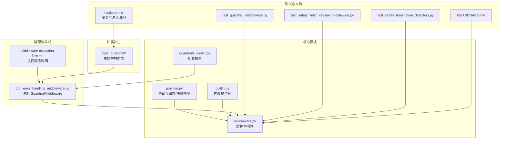
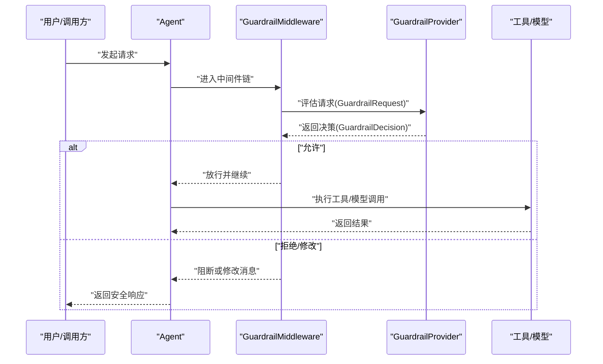
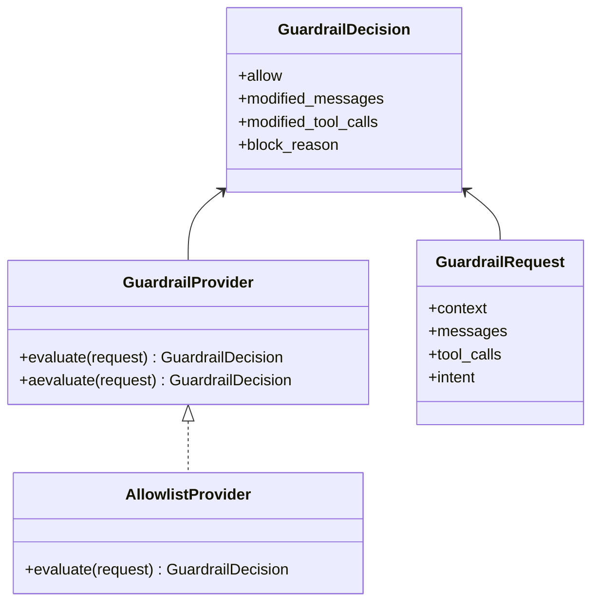
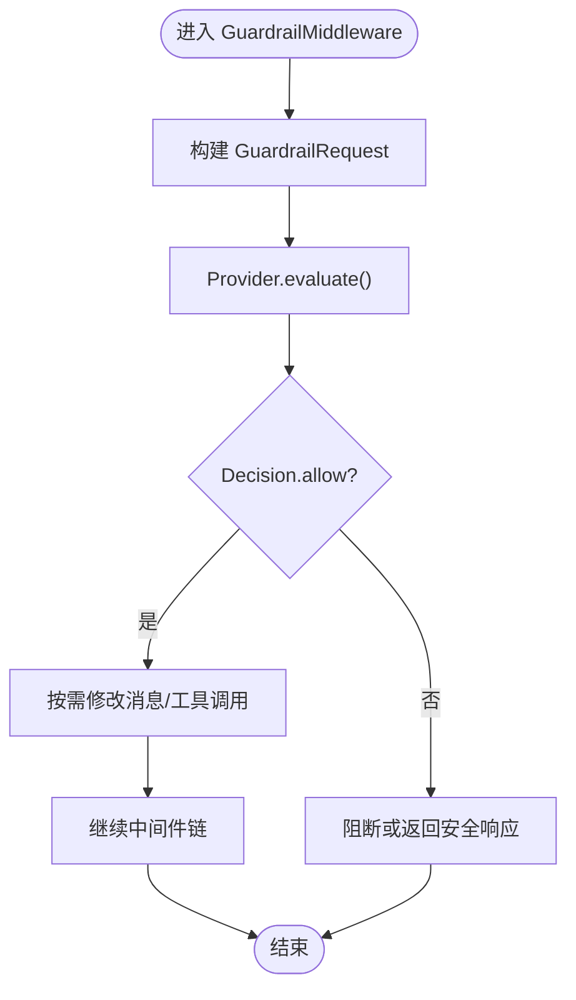
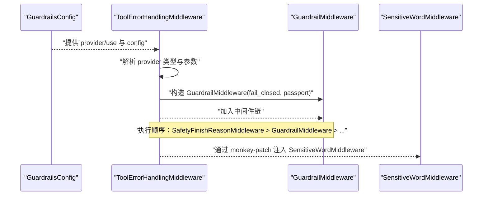
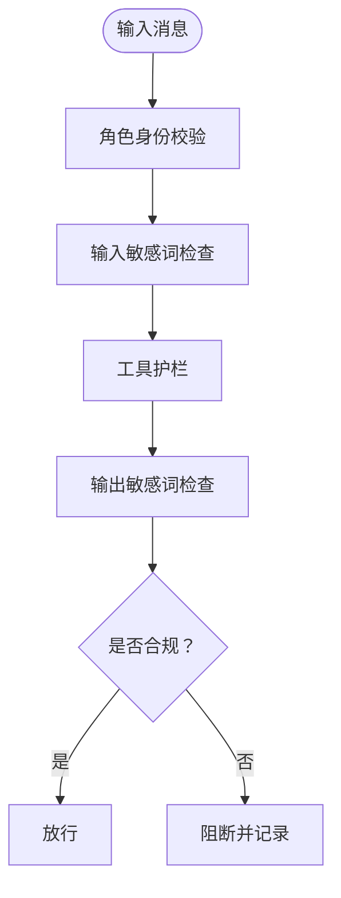
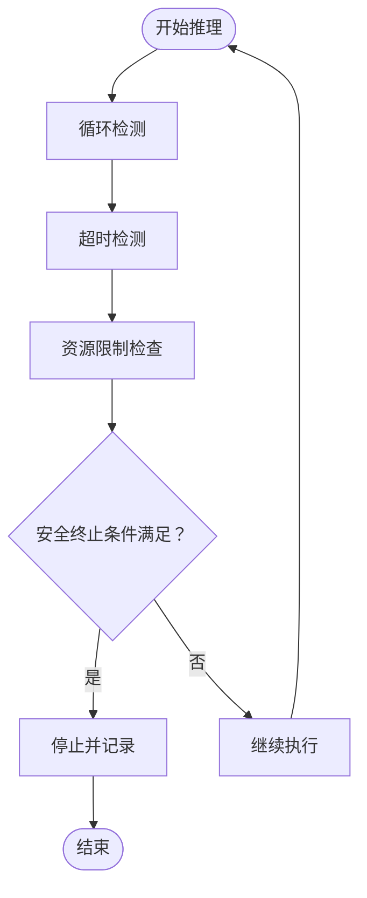
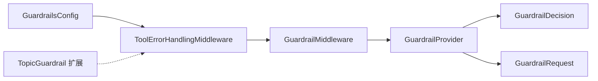

# Guardrails 系统

<cite>
**本文引用的文件**
- [GUARDRAILS.md](file://backend/docs/GUARDRAILS.md)
- [middleware.py](file://backend/packages/harness/deerflow/guardrails/middleware.py)
- [provider.py](file://backend/packages/harness/deerflow/guardrails/provider.py)
- [builtin.py](file://backend/packages/harness/deerflow/guardrails/builtin.py)
- [guardrails_config.py](file://backend/packages/harness/deerflow/config/guardrails_config.py)
- [tool_error_handling_middleware.py](file://backend/packages/harness/deerflow/agents/middlewares/tool_error_handling_middleware.py)
- [test_guardrail_middleware.py](file://backend/tests/test_guardrail_middleware.py)
- [test_safety_finish_reason_middleware.py](file://backend/tests/test_safety_finish_reason_middleware.py)
- [test_safety_termination_detectors.py](file://backend/tests/test_safety_termination_detectors.py)
- [middleware-execution-flow.md](file://backend/docs/middleware-execution-flow.md)
- [topics.yaml](file://deerflow_extensions/topic_guardrail/topics.yaml)
- [sensitive_word_middleware.py](file://deerflow_extensions/topic_guardrail/sensitive_word_middleware.py)
- [backend.md](file://docs/patches/backend.md)
</cite>

## 目录
1. [引言](#引言)
2. [项目结构](#项目结构)
3. [核心组件](#核心组件)
4. [架构总览](#架构总览)
5. [详细组件分析](#详细组件分析)
6. [依赖关系分析](#依赖关系分析)
7. [性能考虑](#性能考虑)
8. [故障排除指南](#故障排除指南)
9. [结论](#结论)
10. [附录](#附录)

## 引言
本文件面向开发者与运维人员，系统性阐述 DeerFlow Guardrails 安全护栏体系的设计与实现，覆盖以下主题：
- 内置防护机制：内容安全过滤、恶意请求检测、资源滥用防护
- 中间件设计：防护中间件的实现原理、执行顺序与配置方法
- 安全终止检测：循环检测、超时检测、资源限制
- 防护规则配置与自定义：规则语法、优先级、动态更新
- 监控与日志：违规事件追踪与审计日志
- 实战示例与排障：防护配置示例、规则编写指南与常见问题处理

## 项目结构
Guardrails 子系统主要由“协议与接口”、“内置提供者”、“中间件装配”、“配置模型”以及“扩展护栏”等模块构成，并通过测试用例与文档共同完善。

**图表来源**
- [provider.py](file://backend/packages/harness/deerflow/guardrails/provider.py)
- [middleware.py](file://backend/packages/harness/deerflow/guardrails/middleware.py)
- [builtin.py](file://backend/packages/harness/deerflow/guardrails/builtin.py)
- [guardrails_config.py](file://backend/packages/harness/deerflow/config/guardrails_config.py)
- [tool_error_handling_middleware.py](file://backend/packages/harness/deerflow/agents/middlewares/tool_error_handling_middleware.py)
- [middleware-execution-flow.md](file://backend/docs/middleware-execution-flow.md)
- [topics.yaml](file://deerflow_extensions/topic_guardrail/topics.yaml)
- [test_guardrail_middleware.py](file://backend/tests/test_guardrail_middleware.py)
- [test_safety_finish_reason_middleware.py](file://backend/tests/test_safety_finish_reason_middleware.py)
- [test_safety_termination_detectors.py](file://backend/tests/test_safety_termination_detectors.py)
- [GUARDRAILS.md](file://backend/docs/GUARDRAILS.md)
- [backend.md](file://docs/patches/backend.md)

**章节来源**
- [GUARDRAILS.md:367-399](file://backend/docs/GUARDRAILS.md#L367-L399)

## 核心组件
- 协议与请求/决策模型：定义 GuardrailRequest、GuardrailDecision 以及 GuardrailProvider 协议，统一不同提供者的输入输出契约。
- 内置提供者：AllowlistProvider 提供零依赖的白名单/黑名单能力，作为基础护栏。
- 防护中间件：GuardrailMiddleware 作为 Agent 中间件，负责在推理前后对消息与工具调用进行拦截与决策。
- 配置模型：GuardrailsConfig 提供 Provider 类型、参数、fail-closed 行为与 passport 等配置项。
- 扩展护栏：TopicGuardrail 通过敏感词匹配与主题过滤形成四层纵深防御。

**章节来源**
- [provider.py](file://backend/packages/harness/deerflow/guardrails/provider.py)
- [builtin.py](file://backend/packages/harness/deerflow/guardrails/builtin.py)
- [middleware.py](file://backend/packages/harness/deerflow/guardrails/middleware.py)
- [guardrails_config.py](file://backend/packages/harness/deerflow/config/guardrails_config.py)
- [GUARDRAILS.md:388-399](file://backend/docs/GUARDRAILS.md#L388-L399)

## 架构总览
Guardrails 在 Agent 执行链路中以中间件形式插入，遵循“先检查、后执行”的原则。配置阶段解析 Provider 类型与参数，运行期根据决策结果决定放行或阻断；同时结合安全终止检测与资源限制策略，防止循环与滥用。

**图表来源**
- [middleware.py](file://backend/packages/harness/deerflow/guardrails/middleware.py)
- [provider.py](file://backend/packages/harness/deerflow/guardrails/provider.py)
- [tool_error_handling_middleware.py](file://backend/packages/harness/deerflow/agents/middlewares/tool_error_handling_middleware.py)

## 详细组件分析

### 协议与提供者
- GuardrailProvider 协议：定义 evaluate(aevaluate) 接口，接收 GuardrailRequest 并返回 GuardrailDecision。
- GuardrailRequest/Decision：封装上下文、消息、工具调用、意图与决策结果。
- AllowlistProvider：内置零依赖提供者，支持基于工具名的白/黑名单策略，适合基础护栏场景。

**图表来源**
- [provider.py](file://backend/packages/harness/deerflow/guardrails/provider.py)
- [builtin.py](file://backend/packages/harness/deerflow/guardrails/builtin.py)

**章节来源**
- [provider.py](file://backend/packages/harness/deerflow/guardrails/provider.py)
- [builtin.py](file://backend/packages/harness/deerflow/guardrails/builtin.py)

### 防护中间件
- GuardrailMiddleware：实现 AgentMiddleware 接口，在推理前后对消息与工具调用进行拦截与决策。
- 关键流程：
  - 请求前：收集 GuardrailRequest，调用 Provider.evaluate，依据 Decision 修改消息或中断后续执行。
  - 请求后：可对最终输出进行二次校验与清理。
- 与 fail-closed 的关系：当配置为关闭模式时，即使 Provider 返回拒绝，也可能选择降级放行或记录告警。

**图表来源**
- [middleware.py](file://backend/packages/harness/deerflow/guardrails/middleware.py)
- [provider.py](file://backend/packages/harness/deerflow/guardrails/provider.py)

**章节来源**
- [middleware.py](file://backend/packages/harness/deerflow/guardrails/middleware.py)

### 中间件装配与执行顺序
- 装配入口：ToolErrorHandlingMiddleware 在构建中间件链时动态解析 GuardrailsConfig，实例化 Provider 并注入 GuardrailMiddleware。
- 执行顺序：根据文档与测试，SafetyFinishReasonMiddleware 在生产环境以 LIFO 方式靠前执行，而 GuardrailMiddleware 通常位于其后，确保“护栏优先于安全终止”。
- 注入扩展护栏：通过 sitecustomize 的 monkey-patch 将 SensitiveWordMiddleware 插入到倒数第二位，形成“输入检查 → 护栏 → 输出检查”的闭环。

**图表来源**
- [tool_error_handling_middleware.py](file://backend/packages/harness/deerflow/agents/middlewares/tool_error_handling_middleware.py)
- [middleware-execution-flow.md](file://backend/docs/middleware-execution-flow.md)
- [backend.md:671-700](file://docs/patches/backend.md#L671-L700)

**章节来源**
- [tool_error_handling_middleware.py:106-128](file://backend/packages/harness/deerflow/agents/middlewares/tool_error_handling_middleware.py#L106-L128)
- [middleware-execution-flow.md](file://backend/docs/middleware-execution-flow.md)
- [backend.md:671-700](file://docs/patches/backend.md#L671-L700)

### 主题护栏（TopicGuardrail）与扩展
- 四层纵深防御：角色身份识别 → 输入敏感词检查 → 输出敏感词检查 → 工具护栏。
- 扩展位置：deerflow_extensions/topic_guardrail/，零侵入方式通过 monkey-patch 注入 SensitiveWordMiddleware。
- 配置简化：topics.yaml 移除 content_check_tools，仅保留 denied_tools、wordlist、patterns 等纯配置字段。

**图表来源**
- [GUARDRAILS.md:388-399](file://backend/docs/GUARDRAILS.md#L388-L399)
- [topics.yaml](file://deerflow_extensions/topic_guardrail/topics.yaml)
- [sensitive_word_middleware.py](file://deerflow_extensions/topic_guardrail/sensitive_word_middleware.py)
- [backend.md:671-700](file://docs/patches/backend.md#L671-L700)

**章节来源**
- [GUARDRAILS.md:388-399](file://backend/docs/GUARDRAILS.md#L388-L399)
- [topics.yaml](file://deerflow_extensions/topic_guardrail/topics.yaml)
- [sensitive_word_middleware.py](file://deerflow_extensions/topic_guardrail/sensitive_word_middleware.py)
- [backend.md:671-700](file://docs/patches/backend.md#L671-L700)

### 安全终止检测机制
- 循环检测：通过 SafetyFinishReasonMiddleware 与图级检测，避免 Agent 在工具调用与消息之间陷入循环。
- 超时检测：结合运行时超时配置，防止长时间阻塞。
- 资源限制：通过工具输出预算、令牌用量与中间件链长度控制，降低资源滥用风险。
- 测试验证：相关测试覆盖了内容过滤与工具调用不触发的场景，确保护栏生效。

**图表来源**
- [test_safety_finish_reason_middleware.py](file://backend/tests/test_safety_finish_reason_middleware.py)
- [test_safety_termination_detectors.py](file://backend/tests/test_safety_termination_detectors.py)

**章节来源**
- [test_safety_finish_reason_middleware.py](file://backend/tests/test_safety_finish_reason_middleware.py)
- [test_safety_termination_detectors.py](file://backend/tests/test_safety_termination_detectors.py)

### 防护规则配置与自定义
- Provider 选择：在 GuardrailsConfig 中指定 provider.use 与 provider.config，支持动态注入 framework 参数以辅助发现。
- fail-closed 行为：决定 Provider 拒绝时的处理策略（阻断或降级）。
- passport：用于跨服务传递护栏上下文信息。
- 自定义 Provider：实现 GuardrailProvider 协议，即可无缝接入中间件链。
- 动态更新：通过重新加载配置与 Provider 实例化，实现规则的热更新。

**章节来源**
- [guardrails_config.py](file://backend/packages/harness/deerflow/config/guardrails_config.py)
- [tool_error_handling_middleware.py:106-128](file://backend/packages/harness/deerflow/agents/middlewares/tool_error_handling_middleware.py#L106-L128)

### 监控与日志
- 违规事件追踪：通过 GuardrailDecision.block_reason 记录阻断原因，便于审计与溯源。
- 审计日志：建议在 Provider 层面统一记录请求上下文、决策时间戳与命中规则，配合外部日志系统归档。
- 测试驱动的可观测性：利用测试用例覆盖关键路径，确保护栏行为可验证、可回归。

**章节来源**
- [provider.py](file://backend/packages/harness/deerflow/guardrails/provider.py)
- [test_guardrail_middleware.py](file://backend/tests/test_guardrail_middleware.py)

## 依赖关系分析
Guardrails 组件之间的耦合度较低，通过协议解耦 Provider 与 Middleware；配置模型集中管理 Provider 与行为开关；扩展护栏通过 monkey-patch 保持零侵入。

**图表来源**
- [guardrails_config.py](file://backend/packages/harness/deerflow/config/guardrails_config.py)
- [tool_error_handling_middleware.py](file://backend/packages/harness/deerflow/agents/middlewares/tool_error_handling_middleware.py)
- [middleware.py](file://backend/packages/harness/deerflow/guardrails/middleware.py)
- [provider.py](file://backend/packages/harness/deerflow/guardrails/provider.py)
- [backend.md:671-700](file://docs/patches/backend.md#L671-L700)

**章节来源**
- [guardrails_config.py](file://backend/packages/harness/deerflow/config/guardrails_config.py)
- [tool_error_handling_middleware.py:106-128](file://backend/packages/harness/deerflow/agents/middlewares/tool_error_handling_middleware.py#L106-L128)
- [middleware.py](file://backend/packages/harness/deerflow/guardrails/middleware.py)
- [provider.py](file://backend/packages/harness/deerflow/guardrails/provider.py)
- [backend.md:671-700](file://docs/patches/backend.md#L671-L700)

## 性能考虑
- Provider 选择：内置 AllowlistProvider 无外部依赖，适合高吞吐场景；复杂规则（如 AC 自动机）可能引入额外开销。
- 中间件链长度：尽量减少不必要的中间件，避免重复评估。
- 超时与资源限制：合理设置超时阈值与工具输出预算，防止长尾请求影响整体稳定性。
- 缓存与预热：对频繁访问的规则集进行缓存，降低每次请求的计算成本。

## 故障排除指南
- Provider 未生效：检查 GuardrailsConfig.provider.use 是否正确解析，以及 framework 参数是否被注入。
- 护栏未拦截：确认中间件执行顺序，确保 GuardrailMiddleware 位于 SafetyFinishReasonMiddleware 之后。
- 扩展护栏未注入：核对 sitecustomize 的 monkey-patch 是否成功，以及 topics.yaml 配置是否正确。
- 测试失败：参考 test_guardrail_middleware.py 与 test_safety_finish_reason_middleware.py 的断言点，定位具体环节。

**章节来源**
- [tool_error_handling_middleware.py:106-128](file://backend/packages/harness/deerflow/agents/middlewares/tool_error_handling_middleware.py#L106-L128)
- [backend.md:671-700](file://docs/patches/backend.md#L671-L700)
- [test_guardrail_middleware.py](file://backend/tests/test_guardrail_middleware.py)
- [test_safety_finish_reason_middleware.py](file://backend/tests/test_safety_finish_reason_middleware.py)

## 结论
DeerFlow Guardrails 通过协议化的 Provider、可插拔的中间件与可配置的行为策略，构建了从输入到输出的多层安全护栏。结合安全终止检测与资源限制，能够有效防范循环、超时与滥用风险。借助扩展护栏与测试用例，系统具备良好的可演进性与可观测性，适合在生产环境中部署与维护。

## 附录

### 防护配置示例（步骤指引）
- 选择 Provider：在 GuardrailsConfig.provider.use 中指定目标 Provider 类。
- 配置参数：在 provider.config 中传入 Provider 所需参数；若 Provider 构造函数接受 framework，则会自动注入。
- 设置 fail-closed：根据业务需求开启/关闭 fail-closed。
- 注册扩展护栏：通过 sitecustomize 注入 SensitiveWordMiddleware，并确保 topics.yaml 配置正确。

**章节来源**
- [guardrails_config.py](file://backend/packages/harness/deerflow/config/guardrails_config.py)
- [tool_error_handling_middleware.py:106-128](file://backend/packages/harness/deerflow/agents/middlewares/tool_error_handling_middleware.py#L106-L128)
- [backend.md:671-700](file://docs/patches/backend.md#L671-L700)

### 规则编写指南
- 白/黑名单：使用 AllowlistProvider 管理工具名级别的放行/阻断。
- 敏感词与主题：通过 TopicGuardrail 的 wordlist/patterns/denied_tools 管控输入/输出与工具调用。
- 决策记录：在 Provider 中记录 block_reason，便于审计与回溯。

**章节来源**
- [builtin.py](file://backend/packages/harness/deerflow/guardrails/builtin.py)
- [topics.yaml](file://deerflow_extensions/topic_guardrail/topics.yaml)
- [provider.py](file://backend/packages/harness/deerflow/guardrails/provider.py)