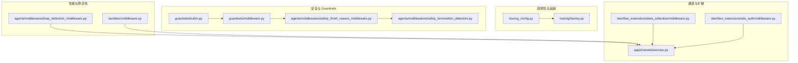
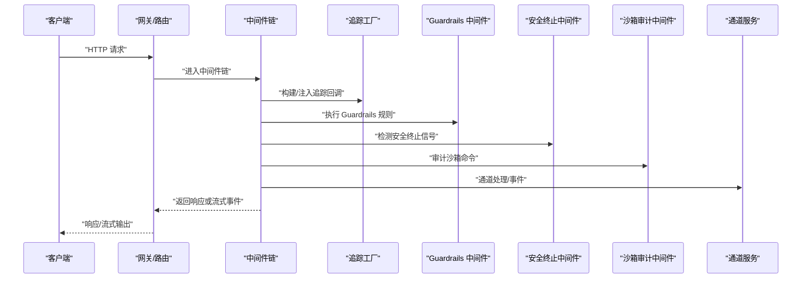
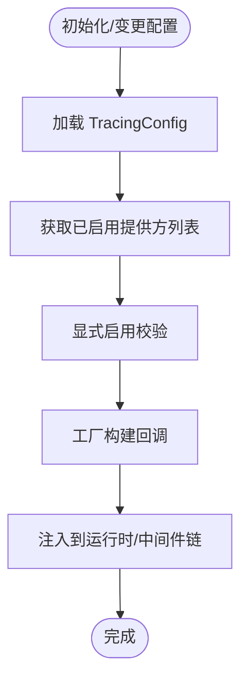
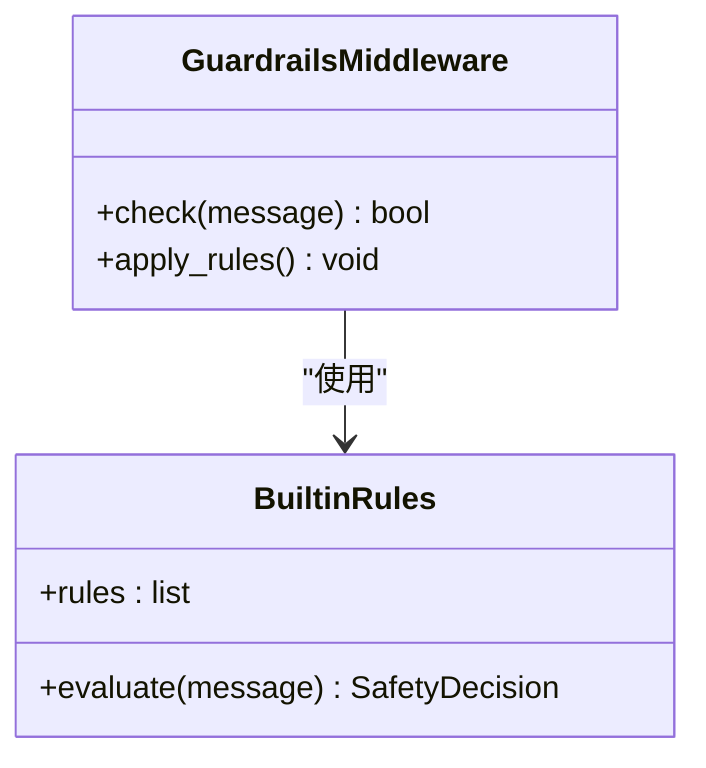
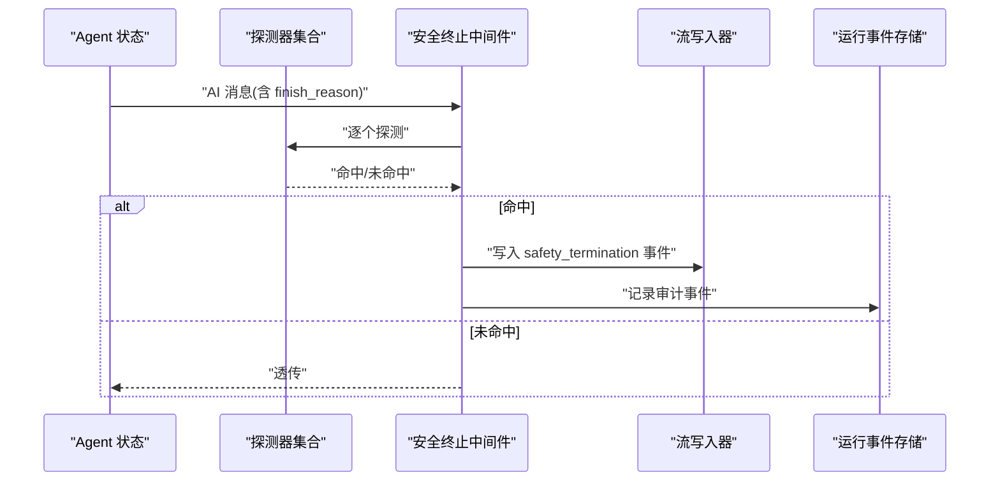
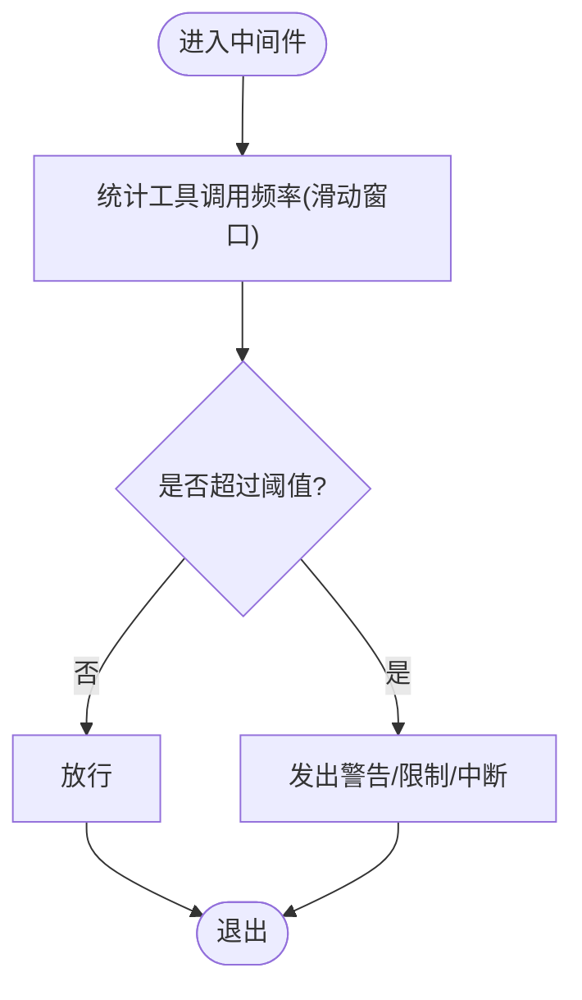
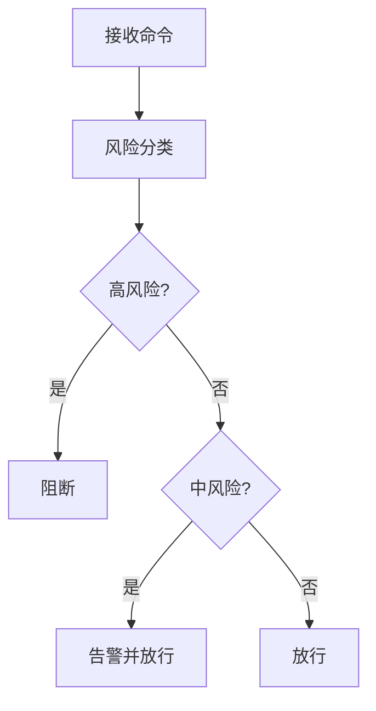
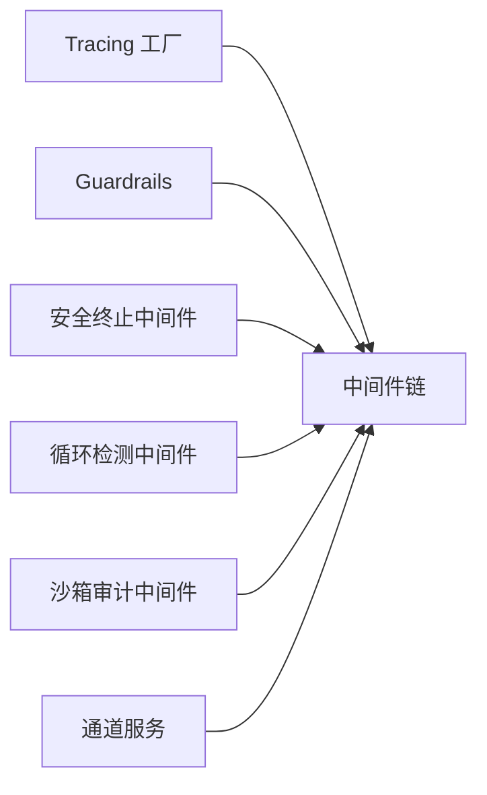

# 监控与日志

<cite>
**本文引用的文件**
- [GUARDRAILS.md](file://backend/docs/GUARDRAILS.md)
- [middleware.py（Guardrails）](file://backend/packages/harness/deerflow/guardrails/middleware.py)
- [builtin.py（Guardrails 内置规则）](file://backend/packages/harness/deerflow/guardrails/builtin.py)
- [safety_finish_reason_middleware.py](file://backend/packages/harness/deerflow/agents/middlewares/safety_finish_reason_middleware.py)
- [safety_termination_detectors.py](file://backend/packages/harness/deerflow/agents/middlewares/safety_termination_detectors.py)
- [tracing_config.py](file://backend/packages/harness/deerflow/config/tracing_config.py)
- [factory.py（Tracing 工厂）](file://backend/packages/harness/deerflow/tracing/factory.py)
- [service.py（通道服务）](file://backend/app/channels/service.py)
- [middleware.py（沙箱审计中间件）](file://backend/packages/harness/deerflow/sandbox/middleware.py)
- [middleware.py（数据采集中间件）](file://deerflow_extensions/data_collection/middleware.py)
- [middleware.py（ADS 认证中间件）](file://deerflow_extensions/ads_auth/middleware.py)
- [loop_detection_middleware.py（循环检测中间件）](file://backend/packages/harness/deerflow/agents/middlewares/loop_detection_middleware.py)
- [test_safety_finish_reason_middleware.py](file://backend/tests/test_safety_finish_reason_middleware.py)
- [test_sandbox_audit_middleware.py](file://backend/tests/test_sandbox_audit_middleware.py)
- [test_loop_detection_middleware.py](file://backend/tests/test_loop_detection_middleware.py)
- [test_tracing_factory.py](file://backend/tests/test_tracing_factory.py)
- [config.example.yaml](file://config.example.yaml)
- [extensions_config.example.json](file://extensions_config.example.json)
</cite>

## 目录
1. [简介](#简介)
2. [项目结构](#项目结构)
3. [核心组件](#核心组件)
4. [架构总览](#架构总览)
5. [组件详解](#组件详解)
6. [依赖关系分析](#依赖关系分析)
7. [性能考量](#性能考量)
8. [故障排查指南](#故障排查指南)
9. [结论](#结论)
10. [附录](#附录)

## 简介
本技术文档聚焦于 DeerFlow 的监控与日志体系，覆盖观测性设计（日志、指标、追踪）、错误追踪与安全终止检测、性能监控与优化、以及 Guardrails 系统的实现与集成。文档同时提供调试与诊断工具清单、配置模板与最佳实践，帮助运维人员高效监控与维护系统。

## 项目结构
围绕监控与日志的关键模块分布如下：
- 观测性与追踪：Tracing 配置与工厂、Langfuse/LangSmith 回调构建
- 安全与 Guardrails：内置规则、中间件、安全终止检测
- 性能与稳定性：循环检测、沙箱审计中间件
- 通道与扩展：消息通道服务、数据采集与认证扩展中间件
- 测试与验证：针对各中间件与工厂的测试用例

图表来源
- [tracing_config.py](file://backend/packages/harness/deerflow/config/tracing_config.py)
- [factory.py（Tracing 工厂）](file://backend/packages/harness/deerflow/tracing/factory.py)
- [builtin.py（Guardrails 内置规则）](file://backend/packages/harness/deerflow/guardrails/builtin.py)
- [middleware.py（Guardrails）](file://backend/packages/harness/deerflow/guardrails/middleware.py)
- [safety_finish_reason_middleware.py](file://backend/packages/harness/deerflow/agents/middlewares/safety_finish_reason_middleware.py)
- [safety_termination_detectors.py](file://backend/packages/harness/deerflow/agents/middlewares/safety_termination_detectors.py)
- [loop_detection_middleware.py（循环检测中间件）](file://backend/packages/harness/deerflow/agents/middlewares/loop_detection_middleware.py)
- [middleware.py（沙箱审计中间件）](file://backend/packages/harness/deerflow/sandbox/middleware.py)
- [service.py（通道服务）](file://backend/app/channels/service.py)
- [middleware.py（数据采集中间件）](file://deerflow_extensions/data_collection/middleware.py)
- [middleware.py（ADS 认证中间件）](file://deerflow_extensions/ads_auth/middleware.py)

章节来源
- [tracing_config.py](file://backend/packages/harness/deerflow/config/tracing_config.py)
- [factory.py（Tracing 工厂）](file://backend/packages/harness/deerflow/tracing/factory.py)
- [builtin.py（Guardrails 内置规则）](file://backend/packages/harness/deerflow/guardrails/builtin.py)
- [middleware.py（Guardrails）](file://backend/packages/harness/deerflow/guardrails/middleware.py)
- [safety_finish_reason_middleware.py](file://backend/packages/harness/deerflow/agents/middlewares/safety_finish_reason_middleware.py)
- [safety_termination_detectors.py](file://backend/packages/harness/deerflow/agents/middlewares/safety_termination_detectors.py)
- [loop_detection_middleware.py（循环检测中间件）](file://backend/packages/harness/deerflow/agents/middlewares/loop_detection_middleware.py)
- [middleware.py（沙箱审计中间件）](file://backend/packages/harness/deerflow/sandbox/middleware.py)
- [service.py（通道服务）](file://backend/app/channels/service.py)
- [middleware.py（数据采集中间件）](file://deerflow_extensions/data_collection/middleware.py)
- [middleware.py（ADS 认证中间件）](file://deerflow_extensions/ads_auth/middleware.py)

## 核心组件
- 追踪与可观测性：通过 TracingConfig 统一管理启用的追踪提供方，工厂负责按配置构建回调；支持 LangSmith、Langfuse 等。
- Guardrails：内置规则与可插拔中间件，结合安全终止检测与循环检测，保障运行时安全与稳定性。
- 沙箱审计与通道：对沙箱命令进行风险评估与审计，通道服务统一启停并记录启用状态与凭据提示。
- 数据采集与认证扩展：提供数据采集中间件与 ADS 认证中间件，便于在网关层注入观测与安全能力。

章节来源
- [tracing_config.py](file://backend/packages/harness/deerflow/config/tracing_config.py)
- [factory.py（Tracing 工厂）](file://backend/packages/harness/deerflow/tracing/factory.py)
- [builtin.py（Guardrails 内置规则）](file://backend/packages/harness/deerflow/guardrails/builtin.py)
- [middleware.py（Guardrails）](file://backend/packages/harness/deerflow/guardrails/middleware.py)
- [safety_finish_reason_middleware.py](file://backend/packages/harness/deerflow/agents/middlewares/safety_finish_reason_middleware.py)
- [safety_termination_detectors.py](file://backend/packages/harness/deerflow/agents/middlewares/safety_termination_detectors.py)
- [loop_detection_middleware.py（循环检测中间件）](file://backend/packages/harness/deerflow/agents/middlewares/loop_detection_middleware.py)
- [middleware.py（沙箱审计中间件）](file://backend/packages/harness/deerflow/sandbox/middleware.py)
- [service.py（通道服务）](file://backend/app/channels/service.py)
- [middleware.py（数据采集中间件）](file://deerflow_extensions/data_collection/middleware.py)
- [middleware.py（ADS 认证中间件）](file://deerflow_extensions/ads_auth/middleware.py)

## 架构总览
下图展示从请求进入网关到中间件链路、安全与观测性组件的交互：

图表来源
- [factory.py（Tracing 工厂）](file://backend/packages/harness/deerflow/tracing/factory.py)
- [middleware.py（Guardrails）](file://backend/packages/harness/deerflow/guardrails/middleware.py)
- [safety_finish_reason_middleware.py](file://backend/packages/harness/deerflow/agents/middlewares/safety_finish_reason_middleware.py)
- [middleware.py（沙箱审计中间件）](file://backend/packages/harness/deerflow/sandbox/middleware.py)
- [service.py（通道服务）](file://backend/app/channels/service.py)

## 组件详解

### 日志系统与通道监控
- 通道服务负责启动与管理各类外部通道（如钉钉、飞书、Slack 等）。当通道被配置但未启用时，会记录“已配置凭据但未启用”的警告；若未配置凭据则记录“跳过”信息，便于运维快速定位启用状态与凭据问题。
- 建议：在配置中显式启用所需通道，并确保凭据完整；通过日志级别与轮询策略控制噪音。

章节来源
- [service.py（通道服务）](file://backend/app/channels/service.py)

### 追踪与可观测性（Tracing）
- TracingConfig 提供统一的追踪提供方管理接口，包括查询已启用提供方、显式启用校验、整体启用判断与配置重置等。
- Tracing 工厂根据配置动态构建回调（例如 LangSmith、Langfuse），并在测试中验证多提供方回调的正确装配。

图表来源
- [tracing_config.py](file://backend/packages/harness/deerflow/config/tracing_config.py)
- [factory.py（Tracing 工厂）](file://backend/packages/harness/deerflow/tracing/factory.py)

章节来源
- [tracing_config.py](file://backend/packages/harness/deerflow/config/tracing_config.py)
- [factory.py（Tracing 工厂）](file://backend/packages/harness/deerflow/tracing/factory.py)
- [test_tracing_factory.py](file://backend/tests/test_tracing_factory.py)

### Guardrails 系统与内置防护
- Guardrails 中间件与内置规则共同构成安全基线，可在运行时拦截不当内容或行为。
- 内置规则定义了常见安全策略，中间件负责在消息流转阶段执行检查与处置。
- 扩展：可通过配置启用自定义规则或替换内置规则，以适配组织策略。

图表来源
- [middleware.py（Guardrails）](file://backend/packages/harness/deerflow/guardrails/middleware.py)
- [builtin.py（Guardrails 内置规则）](file://backend/packages/harness/deerflow/guardrails/builtin.py)

章节来源
- [middleware.py（Guardrails）](file://backend/packages/harness/deerflow/guardrails/middleware.py)
- [builtin.py（Guardrails 内置规则）](file://backend/packages/harness/deerflow/guardrails/builtin.py)
- [GUARDRAILS.md](file://backend/docs/GUARDRAILS.md)

### 安全终止检测（Provider-Side Safety Termination）
- 安全终止中间件监听 AI 返回中的“因安全原因终止”信号，识别不同供应商的字段差异，触发抑制工具调用、写入流事件与审计记录。
- 支持自定义探测器，按顺序执行并记录首个匹配项，异常探测器不会中断运行。

图表来源
- [safety_finish_reason_middleware.py](file://backend/packages/harness/deerflow/agents/middlewares/safety_finish_reason_middleware.py)
- [safety_termination_detectors.py](file://backend/packages/harness/deerflow/agents/middlewares/safety_termination_detectors.py)

章节来源
- [safety_finish_reason_middleware.py](file://backend/packages/harness/deerflow/agents/middlewares/safety_finish_reason_middleware.py)
- [safety_termination_detectors.py](file://backend/packages/harness/deerflow/agents/middlewares/safety_termination_detectors.py)
- [test_safety_finish_reason_middleware.py](file://backend/tests/test_safety_finish_reason_middleware.py)

### 循环检测与性能保护
- 循环检测中间件基于滑动窗口统计工具调用频率，支持全局阈值与单工具覆盖，避免长时间无效循环导致资源耗尽。
- 测试覆盖了标量字段映射、覆盖转换与空覆盖等场景，保证配置解析正确性。

图表来源
- [loop_detection_middleware.py（循环检测中间件）](file://backend/packages/harness/deerflow/agents/middlewares/loop_detection_middleware.py)

章节来源
- [loop_detection_middleware.py（循环检测中间件）](file://backend/packages/harness/deerflow/agents/middlewares/loop_detection_middleware.py)
- [test_loop_detection_middleware.py](file://backend/tests/test_loop_detection_middleware.py)

### 沙箱审计与命令风险评估
- 沙箱审计中间件对命令进行分类与评估，要求高风险命令必须阻断、中风险命令必须告警、低风险命令允许通过，且误报率应为零。
- 测试用例验证召回率与精度目标，确保安全策略有效落地。

图表来源
- [middleware.py（沙箱审计中间件）](file://backend/packages/harness/deerflow/sandbox/middleware.py)
- [test_sandbox_audit_middleware.py](file://backend/tests/test_sandbox_audit_middleware.py)

章节来源
- [middleware.py（沙箱审计中间件）](file://backend/packages/harness/deerflow/sandbox/middleware.py)
- [test_sandbox_audit_middleware.py](file://backend/tests/test_sandbox_audit_middleware.py)

### 数据采集与认证扩展中间件
- 数据采集中间件：用于在网关层采集与聚合数据，支持导出格式与质量仪表盘。
- ADS 认证中间件：提供认证与令牌管理能力，配合路由与启动流程使用。

章节来源
- [middleware.py（数据采集中间件）](file://deerflow_extensions/data_collection/middleware.py)
- [middleware.py（ADS 认证中间件）](file://deerflow_extensions/ads_auth/middleware.py)

## 依赖关系分析
- 中间件链依赖 Tracing 工厂注入回调，确保可观测性贯穿请求生命周期。
- Guardrails 与安全终止中间件相互补充：前者在消息层面做规则拦截，后者在响应层面做安全终止信号处理。
- 循环检测与沙箱审计分别从“逻辑循环”和“命令风险”两个维度提升系统稳定性与安全性。
- 通道服务作为外部集成入口，统一启停与日志提示，降低运维复杂度。

图表来源
- [factory.py（Tracing 工厂）](file://backend/packages/harness/deerflow/tracing/factory.py)
- [middleware.py（Guardrails）](file://backend/packages/harness/deerflow/guardrails/middleware.py)
- [safety_finish_reason_middleware.py](file://backend/packages/harness/deerflow/agents/middlewares/safety_finish_reason_middleware.py)
- [loop_detection_middleware.py（循环检测中间件）](file://backend/packages/harness/deerflow/agents/middlewares/loop_detection_middleware.py)
- [middleware.py（沙箱审计中间件）](file://backend/packages/harness/deerflow/sandbox/middleware.py)
- [service.py（通道服务）](file://backend/app/channels/service.py)

## 性能考量
- 追踪回调构建应按需启用，避免不必要的开销；建议仅启用必要的提供方并校验配置完整性。
- 循环检测窗口大小与阈值需结合业务负载调优，防止误报与漏报。
- 沙箱命令分类与审计逻辑应尽量轻量化，避免成为瓶颈；对高频命令可考虑缓存分类结果。
- 通道服务在启动时会检查启用状态与凭据，建议在配置阶段即明确启用项，减少运行期日志噪音。

## 故障排查指南
- 追踪未生效
  - 检查追踪提供方是否完整配置并处于启用状态；使用显式启用校验接口确认配置有效性。
  - 参考测试用例验证多提供方回调装配是否正确。
- 安全终止未触发
  - 确认探测器列表与顺序；检查 AI 返回中的 finish_reason 字段是否被正确识别。
  - 若存在异常探测器，需确保其不会中断运行。
- 循环检测误报/漏报
  - 调整滑动窗口大小与工具频率阈值；为特定工具设置覆盖阈值。
- 沙箱命令误报
  - 重新评估命令分类策略与阈值；确保高风险命令 100% 阻断、中风险告警、低风险放行。
- 通道未启用或凭据缺失
  - 查看通道服务的日志提示，确认是否已配置凭据但未启用；按提示调整配置。

章节来源
- [tracing_config.py](file://backend/packages/harness/deerflow/config/tracing_config.py)
- [test_tracing_factory.py](file://backend/tests/test_tracing_factory.py)
- [safety_finish_reason_middleware.py](file://backend/packages/harness/deerflow/agents/middlewares/safety_finish_reason_middleware.py)
- [test_safety_finish_reason_middleware.py](file://backend/tests/test_safety_finish_reason_middleware.py)
- [loop_detection_middleware.py（循环检测中间件）](file://backend/packages/harness/deerflow/agents/middlewares/loop_detection_middleware.py)
- [test_loop_detection_middleware.py](file://backend/tests/test_loop_detection_middleware.py)
- [middleware.py（沙箱审计中间件）](file://backend/packages/harness/deerflow/sandbox/middleware.py)
- [test_sandbox_audit_middleware.py](file://backend/tests/test_sandbox_audit_middleware.py)
- [service.py（通道服务）](file://backend/app/channels/service.py)

## 结论
DeerFlow 的监控与日志体系通过“可观测性 + Guardrails + 安全终止 + 性能保护 + 通道治理”的组合，实现了端到端的运行时保障。建议在生产环境中按需启用追踪、严格配置 Guardrails 与安全终止探测器、合理设置循环检测与沙箱策略，并通过通道服务统一管理外部集成，从而获得稳定、可观测、可审计的运行体验。

## 附录

### 监控配置与模板
- 追踪配置参考：[tracing_config.py](file://backend/packages/harness/deerflow/config/tracing_config.py)
- 追踪工厂参考：[factory.py（Tracing 工厂）](file://backend/packages/harness/deerflow/tracing/factory.py)
- Guardrails 文档：[GUARDRAILS.md](file://backend/docs/GUARDRAILS.md)
- 配置样例参考：
  - [config.example.yaml](file://config.example.yaml)
  - [extensions_config.example.json](file://extensions_config.example.json)

### 告警与事件
- 安全终止事件：由安全终止中间件写入流事件与审计存储，可用于后续告警联动。
- 循环检测事件：可根据阈值触发告警，辅助定位异常 Agent 行为。
- 通道状态事件：通道服务在启动时输出启用状态与凭据提示，便于运维监控。

### 最佳实践
- 仅启用必要的追踪提供方，避免性能损耗。
- 将 Guardrails 与安全终止探测器纳入 CI/CD 流程，确保规则更新可追溯。
- 对沙箱命令分类策略定期复核，保持高风险阻断率与低误报率。
- 在通道配置中显式启用所需通道，完善凭据管理与轮询策略。