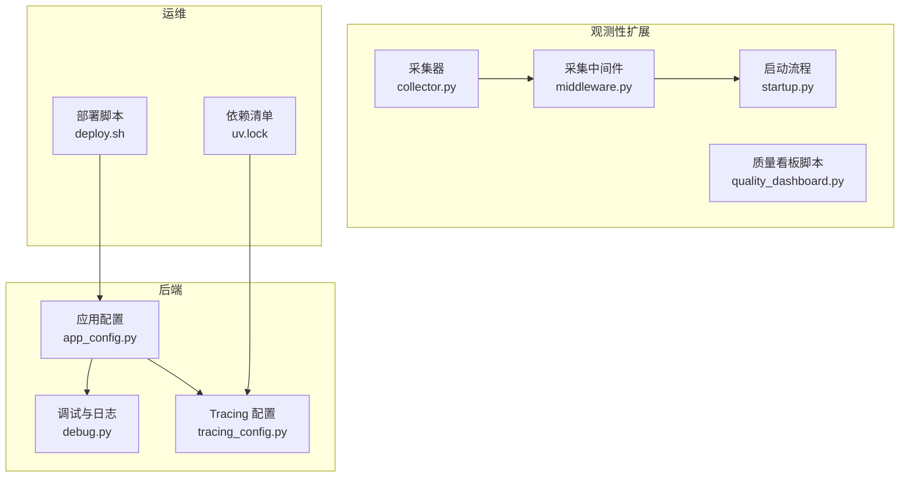
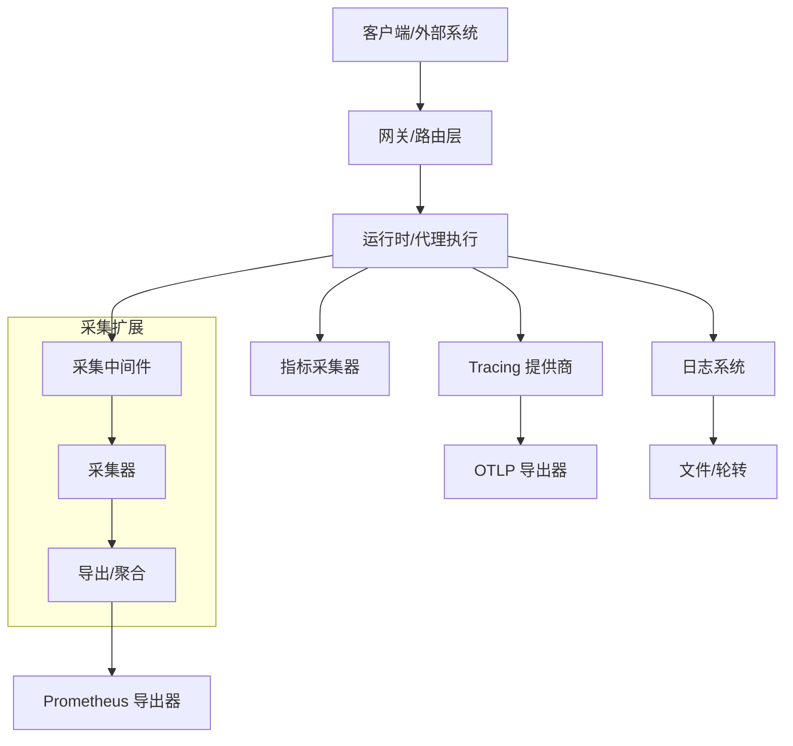
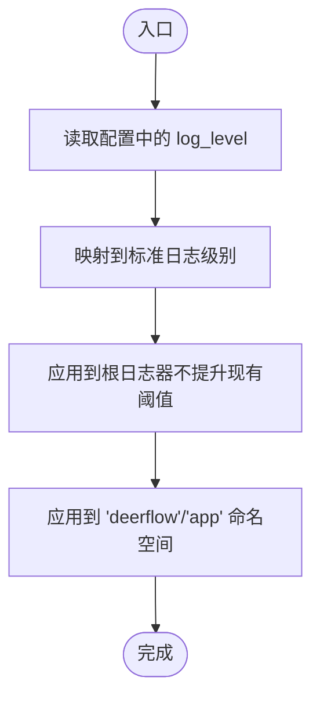
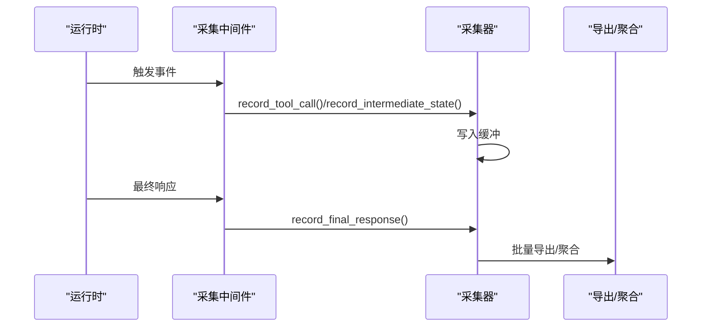
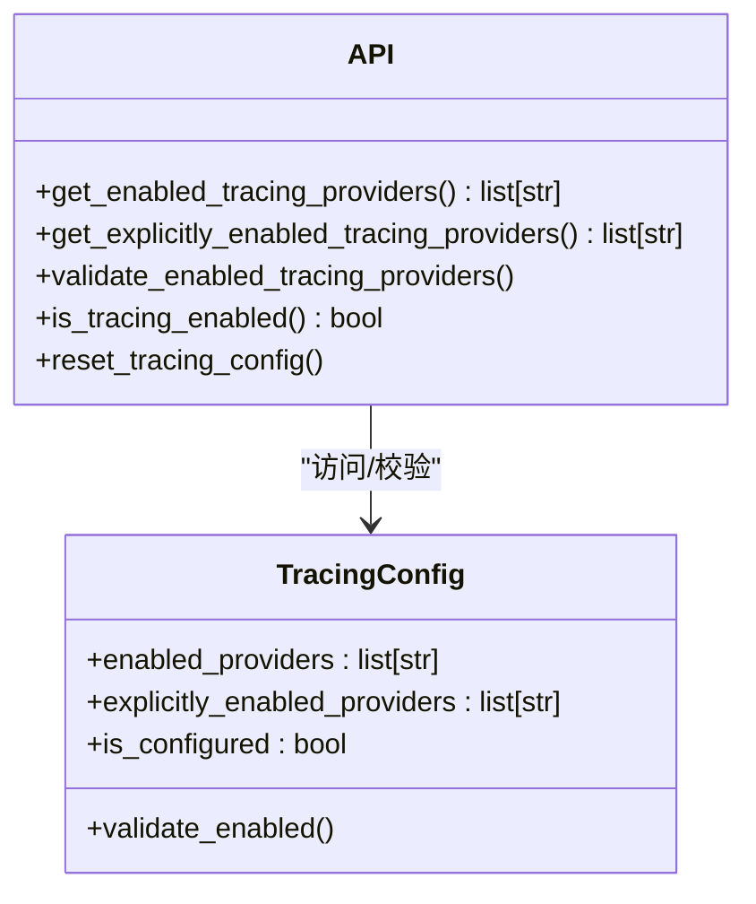
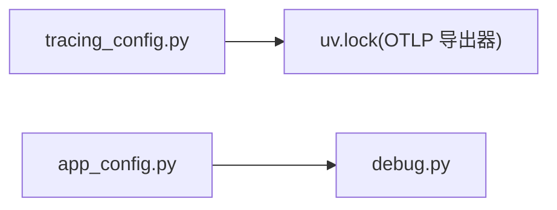

# 观测性设计

<cite>
**本文引用的文件**
- [config.example.yaml](file://config.example.yaml)
- [config.yaml](file://config.yaml)
- [app_config.py](file://backend/packages/harness/deerflow/config/app_config.py)
- [tracing_config.py](file://backend/packages/harness/deerflow/config/tracing_config.py)
- [debug.py](file://backend/debug.py)
- [test_logging_level_from_config.py](file://backend/tests/test_logging_level_from_config.py)
- [collector.py](file://deerflow_extensions/data_collection/collector.py)
- [middleware.py](file://deerflow_extensions/data_collection/middleware.py)
- [startup.py](file://deerflow_extensions/data_collection/startup.py)
- [quality_dashboard.py](file://deerflow_extensions/data_collection/scripts/quality_dashboard.py)
- [deploy.sh](file://scripts/deploy.sh)
- [uv.lock](file://backend/uv.lock)
</cite>

## 目录
1. [引言](#引言)
2. [项目结构](#项目结构)
3. [核心组件](#核心组件)
4. [架构总览](#架构总览)
5. [详细组件分析](#详细组件分析)
6. [依赖关系分析](#依赖关系分析)
7. [性能考量](#性能考量)
8. [故障排查指南](#故障排查指南)
9. [结论](#结论)
10. [附录](#附录)

## 引言
本文件面向 DeerFlow 的观测性设计，围绕日志系统、指标收集、错误追踪与性能监控进行系统化说明，并提供可操作的配置建议、监控图表与最佳实践，帮助开发者与运维人员快速建立完善的可观测体系。

## 项目结构
与观测性直接相关的关键位置如下：
- 后端配置与运行时：应用配置模块、调试与日志工具、Tracing 配置
- 数据采集扩展：数据采集器、中间件与启动流程
- 运维脚本：部署脚本中的健康检查与端点信息
- 依赖清单：OpenTelemetry 导出依赖（OTLP）

图示来源
- [app_config.py](file://backend/packages/harness/deerflow/config/app_config.py)
- [debug.py](file://backend/debug.py)
- [tracing_config.py](file://backend/packages/harness/deerflow/config/tracing_config.py)
- [collector.py](file://deerflow_extensions/data_collection/collector.py)
- [middleware.py](file://deerflow_extensions/data_collection/middleware.py)
- [startup.py](file://deerflow_extensions/data_collection/startup.py)
- [quality_dashboard.py](file://deerflow_extensions/data_collection/scripts/quality_dashboard.py)
- [deploy.sh](file://scripts/deploy.sh)
- [uv.lock](file://backend/uv.lock)

章节来源
- [config.example.yaml](file://config.example.yaml)
- [config.yaml](file://config.yaml)
- [app_config.py](file://backend/packages/harness/deerflow/config/app_config.py)
- [debug.py](file://backend/debug.py)
- [tracing_config.py](file://backend/packages/harness/deerflow/config/tracing_config.py)
- [collector.py](file://deerflow_extensions/data_collection/collector.py)
- [middleware.py](file://deerflow_extensions/data_collection/middleware.py)
- [startup.py](file://deerflow_extensions/data_collection/startup.py)
- [quality_dashboard.py](file://deerflow_extensions/data_collection/scripts/quality_dashboard.py)
- [deploy.sh](file://scripts/deploy.sh)
- [uv.lock](file://backend/uv.lock)

## 核心组件
- 日志系统：支持从配置映射日志级别、统一根日志器与文件处理器、避免控制台污染；测试覆盖了映射与应用逻辑。
- 指标收集：通过数据采集扩展记录工具调用、中间状态、最终响应等样本，支持缓冲与批量导出；结合质量看板脚本生成可视化。
- 错误追踪：Tracing 配置提供多提供商开关与校验，支持注入元数据与回调构建，便于端到端链路追踪。
- 性能监控：采集器记录耗时、令牌用量、工具调用次数等关键指标，配合 Prometheus/OTel 导出实现统一监控。

章节来源
- [test_logging_level_from_config.py](file://backend/tests/test_logging_level_from_config.py)
- [collector.py](file://deerflow_extensions/data_collection/collector.py)
- [tracing_config.py](file://backend/packages/harness/deerflow/config/tracing_config.py)

## 架构总览
下图展示观测性在系统中的位置与交互：

图示来源
- [middleware.py](file://deerflow_extensions/data_collection/middleware.py)
- [collector.py](file://deerflow_extensions/data_collection/collector.py)
- [startup.py](file://deerflow_extensions/data_collection/startup.py)
- [tracing_config.py](file://backend/packages/harness/deerflow/config/tracing_config.py)
- [uv.lock](file://backend/uv.lock)

## 详细组件分析

### 日志系统
- 级别管理
  - 支持从配置映射字符串到标准日志级别的转换，并对未知值回退到默认级别。
  - 应用函数确保“deerflow”和“app”命名空间的日志器与处理器级别被正确设置，且不会提升已存在的处理器阈值。
- 结构化日志
  - 当前仓库未发现统一的结构化日志格式定义；建议在采集器或中间件中引入统一字段（如 trace_id、span_id、session_id、step_number）以增强关联性。
- 日志轮转
  - 未见显式轮转配置；可在根日志器初始化阶段接入 RotatingFileHandler 或使用第三方库实现按大小/时间轮转。

图示来源
- [debug.py](file://backend/debug.py)
- [test_logging_level_from_config.py](file://backend/tests/test_logging_level_from_config.py)

章节来源
- [debug.py](file://backend/debug.py)
- [test_logging_level_from_config.py](file://backend/tests/test_logging_level_from_config.py)

### 指标收集机制
- 采样类型
  - 工具调用请求/结果、中间状态、最终响应等样本均纳入采集缓冲。
- 字段与复杂度
  - 采样字段覆盖会话、步骤、工具名称、参数、耗时、令牌用量、错误等；缓冲结构为列表，适合批处理导出。
- 批处理与导出
  - 采集器负责缓冲；中间件在运行时注入采样；启动流程负责初始化与调度；质量看板脚本用于生成可视化报表。

图示来源
- [collector.py](file://deerflow_extensions/data_collection/collector.py)
- [middleware.py](file://deerflow_extensions/data_collection/middleware.py)
- [startup.py](file://deerflow_extensions/data_collection/startup.py)
- [quality_dashboard.py](file://deerflow_extensions/data_collection/scripts/quality_dashboard.py)

章节来源
- [collector.py](file://deerflow_extensions/data_collection/collector.py)
- [middleware.py](file://deerflow_extensions/data_collection/middleware.py)
- [startup.py](file://deerflow_extensions/data_collection/startup.py)
- [quality_dashboard.py](file://deerflow_extensions/data_collection/scripts/quality_dashboard.py)

### 错误追踪系统
- 提供商启用与校验
  - 提供查询已启用/显式启用的追踪提供商、验证完全配置、以及重置缓存的能力。
- 元数据与回调
  - 支持构建 Langfuse 追踪元数据并注入，便于跨服务链路关联。
- 依赖与导出
  - 依赖清单包含 OTLP Proto HTTP 导出器，可用于将追踪数据发送至兼容的接收端。

图示来源
- [tracing_config.py](file://backend/packages/harness/deerflow/config/tracing_config.py)

章节来源
- [tracing_config.py](file://backend/packages/harness/deerflow/config/tracing_config.py)
- [uv.lock](file://backend/uv.lock)

### 性能监控方案
- 关键指标
  - 响应时间：工具调用耗时、总流程耗时。
  - 资源使用：令牌用量、工具调用次数、消息计数。
  - 吞吐量：单位时间内的会话数/步骤数（可通过采样统计得出）。
- 可视化与报表
  - 质量看板脚本支持生成对比表格与差异列，便于评估不同配置下的表现。

章节来源
- [collector.py](file://deerflow_extensions/data_collection/collector.py)
- [quality_dashboard.py](file://deerflow_extensions/data_collection/scripts/quality_dashboard.py)

## 依赖关系分析
- Tracing 与导出
  - Tracing 配置模块与 OpenTelemetry OTLP 导出器存在直接依赖关系，确保链路数据可被导出。
- 日志与配置
  - 应用配置模块与调试日志工具共同决定日志输出行为与级别。

图示来源
- [tracing_config.py](file://backend/packages/harness/deerflow/config/tracing_config.py)
- [uv.lock](file://backend/uv.lock)
- [app_config.py](file://backend/packages/harness/deerflow/config/app_config.py)
- [debug.py](file://backend/debug.py)

章节来源
- [tracing_config.py](file://backend/packages/harness/deerflow/config/tracing_config.py)
- [uv.lock](file://backend/uv.lock)
- [app_config.py](file://backend/packages/harness/deerflow/config/app_config.py)
- [debug.py](file://backend/debug.py)

## 性能考量
- 日志级别与开销
  - 在生产环境建议使用 INFO 或更高级别，避免 DEBUG 带来的 IO 压力。
- 采样与缓冲
  - 使用缓冲减少频繁写盘；合理设置刷新周期与阈值，平衡实时性与性能。
- 追踪与网络
  - OTLP 导出需考虑网络延迟与丢包；建议开启压缩与批量发送。

## 故障排查指南
- 日志级别问题
  - 若发现日志过多或过少，检查配置映射是否正确，确认应用函数是否成功设置命名空间级别。
- 采集缺失
  - 确认中间件已在运行时注册，采集器缓冲非空，启动流程已完成初始化。
- 追踪未生效
  - 检查已启用提供商是否完整配置，必要时调用校验接口；如需重载配置，使用重置函数。

章节来源
- [test_logging_level_from_config.py](file://backend/tests/test_logging_level_from_config.py)
- [middleware.py](file://deerflow_extensions/data_collection/middleware.py)
- [startup.py](file://deerflow_extensions/data_collection/startup.py)
- [tracing_config.py](file://backend/packages/harness/deerflow/config/tracing_config.py)

## 结论
通过统一的日志级别管理、结构化的指标采集、可插拔的追踪提供商与可视化的质量看板，DeerFlow 已具备完善的观测性基础。建议在现有基础上补充结构化日志字段与日志轮转策略，并完善 Prometheus/OTel 的导出与告警配置，以形成闭环的可观测体系。

## 附录

### 观测性配置选项与示例
- 日志级别
  - 在配置中设置 log_level，支持字符串映射到标准级别；未知值回退到 INFO。
- Tracing 提供商
  - 通过配置启用所需提供商，并在启动前调用校验接口；必要时重置配置缓存。
- 采集器
  - 在运行时中间件中注入采样记录；确保启动流程初始化采集器与导出通道。

章节来源
- [config.example.yaml](file://config.example.yaml)
- [config.yaml](file://config.yaml)
- [tracing_config.py](file://backend/packages/harness/deerflow/config/tracing_config.py)
- [middleware.py](file://deerflow_extensions/data_collection/middleware.py)
- [startup.py](file://deerflow_extensions/data_collection/startup.py)

### 监控仪表板与告警建议
- 仪表板建议
  - 响应时间分布、吞吐量趋势、错误率与 P95/P99 耗时。
- 告警规则建议
  - 响应时间超阈、错误率突增、吞吐量骤降、追踪导出失败。

章节来源
- [quality_dashboard.py](file://deerflow_extensions/data_collection/scripts/quality_dashboard.py)
- [collector.py](file://deerflow_extensions/data_collection/collector.py)

### 部署与健康检查参考
- 部署脚本提供了应用与网关的访问地址与基本健康提示，便于快速验证服务可用性。

章节来源
- [deploy.sh](file://scripts/deploy.sh)