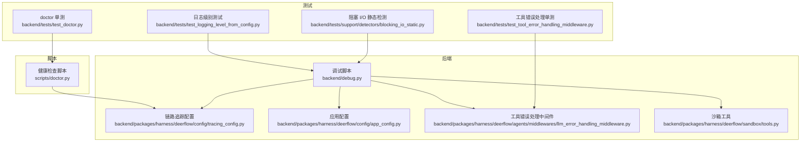
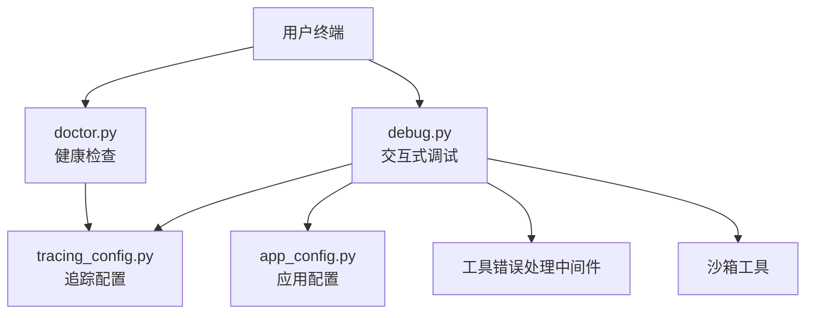
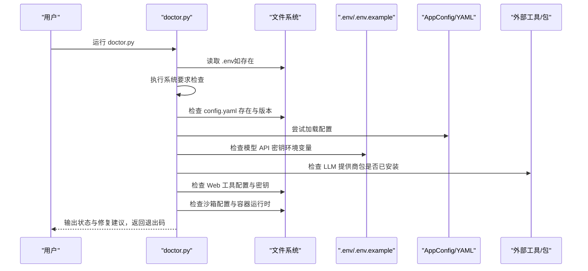
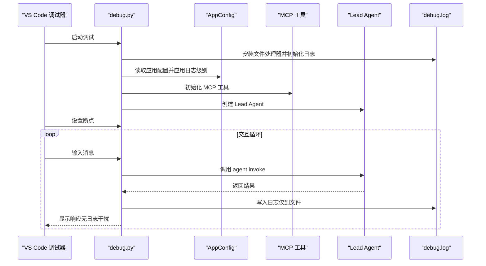
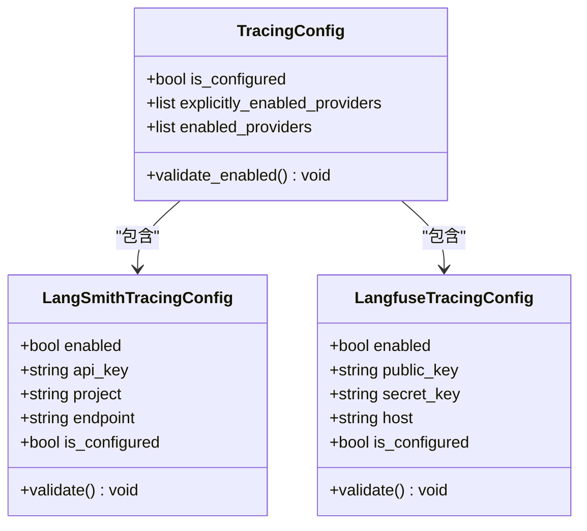
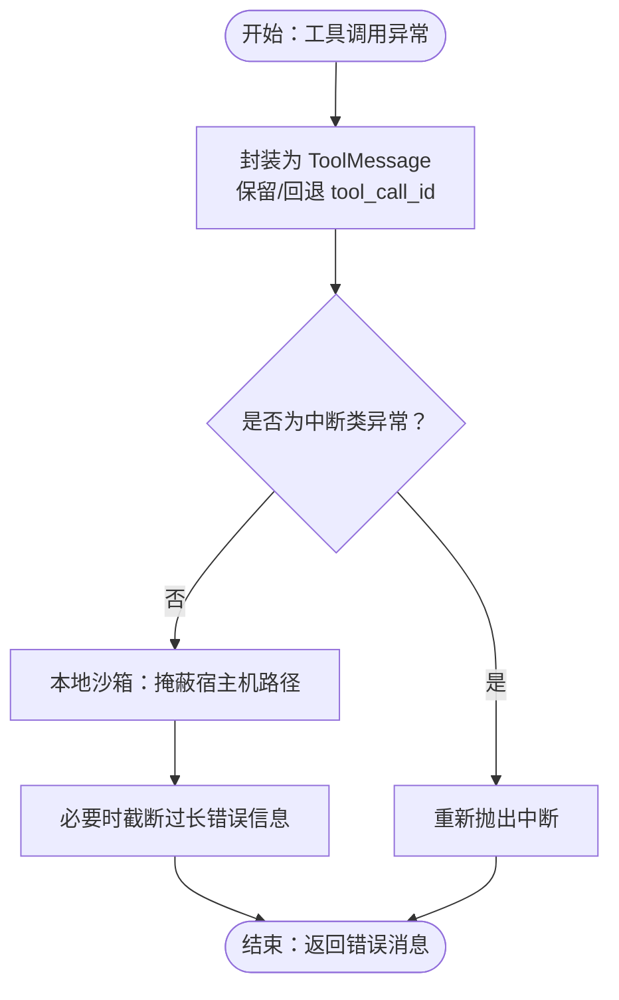
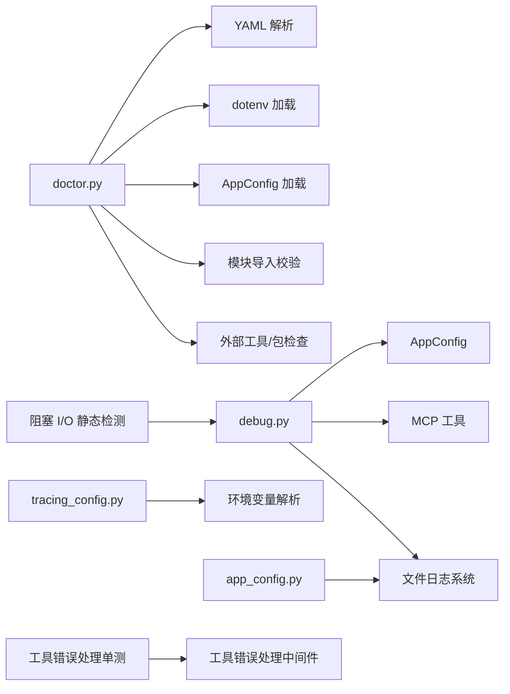

# 调试与诊断

<cite>
**本文引用的文件**   
- [scripts/doctor.py](file://scripts/doctor.py)
- [backend/debug.py](file://backend/debug.py)
- [backend/packages/harness/deerflow/config/tracing_config.py](file://backend/packages/harness/deerflow/config/tracing_config.py)
- [backend/packages/harness/deerflow/config/app_config.py](file://backend/packages/harness/deerflow/config/app_config.py)
- [backend/tests/test_doctor.py](file://backend/tests/test_doctor.py)
- [backend/tests/test_logging_level_from_config.py](file://backend/tests/test_logging_level_from_config.py)
- [backend/tests/support/detectors/blocking_io_static.py](file://backend/tests/support/detectors/blocking_io_static.py)
- [backend/tests/test_tool_error_handling_middleware.py](file://backend/tests/test_tool_error_handling_middleware.py)
- [backend/packages/harness/deerflow/agents/middlewares/llm_error_handling_middleware.py](file://backend/packages/harness/deerflow/agents/middlewares/llm_error_handling_middleware.py)
- [backend/packages/harness/deerflow/sandbox/tools.py](file://backend/packages/harness/deerflow/sandbox/tools.py)
</cite>

## 更新摘要
**变更内容**   
- 更新调试日志系统部分，反映所有日志重定向到 debug.log 文件的改进
- 新增日志级别配置和文件日志处理的详细说明
- 更新故障排除指南中的日志分析部分
- 强调后台任务日志不会干扰交互式终端提示

## 目录
1. [简介](#简介)
2. [项目结构](#项目结构)
3. [核心组件](#核心组件)
4. [架构总览](#架构总览)
5. [详细组件分析](#详细组件分析)
6. [依赖关系分析](#依赖关系分析)
7. [性能考量](#性能考量)
8. [故障排除指南](#故障排除指南)
9. [结论](#结论)
10. [附录](#附录)

## 简介
本文件面向 DeerFlow 的调试与诊断场景，系统性介绍以下能力：
- 调试工具集：调试模式启用、断点设置、交互式输入与日志输出、变量检查与状态观察
- 诊断命令集：系统健康检查（doctor）、配置校验、LLM 提供商与密钥检查、Web 能力与沙箱配置检查
- 性能分析工具：基于链路追踪配置的可观测性入口、阻塞 I/O 静态检测与工具错误处理中间件
- 故障排除：常见问题诊断流程、错误日志分析、系统状态检查与修复建议
- doctor.py 脚本：功能说明、使用方法、退出码语义与可操作建议

## 项目结构
与"调试与诊断"直接相关的代码主要分布在如下位置：
- 后端调试脚本：backend/debug.py
- 健康检查脚本：scripts/doctor.py
- 链路追踪配置：backend/packages/harness/deerflow/config/tracing_config.py
- 应用配置：backend/packages/harness/deerflow/config/app_config.py
- 单元测试与支持工具：backend/tests/test_doctor.py、backend/tests/test_logging_level_from_config.py、backend/tests/support/detectors/blocking_io_static.py、backend/tests/test_tool_error_handling_middleware.py
- 错误处理中间件与沙箱工具：backend/packages/harness/deerflow/agents/middlewares/llm_error_handling_middleware.py、backend/packages/harness/deerflow/sandbox/tools.py

**图表来源**
- [scripts/doctor.py:632-722](file://scripts/doctor.py#L632-L722)
- [backend/debug.py:95-208](file://backend/debug.py#L95-L208)
- [backend/packages/harness/deerflow/config/tracing_config.py:107-162](file://backend/packages/harness/deerflow/config/tracing_config.py#L107-L162)
- [backend/packages/harness/deerflow/config/app_config.py:50-75](file://backend/packages/harness/deerflow/config/app_config.py#L50-L75)
- [backend/tests/test_doctor.py:1-343](file://backend/tests/test_doctor.py#L1-L343)
- [backend/tests/test_logging_level_from_config.py:1-92](file://backend/tests/test_logging_level_from_config.py#L1-L92)
- [backend/tests/support/detectors/blocking_io_static.py:664-691](file://backend/tests/support/detectors/blocking_io_static.py#L664-L691)
- [backend/tests/test_tool_error_handling_middleware.py:163-208](file://backend/tests/test_tool_error_handling_middleware.py#L163-L208)
- [backend/packages/harness/deerflow/agents/middlewares/llm_error_handling_middleware.py:385-404](file://backend/packages/harness/deerflow/agents/middlewares/llm_error_handling_middleware.py#L385-L404)
- [backend/packages/harness/deerflow/sandbox/tools.py:428-454](file://backend/packages/harness/deerflow/sandbox/tools.py#L428-L454)

**章节来源**
- [scripts/doctor.py:1-722](file://scripts/doctor.py#L1-L722)
- [backend/debug.py:1-208](file://backend/debug.py#L1-L208)
- [backend/packages/harness/deerflow/config/tracing_config.py:1-162](file://backend/packages/harness/deerflow/config/tracing_config.py#L1-L162)
- [backend/packages/harness/deerflow/config/app_config.py:1-402](file://backend/packages/harness/deerflow/config/app_config.py#L1-L402)
- [backend/tests/test_doctor.py:1-343](file://backend/tests/test_doctor.py#L1-L343)
- [backend/tests/test_logging_level_from_config.py:1-92](file://backend/tests/test_logging_level_from_config.py#L1-L92)
- [backend/tests/support/detectors/blocking_io_static.py:664-691](file://backend/tests/support/detectors/blocking_io_static.py#L664-L691)
- [backend/tests/test_tool_error_handling_middleware.py:163-208](file://backend/tests/test_tool_error_handling_middleware.py#L163-L208)
- [backend/packages/harness/deerflow/agents/middlewares/llm_error_handling_middleware.py:385-404](file://backend/packages/harness/deerflow/agents/middlewares/llm_error_handling_middleware.py#L385-L404)
- [backend/packages/harness/deerflow/sandbox/tools.py:428-454](file://backend/packages/harness/deerflow/sandbox/tools.py#L428-L454)

## 核心组件
- doctor.py 健康检查脚本：覆盖系统要求、配置版本与可加载性、LLM 提供商密钥与认证、Web 搜索/抓取能力、前端环境、沙箱执行模式等，输出带颜色的状态与可操作修复建议，并以退出码指示整体健康状况。
- 后端调试脚本 debug.py：提供交互式调试会话，支持在 VS Code 中设置断点，**改进的文件日志系统**将所有应用日志重定向到 debug.log，避免后台任务日志干扰交互式终端提示，便于变量检查与状态观察。
- 链路追踪配置模块：集中管理 LangSmith/Langfuse 等追踪提供商的开关与参数解析，提供统一查询接口，便于在调试时开启/验证链路追踪。
- 应用配置模块：管理日志级别配置，支持从 config.yaml 读取 log_level 参数，控制调试日志的详细程度。
- 工具错误处理中间件与沙箱工具：对工具调用异常进行规范化包装与错误消息脱敏，提升可观测性与安全性。

**章节来源**
- [scripts/doctor.py:632-722](file://scripts/doctor.py#L632-L722)
- [backend/debug.py:95-208](file://backend/debug.py#L95-L208)
- [backend/packages/harness/deerflow/config/tracing_config.py:107-162](file://backend/packages/harness/deerflow/config/tracing_config.py#L107-L162)
- [backend/packages/harness/deerflow/config/app_config.py:50-75](file://backend/packages/harness/deerflow/config/app_config.py#L50-L75)
- [backend/packages/harness/deerflow/agents/middlewares/llm_error_handling_middleware.py:385-404](file://backend/packages/harness/deerflow/agents/middlewares/llm_error_handling_middleware.py#L385-L404)
- [backend/packages/harness/deerflow/sandbox/tools.py:428-454](file://backend/packages/harness/deerflow/sandbox/tools.py#L428-L454)

## 架构总览
下图展示 doctor.py、debug.py 与链路追踪配置之间的协作关系，以及测试与支持工具如何辅助诊断：

**图表来源**
- [scripts/doctor.py:632-722](file://scripts/doctor.py#L632-L722)
- [backend/debug.py:95-208](file://backend/debug.py#L95-L208)
- [backend/packages/harness/deerflow/config/tracing_config.py:107-162](file://backend/packages/harness/deerflow/config/tracing_config.py#L107-L162)
- [backend/packages/harness/deerflow/config/app_config.py:50-75](file://backend/packages/harness/deerflow/config/app_config.py#L50-L75)
- [backend/packages/harness/deerflow/agents/middlewares/llm_error_handling_middleware.py:385-404](file://backend/packages/harness/deerflow/agents/middlewares/llm_error_handling_middleware.py#L385-L404)
- [backend/packages/harness/deerflow/sandbox/tools.py:428-454](file://backend/packages/harness/deerflow/sandbox/tools.py#L428-L454)

## 详细组件分析

### doctor.py 健康检查脚本
- 功能概览
  - 系统要求检查：Python 版本、Node.js、pnpm、uv、nginx
  - 配置检查：.env、前端 .env、config.yaml 存在与版本、可加载性、模型配置
  - LLM 提供商检查：API 密钥环境变量、认证路径或凭据、所需第三方包安装
  - Web 能力检查：web_search/web_fetch 工具配置与密钥状态
  - 沙箱检查：Local/AioSandboxProvider 选择、容器运行时可用性、host bash 安全提示
  - 输出：彩色状态图标、详情与修复建议；退出码 0 表示全部通过（允许警告），非 0 表示存在失败
- 关键流程（主流程）
  - 解析项目根目录与 config.yaml 路径
  - 加载 .env 以便后续密钥检查
  - 分段执行各检查项并汇总统计
  - 打印摘要与建议，返回退出码

**图表来源**
- [scripts/doctor.py:632-722](file://scripts/doctor.py#L632-L722)
- [scripts/doctor.py:132-717](file://scripts/doctor.py#L132-L717)

**章节来源**
- [scripts/doctor.py:132-717](file://scripts/doctor.py#L132-L717)
- [backend/tests/test_doctor.py:18-343](file://backend/tests/test_doctor.py#L18-L343)

### 后端调试脚本 debug.py
- 功能概览
  - **改进的文件日志系统**：初始化日志到 debug.log，避免控制台污染
  - 加载应用配置并应用日志级别
  - 初始化 MCP 工具
  - 创建 Lead Agent 实例，进入交互式调试循环
  - 支持历史输入与箭头键（需开发依赖）
  - 记录每次对话的消息与呈现的产物（artifacts）映射
- 使用方式
  - 在 backend 目录下使用 uv 运行，确保工作区解析正确
  - 在 VS Code 中设置断点，启动调试
  - 在终端输入消息与退出命令，查看 debug.log 获取详细日志
  - **后台任务日志不会干扰交互式终端提示**

**图表来源**
- [backend/debug.py:95-208](file://backend/debug.py#L95-L208)

**章节来源**
- [backend/debug.py:1-208](file://backend/debug.py#L1-L208)

### 链路追踪配置模块 tracing_config.py
- 功能概览
  - 统一管理 LangSmith 与 Langfuse 的开关、密钥与端点
  - 提供"显式启用"与"完全配置"的区分，便于严格校验
  - 提供查询接口：获取启用的提供商标识、校验启用配置、判断是否启用
  - 线程安全缓存与重置机制，便于测试隔离
- 使用建议
  - 在调试阶段可通过环境变量启用特定追踪提供者
  - 使用 validate_enabled 接口在启动前进行严格校验

**图表来源**
- [backend/packages/harness/deerflow/config/tracing_config.py:9-162](file://backend/packages/harness/deerflow/config/tracing_config.py#L9-L162)

**章节来源**
- [backend/packages/harness/deerflow/config/tracing_config.py:107-162](file://backend/packages/harness/deerflow/config/tracing_config.py#L107-L162)

### 应用配置模块 app_config.py
- 功能概览
  - 管理 DeerFlow 应用的配置，包括日志级别配置
  - 提供 log_level 字段，默认为"info"，支持"debug"、"info"、"warning"、"error"
  - 支持从 config.yaml 文件加载配置
  - 提供配置版本检查与环境变量解析
- 使用建议
  - 在调试时可将 log_level 设置为"debug"以获取更详细的日志
  - 配置文件中的日志级别会影响 debug.py 的日志详细程度

**章节来源**
- [backend/packages/harness/deerflow/config/app_config.py:50-75](file://backend/packages/harness/deerflow/config/app_config.py#L50-L75)

### 工具错误处理中间件与沙箱工具
- 工具错误处理中间件
  - 对工具调用异常进行封装，生成标准化的 ToolMessage，保留工具调用 ID 或回退 ID
  - 区分中断类异常（如需要澄清）与普通异常，保证图执行的可控性
- 沙箱工具
  - 在本地沙箱模式下，对错误信息中的宿主机路径进行掩蔽，避免泄露真实路径布局
  - 对长错误信息进行中间截断与标记，平衡可观测性与可读性

**图表来源**
- [backend/tests/test_tool_error_handling_middleware.py:163-208](file://backend/tests/test_tool_error_handling_middleware.py#L163-L208)
- [backend/packages/harness/deerflow/agents/middlewares/llm_error_handling_middleware.py:385-404](file://backend/packages/harness/deerflow/agents/middlewares/llm_error_handling_middleware.py#L385-L404)
- [backend/packages/harness/deerflow/sandbox/tools.py:428-454](file://backend/packages/harness/deerflow/sandbox/tools.py#L428-L454)

**章节来源**
- [backend/tests/test_tool_error_handling_middleware.py:163-208](file://backend/tests/test_tool_error_handling_middleware.py#L163-L208)
- [backend/packages/harness/deerflow/agents/middlewares/llm_error_handling_middleware.py:385-404](file://backend/packages/harness/deerflow/agents/middlewares/llm_error_handling_middleware.py#L385-L404)
- [backend/packages/harness/deerflow/sandbox/tools.py:428-454](file://backend/packages/harness/deerflow/sandbox/tools.py#L428-L454)

## 依赖关系分析
- doctor.py 依赖
  - 文件系统与子进程调用（外部工具版本查询）
  - YAML 解析与 .env 加载
  - AppConfig 加载与模型/工具配置解析
  - 模块导入路径校验与第三方包安装状态检查
- debug.py 依赖
  - 应用配置与日志级别应用
  - MCP 工具初始化
  - Lead Agent 构建与交互式会话
  - **改进的文件日志系统**
- tracing_config.py 依赖
  - 环境变量解析与线程锁保护
- 应用配置模块依赖
  - YAML 解析与环境变量加载
  - 日志级别映射与配置验证
- 测试与支持工具
  - doctor 单测覆盖各检查分支
  - 日志级别测试验证配置映射
  - 阻塞 I/O 静态检测用于识别潜在同步阻塞风险
  - 工具错误处理单测验证异常封装与回退逻辑

**图表来源**
- [scripts/doctor.py:632-722](file://scripts/doctor.py#L632-L722)
- [backend/debug.py:95-208](file://backend/debug.py#L95-L208)
- [backend/packages/harness/deerflow/config/tracing_config.py:107-162](file://backend/packages/harness/deerflow/config/tracing_config.py#L107-L162)
- [backend/packages/harness/deerflow/config/app_config.py:50-75](file://backend/packages/harness/deerflow/config/app_config.py#L50-L75)
- [backend/tests/test_logging_level_from_config.py:1-92](file://backend/tests/test_logging_level_from_config.py#L1-L92)
- [backend/tests/support/detectors/blocking_io_static.py:664-691](file://backend/tests/support/detectors/blocking_io_static.py#L664-L691)
- [backend/tests/test_tool_error_handling_middleware.py:163-208](file://backend/tests/test_tool_error_handling_middleware.py#L163-L208)

**章节来源**
- [scripts/doctor.py:632-722](file://scripts/doctor.py#L632-L722)
- [backend/debug.py:95-208](file://backend/debug.py#L95-L208)
- [backend/packages/harness/deerflow/config/tracing_config.py:107-162](file://backend/packages/harness/deerflow/config/tracing_config.py#L107-L162)
- [backend/packages/harness/deerflow/config/app_config.py:50-75](file://backend/packages/harness/deerflow/config/app_config.py#L50-L75)
- [backend/tests/test_logging_level_from_config.py:1-92](file://backend/tests/test_logging_level_from_config.py#L1-L92)
- [backend/tests/support/detectors/blocking_io_static.py:664-691](file://backend/tests/support/detectors/blocking_io_static.py#L664-L691)
- [backend/tests/test_tool_error_handling_middleware.py:163-208](file://backend/tests/test_tool_error_handling_middleware.py#L163-L208)

## 性能考量
- 链路追踪
  - 通过 tracing_config 提供统一入口，可在调试阶段启用 LangSmith/Langfuse，结合日志与追踪数据定位性能瓶颈
- 阻塞 I/O 静态检测
  - 使用静态分析工具识别潜在的同步阻塞风险，避免在异步图中引入阻塞调用导致吞吐下降
- 工具错误处理
  - 规范化异常封装与错误消息脱敏，有助于快速定位工具层问题，减少无效重试与资源浪费
- **改进的日志系统**
  - 文件日志重定向避免控制台污染，提高调试效率
  - 后台任务日志不会干扰交互式终端提示

**章节来源**
- [backend/packages/harness/deerflow/config/tracing_config.py:107-162](file://backend/packages/harness/deerflow/config/tracing_config.py#L107-L162)
- [backend/tests/support/detectors/blocking_io_static.py:664-691](file://backend/tests/support/detectors/blocking_io_static.py#L664-L691)
- [backend/tests/test_tool_error_handling_middleware.py:163-208](file://backend/tests/test_tool_error_handling_middleware.py#L163-L208)
- [backend/debug.py:43-80](file://backend/debug.py#L43-L80)

## 故障排除指南
- doctor.py 常见问题
  - 失败项：根据输出的修复建议逐项修正（如安装缺失工具、补齐 .env、升级配置版本、安装提供商包）
  - 警告项：关注安全与兼容性提示（如 host bash 开启、容器运行时缺失）
  - 退出码：0 表示健康，非 0 表示需要先修复失败项再复检
- debug.py 常见问题
  - **日志未显示**：确认已启用文件日志并检查 debug.log，**注意：日志现在只写入文件，不在控制台显示**
  - **后台任务日志干扰**：**已解决**，改进的日志系统确保后台任务日志不会干扰交互式终端提示
  - 断点不生效：确保在 backend 目录下使用 uv 运行，且已安装开发依赖
  - 变量检查：在断点处查看局部变量与全局命名空间，结合 debug.log 定位状态变化
- 错误日志分析
  - 工具错误：参考工具错误处理中间件的封装规则，定位具体工具名称与调用 ID
  - 沙箱路径泄露：若出现宿主机路径，确认本地沙箱模式下的路径掩蔽是否生效
  - **日志级别**：通过 config.yaml 中的 log_level 调整日志详细程度
- 系统状态检查
  - doctor.py 全面扫描系统要求与配置
  - tracing_config 提供追踪开关与校验接口，便于在启动前验证
  - **应用配置**：检查 config.yaml 中的 log_level 设置

**章节来源**
- [scripts/doctor.py:632-722](file://scripts/doctor.py#L632-L722)
- [backend/debug.py:95-208](file://backend/debug.py#L95-L208)
- [backend/tests/test_tool_error_handling_middleware.py:163-208](file://backend/tests/test_tool_error_handling_middleware.py#L163-L208)
- [backend/packages/harness/deerflow/sandbox/tools.py:428-454](file://backend/packages/harness/deerflow/sandbox/tools.py#L428-L454)
- [backend/packages/harness/deerflow/config/app_config.py:50-75](file://backend/packages/harness/deerflow/config/app_config.py#L50-L75)

## 结论
- doctor.py 是系统健康检查与配置验证的一站式工具，配合修复建议与退出码，能快速定位部署与配置问题
- debug.py 提供交互式调试体验，**改进的文件日志系统**将所有应用日志重定向到 debug.log，避免后台任务日志干扰交互式终端提示，适合深入排查业务逻辑与状态流转
- tracing_config 为链路追踪提供统一入口，便于在调试阶段启用与验证可观测性
- 应用配置模块支持通过 log_level 控制日志详细程度
- 工具错误处理与沙箱工具增强了错误可见性与安全性，有助于缩短排障时间

## 附录
- doctor.py 使用建议
  - 首次部署：运行 doctor.py，按修复建议补齐系统要求与配置
  - 更新配置：升级 config.yaml 后再次运行 doctor.py，确认版本与可加载性
  - LLM 集成：补齐 API 密钥与提供商包，验证认证路径
  - Web 能力：按需配置 web_search/web_fetch，补齐对应密钥
  - 沙箱模式：根据需求选择 Local/AioSandboxProvider，并关注安全提示
- debug.py 使用建议
  - 在 backend 目录下使用 uv 运行，确保依赖解析正确
  - 在 VS Code 中设置断点，逐步观察变量与状态变化
  - **查看 debug.log 获取完整日志**，**注意：日志现在只写入文件**
  - **后台任务日志不会干扰交互式终端提示**
  - 通过 config.yaml 中的 log_level 调整日志详细程度
- 日志系统改进说明
  - **文件日志重定向**：所有应用日志现在写入 debug.log 文件，不再输出到控制台
  - **避免干扰**：后台任务日志不会干扰交互式终端提示
  - **保持一致性**：日志格式和级别与应用配置保持一致
  - **调试优化**：提供清晰的交互式界面，专注于用户输入和响应