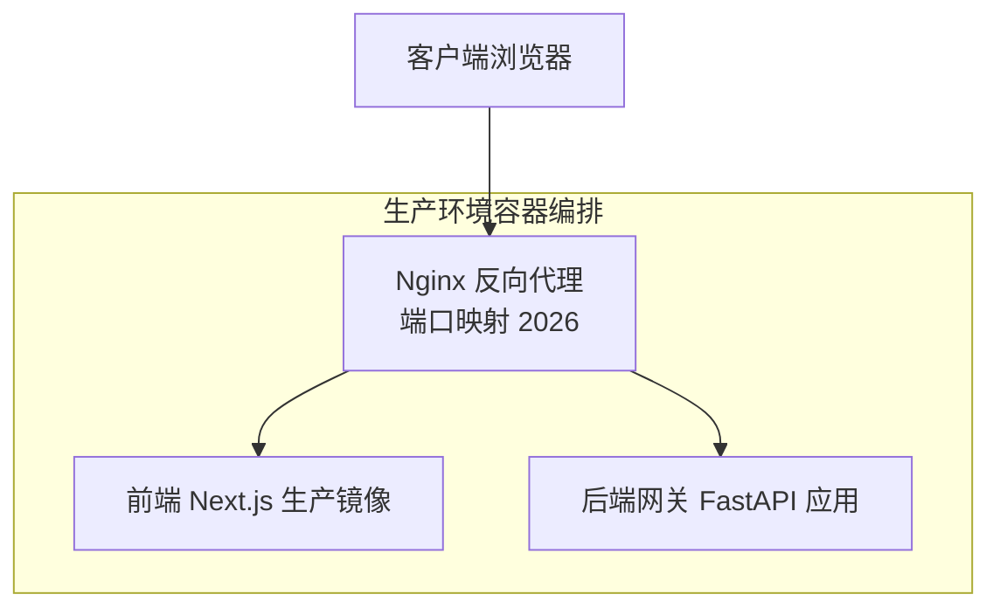
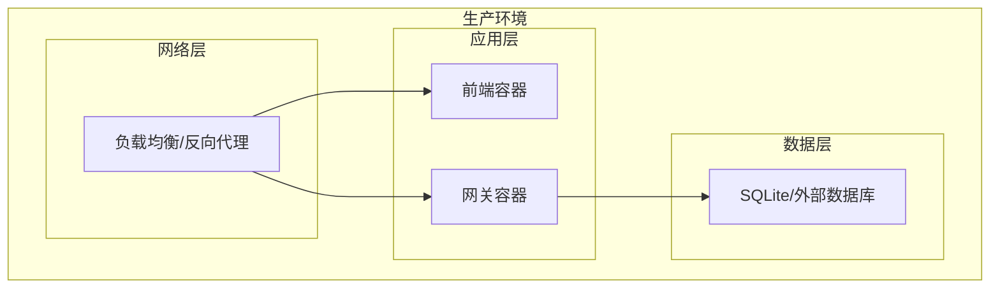
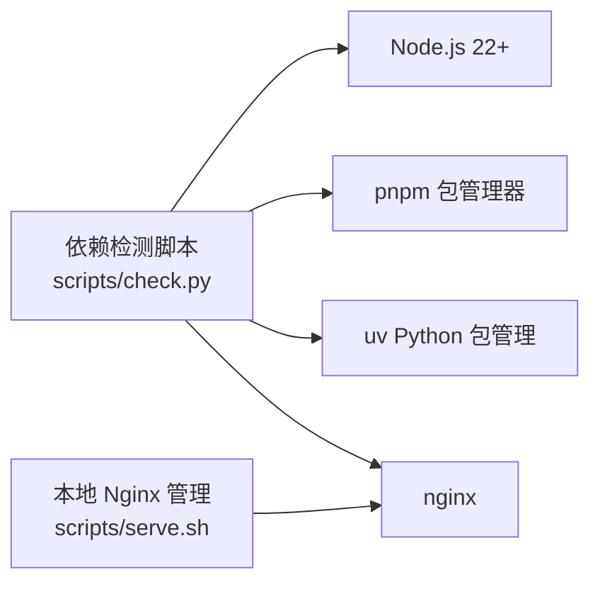

# 生产环境部署

<cite>
**本文引用的文件**
- [docker-compose.yaml](file://docker/docker-compose.yaml)
- [nginx.conf](file://docker/nginx/nginx.conf)
- [nginx.local.conf](file://docker/nginx/nginx.local.conf)
- [server.conf](file://docker/nginx/server.conf)
- [config.example.yaml](file://config.example.yaml)
- [release/config.example.yaml](file://release/config.example.yaml)
- [Makefile](file://Makefile)
- [scripts/check.py](file://scripts/check.py)
- [scripts/serve.sh](file://scripts/serve.sh)
- [.agent/skills/smoke-test/scripts/deploy_docker.sh](file://.agent/skills/smoke-test/scripts/deploy_docker.sh)
- [.agent/skills/smoke-test/references/SOP.md](file://.agent/skills/smoke-test/references/SOP.md)
- [.agent/skills/smoke-test/references/troubleshooting.md](file://.agent/skills/smoke-test/references/troubleshooting.md)
- [backend/Dockerfile](file://backend/Dockerfile)
- [frontend/Dockerfile](file://frontend/Dockerfile)
- [backend/pyproject.toml](file://backend/pyproject.toml)
- [backend/packages/harness/pyproject.toml](file://backend/packages/harness/pyproject.toml)
- [frontend/package.json](file://frontend/package.json)
- [frontend/next.config.js](file://frontend/next.config.js)
- [frontend/middleware.ts](file://frontend/middleware.ts)
- [backend/app/gateway/app.py](file://backend/app/gateway/app.py)
- [backend/app/gateway/config.py](file://backend/app/gateway/config.py)
- [backend/app/gateway/auth/jwt.py](file://backend/app/gateway/auth/jwt.py)
- [backend/app/gateway/routers/auth.py](file://backend/app/gateway/routers/auth.py)
- [backend/docs/CONFIGURATION.md](file://backend/docs/CONFIGURATION.md)
- [backend/docs/SETUP.md](file://backend/docs/SETUP.md)
- [docs/operations/BUILD_AND_DEPLOY.md](file://docs/operations/BUILD_AND_DEPLOY.md)
- [docs/operations/DEPLOYMENT_KNOWN_ISSUES.md](file://docs/operations/DEPLOYMENT_KNOWN_ISSUES.md)
</cite>

## 目录
1. [简介](#简介)
2. [项目结构](#项目结构)
3. [核心组件](#核心组件)
4. [架构总览](#架构总览)
5. [详细组件分析](#详细组件分析)
6. [依赖关系分析](#依赖关系分析)
7. [性能考虑](#性能考虑)
8. [安全加固](#安全加固)
9. [监控告警](#监控告警)
10. [部署清单与检查清单](#部署清单与检查清单)
11. [故障排除手册](#故障排除手册)
12. [结论](#结论)

## 简介
本指南面向在生产环境中部署 DeerFlow 的工程团队，提供从服务器环境准备、依赖安装、数据库与网络配置，到性能调优、安全加固、监控告警以及完整部署清单与故障排除的全流程实践。文档基于仓库中的实际配置与脚本进行梳理，确保可操作性与可追溯性。

## 项目结构
DeerFlow 采用前后端分离与反向代理统一入口的生产级容器化架构：
- 反向代理：Nginx（容器内模板渲染）
- 前端：Next.js 生产镜像
- 网关服务：Python/FastAPI 后端网关
- 数据库：SQLite（默认）或外部数据库（通过配置切换）
- 扩展模块：认证扩展、数据采集扩展等

图表来源
- [docker-compose.yaml:26-64](file://docker/docker-compose.yaml#L26-L64)
- [nginx.conf:1-200](file://docker/nginx/nginx.conf#L1-L200)

章节来源
- [docker-compose.yaml:26-64](file://docker/docker-compose.yaml#L26-L64)
- [nginx.conf:1-200](file://docker/nginx/nginx.conf#L1-L200)

## 核心组件
- 反向代理（Nginx）
  - 使用模板方式挂载配置，启动时复制模板为正式配置并常驻运行
  - 默认监听宿主机端口 2026，转发至前端与网关服务
- 前端（Next.js）
  - 构建目标为 prod，使用环境变量 BETTER_AUTH_SECRET 与 DEER_FLOW_INTERNAL_GATEWAY_BASE_URL
  - 设置内存上限与交换限制，便于资源约束
- 网关（FastAPI）
  - 作为统一入口，承载认证、路由与业务逻辑
  - 支持 JWT 认证与中间件链路
- 配置系统
  - config.yaml 优先级：显式路径 > 环境变量 > backend/config.yaml > 仓库根 config.yaml
  - 支持环境变量插值语法 $VAR_NAME
- 扩展模块
  - 认证扩展、数据采集扩展等，按需启用

章节来源
- [docker-compose.yaml:26-64](file://docker/docker-compose.yaml#L26-L64)
- [frontend/Dockerfile:1-200](file://frontend/Dockerfile#L1-L200)
- [backend/app/gateway/app.py:1-200](file://backend/app/gateway/app.py#L1-L200)
- [backend/app/gateway/auth/jwt.py:1-200](file://backend/app/gateway/auth/jwt.py#L1-L200)
- [backend/docs/CONFIGURATION.md:1-200](file://backend/docs/CONFIGURATION.md#L1-L200)

## 架构总览
生产环境采用容器化部署，Nginx 作为统一入口，负责静态资源与请求转发；前端与网关分别作为独立容器运行，通过内部网络互通。

图表来源
- [docker-compose.yaml:26-64](file://docker/docker-compose.yaml#L26-L64)
- [nginx.conf:1-200](file://docker/nginx/nginx.conf#L1-L200)

## 详细组件分析

### 反向代理（Nginx）
- 模板配置：通过挂载模板并在启动时复制为正式配置，避免直接修改容器内文件
- 端口映射：默认将容器端口 2026 映射到宿主机端口 2026
- 依赖服务：先于前端与网关启动，确保上游服务可用
- 本地开发临时目录：可通过 http 块添加 client_body_temp_path 等路径指向仓库内的 temp 目录

章节来源
- [docker-compose.yaml:26-44](file://docker/docker-compose.yaml#L26-L44)
- [.agent/skills/smoke-test/references/troubleshooting.md:273-293](file://.agent/skills/smoke-test/references/troubleshooting.md#L273-L293)

### 前端（Next.js 生产镜像）
- 构建阶段：使用 prod 目标，支持 PNPM_STORE_PATH 与 NPM_REGISTRY 环境变量
- 运行时环境：BETTER_AUTH_SECRET、DEER_FLOW_INTERNAL_GATEWAY_BASE_URL
- 资源限制：mem_limit 与 memswap_limit 用于容器内存约束

章节来源
- [docker-compose.yaml:45-64](file://docker/docker-compose.yaml#L45-L64)
- [frontend/Dockerfile:1-200](file://frontend/Dockerfile#L1-L200)

### 网关（FastAPI）
- 统一入口：处理认证、路由与业务逻辑
- 中间件：包含鉴权中间件、CSRF 中间件等
- 配置加载：支持从 config.yaml 加载运行参数

章节来源
- [backend/app/gateway/app.py:1-200](file://backend/app/gateway/app.py#L1-L200)
- [backend/app/gateway/config.py:1-200](file://backend/app/gateway/config.py#L1-L200)
- [backend/app/gateway/auth/jwt.py:1-200](file://backend/app/gateway/auth/jwt.py#L1-L200)
- [backend/app/gateway/routers/auth.py:1-200](file://backend/app/gateway/routers/auth.py#L1-L200)

### 配置系统
- 配置文件解析顺序：显式路径 > 环境变量 > backend/config.yaml > 仓库根 config.yaml
- 环境变量插值：$VAR_NAME 语法支持
- 示例配置：提供 config.example.yaml 与 release/config.example.yaml

章节来源
- [backend/docs/CONFIGURATION.md:1-200](file://backend/docs/CONFIGURATION.md#L1-L200)
- [config.example.yaml:1-200](file://config.example.yaml#L1-L200)
- [release/config.example.yaml:1-200](file://release/config.example.yaml#L1-L200)

### 容器编排与构建
- 编排文件：docker/docker-compose.yaml
- 构建命令：Makefile 提供 up/down、docker-start/stop、logs 等常用命令
- 一键部署脚本：.agent/skills/smoke-test/scripts/deploy_docker.sh

章节来源
- [docker-compose.yaml:26-64](file://docker/docker-compose.yaml#L26-L64)
- [Makefile:35-47](file://Makefile#L35-L47)
- [.agent/skills/smoke-test/scripts/deploy_docker.sh:54-65](file://.agent/skills/smoke-test/scripts/deploy_docker.sh#L54-L65)

## 依赖关系分析
- 外部工具依赖：Node.js 22+、pnpm、uv、nginx
- 本地模式检测：scripts/check.py 检查工具是否安装并输出建议
- 本地 Nginx 进程管理：scripts/serve.sh 提供进程识别与强制终止能力

图表来源
- [scripts/check.py:129-170](file://scripts/check.py#L129-L170)
- [scripts/serve.sh:129-174](file://scripts/serve.sh#L129-L174)

章节来源
- [scripts/check.py:129-170](file://scripts/check.py#L129-L170)
- [scripts/serve.sh:129-174](file://scripts/serve.sh#L129-L174)

## 性能考虑
- 内存配置
  - 前端容器已设置 mem_limit 与 memswap_limit，建议结合业务峰值评估并适当上调
- 并发连接数
  - Nginx 可通过模板配置调整 worker_connections、worker_processes 等参数
- 缓存策略
  - 前端构建缓存：PNPM_STORE_PATH 指向持久化存储，提升二次构建速度
  - 服务端缓存：根据业务场景引入 Redis 或本地缓存（需在 config.yaml 中配置）
- 资源限制
  - 使用容器内存限制防止资源争用
  - 后端服务可通过 Gunicorn/Uvicorn 的并发参数与进程数优化吞吐

章节来源
- [docker-compose.yaml:63-64](file://docker/docker-compose.yaml#L63-L64)
- [frontend/Dockerfile:1-200](file://frontend/Dockerfile#L1-L200)

## 安全加固
- 防火墙与网络
  - 仅开放必要端口（如 2026），其余端口限制对外访问
  - 使用反向代理统一入口，隐藏后端服务端口
- SSL/TLS
  - 在 Nginx 层部署证书与密钥，启用 HTTPS 强制跳转
- 访问控制
  - JWT 认证与 CSRF 中间件保障接口安全
  - 对敏感路由增加权限校验与速率限制
- 数据加密
  - 配置数据库连接使用 TLS（如外部 MySQL/PostgreSQL）
  - 密钥与敏感配置通过环境变量注入，不写入镜像

章节来源
- [backend/app/gateway/auth/jwt.py:1-200](file://backend/app/gateway/auth/jwt.py#L1-L200)
- [backend/app/gateway/csrf_middleware.py:1-200](file://backend/app/gateway/csrf_middleware.py#L1-L200)
- [nginx.conf:1-200](file://docker/nginx/nginx.conf#L1-L200)

## 监控告警
- 系统监控
  - 宿主机层面：CPU、内存、磁盘、网络 IO
- 应用指标
  - Nginx：连接数、请求状态码分布、响应时间
  - 前端与网关：健康检查端点、错误计数、QPS
- 日志聚合
  - 容器标准输出采集，集中存储与检索
- 告警规则
  - 健康检查失败、错误率阈值、响应时间超限、资源使用率过高

章节来源
- [docker/docker-compose.yaml:26-64](file://docker/docker-compose.yaml#L26-L64)
- [backend/app/gateway/app.py:1-200](file://backend/app/gateway/app.py#L1-L200)

## 部署清单与检查清单
- 服务器环境准备
  - 安装 Docker 与 Docker Compose
  - 准备域名与 SSL 证书（Nginx 层部署）
  - 开放端口 2026（TCP），防火墙策略最小化
- 依赖软件安装
  - Node.js 22+、pnpm、uv、nginx（如本地模式）
  - 使用 scripts/check.py 验证工具链
- 数据库配置
  - SQLite（默认）或外部数据库（在 config.yaml 中配置）
  - 初始化迁移脚本（如适用）
- 网络安全设置
  - Nginx 配置 HTTPS、HSTS、安全头
  - JWT 密钥与 CSRF 密钥妥善保管
- 配置文件
  - 复制 config.example.yaml 为生产配置，设置环境变量
  - 确认 DEER_FLOW_CONFIG_PATH 指向正确位置
- 启动与验证
  - 使用 make up 启动生产服务
  - 访问 http://<host>:2026 进行健康检查
  - 查看容器日志定位问题

章节来源
- [.agent/skills/smoke-test/references/SOP.md:203-268](file://.agent/skills/smoke-test/references/SOP.md#L203-L268)
- [scripts/check.py:129-170](file://scripts/check.py#L129-L170)
- [Makefile:35-47](file://Makefile#L35-L47)

## 故障排除手册
- 本地模式常见问题
  - 前端依赖安装失败：清理 pnpm store、删除 node_modules 与锁文件后重装
  - 服务启动后立即退出：查看 gateway.log、frontend.log、nginx.log，确认 config.yaml 与 .env
  - Nginx 启动失败（临时目录不存在）：在 nginx.local.conf 的 http 块中添加 client_body_temp_path 等路径
  - Nginx 一般性启动失败：使用 nginx -t 测试配置，检查日志与是否存在冲突进程
  - 前端编译失败：确认 Node.js 版本、清理 .next 后重新安装依赖
  - 网关启动失败：检查 config.yaml 格式、后端依赖 uv sync
- Docker 相关问题
  - 无法连接 Docker 守护进程：确认 Docker Desktop 或 systemctl 状态
  - make docker-init 拉取镜像失败：检查网络与镜像仓库可达性

章节来源
- [.agent/skills/smoke-test/references/troubleshooting.md:221-395](file://.agent/skills/smoke-test/references/troubleshooting.md#L221-L395)

## 结论
通过容器化编排与 Nginx 统一入口，DeerFlow 可在生产环境中实现高可用与易维护。建议结合本文的安全加固、性能调优与监控告警实践，配合完善的部署清单与故障排除流程，确保系统稳定运行。