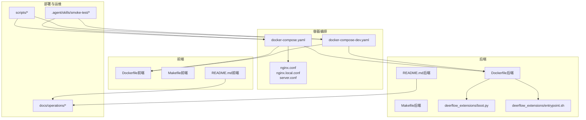
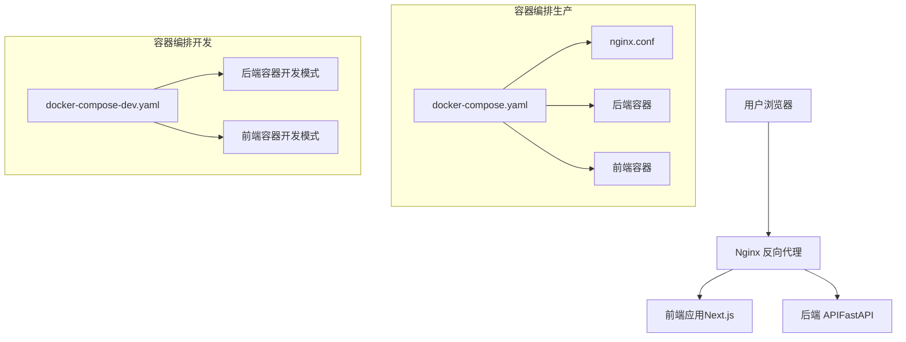
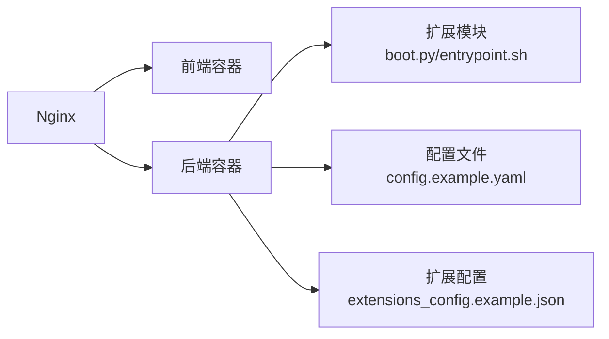

# 部署与运维

<cite>
**本文引用的文件**
- [Dockerfile（后端）](file://backend/Dockerfile)
- [docker-compose.yaml](file://docker/docker-compose.yaml)
- [docker-compose-dev.yaml](file://docker/docker-compose-dev.yaml)
- [dev-entrypoint.sh](file://docker/dev-entrypoint.sh)
- [nginx.conf](file://docker/nginx/nginx.conf)
- [nginx.local.conf](file://docker/nginx/nginx.local.conf)
- [server.conf](file://docker/nginx/server.conf)
- [config.example.yaml](file://config.example.yaml)
- [extensions_config.example.json](file://extensions_config.example.json)
- [DEPLOYMENT_KNOWN_ISSUES.md](file://docs/operations/DEPLOYMENT_KNOWN_ISSUES.md)
- [BUILD_AND_DEPLOY.md](file://docs/operations/BUILD_AND_DEPLOY.md)
- [USE_GUIDE.md](file://docs/operations/USE_GUIDE.md)
- [README.md（后端）](file://backend/README.md)
- [Makefile（后端）](file://backend/Makefile)
- [Makefile（前端）](file://frontend/Makefile)
- [scripts/deploy.sh](file://scripts/deploy.sh)
- [scripts/start-deerflow.sh](file://scripts/start-deerflow.sh)
- [scripts/serve.sh](file://scripts/serve.sh)
- [scripts/wait-for-port.sh](file://scripts/wait-for-port.sh)
- [.agent/skills/smoke-test/scripts/deploy_docker.sh](file://.agent/skills/smoke-test/scripts/deploy_docker.sh)
- [.agent/skills/smoke-test/scripts/deploy_local.sh](file://.agent/skills/smoke-test/scripts/deploy_local.sh)
- [.agent/skills/smoke-test/scripts/health_check.sh](file://.agent/skills/smoke-test/scripts/health_check.sh)
- [.agent/skills/smoke-test/scripts/check_docker.sh](file://.agent/skills/smoke-test/scripts/check_docker.sh)
- [.agent/skills/smoke-test/scripts/check_local_env.sh](file://.agent/skills/smoke-test/scripts/check_local_env.sh)
- [.agent/skills/smoke-test/templates/report.docker.template.md](file://.agent/skills/smoke-test/templates/report.docker.template.md)
- [.agent/skills/smoke-test/templates/report.local.template.md](file://.agent/skills/smoke-test/templates/report.local.template.md)
- [deerflow_extensions/boot.py](file://deerflow_extensions/boot.py)
- [deerflow_extensions/entrypoint.sh](file://deerflow_extensions/entrypoint.sh)
</cite>

## 目录
1. [简介](#简介)
2. [项目结构](#项目结构)
3. [核心组件](#核心组件)
4. [架构总览](#架构总览)
5. [详细组件分析](#详细组件分析)
6. [依赖关系分析](#依赖关系分析)
7. [性能考虑](#性能考虑)
8. [故障排除指南](#故障排除指南)
9. [结论](#结论)
10. [附录](#附录)

## 简介
本文件面向运维工程师与平台管理员，系统性阐述 DeerFlow 的容器化部署策略与生产级运维实践。内容覆盖 Docker 镜像构建、容器编排、环境配置管理、健康检查、多模式部署（Docker 开发模式、本地开发模式、生产部署模式）、性能调优、安全加固与监控告警配置，并提供可复用的部署脚本与模板。

## 项目结构
DeerFlow 采用前后端分离与扩展模块并行的组织方式，部署相关的关键目录与文件如下：
- 后端：包含后端 Dockerfile、后端 Makefile、后端 README、后端入口脚本等
- 前端：包含前端 Dockerfile、前端 Makefile、前端 README
- 容器编排：docker-compose.yaml、docker-compose-dev.yaml 及 Nginx 配置
- 部署脚本与指南：docs/operations 下的部署与使用文档、scripts/ 下启动与等待脚本
- 扩展模块：deerflow_extensions 提供启动引导与扩展入口
- 验收测试：.agent/skills/smoke-test 提供 Docker 与本地部署的验收脚本与报告模板

图表来源
- [docker-compose.yaml](file://docker/docker-compose.yaml)
- [docker-compose-dev.yaml](file://docker/docker-compose-dev.yaml)
- [nginx.conf](file://docker/nginx/nginx.conf)
- [nginx.local.conf](file://docker/nginx/nginx.local.conf)
- [server.conf](file://docker/nginx/server.conf)
- [Dockerfile（后端）](file://backend/Dockerfile)
- [Makefile（后端）](file://backend/Makefile)
- [README.md（后端）](file://backend/README.md)
- [deerflow_extensions/boot.py](file://deerflow_extensions/boot.py)
- [deerflow_extensions/entrypoint.sh](file://deerflow_extensions/entrypoint.sh)
- [Makefile（前端）](file://frontend/Makefile)
- [Dockerfile（前端）](file://frontend/Dockerfile)
- [docs/operations/BUILD_AND_DEPLOY.md](file://docs/operations/BUILD_AND_DEPLOY.md)
- [docs/operations/USE_GUIDE.md](file://docs/operations/USE_GUIDE.md)
- [scripts/deploy.sh](file://scripts/deploy.sh)
- [scripts/start-deerflow.sh](file://scripts/start-deerflow.sh)
- [scripts/serve.sh](file://scripts/serve.sh)
- [scripts/wait-for-port.sh](file://scripts/wait-for-port.sh)
- [.agent/skills/smoke-test/scripts/deploy_docker.sh](file://.agent/skills/smoke-test/scripts/deploy_docker.sh)
- [.agent/skills/smoke-test/scripts/deploy_local.sh](file://.agent/skills/smoke-test/scripts/deploy_local.sh)
- [.agent/skills/smoke-test/scripts/health_check.sh](file://.agent/skills/smoke-test/scripts/health_check.sh)
- [.agent/skills/smoke-test/scripts/check_docker.sh](file://.agent/skills/smoke-test/scripts/check_docker.sh)
- [.agent/skills/smoke-test/scripts/check_local_env.sh](file://.agent/skills/smoke-test/scripts/check_local_env.sh)
- [.agent/skills/smoke-test/templates/report.docker.template.md](file://.agent/skills/smoke-test/templates/report.docker.template.md)
- [.agent/skills/smoke-test/templates/report.local.template.md](file://.agent/skills/smoke-test/templates/report.local.template.md)

章节来源
- [docker-compose.yaml](file://docker/docker-compose.yaml)
- [docker-compose-dev.yaml](file://docker/docker-compose-dev.yaml)
- [nginx.conf](file://docker/nginx/nginx.conf)
- [nginx.local.conf](file://docker/nginx/nginx.local.conf)
- [server.conf](file://docker/nginx/server.conf)
- [Dockerfile（后端）](file://backend/Dockerfile)
- [Makefile（后端）](file://backend/Makefile)
- [README.md（后端）](file://backend/README.md)
- [Makefile（前端）](file://frontend/Makefile)
- [Dockerfile（前端）](file://frontend/Dockerfile)
- [docs/operations/BUILD_AND_DEPLOY.md](file://docs/operations/BUILD_AND_DEPLOY.md)
- [docs/operations/USE_GUIDE.md](file://docs/operations/USE_GUIDE.md)
- [scripts/deploy.sh](file://scripts/deploy.sh)
- [scripts/start-deerflow.sh](file://scripts/start-deerflow.sh)
- [scripts/serve.sh](file://scripts/serve.sh)
- [scripts/wait-for-port.sh](file://scripts/wait-for-port.sh)
- [.agent/skills/smoke-test/scripts/deploy_docker.sh](file://.agent/skills/smoke-test/scripts/deploy_docker.sh)
- [.agent/skills/smoke-test/scripts/deploy_local.sh](file://.agent/skills/smoke-test/scripts/deploy_local.sh)
- [.agent/skills/smoke-test/scripts/health_check.sh](file://.agent/skills/smoke-test/scripts/health_check.sh)
- [.agent/skills/smoke-test/scripts/check_docker.sh](file://.agent/skills/smoke-test/scripts/check_docker.sh)
- [.agent/skills/smoke-test/scripts/check_local_env.sh](file://.agent/skills/smoke-test/scripts/check_local_env.sh)
- [.agent/skills/smoke-test/templates/report.docker.template.md](file://.agent/skills/smoke-test/templates/report.docker.template.md)
- [.agent/skills/smoke-test/templates/report.local.template.md](file://.agent/skills/smoke-test/templates/report.local.template.md)

## 核心组件
- 容器编排与反向代理
  - 生产与开发双套 compose 配置，统一由 Nginx 提供静态资源与反向代理
- 后端服务
  - 使用后端 Dockerfile 构建镜像；通过扩展模块 boot.py 与 entrypoint.sh 进行启动引导
- 前端服务
  - 使用前端 Dockerfile 构建镜像；前端 Makefile 提供构建与运行目标
- 部署与运维脚本
  - scripts/ 下提供一键部署、启动与端口等待脚本；.agent/skills/smoke-test 提供验收脚本与报告模板
- 配置管理
  - config.example.yaml 与 extensions_config.example.json 提供默认配置模板

章节来源
- [docker-compose.yaml](file://docker/docker-compose.yaml)
- [docker-compose-dev.yaml](file://docker/docker-compose-dev.yaml)
- [nginx.conf](file://docker/nginx/nginx.conf)
- [nginx.local.conf](file://docker/nginx/nginx.local.conf)
- [server.conf](file://docker/nginx/server.conf)
- [Dockerfile（后端）](file://backend/Dockerfile)
- [deerflow_extensions/boot.py](file://deerflow_extensions/boot.py)
- [deerflow_extensions/entrypoint.sh](file://deerflow_extensions/entrypoint.sh)
- [Dockerfile（前端）](file://frontend/Dockerfile)
- [Makefile（前端）](file://frontend/Makefile)
- [scripts/deploy.sh](file://scripts/deploy.sh)
- [scripts/start-deerflow.sh](file://scripts/start-deerflow.sh)
- [scripts/serve.sh](file://scripts/serve.sh)
- [scripts/wait-for-port.sh](file://scripts/wait-for-port.sh)
- [config.example.yaml](file://config.example.yaml)
- [extensions_config.example.json](file://extensions_config.example.json)

## 架构总览
下图展示生产与开发两种部署模式下的整体架构与交互流程。

图表来源
- [docker-compose.yaml](file://docker/docker-compose.yaml)
- [docker-compose-dev.yaml](file://docker/docker-compose-dev.yaml)
- [nginx.conf](file://docker/nginx/nginx.conf)
- [Dockerfile（后端）](file://backend/Dockerfile)
- [Dockerfile（前端）](file://frontend/Dockerfile)

## 详细组件分析

### 容器化与镜像构建
- 后端镜像
  - 使用后端 Dockerfile 构建，建议在 CI 中缓存依赖层以提升构建效率
  - 构建参数与工作目录遵循后端 Makefile 的约定，便于本地与流水线一致化
- 前端镜像
  - 使用前端 Dockerfile 构建，结合 Makefile 的构建目标进行优化
- 镜像标签与版本
  - 建议在 CI 中基于 Git 描述符生成语义化版本标签，配合 digest 回滚

章节来源
- [Dockerfile（后端）](file://backend/Dockerfile)
- [Makefile（后端）](file://backend/Makefile)
- [Dockerfile（前端）](file://frontend/Dockerfile)
- [Makefile（前端）](file://frontend/Makefile)

### 容器编排与服务发现
- 生产编排
  - docker-compose.yaml 定义后端、前端与 Nginx 服务，设置网络、卷与环境变量
  - Nginx 配置分别支持生产与本地开发场景，server.conf 提供上游后端地址模板
- 开发编排
  - docker-compose-dev.yaml 适配本地开发模式，简化依赖与端口映射
- 服务间通信
  - 通过服务名进行内部 DNS 解析，避免硬编码 IP

章节来源
- [docker-compose.yaml](file://docker/docker-compose.yaml)
- [docker-compose-dev.yaml](file://docker/docker-compose-dev.yaml)
- [nginx.conf](file://docker/nginx/nginx.conf)
- [nginx.local.conf](file://docker/nginx/nginx.local.conf)
- [server.conf](file://docker/nginx/server.conf)

### 启动引导与扩展模块
- deerflow_extensions/boot.py
  - 负责加载扩展、初始化配置与运行时环境
- deerflow_extensions/entrypoint.sh
  - 作为容器入口脚本，执行预检、迁移与启动命令
- 后端入口
  - 结合后端 README 与 Makefile，确保启动顺序与依赖满足

章节来源
- [deerflow_extensions/boot.py](file://deerflow_extensions/boot.py)
- [deerflow_extensions/entrypoint.sh](file://deerflow_extensions/entrypoint.sh)
- [README.md（后端）](file://backend/README.md)
- [Makefile（后端）](file://backend/Makefile)

### 配置管理
- 应用配置
  - config.example.yaml 提供默认键值与注释，建议在部署时复制为实际配置文件并注入到容器
- 扩展配置
  - extensions_config.example.json 提供扩展模块的默认配置模板
- 环境变量
  - 在 docker-compose 中通过 env 文件或直接声明，避免明文写入仓库

章节来源
- [config.example.yaml](file://config.example.yaml)
- [extensions_config.example.json](file://extensions_config.example.json)
- [docker-compose.yaml](file://docker/docker-compose.yaml)
- [docker-compose-dev.yaml](file://docker/docker-compose-dev.yaml)

### 健康检查与就绪探针
- 探针策略
  - 建议对后端与前端分别配置 HTTP GET 就绪探针，探测 / 或 /ready
  - 对数据库与外部服务增加 TCP/HTTP 检查，确保依赖可用
- 接口验证
  - 使用 .agent/skills/smoke-test/scripts/health_check.sh 进行端到端健康检查

章节来源
- [.agent/skills/smoke-test/scripts/health_check.sh](file://.agent/skills/smoke-test/scripts/health_check.sh)

### 部署模式与配置选择
- Docker 开发模式
  - 使用 docker-compose-dev.yaml，适合本地联调与快速迭代
  - 通过 .agent/skills/smoke-test/scripts/deploy_local.sh 快速拉起
- 本地开发模式
  - 通过 scripts/start-deerflow.sh 与 scripts/serve.sh 启动后端与前端
  - 通过 .agent/skills/smoke-test/scripts/check_local_env.sh 校验本地环境
- 生产部署模式
  - 使用 docker-compose.yaml，结合 Nginx 与反向代理
  - 通过 scripts/deploy.sh 一键部署，配合 scripts/wait-for-port.sh 等待端口就绪

章节来源
- [docker-compose-dev.yaml](file://docker/docker-compose-dev.yaml)
- [.agent/skills/smoke-test/scripts/deploy_local.sh](file://.agent/skills/smoke-test/scripts/deploy_local.sh)
- [scripts/start-deerflow.sh](file://scripts/start-deerflow.sh)
- [scripts/serve.sh](file://scripts/serve.sh)
- [.agent/skills/smoke-test/scripts/check_local_env.sh](file://.agent/skills/smoke-test/scripts/check_local_env.sh)
- [docker-compose.yaml](file://docker/docker-compose.yaml)
- [scripts/deploy.sh](file://scripts/deploy.sh)
- [scripts/wait-for-port.sh](file://scripts/wait-for-port.sh)

### 部署示例与配置模板
- 示例一：Docker 开发模式
  - 步骤：拉取代码 → 启动 compose 开发版 → 访问前端 → 健康检查
  - 参考脚本：.agent/skills/smoke-test/scripts/deploy_docker.sh
  - 报告模板：.agent/skills/smoke-test/templates/report.docker.template.md
- 示例二：本地开发模式
  - 步骤：安装依赖 → 启动后端 → 启动前端 → 访问本地服务
  - 参考脚本：scripts/start-deerflow.sh、scripts/serve.sh
  - 环境校验：.agent/skills/smoke-test/scripts/check_local_env.sh
- 示例三：生产部署模式
  - 步骤：准备配置 → 构建镜像 → 启动 compose → 配置 Nginx → 健康检查
  - 参考文档：docs/operations/BUILD_AND_DEPLOY.md、docs/operations/USE_GUIDE.md

章节来源
- [.agent/skills/smoke-test/scripts/deploy_docker.sh](file://.agent/skills/smoke-test/scripts/deploy_docker.sh)
- [.agent/skills/smoke-test/templates/report.docker.template.md](file://.agent/skills/smoke-test/templates/report.docker.template.md)
- [scripts/start-deerflow.sh](file://scripts/start-deerflow.sh)
- [scripts/serve.sh](file://scripts/serve.sh)
- [.agent/skills/smoke-test/scripts/check_local_env.sh](file://.agent/skills/smoke-test/scripts/check_local_env.sh)
- [docs/operations/BUILD_AND_DEPLOY.md](file://docs/operations/BUILD_AND_DEPLOY.md)
- [docs/operations/USE_GUIDE.md](file://docs/operations/USE_GUIDE.md)

## 依赖关系分析
- 组件耦合
  - Nginx 与后端/前端服务通过服务名通信，降低耦合度
  - 后端镜像与扩展模块解耦，通过入口脚本统一引导
- 外部依赖
  - 数据库、消息队列等外部服务通过 compose 依赖与健康检查保障可用性
- 潜在风险
  - 端口冲突、卷权限、网络隔离不当可能导致启动失败

图表来源
- [nginx.conf](file://docker/nginx/nginx.conf)
- [Dockerfile（后端）](file://backend/Dockerfile)
- [deerflow_extensions/boot.py](file://deerflow_extensions/boot.py)
- [deerflow_extensions/entrypoint.sh](file://deerflow_extensions/entrypoint.sh)
- [config.example.yaml](file://config.example.yaml)
- [extensions_config.example.json](file://extensions_config.example.json)

章节来源
- [nginx.conf](file://docker/nginx/nginx.conf)
- [Dockerfile（后端）](file://backend/Dockerfile)
- [deerflow_extensions/boot.py](file://deerflow_extensions/boot.py)
- [deerflow_extensions/entrypoint.sh](file://deerflow_extensions/entrypoint.sh)
- [config.example.yaml](file://config.example.yaml)
- [extensions_config.example.json](file://extensions_config.example.json)

## 性能考虑
- 镜像构建
  - 缓存 pip/uv/pnpm 等依赖层，减少重复下载
  - 分阶段构建，缩小最终镜像体积
- 运行时
  - 后端并发与连接池参数需根据 CPU/内存与数据库能力调优
  - 前端静态资源启用压缩与缓存头
- 存储与 I/O
  - 数据库与持久化卷使用 SSD，合理设置卷挂载权限
- 网络
  - Nginx 层启用 gzip/keepalive，限制请求体大小，开启限流与 WAF 规则

## 故障排除指南
- 常见问题清单
  - 容器无法启动：检查日志、端口占用、卷权限与环境变量
  - 健康检查失败：确认探针路径、后端就绪逻辑与依赖服务状态
  - 前端空白页：检查 Nginx upstream 地址、静态资源路径与缓存
- 排障流程
  - 使用 .agent/skills/smoke-test/scripts/health_check.sh 进行端到端验证
  - 使用 scripts/wait-for-port.sh 等待端口就绪，避免误判
  - 参考 docs/operations/DEPLOYMENT_KNOWN_ISSUES.md 获取已知问题与修复建议

章节来源
- [.agent/skills/smoke-test/scripts/health_check.sh](file://.agent/skills/smoke-test/scripts/health_check.sh)
- [scripts/wait-for-port.sh](file://scripts/wait-for-port.sh)
- [docs/operations/DEPLOYMENT_KNOWN_ISSUES.md](file://docs/operations/DEPLOYMENT_KNOWN_ISSUES.md)

## 结论
通过标准化的容器化与编排策略、完善的配置模板与验收脚本，DeerFlow 支持从本地开发到生产的全链路部署。建议在生产环境中强化安全与监控，持续优化镜像与运行时参数，并建立自动化验收与回滚机制，确保系统的稳定性与可维护性。

## 附录
- 部署最佳实践
  - 使用 CI 自动构建镜像并推送至镜像仓库
  - 采用滚动更新与蓝绿发布，结合健康检查与自动回滚
- 安全加固
  - 限制容器权限、启用只读根文件系统、移除不必要的包
  - 使用 secrets 管理敏感信息，禁用调试与开发工具
- 监控告警
  - 指标：CPU/内存/磁盘/网络/请求延迟/错误率
  - 日志：结构化日志、分层聚合、保留策略
  - 告警：阈值告警、趋势告警、SLI/SLA 对齐