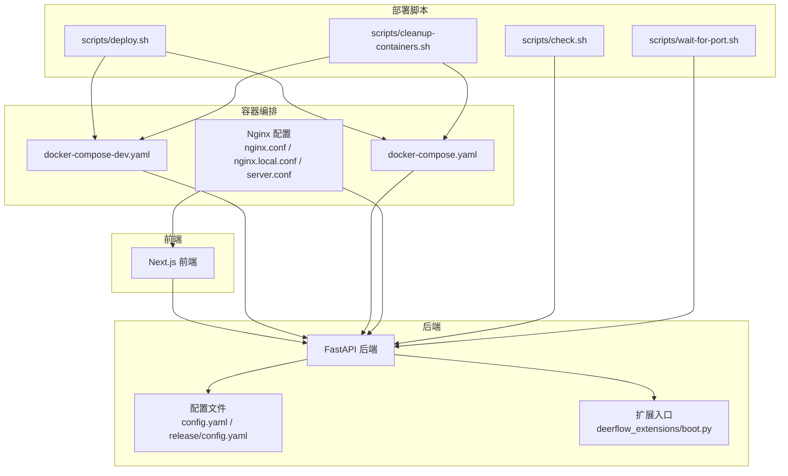
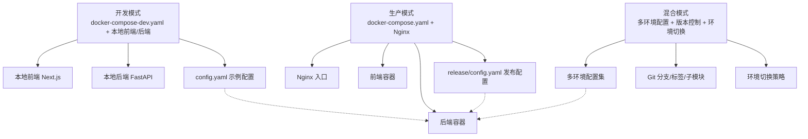
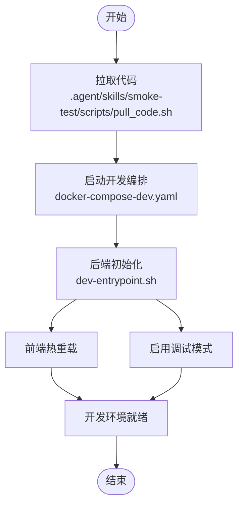
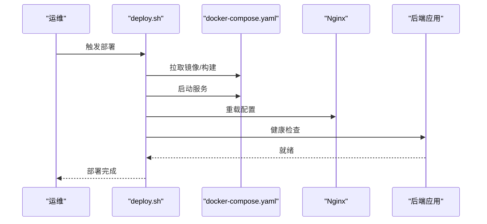
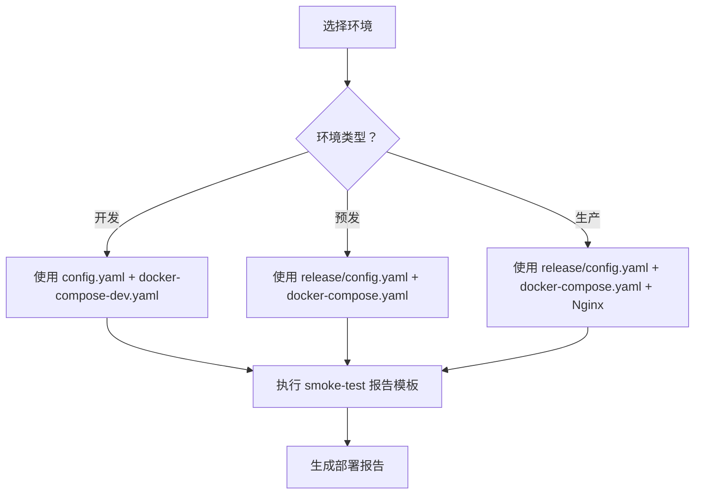
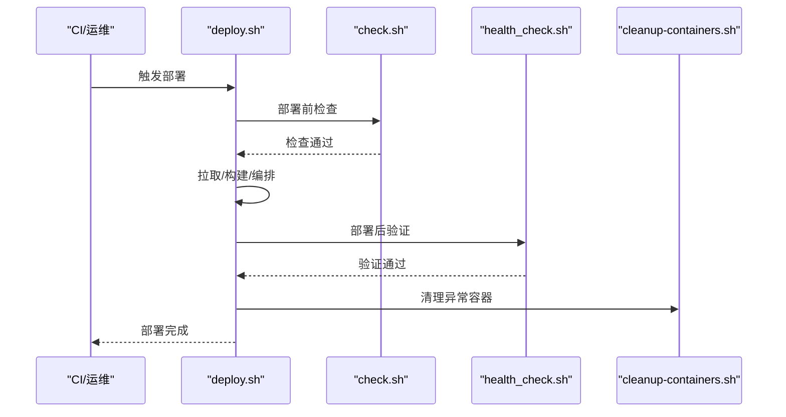
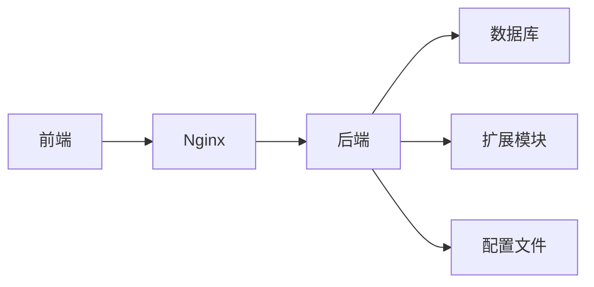

# 部署模式与配置

<cite>
**本文引用的文件**
- [config.example.yaml](file://config.example.yaml)
- [config.yaml](file://config.yaml)
- [release/config.example.yaml](file://release/config.example.yaml)
- [release/config.yaml](file://release/config.yaml)
- [docker-compose-dev.yaml](file://docker/docker-compose-dev.yaml)
- [docker-compose.yaml](file://docker/docker-compose.yaml)
- [Dockerfile（后端）](file://backend/Dockerfile)
- [Dockerfile（前端）](file://frontend/Dockerfile)
- [dev-entrypoint.sh](file://docker/dev-entrypoint.sh)
- [deploy.sh](file://scripts/deploy.sh)
- [check.sh](file://scripts/check.sh)
- [wait-for-port.sh](file://scripts/wait-for-port.sh)
- [cleanup-containers.sh](file://scripts/cleanup-containers.sh)
- [nginx.conf](file://docker/nginx/nginx.conf)
- [nginx.local.conf](file://docker/nginx/nginx.local.conf)
- [server.conf](file://docker/nginx/server.conf)
- [README.md（项目总览）](file://README.md)
- [BUILD_AND_DEPLOY.md](file://docs/operations/BUILD_AND_DEPLOY.md)
- [USE_GUIDE.md](file://docs/operations/USE_GUIDE.md)
- [DEPLOYMENT_KNOWN_ISSUES.md](file://docs/operations/DEPLOYMENT_KNOWN_ISSUES.md)
- [.agent/skills/smoke-test/scripts/deploy_local.sh](file://.agent/skills/smoke-test/scripts/deploy_local.sh)
- [.agent/skills/smoke-test/scripts/deploy_docker.sh](file://.agent/skills/smoke-test/scripts/deploy_docker.sh)
- [.agent/skills/smoke-test/scripts/health_check.sh](file://.agent/skills/smoke-test/scripts/health_check.sh)
- [.agent/skills/smoke-test/scripts/check_local_env.sh](file://.agent/skills/smoke-test/scripts/check_local_env.sh)
- [.agent/skills/smoke-test/scripts/check_docker.sh](file://.agent/skills/smoke-test/scripts/check_docker.sh)
- [.agent/skills/smoke-test/scripts/pull_code.sh](file://.agent/skills/smoke-test/scripts/pull_code.sh)
- [.agent/skills/smoke-test/templates/report.local.template.md](file://.agent/skills/smoke-test/templates/report.local.template.md)
- [.agent/skills/smoke-test/templates/report.docker.template.md](file://.agent/skills/smoke-test/templates/report.docker.template.md)
</cite>

## 目录
1. [引言](#引言)
2. [项目结构](#项目结构)
3. [核心组件](#核心组件)
4. [架构总览](#架构总览)
5. [详细组件分析](#详细组件分析)
6. [依赖关系分析](#依赖关系分析)
7. [性能考量](#性能考量)
8. [故障排查指南](#故障排查指南)
9. [结论](#结论)
10. [附录](#附录)

## 引言
本指南面向不同部署模式（开发、生产、混合）提供系统化的配置与操作指引，覆盖本地开发环境设置、热重载、调试模式、生产性能优化、资源限制、日志与监控、多环境配置管理、版本控制与环境切换策略，并给出部署脚本使用方法、自动化流程、回滚与验证策略，以及可复用的配置模板与最佳实践。

## 项目结构
- 后端服务：基于 Python 的 FastAPI 应用，包含认证、路由、运行时、沙箱、技能等模块；支持容器化部署与本地开发。
- 前端应用：Next.js 应用，提供工作区、聊天、设置等功能页面。
- 配置体系：以 YAML 为主的应用配置，配合示例模板与发布目录中的配置样例。
- 容器编排：提供开发与生产两套 docker-compose 模板，配套 Nginx 配置。
- 部署脚本：集中于 scripts 目录，涵盖构建、部署、健康检查、端口等待、清理等常用能力。
- 扩展与运维：deerflow_extensions 提供扩展入口与启动逻辑；.agent/skills/smoke-test 提供烟雾测试与报告模板。

图表来源
- [docker-compose-dev.yaml](file://docker/docker-compose-dev.yaml)
- [docker-compose.yaml](file://docker/docker-compose.yaml)
- [config.yaml](file://config.yaml)
- [release/config.yaml](file://release/config.yaml)
- [deploy.sh](file://scripts/deploy.sh)
- [check.sh](file://scripts/check.sh)
- [wait-for-port.sh](file://scripts/wait-for-port.sh)
- [cleanup-containers.sh](file://scripts/cleanup-containers.sh)
- [nginx.conf](file://docker/nginx/nginx.conf)
- [nginx.local.conf](file://docker/nginx/nginx.local.conf)
- [server.conf](file://docker/nginx/server.conf)

章节来源
- [README.md（项目总览）](file://README.md)
- [BUILD_AND_DEPLOY.md](file://docs/operations/BUILD_AND_DEPLOY.md)

## 核心组件
- 应用配置
  - 使用 YAML 管理后端配置，示例模板位于根目录与 release 目录，便于复制与差异化管理。
  - 关键配置项包括数据库连接、模型提供商、安全与鉴权、内存与持久化、流式传输、追踪与日志等。
- 容器与编排
  - 开发模式：docker-compose-dev.yaml 将前端与后端组合，便于本地联调。
  - 生产模式：docker-compose.yaml 提供更严格的网络与资源隔离。
  - Nginx 配置分别用于开发与生产环境，统一入口与静态资源分发。
- 部署脚本
  - deploy.sh：封装拉取代码、构建镜像、编排启动、健康检查、端口等待等步骤。
  - check.sh：通用部署前检查（环境变量、端口占用、依赖可用性）。
  - wait-for-port.sh：等待目标端口就绪，避免启动顺序问题。
  - cleanup-containers.sh：清理残留容器，降低资源冲突风险。
- 扩展与启动
  - deerflow_extensions/boot.py 作为扩展入口，负责加载扩展与启动逻辑。
- 烟雾测试与报告
  - .agent/skills/smoke-test 提供本地与 Docker 两种部署路径的烟雾测试脚本与报告模板，便于快速验证部署结果。

章节来源
- [config.example.yaml](file://config.example.yaml)
- [config.yaml](file://config.yaml)
- [release/config.example.yaml](file://release/config.example.yaml)
- [release/config.yaml](file://release/config.yaml)
- [docker-compose-dev.yaml](file://docker/docker-compose-dev.yaml)
- [docker-compose.yaml](file://docker/docker-compose.yaml)
- [nginx.conf](file://docker/nginx/nginx.conf)
- [nginx.local.conf](file://docker/nginx/nginx.local.conf)
- [server.conf](file://docker/nginx/server.conf)
- [deploy.sh](file://scripts/deploy.sh)
- [check.sh](file://scripts/check.sh)
- [wait-for-port.sh](file://scripts/wait-for-port.sh)
- [cleanup-containers.sh](file://scripts/cleanup-containers.sh)
- [deerflow_extensions/boot.py](file://deerflow_extensions/boot.py)
- [.agent/skills/smoke-test/scripts/deploy_local.sh](file://.agent/skills/smoke-test/scripts/deploy_local.sh)
- [.agent/skills/smoke-test/scripts/deploy_docker.sh](file://.agent/skills/smoke-test/scripts/deploy_docker.sh)
- [.agent/skills/smoke-test/scripts/health_check.sh](file://.agent/skills/smoke-test/scripts/health_check.sh)
- [.agent/skills/smoke-test/scripts/check_local_env.sh](file://.agent/skills/smoke-test/scripts/check_local_env.sh)
- [.agent/skills/smoke-test/scripts/check_docker.sh](file://.agent/skills/smoke-test/scripts/check_docker.sh)
- [.agent/skills/smoke-test/scripts/pull_code.sh](file://.agent/skills/smoke-test/scripts/pull_code.sh)
- [.agent/skills/smoke-test/templates/report.local.template.md](file://.agent/skills/smoke-test/templates/report.local.template.md)
- [.agent/skills/smoke-test/templates/report.docker.template.md](file://.agent/skills/smoke-test/templates/report.docker.template.md)

## 架构总览
下图展示三种部署模式下的典型交互：开发模式侧重本地联调与热重载；生产模式强调稳定性与可观测性；混合模式通过配置与脚本实现多环境协同。

图表来源
- [docker-compose-dev.yaml](file://docker/docker-compose-dev.yaml)
- [docker-compose.yaml](file://docker/docker-compose.yaml)
- [config.yaml](file://config.yaml)
- [release/config.yaml](file://release/config.yaml)
- [nginx.conf](file://docker/nginx/nginx.conf)
- [nginx.local.conf](file://docker/nginx/nginx.local.conf)
- [server.conf](file://docker/nginx/server.conf)

## 详细组件分析

### 开发模式配置
- 本地开发环境设置
  - 使用 docker-compose-dev.yaml 启动后端与前端，便于联调与热重载。
  - 前端与后端镜像可通过 Dockerfile 构建，或使用官方镜像。
  - 开发入口脚本 dev-entrypoint.sh 可在容器内执行初始化任务。
- 热重载与调试
  - 前端 Next.js 支持热更新；后端可结合容器卷挂载与调试器进行断点调试。
  - 建议在 IDE 中配置后端远程调试（如 Python 调试器），并开启日志到标准输出以便观察。
- 开发工具集成
  - 使用 scripts/check.sh 进行部署前检查，确保端口、依赖与环境变量就绪。
  - 使用 wait-for-port.sh 等待后端端口可用后再进行前端访问。
- 配置要点
  - 复制 config.example.yaml 为 config.yaml 并按需修改数据库、模型提供商、安全密钥等。
  - 对于需要本地可访问的外部服务（如代理、网关），可在 compose 文件中开放端口或调整网络。

图表来源
- [docker-compose-dev.yaml](file://docker/docker-compose-dev.yaml)
- [dev-entrypoint.sh](file://docker/dev-entrypoint.sh)
- [.agent/skills/smoke-test/scripts/pull_code.sh](file://.agent/skills/smoke-test/scripts/pull_code.sh)

章节来源
- [docker-compose-dev.yaml](file://docker/docker-compose-dev.yaml)
- [dev-entrypoint.sh](file://docker/dev-entrypoint.sh)
- [check.sh](file://scripts/check.sh)
- [wait-for-port.sh](file://scripts/wait-for-port.sh)
- [config.example.yaml](file://config.example.yaml)
- [config.yaml](file://config.yaml)

### 生产部署模式
- 性能优化配置
  - 后端：合理设置并发数、连接池大小、缓存策略与超时参数；启用压缩与限流中间件。
  - 前端：启用静态资源缓存、CDN 加速与 Gzip/Brotli 压缩。
  - Nginx：根据流量峰值调整 worker 连接数、缓冲区大小与超时时间。
- 资源限制设置
  - 在 docker-compose.yaml 中为后端与前端容器设置 CPU/内存限制与重启策略。
  - 数据库与缓存服务同样应配置资源上限与健康检查。
- 日志级别与监控
  - 后端：将日志输出到标准输出并按需调整日志级别；接入集中式日志收集（如 Fluent Bit/Fluentd）。
  - 监控：暴露指标端点（Prometheus/Grafana），记录关键链路耗时与错误率。
- 配置管理
  - 使用 release/config.yaml 作为生产默认配置，按环境差异通过环境变量注入或配置映射覆盖。

图表来源
- [deploy.sh](file://scripts/deploy.sh)
- [docker-compose.yaml](file://docker/docker-compose.yaml)
- [nginx.conf](file://docker/nginx/nginx.conf)
- [nginx.local.conf](file://docker/nginx/nginx.local.conf)
- [server.conf](file://docker/nginx/server.conf)

章节来源
- [docker-compose.yaml](file://docker/docker-compose.yaml)
- [nginx.conf](file://docker/nginx/nginx.conf)
- [nginx.local.conf](file://docker/nginx/nginx.local.conf)
- [server.conf](file://docker/nginx/server.conf)
- [release/config.yaml](file://release/config.yaml)
- [BUILD_AND_DEPLOY.md](file://docs/operations/BUILD_AND_DEPLOY.md)

### 混合部署模式
- 多环境配置管理
  - 通过 config.yaml 与 release/config.yaml 维护不同环境的基线配置。
  - 使用环境变量或配置映射覆盖敏感信息与动态参数。
- 配置文件版本控制
  - 将 config.yaml 与 release/config.yaml 纳入版本控制，使用分支/标签区分环境。
  - 对机密信息采用加密存储或外部密钥管理（如 Vault/KMS），不在仓库中明文保存。
- 环境切换策略
  - 通过脚本或 CI 参数选择环境配置文件与编排模板。
  - 在 smoke-test 报告模板中记录当前环境与部署摘要，便于审计与回溯。

图表来源
- [config.yaml](file://config.yaml)
- [release/config.yaml](file://release/config.yaml)
- [docker-compose-dev.yaml](file://docker/docker-compose-dev.yaml)
- [docker-compose.yaml](file://docker/docker-compose.yaml)
- [.agent/skills/smoke-test/templates/report.local.template.md](file://.agent/skills/smoke-test/templates/report.local.template.md)
- [.agent/skills/smoke-test/templates/report.docker.template.md](file://.agent/skills/smoke-test/templates/report.docker.template.md)

章节来源
- [config.yaml](file://config.yaml)
- [release/config.yaml](file://release/config.yaml)
- [docker-compose-dev.yaml](file://docker/docker-compose-dev.yaml)
- [docker-compose.yaml](file://docker/docker-compose.yaml)
- [.agent/skills/smoke-test/templates/report.local.template.md](file://.agent/skills/smoke-test/templates/report.local.template.md)
- [.agent/skills/smoke-test/templates/report.docker.template.md](file://.agent/skills/smoke-test/templates/report.docker.template.md)

### 部署脚本使用指南
- 自动化部署流程
  - 使用 deploy.sh 封装完整流程：拉取代码、构建镜像、编排启动、健康检查、端口等待与回滚准备。
  - 结合 check.sh 进行部署前检查，避免端口冲突与依赖缺失。
- 部署前检查
  - 检查端口占用、网络连通性、数据库可达性、配置文件完整性。
- 回滚机制
  - 在 deploy.sh 中预留回滚步骤（如回退镜像标签、恢复备份配置）。
  - 使用 cleanup-containers.sh 清理异常容器，减少资源干扰。
- 部署后验证
  - 使用 health_check.sh 或 wait-for-port.sh 验证服务可用性。
  - 通过 smoke-test 报告模板汇总部署摘要与验证结果。

图表来源
- [deploy.sh](file://scripts/deploy.sh)
- [check.sh](file://scripts/check.sh)
- [health_check.sh](file://.agent/skills/smoke-test/scripts/health_check.sh)
- [cleanup-containers.sh](file://scripts/cleanup-containers.sh)

章节来源
- [deploy.sh](file://scripts/deploy.sh)
- [check.sh](file://scripts/check.sh)
- [.agent/skills/smoke-test/scripts/health_check.sh](file://.agent/skills/smoke-test/scripts/health_check.sh)
- [cleanup-containers.sh](file://scripts/cleanup-containers.sh)

### 配置模板与最佳实践
- 配置模板
  - config.example.yaml 与 release/config.example.yaml 提供基础字段参考，建议复制为实际使用的 config.yaml 并按环境定制。
- 最佳实践
  - 将敏感信息放入环境变量或密钥管理，不写入仓库。
  - 使用只读最小权限原则配置数据库与外部服务账号。
  - 为关键服务配置健康检查与自动重启策略。
  - 对 Nginx 与后端日志进行分级，生产环境避免过细粒度日志造成性能影响。

章节来源
- [config.example.yaml](file://config.example.yaml)
- [release/config.example.yaml](file://release/config.example.yaml)
- [config.yaml](file://config.yaml)
- [release/config.yaml](file://release/config.yaml)

## 依赖关系分析
- 组件耦合
  - 前端与后端通过 Nginx 统一入口访问；后端依赖数据库、模型提供商与扩展模块。
  - 配置文件贯穿开发与生产环境，是系统行为的关键约束。
- 外部依赖
  - 数据库、缓存、消息队列、外部 LLM 服务等均需在 compose 中声明并配置健康检查。
- 潜在环路
  - 部署脚本之间通过共享依赖（如 wait-for-port.sh）协作，避免直接循环引用。

图表来源
- [docker-compose.yaml](file://docker/docker-compose.yaml)
- [config.yaml](file://config.yaml)
- [release/config.yaml](file://release/config.yaml)

章节来源
- [docker-compose.yaml](file://docker/docker-compose.yaml)
- [config.yaml](file://config.yaml)
- [release/config.yaml](file://release/config.yaml)

## 性能考量
- 后端
  - 合理设置并发与连接池，避免阻塞 IO；对长耗时任务使用异步或后台作业。
  - 启用响应压缩与缓存，减少带宽与延迟。
- 前端
  - 静态资源 CDN 化，启用 Gzip/Brotli；拆分包体，按需加载。
- 网络与存储
  - Nginx 适当增大缓冲与超时；数据库连接池与查询优化。
- 监控与告警
  - 指标采集与日志聚合，建立 P95/P99 告警阈值，定期压测评估容量。

## 故障排查指南
- 常见问题
  - 端口被占用：使用 check.sh 检查端口，必要时清理占用进程。
  - 依赖不可达：确认数据库、缓存与外部服务连通性。
  - 配置错误：核对 config.yaml 与 release/config.yaml 字段一致性。
- 工具与脚本
  - 使用 wait-for-port.sh 等待端口就绪，避免启动顺序问题。
  - 使用 cleanup-containers.sh 清理异常容器，释放资源。
  - 使用 health_check.sh 快速验证服务状态。
- 文档参考
  - BUILD_AND_DEPLOY.md 与 DEPLOYMENT_KNOWN_ISSUES.md 提供常见问题与解决方案。

章节来源
- [check.sh](file://scripts/check.sh)
- [wait-for-port.sh](file://scripts/wait-for-port.sh)
- [cleanup-containers.sh](file://scripts/cleanup-containers.sh)
- [.agent/skills/smoke-test/scripts/health_check.sh](file://.agent/skills/smoke-test/scripts/health_check.sh)
- [BUILD_AND_DEPLOY.md](file://docs/operations/BUILD_AND_DEPLOY.md)
- [DEPLOYMENT_KNOWN_ISSUES.md](file://docs/operations/DEPLOYMENT_KNOWN_ISSUES.md)

## 结论
通过标准化的配置模板、完善的部署脚本与清晰的多环境策略，DeerFlow 可在开发、生产与混合模式下实现稳定、可重复且可追溯的交付。建议在团队内固化流程与规范，持续完善监控与回滚机制，确保变更可控与风险可降。

## 附录
- 快速对照表
  - 开发：docker-compose-dev.yaml + config.yaml + dev-entrypoint.sh
  - 生产：docker-compose.yaml + release/config.yaml + Nginx 配置
  - 混合：多环境配置 + 版本控制 + 环境切换策略
- 参考文档
  - BUILD_AND_DEPLOY.md、USE_GUIDE.md、DEPLOYMENT_KNOWN_ISSUES.md