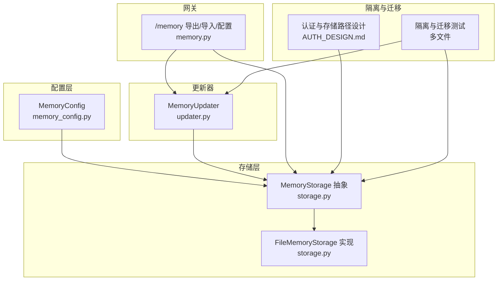
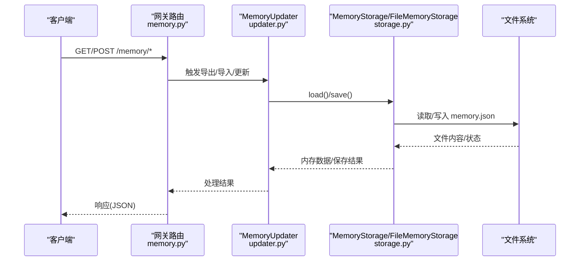
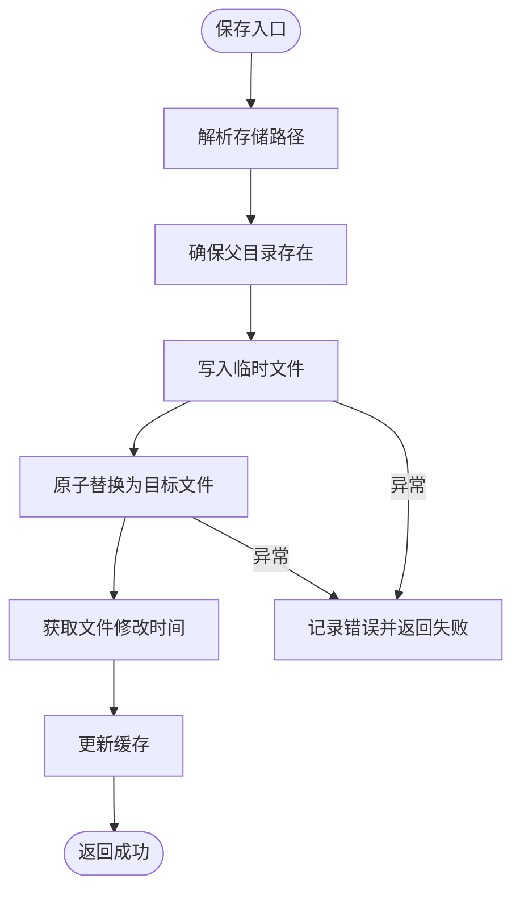
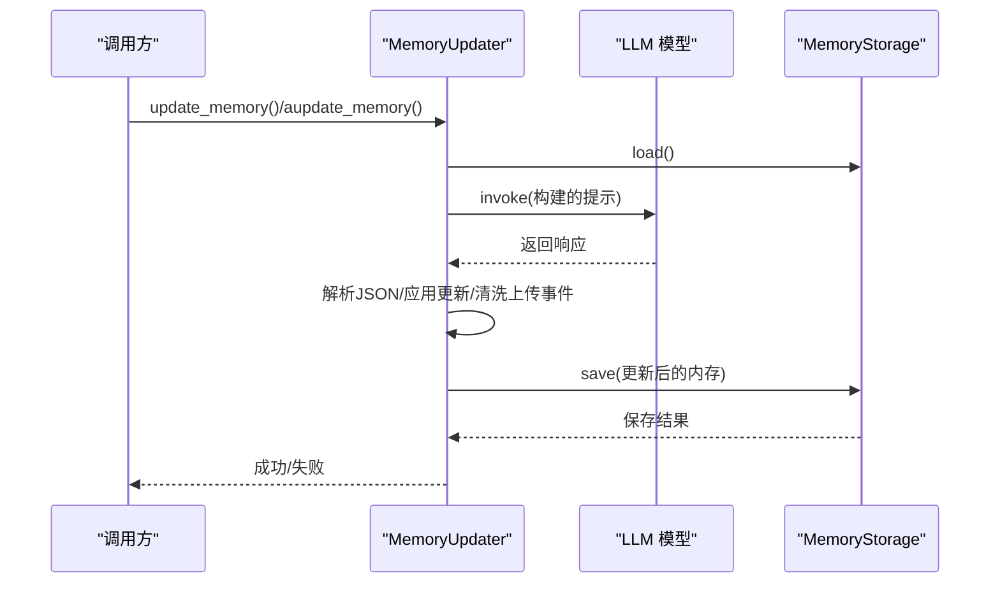
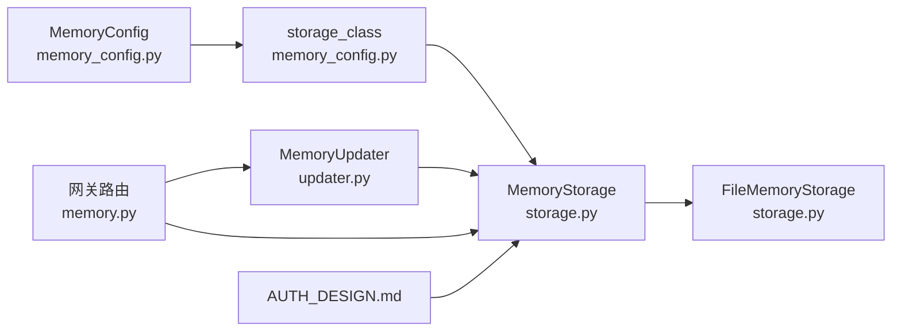

# 内存配置

<cite>
**本文引用的文件**
- [memory_config.py](file://backend/packages/harness/deerflow/config/memory_config.py)
- [storage.py](file://backend/packages/harness/deerflow/agents/memory/storage.py)
- [updater.py](file://backend/packages/harness/deerflow/agents/memory/updater.py)
- [memory.py](file://backend/packages/harness/deerflow/persistence/thread_meta/memory.py)
- [memory.py](file://backend/packages/harness/deerflow/runtime/events/store/memory.py)
- [memory.py](file://backend/packages/harness/deerflow/runtime/runs/store/memory.py)
- [memory.py](file://backend/packages/harness/deerflow/runtime/stream_bridge/memory.py)
- [memory.py](file://backend/app/gateway/routers/memory.py)
- [AUTH_DESIGN.md](file://backend/docs/AUTH_DESIGN.md)
- [MEMORY_SETTINGS_REVIEW.md](file://backend/docs/MEMORY_SETTINGS_REVIEW.md)
- [test_memory_storage_user_isolation.py](file://backend/tests/test_memory_storage_user_isolation.py)
- [test_memory_updater_user_isolation.py](file://backend/tests/test_memory_updater_user_isolation.py)
- [test_memory_thread_meta_isolation.py](file://backend/tests/test_memory_thread_meta_isolation.py)
- [test_migration_user_isolation.py](file://backend/tests/test_migration_user_isolation.py)
</cite>

## 目录
1. [简介](#简介)
2. [项目结构](#项目结构)
3. [核心组件](#核心组件)
4. [架构总览](#架构总览)
5. [详细组件分析](#详细组件分析)
6. [依赖分析](#依赖分析)
7. [性能考虑](#性能考虑)
8. [故障排查指南](#故障排查指南)
9. [结论](#结论)
10. [附录](#附录)

## 简介
本文件面向 DeerFlow 的长期记忆系统，系统性梳理内存配置项、存储路径解析规则、事实与摘要的持久化策略、用户隔离机制、以及性能调优与故障恢复建议。内容以代码为依据，辅以架构图与时序图，帮助读者快速理解并正确配置与运维。

## 项目结构
与内存配置直接相关的关键模块分布如下：
- 配置层：定义内存开关、存储路径、存储类、去抖动间隔、模型名、事实上限与置信阈值、是否注入提示词及注入的最大 token 数等。
- 存储层：抽象存储接口与文件存储实现，负责加载/重载/保存、缓存、路径解析、原子写入与错误降级。
- 更新器：基于对话上下文与提示模板，调用模型生成记忆更新 JSON，解析并应用更新，控制事实增删与上限裁剪。
- 网关路由：提供导出/导入/查看配置等管理接口。
- 隔离与迁移：认证设计文档说明 per-user 默认存储路径与绝对路径的 opt-out 行为；测试覆盖存储隔离、更新隔离、线程元数据隔离与迁移脚本。

图表来源
- [memory_config.py:1-84](file://backend/packages/harness/deerflow/config/memory_config.py#L1-L84)
- [storage.py:43-232](file://backend/packages/harness/deerflow/agents/memory/storage.py#L43-L232)
- [updater.py:380-710](file://backend/packages/harness/deerflow/agents/memory/updater.py#L380-L710)
- [memory.py:259-302](file://backend/app/gateway/routers/memory.py#L259-L302)
- [AUTH_DESIGN.md:220-254](file://backend/docs/AUTH_DESIGN.md#L220-L254)

章节来源
- [memory_config.py:1-84](file://backend/packages/harness/deerflow/config/memory_config.py#L1-L84)
- [storage.py:43-232](file://backend/packages/harness/deerflow/agents/memory/storage.py#L43-L232)
- [updater.py:380-710](file://backend/packages/harness/deerflow/agents/memory/updater.py#L380-L710)
- [memory.py:259-302](file://backend/app/gateway/routers/memory.py#L259-L302)
- [AUTH_DESIGN.md:220-254](file://backend/docs/AUTH_DESIGN.md#L220-L254)

## 核心组件
- 内存配置对象：包含启用开关、存储路径、存储类、去抖动秒数、模型名、事实上限、事实置信阈值、是否注入提示词、注入最大 token 数等字段。
- 存储接口与文件存储：支持 per-user 默认路径、绝对路径 opt-out、相对路径解析、文件缓存与并发安全、原子写入与临时文件、异常降级。
- 记忆更新器：从对话构建更新提示，调用模型生成 JSON，解析并应用更新，过滤上传事件、按置信度裁剪事实、记录更新时间戳。
- 网关路由：提供导出/导入/查看配置等管理能力，异常时返回 500。
- 隔离与迁移：默认 per-user 路径，绝对路径 opt-out 共享；迁移脚本处理 legacy 数据迁移与备份。

章节来源
- [memory_config.py:6-62](file://backend/packages/harness/deerflow/config/memory_config.py#L6-L62)
- [storage.py:62-190](file://backend/packages/harness/deerflow/agents/memory/storage.py#L62-L190)
- [updater.py:467-598](file://backend/packages/harness/deerflow/agents/memory/updater.py#L467-L598)
- [memory.py:259-302](file://backend/app/gateway/routers/memory.py#L259-L302)
- [AUTH_DESIGN.md:220-254](file://backend/docs/AUTH_DESIGN.md#L220-L254)

## 架构总览
下图展示从网关到存储与更新器的整体交互流程，以及用户隔离与存储路径解析的关键节点。

图表来源
- [memory.py:259-302](file://backend/app/gateway/routers/memory.py#L259-L302)
- [updater.py:51-78](file://backend/packages/harness/deerflow/agents/memory/updater.py#L51-L78)
- [storage.py:104-189](file://backend/packages/harness/deerflow/agents/memory/storage.py#L104-L189)

## 详细组件分析

### 配置对象与参数详解
- enabled：是否启用记忆机制。
- storage_path：存储路径规则
  - 空字符串：默认 per-user 路径 {base_dir}/users/{user_id}/memory.json
  - 绝对路径：opt-out per-user 隔离，所有用户共享同一文件
  - 相对路径：相对于 Paths.base_dir 解析（非后端工作目录）
- storage_class：存储提供者类路径，默认 FileMemoryStorage
- debounce_seconds：队列更新去抖动等待秒数（1~300）
- model_name：用于记忆更新的模型名（None 表示使用默认模型）
- max_facts：事实最大数量（10~500）
- fact_confidence_threshold：事实置信度阈值（0.0~1.0）
- injection_enabled：是否将记忆注入系统提示词
- max_injection_tokens：注入提示词的最大 token 数（100~8000）

章节来源
- [memory_config.py:9-62](file://backend/packages/harness/deerflow/config/memory_config.py#L9-L62)

### 存储路径解析与用户隔离
- 默认 per-user 路径：当存在 user_id 且 storage_path 为空或为相对路径时，使用 {base_dir}/users/{user_id}/memory.json
- 绝对路径 opt-out：若 storage_path 为绝对路径，则所有用户共享该文件，退出 per-user 隔离
- 相对路径解析：始终相对于 Paths.base_dir，而非后端工作目录
- 旧布局兼容：旧版共享 agent 目录仅作为只读回退，更新/删除需先运行迁移脚本
- 内部调用：无认证上下文时落到 default 用户桶，适用于内部调用或无 HTTP 的本地执行

章节来源
- [AUTH_DESIGN.md:220-254](file://backend/docs/AUTH_DESIGN.md#L220-L254)
- [storage.py:84-102](file://backend/packages/harness/deerflow/agents/memory/storage.py#L84-L102)

### 文件存储实现与原子写入
- 缓存策略：按 (user_id, agent_name) 键缓存内存数据与文件修改时间，读写受锁保护
- 加载/重载：不存在则返回空结构；加载失败或解码失败时降级为空结构
- 保存：父目录自动创建；写入临时文件后原子替换；更新缓存并记录日志；失败时记录错误并返回 False
- 并发安全：全局锁保证实例级并发安全；缓存读写加锁
- 异常降级：加载/保存异常均记录警告/错误并返回安全结果

图表来源
- [storage.py:160-189](file://backend/packages/harness/deerflow/agents/memory/storage.py#L160-L189)

章节来源
- [storage.py:62-190](file://backend/packages/harness/deerflow/agents/memory/storage.py#L62-L190)

### 记忆更新流程与事实治理
- 提示构建：从对话提取文本，结合当前记忆与可选修正/强化提示，构造更新提示
- 模型调用：同步路径避免跨循环连接复用问题；异步场景通过线程池执行同步调用
- 响应解析：从大段输出中提取首个有效 JSON 对象，严格校验必需键
- 应用更新：按用户/历史区段更新摘要与更新时间；移除指定事实；新增新事实并去重；按置信度裁剪至上限
- 上传事件清洗：移除关于文件上传的语句，避免未来会话搜索不存在的文件

图表来源
- [updater.py:467-598](file://backend/packages/harness/deerflow/agents/memory/updater.py#L467-L598)
- [updater.py:600-684](file://backend/packages/harness/deerflow/agents/memory/updater.py#L600-L684)

章节来源
- [updater.py:380-710](file://backend/packages/harness/deerflow/agents/memory/updater.py#L380-L710)

### 上下文持久化参数与检索策略
- 最大历史长度：由 max_facts 控制事实总数上限，超过后按置信度降序保留前 N 个
- 摘要策略：用户与历史区段分别维护摘要与 updatedAt 时间戳，仅在 shouldUpdate 为真且提供了 summary 时才更新
- 检索算法：当前实现未暴露专用检索算法配置；可通过 injection_enabled 与 max_injection_tokens 控制注入提示词规模，间接影响检索效果

章节来源
- [memory_config.py:41-62](file://backend/packages/harness/deerflow/config/memory_config.py#L41-L62)
- [updater.py:619-642](file://backend/packages/harness/deerflow/agents/memory/updater.py#L619-L642)

### 用户隔离机制与迁移
- 默认 per-user 隔离：当存在 user_id 时，memory.json 位于 {base_dir}/users/{user_id}/ 下
- 绝对路径 opt-out：storage_path 为绝对路径时，所有用户共享同一 memory.json
- 迁移脚本：将 legacy memory.json 迁移到 per-user 结构；若目标已存在则保留并生成 .legacy.json 备份
- 测试覆盖：存储隔离、更新隔离、线程元数据隔离与迁移脚本行为均有测试保障

章节来源
- [AUTH_DESIGN.md:220-254](file://backend/docs/AUTH_DESIGN.md#L220-L254)
- [test_migration_user_isolation.py:96-128](file://backend/tests/test_migration_user_isolation.py#L96-L128)
- [test_memory_storage_user_isolation.py](file://backend/tests/test_memory_storage_user_isolation.py)
- [test_memory_updater_user_isolation.py](file://backend/tests/test_memory_updater_user_isolation.py)
- [test_memory_thread_meta_isolation.py](file://backend/tests/test_memory_thread_meta_isolation.py)

### 管理接口与数据导入导出
- 导出：返回当前全局内存数据，便于备份或迁移
- 导入：从 JSON 载入并覆盖当前内存数据；失败时返回 500
- 配置查询：返回当前内存系统配置

章节来源
- [memory.py:259-302](file://backend/app/gateway/routers/memory.py#L259-L302)

## 依赖分析
- 配置到存储：MemoryConfig 决定 storage_class 与路径解析规则，进而影响 FileMemoryStorage 的文件位置
- 更新器到存储：MemoryUpdater 通过 get_memory_storage() 获取存储实例，统一 load/save
- 网关到更新器/存储：路由层编排导出/导入/配置查询，内部委托给 MemoryUpdater 与存储
- 隔离与路径：AUTH_DESIGN.md 定义 per-user 默认路径与绝对路径 opt-out 行为，影响 storage.py 的路径解析

图表来源
- [memory_config.py:27-30](file://backend/packages/harness/deerflow/config/memory_config.py#L27-L30)
- [storage.py:196-231](file://backend/packages/harness/deerflow/agents/memory/storage.py#L196-L231)
- [updater.py:51-58](file://backend/packages/harness/deerflow/agents/memory/updater.py#L51-L58)
- [memory.py:259-302](file://backend/app/gateway/routers/memory.py#L259-L302)
- [AUTH_DESIGN.md:220-254](file://backend/docs/AUTH_DESIGN.md#L220-L254)

章节来源
- [memory_config.py:27-30](file://backend/packages/harness/deerflow/config/memory_config.py#L27-L30)
- [storage.py:196-231](file://backend/packages/harness/deerflow/agents/memory/storage.py#L196-L231)
- [updater.py:51-58](file://backend/packages/harness/deerflow/agents/memory/updater.py#L51-L58)
- [memory.py:259-302](file://backend/app/gateway/routers/memory.py#L259-L302)
- [AUTH_DESIGN.md:220-254](file://backend/docs/AUTH_DESIGN.md#L220-L254)

## 性能考虑
- 去抖动与批量更新：合理设置 debounce_seconds，避免频繁写入；在高并发场景减少不必要的更新触发
- 缓存命中率：利用 FileMemoryStorage 的缓存与 mtime 校验，降低重复读取开销；注意缓存大小与内存占用
- 写入路径优化：优先使用相对路径解析到 Paths.base_dir，避免频繁 IO；必要时使用绝对路径集中存储以简化运维
- 事实上限与置信度：通过 max_facts 与 fact_confidence_threshold 控制事实规模与质量，减少解析与注入成本
- 注入规模控制：injection_enabled 与 max_injection_tokens 影响提示词长度，建议根据模型上下文限制调整
- 异步与同步：异步场景使用线程池执行同步模型调用，避免跨循环连接复用问题；减少阻塞主线程

## 故障排查指南
- 导入失败：检查导入负载格式与权限；导入失败会返回 500，确认存储路径可写
- 加载异常：若文件损坏或权限不足，存储层会降级为空结构；检查文件编码与权限
- 保存失败：关注磁盘空间与权限；临时文件写入失败会记录错误并返回 False
- 隔离问题：确认 user_id 是否存在；绝对路径会退出 per-user 隔离；必要时运行迁移脚本
- 配置审查：使用 MEMORY_SETTINGS_REVIEW.md 中的最小步骤进行本地验证，包括添加/编辑/删除/清空记忆与搜索功能

章节来源
- [memory.py:284-288](file://backend/app/gateway/routers/memory.py#L284-L288)
- [storage.py:111-117](file://backend/packages/harness/deerflow/agents/memory/storage.py#L111-L117)
- [storage.py:187-189](file://backend/packages/harness/deerflow/agents/memory/storage.py#L187-L189)
- [MEMORY_SETTINGS_REVIEW.md:35-56](file://backend/docs/MEMORY_SETTINGS_REVIEW.md#L35-L56)

## 结论
DeerFlow 的内存配置围绕“可插拔存储 + per-user 隔离 + 事实治理”展开。通过合理设置存储路径、事实上限与注入规模，可在保证性能的同时提升长期记忆的准确性与稳定性。配合迁移脚本与测试用例，可平滑演进与验证变更。

## 附录
- 快速审查清单
  - 启动本地环境并加载样本数据
  - 在设置页面添加/编辑/删除/清空记忆并验证
  - 搜索功能与分类过滤可用
  - 运行迁移脚本验证 legacy 数据迁移

章节来源
- [MEMORY_SETTINGS_REVIEW.md:23-63](file://backend/docs/MEMORY_SETTINGS_REVIEW.md#L23-L63)