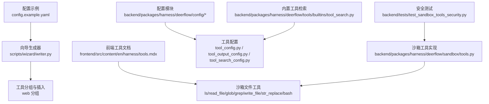
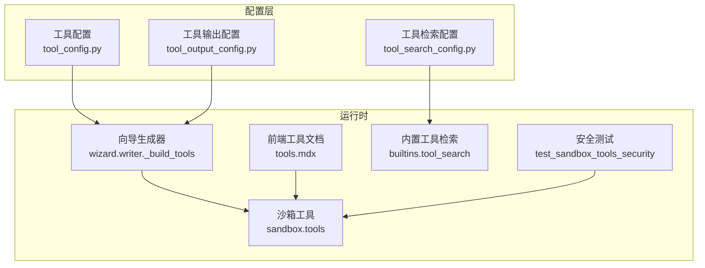
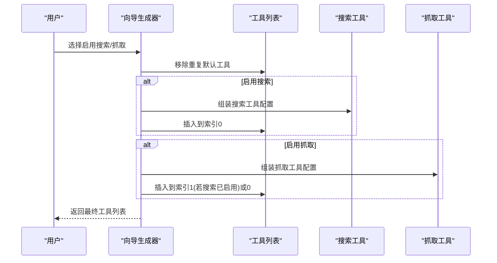
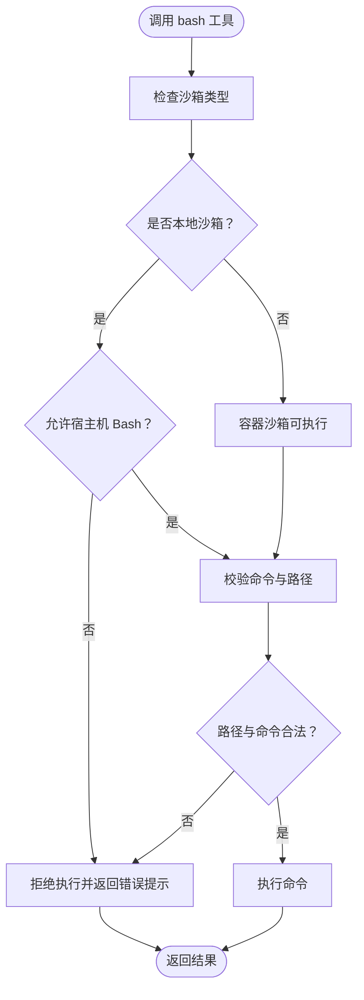
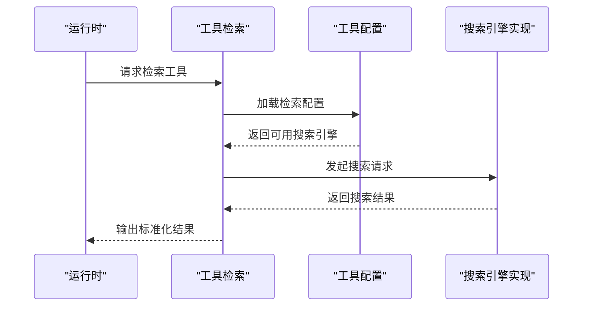
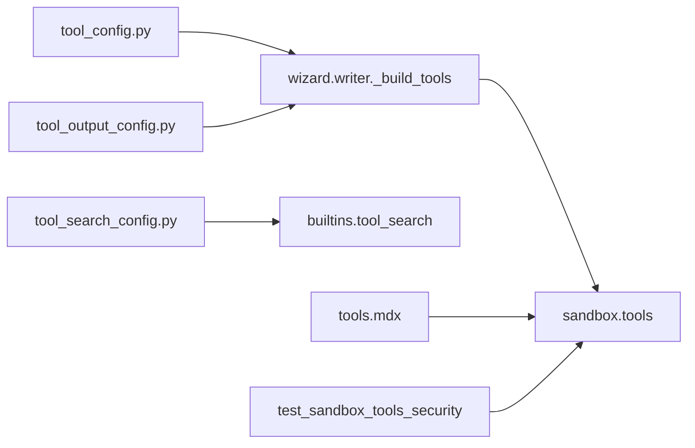

# 工具配置

<cite>
**本文引用的文件**
- [config.example.yaml](file://config.example.yaml)
- [writer.py](file://scripts/wizard/writer.py)
- [tools.mdx](file://frontend/src/content/en/harness/tools.mdx)
- [tool_config.py](file://backend/packages/harness/deerflow/config/tool_config.py)
- [tool_output_config.py](file://backend/packages/harness/deerflow/config/tool_output_config.py)
- [tool_search_config.py](file://backend/packages/harness/deerflow/config/tool_search_config.py)
- [sandbox_tools.py](file://backend/packages/harness/deerflow/sandbox/tools.py)
- [test_sandbox_tools_security.py](file://backend/tests/test_sandbox_tools_security.py)
- [builtins_toolkit.py](file://backend/packages/harness/deerflow/tools/builtins/tool_search.py)
</cite>

## 目录
1. [简介](#简介)
2. [项目结构](#项目结构)
3. [核心组件](#核心组件)
4. [架构总览](#架构总览)
5. [详细组件分析](#详细组件分析)
6. [依赖关系分析](#依赖关系分析)
7. [性能考量](#性能考量)
8. [故障排除指南](#故障排除指南)
9. [结论](#结论)
10. [附录](#附录)

## 简介
本文件面向 DeerFlow 的工具配置与使用，系统性阐述工具分组体系（如 web、file:read、file:write、bash 等），内置工具能力（web 搜索、网页抓取、文件操作、Shell 命令执行等），以及工具配置的通用模式（名称、分组、使用类路径、特定参数）。同时提供安全考虑、性能优化与故障排除建议，帮助用户在保证安全的前提下高效配置与使用工具。

## 项目结构
与工具配置直接相关的关键位置如下：
- 配置示例：config.example.yaml 提供 tools 字段的顶层配置样例
- 向导生成器：scripts/wizard/writer.py 负责根据用户选择动态组装工具列表，并按“web”分组插入搜索与抓取工具
- 前端文档：frontend/src/content/en/harness/tools.mdx 列出沙箱文件工具与 Bash 执行要求
- 配置模块：backend/packages/harness/deerflow/config 下包含工具相关配置子模块
- 沙箱工具：backend/packages/harness/deerflow/sandbox/tools.py 实现文件与命令执行工具
- 内置工具：backend/packages/harness/deerflow/tools/builtins/tool_search.py 提供工具检索能力
- 安全测试：backend/tests/test_sandbox_tools_security.py 验证 Bash 执行限制与路径校验

**图表来源**
- [config.example.yaml](file://config.example.yaml)
- [writer.py](file://scripts/wizard/writer.py)
- [tools.mdx](file://frontend/src/content/en/harness/tools.mdx)
- [tool_config.py](file://backend/packages/harness/deerflow/config/tool_config.py)
- [tool_output_config.py](file://backend/packages/harness/deerflow/config/tool_output_config.py)
- [tool_search_config.py](file://backend/packages/harness/deerflow/config/tool_search_config.py)
- [sandbox_tools.py](file://backend/packages/harness/deerflow/sandbox/tools.py)
- [builtins_toolkit.py](file://backend/packages/harness/deerflow/tools/builtins/tool_search.py)
- [test_sandbox_tools_security.py](file://backend/tests/test_sandbox_tools_security.py)

**章节来源**
- [config.example.yaml](file://config.example.yaml)
- [writer.py](file://scripts/wizard/writer.py)
- [tools.mdx](file://frontend/src/content/en/harness/tools.mdx)

## 核心组件
- 工具分组系统
  - web 分组：用于统一管理搜索与抓取类工具，便于权限控制与审计
  - file:read / file:write 分组：用于区分只读与写入类文件操作工具
  - bash 分组：用于 Shell 命令执行工具，通常需要更严格的安全策略
- 内置工具
  - web_search / web_fetch：通过社区搜索工具集成（如 DDG、Tavily、Serper 等）实现网页搜索与内容抓取
  - 文件操作工具：ls、read_file、glob、grep、write_file、str_replace
  - Shell 工具：bash（需沙箱或允许宿主机 Bash）
- 工具配置模式
  - 名称：唯一标识工具
  - 分组：决定工具可见性与权限范围
  - 使用类路径：指向具体实现
  - 特定参数：如超时、并发、输出格式等

**章节来源**
- [writer.py](file://scripts/wizard/writer.py)
- [tools.mdx](file://frontend/src/content/en/harness/tools.mdx)
- [sandbox_tools.py](file://backend/packages/harness/deerflow/sandbox/tools.py)

## 架构总览
下图展示工具配置在系统中的位置与交互：

**图表来源**
- [tool_config.py](file://backend/packages/harness/deerflow/config/tool_config.py)
- [tool_output_config.py](file://backend/packages/harness/deerflow/config/tool_output_config.py)
- [tool_search_config.py](file://backend/packages/harness/deerflow/config/tool_search_config.py)
- [writer.py](file://scripts/wizard/writer.py)
- [tools.mdx](file://frontend/src/content/en/harness/tools.mdx)
- [sandbox_tools.py](file://backend/packages/harness/deerflow/sandbox/tools.py)
- [builtins_toolkit.py](file://backend/packages/harness/deerflow/tools/builtins/tool_search.py)
- [test_sandbox_tools_security.py](file://backend/tests/test_sandbox_tools_security.py)

## 详细组件分析

### 工具分组与插入流程
- 向导根据用户输入动态构建工具列表，移除默认重复项后，按顺序插入搜索与抓取工具，并统一归入“web”分组
- 插入顺序确保搜索工具优先于抓取工具，便于先定位再获取内容

**图表来源**
- [writer.py](file://scripts/wizard/writer.py)

**章节来源**
- [writer.py](file://scripts/wizard/writer.py)

### 沙箱文件工具与 Bash 执行
- 文件工具族：ls、read_file、glob、grep、write_file、str_replace
- Bash 工具：执行 Shell 命令，需要满足以下条件之一：
  - 允许宿主机 Bash（allow_host_bash: true）
  - 使用容器沙箱
- 安全策略：对 Bash 命令进行路径校验，拒绝不安全路径与越权访问；本地沙箱默认禁止宿主机 Bash

**图表来源**
- [tools.mdx](file://frontend/src/content/en/harness/tools.mdx)
- [test_sandbox_tools_security.py](file://backend/tests/test_sandbox_tools_security.py)

**章节来源**
- [tools.mdx](file://frontend/src/content/en/harness/tools.mdx)
- [test_sandbox_tools_security.py](file://backend/tests/test_sandbox_tools_security.py)

### 内置工具检索与配置
- 工具检索：内置工具提供检索能力，支持从多个搜索引擎中选择与配置
- 配置入口：通过工具检索配置模块加载与覆盖默认行为

**图表来源**
- [builtins_toolkit.py](file://backend/packages/harness/deerflow/tools/builtins/tool_search.py)
- [tool_search_config.py](file://backend/packages/harness/deerflow/config/tool_search_config.py)

**章节来源**
- [builtins_toolkit.py](file://backend/packages/harness/deerflow/tools/builtins/tool_search.py)
- [tool_search_config.py](file://backend/packages/harness/deerflow/config/tool_search_config.py)

## 依赖关系分析
- 工具配置模块依赖
  - tool_config.py：定义工具通用配置接口
  - tool_output_config.py：定义工具输出预算与截断策略
  - tool_search_config.py：定义搜索类工具的配置与提供商选择
- 运行时依赖
  - 向导生成器依赖配置示例与前端文档，确保工具分组与参数正确
  - 沙箱工具依赖安全策略与测试用例，保障 Bash 执行安全

**图表来源**
- [tool_config.py](file://backend/packages/harness/deerflow/config/tool_config.py)
- [tool_output_config.py](file://backend/packages/harness/deerflow/config/tool_output_config.py)
- [tool_search_config.py](file://backend/packages/harness/deerflow/config/tool_search_config.py)
- [writer.py](file://scripts/wizard/writer.py)
- [sandbox_tools.py](file://backend/packages/harness/deerflow/sandbox/tools.py)
- [builtins_toolkit.py](file://backend/packages/harness/deerflow/tools/builtins/tool_search.py)
- [tools.mdx](file://frontend/src/content/en/harness/tools.mdx)
- [test_sandbox_tools_security.py](file://backend/tests/test_sandbox_tools_security.py)

**章节来源**
- [tool_config.py](file://backend/packages/harness/deerflow/config/tool_config.py)
- [tool_output_config.py](file://backend/packages/harness/deerflow/config/tool_output_config.py)
- [tool_search_config.py](file://backend/packages/harness/deerflow/config/tool_search_config.py)
- [writer.py](file://scripts/wizard/writer.py)
- [sandbox_tools.py](file://backend/packages/harness/deerflow/sandbox/tools.py)
- [builtins_toolkit.py](file://backend/packages/harness/deerflow/tools/builtins/tool_search.py)
- [tools.mdx](file://frontend/src/content/en/harness/tools.mdx)
- [test_sandbox_tools_security.py](file://backend/tests/test_sandbox_tools_security.py)

## 性能考量
- 搜索工具
  - 合理设置超时与并发，避免阻塞主流程
  - 对搜索结果进行裁剪与去重，减少下游处理压力
- 文件工具
  - 大文件读取建议使用流式处理或分块读取
  - glob 与 grep 应限定目录范围与文件类型，避免全盘扫描
- Bash 工具
  - 尽可能使用容器沙箱，避免宿主机 Bash 的系统开销与风险
  - 合理设置命令执行时间上限，防止长时间占用资源

## 故障排除指南
- 搜索/抓取工具未生效
  - 检查工具是否被插入到“web”分组且未被过滤
  - 确认额外配置（如提供商密钥、超时参数）是否正确
- 文件工具报错
  - 核对沙箱是否已配置并处于激活状态
  - 检查目标路径是否存在、权限是否足够
- Bash 工具被拒绝
  - 若为本地沙箱，默认禁止宿主机 Bash，需开启 allow_host_bash 或切换至容器沙箱
  - 检查命令路径是否包含不被允许的相对路径或越权操作
- 输出过大导致性能问题
  - 通过工具输出配置限制输出大小与格式
  - 在工具检索配置中启用结果裁剪与摘要策略

**章节来源**
- [writer.py](file://scripts/wizard/writer.py)
- [tools.mdx](file://frontend/src/content/en/harness/tools.mdx)
- [test_sandbox_tools_security.py](file://backend/tests/test_sandbox_tools_security.py)
- [tool_output_config.py](file://backend/packages/harness/deerflow/config/tool_output_config.py)
- [tool_search_config.py](file://backend/packages/harness/deerflow/config/tool_search_config.py)

## 结论
DeerFlow 的工具配置以“分组+参数”的方式实现灵活组合与安全控制。通过向导生成器与配置模块协同，用户可以快速装配搜索、抓取、文件与 Shell 工具；借助沙箱与安全策略，保障工具执行的安全边界。建议在生产环境中优先采用容器沙箱与严格的输出预算策略，并结合搜索配置实现高性能与高可用的工具链。

## 附录
- 配置参考
  - 参考配置示例文件中的 tools 字段，了解工具名称、分组与参数的基本写法
- 常见工具清单
  - 搜索与抓取：web_search、web_fetch（由社区工具提供）
  - 文件操作：ls、read_file、glob、grep、write_file、str_replace
  - 命令执行：bash（需沙箱或允许宿主机 Bash）

**章节来源**
- [config.example.yaml](file://config.example.yaml)
- [tools.mdx](file://frontend/src/content/en/harness/tools.mdx)